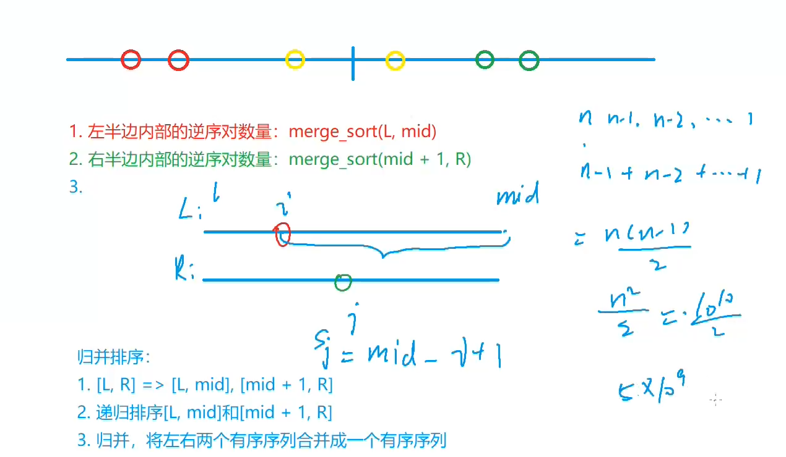

# AcWing 算法基础课 -- 基础算法

## AcWing 788. 逆序对的数量 

`难度：简单`

### 题目描述

给定一个长度为n的整数数列，请你计算数列中的逆序对的数量。

逆序对的定义如下：对于数列的第 i 个和第 j 个元素，如果满足 i < j 且 a[i] > a[j]，则其为一个逆序对；否则不是。

**输入格式**

第一行包含整数n，表示数列的长度。

第二行包含 n 个整数，表示整个数列。

**输出格式**

输出一个整数，表示逆序对的个数。

**数据范围**

$1≤n≤100000$

```r
输入样例：

6
2 3 4 5 6 1

输出样例：

5
```

### Solution

1. 分析左右两半部分，如果左半部分 q[i] 大于右半部分的 q[j]，那么从 i 到 mid 都可以和 j 组成逆序对，逆序对个数 res += mid - i + 1

```java
import java.util.*;
import java.io.*;

class Main{
    static int N = 100010;
    static long res = 0;
    static int[] q = new int[N];
    static int[] tmp = new int[N];
    public static void main(String[] args) throws IOException{
        BufferedReader br = new BufferedReader(new InputStreamReader(System.in));
        int n = Integer.parseInt(br.readLine());
        String[] s = br.readLine().split(" ");
        for(int i = 0; i < n; i++){
            q[i] = Integer.parseInt(s[i]);
        }
        
        mergeSort(0, n - 1);
        System.out.println(res);
    }
    public static void mergeSort(int l, int r){
        if(l >= r) return;
        int mid = l + r >> 1;
        mergeSort(l, mid);
        mergeSort(mid + 1, r);
        int k = 0, i = l, j = mid + 1;
        while(i <= mid && j <= r){
            if(q[i] <= q[j]) tmp[k++] = q[i++];
            else {
                res += mid - i + 1;
                tmp[k++] = q[j++];
            }
        }
        while(i <= mid) tmp[k++] = q[i++];
        while(j <= r) tmp[k++] = q[j++];
        for(i = l, j = 0; i <= r; i++, j++) q[i] = tmp[j]; 
    }
}
```

### yxc

