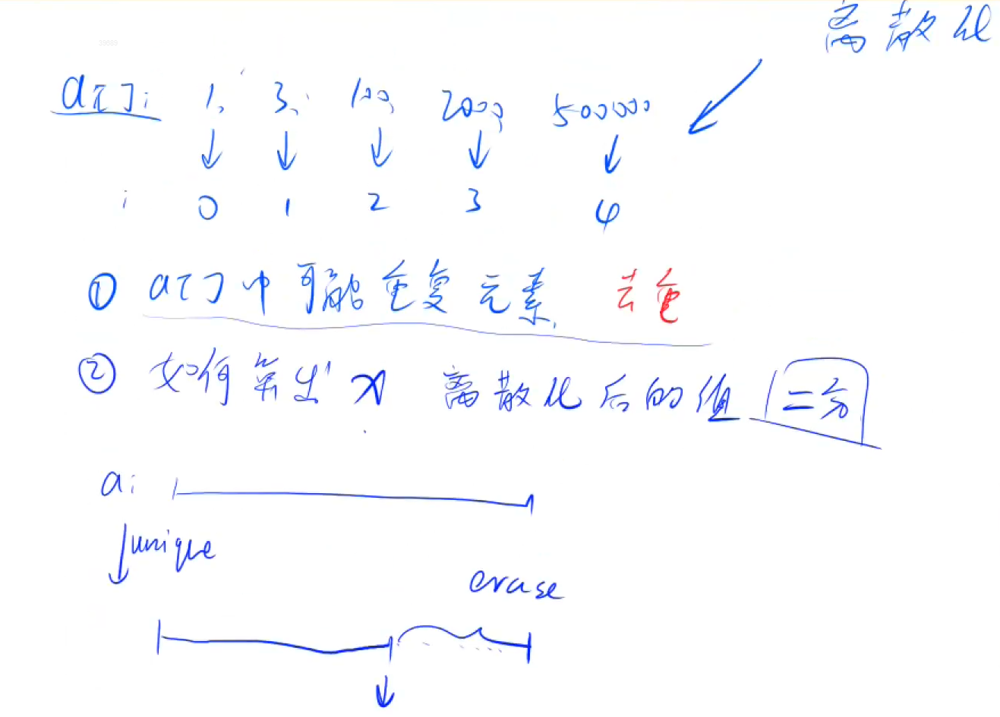

# AcWing 算法基础课 -- 基础算法

## AcWing 802. 区间和 

`难度：简单`

### 题目描述

假定有一个无限长的数轴，数轴上每个坐标上的数都是0。

现在，我们首先进行 n 次操作，每次操作将某一位置x上的数加c。

接下来，进行 m 次询问，每个询问包含两个整数l和r，你需要求出在区间[l, r]之间的所有数的和。

**输入格式**

第一行包含两个整数n和m。

接下来 n 行，每行包含两个整数x和c。

再接下里 m 行，每行包含两个整数l和r。

**输出格式**

共m行，每行输出一个询问中所求的区间内数字和。

数据范围

$ −10^9≤x≤10^9,$
$ 1≤n,m≤10^5,$
$ −10^9≤l≤r≤10^9,$
$ −10000≤c≤10000$
```r
输入样例：

3 3
1 2
3 6
7 5
1 3
4 6
7 8

输出样例：

8
0
5
```

### Solution

1. 用题目中会用到的数字最多有 3 * 10^5，可以用来离散化表示 10^9
2. alls 存所有用到的下标，adds 存所有添加操作，querys 存所有查询操作
3. a 存执行添加操作之后的下标的值，q 存前缀和

用二维数组代替 Pairs，用数组代替 List，速度快了一倍

```java
import java.util.*;
import java.io.*;

class Main{
    static final int N = 100010;
    static int[] a = new int[3 * N];
    static int[] q = new int[3 * N];
    static int[][] adds = new int[N][2];
    static int[][] querys = new int[N][2];
    static int[] alls = new int[3 * N];
    public static int unique(int[] alls, int n){
        // 双指针
        int j = 0;
        for(int i = 0; i < n; i++){
            if(i == 0 || alls[i] != alls[i - 1]){
                alls[j] = alls[i];
                j++;
            }
        }
        return j;
    }
    public static int bsearch(int[] alls, int n, int x){
        int low = 0, high = n - 1;
        while(low <= high){
            int mid = low + high >> 1;
            if(alls[mid] > x) high = mid - 1;
            else if(alls[mid] < x) low = mid + 1;
            else return mid + 1;
        }
        return low;
    }
    public static void main(String[] args) throws IOException{
        BufferedReader br = new BufferedReader(new InputStreamReader(System.in));
        BufferedWriter bw = new BufferedWriter(new OutputStreamWriter(System.out));
        String[] s = br.readLine().split(" ");
        int n = Integer.parseInt(s[0]);
        int m = Integer.parseInt(s[1]);
        // 下标
        int idx = 0, idx1 = 0;
        // 存插入
        for(int i = 0; i < n; i++){
            s = br.readLine().split(" ");
            int x = Integer.parseInt(s[0]);
            int c = Integer.parseInt(s[1]);
            alls[idx++] = x;
            adds[i][0] = x;
            adds[i][1] = c;
        }
        for(int i = 0; i < m; i++){
            s = br.readLine().split(" ");
            int l = Integer.parseInt(s[0]);
            int r = Integer.parseInt(s[1]);
            alls[idx++] = l;
            alls[idx++] = r;
            querys[i][0] = l;
            querys[i][1] = r;
        }
        // alls(0, idx - 1) 排序
        Arrays.sort(alls, 0, idx);
        // 去重
        int end = unique(alls, idx);
        // 添加操作
        for(int i = 0; i < n; i++){
            // 二分查找找到 x 在 alls 数组中的下标
            int t = bsearch(alls, end, adds[i][0]);
            a[t] += adds[i][1];
        }
        // 计算前缀和
        for(int i = 1; i <= end; i++){
            q[i] = q[i - 1] + a[i];
        }
        for(int i = 0; i < m; i++){
            int l = bsearch(alls, end, querys[i][0]);
            int r = bsearch(alls, end, querys[i][1]);
            bw.write(q[r] - q[l - 1] + "\n");
        }
        bw.close();
        br.close();
        
    }
}
```

用了 List 和 Pairs，效率不高

```java
import java.util.*;
import java.io.*;

public class Main{
    static class Pairs{
        int first, second;
        public Pairs(int first, int second){
            this.first = first;
            this.second = second;
        }
    }
    public static void main(String[] args) throws IOException{
        BufferedReader in = new BufferedReader(new InputStreamReader(System.in));
        BufferedWriter out = new BufferedWriter(new OutputStreamWriter(System.out));
        String[] s = in.readLine().split(" ");
        int n = Integer.parseInt(s[0]);
        int m = Integer.parseInt(s[1]);
        // 数据范围为 10 的 9 次方,如果直接一个数组来存,空间就会超出限制
        // 但是操作数和查询数只有 10 的 5 次方
        // 想到用离散化的方式,用 10 的 5 次方的长度表示 10 的 9 次方的量级
        // 申请的数组长度 n + m + m + 10 就可以,加个 10 防止边界问题
        int N = n + m + m + 10;
        // a[] 去重,离散化之后的数组
        int[] a = new int[N];
        // p[] a的前缀和
        int[] p = new int[N];
        // adds 记录添加操作
        List<Pairs> adds = new ArrayList<>();
        // querys 记录查询操作
        List<Pairs> querys = new ArrayList<>();
        // alls 记录所有在数轴上出现过的坐标
        List<Integer> alls = new ArrayList<>();
        for(int i = 0; i < n; i++){
            s = in.readLine().split(" ");
            int x = Integer.parseInt(s[0]);
            int c = Integer.parseInt(s[1]);
            adds.add(new Pairs(x, c));
            alls.add(x);
        }
        
        for(int i = 0; i < m; i++){
            s = in.readLine().split(" ");
            int l = Integer.parseInt(s[0]);
            int r = Integer.parseInt(s[1]);
            
            querys.add(new Pairs(l, r));
            alls.add(l);
            alls.add(r);
        }
        // 排序
        Collections.sort(alls);
        // 去重
        int end = unique(alls);
        alls = alls.subList(0, end);

        // 离散化,就是找到要插入或者查询的数字在 alls 的位置
        // 可以用二分查找
        // 插入
        // 返回值以 1 开始计数
        for(int i = 0; i < n; i++){
            int index = bsearch(adds.get(i).first, alls);
            a[index] += adds.get(i).second;
        }

        // 计算前缀和
        for(int i = 1; i < N; i++){
            p[i] = p[i - 1] + a[i];
        }

        // 开始查询输出
        for(int i = 0; i < m; i++){
            int l = bsearch(querys.get(i).first, alls);
            int r = bsearch(querys.get(i).second, alls);
            int res = p[r] - p[l - 1];
            out.write(res + "\n");
            out.flush();
        }
    }
    public static int unique(List<Integer> list){
        int j = 0;
        for(int i = 0; i < list.size(); i++){
            if(i == 0 || list.get(i) != list.get(i - 1)){
                list.set(j, list.get(i));
                j++;
            }
        }
        return j;
    }
    public static int bsearch(int x, List<Integer> list){
        int l = 0, r = list.size() - 1;
        while(l <= r){
            int mid = l + r >> 1;
            if(list.get(mid) > x) r = mid - 1;
            else if(list.get(mid) < x) l = mid + 1;
            else return mid + 1;
        }
        return 1;
    }
}
```

### yxc

1. 离散化



