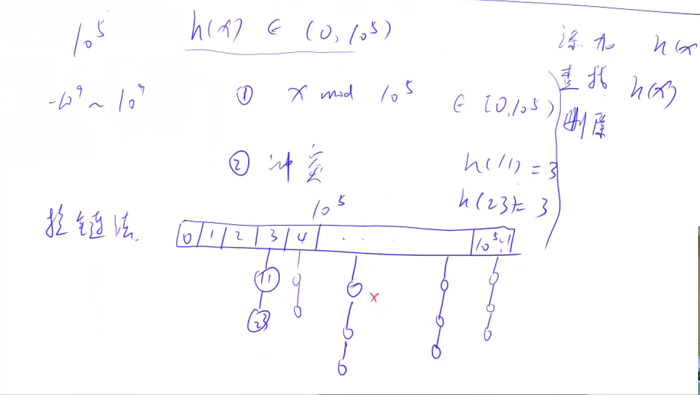

# AcWing 算法基础课 -- 数据结构

## AcWing 840. 模拟散列表 

`难度：简单`

### 题目描述

维护一个集合，支持如下几种操作：

- “I x”，插入一个数x；
- “Q x”，询问数x是否在集合中出现过；

现在要进行N次操作，对于每个询问操作输出对应的结果。

**输入格式**

第一行包含整数N，表示操作数量。

接下来N行，每行包含一个操作指令，操作指令为”I x”，”Q x”中的一种。

**输出格式**

对于每个询问指令“Q x”，输出一个询问结果，如果x在集合中出现过，则输出“Yes”，否则输出“No”。

每个结果占一行。

**数据范围**

$1≤N≤10^5$

$−10^9≤x≤10^9$

```r
输入样例：

5
I 1
I 2
I 3
Q 2
Q 5

输出样例：

Yes
No
```

### Solution

模拟散列表要注意两点：1. 哈希算法：x mod $10^5$(取模的值尽量取成质数，开放寻址法要取 2~3 倍的空间)；2. 解决冲突，开放寻址法或者拉链法。

1. 拉链法

```java
import java.util.*;
import java.io.*;

class Main{
    // 拉链法，哈希到相同位置拉一条单链表出来
    // 单链表就是用数组来模拟单链表，之前的例题已经做过了
    // N 要取最接近 100000 的质数
    public static int N = 100003;
    // h 数组下标是 x 哈希之后的值，存储的值相应 idx
    public static int[] h = new int[N];
    // e[idx] 表示 h 引出单链表下标为 idx 的值
    public static int[] e = new int[N];
    // ne[idx] 存储下标为 idx 的下一个位置的下标
    public static int[] ne = new int[N];
    // idx 单链表的下标，从 1 开始，因为 h 数组初始化为 0 代表空，如果 idx 从 0 开始，会矛盾
    public static int idx = 1;
    public static void main(String[] args) throws IOException{
        BufferedReader br = new BufferedReader(new InputStreamReader(System.in));
        BufferedWriter bw = new BufferedWriter(new OutputStreamWriter(System.out));
        int n = Integer.parseInt(br.readLine());
        String[] s;
        while(n-- > 0){
            s = br.readLine().split(" ");
            int x = Integer.parseInt(s[1]);
            if(s[0].equals("I")){
                insert(x);
            }
            else{
                boolean flag = query(x);
                if(flag) bw.write("Yes\n");
                else bw.write("No\n");
            }
        }
        bw.close();
        br.close();
    }
    public static void insert(int x){
        // 将 x 进行 hash 处理，+N 是为了防止负数取模仍然为负数
        int k = (x % N + N) % N;
        // 就是一个单链表,把 h[k] 当成头
        e[idx] = x;
        ne[idx] = h[k];
        h[k] = idx;
        idx++;
    }
    public static boolean query(int x){
        int k = (x % N + N) % N;
        // 从 h[k] 开始找,如果 i == 0,说明一条链表找完了
        for(int i = h[k]; i != 0; i = ne[i]){
            if(e[i] == x) return true;
        }
        return false;
    }
}
```

2. 开放寻址法

```java
import java.util.*;
import java.io.*;

public class Main{
    // N 初始化 2~3 倍空间的第一个质数
    public static final int N = 200003;
    public static final int NULL = 0x3f3f3f3f;
    public static int[] h = new int[N];
    public static void main(String[] args) throws IOException{
        BufferedReader br = new BufferedReader(new InputStreamReader(System.in));
        BufferedWriter bw = new BufferedWriter(new OutputStreamWriter(System.out));
        int n = Integer.parseInt(br.readLine());
        String[] s;
        // 初始化一个比 x 上限大的值
        Arrays.fill(h, NULL);
        while(n-- > 0){
            s = br.readLine().split(" ");
            int x = Integer.parseInt(s[1]);
            if(s[0].equals("I")){
                int idx = find(x);
                h[idx] = x;
            }
            else{
                if(h[find(x)] == NULL) bw.write("No\n");
                else bw.write("Yes\n");
            }
        }
        bw.close();
        br.close();
    }
    public static int find(int x){
        int k = (x % N + N) % N;
        while(h[k] != NULL && h[k] != x){
            k ++;
            if(k == N) k = 0;
        }
        return k;
    }
}
```

### yxc

