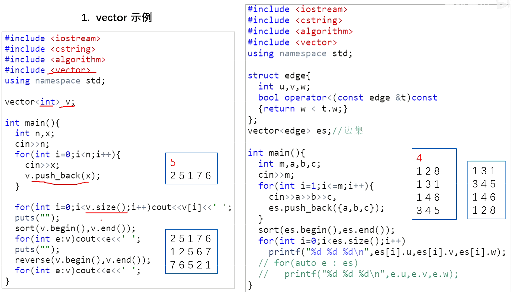

# C++ STL

# 容器

## A.string

| 操作 |    函数     |  符号   |
| ---- | :---------: | :-----: |
| 赋值 | assign（）  |    =    |
| 拼接 | append（）  |   +=    |
| 查找 |  find（）   |         |
| 替换 | repalce（） |         |
| 比较 | compare（） | ==  ！= |
| 存取 |   at（）    |   []    |
| 插入 | insert（）  |         |
| 删除 |  erase（）  |         |
| 截取 |  substr()   |         |


构造函数

```c++
string();//创建一个空的字符串 例如: string str;      
string(const string& str);//使用一个string对象初始化另一个string对象
string(const char* s);//使用字符串s初始化
string(int n, char c);//使用n个字符c初始化 
```

赋值操作

```c++
string& operator=(const char* s);//char*类型字符串 赋值给当前的字符串
string& operator=(const string &s);//把字符串s赋给当前的字符串
string& operator=(char c);//字符赋值给当前的字符串
string& assign(const char *s);//把字符串s赋给当前的字符串
string& assign(const char *s, int n);//把字符串s的前n个字符赋给当前的字符串
string& assign(const string &s);//把字符串s赋给当前字符串
string& assign(int n, char c);//用n个字符c赋给当前字符串
string& assign(const string &s, int start, int n);//将s从start开始n个字符赋值给字符串
```

存取操作

```c++
char& operator[](int n);//通过[]方式取字符
char& at(int n);//通过at方法获取字符
```

拼接操作

```c++
string& operator+=(const string& str);//重载+=操作符
string& operator+=(const char* str);//重载+=操作符
string& operator+=(const char c);//重载+=操作符
string& append(const char *s);//把字符串s连接到当前字符串结尾
string& append(const char *s, int n);//把字符串s的前n个字符连接到当前字符串结尾
string& append(const string &s);//同operator+=()
string& append(const string &s, int pos, int n);//把字符串s中从pos开始的n个字符连接到当前字符串结尾
string& append(int n, char c);//在当前字符串结尾添加n个字符c
```

查找替换

```c++
int find(const string& str, int pos = 0) const; //查找str第一次出现位置,从pos开始查找
int find(const char* s, int pos = 0) const;  //查找s第一次出现位置,从pos开始查找
int find(const char* s, int pos, int n) const;  //从pos位置查找s的前n个字符第一次位置
int find(const char c, int pos = 0) const;  //查找字符c第一次出现位置
int rfind(const string& str, int pos = npos) const;//查找str最后一次位置,从pos开始查找
int rfind(const char* s, int pos = npos) const;//查找s最后一次出现位置,从pos开始查找
int rfind(const char* s, int pos, int n) const;//从pos查找s的前n个字符最后一次位置
int rfind(const char c, int pos = 0) const; //查找字符c最后一次出现位置
string& replace(int pos, int n, const string& str); //替换从pos开始n个字符为字符串str
string& replace(int pos, int n, const char* s); //替换从pos开始的n个字符为字符串s
```

比较

```c++
/*compare函数在>时返回 1，<时返回 -1，==时返回 0。比较区分大小写，比较时参考字典顺序，排越前面的越小。大写的A比小写的a小。*/
int compare(const string &s) const;//与字符串s比较
int compare(const char *s) const;//与字符串s比较
```

子串

```c++
string substr(int pos = 0, int n = npos) const;//返回由pos开始的n个字符组成的字符串
```

插入删除

```c++
string& insert(int pos, const char* s); //插入字符串
string& insert(int pos, const string& str); //插入字符串
string& insert(int pos, int n, char c);//在指定位置插入n个字符c
string& erase(int pos, int n = npos);//删除从Pos开始的n个字符 
```

string和c-style字符串转换

```c++
//string 转 char*
string str = "it";
const char* cstr = str.c_str();
//char* 转 string 
char* s = "it";
string str(s);
```


## B.vector

动态数组


|   操作   |     函数     |      说明      |
| :------: | :----------: | :------------: |
|   尾增   | push_back()  |                |
|   尾删   |  pop_back()  |                |
|   头增   | push_front() |                |
|   头删   | pop_front()  |                |
|   插入   |  insert（）  |  迭代器+数据   |
|   删除   |  erase（）   | 迭代器指定位置 |
|   存取   |    at（）    |   也可以用[]   |
|   判空   |  empty（）   |      bool      |
|   容量   | capacity（） |                |
|   大小   |   size（）   |      int       |
| 重订大小 |   resize()   |                |
|   交换   |   swap（）   |                |
|   清除   |  clear（）   |                |
|   反转   | reverse（）  |                |
|   排序   |   sort（）   |    全局函数    |



**vector迭代器**

Vector维护一个线性空间，所以不论元素的型别如何，普通指针都可以作为vector的迭代器，因为vector迭代器所需要的操作行为，如operaroe*, operator->, operator++, operator–, operator+, operator-, operator+=, operator-=, 普通指针天生具备。

Vector支持随机存取，而普通指针正有着这样的能力。所以vector提供的是随机访问迭代器.

```c++
Vector<int>::iterator it1;
Vector<Teacher>::iterator it2;
```


构造函数

```c++
vector<T> v; //采用模板实现类实现，默认构造函数
vector(v.begin(), v.end());//将v[begin(), end())区间中的元素拷贝给本身。
vector(n, elem);//构造函数将n个elem拷贝给本身。
vector(const vector &vec);//拷贝构造函数。
```

赋值

```c++
assign(beg, end);//将[beg, end)区间中的数据拷贝赋值给本身。
assign(n, elem);//将n个elem拷贝赋值给本身。
vector& operator=(const vector  &vec);//重载等号操作符
swap(vec);// 将vec与本身的元素互换。
```

大小

```c++
size();//返回容器中元素的个数
empty();//判断容器是否为空
resize(int num);//重新指定容器的长度为num，若容器变长，则以默认值填充新位置。如果容器变短，则末尾超出容器长度的元素被删除。
resize(int num, elem);//重新指定容器的长度为num，若容器变长，则以elem值填充新位置。如果容器变短，则末尾超出容器长>度的元素被删除。
capacity();//容器的容量
reserve(int len);//容器预留len个元素长度，预留位置不初始化，元素不可访问。
```

数据存储

```c++
at(int idx); //返回索引idx所指的数据，如果idx越界，抛出out_of_range异常。
operator[];//返回索引idx所指的数据，越界时，运行直接报错
front();//返回容器中第一个数据元素
back();//返回容器中最后一个数据元素
```

插入删除

```c++
insert(const_iterator pos, int count,ele);//迭代器指向位置pos插入count个元素ele.
push_back(ele); //尾部插入元素ele
pop_back();//删除最后一个元素
erase(const_iterator start, const_iterator end);//删除迭代器从start到end之间的元素
erase(const_iterator pos);//删除迭代器指向的元素
clear();//删除容器中所有元素
```

巧用swap，收缩内存空间

```c++
int main(){

	vector<int> v;
	for (int i = 0; i < 100000;i ++){
		v.push_back(i);
	}
	cout << "capacity:" << v.capacity() << endl;
	cout << "size:" << v.size() << endl;
	//此时 通过resize改变容器大小
	v.resize(10);
	cout << "capacity:" << v.capacity() << endl;
	cout << "size:" << v.size() << endl;
	//容量没有改变
	vector<int>(v).swap(v);
	cout << "capacity:" << v.capacity() << endl;
	cout << "size:" << v.size() << endl;
	system("pause");
	return EXIT_SUCCESS;
}
```


## C.stack


|  操作  |  函数   | 说明 |
| :----: | :-----: | :--: |
|  入栈  | push()  |      |
|  出栈  |  pop()  |      |
|  栈顶  |  top()  |      |
|  判空  | empty() | bool |
| 栈大小 | size()  | int  |


**stack没有迭代器**
Stack所有元素的进出都必须符合”先进后出”的条件，只有stack顶端的元素，才有机会被外界取用。Stack不提供遍历功能，也不提供迭代器。

构造函数

```c++
stack<T> stkT;//stack采用模板类实现， stack对象的默认构造形式： 
stack(const stack &stk);//拷贝构造函数
```

赋值操作

```c++
stack& operator=(const stack &stk);//重载等号操作符
```

存取操作

```c++
push(elem);//向栈顶添加元素
pop();//从栈顶移除第一个元素
top();//返回栈顶元素
```

大小操作

```c++
empty();//判断堆栈是否为空
size();//返回堆栈的大小
```


## D.deque(双端数组)


| 操作 |     函数     |      说明      |
| :--: | :----------: | :------------: |
| 尾增 | push_back()  |                |
| 尾删 |  pop_back()  |                |
| 头增 | push_front() |                |
| 头删 | pop_front()  |                |
| 插入 |  insert（）  |  迭代器+数据   |
| 删除 |  erase（）   | 迭代器指定位置 |
| 存取 |    at（）    |   也可以用[]   |
| 判空 |  empty（）   |      bool      |
| 大小 |   size（）   |      int       |
| 交换 |   swap（）   |                |
| 清除 |  clear（）   |                |
| 反转 | reverse（）  |                |
| 排序 |   sort（）   |    全局函数    |


 构造函数

```c++
deque<T> deqT;//默认构造形式
deque(beg, end);//构造函数将[beg, end)区间中的元素拷贝给本身。
deque(n, elem);//构造函数将n个elem拷贝给本身。
deque(const deque &deq);//拷贝构造函数。
```

赋值操作

```c++
assign(beg, end);//将[beg, end)区间中的数据拷贝赋值给本身。
assign(n, elem);//将n个elem拷贝赋值给本身。
deque& operator=(const deque &deq); //重载等号操作符 
swap(deq);// 将deq与本身的元素互换
```

大小操作

```c++
deque.size();//返回容器中元素的个数
deque.empty();//判断容器是否为空
deque.resize(num);//重新指定容器的长度为num,若容器变长，则以默认值填充新位置。如果容器变短，则末尾超出容器长度的元素被删除。
deque.resize(num, elem); //重新指定容器的长度为num,若容器变长，则以elem值填充新位置,如果容器变短，则末尾超出容器长度的元素被删除。
```

双端插入和删除操作

```c++
push_back(elem);//在容器尾部添加一个数据
push_front(elem);//在容器头部插入一个数据
pop_back();//删除容器最后一个数据
pop_front();//删除容器第一个数据
```

存取操作

```c++
at(idx);//返回索引idx所指的数据，如果idx越界，抛出out_of_range。
operator[];//返回索引idx所指的数据，如果idx越界，不抛出异常，直接出错。
front();//返回第一个数据。
back();//返回最后一个数据
```

删除操作

```c++
clear();//移除容器的所有数据
erase(beg,end);//删除[beg,end)区间的数据，返回下一个数据的位置。
erase(pos);//删除pos位置的数据，返回下一个数据的位置。
```


## E.queue


|   操作   |  函数   | 说明 |
| :------: | :-----: | :--: |
|   入队   | push()  |      |
|   出队   |  pop()  |      |
|   队首   | front() |      |
|   队尾   | back()  |      |
|   判空   | empty() | bool |
| 队列长度 | size()  | int  |


**queue没有迭代器**

Queue所有元素的进出都必须符合”先进先出”的条件，只有queue的顶端元素，才有机会被外界取用。Queue不提供遍历功能，也不提供迭代器。

构造函数

```c++
queue<T> queT;//queue采用模板类实现，queue对象的默认构造形式：
queue(const queue &que);//拷贝构造函数
```

存取插入删除

```c++
push(elem);//往队尾添加元素
pop();//从队头移除第一个元素
back();//返回最后一个元素
front();//返回第一个元素
```

赋值操作

```c++
queue& operator=(const queue &que);//重载等号操作符
```

大小操作

```c++
empty();//判断队列是否为空
size();//返回队列的大小
```


## F.priority_queue


```c++
priority_queue<Type, Container, Functional>
Type 是数据类型；Container 是容器类型，一般使用vector；Functional 是比较的方式。
    
top 访问队头元素
empty 队列是否为空
size 返回队列内元素个数
push 插入元素到队尾并排序
emplace 原地构造一个元素并插入队列
pop 弹出队头元素
swap 交换内容  
    
//默认为大顶堆
priority_queue<int> q1;
//小顶堆
priority_queue<int, vector<int>, greater<int> > q2;
priority_queue<string, vector<string>, greater<string> >q4;
//大顶堆
priority_queue<int, vector<int>, less<int> >q3;
//字符串形式
```


## G.list(双向循环链表)


- 采用动态存储分配，不会造成内存浪费和溢出
- 链表执行插入和删除操作十分方便，修改指针即可，不需要移动大量元素
- 链表灵活，但是空间和时间额外耗费较大


**list容器的迭代器**
List容器不能像vector一样以普通指针作为迭代器，因为其节点不能保证在同一块连续的内存空间上。

List迭代器必须有能力指向list的节点，并有能力进行正确的递增、递减、取值、成员存取操作。所谓”list正确的递增，递减、取值、成员取用”是指，递增时指向下一个节点，递减时指向上一个节点，取值时取的是节点的数据值，成员取用时取的是节点的成员。

由于list是一个双向链表，迭代器必须能够具备前移、后移的能力，所以list容器提供的是Bidirectional Iterators.

List有一个重要的性质，插入操作和删除操作都不会造成原有list迭代器的失效。这在vector是不成立的，因为vector的插入操作可能造成记忆体重新配置，导致原有的迭代器全部失效，甚至List元素的删除，也只有被删除的那个元素的迭代器失效，其他迭代器不受任何影响。

```c++
#define _CRT_SECURE_NO_WARNINGS
#include<iostream>
#include<list>
using namespace std;

int main(){

	list<int> myList;
	for (int i = 0; i < 10; i ++){
		myList.push_back(i);
	}

	list<int>::_Nodeptr node =  myList._Myhead->_Next;

	for (int i = 0; i < myList._Mysize * 2;i++){
		cout << "Node:" << node->_Myval << endl;
		node = node->_Next;
		if (node == myList._Myhead){
			node = node->_Next;
		}
	}

	system("pause");
	return EXIT_SUCCESS;
}
```


| 操作 |     函数     |      说明      |
| :--: | :----------: | :------------: |
| 尾增 | push_back()  |                |
| 尾删 |  pop_back()  |                |
| 头增 | push_front() |                |
| 头删 | pop_front()  |                |
| 插入 |  insert（）  |  迭代器+数据   |
| 删除 |  erase（）   | 迭代器指定位置 |
|      |   remove()   | 可直接指定元素 |
| 存取 |    at（）    |   也可以用[]   |
| 判空 |  empty（）   |      bool      |
| 大小 |   size（）   |      int       |
| 交换 |   swap（）   |                |
| 清除 |  clear（）   |                |
| 反转 | reverse（）  |                |
| 排序 |   sort（）   |    全局函数    |

构造函数

```c++
list<T> lstT;//list采用采用模板类实现,对象的默认构造形式：
list(beg,end);//构造函数将[beg, end)区间中的元素拷贝给本身。
list(n,elem);//构造函数将n个elem拷贝给本身。
list(const list &lst);//拷贝构造函数。
```

插入删除

```c++
push_back(elem);//在容器尾部加入一个元素
pop_back();//删除容器中最后一个元素
push_front(elem);//在容器开头插入一个元素
pop_front();//从容器开头移除第一个元素
insert(pos,elem);//在pos位置插elem元素的拷贝，返回新数据的位置。
insert(pos,n,elem);//在pos位置插入n个elem数据，无返回值。
insert(pos,beg,end);//在pos位置插入[beg,end)区间的数据，无返回值。
clear();//移除容器的所有数据
erase(beg,end);//删除[beg,end)区间的数据，返回下一个数据的位置。
erase(pos);//删除pos位置的数据，返回下一个数据的位置。
remove(elem);//删除容器中所有与elem值匹配的元素。
```

大小操作

```c++
size();//返回容器中元素的个数
empty();//判断容器是否为空
resize(num);//重新指定容器的长度为num，
若容器变长，则以默认值填充新位置。
如果容器变短，则末尾超出容器长度的元素被删除。
resize(num, elem);//重新指定容器的长度为num，
若容器变长，则以elem值填充新位置。
如果容器变短，则末尾超出容器长度的元素被删除。
```

赋值操作

```c++
assign(beg, end);//将[beg, end)区间中的数据拷贝赋值给本身。
assign(n, elem);//将n个elem拷贝赋值给本身。
list& operator=(const list &lst);//重载等号操作符
swap(lst);//将lst与本身的元素互换。
```

数据存取

```c++
front();//返回第一个元素。
back();//返回最后一个元素。
```

反转排序

```C++
reverse();//反转链表，比如lst包含1,3,5元素，运行此方法后，lst就包含5,3,1元素。
sort(); //list排序
```


## H.set（堆）

|   操作   |  函数  |      说明       |
| :------: | :----: | :-------------: |
| 数据插入 | insert | 没有push_back用 |
|   判空   | empty  |      bool       |
|   大小   |  size  |       int       |
|   交换   |  swap  |                 |
|   删除   | erase  | 迭代器或数指定  |
|   清除   | clear  |                 |
|   查找   |  find  |     迭代器      |
|   统计   | count  |       int       |


构造函数

```c++
set<T> st;//set默认构造函数：
mulitset<T> mst; //multiset默认构造函数: 
set(const set &st);//拷贝构造函数
```

赋值操作

```c++
set& operator=(const set &st);//重载等号操作符
swap(st);//交换两个集合容器
```

大小操作

```c++
size();//返回容器中元素的数目
empty();//判断容器是否为空
```

插入删除

```c++
insert(elem);//在容器中插入元素。
clear();//清除所有元素
erase(pos);//删除pos迭代器所指的元素，返回下一个元素的迭代器。
erase(beg, end);//删除区间[beg,end)的所有元素 ，返回下一个元素的迭代器。
erase(elem);//删除容器中值为elem的元素。
```

查找操作

```c++
find(key);//查找键key是否存在,若存在，返回该键的元素的迭代器；若不存在，返回set.end();
count(key);//查找键key的元素个数
lower_bound(keyElem);//返回第一个key>=keyElem元素的迭代器。
upper_bound(keyElem);//返回第一个key>keyElem元素的迭代器。
equal_range(keyElem);//返回容器中key与keyElem相等的上下限的两个迭代器。
```

**set的返回值 指定set排序规则举例:**

```c++
//插入操作返回值
void test01(){

	set<int> s;
	pair<set<int>::iterator,bool> ret = s.insert(10);
	if (ret.second){
		cout << "插入成功:" << *ret.first << endl;
	}
	else{
		cout << "插入失败:" << *ret.first << endl;
	}
	
	ret = s.insert(10);
	if(ret.second){
		cout << "插入成功:" << *ret.first << endl;
	}
	else{
		cout << "插入失败:" << *ret.first << endl;
	}

}

struct MyCompare02{
	bool operator()(int v1,int v2){
		return v1 > v2;
	}
};

//set从大到小
void test02(){

	srand((unsigned int)time(NULL));
	//我们发现set容器的第二个模板参数可以设置排序规则，默认规则是less<_Kty>
	set<int, MyCompare02> s;
	for (int i = 0; i < 10;i++){
		s.insert(rand() % 100);
	}
	
	for (set<int, MyCompare02>::iterator it = s.begin(); it != s.end(); it ++){
		cout << *it << " ";
	}
	cout << endl;
}

//set容器中存放对象
class Person{
public:
	Person(string name,int age){
		this->mName = name;
		this->mAge = age;
	}
public:
	string mName;
	int mAge;
};


struct MyCompare03{
	bool operator()(const Person& p1,const Person& p2){
		return p1.mAge > p2.mAge;
	}
};

void test03(){

	set<Person, MyCompare03> s;

	Person p1("aaa", 20);
	Person p2("bbb", 30);
	Person p3("ccc", 40);
	Person p4("ddd", 50);

	s.insert(p1);
	s.insert(p2);
	s.insert(p3);
	s.insert(p4);

	for (set<Person, MyCompare03>::iterator it = s.begin(); it != s.end(); it++){
		cout << "Name:" << it->mName << " Age:" << it->mAge << endl;
	}
}
```

对组（pair）

对组(pair)将一对值组合成一个值，这一对值可以具有不同的数据类型，两个值可以分别用pair的两个公有属性first和second访问。
类模板：`template <class T1, class T2> struct pair.`
创建对组:

```c++
//第一种方法创建一个对组
pair<string, int> pair1(string("name"), 20);
cout << pair1.first << endl; //访问pair第一个值
cout << pair1.second << endl;//访问pair第二个值
//第二种
pair<string, int> pair2 = make_pair("name", 30);
cout << pair2.first << endl;
cout << pair2.second << endl;
//pair=赋值
pair<string, int> pair3 = pair2;
cout << pair3.first << endl;
cout << pair3.second << endl;
```


## I.map/unorderer_map

| 操作       | 函数         | 说明                               |
| ---------- | ------------ | ---------------------------------- |
| 数据插入   | insert第一种 | **pair<类型，类型>（键值，实值）** |
|            | insert第二种 | **make_pair(键值，实值)***         |
| 插入和访问 | 名字【位置】 | **可插入也可访问**                 |
| 判空       | empty()      | bool                               |
| 大小       | size()       | int                                |
| 交换       | swap()       |                                    |
| 删除       | erase()      | 迭代器或数指定                     |
| 清除       | clear()      |                                    |
| 查找       | find()       | 迭代器                             |
| 统计       | count()      | int                                |


map.first称为key    map.second称为value

**unordered_map就是哈希表**


构造函数

```c++
map<T1, T2> mapTT;//map默认构造函数: 
map(const map &mp);//拷贝构造函数
```

赋值操作

```c++
map& operator=(const map &mp);//重载等号操作符
swap(mp);//交换两个集合容器
```

大小操作

```c++
size();//返回容器中元素的数目
empty();//判断容器是否为空
```

插入操作

```c++
map.insert(...); //往容器插入元素，返回pair<iterator,bool>
map<int, string> mapStu;
// 第一种 通过pair的方式插入对象
mapStu.insert(pair<int, string>(3, "小张"));
// 第二种 通过pair的方式插入对象
mapStu.inset(make_pair(-1, "校长"));
// 第三种 通过value_type的方式插入对象
mapStu.insert(map<int, string>::value_type(1, "小李"));
// 第四种 通过数组的方式插入值
mapStu[3] = "小刘";
mapStu[5] = "小王";
```

删除操作

```c++
clear();//删除所有元素
erase(pos);//删除pos迭代器所指的元素，返回下一个元素的迭代器。
erase(beg,end);//删除区间[beg,end)的所有元素 ，返回下一个元素的迭代器。
erase(keyElem);//删除容器中key为keyElem的对组。
```

查找操作

```c++
find(key);//查找键key是否存在,若存在，返回该键的元素的迭代器；/若不存在，返回map.end();
count(keyElem);//返回容器中key为keyElem的对组个数。对map来说，要么是0，要么是1。对multimap来说，值可能大于1。
lower_bound(keyElem);//返回第一个key>=keyElem元素的迭代器。
upper_bound(keyElem);//返回第一个key>keyElem元素的迭代器。
equal_range(keyElem);//返回容器中key与keyElem相等的上下限的两个迭代器。
```


|            | vector |  deque   |   list   |  set   | multiset |      map      |  mulyimap   |
| :--------: | :----: | :------: | :------: | :----: | :------: | :-----------: | :---------: |
|    结构    |  数组  | 双端数组 | 双向链表 | 二叉树 |  二叉树  |    二叉树     |   二叉树    |
| 可随机存取 |   是   |    是    |    否    |   否   |    否    | 对key而言不是 |     否      |
|  搜索速度  |   慢   |    慢    |  非常慢  |   快   |    快    |  对key而言快  | 对key而言快 |
|  插入删除  |  尾端  | 头尾两端 | 任何位置 |        |          |               |             |


# 算法

[c++常见算法_c++算法有哪些_Q渡劫的博客-CSDN博客](https://blog.csdn.net/qq_51691366/article/details/130185829?ops_request_misc=&request_id=&biz_id=102&utm_term=C++算法&utm_medium=distribute.pc_search_result.none-task-blog-2~all~sobaiduweb~default-0-130185829.nonecase&spm=1018.2226.3001.4187)

## A.遍历

```c++
A.for_each (iterator beg, iterator end, _func);
B.transform(iterator beg1, iterator end1, iterator beg2, _callbakc);//将指定容器区间元素 搬运到另一容器中,transform要我们事先分配好内存
```


## B.查找

```c++
A.find(iterator beg, iterator end, value)；//find 查找自定义数据类型 需要重载
B.find_if(iterator beg, iterator end, _callback);//callback 回调函数或者谓词(返回bool类型的函数对象)
C.bool binary_search(iterator beg, iterator end, value);//不返回迭代器，返回bool
D.count(iterator beg, iterator end, value);//返回元素出现个数
```


## C.排序

```c++
A.merge(iterator beg1, iterator end1, iterator beg2, iterator end2, iterator dest)//容器元素合并
B.sort(iterator beg, iterator end, _func(bool类型的))
C.random_shuffle(iterator beg, iterator end)//随机调整顺序
D.reverse(iterator beg, iterator end)//不管容器中的元素有没有顺序，都可以反转
```


## D.拷贝替换

```c++
A.copy(iterator beg, iterator end, iterator dest)//将容器内指定范围的元素拷贝到另一容器中
B.replace(iterator beg, iterator end, oldvalue, newvalue)//将容器内指定范围的旧元素修改为新元素
C.swap(container c1, container c2)//互换两个容器的元素
```


## E.算数生成

```C++
A.accumulate(iterator beg, iterator end, value)//计算容器元素累计总和
B.fill(iterator beg, iterator end, value)//向容器中添加元素
```


## F.集合

```C++
A.set_intersection(iterator beg1, iterator end1,iterator beg2, iterator end2,iterator dest)//返回迭代器。求两个集合的交集
B.set_union(iterator beg1, iterator end1, iteratorbeg2, iterator end2, iterator dest)//求并集，并且有序
C.set_difference(iterator beg1, iterator end1, iteratorbeg2, iterator end2, iterator dest)//求差集
```

最后：

1. **以后在 STL 中见到算法中的参数 _callback 可以使用 普通函数 或者 函数对象 实现**
2. **必须要注意 每一个 算法 的返回值的 类型**


# 迭代器

**各个容器的迭代器用法：**

[C++ STL 迭代器（iterator）详解_c++迭代器iterator_Qt开发老杰的博客-CSDN博客](https://blog.csdn.net/QtCompany/article/details/131689161?ops_request_misc=&request_id=&biz_id=102&utm_term=C++STL迭代器&utm_medium=distribute.pc_search_result.none-task-blog-2~all~sobaiduweb~default-3-131689161.142^v96^pc_search_result_base3&spm=1018.2226.3001.4187)

1.迭代器：类中类，通过**运算符的重载**，用类中类的对象遍历容器

**迭代器就是smart pointer**

2.迭代器分类：

（1）正向迭代器：iterator（begin(); end();）

（2）反向迭代器：reverse_iterator（rbegin(); rend();）

（3）常正向迭代器：const_iterator（cbegin(); cend();）

（4）常反向迭代器：const_reverse_iterator（crbegin(); crend();）

3.按功能分类：

（1）正向迭代器


（2）双向迭代器


（3）随机访问迭代器


4.迭代器辅助函数

**advance()**

```c++
#include<iterator>
/*
*将迭代器pos的位置增加n
*@param pos:迭代器
*@param n：增加的幅度，n可为负数，表示向前
*/
void advance(InputIterator& pos,Dist n);
//advance函数并不检查地带器是否超过序列的end（），因为迭代器通常不知道其所操作的容器。所以调用advance有可能导致不明确行为，因为对序列尾端调用operator++是一种未被定义的行为。

#include <iterator>
#include <list>
using namespace std;
int main(){
	list<int> coll;
		//初始化列表
		for (int i = 1; i <= 9; i++) {
			coll.push_back(i);
		}

		//获取列表头部迭代器
		list<int>::iterator pos = coll.begin();
		cout << *pos << endl;
		//迭代器向后移动3个位置
		advance(pos, 3);
		cout << *pos << endl;
		//迭代器向前移动一个位置
		advance(pos, -1);
		cout << *pos << endl;
		return 0;
}
```

**next()和prev()**

```c++
#include<iterator>
ForwardIterator next(ForwardIterator pos);//前进一个位置
ForwardIterator next(ForwardIterator pos,Dist n);//前进n个位置
//如果处理的是bidirectional和random-access迭代器，n可为负值，导致后退移动。next并不检查是否会跨越序列的end（），因此调用者必须自行保证其结果有效。


#include<iterator>
BidirectionalIterator prev(BidirectionalIterator pos);//后退一个位置
BidirectionalIterator prev(BidirectoinalIterator pos,Dist n);//后退n个位置
//prev函数不会检查是否会跨越序列的begin（），因此调用者必须自行保证其结果有效。
```

```C++
-------prev()
#include <iostream>     // cout
#include <iterator>     // next
#include <list>         // list
using namespace std;
 //获取一个距离指定迭代器 n 个元素的迭代器。
//创建并初始化一个 list 容器
list<int> mylist{ 1,2,3,4,5 };
list<int>::iterator it = mylist.end();
//获取一个距离 it 迭代器 2 个元素的迭代器，由于 2 为正数，newit 位于 it 左侧
auto newit = prev(it, 2);
cout << "prev(it, 2) = " << *newit << endl; 输出4
 
//n为负数，newit 位于 it 右侧
it = mylist.begin();
newit = prev(it, -2);
cout << "prev(it, -2) = " << *newit;  输出3

------next()
#include <iostream>     // std::cout
#include <iterator>     // std::next
#include <list>         // std::list
using namespace std;
 
//创建并初始化一个 list 容器
list<int> mylist{ 1,2,3,4,5 };
list<int>::iterator it = mylist.begin();
//获取一个距离 it 迭代器 2 个元素的迭代器，由于 2 为正数，newit 位于 it 右侧
auto newit = next(it, 2);
cout << "next(it, 2) = " << *newit << endl; 输出3
 
//n为负数，newit 位于 it 左侧
it = mylist.end();
newit = next(it, -2);
cout << "next(it, -2) = " << *newit;  输出4
```

**distance()**

```c++
#include <iterator>
//返回两个input迭代器的距离，两个迭代器必须指向同一个容器
//如果不是random-access迭代器，则pos2的位置必须不能在pos1之前
Dist distance (InputIterator pos1,InputIterator pos2);
//这个函数能够根据迭代器种类采取最佳实现手法，这必须利用迭代器标志才能达成。对于random-access迭代器，此函数仅仅是返回pos2-pos1，因此具备常量复杂度，而对于其他迭代器，distance函数会不断递增pos1，直到抵达pos2为止，然后返回递增的次数。也就是说对于其他迭代器种类，distance具备线性复杂度。因此对于non-random-access迭代器而言，distance的效能并不好，应该避免使用。

#include<iterator>
#include <list>
using namespace std;
int main(){
	list<int> coll;
		//初始化列表，从-3到9插入列表
		for (int i = -3; i <= 9; i++) {
			coll.push_back(i);
		}

		list<int>::iterator pos;
		//查找值为5的元素的位置
		pos = find(coll.begin(),coll.end(), 5);
		//判断是否找到了
		if (pos != coll.end()) {
			//如果找到了就计算距离开始位置的距离
			cout << "difference between beginning and 5:" << distance(coll.begin(), pos) << endl;
		}
		else {
			cout << "value not found" << endl;
		}
		system("pause");
		return 0;
}

```

**iter_swap()**

```c++
#include<iterator>
//交换迭代器pos1和pos2所指的值
//迭代器的类型不必相同，但其所指的两个值必选可以相互赋值
void iter_swap(ForwardIterator1 pos1,ForwardIterator2 pos2);

#include <iterator>
#include <list>
using namespace std;
int main(int argc,char *argv[]){
	list<int> coll;
		//初始化列表，插入1-9
		for (int i = 1; i <= 9; i++) {
			coll.push_back(i);
		}
		//输出列表中所有元素
		for (auto e : coll) {
			cout << e << " ";
		}
		cout << endl;

		//交换第一个和第二个元素的值
		iter_swap(coll.begin(), next(coll.begin()));
		//输出交换后列表中所有的元素
		for (auto e : coll) {
			cout << e << " ";
		}
		cout << endl;

		//交换第一个和最后一个元素的值
		iter_swap(coll.begin(), prev(coll.end()));
		for (auto e : coll) {
			cout << e << " ";
		}
		cout << endl;
		return 0;
}
```

5.流型迭代器

（1）输出流：

ostream_iterator<_Ty> iter(ostream& out);

ostream_iterator<_Ty> iter(ostream& out,char* str);


（2）输入流：

istream_iterator<_Ty> iter;//构造无参对象，是一个错误流

istream_iterator<_Ty> iter(istream& in);

