#                                C++进阶

## 1.类型声明

**法则**：

1. 找到变量名，如果没有变量名，找到最里面的结构
2. 向右看，读出你看到的东西，但是不要跳过括号
3. 再向左看，读出你看到的东西，但是也不要跳过括号
4. 如果有括号的话，跳出一层括号
5. 重复上述过程，直到你读出最终的类型

```c++
int(*(*v)[])();
```

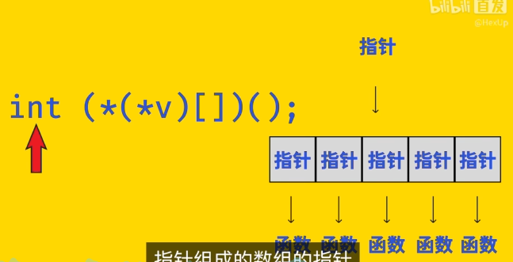

```c++
int *v[5];//有5个指向int的指针数组
int (*v)[5];//指向一个有五个整数数组的指针
int (*func)();//指向一个返回值为Int型的函数
int (*v[])();//int型函数指针组成的数组
```

```c++
//const
int const a;
const int a;//二者表示的结果一致
int const *r;//r是指向const int的指针，可以给r赋值，*r不能够被改变。
int *const r;//r不能够被赋值，但是*r可以改变。
```

## 2. C++虚继承

通过D调用A，A调用了两次，导致不知道调用B->A  or C->A,造成的编译错误。可以通过下面**static_cast来转换，也可以用命名空间来调用**


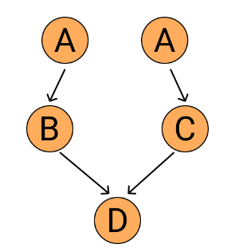

```c++
#include <iostream>

using namespace std;

class Animal{
    public:
    virtual void eat() {
        cout << "Animal eat." << endl;
    }
};

class SmallAnimal: public Animal{
    public:
    virtual void attack() {
        cout << "Small Animal Attack." << endl;
    }
};

class FlyAnimal: public Animal{
    public:
    virtual void fly() {
        cout << "Fly Animal Fly." << endl;
    }
};

class Bird: public SmallAnimal, public FlyAnimal{

};

int main(){
    Bird bird;
    bird.eat(); // Error
    Animal *animal = &bird; // Error
}
```

这里会报错，因为不明确

正确的代码：

```c++
static_cast<FlyAnimal>(bird).eat();//类型转换
Animal *animal = &static_cast<FlyAnimal>(bird);
```

但是呢，这样的做法并不优美，也没有必要。因为Small Animal和Fly Animal的爸爸是同一个，没有必要在Bird里面保存两份爸爸的基因。这里使用**虚继承**就可以完美解决这个问题，它保证了父类的二阶派生类，也就是孙子类，只包含一份父类数据的拷贝。上面这种情况，在**没有虚继承的情况下，D会包含两份A的变量**，一份来自B，一份来自C。并且，你可以独立地访问这两份变量，用作用域符`::`指定父类即可。相反，**如果B和C都是虚继承自A，那么D中只会包含一份A中的变量，变成下图的形式**。

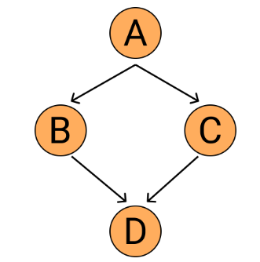

```c++
class Animal{
    public:
    virtual void eat() {
        cout << "Animal eat." << endl;
    }
};

class SmallAnimal: public virtual Animal{
    public:
    virtual void attack() {
        cout << "Small Animal Attack." << endl;
    }
};

class FlyAnimal: public virtual Animal{
    public:
    virtual void fly() {
        cout << "Fly Animal Fly." << endl;
    }
};

class Bird: public SmallAnimal, public FlyAnimal{
    public:
    virtual void eat() {
        cout << "Eat from bird." << endl;
    }
};

int main(){
    Bird bird;
    bird.eat(); // 正确
    Animal *animal = &bird; // 正确
    animal->eat(); // "Eat from bird."
}
```

虚函数和虚继承

我们在用虚继承的时候，要确保所有父类都是虚继承自爷爷类的。


## 3.虚函数的意义和用法

**为了重写基类函数，从而实现多态**

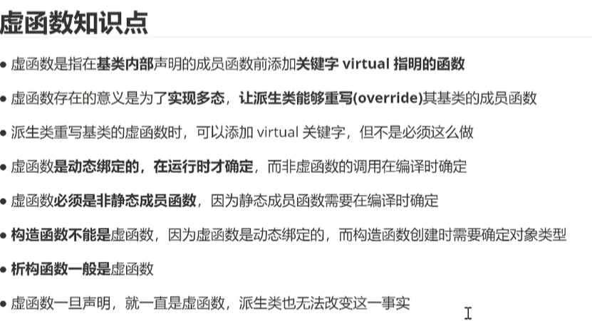

```c++
class Animal {
public:
    virtual void print() {
        cout << "From Animal." << endl;
    }
    void eat() {
        cout << "Animal Eat." << endl;
    }
};

class Bird: public Animal {
public:
    void print() {
        cout << "From Bird." << endl;
    }
    void eat() {
        cout << "Bird eat." << endl;
    }
};

class Fish: public Animal {
public:
    void print() {
        cout << "From Fish." << endl;
    }
    void eat() {
        cout << "Fish eat." << endl;
    }
};

int main() {
    Bird bird;
    Fish fish;

    Animal *animal;

    animal = &bird;
    animal->print(); // prints From Bird.
    animal->eat(); // prints Animal Eat.

    animal = &fish;
    animal->print(); // prints From Fish.
    animal->eat(); // prints Animal Eat.
}
```

可以看到，animal指针在调用print函数的时候，正确识别了当前绑定到的实例分别是Bird和Fish，但是在调用eat的时候，仍然调用的是基类的实现方法，无法判断子类型。

所以，只有声明为虚函数的函数，才能实现运行时多态，这个就是**虚函数的作用**。**这个功能可以让我们的代码泛用性更广，也更简洁一点，这样就不用在运行的时候根据if-else来判断子类型然后做出相应操作了。**

所以，只有声明为虚函数的函数，才能实现运行时多态，这个就是虚函数的作用。这个功能可以让我们的代码泛用性更广，也更简洁一点，这样就不用在运行的时候根据if-else来判断子类型然后做出相应操作了。

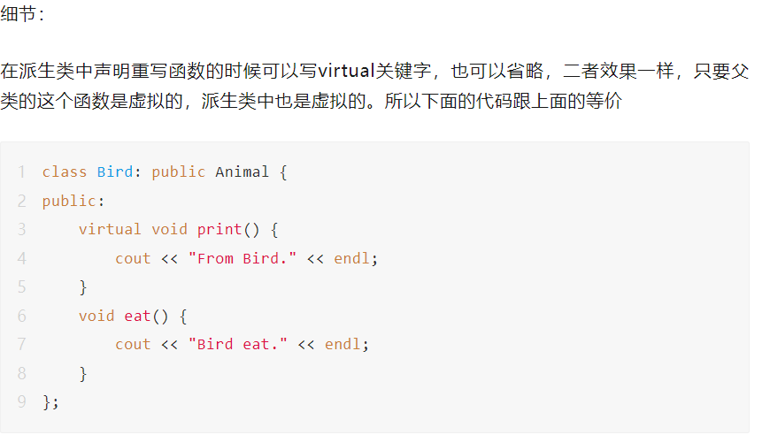

### **纯虚函数**

C++规定，父类的虚函数是必须要有定义的，**除非是纯虚函数**。纯虚函数在父类中没有定义，但是要求派生类都必须实现自己的版本，否则编译器报错。在声明函数的时候加=0声明纯虚函数

```c++
virtual void func() = 0;
```

## 4.类型转换

### **1.dynamic_cast**

dynamic_cast用于类继承层次间的指针或引用转换。主要还是用于执行“安全的向下转型（safe downcasting）”，也即是基类对象的指针或引用转换为同一继承层次的其他指针或引用。至于“向上转型”（即派生类指针或引用类型转换为其基类类型），本身就是安全的，尽管可以使用dynamic_cast进行转换，但这是没必要的， 普通的转换已经可以达到目的，毕竟使用dynamic_cast是需要开销的。

不同于其它的强制类型转换，dynamic_cast在运行时会进行类型检查，如果绑定到引用或指针的对象不是目标类型的对象，则dynamic_cast失败：

```cpp
class Base(){virtual void dummy(){} }；
class Derived:public Base{};
Base *b1 = new Base;
Base *b2 = new Derived;
Derived *b2d1 = dynamic_cast<Derived*>(b1);   //转换失败，返回NULL
Derived *b2d2 = dynamic_cast<Derived*>(b2);    //转换成功
Derived &b2d3 = dynamic_cast<Derived&>(*b1);   //转换失败，抛出异常
Derived &b2d4 = dynamic_cast<Derived&>(*b2);    //转换成功
```

对指针进行dynamic_cast，失败返回null，成功返回正常cast后的对象指针； 

对引用进行dynamic_cast，失败抛出一个异常，成功返回正常cast后的对象引用。 

dynamic_cast是四个强制类型转换操作符中最特殊的一个，**它支持运行时识别指针或引用**。

首先，dynamic_cast依赖于RTTI信息，其次，在转换时，dynamic_cast会检查转换的source对象是否真的可以转换成target类型，

这种检查不是语法上的，而是真实情况的检查。

### dynamic_cast与继承层次的指针

对于“向下转型”有两种情况。

一种是基类指针所指对象是派生类类型的，这种转换是安全的；

另一种是基类指针所指对象为基类类型，在这种情况下dynamic_cast在运行时做检查；

```cpp
class Base{
public:
    Base(){};
    virtual void Show(){cout<<"This is Base calss";}
};
class Derived:public Base
{
public:
    Derived(){};
    void Show(){cout<<"This is Derived class";}
};
int main(){    
    //这是第一种情况
    Base* base = new Derived;
    if(Derived *der= dynamic_cast<Derived*>(base))
    {   cout<<"第一种情况转换成功"<<endl;
        der->Show();
        cout<<endl;
    }//这是第二种情况
    Base * base1 = new Base;
    if(Derived *der1 = dynamic_cast<Derived*>(base1))
    {
        cout<<"第二种情况转换成功"<<endl;
        der1->Show();
   }else 
    {
        cout<<"第二种情况转换失败"<<endl;
    }
    delete(base);
    delete(base1);
    system("pause");
}
```

运行结果：

　　　　　　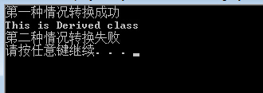

 

### dynamic_cast和引用类型

在前面的例子中，使用了dynamic_cast将基类指针转换为派生类指针，也可以使用dynamic_cast将基类引用转换为派生类引用。

同样的，引用的向上转换总是安全的：

```cpp
    Derived c;
    Derived & der2= c;
    Base & base2= dynamic_cast<Base&>(der2);//向上转换，安全
    base2.Show();
```

所以，在引用上，dynamic_cast依旧是常用于“安全的向下转型”。与指针一样，引用的向下转型也可以分为两种情况，**与指针不同的是，并不存在空引用，所以引用的dynamic_cast检测失败时会抛出一个bad_cast异常：**

```cpp
int main(){    
    //第一种情况，转换成功
    Base &base1 = new Derived;
    Derived &der1 = dynamic_cast<Derived&>(base1);
    cout<<"第一种情况：";
    der1.Show();
    cout<<endl;
    //第二种情况
    Base &base = new Base ;
    cout<<"第二种情况：";
    try{
        Derived & der = dynamic_cast<Derived&>(base);}
    catch(bad_cast){
  cout<<"转化失败,抛出bad_cast异常"<<endl;}
    system("pause");
}
```

 

运行结果：

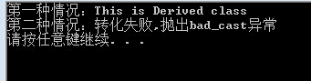

使用dynamic_cast转换的Base类至少带有一个虚函数

  当一个类中拥有至少一个虚函数的时候，编译器会为该类构建出一个虚函数表（virtual method table），虚函数表记录了虚函数的地址。如果该类派生了其他子类，且子类定义并实现了基类的虚函数，那么虚函数表会将该函数指向新的地址。虚表是C++多态实现的一个重要手段，也是dynamic_cast操作符转换能够进行的前提条件。当类没有虚函数表的时候（也即一个虚函数都没有定义）,dynamic_cast无法使用RTTI，不能通过编译（个人猜想...有待验证）。

　　当然，虚函数表的建立对效率是有一定影响的，构建虚函数表、由表查询函数 都需要时间和空间上的消耗。所以，除了必须声明virtual（对于一个多态基类而言），不要轻易使用virtual函数。对于虚函数的进一步了解，可以查看《Effective C++》

### **2、const_cast**

const_cast转换过程中增加或删除const属性。

```cpp
class Test{};
const Test *t1 = new Test;
Test *t2 = const_cast<Test*>(t1);      //转换成功
除了添加或删除const特性，用const_cast符来执行其它类型转换，都会引起编译错误
```

### **3、static_cast**

static_cast可以完全替代c的类型转换，而且在对对象指针之间的类型转换时，可以将父类指针转换成子类指针，也可以将子类指针转换成父类指针，但是如果两个类不相关则无法相互转换。 需注意的是，如果父类指针指向一个父类对象，此时将父类指针转换成子类指针虽然可以通过static_cast实现，但是这种转换很不安全；如果父类指针本身就指向子类指针则不存在安全问题。

```cpp
class Base(){}；
class Derived:public Base{};
Base *b1 = new Base;
Base *b2 = new Derived;
Derived *b2d1 = static_cast<Derived*>(b1);   //转换成功不安全
Derived *b2d2 = static_cast<Derived*>(b2);    //转换成功安全
int i = 0;
double d = 1.9;
int d2i = static_cast<int>d;
double i2d = static_cast<double>i;
```

编译器隐式执行的任何类型转换都可以由static_cast显式完成：

当需要将一个较大的算术类型赋值给较小的类型时，使用强制类型转换非常有效。此时，强制类型转换告诉程序的读者和编译器：我们知道并且不关心潜在的精度损失。对于从一个较大的算术类型到一个较小类型的赋值，编译器通常会产生警告。当显示提供强制类型转换时，警告信息会被关闭。

```cpp
编译器隐式执行的任何类型转换都可以由 static_cast 显式完成：
double d = 97.0;
// cast specified to indicate that the conversion is intentional
char ch = static_cast<char>(d);
```

如果编译器不提供自动转换，使用 static_cast 来执行类型转换也是很有用的。例如，下面的程序使用 static_cast 找回存放在 void* 指针中的值：

```cpp
void* p = &d; // ok: address of any data object can be stored in a void*
// ok: converts void* back to the original pointer type
double *dp = static_cast<double*>(p);
```

可通过 static_cast 将存放在 void* 中的指针值强制转换为原来的指针类型，此时我们应确保保持指针值。也就是说，强制转换的结果应与原来的地址值相等。

### **4、reinterpret_cast**

reinterpret_cast可以将一种类型的指针直接转换成另一种类型的指针，不论两个类型之间是否有继承关系。而且reinterpret_cast可以将一个指针转换为一个整数，也可以把一个整数转换成一个指针。reinterpret_cast还经常用咋不同函数指针之间的转换。

```cpp
class A{};
class B{};
A *a = new A;
B *a2b = reinterpret_cast<B*>(a);     //转换成功
```

static_cast 运算符完成*相关类型*之间的转换. 而 reinterpret_cast 处理*互不相关的类型*之间的转换.

"互不相关的类型"指的是两种完全不同的类型,如从整型到指针类型,或者从一个指针到另一个毫不相干的指针.

所以 reinterpret_cast 常常被用作不同类型指针间的相互转换,因为所有类型的指针的长度都是一致的(32位系统上都是4字节),按比特位拷贝后不会损失数据.

通常为操作数的位模式提供较低层次的重新解释，reinterpret_cast 本质上依赖于机器。为了安全地使用 reinterpret_cast，要求程序员完全理解所涉及的数据类型，以及编译器实现强制类型转换的细节。
 例如，对于下面的强制转换：

```cpp
int *ip;
char *pc = reinterpret_cast<char*>(ip);
```

变量 pc 所指向的真实对象其实是 int 型，而并非字符数组。任何假设 pc 是普通字符指针的应用，都有可能带来有趣的运行时错误。例如，下面语句用 pc 来初始化一个 string 对象，它可能会引起运行时的怪异行为。

```cpp
string str(pc);
```

问题源于类型已经改变时编译器没有提供任何警告或错误提示。当我们用 int 型地址初始化 pc 时，由于显式地声明了这样的转换是正确的，因此编译器不提供任何错误或警告信息。后面对 pc 的使用都假设它存放的是 char* 型对象的地址，编译器确实无法知道 pc 实际上是指向 int 型对象的指针。

因此用 pc 初始化 str 是完全正确的——虽然实际上是无意义的或是错误的。查找这类问题的原因相当困难，特别是如果 ip 到 pc 的强制转换和使用 pc 初始化 string 对象这两个应用发生在不同文件中的时候。

**强烈建议**：应该避免使用强制类型转换，强制类型转换关闭或挂起了正常的类型检查。

## C++ Lambda表达式（匿名函数）的使用

## 方法

​    它可以很方便地让我们随手定义函数，并把函数当作参数给别的函数调用。这样写起来简洁，读起来也直观，不用在代码中跳来跳去

```c++
#include <algorithm>
#include <iostream>
#include <vector>

using namespace std;

int main() {
    vector<int> vec { 0, 11, 3, 19, 22, 7, 1, 5 };

    sort(vec.begin(), vec.end(), [](int a, int b) {
        return a < b;
    });
}
```

上面的代码中，sort的第三个参数就是一个匿名函数。作用是按升序比较两个元素大小。

如果我们写return a > b;就变成按降序排序，那么排序的结果就会反过来。这样的写法比起原始的C++要简洁、清晰、灵活很多。

Lambda的基本的语法形式为

```c++
[捕获变量] (参数列表) -> 返回类型
{
  函数主体
}
```

再举个例子

```c++
auto f = [](int a, int b) -> int {
    return a + b;
};

cout << f(1, 2) << endl;
```

下面我们来讲一下变量捕获，英文叫capture clause，就是中括号的部分。

这个功能的作用是，让我们的匿名函数可以访问，甚至是修改函数外部的变量。

其中，capture clause是可以指定一些外围的变量，这样在匿名函数内部就可以访问这些变量。如果是[]，表示不捕获任何变量。如果变量名前面有&，则是按引用捕获，可以修改变量的值。如果不加&，就是按值捕获，不能修改外围变量的值。


```c++
#include <iostream>
using namespace std;
int main()
{
    int N = 100, M = 10;

    auto g = [N, &M](int i) {
        M = 20;
        return N * i;
    };

    cout << g(10) << endl;
    cout << M << endl;
}
//1000；20
//这里我们只能访问N的值，而不能修改N的值
```

此外，如果在捕获语句中只写[&]，那么就会按照引用捕获所有的封闭范围中的变量。如果写成[=]，意思是所有变量都按值捕获。

还有一种写法，可以单独指定一些变量按值捕获，其他变量都按引用捕获，比如[&,=N]就是按值捕获N，其他变量按引用捕获。

[=,&N]的意思类似，是按引用捕获N，其他变量按值捕获

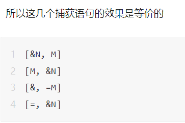

### **C++14新增的功能**

在C++14之后，你可以在捕获语句中定义新的变量，并且初始化。这些变量无需出现在匿名函数外围环境中，比如上面的代码可以变成

```c++
#include <iostream>
using namespace std;
int main(){    int N = 100, M = 10;
    auto g = [N, &M, K=5](int i) {      
        M = 20;       
        cout << K << endl;        
        return N * i;    };
    cout << g(10) << endl;    
           cout << M << endl;}
```

调用g的时候会打印5，因为我们引入了一个新变量K，并且赋值5，在函数主体中打印它。

另一个C++14新增的功能是参数列表支持auto类型，这让匿名函数变得更通用、更泛型。举个例子，原来我们需要显式指定匿名函数参数的类型

```c++
auto f = [] (int a, int b) {return a + b;};
```

现在我们可以这么写

```c++
auto f = [] (auto a, auto b) {return a + b;};
```

这样只要支持+运算的类型都可以用这个匿名函数，不像原来对int float string还需要各自定义一份。


## 解释现代C++指针的操作

##  5. C/C++中指针的大小是多少？（基础知识）

不论在什么样的机器和程序上，同一个程序中，不管指向什么，指针的大小是固定的，**都是跟内存的地址一样长。**

32bit  --->4B             64bit--->8B

## 6.C++动态内存分配与裸指针的入门级浅析

**栈内存：**

```CPP
int a = 100;//自动分配
int *p = &a; // p指向了a的内存地址
```

**堆内存：**

```CPP
int *p = new int;
delete p;//这里是释放了p指向的内存，而不是删除P本身，我们还可以把p指向别的地方，比如下方
p = &a；
```

```CPP
//我们还可以用new来申请数组，或者operator
int *p = new int[100];
delete p;

vector<int> *k;//vector向量指针  
k = new vector<int>[5]; 
delete k;
```

**栈内存和堆内存**：前者自动释放，后者需要程序员手动管理

**内存泄漏：**上面这段代码，如果我们不写delete那行，p所指向的内存就无人问津了，**因为知道这块地址的所有者p已经随着函数的结束消失了。但是p所指向的内存还空旋在那里，形成了一个孤岛，别人也用不了（除非非法访问）。**

```Cpp
int *p = new int;
delete p;
delete p; // undefined behaviour!不要删两次！！！
```

```cpp
//C++11新加的一个特性，nullptr,空指针
int *p = new int;
delete p;
p = nullptr;
...//删完某块内存之后，如果你想把p标记为空指针，你可以给他赋值nullptr，这样就可以验证p是否可用
if (!p == nullptr) 
{
    some code here...
}//某些情况下，编译器会把NULL跟int类型搞混。
```

​    以上是动态内存分配和裸指针的基础用法，看起来很简单是吧？在上面的例子中确实，因为我们在申请完内存之后就立马就删除了，但现实中的代码可能不会这么简单。**由于指针可以传来传去，所以你在一个foo函数里面动态申请了一块内存（甚至大量内存赋给不同指针），可能会传到一个非常遥远的bar函数当中。bar函数用完可能又会传到bar2函数里面。在这个过程中，使用者可能还会建立多个指针同时指向一块内存。**那么，在哪里释放这些内存就成了问题，foo中可能不行，因为可能foo调用完毕，bar还在使用这块内存，对bar同理。**一旦数据的使用、传递变得复杂，程序员可能就会忘了释放内存，从而产生bug。**（不是刻意忘记，而是问题的复杂度迫使人类犯错，就算刻意设计，也可能设计错）

## 7.C++智能指针之共享指针shared_ptr入门知识点

共享指针会记录有多少个（共享）指针指向同一个物体，当这个数字降为0的时候，程序会自动释放资源，省去我们手动delete的烦恼。

```cpp
#include<memory>//使用智能指针的头文件
using namespace std;
share_ptr<int> p;
p = make_shared<int>(100);//定义初始化一个、、推荐！！shared_ptr,make_shared<>会动态分配一块内存,是一个模板
shared_ptr<int> p(new int(100));//初始化shared_ptr
```

定义之后，你可以像普通的指针一样使用*、→之类的运算符操作数据，并且多个共享指针可以指向同一个物体，共享控制权。

```cpp
shared_ptr<int> p2 = p;
cout << *p << endl;
*p2 = 321;
cout << *p << endl;
```

虽然有两种方式初始化shared_ptr，但在任何可能的情况下，我都推荐使用make_shared，而不是new，因为总体来说前者效率更高，也更安全，具体的细节我们这里不表。

下面，为了能够看清楚一个物体的创建与销毁的过程，我们定义一个简单的类。

```c++
class Ball
{
public:
    Ball() { cout << "A ball appears." << endl; }
    ~Ball() { cout << "A ball disappears." << endl; }
    void Bounce() { cout << "A ball jumps." << endl; }
};

...

int main()
{
  shared_ptr<Ball> p = make_shared<Ball>;
  cout << p.use_count() << endl;
    
  shared_ptr<Ball> p2 = p;
  cout << p.use_count() << " " << p2.use_count() << endl;
    
  shared_ptr<Ball> p3 = p;
  cout << p.use_count() << " " << p2.use_count() << p3.use_count() << endl;
  p.reset();
  p2.reset();
  p3.reset();
}
```

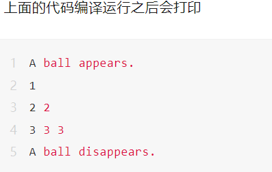

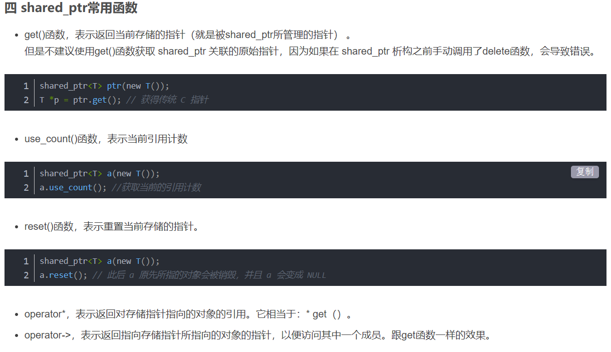

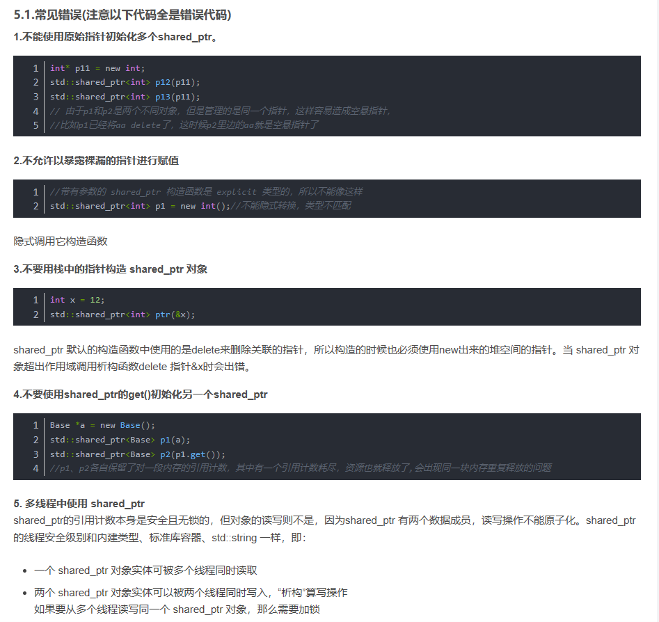

**reset**

前面我们介绍了reset的无参数用法，其实reset可以接受一个指针，看下面的代码

```c++
shared_ptr<Ball> sp = make_shared<Ball>();
sp.reset(new Ball());
```


此时，sp不再指向旧的Ball，旧的Ball引用计数减1，然后sp指向新的Ball。

**自定义删除函数**

你可以自定义删除函数，告诉shared_ptr如何释放资源。比如我们需要关闭文件或者网络连接，而不是直接delete物体，语法如下

```c++
void close_file(FILE* fp){    
    if (fp == nullptr){  return;    }  
    fclose(fp);    
    cout << "File closed." << endl;}
int main(){   
    FILE* fp = fopen("data.txt", "w");    shared_ptr<FILE> sfp {fp, close_file};   
    if (sfp == nullptr)  {  cerr << "Error opening file." << endl;    }   
    else    {  cout << "File opened." << endl;    }}
```


这里sfp创建的时候使用了大括号初始化的语法，第二个参数是我们自定义的删除函数close_file，在文件指针引用计数降为0的时候，自动关闭文件，而不是delete指针。

**aliasing，别名**

shared_ptr还有一种特殊的用法，叫别名，aliasing。什么意思呢？看下面这个例子

```c++
struct Bar{    int i = 123;};
struct Foo{    Bar bar;};
void main(){    shared_ptr<Foo> f = make_shared<Foo>();    cout << f.use_count() << endl;    shared_ptr<Bar> b(f, &(f->bar));    cout << f.use_count() << endl;    cout << b->i << endl;}
```


初见这个例子可能会觉得奇怪，因为shared_ptr b在初始化的时候接受了两个参数，第一个是shared_ptr f，第二个却是个指针，指向f的成员变量bar。

其结果就是，b拥有对f的管理权，定义b之后，f的引用计数增加了1，b不消失，f指向的资源就不会删除。

但是b的数据指针指向了bar，从main函数的最后一行打印b->i也能看出，如果我们使用b的时候，其访问的数据是一个Bar实例。

通常这个技巧用于访问类的成员变量，我们访问的是某个实例的成员，但我们不希望我们在用这个成员的时候实例被删除，所以增加了对这个实例的控制权。

### 

虽然shared_ptr在一定程度上帮我们解决了自动管理内存的问题，但它并不限制一些危险操作。你可以随意搞出一大堆ub。

比如，如果你用new创建了一个shared_ptr，你可以写delete ptr.get();，编译能通过，但是会不可避免导致undefined behavior，其他的shared_ptr仍然是可能访问被删除的物体的。

所以，千万不要这么做！shared_ptr的意图就在于让编译器而不是人来管理内存的释放，所以不要这么做，只会增加程序的bug行为。

## 8.unique_ptr

上一篇我们讲了unique_ptr的基本用法，它能帮你自动管理内存，性能好，没有什么额外开销，所以推荐在各种可能的场合使用。

但是由于它禁止copy，所以在函数中作为参数传递的时候有些注意事项。

首先，下面这段代码无法编译通过

```c++
void pass_up(unique_ptr<int> up){    cout << "In pass_up: " << *up << endl;}
void main(){    auto up = make_unique<int>(123);    pass_up(up);}
```


这是因为我们调用pass_up(up)的时候，会产生一个复制up的操作，这是不允许的。

那应该怎么办呢？如果我们只是想要访问unique_ptr<T>指向的内容，我们不需要传递unique_ptr<T>本身，我们传递T&就行了，也就是传递unique_ptr底下的资源。

```c++
void pass_up1(int& value){    cout << "In pass_up1: " << value << endl;}
void main(){    auto up = make_unique<int>(123);    pass_up1(*up);}
```


这里pass_up1的参数是int&，在main里面我们传的是*up，避免了unique_ptr<int>的传递，只是访问它底下的资源。

与此类似的，还有第二种方法

```c++
void pass_up2(int* p){    cout << "In pass_up2: " << *p << endl;}
void main(){    auto up = make_unique<int>(123);    pass_up2(up.get());}
```

我们把up.get()作为参数传递，up.get()获得的是资源的裸指针，也能访问资源而避免复制unique_ptr的复制。

以上情况只能让我们访问unique_ptr的资源，如果我们想通过函数改变unique_ptr本身怎么办呢？就需要把函数的参数设为unique_ptr<T>&，如下

```c++
void pass_up3(unique_ptr<int>& up){    cout << "In pass_up3: " << *up << endl;    up.reset();}
void main(){    auto up = make_unique<int>(123);    pass_up3(up);    if (up == nullptr) cout << "up is reset." << endl;}
```

此时编译运行会打印

```c++
In pass_up3: 123up is reset.
```

这是因为pass_up3的参数是up的引用，在函数内部reset了up，释放了资源，并把up设置为nullptr。

最后，还有一种方法可以传递unique_ptr，就是std::move，可以转移unique_ptr对资源的控制权。move的用法在前面我们已经演示过，可以将一个unique_ptr对资源的控制权转给另一个unique_ptr。

```c++
void pass_up4(unique_ptr<int> up){    cout << "In pass_up4: " << *up << endl;}
void main(){    auto up = make_unique<int>(123);    pass_up4(move(up));    if (up == nullptr) cout << "up is moved." << endl;}
```

编译运行会打印

```c++
In pass_up4: 123up is moved.
```


我们转移了原up的控制权到函数中，因此原up变成了nullptr。

以上就是在函数间传递unique_ptr的用法。

**函数返回unique_ptr**

虽然作为参数传递有着限制，但是函数可以返回unique_ptr并用来初始化，如下

```c++
unique_ptr<int> return_uptr(int value){    unique_ptr<int> up = make_unique<int>(value);    return up;}
void main(){    unique_ptr<int> up = return_uptr(321);    cout << "up: " << *up << endl;}
```


编译运行会打印

```c++
up: 321
```


你可能会疑惑，难道不应该写return move(up)吗？实际上，写return move(up)是可以的，但也可以直接写return up。

这是因为，在某些情况下，编译器会智能地识别这里不能用copy constructor，自动帮你使用了move constructor，这里就是触发这个规则的场景之一。

具体的细节可以在我们学习rvalue之后讲解。

以上就是在函数内使用unique_ptr的一些方法。


## 9.weak_ptr

简单来说，weak_ptr是shared_ptr的伴侣，它是一个观察者。它对资源的引用是非拥有式的，意思就是没有资源的管理权限，不能控制资源的释放，甚至想要访问资源的时候也需要通过创建一个临时的shared_ptr才行。但是它可以检查资源是否还存在，在我们不想要额外控制资源，但是又想检查资源是否存在的时候，可以使用weak_ptr。

**为什么会需要weak_ptr**

shared_ptr理论上可以自动释放内存，但一种特殊的情况仍然可能造成内存泄漏，这就是环形依赖，看下面这个例子。

假设有两个类，Teacher and School，定义如下

```c++
#include <iostream>
#include <memory>
#include <string>
using namespace std;
struct School;
struct Teacher {    
    string name;    
    int age;    
    shared_ptr<School> school;    
    ~Teacher() {       
        cout << "Teacher Destructed." << endl; 
    }
};
struct School {    
    string name;    
    shared_ptr<Teacher> principal; // 校长 
    ~School() {        cout << "School Destructed." << endl;    }};
```

然后我们在main函数里面使用这两个类

```c++
int main(){    
    auto principal = make_shared<Teacher>();   
    auto university = make_shared<School>();        principal->school = university;    university->principal = principal;
    return 0;}
```

编译运发行没有打印Teacher Destructed或者School Destructed，说明main函数结束运行之后，这两个物体仍然没有析构，造成了内存泄漏，为什么呢？因为指向他们的shared_ptr都没有得到释放。

当principle结束周期的时候，他底下的物体没有被删除，因为university→principle仍然指向它。

university结束生命周期的时候，底下的资源也没有被删除，因为principle→university仍然指向它。

这两个物体循环引用，锁死了，导致了shared_ptr的引用计数不能正常降为0.

要解决这个问题，我们就可以用weak_ptr，我们先看看weak_ptr的用法。

**用法**

定义weak_ptr很简单，类似于shared_ptr和unique_ptr，写出关键字指定模板参数就行了

```c++
weak_ptr<int> wp;
```

但是初始化weak_ptr需要一个shared_ptr或者weak_ptr，weak_ptr是依赖于shared_ptr存在的

```c++
shared_ptr<int> sp = make_shared<int>(100);
wp = sp;
```

当你使用weak_ptr来访问资源的时候，你必须临时把它转换成shared_ptr。

这也是weak_ptr的意义，用来建模临时的管理权。weak_ptr本身存储的只是对资源的一个引用，而且是一个非拥有的引用，意思就是，weak_ptr不能删除对象本身，它只能作为一个观察者，告诉你资源是否存在。

weak_ptr指向的物体可以被其他shared_ptr所删除。

想要使用weak_ptr访问对象，需要这么写，调用weak_ptr的lock方法，返回一个临时的shared_ptr

```c++
auto resource = wp.lock();
if (resource){   
    cout << "Number is " << *resource << endl;
}
else{  
    cout << "wp is expired" << endl;
}
```

我们看看cppreference网站上给出的例子

```c++
#include <iostream>
#include <memory> 
std::weak_ptr<int> gw; 
void observe(){  
    std::cout << "gw.use_count() == " << gw.use_count() << "; ";   
    // we have to make a copy of shared pointer before usage:    
  if (std::shared_ptr<int> spt = gw.lock()) {        std::cout << "*spt == " << *spt << '\n';    }   
    else {       
      std::cout << "gw is expired\n"; 
    }
} 
int main(){  
    {  auto sp = std::make_shared<int>(42);  
     gw = sp;        
     observe();   
    }     
    observe();
}
```

这里会打印

```c++
gw.use_count() == 1;
*spt == 42gw.use_count() == 0; 
gw is expired
```

这个例子就展示了weak_ptr的生命周期。

weak_ptr只是一个观察者，如果你想要获得它底下的指针，你需要把它转换成一个shared_ptr，这有两种方法：

1. 使用weak_ptr的lock方法。如果关联的shared_ptr释放了，
2. 创建一个shared_ptr，用这个weak_ptr初始化。如果weak_ptr绑定的shared_ptr已经释放了，那么会抛出一个异常。

**回到开头的例子**

让我们回到开头的例子，怎么用weak_ptr解决这个问题呢，只需要把Teacher类中的shared_ptr改成weak_ptr就行了。

```c++
#include <iostream>
#include <memory>
#include <string>
using namespace std;
struct School;
struct Teacher {    
    string name;    
    int age;    
    weak_ptr<School> school;    
    ~Teacher() {cout << "Teacher Destructed." << endl; }
};
struct School {
    string name;    
    shared_ptr<Teacher> principal; // 校长   
    ~School() { cout << "School Destructed." << endl;    }};
```


这个时候我们再编译运行，就会显示两个物体都得到了释放，问题解决。
