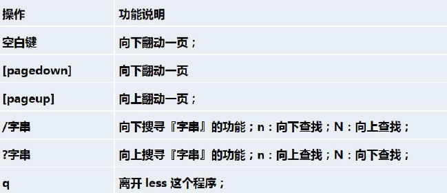
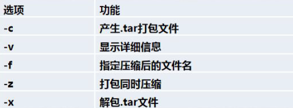

# 基于VSCode和CMake进行C/C++开发 | linux系统

系统环境：**Ubuntu18.04 LTS**  虚拟机

开发语言：**C++**

开发IDE  ：**VSCode**

课程关键词：Linux、VSCode、CMake、C/C++、GCC/GDB

## 第一讲 Linux系统介绍

### 1.1目录结构

**Bin：**全称binary，含义是二进制。该目录中存储的都是一些二进制文件，文件都是可以被运行的。

**Dev**：类似于windows 的设备管理器，把所有的硬件用文件的形式存储

**Etc**：该目录主要存储一些配置文件。

**Home**：表示“家”，表示除了root用户以外其他用户的家目录，类似于windows下的User/用户目录。

**Proc**：全称process，表示进程，该目录中存储的是Linux运行时候的进程。

**Root**：该目录是root用户自己的家目录。

**Sbin**：全称super binary，该目录也是存储一些可以被执行的二进制文件，但是必须得有super权限的用户才能执行。

**Tmp**：表示“临时”的，当系统运行时候产生的临时文件会在这个目录存着。

***Usr**：存放的是用户自己安装的软件。类似于windows下的program files。*

**Var**：存放的程序/系统的日志文件的目录。

**Mnt**：当外接设备需要挂载的时候，就需要挂载到mnt目录下。d:/myshare

### 1.2 Vi和Vim编辑器

- 拷贝当前行 ==yy== , 拷贝当前行向下的5行 ==5yy==，并粘贴（输入==p==）。
- 删除当前行 ==dd== , 删除当前行向下的5行 ==5dd==
- 在文件中查找某个单词 == [命令行下/关键字， 回车查找, 输入n 就是查找下一个]==
- 设置文件的行号，取消文件的行号.  ==[命令行下: set nu 和:set nonu]==
- 编辑/etc/profile 文件，在一般模式下, 使用快捷键到该文档的最末行==[G]==和最首行==[gg]==
- 在一个文件中输入"hello" ,在一般模式下, 然后又撤销这个动作==u==

### 1.3 开机、重启和用户登录注销

- 立该进行关机  ==shutdown –h now== 
- 1 分钟后关机  ==shudown -h 1==
- 现在重新启动计算机 ==shutdown –r now==
- 关机 ==halt==
- 现在重新启动计算机  ==reboot== 
- 把内存的数据同步到磁盘 ==sync== 

**不管是重启系统还是关闭系统，首先要运行sync 命令，把内存中的数据写到磁盘中**

- 切换用户 ==su - 用户名==  可以先用普通用户登录，然后切换成root。少用root因为权限最大
- 登出  ==logout==

### 1.4用户管理

- 添加用户 ==useradd 用户==  当创建用户成功后，会自动的创建和用户同名的家目录,也可以通过==useradd -d 指定目录    新的用户名==，给新创建的用户指定家目录
- 修改密码 ==passwd 用户名==
- 显示当前用户所在目录  ==pwd==
- 删除用户 ==userdel 用户名==（保留家目录） ==userdel -r 用户名==（家目录也删除）
- 查询用户信息 ==id 用户名==
- 切换用户 ==su -用户名==
- 查看当前用户/登录用户  ==whoami==
- 新增组  ==groupadd 组名==
- 删除组  ==groupdel 组名==
- 添加用户到指定的组 ==groupadd -g 用户组 用户名==
- 修改用户组  ==useradd -g 用户组 用户名==

### 1.5 实用指令

- 切换级别 ==init 数字==
- **找回密码**
- 帮助指令  ==man 指令==

#### **文件目录类**

- ==pwd==  显示当前工作目录的绝对路径

- ==ls [选项] [目录或是文件]==

  - -a ：显示当前目录所有的文件和目录，包括隐藏的。

  - -l ：以列表的方式显示信息

- ==cd== 切换到指定目录

  - cd ~ 或者cd ：回到自己的家目录, 比如你是root ， cd ~ 到/root

  - cd .. 回到当前目录的上一级目录

- ==mkdir== 创建目录
  - 案例1:创建一个目录/home/dog
    mkdir /home/dog
  - 案例2:创建多级目录/home/animal/tiger
    mkdir **-p** /home/animal/tiger

- ==rmdir==  删除空目录
  - rmdir 删除的是空目录，如果目录下有内容时无法删除的。
    提示：如果需要**删除非空目录**，需要使用==rm -rf== 要删除的目录
    比如： rm -rf /home/animal

- ==touch== 创建空文件
- ==cp [选项] source dest==  拷贝文件到指定目录
  - 案例1: 将/home/hello.txt 拷贝到/home/bbb 目录下
    cp hello.txt /home/bbb
  - 案例2: 递归复制整个文件夹，举例, 比如将/home/bbb 整个目录， 拷贝到/opt
    cp **-r** /home/bbb /opt

- ==rm [选项] 要删除的文件或目录==  移出文件或目录
  - -r ：递归删除整个文件夹
  - -f ： 强制删除不提示

- ==mv== 移动文件与目录或重命名
  - mv oldNameFile newNameFile (功能描述：重命名)
  - mv /temp/movefile /targetFolder (功能描述：移动文件)

- ==cat [选项] 要查看的文件== 查看文件内容
  - -n ：显示行号
  - cat 只能浏览文件，而不能修改文件，为了浏览方便，一般会带上管道命令| more
    ==cat -n /etc/profile | more [进行交互]==
- ==more 要查看的文件==   基于VI 编辑器的文本过滤器

- ==less 要查看的文件== 与more类似

- ==echo [选项] [输出内容]== 输出内容到控制台
- ==head== 显示文件的开头部分内容，默认情况下显示文件的前10 行
  - head 文件(功能描述：查看文件头10 行内容)
  - head -n 5 文件(功能描述：查看文件头5 行内容，5 可以是任意行数)

- ==tail==显示文件的尾部部分内容，默认情况下显示文件的前10 行
  - tail 文件（功能描述：查看文件尾10 行内容）
  - tail -n 5 文件（功能描述：查看文件尾5 行内容，5 可以是任意行数）
  - tail -f 文件（功能描述：实时追踪该文档的所有更新）

- ==>== 输出重定向和==>>== 追加
  - **ls -l >文件**  列表的内容写入文件a.txt 中（覆盖写）
  - **ls -al >>文件**  列表的内容追加到文件aa.txt 的末尾）
  - **cat 文件1 > 文件2**   将文件1 的内容覆盖到文件2
  - **echo "内容">> 文件**  (追加)

- ==history==  查看已经执行过的历史命令
  - 案例1: 显示所有的历史命令   history
  - 案例2: 显示最近使用过的10 个指令   history 10

#### **时间日期类**

- **date**   显示当前时间
- **date +%Y**   显示当前年份
- **date +%m**  显示当前月份
- **date +%d**  显示当前是哪一天
- **date "+%Y-%m-%d %H:%M:%S"**  显示年月日时分秒

- **date -s** 字符串时间      设置日期
- **cal**  查看日历    ==不加选项，显示本月日历==

#### 搜索查找类

- ==find [搜索范围] [选项]==

- ==locate 搜索文件== 快速定位文件路径
  - ==which==可以快速定位某个指令在哪个目录下

​		**由于locate 指令基于数据库进行查询，所以第一次运行前，必须使用updatedb 指令创建locate 数据库。**

- ==**grep 指令和管道符号|**==
  - grep [选项] 查找内容源文件
  - 案例1: 请在hello.txt 文件中，查找"yes" 所在行，并且显示行号
    **写法1: cat /home/hello.txt | grep "yes"**
    **写法2: grep -n "yes" /home/hello.txt**

​	**grep 过滤查找， 管道符，“|”，表示将前一个命令的处理结果输出传递给后面的命令处理。**

#### 压缩和解压类

- ==gzip 文件==  压缩文件,只能压缩为.gz文件
- ==gunzip 文件.gz==  解压缩
- ==zip [选项] XXX.zip== 压缩文件和目录   **-r：递归压缩，即压缩目录**
- ==unzip [选项] XXX.zip== 解压缩   **-d<目录> ：指定解压后文件的存放目录**
  - 案例1: 将/home 下的所有文件/文件夹进行压缩成myhome.zip
    **zip -r myhome.zip /home/** [将home 目录及其包含的文件和子文件夹都压缩]
  - 案例2: 将myhome.zip 解压到/opt/tmp 目录下
    **mkdir /opt/tmp**
    **unzip -d /opt/tmp /home/myhome.zip**
- ==tar [选项] XXX.tar.gz 打包的内容==   打包指令，最后打包后的文件是tar.gz的文件
  - 案例1: 压缩多个文件，将/home/pig.txt 和/home/cat.txt 压缩成pc.tar.gz
    **tar -zcvf pc.tar.gz /home/pig.txt /home/cat.txt**
  - 案例2: 将/home 的文件夹压缩成myhome.tar.gz
    **tar -zcvf myhome.tar.gz /home/**
  - 案例3: 将pc.tar.gz 解压到当前目录
    **tar -zxvf pc.tar.gz**
  - 案例4: 将myhome.tar.gz 解压到/opt/tmp2 目录下
    **mkdir /opt/tmp2** 
    **tar -zxvf /home/myhome.tar.gz -C /opt/tmp2**

### 1.6 组管理和权限管理

### 1.7 实时任务调度

### 1.8 Linux磁盘分区、挂载

### 1.9 网络配置

### 1.10 进程管理

### 1.11 RPM和YUM

### 1.12 日志管理

### 1.13 备份与恢复

## 第二讲 开发搭建环境
