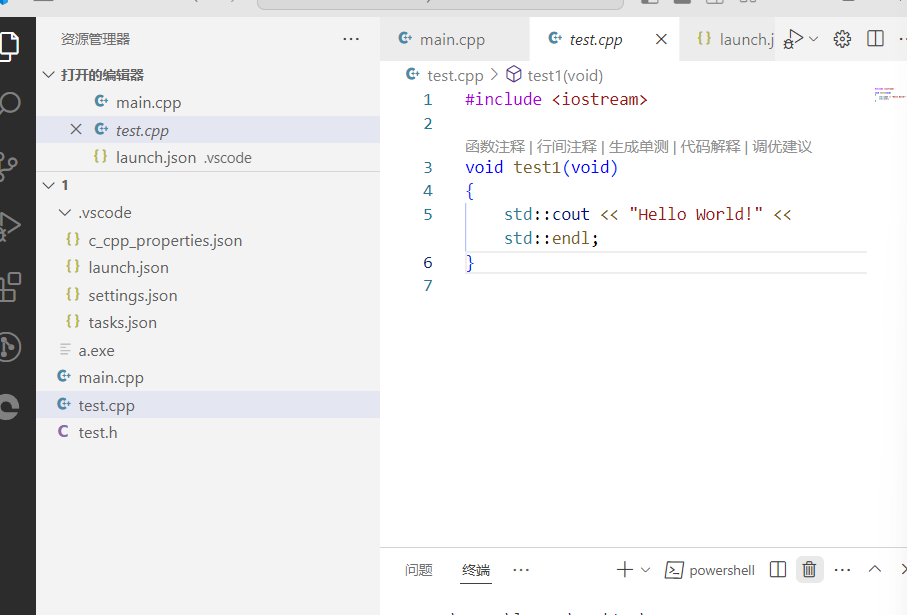
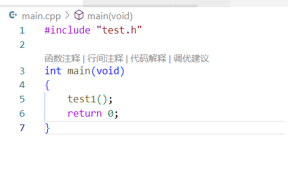
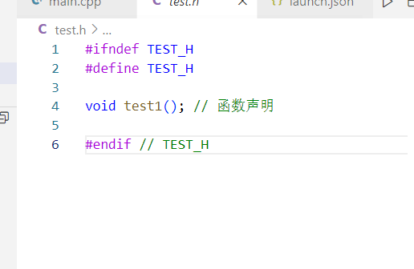
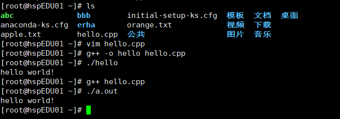

多文件编程VSCODE







```cpp
task.json
 {
    "tasks": [
        {
            "type": "cppbuild",
            "label": "C/C++: g++.exe 生成活动文件",
            "command": "D:\\mingw64\\bin\\g++.exe",
            "args": [
                "-fdiagnostics-color=always",
                "-g",
                //"${file}",
                "*.cpp",//*表示编译所有文件
                "-o",
                //"${fileDirname}\\${fileBasenameNoExtension}.exe"
                "${fileDirname}\\a.exe"
            ],
            "options": {
                "cwd": "${fileDirname}"
            },
            "problemMatcher": [
                "$gcc"
            ],
            "group": {
                "kind": "build",
                "isDefault": true
            },
            "detail": "调试器生成的任务。"
        }
    ],
    "version": "2.0.0"
}
```


```
setting.json基础配置
{
  "files.autoSave": "afterDelay",
  "files.autoGuessEncoding": true,
  "workbench.list.smoothScrolling": true,
  "editor.cursorSmoothCaretAnimation": "on",
  "editor.smoothScrolling": true,
  "editor.cursorBlinking": "smooth",
  "editor.mouseWheelZoom": true,
  "editor.formatOnPaste": true,
  "editor.formatOnType": true,
  "editor.formatOnSave": true,
  "editor.wordWrap": "on",
  "editor.guides.bracketPairs": true,
  //"editor.bracketPairColorization.enabled": true, (此设置vscode在较新版本已默认开启)
  "editor.suggest.snippetsPreventQuickSuggestions": false,
  "editor.acceptSuggestionOnEnter": "smart",
  "editor.suggestSelection": "recentlyUsed",
  "window.dialogStyle": "custom",
  "debug.showBreakpointsInOverviewRuler": true,
}

```


## LINUX下CPP编程



```cpp
方一：
$ g++ hello.cpp
$ ./a.out
方二：
$ g++ -o hello hello.cpp
$./hello
```

