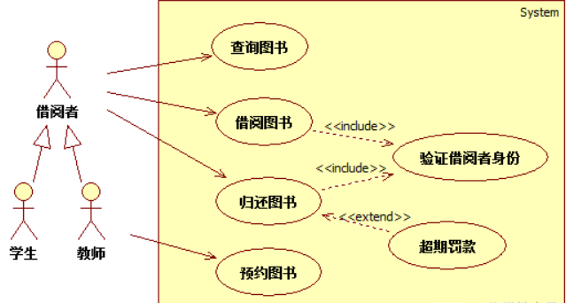
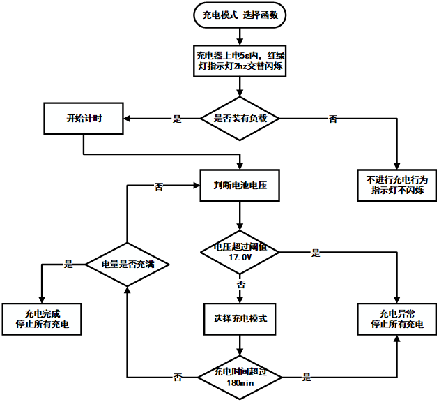

#                                              UML

## 类图

**基础属性**


- -： private
- +： public
- ~： default ( package 维度 )
- #： protected
- 下划线： static
- 斜体： 抽象 (注意也可以用两个尖括号包裹来表示抽象，比如 —— <<我是抽象类or接口>>)
- 冒号前是方法名/变量名（根据有无括号区分），冒号后是返回参数/变量类型（根据有无括号区分），如果没有冒号的话表示方法返回空（也有人通过：void表示返空）


**依赖**

函数传参 静态方法直接调用等（一个对象在运行期间会用到另一个对象）


**关联**

通常用一条直线表示，当然 **如果需要标明方向** 可以添加箭头（指向地位大的）


**聚合**

属于关联关系的一种，弱关联（整体不存在了，部分仍然存在）


**组合**

属于关联关系的一种，强关联（整体不存在了，部分也不存在）


**实现**

继承抽象类（继承 **抽象类** 和 实现 **接口**）


**继承（泛化）**

指向辈分大的


## 组件图


组件间有两种关系：依赖和泛化

**接口和端口：**

​                                                                            


## 部署图


## 对象图

类图的一个实例（某一时刻）

```
stu:Student 标准表示法
：Student 匿名表示法
stu 省略类名的表示法
```


## 包图

描绘了系统在包层面上的结构设计，用来表示包和包之间的依赖关系。


- 《Use》关系表示使用依赖，`Web Shopping`依赖`Payment`
- 《Merge》关系表示合并，`Web Shopping`合并了`Shopping Cart`就拥有了`Shopping Cart`的功能
- 《Access》关系表示私有引入，比如代码中的指定包名类名
- 《Import》关系表示公共引入，比如Java中的`import`之后，就可以直接使用`import`包中的类了。


## 组合结构图

描述一个类的内部结构


## 用例图

**《include》**  老大知道老二


**《extend》**老二知道老大


**泛化关系**      用户继承或者用例继承

                          

​                                                                        


## 活动图

表示用例实现的工作流程


## 泳道图

按角色划分，各司其职


## 时序图（顺序图）

箭头类似于生存期


## 流程图




## 状态图

建立生存周期描述对象的动态行为


## 协作图

与时序图相比，更强调对象，对象之间！！！


## E-R图


## 层次方块图


## IPO图


## HIPO图

层次方块图和IPO图的结合


