# 计算机操作系统

## 一.操作系统的概述
### 1.操作系统定义
操作系统是一组能有效地组织和管理计算机硬件和软件资源，合理的对各类作业进行调度，以及方便用户使用的**程序**的集合。==最基本的系统软件==

1. 是系统最基本最核心的软件，属于**系统软件**
2. 控制和**管理**整个计算机的**硬件和软件资源**
3. 合理的组织、**调度**计算机的工作与资源的**分配**
4. 为用户和其它软件提供方便的**接口**和环境

### 2.操作系统的功能与目标

在计算机系统中**配置操作系统**的主要目的是**提高系统资源的利用率**

从==**资源管理**==角度来看，操作系统的功能主要有

- 处理机管理功能
- 存储器管理功能
- 设备管理功能
- 文件管理功能
- 用户接口

**目标：**方便性（用户的观点）   有效性（管理员的观点-改善系统**利用率**）   可扩充性（层次化结构）   开放性（可移植性和互操作性）

**功能：**

- ==OS作为计算机系统资源的管理者==

  **计算机的资源包括处理机、存储器、I/O设备及数据和程序等**

  **管理的内容**包括资源的当前状态(数量和使用情况)、资源的**分配、回收和访问**操作,相应管理策略(包括用户权限)

  **1.处理机调度（管理）：**在多道程序环境下，cpu的分配和运行都**以进程（或线程）为基本单位**，因此对cpu的管理可理解为对进程的管理。进程管理的主要功能包括**进程控制、进程同步、进程通信、死锁处理、处理机调度等**

  **2.存储器管理：**为多道程序的运行提供良好的环境，方便用户使用及提高内存的利用率，主要包括**内存分配与回收、地址映射、内存保护与共享和内存扩充**等功能。

  **3.文件管理：**计算机中所有的信息都是以文件的形式存在的，操作系统中负责文件的管理的部分称为**文件系统**，文件管理包括文件**存储空间的管理、目录管理及文件读写管理和保护**等。

  **4.设备管理：**主要任务是完成用户的I/O请求，方便用户使用各种设备，并提高设备的利用率，主要包括**缓存管理、设备分配、设备处理和虚拟设备**等功能。

  

- ==OS作为用户与计算机硬件系统之间的接口==
  **1.命令接口** 

  ​            **联机用户接口**（交互式命令接口） 适用于分时或者实时系统接口。由一组键盘操作命令组成

  ​            **脱机用户接口**（批处理用户接口） 适用于批处理系统。由一组作业控制命令组成

  **2.程序接口**
  一组系统调用（广义指令，系统调用命令）组成，可实现创建窗口等功能，在应用编程中使用（API）允许用户通过程序**间接**使用

  **3.图形、窗口方式**      **GUI(现代操作系统中最流行的图形用户接口)**，严格来说，图形接口不是操作系统的一部分，但是图形接口所调用的系统调用命令是操作系统的一部分

- ==OS用作扩充机器==
- 

  需要提供的功能和目标：**实现对硬件机器的拓展**

  没有任何软件支持的计算机称为**裸机**。在裸机上安装的操作系统，可以提供资源管理功能和方便用户的服务功能，将裸机改造成功能更强、使用更方便的机器。

  通常把覆盖了软件的机器称为**扩充机器**，又称之为**虚拟机**。

  **操作系统的非形式化定义(关键点):系统软件,程序模块的集合,资源管理和用户接口功能**

### 3.操作系统的特征

==并发==

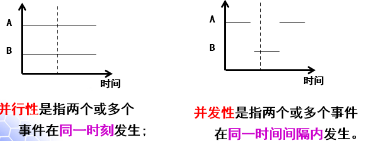

a.并发：指两个或多个事件在**同一时间间隔内**发生。这些事件宏观上是同时发生的，但微观上是交替发生的。
b.并行：指两个或多个事件在**同一时刻同时发生**。
**操作系统的并发性指计算机系统中同时存在着多个运行着的程序。**
**操作系统中引入进程是为了使程序能并发执行**

一个单核处理机（CPU）同一时刻只能执行一个程序，因此操作系统会负责协调多个程序交替执行（这些程序微观上是交替执行的，但宏观上看起来就像是在同时执行）事实上，操作系统就是伴随着“多道程序技术”而出现的。因此，操作系统和程序并发是一起诞生的。


==共享==
共享：即**资源共享**，是指系统中的资源**可供内存中多个并发执行的进程（线程）共同使用。**
所谓的“同时”往往是宏观上的，而在微观上，这些进程可能是交替地对该资源进行访问的（即**分时共享**）

- 互斥共享方式

  **一段时间内**只允许一个进程访问该**资源**。（**临界资源或独占资源**）

  比如某些软件中所用到的栈、变量或者表格

- 同时访问方式（宏观同时）
  一个请求分几个时间片段间隔完成，效果与连续完成的效果相同

  一段时间允许多个进程同时访问  比如磁盘设备

  

==并发与共享的关系（**互为存在条件**）：==
**并发和共享是操作系统最基本的特征**
使用QQ发送文件A，同时使用微信发送文件B。

１、两个进程正在并发执行（并发性）

如果失去并发性，则系统中只有一个程序正在运行，则共享性失去存在的意义

２、需要共享地访问硬盘资源（共享性）

如果失去共享性，则QQ和微信不能同时访问硬盘资源，就无法实现同时发送文件，也就无法并发。


==虚拟==
虚拟：指把一个物理上的实体变为若干个逻辑上的对应物。物理实体（前者）是实际存在的，而逻辑上对应物（后者）是用户感受到的。（**物理设备->逻辑设备**）
**虚拟技术：用于实现虚拟的技术**

- 时分复用技术：如处理器的分时共享
- 空分复用技术：如虚拟存储器

**虚拟处理器（CPU）：**通过多道程序设计技术，采用让多道程序并发执行的方法，分时来使用一个CPU，实际物理上只有一个CPU，但是用户感觉到有多个CPU
**虚拟存储器：**从逻辑上扩充存储器容量，用户感觉到的但实际不存在的存储器
**虚拟设备：**将一台物理设备虚拟为逻辑上的多台设备，使多个用户在同一时间段内访问同一台设备，即同时共享，用户宏观上感觉是同时的，但实际上是微观交替访问同一台设备的虚拟技术


**没有并发，就探不上虚拟性**

==异步==
异步： 指在多道程序环境下，允许多个程序并发执行，但由于资源有限，进程的执行不是一贯到底的，而是走走停停，以不可预知的速度向前推进，这就是进程的异步性。

显然，如果失去了并发性，则系统只能串行地处理各个进程，每个进程地执行会一贯到底。只有系统拥有并发性，才有可能导致异步性。

**没有并发和共享，就谈不上虚拟和异步，因此并发和共享是操作系统的两个最基本的特征。**

异步性使得操作系统运行在一种随机的环境下，可能导致进程产生与时间有关的错误（就像是对全局变量的访问不当会导致程序出错一样），只要运行环境相同，操作系统就必须保证多次运行进程之后获得相同的结果


### 4.操作系统的发展与分类

==**手工操作阶段&&脱机输入/输出**==

==**批处理阶段 — 单道批处理系统**==

批处理为了解决**人际矛盾及CPU与I/O设备之间速度不匹配**的问题

- 目的：提高利用率和吞吐量
- 特点：1.单道性 2.顺序性 3.自动性
- 缺点：资源得不到充分利用


==**批处理阶段 — 多道批处理系统**==
操作系统正式诞生并且引入了中断技术

- 特点：1.多道性 2.无序性 3.调度性（**作业调度**，从后备队列进入内存;**进程调度**,分配处理机运行。）4.宏观上并发，微观上串行
- 优点：1.资源利用率高 2.资源吞吐量大
- 缺点：1.平均周转时间长 2.无交互能力

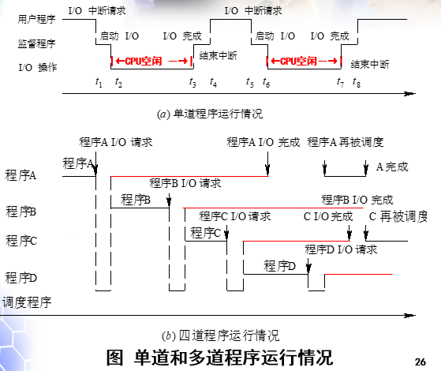

==**分时系统**==
计算机**以时间片**为单位轮流为各个用户/作业服务，各个用户可通过终端与计算机进行交互。**（实现人机交互的系统）**
分时系统实现中的**关键问题**：即使有多个用户同时通过自己的键盘键入命令，系统也应能全部地**及时接收并及时处理**。

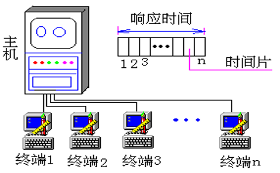

分时系统特征：
1、**多路性** 允许一台主机上联接多台终端，系统按分时原则为每个用户服务；
2、**独立性** 每个用户各占一个终端，独立操作，互不干扰；
3、**及时性** 用户的请求能在很短的时间内获得响应；
4、**交互性** 用户可通过终端与系统进行广泛的**人机对话**。
优点：用户请求可以被即时响应，解决了人机交互问题。允许多个用户同时使用一台计算机，并且用户对计算机的操作相互独立，感受不到别人的存在。
缺点：**不能有效处理紧急任务**操作系统对各个用户 / 作业都是**完全公平**的，循环地为每个用户 /作业服务一个时间片，不区分任务的紧急性。

==**实时系统**==
实时系统是指系统能**及时**(或即时)响应外部事件的请求，**在规定的时间内完成对该事件的处理**，并控制所有实时任务协调一致地运行。（对于某些紧急任务不需要时间片排队）
**实时任务类型**
（1）**按周期性划分**

- **周期性实时任务**     如信息采集

- **非周期性实时任务**

  ​          **开始**截止时间（**最晚开始**时间）：任务在某时间以前必须开始执行
  ​          **完成**截止时间（**最早完成**时间）：任务在某时间以前必须完成

（2）**按截止时间要求划分**

- **硬实时系统**：必须在绝对严格的规定时间内完成处理。
- **软实时系统**：能接受偶尔违反时间规定。

实时操作系统的主要特点是**及时性和可靠性**


==**其他操作系统**==

- **网络操作系统**
  在操作系统之上**增加网络功能**实现的。网络功能部分模块将网络中的各台计算设备通过各种**网络协议**，实现各台计算设备之间的通信及网络中各种**资源的共享**

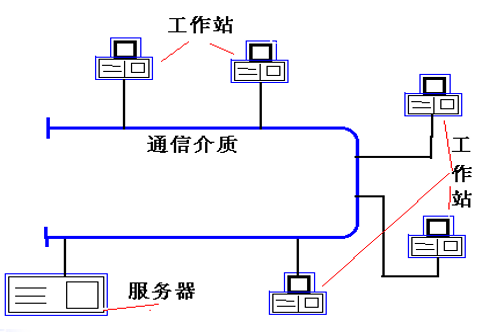
- **分布式操作系统**

  地位同等
  分布式操作系统和网络操作系统的本质不同：**系统中的各计算机相互协同并行完成同一任务**
  最主要的特点：**分布性和并行性**              

- **嵌入式操作系统**
  固话在硬件里面的系统、比如手机、路由器等

- **个人计算机操作系统**
  Windows、Linux等

### 5.操作系统运行环境

#### 操作系统运行机制

**两种指令**
指令：就是处理器（CPU）能识别、执行的最基本命令

- 特权指令： 如内存清零指令 --> 不允许用户程序使用。

- 非特权指令： 如普通的运算指令

**CPU如何判断当前是否可以执行特权指令？**

用程序状态寄存器（PSW）中的某标志位来标识当前处理器处于什么状态，如0为用户态，1为核心态。

**用户态（目态）**： 此时CPU只能执行非特权指令
**核心态（管态）**：特权指令、非特权指令都可以执行

**两种程序**

- **内核程序：** 操作系统的内核程序是系统的管理者，既可以执行特权指令，也可以执行非特权指令，运行在核心态。
- **应用程序：** 为了保证系统能安全运行，普通应用程序只能执行非特权指令，运行在用户态。

#### 中断和异常

**中断机制诞生**
早期的计算机：各程序只能串行执行，系统资源利用率低
为了解决上述问题，人们发明了操作系统（作为计算机的管理者），**引入中断机制**，实现了多道程序并发执行。
**本质：**发生中断就意味着需要操作系统介入，**开展工作**。

**中断概念和作用**
1、当**中断发生时**，**CPU立即进入核心态**
2、当**中断发生后**，**当前运行的进程暂停运行**，并由操作系统**内核**对中断进行**处理**
3、对于不同的中断信号，会进行不同的处理

由于操作系统的管理工作（比如进程切换、分配I/O设备等）需要使用特权指令，因此CPU要从用户态转为核心态。中断可以使CPU从用户态切换为核心态，使操作系统获得计算机的控制权。有了中断，才能实现多道程序并发执行。

**用户态、核心态之间的切换是怎么实现的？**

-  **用户态 --> 核心态**  是通过**中断**实现，并且中断是唯一途径。

-  **核心态 --> 用户态** 的切换是通过执行一个**特权指令**，将程序状态字（PSW）的标志位设置为用户态。

用户态和核心态就是**程序状态寄存器0或1**标志的，因此核心态到用户态可以通过特权指令进行设置！

**中断分类**

- 内中断
- 外中断

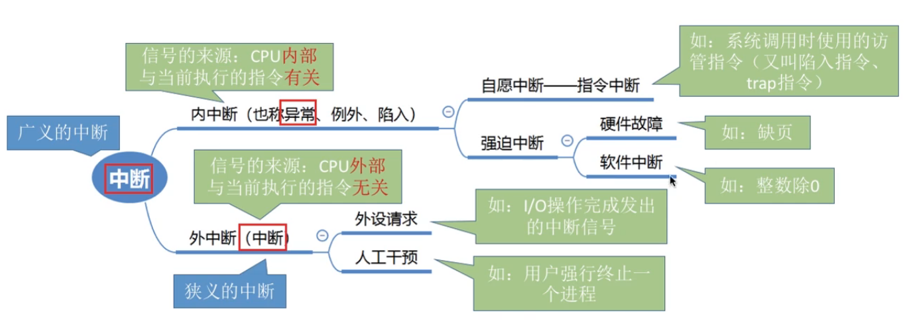

分类二

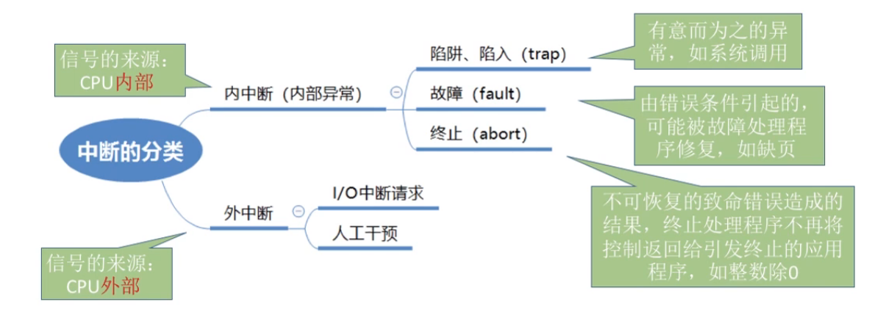

**外中断**
**外中断处理过程**

1. 执行完每个指令之后，CPU都要检查当前是否有外部中断信号

2. 如果检测到外部中断信号，则需要保护被中断进程的CPU环境（如程序状态字PSW、程序计数器PC、各种通用寄存器）
3. 根据中断信号类型转入相应的中断处理程序
4. 恢复原进程的CPU环境并退出中断，返回原进程继续往下执行

**更详细过程**

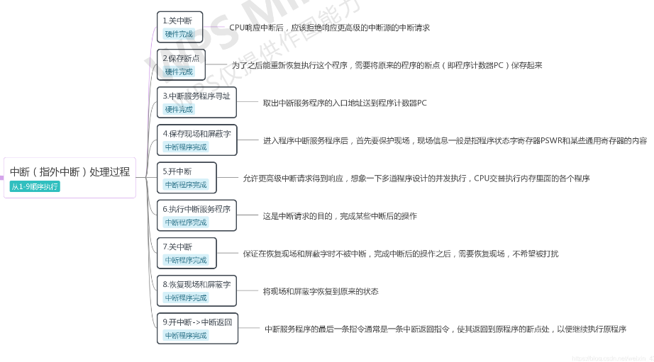

#### 系统调用

**什么是系统调用**
系统调用： 是操作系统提供给应用程序（程序员/编程人员）使用的**接口**，可以理解为一种可供应用程序调用的特殊函数，应用程序可以发出系统调用请求来**获得操作系统的服务。**

**功能：** 应用程序通过系统调用全球操作系统的服务。系统中的各种共享资源都由操作系统统一掌管，因此在用户程序中，凡是与**资源有关**的操作（如存储分配、I/O操作、文件管理等），都必须通过系统调用的方式**向操作系统提出服务请求**，由操作系统代为完成。这样可以保证系统的**稳定性和安全性**，防止用户进行非法操作。

系统调用相关处理涉及到对系统资源的管理、对进程的控制，这些功能需要执行一些**特权指令**才能完成，因此系统调用的线管处理需要在**核心态**下进行。

**系统调用按功能分类**

- **设备管理：**完成设备的请求/释放/启动等功能
- **文件管理**：完成文件的读/写/创建/删除等功能
- **进程控制：**完成进程的创建/撤销/阻塞/唤醒等功能
- **进程通信：**完成进程之间的消息传递/信号传递等功能
- **内存管理：**完成内存的分配/回收等功能

**系统调用与库函数的区别**

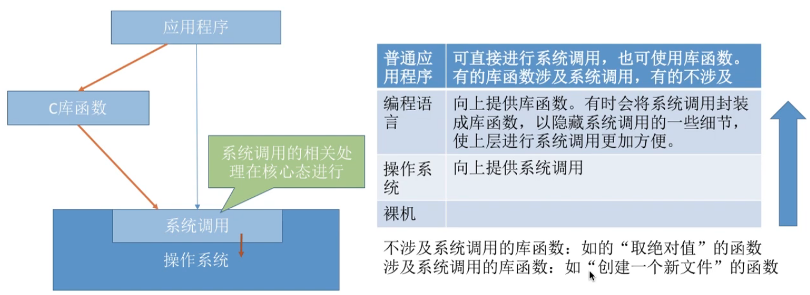

**系统调用背后的过程**

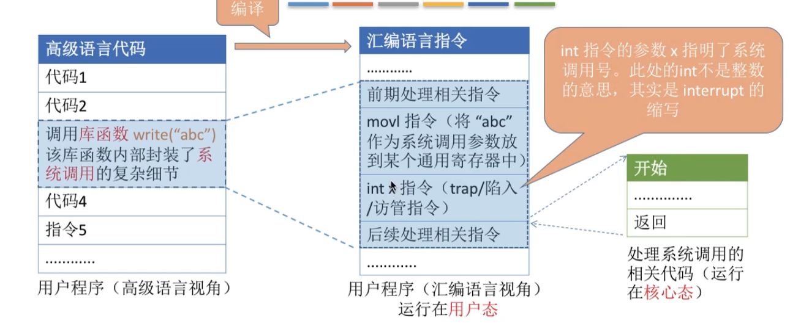

1. **陷入指令**是在**用户态**执行的，执行陷入指令之后立即**引发一个内中断**，**从而CPU进入核心态**。
2. 发出系统调用请求是在**用户态**，而对系统调用的相应处理在**核心态**下进行。
3. 陷入指令是**唯一**一个只能在**用户态**执行的**内中断指令**（特权指令），而不可在核心态执行的指令。

### 6.操作系统体系结构

#### 操作系统内核

**内核**：计算机上配置的**底层软件**，是操作系统最基本、最核心的部分。
**实现操作系统内核功能的那些程序就是内核程序。**

**时钟管理**： 实现计时功能

**中断处理**： 负责实现中断机制

**原语**

- 是一种特殊的程序
- 处于操作系统最底层，是最接近硬件的部分
- 这种程序的运行具有原子性 —— 其运行只能一气呵成，不可中断
- 运行时间较短，调用频繁

**对系统资源进行管理的功能** （有的操作系统不把这部分功能归为 “ 内核功能 ”。也就是说不同的操作系统，对内核功能的划分可能并不一样）

- 进程管理
- 存储器管理
- 设备管理

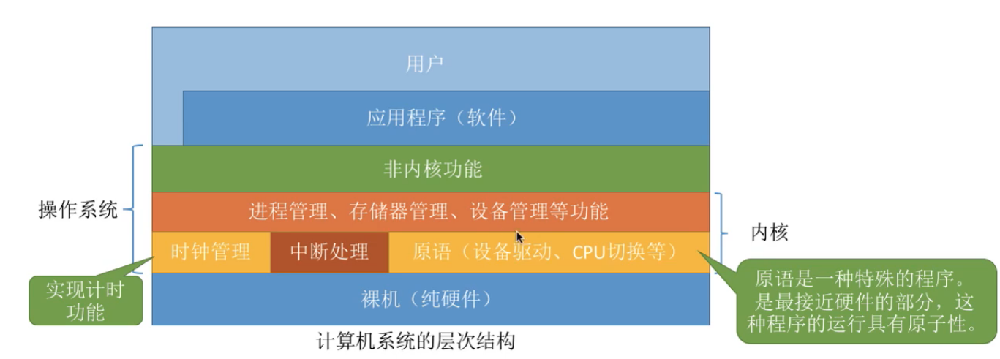

#### 体系结构

- **大内核**

  - 将操作系统的主要功能模块都作为系统内核，运行在核心态
  - **优点**：高性能
  - **缺点**：内核代码庞大，结构混乱，难以维护

- **微内核**

  - 只把最基本的功能保留在内核
  - **优点**：内核功能少，结构清晰，方便维护
  - **缺点**：需要频繁地在核心态和用户态之间切换，性能低

  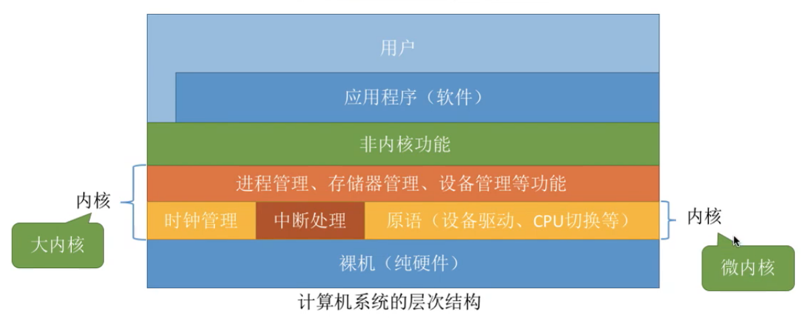

## 二.进程管理

**前趋图**

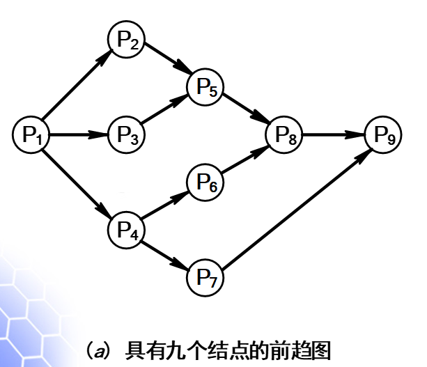

### 1.**进程与线程**

#### 1.1进程概述

**a.程序的顺序执行及其特征**

- 顺序执行 单道批处理系统的执行方式

​        特征：顺序性 封闭性 可再现性

- 并发执行 提高资源利用率
  ==谁先做不知道都有可能，中间谁停下来谁开始不清楚==

   特征：间断性 失去封闭性 不可再现性

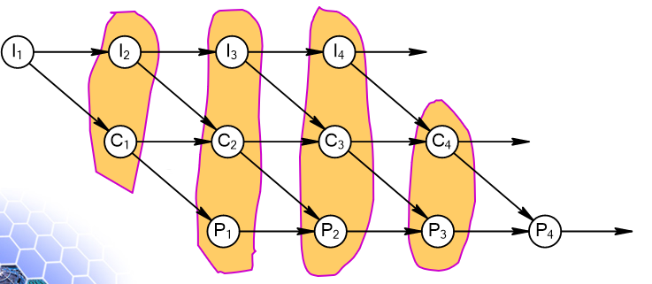

$$
(R(P1)\cap W(P2))\cup (R(P2)\cap W(P1))\cup (W(P1)\cap W(P2))={\varphi}
$$
如果满足上述公式则可以**并发执行且有可再现性**


**b.进程的概念**

**引入进程概念**是为了更好地描述和控制程序的并发执行，实现操作系统的并发性和共享性
PCB： 系统为每个运行的程序配置一个数据结构，称为进程控制块（PCB），用来描述进程的各种信息（如代码存放位置）

==PCB、程序段、数据段==三部分构成了进程实体（进程映像）。一般情况下，我们把进程实体简称为进程，例如，**所谓创建进程**，实质上是创建进程实体中的PCB；而**撤销进程**，实质上是撤销进程实体中的**PCB**。

**PCB是进程存在的唯一标志！**

**定义： 强调动态性**

- 进程是程序的一次执行过程。

- 进程是一个程序及其数据在处理机上顺序执行时所发生的活动。
- 进程是具有独立功能的程序在数据集合上运行的过程，它是系统进行资源分配和调度的一个独立单位。

**进程是进程实体的运行过程，是系统进行资源分配和调度的一个独立单位。**也就是“时间片”分配的独立单位，所以进程是一个动态的过程性的概念

严格来说，进程实体和进程不一样，**进程实体是静态的，进程则是动态的。**

**c.进程组成**

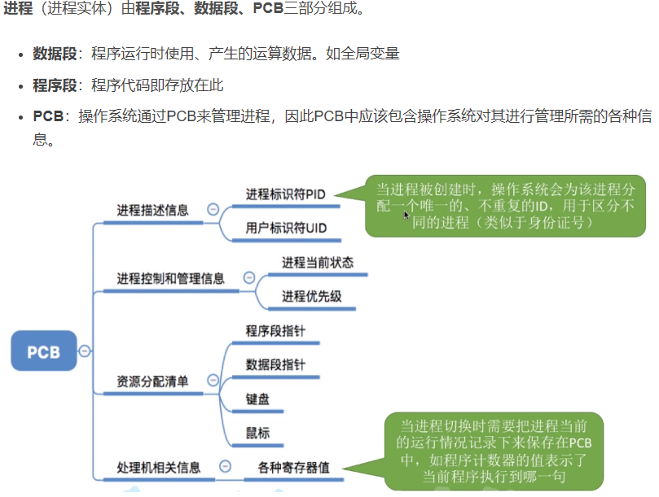

**d.进程的特征**：

- 动态性  进程的最基本特征
- 并发性  并发执行，提高资源利用率
- 独立性  进程实体是一个能独立运行、独立获得资源和独立接受调度的基本单位
- 异步性  异步性会导致执行结构的**不可再现性**，也就是运行结果的不确定性
- 结构特征 程序段 数据段 PCB

**e.进程组织**
进程的组成讨论的是**一个进程**内部由哪些部分构成的问题，而进程的组织讨论的是**多个进程**之间的组织方式问题。

- 线性方式
- 链接方式

​                  **按照进程状态**将PCB分为多个队列（就绪队列、若干阻塞队列、空闲队列）

​                  操作系统持有指向各个队列的指针

- 索引方式

​                  根据进程状态的不同，建立几张索引表（如就绪索引表、阻塞索引表 ）

​                  操作系统持有指向各个索引表的指针

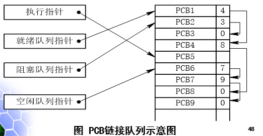

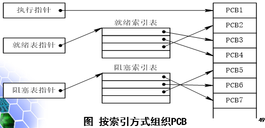


#### 1.2进程状态与转换

**进程状态**（前三种是基本状态）

- ==就绪态==
  已经获得了**除处理机之外**的所需资源，等待分配处理机资源，只要分配CPU就可以运行
  一个系统中多个处于就绪状态的进程排成**就绪队列**

- ==执行态==
  占有CPU，并在CPU上运行
  处于就绪状态的进程**一旦获得了处理机**,就可以运行,进程状态也就处于执行状态。
  处于此状态的进程的数目**小于等于**CPU的数目。（单核双核）

- ==阻塞态==
  因等待某一事件而暂时不能运行。即使处理机空闲也不能运行

- ==创建态==
  进程正在被创建，尚未转到就绪态（未放入就绪队列），操作系统为进程分配资源、初始化PCB

- ==终止态==

进程正从系统中消失，可能是进程**正常结束**或**异常结束**，操作系统已将其从系统队列中移出，但**尚未撤销**。（回收进程拥有的资源、撤销PCB）

​       ==挂起状态==

- 终端用户的请求  用户发现运行期间发现可疑问题
- 父进程请求     父要考察修改子
- 操作系统的需要  检查运行中的资源使用情况
- **对换的需要**     缓和内存紧张，将阻塞进程换到外存上（有别阻塞状态）
- 负荷调节的需要    在实时系统中为了调整工作负荷可将不重要的进程挂起


**进程转换**

- 处理机是否占用

- 其他是否拥有

  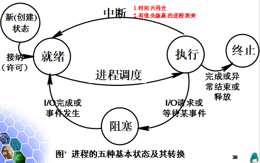

  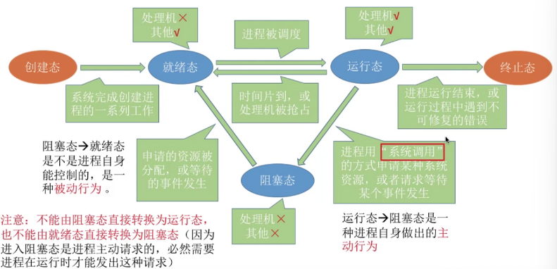

#### 1.3进程控制 

进程管理的**最基本**的功能

- 创建新进程
- 撤销已结束进程
- 终止由于某事件而无法运行下去的进程
- 实现进程状态转换

**==原语==：进程控制用的程序（不可中断，不可分割的基本单位）**

**原语任务**

- 更新PCB中的信息（如修改进程状态，将运行环境保存到PCB、从PCB恢复运行环境）
  - 所有的进程控制原语一定都会**修改**进程状态**标志**
  - 剥夺当前运行进程的CPU使用权必然需要**保存**其运行**环境**
  - 某进程开始运行前必然要**恢复**其运行环境
- 将PCB插入合适的队列
- 分配/回收资源

------

- ==进程的创建==

子撤销的时候，资源都还给父；父撤销的时候，子必须都撤销

若分配资源资源的时候空间不足，不是创建失败而是处于**阻塞状态**，等待内存资源

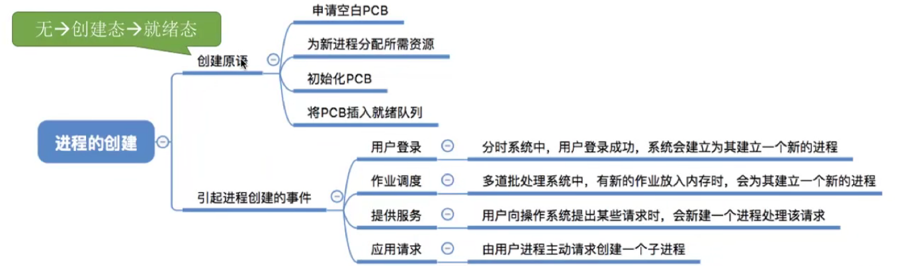

- ==进程的终止==

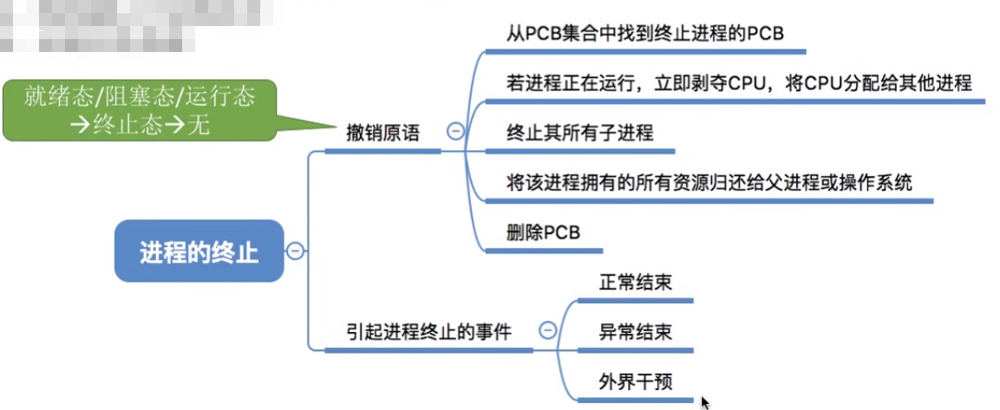

- ==进程的阻塞与唤醒==

进程的阻塞是主动行为，因此只有执行态的进程才能进入阻塞态

Block和Wakeup源语必须成对使用


- ==进程切换==

内核支持下完成的


#### 1.4进程通信

a.进程通信的类型

进程通信：
**进程通信**是指进程之间的信息交换。
**进程**是**分配系统资源的单位**（包括内存地址空间)，因此各进程拥有的内存地址空间**相互独立**。
为了保证安全，一**个进程不能直接访问另一个进程的地址空间**。
但是进程之间的信息交换又是必须实现的。为了保证进程间的安全通信，操作系统提供了一些方法。

- 低级通信机制：仅交换少量数据和一些状态，如P.V

- 高级通信机制：交换信息量大，可以直接利用OS提供的命令高效传输。

  > ==共享存储器系统==
  >
  > - **基于数据结构共享**：比如共享空间里只能放一个长度为10的数组。这种共享方式速度慢、限制多，是一种**低级通信**方式
  > - **基于存储区共享**：基于在内存中画出一块共享存储区，数据的形式、存放位置都由进程控制，而不是操作系统。相比之下，这种共享方式速度更快，是一种**高级通信**方式。
  >
  > 
  >
  > ==消息传递系统==
  >
  > 进程间的数据交换以格式化的消息（Message）为单位。进程通过操作系统提供的“发送消息 / 接收消息”两个原语进行数据交换。
  >
  > 消息
  >
  > 消息头：包括发送进程ID、接受进程ID、消息类型、消息长度等格式化的信息（计算机网络中发送的“报文”其实就是一种格式化的消息)
  > 消息体
  > 消息传递方式
  >
  > 直接消息传递：消息直接挂到接收进程的消息缓冲队列上
  > 间接消息传递：消息要先发送到中间实体（信箱）中，因此也称“信箱通信方式”。Eg：计网中的电子邮件系统
  >
  > ==管道通信系统==
  >
  > “管道”是指用于连接读写进程的一个共享文件，又名pipe文件。其实就是在内存中开辟一个大小固定的缓冲区
  >
  > - 管道只能采用半双工通信，某一时间段内只能实现单向的传输。如果要实现双向同时通信，则需要设置两个管道。
  > - 各进程要互斥地访问管道。
  > - 数据以字符流的形式写入管道，当管道写满时，写进程的write() 系统调用将被阻塞，等待读进程将数据取走。当读进程将数据全部取走后，管道变空，此时读进程的read() 系统调用将被阻塞。（缓冲区的特性）
  > - 如果没写满，就不允许读。如果没读空，就不允许写。（缓冲区的特性）
  > - 数据一旦被读出，就从管道中被抛弃，这就意味着读进程最多只能有一个，否则可能会有读错数据的情况。
  >
  > 
  >
  > 客户机—服务器系统
  >
  > 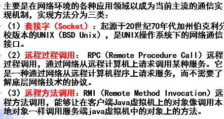


b.消息传递通信的实现方法
- 直接通信方式
   send;    receive;
- 间接通信方式
信箱：用于暂存发送进程发送给目标进程的**消息**的**中间实体**
>- 信箱的的创建和插销
>  创建者进程应给出信箱名字、信箱属性（公用 私用或共享）
> 消息的发送和接收-->send  receive

**send(receiver,mailbox)   receive(sender,mailbox)**

 信箱的分类
 - 私用信箱
                   用户自己创建
                !
 - 公用信箱
                    操作系统创建，可以发送也可以读取。显然公用信箱应采用双向通信链路。（系统运行期间始终存在）
 - 共享信箱

c.消息传递系统实现中的若干问题


d.消息缓冲队列通信机制
a.数据结构：消息缓冲区   **临界资源是整个消息缓冲队列**

```pascal
type message buffer=record
               sender; {发送者进程标识符}
          size; {消息长度}
                text; {消息正文}
               next; {指向下一个消息缓冲区的指针}

         end
```


b.PCB有关通信的数据项

```Pascal
type PCB=record
               mq; {消息队列队首指针}
               mutex; {消息队列互斥信号量}
               sm; {消息队列资源信号量}
                                end
```

#### 1.5线程概念&多线程模型

==线程概述==
有的进程可能需要“同时”做很多事，而传统的进程只能串行地执行一系列程序。为此，引入了“线程”，来**增加并发度。**
- 传统的进程是程执行流的最小单位 
- 引入线程后，线程成为了程序执行流的最小单位

**可以把线程理解为“轻量级进程”**。
**线程**是一个基本的**CPU执行单元**，也是**程序执行流的最小单位**。

引入线程之后，不仅是**进程之间可以并发**，进程内的**各线程之间也可以并发**，从而进一步提升了系统的并发度，使得一个进程内也可以并发处理各种任务（如QQ视频、文字聊天、传文件)
引入线程后，**进程**只作为**除CPU之外的系统资源的分配单元**（如打印机、内存地址空间等都是分配给进程的）。

**引入线程带来的变化**
**资源分配、调度**
- 传统进程机制中，进程是资源分配、调度的基本单位
- 引入线程后，进程是资源分配的基本单位，线程是调度的基本单位

**并发性**
- 传统进程机制中，只能进程间并发
- 引入线程后，各线程间也能并发，提升了并发度

**系统开销**
- 传统的进程间并发，需要切换进程的运行环境，系统开销很大
- 线程间并发，如果是同一进程内的线程切换，则不需要切换进程环境，系统开销小
- 引入线程后，并发所带来的**系统开销减小**

**线程属性**
- 线程是处理机调度的单位
- 多CPU计算机中，各个线程可占用不同的CPU
- 每个线程都有一个线程ID、线程控制块(TCB)
- 线程也有就绪、阻塞、运行三种基本状态
- 线程几乎不拥有系统资源
- 同一进程的不同线程间共享进程的资源
- 由于共享内存地址空间，同- -进程中的线程间通信甚至无需系统干预
- 同一进程中的线程切换，不会引起进程切换
- 不同进程中的线程切换，会引起进程切换
- 切换同进程内的线程，系统开销很小
- 切换进程，系统开销较大

**线程实现方式**
    **用户级线程**
- 用户级线程由应用程序通过线程库实现。所有的线程管理工作都由应用程序负责（包括线程切换)
- 用户级线程中，线程切换可以在用户态下即可完成，无需操作系统干预。
- 在用户看来，是有多个线程。但是在操作系统内核看来，并意识不到线程的存在。（用户级线程对用户不透明，对操作系统透明)
- 可以这样理解，“用户级线程”就是“从用户视角看能看到的线程”

    **内核级线程**
- 内核级线程的管理工作由操作系统内核完成。线程调度、切换等工作都由内核负责，因此内核级线程的切换必然需要在核心态下才能完成。
- 可以这样理解，“内核级线程”就是“从操作系统内核视角看能看到的线程”
在同时支持用户级线程和内核级线程的系统中，可采用二者组合的方式:将n个用户级线程映射到m个内核级线程上 **( n >= m)**
- 操作系统只“看得见”内核级线程，因此只有内核级线程才是处理机分配的单位。
- 例如：该进程由两个内核级线程，三个用户级线程，在用户看来，这个进程中有三个线程。但即使该进程在一个4核处理机的计算机上运行，也最多只能被分配到两个核，最多只能有两个用户线程并行执行（只能分配到有限的两个内核级线程）。

**多线程模型**
在同时支持用户级线程和内核级线程的系统中，由**几个用户级线程映射到几个内核级线程**的问题引出了“多线程模型”问题。

==**多对一模型**==：多个用户及线程映射到一个内核级线程。每个用户进程只对应一个内核级线程。
- 优点:用户级线程的切换在用户空间用户态即可完成，不需要切换到核心态，线程管理的系统开销小，效率高
- 缺点:当一个用户级线程被阻塞后，整个进程都会被阻塞，并发度不高。多个线程不可在多核处理机上并行运行（只有一个内核级线程）

**==一对一模型==**：一个用户及线程映射到一个内核级线程。每个用户进程有与用户级线程同数量的内核级线程。
- 优点:当一个线程被阻塞后，别的线程还可以继续执行，并发能力强。多线程可在多核处理机上并行执行。
- 缺点:一个用户进程会占用多个内核级线程，线程切换由操作系统内核完成，需要切换到核心态，因此线程管理的成本高，开销大。

==**多对多模型**==：n用户及线程映射到m个内核级线程(n >= m) 。每个用户进程对应m个内核级线程。
- 克服了多对一模型并发度不高的缺点，又克服了一对一模型中一个用户进程占用太多内核级线程，开销太大的缺点。
### **2.处理机调度及调度算法**
#### **2.1处理机调度**
当有一堆任务要处理，但由于**资源有限**，这些事情没法同时处理。这就需要确定某种规则来决定处理这些任务的顺序，这就是“调度”研究的问题。
在多道程序系统中，进程的数量往往是多于处理机的个数的，这样不可能同时并行地处理各个进程。**处理机调度**，就是从就绪队列中按照一定的**算法**选择一个进程并将处理机分配给它运行，以实现进程的**并发执行**。

##### 高级、中级和低级调度
==高级调度==
由于内存空间有限，有时无法将用户提交的作业全部放入内存，因此就需要确定某种规则来决定将作业调入内存的顺序
 **高级调度（作业调度、长程调度、接纳调度）**：按一定的原则从外存上处于后备队列的作业中挑选一个（或多个）作业，给他们分配内存等必要资源，并建立相应的进程（建立PCB），以使它（们）获得竞争处理机的权利。
高级调度是**辅存（外存）与内存**之间的调度。**每个作业只调入一次，调出一次**。作业调入时会建立相应的PCB，作业调出时才撤销PCB。高级调度主要是指调入的问题，因为只有调入的时机需要操作系统来确定，但调出的时机必然是作业运行结束才调出。
每次执行调度的时候都要进行两个决定：
- 接纳多少个作业
   取决于多道程序度（允许多少个作业同时在内存中运行），作业太少（资源利用率低），作业太多（服务质量下降）
- 接纳哪些作业 作业调度算法：先来先服务，短作业优先，优先权高优先


==中级调度==
引入了**虚拟存储技术**之后，可将**暂时**不能运行的进程**调至外存等待**。等它重新具备了运行条件且内存又稍有空闲时，再重新调入内存。
这么做的目的是为了**提高内存利用率和系统吞吐量**。
暂时调到外存等待的进程状态为**挂起态**。值得注意的是，**PCB并不会一起调到外存，而是会常驻内存**。PCB中会记录进程数据在外存中的存放位置，进程状态等信息，操作系统通过内存中的PCB来保持对各个进程的监控、管理。被挂起的进程PCB会被放到的挂起队列中。
**中级调度（内存调度）**：就是要决定将哪个处于**挂起状态的进程重新调入内存**。
一个进程可能会被**多次调出、调入内存**，因此中级调度发生的频率要比高级调度更高。

==低级调度==
**低级调度（进程调度、短程调度)**:其主要任务是按照某种方法和策略从**就绪队列中选取一个进程，将处理机分配给它**。
进程调度是操作系统中最基本的一种调度，在一般的操作系统中都必须配置进程调度。
进程调度的频率很高，一般几十毫秒一次。

**常见的低级调度有非抢占式和抢占式**--->**进程调度的方式**
- **非抢占式（非剥夺方式）**
     一旦将处理机分配给某进程,便让该进程一直执行,直至该进程完成或阻塞时再分配给其他进程
     
- **抢占式（剥夺方式）**
     允许调度程序根据某种原则,暂停正在执行的进程,将处理机分配给其他进程
     抢占式调度原则：优先权原则，短作业优先，时间片原则（时间片用完后停止执行，适用于**分时系统**）
     ->增加了进程调度的次数，但保证了系统的实时性


##### 调度队列模型
1.仅有进程调度的调度队列模型

2.具有高级和低级调度的调度队列模型

3.同时具有三级调度的调度队列模型

##### 选择调度方式和调度算法的若干准则
A.面向用户的准则
- 周转时间短
  $$平均周转时间：T = \frac{1}{n}[\sum_{i=1}^{n}T_{i}]  $$
  $$带权周转时间：W = \frac{T}{T_{s}}$$
  $$平均带权周转时间：W = \frac{1}{n}[\sum_{i=1}^{n}\frac{T_{i}}{T_{Si}}]  $$
  - 响应时间快（常用于评价分时系统）
    a.**响应时间**是指从用户通过键盘**提交一个请求开始**,直至屏幕上**显示出处理结果**为止的一段时间间隔。
    b.**响应时间**包括**键盘输入请求信息传送到处理机的时间**、**处理机对请求的处理时间**和**响应信息送回到终端的时间**
  
  - 截止时间保证
   a.**截止时间**是指某任务必须**开始执行的最迟时间或必须完成的最迟时间**
    b.截止时间是**实时系统**中的重要指标
  
 -  优先权准则
   a.在**批处理、实时和分时系统**中都可以选择优先权准则,以便让紧急任务先处理
      b.有时还选择抢占式调度方式

B.面向系统的准则
系统吞吐量高  处理机利用率高  各类资源的平衡利用（性）
使内存、外存和I/O设备的利用率高

 ##### 七状态模型
 

##### 进程调度的时机
**需要进行进程调度与切换的情况**
- 当前运行的进程主动放弃处理机
      进程正常终止
       运行过程中发生异常而终止进程主动请求阻塞（如等待l/O)
- 当前运行的进程被动放弃处理机
      分给进程的时间片用完
      有更紧急的事需要处理（如I/O中断)有更高优先级的进程进入就绪队列
      

**不能进行进程调度与切换的情况**
- 在**处理中断的过程中**。中断处理过程复杂，与硬件密切相关，很难做到在中断处理过程中进行进程切换。
- 进程在操作系统内核程序**临界区**中。
- 在**原子操作**过程中（原语)。原子操作不可中断，要一气呵成（如之前讲过的修改PCB中进程状态标志，并把PCB放到相应队列)
**临界资源**：一个时间段内只允许一个进程使用的资源。各进程需要互斥地访问临界资源。
**临界区**：访问临界资源的那段代码。

##### 进程调度的切换和过程

#### 2.2进程调度算法
**CPU利用率** ：指CPU “忙碌”的时间占总时间的比例。
利用率 = 忙碌的时间 / 总时间

**系统吞吐量**：单位时间内完成作业的数量
系统吞吐量 = 总共完成了多少道作业 / 总共花了多少时间

**周转时间**：是指从作业被提交给系统开始，到作业完成为止的这段时间间隔。
- 作业在外存后备队列上等待作业调度（高级调度）的时间、
- 进程在就绪队列上等待进程调度（低级调度）的时间、
- 进程在CPU上执行的时间、
- 进程等待I/O操作完成的时间

**等待时间，**指进程 / 作业处于等待处理机状态时间之和，等待时间越长，用户满意度越低。
- 无I/O处理：等待时间 = 周转时间 - 运行时间
- 有I/O处理：等待时间 = 周转时间 - 运行时间 - I/O处理时间
     - 对于进程来说，等待时间就是指进程建立后等待被服务的时间之和，在等待I/O完成的期间其实进程也是在被服务的，所以不计入等待时间。
    - 对于作业来说，不仅要考虑建立进程后的等待时间，还要加上作业在外存后备队列中等待的时间。
     一个作业总共需要被CPU服务多久，被I/O设备服务多久一般是确定不变的，因此调度算法其实只会影响作业 / 进程的等待时间。当然，与前面指标类似，也有“平均等待时间”来评价整体性能。

**响应时间**，指从用户提交请求到首次产生响应所用的时间。

```
周转时间=结束执行时间-进入磁盘时间
等待时间 = 周转时间-运行时间-（I/O服务时间）
带权周转时间=周转时间/服务时间
高响应比=(等待时间+服务时间)/服务时间 或=等待时间/服务时间
```
##### ==先来先服务调度算法（FCFS）==
按照作业 / 进程到达的**先后顺序**进行服务
**用于作业 / 进程调度**：用于作业调度时，考虑的是哪个作业先到达后备队列；用于进程调度时，考虑的是哪个进程先到达就绪队列
**非抢占式的算法**
优点：公平、算法实现简单
缺点：排在长作业（进程）后面的短作业需要等待很长时间，带权周转时间很大，对短作业来说用户体验不好。即，FCFS算法对**长作业有利，对短作业不利**
**不会产生饥饿现象**


##### ==短作业（进程）优先算法 SJ(P)F==
算法思想：追求最少的平均等待时间，最少的平均周转时间、最少的平均平均带权周转时间（选择当前已到达的时间最短的执行）
算法规则： 最短的作业 / 进程优先得到服务（所谓“最短”，是指要求服务时间最短）
**即可用于作业调度，也可用于进程调度。**
非抢占式的算法。但是也有抢占式的版本——最短剩余时间优先算法（**SRTN**）（新到达的进程的剩余时间比当前运行的进程剩余时间更短，新进程抢占处理机）
- 优点:“最短的”平均等待时间、平均周转时间（抢占式的SRTN更短）
- 缺点:不公平。对短作业有利，对长作业不利。可能产生饥饿现象。另外，作业/进程的运行时间是由用户提供的，并不一定真实，不一定能做到真正的短作业优先，所以**必须预知作业的运行时间**。完全未考虑作业的**紧迫程度**
会产生饥饿。如果源源不断地有短作业/进程到来，可能使长作业/进程长时间得不到服务，产生“饥饿”现象。如果一直得不到服务，称为“饿死”


这里面，等待时间 = 开始执行时间-进入磁盘时间（**某些时候不成立）**

##### ==高优先权优先调度算法==
a.优先权调度算法
**既可用于作业调度，也可用于进程调度**。甚至，还会用于在之后会学习的I/O调度中
**抢占式、非抢占式都有**。做题时的区别在于:非抢占式只需在进程主动放弃处理机时进行调度即可，而抢占式还需在就绪队列变化时，检查是否会发生抢占。（即新到达的是否比正在运行的优先级要高，高则抢占处理机）
**会产生饥饿**

b.优先权的类型
a.静态优先权
    创建进程时确定的
b.动态优先权
    随着进程的推进或者等待时间的增加而改变
    
**c.合理设置优先级**
- 合理高于用户进程
- 前台进程优先级高于后台进程
- 操作系统更偏好l/O型进程（或称IO繁忙型进程）
注：与I/O型进程相对的是计算型进程（或称CPU繁忙型进程）

d.**什么时候跳转优先级？**
可以从追求公平、提升资源利用率等角度考虑
如果某进程在就绪队列中等待了很长时间，则可以适当提升其优先级，如果某进程占用处理机运行了很长时间，则可适当降低其优先级如果发现一个进程
频繁地进行l/O操作，则可适当提升其优先级

3.高响应比优先调度算法（HRF）

**高响应比1 =等待时间/服务时间
高响应比2 =(等待时间+服务时间)/服务时间**
**即可用于作业调度，也可用于进程调度**
**非抢占式的算法。因此只有当前运行的作业/进程主动放弃处理机时，才需要调度，才需要计算响应比**

优缺点：
- 综合考虑了等待时间和运行时间（要求服务时间)
- 等待时间相同时，要求服务时间短的优先（SJF的优点)
- 要求服务时间相同时，等待时间长的优先(FCFS的优点)
- 对于长作业来说，随着等待时间越来越久，其响应比也会越来越大，从而避免了长作业饥饿的问题
**不会产生饥饿**


由此我们由优先比可以得到：
(1)如果作业的等待时间相同,则要求服务的时间愈短,其优先权愈高,因而该算法有利于短作业。
(2)当要求服务的时间相同时,作业的优先权决定于其等待时间,等待时间愈长,其优先权愈高,因而它实现的是先来先服务。
(3)对于长作业,作业的优先级可以随等待时间的增加而提高,当其等待时间足够长时,其优先级便可升到很高,从而也可获得处理机。  


**总结比较**

##### ==基于时间片的轮转调度算法==
算法思想：公平地、轮流地为各个进程服务，让每个进程在一定时间间隔内都可以得到响应
算法规则：按照各进程到达就绪队列的顺序，轮流让各个进程执行一个**时间片**（如100ms）。若进程未在一个时间片内执行完，则剥夺处理机，将进程重新放到就绪队列队尾重新排队。
**用于进程调度**(只有作业放入内存建立了相应的进程后，才能被分配处理机时间片）
若进程未能在时间片内运行完，将被强行剥夺处理机使用权，因此时间片轮转调度算法属于**抢占式的算法**。由时钟装置发出时钟中断来通知CPU时间片已到
优点：公平;响应快，适用于分时操作系统;
缺点：由于高频率的进程切换，因此有一定开销，**不区分任务的紧急程度**。时间片太大会退化为FCFS算法，太小进程切换开销太大！
**不会产生饥饿**


**等待时间 = 周转时间-运行服务时间**


##### 多级反馈队列调度算法
算法规则：
- 设置多级就绪队列，各级队列优先级**从高到低**，**时间片从小到大**
- 新进程到达时先进入第1级队列，按**FCFS原则**排队等待被分配时间片，若用完时间片进程还未结束，则进程进入下一级队列队尾。如果此时已经是在最下级的队列，则重新放回该队列队尾
- 只有第k级队列为空时，才会为k+1级队头的进程分配时间片用于进程调度
**抢占式的算法**。在k级队列的进程运行过程中，若更上级的队列(1~k-1级）中进入了一个新进程，则由于新进程处于优先级更高的队列中，因此新进程会抢占处理机，原来运行的进程放回k级队列队尾。

**优缺点：**
对各类型进程相对公平(FCFS的优点），每个新到达的进程都可以很快就得到响应（RR的优点），短进程只用较少的时间就可完成(SPF的优点），不必实现估计进程的运行时间（避免用户作假），可灵活地调整对各类进程的偏好程度，比如CPU密集型进程、I/O密集型进程（拓展:可以将因I/O而阻塞的进程重新放回原队列，这样/o型进程就可以保持较高优先级)

**会产生饥饿 （连续新进程到达，则会导致当前进程饿死）**

**总结2：**

### **3.进程同步**

####  3.1进程同步&进程互斥

**进程同步：**（直接制约关系）如： A->共享资源->B，，资源要是满了A被阻塞，B取走缓冲数据之后，A才能被唤醒

**进程互斥：**（间接制约关系）如A、B共享打印机，若A申请打印时,打印机已分配给B，则A只能阻塞，等B释放后再改为就绪

**临界资源：一个时间段内只允许一个进程使用的资源**

**临界资源互斥访问，可划分为四个部分：**

- ==进入区==：负责检查是否可进入临界区,若可进入，则应设置正在访问临界资源的标志（可理解为“**上锁**”)，以阻止其他进程同时进入临界区
- ==临界区==：**访问临界资源的那段代码**
- ==退出区==：负责解除正在访间临界资源的标志（可理解为“**解锁**”)
- ==剩余区==：做其他处理

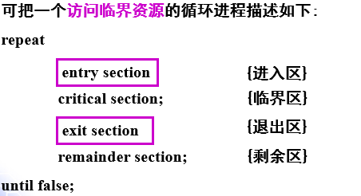


**同步机制应遵循的原则**

- ==空闲让进== 临界区空闲时，可以允许一个请求进入临界区的进程立即进入临界区;
- ==忙则等待==  当已有进程进入临界区时，其他试图进入临界区的进程必须等待;
- ==有限等待==  对请求访问的进程，应保证能在有限时间内进入临界区（保证不会饥饿）;
- ==让权等待==  当进程不能进入临界区时，应立即释放处理机，防止进程忙等待。


**进程互斥软件实现（没学）**
==**单标志法**==
**算法思想：**两个进程在访问完临界区后会把使用临界区的权限转交给另一个进程。也就是说每个进程进入临界区的权限只能被另一个进程赋予

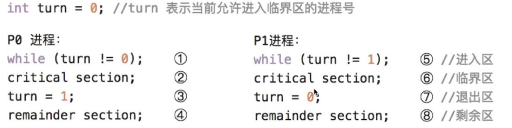

**该算法可以实现“同一时刻最多只允许一个进程访问临界区”**

**单标志法存在的主要问题是：违背“空闲让进”原则**。
由于执行顺序一定是P1P2轮流执行，因此P1只要不触发执行，P2一定无法执行！

==**双标志先检查法**==
**算法思想：**设置一个布尔型数组flag[]，数组中各个元素用来标记各进程想进入临界区的意愿，比如“flag[0]=ture”意味着0号进程P0现在想要进入临界区。每个进程在进入临界区之前先检查当前有没有别的进程想进入临界区，如果没有，则把自身对应的标志flag[i]设为true，之后开始访问临界区。

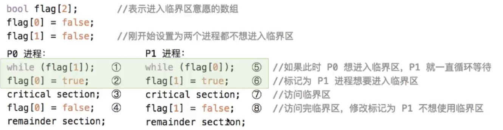

**双标志先检查法存在的主要问题是：违背“忙则等待”原则。**
第一步和第五步若发生进程切换，则对邻接资源的访问就不互斥
原因在于先检查的两句代码不是原子操作！

==**双标志后检查法**==
**算法思想**：双标志先检查法的改版。前一个算法的问题是先“检查”后“上锁”，但是这两个操作又无法一气呵成，因此导致了两个进程同时进入临界区的问题。因此，人们又想到先“上锁”后“检查”的方法，来避免上述问题。

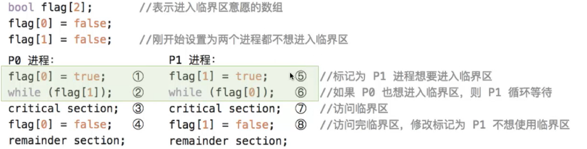

**解决了“忙则等待”的问题，但是又违背了“空闲让进”和“有限等待”**

同样第一步和第五步进程切换，就会发生二者都进不去临界区！

==**Peterson算法**==
**算法思想：**双标志后检查法中，两个进程都争着想进入临界区，但是谁也不让谁，最后谁都无法进入临界区。Gary L. Peterson想到了一种方法，如果双方都争着想进入临界区，那可以让进程尝试“孔融让梨”，**主动让对方**先使用临界区。

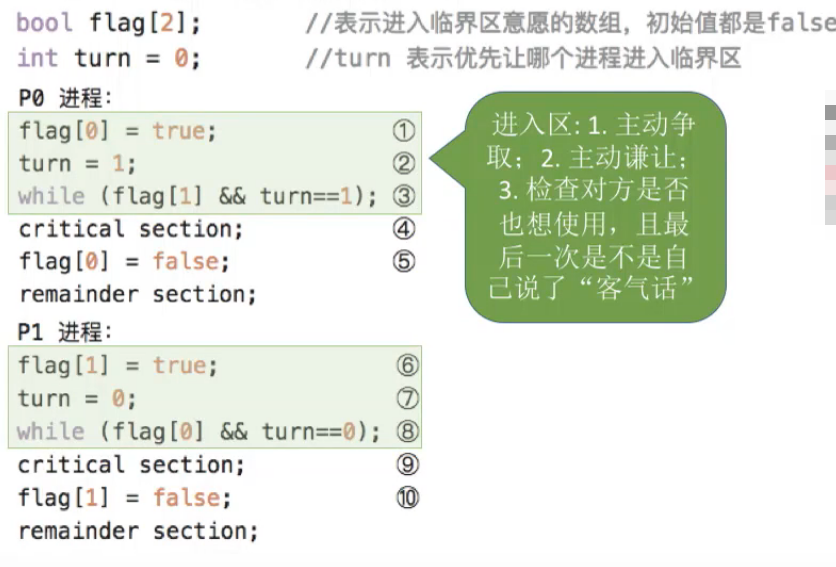

Peterson算法用软件方法解决了进程互斥问题，**遵循了空闲让进、忙则等待、有限等待三个原则，但是依然未遵循让权等待的原则。**


**进程互斥硬件实现（没学）**
==**中断屏蔽方法**==
利用“开 / 关中断指令”实现（与原语的实现思想相同，即在某进程开始访问临界区到结束访问为止都不允许被中断，也就不能发生进程切换，因此也不可能发生两个同时访问临界区的情况）

- 关中断

- 临界区
- 开中断
- 
**优点**：简单、高效

**缺点**：**不适用于多处理机；**只适用于操作系统内核进程，不适用于用户进程（**因为开** / 关中断指令 只能运行在内核态，这组指令如果能让用户随意使用会很危险）

==**TestAndSet指令**==
简称TS 指令，也有地方称为TestAndSetLock 指令，或TSL 指令 . TSL 指令是用**硬件实现**的，**执行的过程不允许被中断，只能一气呵成。**

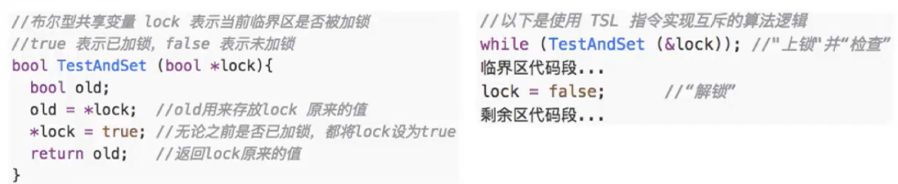

相比软件实现方法，TSL指令把“上锁”和“检查”操作用硬件的方式变成了一气呵成的**原子操作**。

**优点**：实现简单，无需像软件实现方法那样严格检查是否会有逻辑漏洞;适用于多处理机环境

**缺点**：不满足“让权等待”原则，暂时无法进入临界区的进程会占用CPU并循环执行TSL指令，从而导致“忙等”。

==**Swap指令**==
有的地方也叫Exchange 指令，或简称XCHG 指令。
Swap 指令是用**硬件实现**的，执行的过程不允许被中断，只能一气呵成。

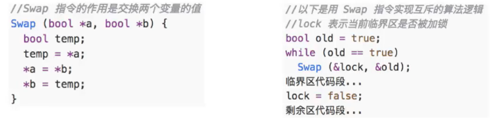

逻辑上来看Swap 和TSL 并无太大区别，都是先记录下此时临界区是否已经被上锁（记录在old量上），再将上锁标记lock 设置为true，最后检查 old，如果 old 为false 则说明之前没有别的进程对临界区上锁，则可跳出循环，进入临界区。

**优点**：实现简单，无需像软件实现方法那样严格检查是否会有逻辑漏洞；**适用于多处理机环境**

**缺点**：**不满足“让权等待”原则，**暂时无法进入临界区的进程会占用CPU并循环执行TSL指令，从而导致“忙等”。


#### 3.2信号量机制

**A.整形信号量**

```c
int S = 1;//初始化整形信号量，表示当前系统中可用的打印机资源数
void wait(S){//P（S）
    while(S<=0);/* do no-op*/  //这里违反了让权等待原则
    S--;//如果资源数够，就占用一个资源
}
signal(S){//V（S）
    S++;//使用完资源之后，释放资源
}
```

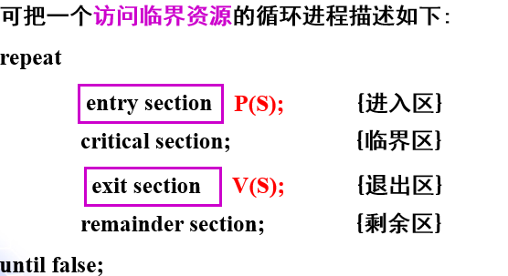

**B.记录型信号量**（！！！）

```C
typedef struct{
    int value;//剩余资源数
    struct process *L;//等待队列
}semaphore;
void wait(semaphore S){
    S.value--;
    if(S.value<0) block(S.L);
    //如果资源数不够，就使用block原语使进程从运行态进入阻塞态，并把挂到信号量S的等待队列（阻塞队列）中
}
void signal(semaphore S){
    s.value++;
    if(S.value<=0) wakeup(S.L);
    //释放资源后，若还有别的进程在等待这个资源，就使用wakeup这个原语唤醒等待队列中的一个进程，该进程由阻塞态进入就绪态
}
```


**C. AND型信号量**

```c
//将进程在整个运行过程所需要的所有资源，一次性全部分配给进程，待进程使用完后一起释放
Swait(S1,S2,...,Sn){
    while(true){
        if(Si>=1&&...&&Sn>=1){
            for(i=1;i<=n;i++)Si--;
            break;
        }else{
            //将进程放到等待资源Si的队列中
            //阻塞态，去第一个Si<1的阻塞队列中排队，并置它的程序计数器于SP操作的起始点
        }
    }
}

Ssignal(S1,S2,...,Sn){
    while(true){
        for(int i = 1;i<=n;i++){
            Si++;//释放所有资源
            //（唤醒，阻塞状态置为就绪态，移到就绪队列当中）
        }
    }
}
```


**D.信号量集**

一次申请多个资源，对AND型信号量机制扩充的基础上，形成一般化的“信号量集”机制。

Sp（s1，t1, d1）//S1代表信号量，t1代表该资源分配下的限值，d1代表进程对该资源的需求。

几种特殊情况

-  ==SP(S, d, d)==

  此时在信号量集中只有一个信号量S, 但允许它每次申请d个资源,当现有资源数少于d时,不予分配。

- ==SP(S, 1, 1)==

  此时的信号量集已蜕化为一般的记录型信号量(S＞1时)或互斥信号量(S=1时)。

- ==SP(S, 1, 0)==

  这是一种很特殊且很有用的信号量操作。当S≥1时,允许多个进程进入某特定区;当S变为0后,将阻止任何进程进入特定区。换言之,它相当于一个**可控开关**。 

  

##### **信号量的应用**

==**信号量实现进程互斥**==

- 分析并发进程的关键活动，划定临界区（如：对临界资源打印机的访问就应放在临界区）

- 设置互斥信号量**mutex**，初值为1
- 在进入区**P(mutex)**——申请资源
- 在退出区**V(mutex)**——释放资源
- 理解：信号量mutex 表示“进入临界区的名额”

注意：

- 对不同的临界资源需要设置不同的互斥信号量。
- **P、V操作必须成对出现**。缺少P(mutex) 就不能保证临界资源的互斥访问。缺少V(mutex) 会导致资源永不被释放，等待进程永不被唤醒。

```c
semaphore mutex = 1;//初始化信号量
p1(){
    while(1){
        wait(mutex);//使用临界资源前需要加锁
        临界区;
        signal(mutex);//使用临界资源后需要解锁
        剩余区；
    }
}
p2(){
    while(1){
        wait(mutex);
        临界区;
        signal(mutex);
        剩余区；
    }
}
```


==**信号量实现进程同步**==

(！！！这个原则特别重要！！！）

==**(1)信号量只有2种操作，赋初值和P、V操作。**==

==**(2)P和V成对出现（有时可能距离远）**==

==**(3)尽量先执行同步P，后执行互斥P。**==

==**(4)某些问题中，互斥问题存在，但不一定需要单独设置互斥信号量解决（可能同步信号量已经解决了）。**==


==**信号量实现前趋关系**==

- 要为每一对前驱关系各设置一个同步信号量
- 在“前操作”之后对相应的同步信号量执行V 操作
- 在“后操作”之前对相应的同步信号量执行P 操作

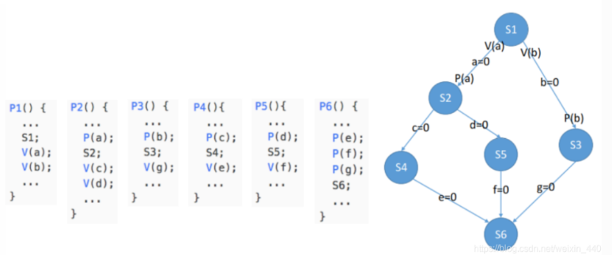

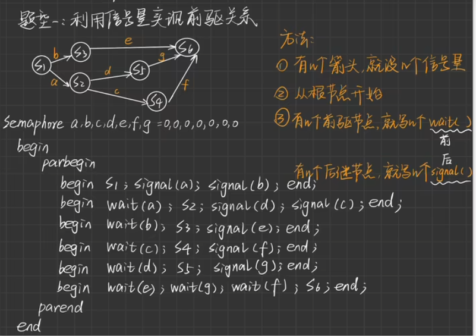

#### 3.3经典进程同步问题

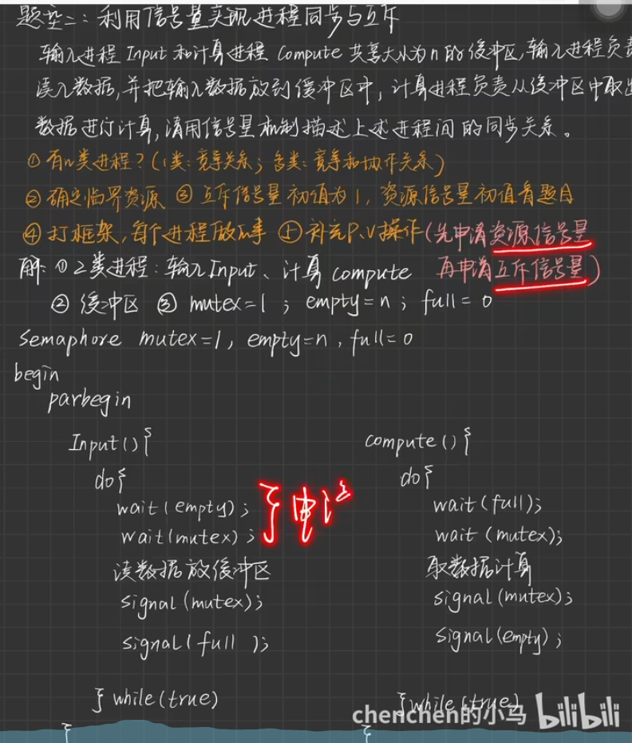

##### ==**生产者消费者问题**==

**一个生产者一个消费者**

系统中有一组生产者进程和一组消费者进程，生产者进程每次生产一个产品放入缓冲区，消费者进程每次从缓冲区中取出一个产品并使用。（注：这里的“产品”理解为某种数据）


生产者、消费者共享一个初始为空、大小为n的缓冲区。

- 只有缓冲区没满时，生产者才能把产品放入缓冲区，否则必须等待。（同步关系）
- 只有缓冲区不空时，消费者才能从中取出产品，否则必须等待。（同步关系）
- 缓冲区是临界资源，各进程必须互斥地访问。(互斥关系)

```c
semaphore mutex = 1; // 互斥信号量，实现对缓冲区的互斥访问
semaphore empty = n; // 同步信号量，表示空闲缓冲区的数量
semaphore full = 0; // 同步信号量，表示产品的数量，也即非空缓冲区的数量

producer(){
    while(1){
        P(empty);//消耗一个空闲缓冲区
        P(mutex);//实现互斥是同一进程中进行一对PV操作
        V(mutex);
        V(full);//增加一个产品
    }
}//实现两进程的同步关系，是在其中一个进程中执行P,另一进程中执行V
consumer(){
    while(1){
        P(full);//消耗一个产品（非空闲缓冲区）
        P(mutex);
        V(mutex);
        V(empty);//增加一个空闲缓冲区
    }
}
```

相邻PV是否可以互换顺序

**互换P**   如果缓冲区被生产者放满，消费者没有取产品，empty = 0，下次仍然是生产者运行，先执行P（mutex）封锁信号量，然后P（empty）将被阻塞。然后轮到消费者执行，先执行（mutex），因为生产者已经被阻止，所以消费者进程也被阻止了，形成死锁。

**互换V**   两个V可以互换，先释放哪个无所谓


**多个生产者多个消费者**


- 互斥关系：（mutex = 1）：对缓冲区（盘子）的访问要互斥地进行

- 同步关系（一前一后）：

  - 父亲将苹果放入盘子后，女儿才能取苹果
  - 母亲将橘子放入盘子后，儿子才能取橘子
  - 只有盘子为空时，父亲或母亲才能放入水果

  问题解决：

  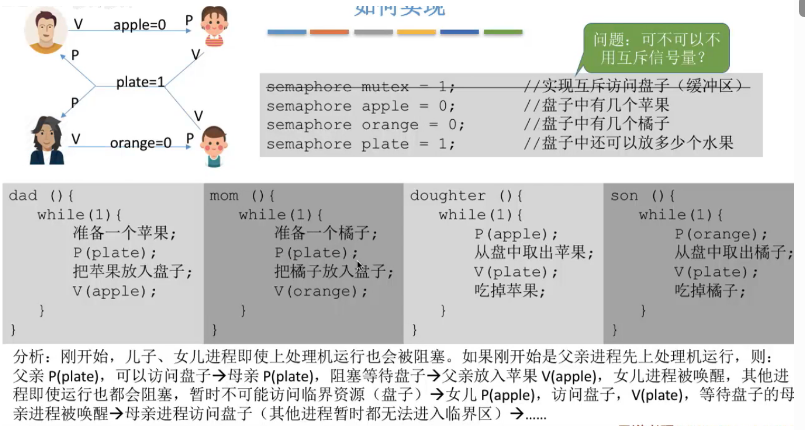

为什么不设置互斥信号量 因为**本题中缓冲区只为1**

- 互斥信号量加不加，加上肯定没错
- 实现互斥的P操作一定要在实现同步的P操作之后，否则可能导致死锁
- 分析问题应该**以事件角度考虑**，而不是以进程角度考虑


##### ==**吸烟者问题**==

假设一个系统有三个抽烟者进程和一个供应者进程。每个抽烟者不停地卷烟并抽掉它，但是要卷起并抽掉一支烟，抽烟者需要有三种材料：烟草、纸和胶水。

三个抽烟者中，第一个拥有烟草、第二个拥有纸、第三个拥有胶水。

供应者进程无限地提供三种材料，供应者每次将两种材料放桌子上，拥有剩下那种材料的抽烟者卷一根烟并抽掉它，并给供应者进程一个信号告诉完成了，供应者就会放另外两种材料再桌上，这个过程一直重复（让三个抽烟者轮流地抽烟）

同步关系：桌子上有组合一>第一个吸烟者取走。组合二 —>第二个吸烟者取走。组合三—>第三个吸烟者取走东西，发出完成信号—>供应者将下一组合放在桌子上

互斥关系：桌子抽象容量为1，需要互斥访问

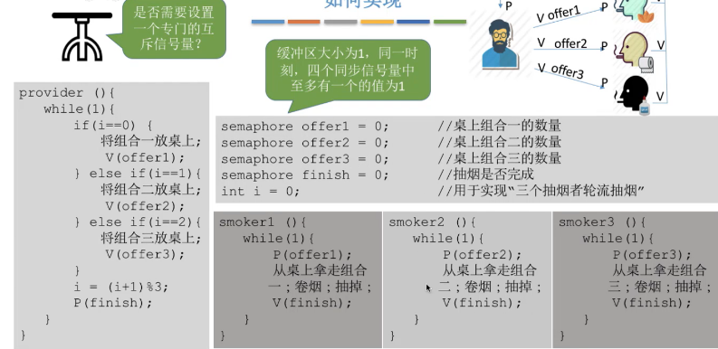


##### ==**哲学家进餐问题**==

一张圆桌上坐着5名哲学家，每两个哲学家之间的桌上摆一根筷子，桌子的中间是一碗米饭。哲学家们倾注毕生的精力用于思考和进餐，哲学家在思考时，并不影响他人。只有当哲学家饥饿时，才试图拿起左、右两根筷子（一根一根地拿起）。如果筷子已在他人手上，则需等待。饥饿的哲学家只有同时拿起两根筷子才可以开始进餐，当进餐完毕后，放下筷子继续思考。

- 关系分析：  这些进程之间**只存在互斥关系**，但是与之前接触到的互斥关系不同的是，每个进程都需要同时持有两个临界资源，因此就有“死锁”问题的隐患。关系分析。系统中有5个哲学家进程，**5位哲学家与左右邻居对其中间筷子的访问是互斥关系**。
- 整理思路：这个问题中只有互斥关系，但与之前遇到的问题不同的是，每个哲学家进程需要同时持有两个临界资源才能开始吃饭。**如何避免临界资源分配不当造成的死锁现象，是哲学家问题的精髓。**
- 信号量设置：定义互斥信号量数组 chopstick[5]={1,1,1,1,1} 用于实现对5个筷子的互斥访问。并对哲学家按0~4编号，哲学家 i 左边的筷子编号为i，右边的筷子编号为 (i+1)%5。

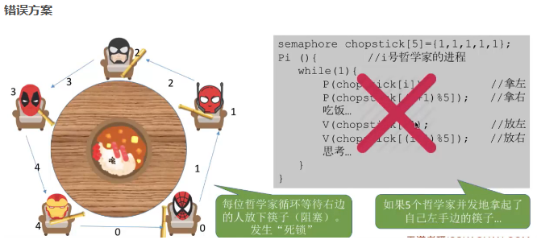

**合理方案**

- 最多允许四个哲学家同时进餐。这样可以保证至少有一个哲学家是可以拿到左右两只筷子的。

```C
semaphore chopsticks[5] = {1};
swmaphore count = 4;
void func(){
    do{P(count);
       P(chopsticks[i]);
       P(chopsticks[(i+1) mod 5]);
       eat();
       V(chopsticks[i]);
       V(chopsticks[(i+1) mod 5]);   
       V(count);
       think();
    }while(1);
}
```

- 要求**奇数**号哲学家**先拿左边**的筷子，然后**再拿右边**的筷子，而偶数号哲学家刚好相反。用这种方法可以保证如果相邻的两个奇偶号哲学家都想吃饭，那么只会有其中一个可以拿起第一只筷子，另一个会直接阻塞。这就避免了占有一支后再等待另一只的情况。

```C
do{
    if(i%2==1){
        P(chopstick[i]);
        P(chopstick[(i+1)%5]);
    }else{
         P(chopstick[i]);
        P(chopstick[(i+1)%5]);}
    //吃饭
    V(chopstick[i]);
    V(chopstick[(i+1)%5]);}
    //思考
}
```


- 仅当一个哲学家左右两支筷子都可用时才允许他抓起筷子。

```C
semaphore chopsticks[5] = {1};
semaphore mutex = 1;//互斥地取筷子
void func(){
    while(1){
        P(mutex);
        P(chopsticks[i]);//拿左
        P(chopsticks[(i+1) mod 5]);//拿右
        V(mutex);
        //吃饭
        V(chopsticks[i]);//拿左
        V(chopsticks[(i+1) mod 5]);//拿右  
    }
}
```

用AND信号量来解决上述问题

```c
semaphore chopstick array[4]={1}
void func1(){
    SP(chopstick［(i+1) mod 5］, chopstick［i］);
    eat;
    SV(chopstick［(i+1) mod 5］, chopstick［i］); 
    think;
}
```


##### ==**读者写者问题**==

​    有读者和写者两组并发进程，共享一个文件，当两个或两个以上的读进程同时访问共享数据时不会产生副作用，但若某个写进程和其他进程（读进程或写进程）同时访问共享数据时则可能导致数据不一致的错误。

- 允许多个读者可以同时对文件执行读操作
- 只允许一个写者往文件中写信息
- 任一写者在完成写操作之前不允许其他读者或写者工作
- 写者执行写操作前，应让已有的读者和写者全部退出。

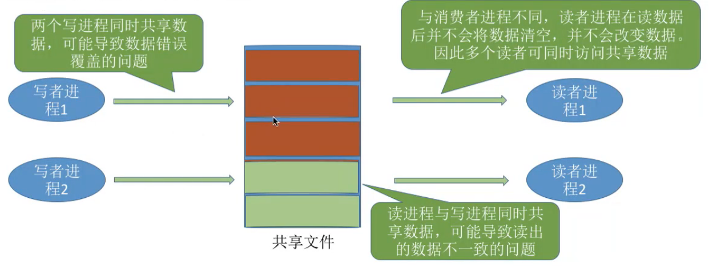

互斥关系：W-W W-R

- 写者进程和任何进程都互斥，设置一个互斥信号量rw，在写者访问共享文件前后分别执行P、V操作。读者进程和写者进程也要互斥，因此读者访问共享文件前后也要对rw执行P、V操作.
- P(rw)和V(rw)其实就是对共享文件的“加锁”和“解锁”。既然各个读进程需要同时程与写进程又必须互斥访问，那么我们可以让第一个访问文件的读进程“加锁”，让最后一个访问完文件的读进程“解锁”。可以设置一个整数变量count 来记录当前有几个读进程在访问文件。

**读进程优先，则会导致写进程‘’饿死‘’**

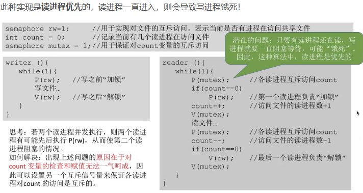

P(mutex)是为了保护count；

**写进程优先**，相对公平的先来先服务，**读写公平法**

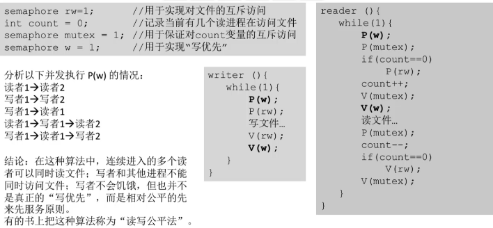

```C
int RN;//信号量集，最多只允许RN个读者
semaphore L = RN;
semaphore mx = 1;//表示写资源
void Reader(){
    while(1){
        SP(L,1,1);
        SP(mx,1,0);
        //读
        SV(L,1);} }
void Writer(){
    while(1){
        SP(mx,1,1;L,RN,0);
        //写
        SV(mx,1);}
```


##### **==打瞌睡的理发师问题==**

理发店有一名理发师，一把理发椅和几把座椅，等待理发者可坐在上面。如果没有顾客到来，理发师就坐在理发椅上打盹。当顾客到来时，就唤醒理发师。如果顾客到来时理发师正在理发，该顾客就坐在椅子上排队;如果满座了，他就离开这个理发店，到别处去理发。

```c
#define chairs 5
typedef struct{
    int value;
    struct PCB *list;
}semaphore;
semaphore customers = 0,barbers = 0,mutex = 1;
int waiting = 0;

void barber(){
    while(1){
        P(customers);//如果没有顾客，就block。
        P(mutex);//互斥进入临界区
        waiting--;
        V(barbers);//一个理发师准备理发
        V(mutex);//保护临界资源
        //理发 
    }  }
void customer(){
    P(mutex);
    if(waiting < chairs){
        waiting++;
        V(customers);//如果有必要可以唤醒理发师
        V(mutex);
        P(barbers);//如果理发师忙，就等待
        //理发
    }else{V(mutex);}
}
```


#### 3.4.管程

组成(类似于类)：

- 局部于管程的**共享数据结构**说明；
- 对该数据结构进行**操作**的**一组过程**（函数）；
- 对局部于管程的共享数据设置**初始值的语句**；
- 管程有一个**名字**。

特征：（类对象对类的访问）

1. 局部于管程的数据只能被局部于管程的过程所访问；

2. 一个进程只有通过调用管程内的过程才能进入管程访问共享数据；

3. **每次仅允许一个进程在管程内执行某个内部过程。**

   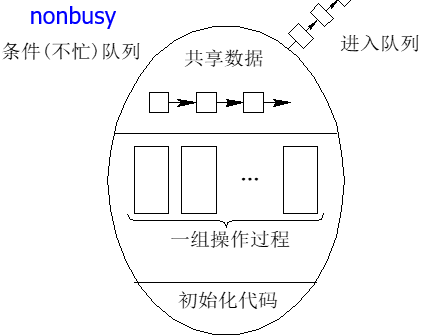

管程解决生产者消费者问题
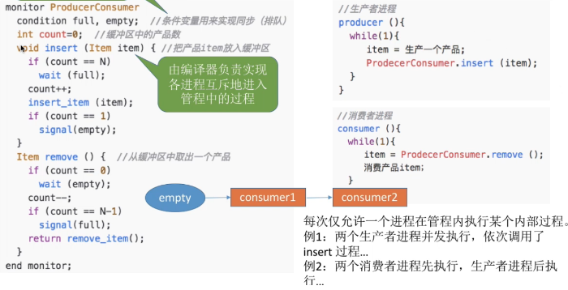

引入管程：**更方便地实现进程互斥和同步**

简单来说：封装思想！

- 需要在管程中定义共享数据（如生产者消费者问题的缓冲区）
- 需要在管程中定义用于访问这些共享数据的“入口”——其实就是一些函数（如生产者消费者问题中，可以定义一个函数用于将产品放入缓冲区，再定义一个函数用于从缓冲区取出产品）
- 只有通过这些特定的“入口”才能访问共享数据
- 管程中有很多“入口”，但是每次只能开放其中一个“入口”，并且只能让一个进程或线程进入（如生产者消费者问题中，各进程需要互斥地访问共享缓冲区。管程的这种特性即可保证一个时间段内最多只会有一个进程在访问缓冲区 注意：**这种互斥特性是由编译器负责实现的**，程序员不用关心）
- 可在管程中设置条件变量及等待 / 唤醒操作以解决同步问题。可以让一个进程或线程在条件变量上等待（此时，该进程应先释放管程的使用权，也就是让出“入口”）；可以通过唤醒操作将等待在条件变量上的进程或线程唤醒。

### **4.实时调度**
#### **基本条件**
a.提供必要的信息  就绪时间，开始截止时间和完成截止时间，处理时间，资源要求，优先级（重大任务->绝对优先级，其余“相对”）
b.系统处理能力强。m个周期性的硬实时任务,它们的处理时间可表示为Ci,周期时间表示为Pi,**则在单处理机情况下**,必须满足下面的限制条件,系统才是可调度的。

**解决方法：提高处理机能力或者采用多处理机系统，上述的1改为N**
c.采用抢占式调度机制
优先权高->允许当前任务挂起->满足硬实时任务对截止时间的要求
小的实时系统，如果能预知任务的开始截止时间，可采用非抢占式调度机制
d.具有快速切换机制
  对外部中断的快速响应能力（要求有**快速硬件中断机构**）   快速的任务分派能力

#### **实时调度算法分类**
根据实时任务性质的不同,可将实时调度算法分为:
(1)硬实时调度算法(2)软实时调度算法
按调度方式的不同,可将实时调度算法分为:
**(1)非抢占调度算法**
- **非抢占式轮转调度算法**
调度程序每次选择队列中的**第一个**任务运行
一个**任务运行后**排在轮转队列的**末尾**,等待下次调度
- **非抢占式优先调度算法**
为时间要求严格的任务**分配较高优先级**
当优先权高的实时任务到来时,排在就**绪队列的队首**等待调度
**(2)抢占调度算法**
- **基于时钟中断的抢占式优先权调度算法**
某实时任务到达后,若优先级高于当前正在执行任务的优先级,并**不立即抢占**当前任务的处理机,而是**等到时钟中断**到来后调度程序才剥夺当前任务的执行
- **立即抢占的优先权调度算法**
一旦有外部中断,只要当前任务**不在临界区内**,便立即剥夺当前任务的执行,交处理机分配给要求中断的紧迫任务

因调度程序调度时间的不同,可将实时调度算法分为:
(1)静态调度算法(2)动态调度算法
在多处理机环境下,可将实时调度算法分为:
(1)集中式调度算法(2)分布式调度算法
#### **实时调度算法**
1.最早截止时间优先（EDF）
- 根据任务的**开始截止时间**来确定任务的优先级,截止时间越早优先级越高
- 既可用于**抢占式调度**也可用于**非抢占式调度**方式
2.最低松弛度优先（LLF）
根据任务紧急或松弛的程度，来确定任务的优先级
**抢占式调度**
A（C=10,P=20） B(C=25,P=50),松弛度达到0就可以**抢占**

### **多处理器系统的调度**
在多道程序环境下,**进程数目通常多于处理机的数目**系统必须按一定方法动态地把处理机分配给就绪队列中的一个进程处理机利用率和系统性能(吞吐量、响应时间)在很大程度上取决于处理机调度

**a.进程分配方式**
对称多处理器系统中的进程分配
静态分配（进程调度开销小，但是各处理器忙闲不均）  动态分配（消除了忙闲不均，存在不同CPU之间数据迁移）

**b.进程调度方式**
1.自调度方式
系统中设置一个公共的进程就绪队列，所有的处理器空闲的时候都可以到队列中取得一进程来运行。
**优缺点**：
- 可采用上文提到的各种调度算法。，不会忙闲不均的现象。
- 只设有一个就绪队列，要互斥访问。线程切换频繁。线程阻塞后重新就绪，要重新拷贝运行数据，因为不能再原处理器运行。
2.成组调度方式

3.专用处理器分配方式
专门为该应用程序分配一组处理器,每个线程一个,这组处理器为该程序专用,直至完成（避免线程的频繁切换）
### 5.**死锁**

**死锁&饥饿&死循环**
**死锁**：各进程互相等待对方手里的资源，导致各进程都阻塞，无法向前推进的现象。

**饥饿**：由于长期得不到想要的资源，某进程无法向前推进的现象。比如:在短进程优先(SPF) 算法中，若有源源不断的短进程到来，则长进程将一直得不到处理机， 从而发生长进程“饥饿”。

**死循环**：某进程执行过程中一直跳不出某个循环的现象。有时是因为程序逻辑bug导致的，有时是程序员故意设计的。

#### 产生死锁的原因和必要条件
**原因：竞争资源引起进程死锁  进程推进顺序不当引起死锁 （信号量的使用不当也会造成死锁）**->总之对不可剥夺资源的不合理分配可能会导致死锁。

**必要条件**

#### 死锁处理策略
- 预防死锁。破坏死锁产生的四个必要条件中的一个或几个。
- 避免死锁。用某种方法防止系统进入不安全状态，从而避免死锁(银行家算法)
- 死锁的检测和解除。允许死锁的发生，不过操作系统会负责检测出死锁的发生，然后采取某种措施解除死锁。

**预防死锁**


**避免死锁**
**a.安全序列&不安全状态&死锁**
**安全序列**，就是指如果系统按照这种序列分配资源，则每个进程都能顺利完成。只要能找出一个安全序列，系统就是**安全状态**。当然，安全序列可能有多个。
如果分配了资源之后，系统中找不出任何一个安全序列，系统就进入了**不安全状态**。这就意味着之后可能所有进程都无法顺利的执行下去。当然，如果有进程提前归还了一些资源，那系统也有可能重新回到安全状态，不过我们在分配资源之前总是要考虑到最坏的情况。
如果系统**处于安全状态，就一定不会发生死锁。如果系统进入不安全状态，就可能发生死锁**（处于不安全状态未必就是发生了死锁，但发生死锁时一定是在不安全状态）因此可以在资源分配之前**预先判断**这次分配是否会导致系统进入不安全状态，以此决定是否答应资源分配请求。这也是“**银行家算法**”的核心思想。

**b.银行家算法**
银行家算法的**设计思想**是:当用户申请一组资源时,系统必须做出判断;如果把这些资源分出去,系统是否还处于安全状态。若是,就可以分出这些资源;否则,该申请暂不予满足。
- 银行家算法的数据结构
```
Available[j]=K //表示系统中现有Rj类资源K个
Max[i,j]=K //表示进程i需要Rj类资源的最大数目为K
Allocation[i,j]=K //表示进程i当前已分得Rj类资源的数目为K
Need[i,j]=K //表示进程i还需要Rj类资源K个,方能完成其任务
Need[i,j]=Max[i,j]-Allocation[i,j]
```
- 银行家算法
```
设Requesti是进程Pi的请求向量
(1)如果Requesti≤Needi,便转向步骤2;否则认为出错,因为它所需要的资源数已超过它所宣布的最大值
(2)如果Requesti≤Available,便转向步骤(3);否则,表示尚无足够资源,Pi须等待
(3)系统试探着把资源分配给进程Pi
  Available:=Available-Requesti;
  Allocationi:=Allocationi+Requesti;
  Needi:=Needi-Requesti;
(4)系统执行安全性算法,检查此次资源分配后,系统是否处于安全状态。若安全,才正式将资源分配给进程Pi,以完成本次分配;否则,将本次的试探分配作废,恢复原来的资源分配状态,让进程Pi等待
```
- 安全性算法
```
(1)设置两个向量初值;
a.工作向量Work;它表示系统可提供给进程继续运行所需的各类资源数目,它含有m个元素,在执行安全算法开始时,Work:=Available;
b.Finish[];它表示系统是否有足够的资源分配给进程,使之运行完成。开始时先做Finish[i]:=false;当有足够资源分配给进程时,再令Finish[i]:=true
(2)从进程集合中找到一个能满足下述条件的进程;
    Finish[i]=false;
    Needi≤Work;若找到,执行步骤(3),否则,执行步骤(4)
(3)当进程Pi获得资源后,可顺利执行,直至完成,并释放出分配给它的资源,故应执行;
     Work:=Work+Allocation;
     Finish[i]:=true;
     go to step 2; 
(4)如果所有进程的Finish[i]=true都满足,则表示系统处于安全状态;否则,系统处于不安全状态
```


#### **死锁的检测和解除**

**死锁检测**
为了能对系统是否已发生了死锁进行检测，必须：
- 用**某种数据结构**来保存资源的请求和分配信息；
- 提供**一种算法**，利用上述信息来检测系统是否已进入死锁状态。

如果系统中剩余的可用资源数足够满足进程的需求，那么这个进程暂时是不会阻塞的，可以顺利地执行下去。如果这个进程执行结束了把资源归还系统，就可能使某些正在等待资源的进程被激活，并顺利地执行下去。相应的，这些被激活的进程执行完了之后又会归还一些资源，这样可能又会激活另外一些阻塞的进程…
如果按上述过程分析，最终能**消除所有边**，就称这个图是**可完全简化的**。此时**一定不发生死锁（相当于能找到一个安全序列）**

如果最终**不能消除所有边**，那么此时就是发生了**死锁**

死锁例子：


**死锁解除**
一旦检测出死锁的发生，就应该**立即解除死锁。**
补充：并不是系统中所有的进程都是死锁状态，用死锁检测算法化简资源分配图后，还连着边的那些进程就是**死锁进程**

解除死锁的主要方法有：
- **资源剥夺法**。挂起（暂时放到外存上）某些死锁进程，并抢占它的资源，将这些资源分配给其他的死锁进程。但是应防止被挂起的进程长时间得不到资源而饥饿。
- **撤销进程法（或称终止进程法）**。强制撤销部分、甚至全部死锁进程，并剥夺这些进程的资源。这种方式的优点是实现简单，但所付出的代价可能会很大。因为有些进程可能已经运行了很长时间，已经接近结束了，一旦被终止可谓功亏一篑，以后还得从头再来。
- **进程回退法**.让一个或多个死锁进程回退到足以避免死锁的地步。这就要求系统要记录进程的历史信息，设置还原点。
**如何绝对对谁动手？**
- 进程优先级低的
- 已执行时间少的
- 还有很久才能完成的
- 进程使用资源多的
- 交互式和批处理式，优先处理批处理式


### 6.**课后进程同步题（补）**
1.设有无穷多个缓冲区和无穷多个信息,A进程把信息逐个地写入每个缓冲区,B进程则逐个地从缓冲区中取出信息。
试问:(1)两个进程之间的制约关系。
       (2)用P、V操作写出两进程的同步算法,并给出信号量的初值。
       (3)指出信号量的变化范围和其值的含义。

```C
（1）B进程不能超前A进程，但A进程不受B进程的约束
（2）semaphore S = 0;int i = 0,j = 0;
void A(){
 while（1）{
 i++;
 写入第i个缓冲区；
 V（S）；
 } }
 
void B(){
 while（1）{
 j++;
 P(S);
 取出第J个缓冲区信息；
 } }
（3）信号量S的值域为[-1,∞]中的整数,当S=-1时,表示缓冲区没有信息(或B读空),且B要求进一步读出,也即超前A欲读取信息而受阻。
```

**2.购物问题**  某超级市场,可容纳100人同时购物,入口处备有篮子,每个购物者可持一个篮子入内购物,出口处结帐,并归还篮子(出、入口(一共2个口)仅容纳一人通过),请用P、V操作完成购物同步算法。

```C
semaphore S = 100,mutex1 = 1,mutex2 = 1;
void A(){
while(1){
          P(S);
          P(mutex1);
          进入口处，取一只篮子；
          V(mutex1);
          选购商品；
          P(mutex2);
          结账，归还篮子
          V(mutex2);
          V(S);}}
```

**3.独木桥问题**。某条河上只有一座独木桥(东西向),以便行人过河。现在河的两边都有人要过桥,按照下面的规则过桥,为了保证过桥安全,请用P、V操作分别实现正确的管理。
规则:(1)每次只有一个人通过桥。
       (2)同一方向的可连续过桥,某方向有人过桥时另一方向的人要等待。

```C
(1)semaphore mutex = 1;
void E-W(){
while(1){
P(mutex);
//过桥
V(mutex);}
}
void W-E(){
while(1){
P(mutex);
//过桥
V(mutex);}
}
```
**对于第二问，第一个上桥需要看看对方是否有人，不是第一个上桥，不需要看对方是否有人，一定没有人。**

```C
(2)semaphore S =1,S1 =1,S2 =1;
   int rc1 =0,rc2 =0;
void (E-W)i (i=1,2,…){
   while(1){
   P(S1);rc1++;
   if(rc1 == 1) P(S);//S用来锁定，禁止其他方向的过桥
   V(S1);//为了保护，rc1的修改是安全的
   过桥;
   P(S1);rc1--;
   if(rc1 == 0) V(S);//某个方向的
   V(S1);
   }}
void (W-E)j (j=1,2,…){
   while(1){
   P(S2);rc2++;
   if(rc2 == 1) P(S);//S用来锁定，禁止其他方向的过桥
   V(S2);//为了保护，rc1的修改是安全的
   过桥;
   P(S2);rc1--;
   if(rc2 == 0) V(S);//某个方向的
   V(S2);
   }}   
```


**4.小路问题**在两地之间有一条弯曲小路,其中S到T的一段路每次只允许一辆自行车通过,但中间有一个小的“安全岛”M(同时允许两辆自行车停留),可供两辆自行车在从两端进入小路情况下错车使用,如图,试设计一个算法使来往的自行车均可顺利通过。(同方向不允许连续过自行车)

```C
semaphore S SK,T,TL = 1,1,1,1;
void ST(){
while(1){
P(S);P(SK);通过SK；V(SK);
进入M；P(TL);通过TL；V(TL);
V(S);
} }
void ST(){
while(1){
P(T);P(TL);通过TL；V(TL);
进入M；P(SK);通过SK；V(SK);
V(T);
} }
```

**6.拣棋子问题** 生产围棋的工人不小心把相等数量的黑棋子和白棋子混装在一个箱子里,现要用自动分拣系统把黑棋子和白棋子分开,该系统由两个并发执行的进程组成,系统功能如下:
- (1)进程A专门拣黑子,进程B专门拣白子;
- (2)每个进程每次只拣一个,当一个进程在拣子时,不允许另一个进程去拣子;
- (3)当一个进程拣了一个子(黑或白)以后,必让另一个进程拣一个子(白或黑);
- (4)进程A先执行。

```C
semaphore S1 =1,S2 =0;
void A(){
while(1){
P(S1);
捡黑子；
V(S2);
}}
void B(){
while(1){
P(S2);
捡白子；
V(S1);
}}
```

7.某**寺庙**有小、老和尚若干,有一个水缸,由小和尚提水入水缸供老和尚饮用。水缸可以容纳10桶水,水取自同一井水。水井狭窄,每次只能容一个桶取水。水桶总数为3个,每次入、出水缸仅一桶,且不可同时进行。试P、V操作描述算法。(提示：老和尚从水缸取水需要用桶)

```C
semaphore empty = 10,count =3,full = 0, mutex1 =1,mutex2 = 1;//水井和水缸两个互斥
void young(){
while(1){
P(empty);P(count);P(mutex1);
从井中取水；
V(mutex1);P(mutex2);
送水入水缸；
V(mutex2);V(count);V(full);
}}
void old(){
while(1){
P(full);P(count);P(mutex2);
从缸中取水;
V(mutex2);V(count);V(full);
}}
```

## 三.内存管理

### 1.内存基础知识

内存
- 内存是用于存放数据的硬件
- 程序执行前需要先放到内存中才能被cpu处理
- 如果计算机"按**字节编址**", 每个存储单元大小为 **8 bit**
- 如果计算机"按**字编址**", 每个存储单元大小为 **16 bit**

指令的编指一般采用逻辑地址，即相对地址
**物理地址 = 起始地址 + 逻辑地址**
相对地址又称逻辑地址，绝对地址又称物理地址。

**进程运行基本原理**
多道程序环境下，程序要运行必须要创建**进程**，而创建进程的第一件事就是**分配内存**
- ==编辑==
- ==编译==：由编译程序将用户源代码编译成若干个目标模块
- ==链接==：由**链接程序**将编译后形成的**目标模块**以及它们所需要的**库函数**,链接在一起,形成一个**装入模块**。
- ==装入==：由**装入程序**将**装入模块**装入**主存**的过程。


#### **三种链接方式**
- **静态链接**：在程序运行之前，先将各目标模块以及它们所需的库函数连接成一个完整的可执行文件（装入模块），之后不再拆开。Ø在将这几个目标模块装配成一个装入模块时,须解决以下两个问题
       **对相对地址进行修改 变换外部调用符号**
   
- **装入时动态链接**：将各目标模块装入内存时，**边装入边链接**的链接方式。

- **运行时动态链接**：在程序执行中需要该目标模块时，才对它进行链接。其优点是**加快程序的装入过程,而且可节省大量的内存空间。**

#### **三种装入方式**
为了使编程更方便，程序员写程序时应该只需关注指令、数据的逻辑性。而**逻辑地址到物理地址的转换**（这个过程称为**地址重定位**），应该由**操作系统负责**，这样就保证了程序员写程序时不需要关注物理内存的实际情况。

- **绝对装入（适合单道）**

在编译时，如果知道程序将放到内存的哪个位置，编译程序将**产生绝对地址的目标代码**, 装入程序按照装入模块中的地址，将程序和数据装入内存【灵活性低, 只适合单道程序环境】
绝对装入只适用于**单道**程序环境。还未产生操作系统，由编译器完成！
程序中使用的**绝对地址**，可在**编译或汇编**时给出，也可由**程序员直接赋予**。通常情况下都是编译或汇编时再转换为绝对地址。

- **静态重定位（多道）**
又称为**可重定位装入**。 编译, 链接后的装入模块地址都是从 0 开始的，指令中使用的地址和数据存放的地址都是相对于起始地址而言的逻辑地址。可以根据内存的当前状况将装入模块装入到内存的适当位置。装入时对地址进行"**重定位**"，逻辑地址变换为物理地址（地址变换是在装入时一次完成的）。【早期多道批处理系统】

静态重定位的特点是在一个作业装入内存时，必须分配其要求的全部内存空间，如果没有足够的内存，就不能装入该作业。作业一旦进入内存后，在运行期间就不能再移动，也不能再申请内存空间。

- **动态重定位（多道）**
又称**动态运行时装入**。可重定位方式不允许程序运行时在内存中移动位置。编译、链接后的装入模块的地址都是从0开始的，装入程序把装入模块装入内存后**不会立即**把逻辑地址转换为物理地址，而是把地址转换推迟到程序真正要**执行时**才进行。因此装入内存后所有的地址依然是**逻辑地址**。这种方式需要一个重定位寄存器（存放装入模块的起始位置）的支持。【现代操作系统】，依靠硬件支持进行地址转换。

#### **操作系统内存管理**
- 操作系统负责内存空间的分配与回收
- 操作系统需要提供某种技术从逻辑上对内存空间进行扩充
- 操作系统需要提供地址转换功能，负责程序的逻辑地址与物理地址的转换（即三种装入方式）
- 操作系统需要提供内存保护功能。保证各进程在各自存储空间内运行，互不干扰

### 2.**内存保护采用的方法**
- 在CPU中设置一对**上、下限寄存器**，存放进程的上、下限地址。进程的指令要访问某个地址时，**CPU检查是否越界**。
- 采用**重定位寄存器**（又称基址寄存器）和**界地址寄存器**（又称限长寄存器）进行**越界检查**。重定位寄存器中存放的是进程的**起始物理地址**。界地址寄存器中存放的是进程的**最大逻辑地址**。"
### 3.**内存空间的扩充**

#### 覆盖技术
覆盖技术：将程序分为多个段，常用的段常驻内存，不常用的段在需要的时候调入内存
内存中分为**一个"固定区" 和若干个"覆盖区"**，常用的段放在固定区，不常用的段放在覆盖区
**缺点**：必须由程**序员声明覆盖结构**， 对用户不透明， 增加了用户的编程负担，覆盖技术**只用于早期的操作系统中。**

#### 交换技术
交换技术：内存空间紧张时, 系统将内存中某些进程**暂时换出外存**，把外存中某些已具备运行条件的进程换入内存(即**进程在内存与磁盘间动态调度)**
- **应该在外存（磁盘）的什么位置保存被换出的进程？**
具有对换功能的操作系统中，通常把磁盘空间分为**文件区和对换区**两部分。**文件区**主要用于存放文件，主要追求存储空间的利用率，因此对文件区空间的管理采用**离散**分配方式；对换区空间只占磁盘空间的小部分，被换出的进程数据就存放在对换区。由于对换的速度直接影响到系统的整体速度，因此**对换区**空间的管理主要**追求换入换出速度**，因此通常对换区**采用连续分配方式**。总之，对换区的I/O速度比文件区的更快。

- **什么时候应该交换？**
交换通常在许**多进程运行**且**内存吃紧时**进行，而系统负荷降低就暂停。例如：在发现许多进程运行时经常发生缺页，就说明内存紧张，此时可以换出一些进程;如果缺页率明显下降，就可以暂停换出。

- **应该换出哪些进程？**
可优先换出**阻塞进程**；可换出**优先级低**的进程；为了防止优先级低的进程在被调入内存后很快又被换出，有的系统还会考虑进程在内存的驻留时间。
**PCB仍然得常驻内存！**

#### 虚拟存储技术


**虚拟内存的定义和特征**
- 在程序装入时，将程序中很快会用到的部分装入内存，暂时用不到的部分留在外存，就可以让程序开始执行。
- 在程序执行过程中，当所访问的信息不在内存时，由操作系统负责将所需信息由外存**调入内**存，然后继续执行程序。请求调页/段
- 内存空间不够时， 操作系统负责将内存中暂时用不到的信息换出到外存。**页面置换**
- 在用户看来，就有一个比实际内存大很多的内存，这就叫**虚拟内存**。
**虚拟内存的最大容量是由计算机的地址结构（CPU的寻址范围）确定的**
**虚拟内存的实际容量** = min（内存容量+外存容量，CPU寻址范围）

**特征：**
- 离散性：离散性是指在主存分配时采用离散分配方式。
- 多次性（最基本）：一个作业被分成多次调入内存运行
- 对换性：允许在作业的运行过程中进行换进、换出
- 虚拟性：能够从逻辑上扩充内存容量,使用户所看到的内存容量远大于实际内存容量。

##### **虚拟内存的实现**
虚拟内存技术，允许一个作业分多次调入内存。如果采用连续分配方式，会不方便实现。因此，虚拟内存的实现需要建立在**离散分配**（非连续分配）的内存管理方式基础上。

对应传统的三种非连续分配存储管理，有三种**虚拟存储**的实现：
- 请求分页存储管理

- 请求分段存储管理

- 请求段页式存储管理
**调入**：在程序执行过程中，当所访问的信息不在内存时，由操作系统负责将所需信息**从外存调入内存**，然后继续执行程序。（操作系统要**提供请求调页 / 调段功能**）
**调出**：若内存空间不够，由操作系统负责将内存中暂时用不到的信息**换出**到外存。（操作系统要提供**页面置换 / 段置换的功能**）
##### 请求分页存储管理
###### **请求分页中的硬件支持**
与基本分页管理方式的区别：
- **调入：请求调页**
- **调出：页面置换**

**（1）页表机制**
与基本分页管理相比，请求分页管理中，为了实现“请求调页”，操作系统需要知道每个页面是否已经调入内存;如果还没调入，那么也需要知道该页面在外存中存放的位置。
当内存空间不够时，要实现“页面置换”，操作系统需要通过某些指标来决定到底换出哪个页面;有的页面没有被修改过，就不用再浪费时间写回外存。有的页面修改过，就需要将外存中的旧数据覆盖，因此，操作系统也需要记录各个页面是否被修改的信息。

**（2）缺页中断机构**
在请求分页操作系统中，每当要访问的页面不在内存时，便产生一个缺页中断, 然后由操作系统的缺页中断处理程序处理中断。

此时缺页的进程阻塞，放入阻塞队列，调页完成后再将其唤醒, 放回就绪队列。
- 如果内存中**有空闲块**，则为进程分配一个空闲块，将所缺页面装入该块，**并修改页表**中相应的页表项
- 如果内存中**没有空闲块**，则**由页面置换算法选择一个页面淘汰**，若该页面在内存期间被修改过，则要将其**写回外存**，未修改过的页面不用写回外存。
**缺页中断**是因为当前执行的指令想要访问目标页面未调入内存而产生的，因此属于**内中断**（故障） 。
**一条指令**在执行期间，可能产生**多次缺页中断**。(如: copy A to B，即将逻辑地址A中的数据复制到逻辑地址B，而A、B属于不同的页面，则有可能产生两次中断）

**（3）地址变换机构**
- 新增步骤1：请求调页（查到页表项时进行判断）
- 新增步骤2：页面置换（需要调入页面，但没有空闲内存块时进行)
- 新增步骤3：需要修改请求页表中新增的表项

- 只有“**写指令**”才需要修改“修改位”。并且，一般来说只需修改快表中的数据，只有要将快表项删除时才需要写回内存中的慢表。这样可以减少访存次数。
- 和普通的中断处理一样，缺页中断处理依然需要保留CPU现场。
- 需要用某种“**页面置换算法**”来决定一个换出页面（下节内容)
- 换入/换出页面都需要启动慢速的l/O操作，可见，如果换入/换出太频繁，会有很大的开销。
- 页面调入内存后，需要修改慢表，同时也需要将表项复制到快表中。

###### 页面分配策略（王道）

**驻留集**：请求分页存储管理器中给进程分配的物理块的集合。
在采用虚拟存储技术的系统中, 驻留集的大小一般小于进程的总大小
- 如果驻留集太小，会导致缺页频繁，系统要花大量的时间来处理缺页，实际用于进程推进的时间很少。
- 如果驻留集太大，会导致多道程序并发度下降，资源利用率降低。
**策略**
- **固定分配**：操作系统为每个进程分配一组固定数目的物理块，在进程运行期间不再改变。即，**驻留集大小不变。**
- **可变分配**：先为每个进程分配一定数目的物理块，在进程运行期间，可根据情况做适当的增加或减少。即，**驻留集大小可变。**
**局部置换**：发生缺页时只能选进程自己的物理块进行置换。
**全局置换**：可以将操作系统保留的空闲物理块分配给缺页进程，也可以将别的进程持有的物理块置换到外存，再分配给缺页进程。

**页面分配&置换策略？**
**固定分配局部置换**：系统为每个进程分配一定数量的物理块，在整个运行期间都不改变。若进程在运行中发生缺页，则只能从该进程在内存中的页面中选出一页换出，然后再调入需要的页面。这种策略的缺点是:很难在刚开始就确定应为每个进程分配多少个物理块才算合理。(采用这种策略的系统可以根据进程大小、优先级、或是根据程序员给出的参数来确定为一个进程分配的内存块数)
**可变分配全局置换**：刚开始会为每个进程分配一定数量的物理块。操作系统会保持一个空闲物理块队列。当某进程发生缺页时，从空闲物理块中取出一块分配给该进程;若已无空闲物理块，则可选择一个未锁定的页面换出外存，再将该物理块分配给缺页的进程。采用这种策略时，只要某进程发生缺页，都将获得新的物理块，仅当空闲物理块用完时，系统才选择一个未锁定的页面调出。被选择调出的页可能是系统中任何一个进程中的页，因此这个被选中的进程拥有的物理块会减少，缺页率会增加。
**可变分配局部置换**：刚开始会为每个进程分配一定数量的物理块。当某进程发生缺页时，只允许从该进程自己的物理块中选出一个进行换出外存。如果进程在运行中频繁地缺页，系统会为该进程多分配几个物理块，直至该进程缺页率趋势适当程度;反之，如果进程在运行中缺页率特别低，则可适当减少分配给该进程的物理块。
- **可变分配全局置换**：只要缺页就给分配新物理块
- **可变分配局部置换**：要根据发生缺页的频率来动态地增加或减少进程的物理块

**物理块分配算法**
（1）平均分配  （2）按比例分配  （3）按优先级分配
**何时调入页面？**
**预调页策略**：根据**局部性原理**（主要指空间局部性），一次调入若干个相邻的页面可能比一次调入一个页面更高效。但如果提前调入的页面中大多数都没被访问过，则又是低效的。因此可以**预测**不久之后可能访问到的页面，将它们预先调入内存，但目前预测成功率只有50%左右。故这种策略主要用于进程的首次调入，由程序员指出应该先调入哪些部分。（**运行前调入**）
**请求调页策略**：进程在**运行期间发现缺页时才将所缺页面调入内存**。由这种策略调入的页面一定会被访问到，但由于每次只能调入一页，而每次调页都要磁盘I/O操作，因此I/O开销较大。（**运行时调入）**

**何处调入页面？**
- **系统拥有足够的对换区空间**：页面的调入、调出都是在内存与对换区之间进行，这样可以保证页面的调入、调出速度很快。在进程运行前，需将进程相关的数据从文件区复制到对换区。
- **系统缺少足够的对换区空间**：凡是不会被修改的数据都直接从文件区调入，由于这些页面不会被修改，因此换出时不必写回磁盘，下次需要时再从文件区调入即可。对于可能被修改的部分，换出时需写回磁盘对换区，下次需要时再从对换区调入。
- **UNIX方式**：运行之前进程有关的数据全部放在文件区，故未使用过的页面，都可从文件区调入。若被使用过的页面需要换出，则写回对换区，下次需要时从对换区调入。

**抖动现象？**
刚刚换出的页面马上又要换入内存，刚刚换入的页面马上又要换出外存，这种频繁的页面调度行为称为**抖动，或颠簸**。
产生抖动的**主要原因**是进程频繁访问的页面数目高于可用的物理块数( **分配给进程的物理块不够)。**
- 为进程分配的物理块太少，会使进程发生抖动现象。
- 为进程分配的物理块太多，又会降低系统整体的并发度，降低某些资源的利用率
为了研究为应该为每个进程分配多少个物理块，Denning提出了进程**“工作集”**的概念

**工作集？**
- **工作集**：指在某段时间间隔里，进程实际访问页面的集合。
- **驻留集**：指请求分页存储管理中给进程分配的内存块的集合。

**工作集大小**可能小于窗口尺寸，实际应用中，操作系统可以统计进程的工作集大小，根据工作集大小给进程分配若干内存块。如:窗口尺寸为5，经过一段时间的监测发现某进程的工作集最大为3，那么说明该进程有很好的局部性，可以给这个进程分配3个以上的内存块即可满足进程的运行需要。
一般来说，**驻留集大小不能小于工作集大小**，否则进程运行过程中将频繁缺页。
**拓展**：基于局部性原理可知，进程在一段时间内访问的页面与不久之后会访问的页面是有相关性的。因此，可以根据进程近期访问的页面集合(工作集）来设计一种页面置换算法――选择一个不在工作集中的页面进行淘汰。

##### **页面置换算法**

页面的换入、换出需要磁盘I/O，会有较大的开销，因此好的页面置换算法应该追求更少的缺页率！
###### 最佳置换算法(OPT)
优先淘汰以后永不使用或者在最长时间内不会使用的页面，**保证最低的缺页率**。但是操作系统无法预判页面访问序列，这种算法是**无法实现**的。

###### 先进先出置换算法(FIFO)
优先淘汰最早进入内存的页面。
实现 ：内存中页面按先后次序链接成一个队列,并设置一个指针,称为**替换指针**,使它总是指向最老的页面。

实现简单；算法性能差，不适应进程实际运行时的规律，可能出现**Belady 异常**(当为进程分配的物理块数增大时，缺页次数不减反增的异常现象。)。
**只有FIFO算法会产生Belady异常。**


###### 最近最久未使用(LRU)置换算法
**优先淘汰最近最久未使用的页面。**
性能好，但实现起来需要专门的硬件支持，算法开销大(需要对每一页的使用情况跟踪记录)。

**LRU的硬件支持**
（1）寄存器 （2）栈
###### CLOCK置换算法
（最近未用算法 NRU）
为每个页面设置一个**访问位**，再将内存中的页面都通过链接指针链接成一个**循环队列**。
循环扫描各页面，**第一轮淘汰访问位 = 0 的**，并将扫描过的页面访问位改为1。若第一轮没选中，则进行第二轮扫描。（**最多会扫描两轮！）**
实现简单，算法开销小；**但未考虑页面是否被修改过。**
简单的时钟置换算法仅考虑到了一个页面最近是否被访问过，但是事实上，如果被淘汰的页面没有被修改过，就不需要执行I/O操作写回外存。只有被淘汰的页面被修改过时，才需要写回外存。
因此, 除了考虑一个页面最近有没有被访问过之外，操作系统还应该考虑页面有没有被修改过。
在其他条件都相同时，**应该优先淘汰没有修改过的页面**, 避免I/O操作，这就是改进型的时钟置换算法的思想。


改进型Clock置换算法

**最多扫描四轮**
###### 其它置换算法


##### 请求分段存储管理方式
###### 请求分段中的硬件支持


###### 分段的共享与保护
- 共享段表
所有共享段均在共享段表中对应的一个表项

- 共享段分配与回收
(1)共享段的分配
●对第一个请求使用该共享段的进程:
由系统为该共享段分配一物理区，并将共享段调入;
将该区始址填入请求进程的段表的相应项中;
在共享段表中增加一表项，填写有关数据，并置count值为1。
●对其他调用该共享段的进程:
在调用进程的段表中增加一表项，
填入该共享段的物理地址;
在共享段表的对应表项中填入调用进程的相关信息，并执行count=count+1
(2)共享段的回收
当进程不再需要共享段时:撤消共享段的表项;执行count=count-1。
仅当count=0时，由系统回收共享段的物理内存。

- 分段保护


### **4.内存空间的分配和回收**
#### **连续分配方式**


##### - ==**单一连续分配**==
在单一连续分配的方式中, 内存被分为**系统区和用户区**，**系统区**用于存放**操作系统**的相关数据，通常放在内存的地址部分。用户区用于**存放用户进程**的相关数据。内存中只能有一道用户程序，用户程序独占整个用户区空间。

优点 : 实现简单, 无外部碎片; 可以采用覆盖技术扩充内存; 不一定需要采取内存保护，开销小。
缺点 : 只能用于单用户, 单任务的操作系统中; 有内部碎片; **存储器利用率极低**

**内部碎片** : 分配给某进程的内存区域有一部分没有用上，即存在" 内部碎片 ".
**外部碎片** : 内存中的某些空闲分区由于太小而难以利用

##### - ==**固定分区分配**==
最简单的可运行**多道程序**的存储管理方式
将内存用户空间划分为若干个**固定大小的区域**,每个分区中只装入**一道**作业
**划分分区的方法：**
- 分区大小相等：缺乏灵活性，但是很适合用于用一台计算机控制多个相同对象的场合
- 分区大小不等：增加了灵活性，可以满足不同大小的进程需求。根据常在系统中运行的作业大小情况进行划分

**操作系统如何记录内存中的各个分区？**
操作系统建立分区说明表来实现各个分区的分配和回收。
每个表对应一个分区，通常按分区大小排列。每个表项包括对应**分区的大小，起始地址，状态**（是否已分配）。

用数据结构的**数组（或链表）** 即可表示这个表。
当某用户程序要装入内存时，由操作系统内核程序根据用户程序大小检索该表，从中找到一个能满足大小的、未分配的分区，将之分配给该程序，然后修改状态为 “已分配”。
优点：实现简单，无外部碎片。
缺点：
a.当用户程序太大时，可能所有的分区都不能满足需求，此时不得不采用覆盖技术来解决，但这又会降低性能。
b.**会产生内部碎片**，内存利用率低。

##### - ==**动态分区分配**==
动态分区分配又称为**可变分区分配**， 这种分配方式不会预先划分内存分区。而是在进程装入内存时**根据进程大小动态地建立分区**，并使得分区的大小正好适合进程的需要。系统分区的大小和数目是可变的！
**系统要用什么样的数据结构记录内存的使用情况？**
- **空闲分区表**：每个空闲分区对应一个表项。表项中包含分区号、分区大小、分区起始地址等信息。
- **空闲分区链**：每个分区的其实部分和末尾部分分别设置前向指针和后向指针。起始部分处还可记录分区大小等信息。
动态分配**不会产生内部碎片, 而会产生外部碎片**, 外部碎片可以通过" **紧凑**"的方式解决。

**当很多个空闲分区都能满足需求时，应该选择哪个分区进行分配?**
把一个新作业装入内存时，须按照一定的**动态分区分配算法**，从空闲分区表（或空闲分区链）中选出一个分区分配给该作业。由于分配算法算法对系统性能有很大的影响，因此人们对它进行了广泛的研究。

**如何进行分区的分配与回收操作?**
- 修改表项或链表节点值（分区还有剩余）
- 删除表项或链表节点（分区恰好分配完毕）
- 两个空闲分区的合并
###### ==**动态分区分配算法**==
**(1)基于顺序搜索的动态分区分配算法**
- **首次适应算法（FF）**
a.空闲分区链以地址**递增顺序**链接
b.分配时从**链首开始**查找,找到一个大小可满足的空闲分区,划出一块给请求者
c.可能会造成在**低地址**部分很多难以利用的**小空闲分区**
d.优点:(1)分配算法简单(2)优先利用低址部分,保留了高址的大空闲区,为大作业装入提供条件。
e.缺点:每次从链首开始,增加了查找开销,并且留下许多难以利用的”碎片”**(外碎片)**


- **循环首次适应算法(临近适应)** 

a.该算法是由首次适应算法演变而成的
b.空闲分区链以**地址递增**顺序链接,链表为**循环**链表
c.每次分配时从上一次找到空闲分区的**下一个**空闲区开始
d.优点:使空闲分区分布均匀,减少查找空闲分区开销
e.缺点:会缺乏大的空闲分区

- **最佳适应算法**
a.每次分配时,把**能满足要求、又是最小的分区**分配给作业
b.空闲分区链以**大小递增**顺序链接
c.从头开始,第一次找到满足要求的空闲分区,必然是最优的,避免了“大材小用”
d.宏观上看,会在存储器中留直许多难以利用的小分分区
e.特点:解决了大作业的分配问题;每次总是最小的,容易产生不可利用的空闲区(“小碎片”);收回主存时,要按分区大小递增顺序插入到空闲区表中

- **最坏适应算法**
a.每次分配时,把能满足要求、又是最大的分区分配给作业
b.空闲分区链以**大小递减**顺序链接
c.可以保证不出现太小的“碎片”
d.特点:不会产生过多的碎片;影响大作业的分配;收回主存时,要按大小递减的顺序插入到空闲区表中。


算法开销大：最佳适应法, 最坏适应法 ( 需要经常排序)
算法开销小：首次适应算法, 邻近适应算法

**(2)基于索引搜索的动态分区分配算法**
 **A.快速适应算法（分类搜索法）**
a.按照分区大小设置多个空闲分区链，增加一个索引表，可以快速对应到一个空闲分区链上。
b.空闲分区链分类：常用的大小分类，如2KB,4KB,8KB
c.特点:分配速度快,不进行分区分割;存在一定的主存浪费;典型的以空间换时间的作法。


**B.伙伴系统**
伙伴算法原理（Linux）
通过**不断地平分较大**的空闲内存块来获得较小的空闲内存块，直到获得所需的内存块；当内存释放时，**尽可能的合并空闲内存块。**
其中内存块分配与合并都采用以**2的幂次方**为单位。
- 所谓“伙伴”，就是指在空闲块被分裂时，由一**个大块内存分裂出来的两个小块内存**,互称“伙伴”
- 算法采用**位图**和**空闲链表**作为辅助工具，其中位图用来跟踪**内存块**的使用情况，空闲链表用来维护内存中**没有**使用的内存块

伙伴算法实例
用伙伴算法管理一个64KB内存，要求最小的分配请求单元是2KB,假设请求需要分配8KB的内存


**伙伴算法如何释放内存？**


伙伴算法结论
l当需要为进程分配一个长度为n的存储空间时，首先计算一个i值，使2i-1<n≤2i，在空闲分区大小为2i的空闲分区链表中查找，否则在2i+1找，等分后分配，依次类推。

**C.哈希算法**
引入原因：上述的分类搜索法和伙伴系统中，都是把空闲分区进行分类，再查找这些分类的分区上会使时间性能下降。

原理：哈希算法就是利用哈希快速查找的优点，对索引表进行快速查找。

###### 分区分配操作
（1）分配内存
（2）回收内存
- 回收区与插入点的前一个空闲分区相邻接
- 回收区与插入点的后一个空闲分区相邻接
- 回收区同时与插入点的前、后两个分区相邻接
- 回收区不与任何空闲区邻接
##### **-==（动态）可重定位分区分配==**
作业装入内存后的所有地址仍是**相对地址**,将相对地址转换成**物理地址**的工作在指令执行时进行
地址变换过程是在程序执行期间,随着每条指令和数据的访问而自动进行的。
**真正访问地址=相对地址+重定位寄存器中地址**
需要有**硬件**地址变换机构的支持

优点:可以**消除碎片**,能够分配更多的分区,有助于多道程序设计,提高内存的利用率。
缺点:**紧凑花费了大量CPU时间;**
##### - ==**对换**==
- 是指把内存中暂时不能运行的进程或者暂时不用的程序和数据,调（换）出到外存上,以便腾出足够的内存空间,再把已具备运行条件的进程或进程所需要的程序和数据,调（换）入内存。对换是**提高内存利用率**的有效措施
- 如果对换是以**整个进程为单位**,称为“**整体对换”或“进程对换”**
- 如果对换是以“页”或“段”为单位进行的,则称为“**页面对换**”或“**分段对换**”,又统称为“**部分对换**”, 这种对换方法是实现请求分页及请求分段式存储器的基础,其目的是为了**支持虚拟存储器。**

**对换空间的管理：**
- 在具有对换功能的OS中,通常把**外存**分为**文件区**和**对换区**
- **文件区管理**的主要目标是提高文件存储空间的利用率,采取**离散**分配方式。
- 外存中**对换区**主要存放从内存中换出的进程,对换空间管理的主要目标是**提高进程换入和换出的速度。**
- 为了能对对换区中的空闲盘块进行管理,在系统中应配置相应的数据结构,以记录外存的使用情况。其形式与内存在动态分区分配方式中所用数据结构相似,即同样可以用**空闲分区表**或空闲分区链。在空闲分区表中的每个表目中应包含两项, 即**对换区的首址**及其**大小**,它们的单位是盘块号和盘块数
- 对换区的分配采用**连续分配方式**,分配算法可以是**首次适应算法、循环首次适应算法或最佳适应算法**

**进程的换出与换入**

- 进程的换出
系统**首先**选择处于**阻塞状态且优先级最低**的进程作为换出进程,然后启动盘块,将该进程的程序和数据传送到磁盘的对换区上。若传送过程未出现错误,便可回收该进程所占用的**内存空间**,并对该进程的**进程控制块**做相应的修改。
- 进程的换入
系统应定时地查看所有进程的状态,从中找出(PCB集合中)**就绪状态且已换出**的进程,将其中**换出时间(换出到磁盘上)最久**的进程作为换入进程,申请内存,若成功将之换入,否则在换出某些进程,腾出足够内存,在换入。

#### 非连续分配方式
- 固定分区分配：缺乏灵活性，会产生大量的内部碎片,内存的利用率很低。
- 动态分区分配：会产生很多外部碎片，虽然可以用“紧凑”技术来处理，但是“紧凑”的时间代价很高
基于这一思想，产生了“非连续分配方式”，或者称为“离散分配方式”。
**非连续**：为用户进程分配的可以是一些分散的内存空间！

#### **基本分页存储管理**


##### **基本概念**

**页框**：将**内存**大小分为一个个大小相等的分区，每个分区就是一个 “ **页框** ”，或称 “ 页帧 ”、“ **内存块** ”、“ **物理块** ”。每个页框有一个编号，即 “ **页框号** ”，或称 “ **内存块号** ”、“ 页帧号 ”、“ **物理块号** ” ，页框号从 0 开始。

**页面**：将用户进程的地址空间也分为**与页框大小相等的一个个区域**，称为 “ **页** ” 或 “ 页面 ”。每个页面也有一个编号，即 “ **页号** ”，页号也是从 0 开始。

- 进程的**最后**一个页面可能没有一个页框那么大。因此。**页框不能太大**，否则可能产生过大的内部碎片。
- 操作系统以页框为单位为各个进程分配内存空间。进程的每个页面分别放入一个页框中。也就是说，进程的页面与内存的页框有**一一对应**的关系。
- 各个页面**不必连续存放**，也不必按先后顺序来，可以放到不相邻的各个页框中。

##### 地址变换机构
**如何实现地址转换**

例子：
CPU执行指令1，需要访问逻辑地址为80的内存单元，如何转化为物理地址?

逻辑地址为80的内存单元，应该在1号页，该页在内存中的起始位置为450，逻辑地址为80的内存单元相对于该页的起始地址而言，“偏移量”应该是30。
实际物理地址 = 450 + 30 = 480

- 要算出逻辑地址对应的页号
- 要知道该页号对应页面在内存中的起始地址
- 要算出逻辑地址在页面内的“偏移量”
- **物理地址 = 页面始址 ＋ 页内偏移量**


**逻辑地址结构**

逻辑地址结构包含两个部分：前一部分为**页号**，后一部分为**页内偏移量w**。在上图所示的例子中，地址长度为32位，其中0 ~ 11位为“页内偏移量”，或称“页内地址”;12~31位为“页号”。

- 如果有K位表示“页内偏移量”，则说明该系统中，一个页面的大小是**2^K个内存单元**
- 如果有M位表示“页号”，则说明在该系统中，一个进程最多允许有**2^M个页面**
**页表**
解决地址转换的第二步：**计算页号对应页面在内存中的起始地址**
为了能知道进程的每个页面在内存中存放的位置，操作系统要为每个进程建立一张**页表**。
- 一个进程对应一张页表
- 进程的每一页对应一个页表项
- 每个页表项由 “ **页号 ” 和 “ 块号 ”** 组成
- 页表记录进程页面和实际存放的内存块之间的对应关系
- 每个页表项的长度是相同的，**页号是隐含**的

**页大小 = 块大小**


例子
**A.假设某系统物理内存大小为4GB，页面大小为4KB，则每个页表项至少应该为多少字节?**
4GB = 2^32B，4KB = 2^12B
因此4GB的内存总共会被分为 2^32 / 2^12 = 2^20 个内存块，因此内存块号的范围应该是0 ~ 2^20 - 1 因此至少要20个二进制位才能表示这么多的内存块号，因此至少要3个字节才够 (每个字节8个二进制位，3个字节共24个二进制位)

**B.各页表项会按顺序连续地存放在内存中**
如果该页表在内存中存放的起始地址为X，则M号页对应的页表项一定是存放在内存地址为 X ＋ 3 * M 因此，页表中的**页号可以是隐含的**。只需要知道页表存放的起始地址和页表项长度，即可找到各个页号对应的页表项存放的位置！
**在本例中，一个页表项占3B，如果进程由n个页面，则该进程的页表总共会占 3 * n 个字节**

**基本地址变换机构**

用于**实现**逻辑地址到物理**地址转换**（借助进程的页表）的一组**硬件机构**

- 通常会在系统中设置一个**页表寄存器**（PTR)，**存放页表在内存中的起始地址 F 和页表长度 M**。
- **进程未执行**时，**页表的始址**和**页表长度**放在**进程控制块**（PCB）中；
- 当**进程被调度**时，操作系统**内核**会把它们放到**页表寄存器**中。


**页表长度**指的是这个页表中总共有几个页表项，即总共有几个页；**页表项长度**指的是每个页表项占多大的存储空间；**页面大小**指的是一个页面占多大的存储空间
在分页存储管理（页式管理）的系统中，只要确定了每个页面的大小，逻辑地址结构就确定了。
因此，页式管理中地址是**一维的**。即，只要给出一个逻辑地址，系统就可以自动地算出页号、页内偏移量两个部分，并不需要显式地告诉系统这个逻辑地址中，页内偏移量占多少位。
- 一共需要访问两次内存：第一次用来**查页表**，第二次用于**访问目标内存单元**。
- 页式管理中地址是一维的。
- 为了方便找到页表项，页表一般是放在**连续的内存块的**。
- 一个页框可以存放的页表项就是**页框大小 / 用于表示页表中内存块号所占的字节数**（通常内存块号用2的整数次幂的字节表示，可以消除内存块中的页内碎片）
理论上，页表项长度为3B即可表示内存块号的范围，但是，为了方便页表的查询，常常会让一个页表项占更多的字节，使得每个页面恰好可以装得下整数个页表项。

**具有快表的地址变换机构**
局部性原理？
- 时间局部性：如果执行了程序中的某条指令, 那么不久之后这条指令很有可能再次执行; 如果某个数据被访问过, 不久之后该数据很可能再次被访问。( 程序中存在大量的循环 )
- 空间局部性：一旦程序访问了某个存储单元, 在不久之后, 其附近的存储单元也很有可能被访问到。( 很多数据在内存中连续存放 )
在刚才的基本地址变换机构中，每次要访问一个逻辑地址，都需要查询内存中的页表。由于局部性原理，**可能连续很多次查到的都是同一个页表项**。既然如此，能否利用这个特性减少访问页表的次数呢?

**快表TLB**
快表又成为联想寄存器（TLB），是一种访问速度比内存块很多的高速缓冲存储器，用来存放当前访问的若干页表项, 以加速地址变换的过程. 与此对应的，内存中的页表常称为慢表。


由于查询快表的速度比查询页表的速度快很多，因此只要快表命中，就可以节省很多时间。因为局部性原理，一般来说快表的**命中率可以达到90%以上**。


##### 两级和多级页表


**解决方法**
可将长长的**页表进行分组**，使每个内存块刚好可以放入一个分组，再将各组**离散**地放到各个内存块中。
例子，页面大小4KB，每个页表项4B，每个页面可存放1K个页表项，因此每1K个连续的页表项为一组，每组刚好占一个内存块，再讲各组离散地放到各个内存块中！
另外，**为离散分配的页表再建立一张页表**，称为**页目录表**，或称**外层页表**，或称**顶层页表**


**实现地址转换**
1. 按照地址结构将逻辑地址拆成三个部分。
2. 从PCB中读取页目录起始地址，再根据一级页号查页目录表，找到下一级页表在内存中存放位置。
3. 根据二级页号查表，找到最终想要访问的内存块号。
4. 结合页内偏移量得到物理地址。
5. 
**例子：**

**细节**
- 若采用**多级页表机制**，则**各级页表的大小不能超过一个页面**。
- 两级页表的访存次数分析（假设没有快表机构）
    - 第一次访存：访问内存中的页目录表
    - 第二次访存：访问内存中的二级页表
    - 第三次访存：访问目标内存单元
    

#### 基本分段式存储管理

##### 什么是分段
**分段**：进程的地址空间会按照自身的逻辑关系划分为若干个段, 每个段都有一个段名, **每段从0开始编址**
**内存分配规则**：**以段为单位**进行分配，每个段在内存中占据**连续**空间，但各段之间可以**不相邻**。

分段系统的逻辑地址结构由**段号**（段名）和**段内地址**（**段内偏移量**〉所组成。

**段号的位数决定了每个进程最多可以分为几个段**
**段内地址位数决定了每个段的最大长度是多少**

**什么是段表**
**段表**：程序分多个段，各段离散地装入内存，为了保证程序能正常运行，就必须能从物理内存中找到各个逻辑段的存放位置。为此，需为每个进程建立一张**段映射表**。

- 每个段对应一个段表项，其中记录了该段在内存中的起始位置（又称“基址”）和段的长度。
- **各个段表项的长度是相同的。**

例如：某系统按字节寻址，采用分段存储管理，逻辑地址结构为（段号16位,段内地址16位），因此用16位即可表示最大段长。物理内存（即基址范围）大小为4GB（可用32位表示整个物理内存地址空间)。
因此，可以让每个段表项占16+32=48位，即6B。
**由于段表项长度相同，因此段号可以是隐含的，不占存储空间。**
若段表存放的起始地址为M，则K号段对应的段表项存放的地址为 M ＋ K * 6（即段号时隐含的！）

**如何实现地址转换**

**分段分页管理对比**
- **页是信息的物理单位**.分页的主要目的是为了实现**离散分配，提高内存利用率**（没有页内碎片）。分页仅仅是系统管理上的需要，完全是系统行为，**对用户是不可见**的。
- **段是信息的逻辑单位**.分段的主要目的是更好地**满足用户需求**（便于编程）。一个段通常包含着一组属于一个逻辑模块的信息。分段对用户是可见的，用户编程时需要显式地给出段名。
- **页的大小固定且由系统决定**.段的长度却不固定，决定于用户编写的程序。
- **分页**的用户进程地址空间是**一维**的，程序员只需给出一个记忆符（**逻辑地址**）即可表示一个地址。（各页相邻）
- **分段**的用户进程地址空间是二维的，程序员在标识一个地址时，既要给出**段名**，也要给出**段内地址**。**（各段间不相邻）**
- 出现的原因：**分页主要用于实现虚拟内存**，从而获得更大的地址空间；**分段主要是为了使程序和数据可以被划分为逻辑上独立的地址空间并且有助于共享和保护**。
**分段比分页更容易实现信息的共享和保护。**（类似指针，二者短表项一致即可同时指向共享内存）

不能被修改的代码称为**纯代码**或**可重入代码**(不属于临界资源)，这样的代码是**可以共享**的.可修改的代码是不能共享的(比如，有一个代码段中有很多变量，各进程并发地同时访问可能造成数据不一致)

简单来说：
- 分页的每页大小是固定的，共享的数据不一定会被分到一个页，就会导致共享的和不允许共享的在一个页中出现！
- **分段的每段大小是不定的，共享的数据完全可以被特殊处理到一个段，不会发生问题**！

**访问一个逻辑地址需要几次访存?**
- 分页（单级页表)：第一次访存――查内存中的**页表**，第二次访存――访问**目标内存单元**。总共两次访存
- 分段：第一次访存――查内存中的**段表**，第二次访存――访问**目标内存单元**。总共两次访存
- 与分页系统类似，**分段系统中也可以引入快表机构**，将近期访问过的段表项放到快表中，这样可以少一次访问，**加快地址变换速度。**

#### 段页式存储管理

**优缺点**
分段管理中产生的**外部碎片**也可以用“**紧凑**”来解决，只是需要付出**较大的时间代价**

**分页 + 分段 = 段页式管理**
- 将进程按逻辑模块**分段**，**再将各段分页**（如每个页面4KB)
- 再将内存空间分为大小相同的内存块/页框/页帧/物理块
- 进程前将各页面分别装入各内存块中

**段页式逻辑地址结构**
由**段号**、**页号**、页内地址（**页内偏移量**）组成！
分段系统的端内地址拆分为：页号 + 页内偏移

- 段号的位数决定了每个进程最多可以分几个段
- 页号位数决定了每个段最大有多少页
- 页内偏移量决定了页面大小、内存块大小是多少
**" 分段 " 对用户是可见的**，而将**各段"分页"对用户是不可见的**，系统会**根据段内地址自动划分页号和段内偏移量**，因此段页式管理的地址结构是 " 二维 " 的。

**段表页表**
- 每一个**进程**对应一个**段表**，每一个**段**又对应一个**页表**，因此**一个进程可能对应多个页表**。
- 每个**段**对应一个**段表项**，每个段表项由**段号、页表长度、页表存放块号(页表起始地址）组成**。
- **每个段表项长度相等，段号是隐含的。**
- 每个**页面**对应一个**页表项**，每个页表项由**页号**、内存存放的**内存块号**组成。
- **每个页表项长度相等，页号是隐含的。**


- 由逻辑地址得到段号、页号、页内偏移
- 段号与段表寄存器的段长度比较，检查是否越界
- 由段表始址, 段号找到对应段表项
- 根据段表中记录的页表长度，检查页号是否越界
- 由段表中的页表地址, 页号得到查询页表，找到相应页表项
- 由页面存放的内存块号，页内偏移得到最终的物理地址
- 访问目标单元


## 四.文件管理

### 1.文件管理简介


### 2.文件的逻辑结构


### 3.文件目录


### 4.文件的物理结构（非空闲块）


### 5.文件存储空间管理（空闲块）


### 6.文件基本操作


### 7.文件共享&文件保护


### 8.文件系统层次结构


## 五.磁盘管理

### 1.磁盘结构
**磁盘&磁道&扇区**
**磁盘**：表面由一些磁性物质组成，可以用这些磁性物质来记录二进制数据。
**磁道** : 磁盘的盘面被划分成一个个磁道， 一个圈就是一个磁道。
**扇区** : 每一个磁道被划分成一个个扇区，每个扇区就是一个个 " 数据块 "，各个扇区存放的数据量相同。
最内侧磁道上的扇区面积最小, 因此数据密度最大

**磁盘如何读写**
需要把 “ 磁头 ” 移动到想要读/写的扇区所在的磁道。磁盘会转起来，让目标扇区从磁头下面划过，才能完成对扇区的读/写操作。

**盘面&柱面**

**磁盘物理地址**
可用（**柱面号，盘面号，扇区号**）来定位任意一个“磁盘块”。"在“文件的物理结构”小节中，我们经常提到文件数据存放在外存中的几号块，这个块号就可以转换成（柱面号，盘面号，扇区号)的地址形式。
可根据该地址读取一个“块”
- 根据“柱面号”移动磁臂，让磁头指向指定柱面;
- 激活指定盘面对应的磁头;
- 磁盘旋转的过程中，指定的扇区会从磁头下面划过，这样就完成了对指定扇区的读/写。

**磁盘分类**

磁头可以移动的称为**移动头磁盘**。磁臂可以来回伸缩来带动磁头定位磁道。
磁头不可移动的称为**固定头磁盘**。这种磁盘中每个磁道有一个磁头。
盘片可以更换的称为**可换盘磁盘**。

盘片不可以更换的称为**固定盘磁盘**。

**磁盘访问时间**


### 2.磁盘调度算法
#### 先来先服务FCFS
根据进程请求访问磁盘的先后顺序进行调度。
优点：公平；如果请求访问的磁道比较集中的话，算法性能还算过得去。
缺点：如果有大量进程竞争使用磁盘，请求访问的磁道很分散，则FCFS在性能上很差，寻道时间长。**(平均长度除以9)**

#### 最短寻道时间优先SSTF
SSTF 算法会优先处理的磁道是与当前磁头最近的磁道。可以保证每次的寻道时间最短，但是并不能保证总的寻道时间最短。(其实就是贪心算法的思想，只是选择眼前最优，但是总体未必最优）
优点：性能较好，平均寻道时间短。
缺点：**可能产生 “ 饥饿 ” 现象。**
产生饥饿的原因在于：磁头在一个小区域内来回来去地移动。

#### 扫描算法SCAN
为了防止饥饿问题，可以规定，只有磁头移动到最外侧磁道的时候才能往内移动，移动到最内侧磁道的时候才能往外移动。
这就是扫描算法（SCAN）的思想。由于磁头移动的方式很像电梯，因此也叫**电梯调度算法**。
优点：性能较好，平均寻道时间较短，不会产生饥饿现象
缺点：
- 只有到达最边上的磁道时才能改变磁头移动方向
- SCAN算法对于各个位置磁道的响应频率不平均

#### 循环扫描算法CSCAN
SCAN算法对于各个位置磁道的响应频率不平均，而C-SCAN算法就是为了解决这个问题。
规定只有磁头朝某个特定方向移动时才处理磁道访问请求，而返回时直接快速移动至起始端而不处理任何请求。
优点：比起SCAN来，对于各个位置磁道的响应频率很平均。
缺点：只有到达最边上的磁道时才能改变磁头移动方向，事实上，处理了184号磁道的访问请求之后就不需要再往右移动磁头了;并且，磁头返回时其实只需要返回到18号磁道即可，不需要返回到最边缘的磁道。另外，比起SCAN算法来，平均寻道时间更长。


#### N-Step-SCAN

#### FSCAN

拓展：

### 3.减少磁盘延迟方法


### 4.磁盘的管理


### 5.磁盘高速缓存


### 6.提高磁盘I/O速度的其他方法
提前读  延迟写 优化物理块分布 虚拟盘
（利用内存空间仿真磁盘，又称RAM盘）
**虚拟盘与磁盘高速缓存的主要区别:**
(1)虚拟盘内容完全由用户控制(用户那他当磁盘用)
(2)而高速磁盘缓存内容由操作系统OS控制(用户不知道其存在)

## 六.设备管理

### 1. I/O设备概念&分类
**概念**
I/O 设备就是可以将数据输入到计算机，或者可以接收计算机输出数据的外部设备，属于计算机中的硬件部件。
UNIX系统将**外部设备抽象为一种特殊的文件**， 用户可以使用与文件操作相同的方式对外部设备进行操作。
Write：向外部设备写出数据。
Read：向外部设备读入数据。

**分类**
- 按**传输速率**分类
低速设备：鼠标、键盘等 —— 传输速率为每秒几个到几百字节。
中速设备：如激光打印机等 —— 传输速率为每秒数千至上万个字节。
高速设备：如磁盘等 —— 传输速率为每秒数千字至千兆字节。

- 按**信息交换的单位**分类
**块设备**：如磁盘等 ―― 数据传输的基本单位是**数据块**。—— 传输速率较高，**可寻址**，即对它可随机地读/写任一块。磁盘的I/O常采用DMA方式,每个盘块的大小512B~4KB
**字符设备**：鼠标、键盘等 ―― 数据传输的基本单位是**字符。**—— 传输速率较慢，**不可寻址**，在输入/输出时常采用中断驱动方式。

- 按**设备的共享属性**分类
独占设备（临界资源）
共享设备：必须**可寻址**并且**可随机访问**的设备
虚拟设备：通过虚拟技术将一台独占设备变换为若干个逻辑设备,供若干个进程同时使用

- 按**操作（使用）特性**分类
存储设备：用来存放各种信息的设备称为存储设备
I/O设备：用来向计算机输入和输出信息的设备

**设备与设备控制器之间的接口：**

### 2. I/O控制器
**用于实现对IO设备的控制！**
**I/O 控制器的功能**
- **接受和识别CPU发出的命令**：如 CPU 发来的read/write 命令，I/O 控制器中会有相应的**控制寄存器**来存放命令和参数。
- **向 CPU 报告设备的状态**：I/O 控制器中会有相应的状态寄存器，用于记录 I/O 设备的当前状态。如：1表示空闲，0表示忙碌。
- **数据交换**：I/O 控制器中会设置相应的**数据寄存器**。
    - **输出时**，数据寄存器用于暂存CPU发来的数据，之后再由控制器传送设备。
    - **输入时**，数据寄存器用于暂存设备发来的数据，之后CPU从数据寄存器中取走数据。
- **地址识别**：类似于内存的地址，为了区分设备控制器中的各个寄存器，也需要给各个寄存器设置一个特定的**地址**。
    - I/O 控制器通过 CPU 提供的 “ 地址 ” 来判断 CPU 要读/写的是哪个寄存器。
    **组成：**
    
- **CPU与控制器的接口**：该接口用于实现设备控制器与CPU之间的通信。在该接口中有三类信号线:**数据线、地址线、控制线**
- **I/O逻辑**：控制器对设备的控制通过I/O逻辑实现的。包括对收到**命令**和**地址**进行**译码**。
- **控制器与设备的接口**：用于实现控制器与设备之间的通信。
**小细节：**
- 一个 I/O 控制器可能会对应多个设备；
- 数据寄存器、控制寄存器、状态寄存器可能有多个（如：每个控制/状态寄存器对应一个具体的设备），且这些寄存器都要有相应的地址，才能方便CPU操作。有的计算机会让这些寄存器占用内存地址的一部分，称为**内存映像 I/O**；另一些计算机则采用 I/O 专用地址，即**寄存器独立编址。**


**I/O通道**
（一种特殊的处理机）
通道与一般处理机的区别
- **指令类型单一**,局限于与I/O操作有关命令。
- **没有独立的内存**,通道与CPU共享内存。
（1）字节多路通道
（2）数组选择通道
（3）数组多路通道

**总线系统**

### 3. I/O控制方式
#### 程序I/O方式（使用轮询的可编程I/O方式）

**CPU千预的频率**
很频繁，I/O操作开始之前、完成之后需要CPU介入，并且在等待l/O完成的过程中CPU需要不断地轮询检查。

**数据的流向：**
- 读操作（数据输入）：I/O 设备 → CPU（指CPU的寄存器） → 内存
- 写操作（数据输出）：内存 → CPU → I/O 设备
每个字的读/写都需要CPU的帮助。

**优点**：实现简单。在读/写指令之后，加上实现循环检查的一系列指令即可。（因此才称为“程序直接控制方式”）
**缺点**：CPU 和 I/O 设备只能I/O串行工作，CPU 需要一直轮询检查，长期处于"忙等"状态，CPU 利用率低。

特点：由于CPU的速度远远高于I/O设备的速度,工作过程简单,CPU等待时间过多,利用率太低,有**忙—等待** 现象
#### 中断驱动I/O方式（使用中断的可编程I/O方式）
**引入中断机制。**
由于 I/O 设备速度很慢，因此在 CPU 发出读/写命令后，可将等待 I/O 的进程**阻塞**，先切换到别的进程执行。当 I/O 完成后，控制器会向 CPU 发出一个**中断信号**，CPU检测到中断信号后，会**保存**当前进程的运行环境信息，转去执行中断处理程序**处理该中断**。

处理中断的过程中，CPU从 I/O 控制器读一个字的数据传送到 CPU 寄存器，再写入主存。接着，CPU**恢复**等待 I/O 的进程（或其他进程）的运行环境，然后继续执行。

**注意：**
- CPU 会在每个指令周期的末尾检查中断；
- 中断处理过程中需要保存、恢复进程的运行环境,这个过程是需要一定时间开销的。可见，如果中断发生的频率太高，也会降低系统性能。
**CPU干预的频率：**
每次 I/O 操作开始之前、完成之后需要 CPU 介入。
等待 I/O 完成的过程中 CPU 可以切换到别的进程执行。
数据传送的单位：每次读/写一个字。

**数据的流向：**
- 读操作（数据输入）：I/O 设备 → CPU → 内存
- 写操作（数据输出）：内存 → CPU → I/O 设备
**优点**：与 “ 程序直接控制方式 ” 相比，在“中断驱动方式”中，I/O 控制器会通过中断信号主动报告I/O 已完成，CPU不再需要不停地轮询。CPU 和 I/O 设备可并行工作，CPU利用率得到明显提升。

**缺点**：每个字在 I/O 设备与内存之间的传输，都需要经过 CPU。而频繁的中断处理会消耗较多的CPU时间。

**特点**
(1)中断控制方式比程序直接控制方式提高了CPU的利用率。
(2)每输入输出一个数据都发生中断,传输一次数据需要多次中断,浪费了CPU的处理时间。
(3)I/O以字节为单位
(4)CPU与I/O设备并行操作。

#### 直接存储器访问方式（DMA）

**CPU干预的频率**：仅在传送一个或多个数据块的开始和结束时，才需要CPU干预。
**数据传送的单位**：每次读/写一个或多个块
每次读写的只能是连续的多个块，且这些块读入内存后在内存中也必须是连续的
**数据的流向**：
- 读操作（数据输入）： I/O 设备 → 内存
- 写操作（数据输出）：内存 → I/O 设备

**优点**：数据传输以“块”为单位，CPU 介入频率进一步降低。数据的传输不再需要先经过 CPU 再写入内存，数据传输效率进一步增加。CPU 和 I/O 设备的并行性得到提升。
**缺点**：CPU 每发出一条 I/O 指令，只能读/写一个或多个连续的数据块。

如果要读/写多个离散存储的数据块，或者要将数据分别写到不同的内存区域时，CPU要分别发出多条 I/O 指令，进行**多次中断处理**才能完成。

**特点**
(1)数据传输的基本单位是**数据块(连续)**
(2)大大减少中断次数
(3)所传送的数据是从设备直接送入内存的,或者相反
(4)**仅在传送一个或多个数据块的开始和结束时才需CPU干预**，整块数据的传送是在DMA控制器控制下完成的。
(5)I/O数据传输速度快,CPU负担少。
(6)在DMA方式下,数据的传送方向、存放数据的内存始址及传送数据的长度等都由CPU控制。每台设备需要配一个DMA控制器。

#### I/O通道控制方式
**通道**：一种**硬件**，可以理解为是 “ 弱鸡版的 CPU ”。通常可以识别并执行一系列的**通道指令**。
```txt
通道程序结束位P
0表示通道程序是否结束,P=1表示结束
记录结束标志R
R=0,表示本指令与下一指令处理同一个记录;R=1表示处理某记录的最后一条指令
```
与 CPU 相比，通道可以执行的指令很单一，并且通道程序是放在主机内存中的，也就是说**通道与CPU 共享内存**。

CPU 干预的频率：**极低**，通道会根据 CPU 的指示执行相应的通道程序，只有完成一组数据块的读/写后才需要发出中断信号，请求 CPU 干预。
**数据传送的单位**：每次读/写一组数据块。
**数据的流向〈在通道的控制下进行)**
- 读操作（数据输入）：I/O 设备 → 内存
- 写操作（数据输出）：内存 → I/O 设备
**优点**：CPU、通道、I/O 设备可并行工作，资源利用率很高。
**缺点**：实现复杂，需要专门的通道硬件支持。
**通道控制方式特点**:
(1)I/O通道是一种特殊的**处理器**,它具有执行I/O操作指令的能力。
(2)I/O通道通过执行通道(I/O)程序来控制I/O操作,完成I/O任务。
(3)通道程序是放在**内存**中的,即通道与CPU共享内存。
(4)**CPU、通道、I/O设备三者并行**工作。
(5)能传送**多个**数据块。


### 4. I/O软件层次结构

**用户层软件**：实现与用户交互的接口，向上提供方便易用的库函数。

**设备独立性软件**：
- 向上层提供统一的调用接口（如read/write系统调用）；
- 设备的保护：原理类似于文件保护。设备被看做是一种特殊的文件，不同用户对各个文件的访问权限是不一样的，同理，对设备的访问权限也不一样。
- 差错处理：设备独立性软件需要对一些设备的错误进行处理
- 设备的分配与回收
- 数据缓冲区管理：可以通过缓冲技术屏蔽设备之间数据交换单位大小和传输速度的差异
- **建立逻辑设备名到物理设备名的映射关系**：根据设备类型选择调用相应的驱动程序
    - 用户或用户层软件发出I/O操作相关系统调用的系统调用时，需要指明此次要操作的I/O设备的逻辑设备名
    - 设备独立性软件需要通过**逻辑设备表**（LUT）来确定逻辑设备对应的物理设备，并找到该设备对应的设备驱动程序

**设备驱动程序**：主要负责对硬件设备的具体控制，将上层发出的一系列命令（如read/write）转化成特定设备“能听得懂”的一系列操作。包括设置设备寄存器，检查设备状态等
**中断处理程序**：进行中断处理。当I/O任务完成时，I/O控制器会发送一个中断信号，系统会根据中断信号类型找到相应的中断处理程序并执行。中断处理程序的处理流程如下:

**硬件**：执行 I/O 操作，有机械部分、电子部分组成。不同的I/O设备有不同的硬件特性，具体细节只有设备的厂家才知道。因此厂家需要根据设备的硬件特性设计并提供相应的驱动程序。

**操作系统系统可以采用两种方式管理逻辑设备表（LUT)** :
- 第一种方式，整个系统只设置一张LUT，这就意味着所有用户不能使用相同的逻辑设备名，因此这种方式只适用于单用户操作系统。
- 第二种方式，为每个用户设置一张LUT，各个用户使用的逻辑设备名可以重复，适用于多用户操作系统。系统会在用户登录时为其建立一个用户管理进程，而LUT就存放在用户管理进程的PCB中。


### 5. I/O核心子系统
#### I/O调度&设备保护
**I/O 调度**：用某种算法确定一个好的顺序来处理各个 I/O 请求。
如：磁盘调度（先来先服务算法、最短寻道优先算法、SCAN算法、C-SCAN算法、LOOK算法、C-LOOK算法）。当多个磁盘I/O请求到来时，用某种调度算法确定满足l/O请求的顺序。
同理，打印机等设备也可以用先来先服务算法、优先级算法、短作业优先等算法来确定I/O调度顺序。

**设备保护：**
操作系统需要实现文件保护功能，不同的用户对各个文件有不同的访问权限。
在 UNIX 系统中，**设备被看做是一种特殊的文件，每个设备也会有对应的FCB。**
当用户请求访问某个设备时，系统根据FCB中记录的信息来判断该用户是否有相应的访问权限，以此实现“设备保护”的功能。（参考 文件保护 小结）

#### 假脱机技术SPOOLing
**脱机技术**
手工操作阶段：主机直接从I/O设备获得数据，由于设备速度慢，主机速度很快。**人机速度矛盾明显**，主机要浪费很多时间来等待设备
**批处理阶段**引入了脱机输入/输出技术（**用磁带完成**)
**引入脱机技术后**，缓解了CPU与慢速I/O设备的速度矛盾。另一方面，即使CPU在忙碌，也可以提前将数据输入到磁带;即使慢速的输出设备正在忙碌，也可以提前将数据输出到磁带。

**脱机**：脱离主机的控制进行输入输出操作！


**假脱机技术（SPOOLING技术）**
**用软件的方式模拟脱机技术**

- 输入井：模拟脱机输入时的磁带，用于收容I/O设备输入的数据
- 输出井：模拟脱机输出时的磁带，用于收容用户进程输出的数据
- 输入进程：模拟脱机输入时的外围控制机
- 输出进程：模拟脱机输入时的外围控制机
- 输入缓冲区：在输入进程的控制下，“输入缓冲区”用于暂存从输入设备输入的数据，之后再转存到输入井中
- 输出缓冲区：在输出进程的控制下，“输出缓冲区”用于暂存从输出井送来的数据，之后再传送到输出设备上
- 内存：输入缓冲区和输出缓冲区是在内存中的缓冲区
- 磁盘：在磁盘上开辟出两个存储区域――“输入井”和“输出井”
要实现SPOOLing 技术，必须要有**多道程序技术**的支持。系统会建立“输入进程”和“输出进程”。

**共享打印机器原理**
**独占式设备**：只允许各个进程串行使用的设备。一段时间内只能满足一个进程的请求。
**共享设备**：允许多个进程“同时”使用的设备（宏观上同时使用，微观上可能是交替使用）。可以同时满足多个进程的使用请求。
打印机是一种 " 独占式设备 "，但是可以用SPOOLing技术改造成 " 共享设备 "。
独占式设备的例子：若进程1正在使用打印机，则进程2请求使用打印机时必然阻塞等待

当多个用户进程提出输出打印的请求时，系统会答应它们的请求，但是并不是真正把打印机分配给他们而是由假脱机管理进程为每个进程做两件事：

- 在**磁盘输出井**中为进程申请一个**空闲缓冲区**（也就是说，这个缓冲区是在磁盘上的)，并将要打印的数据送入其中;
- 为用户进程申请一张空白的**打印请求表**，并将用户的打印请求填入表中(其实就是用来说明用户的打印数据存放位置等信息的），再将该表挂到**假脱机文件队列**上。
当打印机空闲时，输出进程会从文件队列的队头取出一张打印请求表，并根据表中的要求将要打印的数据从输出井传送到输出缓冲区，再输出到打印机进行打印。用这种方式可依次处理完全部的打印任务

虽然系统中只有一个台打印机，但每个进程提出打印请求时，系统都会为在输出井中为其分配一个存储区（相当于分配了一个逻辑设备），使每个用户进程都觉得自己在独占一台打印机，从而实现对打印机的共享。

#### 设备的分配与回收

**设备分配要考虑因素**
1.**设备的固有属性**可分为三种：独占设备、共享设备、虚拟设备。
- 独占设备：一个时段只能分配给一个进程（如打印机）
- 共享设备：可同时分配给多个进程使用（如磁盘)，各进程往往是宏观上同时共享使用设备，而微观上交替使用。
- 虚拟设备：采用SPOOLing技术将独占设备改造成虚拟的共享设备，可同时分配给多个进程使用（如采用SPOOLing技术实现的共享打印机)

2.**设备分配算法**
- 先来先服务
- 优先级高者优先
- 短任务优先

从进程运行的安全性上考虑，设备分配有两种方式：
- **安全分配方式**：为进程分配一个设备后就将进程阻塞，本次 I/O 完成后才将进程唤醒。一个时段内每个进程只能使用一个设备
优点：破坏了 “ 请求和保持 ” 条件，**不会死锁。**
缺点：对于一个进程来说，CPU 和 I/O 设备只能串行工作，进程进展缓慢。

- **不安全分配方式**：进程发出 I/O 请求后，系统为其分配 I/O 设备，进程可继续执行，之后还可以发出新的 I/O 请求。只有某个 I/O 请求得不到满足时才将进程阻塞。一个进程可以同时使用多个设备
优点：进程的计算任务和 I/O 任务可以并行处理，使进程迅速推进。
缺点：**有可能发生死锁**（死锁避免、死锁的检测和解除)。

3.**静态分配&动态分配**
- 静态分配：进程运行前为其分配全部所需资源，运行结束后归还资源。破坏了“请求和保持”条件，不会发生死锁
- 动态分配：进程运行过程中动态申请设备资源

**设备分配的数据结构**
- **设备、控制器、通道之间的关系**
一个通道可控制多个设备控制器，每个设备控制器可控制多个设备。

- 设备控制表DCT
系统为**每个设备**配置一张DCT，用于记录设备情况。

- 控制器控制表COCT
**每个设备控制器**都会对应一张COCT。操作系统根据COCT的信息对控制器进行操作和管理。

- 通道控制表CHCT
**每个通道**都会对应一张CHCT。操作系统根据CHCT的信息对通道进行操作和管理。

- 系统设备表SDT
记录了系统中全部设备的情况，每个设备对应一个表目，**整个系统配置一张**。

**设备分配步骤**
- 根据进程请求的物理设备名查找SDT。（注：物理设备名是进程请求分配设备时提供的参数）
- 根据SDT找到DCT，若设备忙碌则将进程PCB挂到设备等待队列中，不忙碌则将设备分配给进程。
- 根据DCT找到COCT，若控制器忙碌则将进程PCB挂到控制器等待队列中，不忙碌则将控制器分配给进程。
- 根据COCT找到CHCT，若通道忙碌则将进程PCB挂到通道等待队列中，不忙碌则将通道分配给进程。
**缺点：**
- 用户编程时必须使用 “ 物理设备名 ”，底层细节对用户不透明，不方便编程。
- 若换了一个物理设备，则程序无法运行。
- 若进程请求的物理设备正在忙碌，则即使系统中还有同类型的设备，进程也必须阻塞等待。
**设备分配步骤改进方法**
建立逻辑设备名与物理设备名的映射机制，用户编程时只需提供逻辑设备名。
某用户进程第一次使用设备时使用逻辑设备名向操作系统发出请求，操作系统根据用户进程指定的设备类型（逻辑设备名)查找系统设备表，找到一个空闲设备分配给进程，并在LUT中增加相应表项。
如果之后用户进程再次通过相同的逻辑设备名请求使用设备，则操作系统通过LUT表即可知道用户进程实际要使用的是哪个物理设备了，并且也能知道该设备的驱动程序入口地址。

**逻辑设备表的设置问题：**
整个系统只有一张LUT：各用户所用的逻辑设备名不允许重复，适用于单用户操作系统
每个用户一张LUT：不同用户的逻辑设备名可重复，适用于多用户操作系统


#### 缓冲区管理

**什么是缓冲区**
缓冲区是一个存储区域，可以由专门的硬件寄存器组成，也可以利用内存作为缓冲区。
使用**硬件**作为缓冲区的成本较高，容量较小， 一般仅用在对**速度要求非常高**的场合。
比如联想寄存器 ( 快表 ) 就是硬件作为缓冲区。
一般情况下， **更多的是利用内存作为缓冲区**。

缓冲区的作用：
- 缓和CPU与I/O设备之间速度不匹配的矛盾
- 减少对CPU的中断频率，放宽对CPU中断相应时间的限制
- 解决数据粒度不匹配的问题
- 提高CPU与I/O设备之间的并行性

**单缓冲**---串行
假设某用户进程请求某种块设备读入若干块的数据。若采用单缓冲的策略，操作系统会**在主存中为其分配一个缓冲区**（若题目中没有特别说明，一个缓冲区的大小就是一个块）。
当缓冲区数据**非空**时，不能往缓冲区冲入数据，只能从缓冲区把数据**传出**；
当缓冲区**为空**时，可以往缓冲区冲入数据，但必须把缓冲区**充满**以后，才能从缓冲区把数据传出。


**双缓冲**---并行
假设某用户进程请求某种块设备读入若干块的数据。若采用**双缓冲**的策略，操作系统会**在主存中为其分配两个缓冲区**（若题目中没有特别说明，一个缓冲区的大小就是一个块)。


**为了实现数据的双向传输**，必须在两台机器中都设置两个缓冲区，一个用作发送缓冲区，一个用作接收缓冲区。（单缓冲只能实现单向的数据传输）

**循环（环形）缓冲**
当**输入与输出速度基本匹配**时,双缓冲能获得较好效果;当速度相差较大时,可引入多个缓冲,组织成循环（环形）缓冲的形式。
（橙色表示已充满数据的缓冲区，绿色表示空缓冲区。）

1.组成：
多个缓冲区
- 用于装输入数据的空（白）缓冲区R
- 已装满数据的满缓冲区G
- 计算进程正在使用的现行工作缓冲区C
多个指针
- 指示计算进程下一可用缓冲区Nextg
- 指示输入进程下一可用空（白）缓冲区Nexti
- 指示计算进程正在使用的缓冲区Current
2.循环（环形）缓冲区的使用
(1)Getbuf过程：为计算进程和输入进程提供缓冲区,并移动指针
(2)Releasebuf过程：当计算进程或输入使用完缓冲区后,调用过程将缓冲区释放
3.进程同步
**(1)Nexti指针追赶上Nextg指针**
输入进程速度大于计算进程,全部空（白）缓冲区已**满**,无可用缓冲区,输入进程阻塞
**(2)Nextg指针追赶上Nexti指针**
计算进程速度大于输入进程,全部缓冲区空,无可用数据,**计算进程阻塞**

**缓冲池**
专用缓冲的利用率不高,因此设置公用缓冲池,其中至少应含有以下三种类型的缓冲区:
①空(闲)缓冲区;
②装满输入数据的缓冲区;
③装满输出数据的缓冲区。

三个队列：
(1)**空（白）缓冲队列emq**。由**空（白）缓冲区**所链成的队列;
(2)**输入队列inq**。由**装满输入数据**的缓冲区所链成的队列;
(3)**输出队列outq**。由**装满输出数据**的缓冲区所链成的队列。  

根据一个缓冲区在实际运算中扮演的功能不同，又设置了四种工作缓冲区：
- 用于**收容输入**数据的工作缓冲区（hin)
- 用于**提取输入**数据的工作缓冲区（sin)
- 用于**收容输出**数据的工作级冲区( hout）
- 用于**提取输出**数据的工作缓冲区（sout）

- **输入进程请求输入数据**：从空缓冲队列中取出一块作为收容输入数据的工作缓冲区（hin）。冲满数据后将缓冲区挂到输入队列队尾。
- **计算进程想要取得一块输入数据**：从输入队列中取得一块冲满输入数据的缓冲区作为“提取输入数据的工作缓冲区（sin）”。缓冲区读空后挂到空缓冲区队列。
- **计算进程想要将准备好的数据冲入缓冲区**：从空缓冲队列中取出一块作为“收容输出数据的工作缓冲区(hout）”。数据冲满后将缓冲区挂到输出队列队尾。
- **输出进程请求输出数据**：从输出队列中取得一块冲满输出数据的缓冲区作为“提取输出数据的工作缓冲区( sout） ”。缓冲区读空后挂到空缓冲区队列

