#                                                        数据库系统概论

## A.基础篇

### 第一章 绪论

#### 1.1数据库概论

**A.四大基本概念**
**（1）数据(Data)**

**（2）数据库(DataBase,DB)**
概念：是永久存储**在计算机内**，**有组织**、**可共享的**大量数据的**集合**

- 数据按一定的数据模型组织、描述和储存
- 可为各种用户共享2
- 冗余度较小
- 数据独立性较高
- 易扩展NBNBNB

**（3）数据库管理系统(DataBase Management System,DBMS)**
**MYSQL就是一张DBMS**

概念：是位于**用户与操作系统之间**的一层数据管理软件。和操作系统一样是**计算机的基础软件**
               **数据库是一个仓库，但是对数据库的操作是依靠DBMS完成的**

1.**数据定义功能**
a.提供数据定义语言(DDL)   b.定义数据库中的数据对象

2.**数据组织、存储和管理功能**
a.分类组织、存储和管理各种数据  b.确定组织数据的文件结构和存取方式
c.实现数据之间的联系  d.提供多种存取方法提高存取效率

3.**数据操作功能**

a.提供数据操纵语言(DML)  b.实现对数据库的基本操作 (**增删改查**)

4.**数据库的事物管理和运行管理**

a.数据库在建立、运行和维护时由DBMS统一管理和控制

b.保证数据的安全性、完整性、多用户对数据的并发使用

c.发生故障后的系统恢复

5.**数据库的建立和维护功能（实用程序）**

a.数据库初始数据装载转换  b.数据库转储 c.介质故障恢复
d.数据库的重组织  e.性能监视分析等

6.**其他功能（如通信、数据转换、互访等）**

**（4）数据库系统(Database System，DBS)**

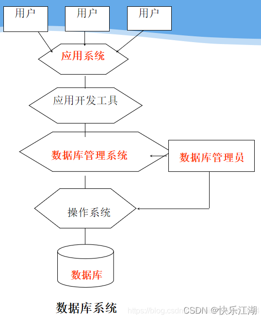

**B.数据库系统特点**
**1.数据结构化**
**2.数据的共享性高，冗余度低且易扩充**
**3.数据独立性高**

- **物理独立性**：用户达到应用程序与存储在磁盘上的数据库中数据是相互独立的。当数据的物理存储改变了，应用程序不用程序不用改变
- **逻辑独立性**：用户的应用程序与数据库的逻辑结构是相互独立的。数据的逻辑结构改变了，用户程序也可以改变。
- **数据独立性是由DBMS的二级映像功能来保证的。**

**4.数据由DBMS统一管理和控制**
 a.数据的安全性保护  b.数据的完整性检查  c.  并发控制  d.数据库恢复

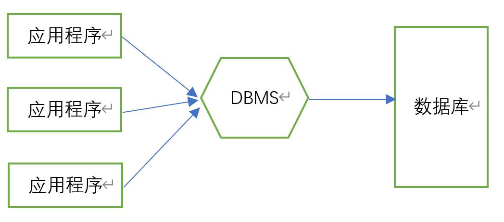

#### 1.2数据模型

**数据模型是用来描述数据、组织数据和对数据进行操作的。**

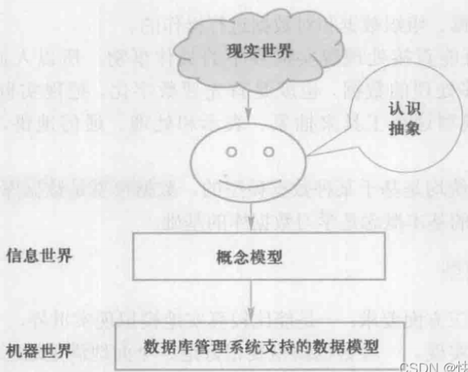

**概念模型**（信息模型）：用于数据库设计
**逻辑模型**：主要用于数据库管理系统的实现，关系模型(RDBMS !!!!!)、面向对象数据模型等，用于DBMS实现
**物理模型**：DBMS帮助我们建立物理模型（存储结构、存储方式等）
**E-R图**：实体，属性，实体集，键（可以唯一标识每个实体属性），实体型，联系

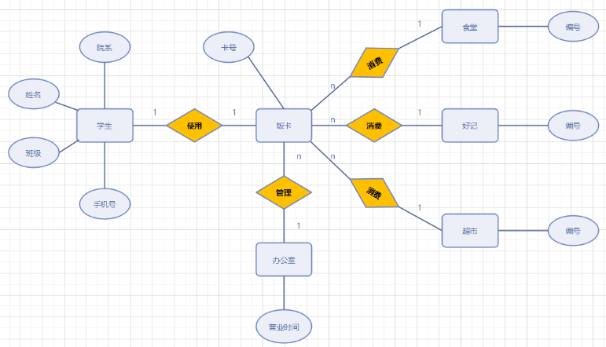

数据模型组成要素：**数据结构，数据操作（查询，更新），数据的完整性约束条件**

**关系模型！！！**

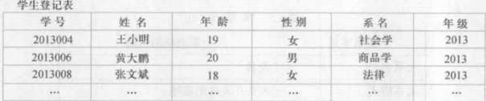

**优点**

- 建立在严格的数学概念的基础上
- 关系模型的概念单一，无论实体还是联系都用关系表示，对数据的检索和更新结果也是关系。因此简单、清晰，易用
- 关系模型的存取路径对用户透明

**缺点**

- 查询效率往往不如格式化数据模型
- 开发相应数据库管理系统难度大

#### 1.3数据库系统的结构

**数据库系统模式的概念**

（1）型和值

（2）模式和实例

模式(schema)：是数据库逻辑结构和特征的描述

- 是型的描述
- 反应的是数据的结构及其联系
- 模式相对稳定

实例(instance)：模式的一个具体值

- 反映数据库某一时刻的状态

- 同一个模式可以有很多实例
- 实例随数据中的数据的更新而变动

**一个数据库只有一个模式，可以把模式看成是唯一的数据库，实例就是数据库里面的多个表**

所以MYSQL中创建模式其实也就是在创建数据库

**三级模式**

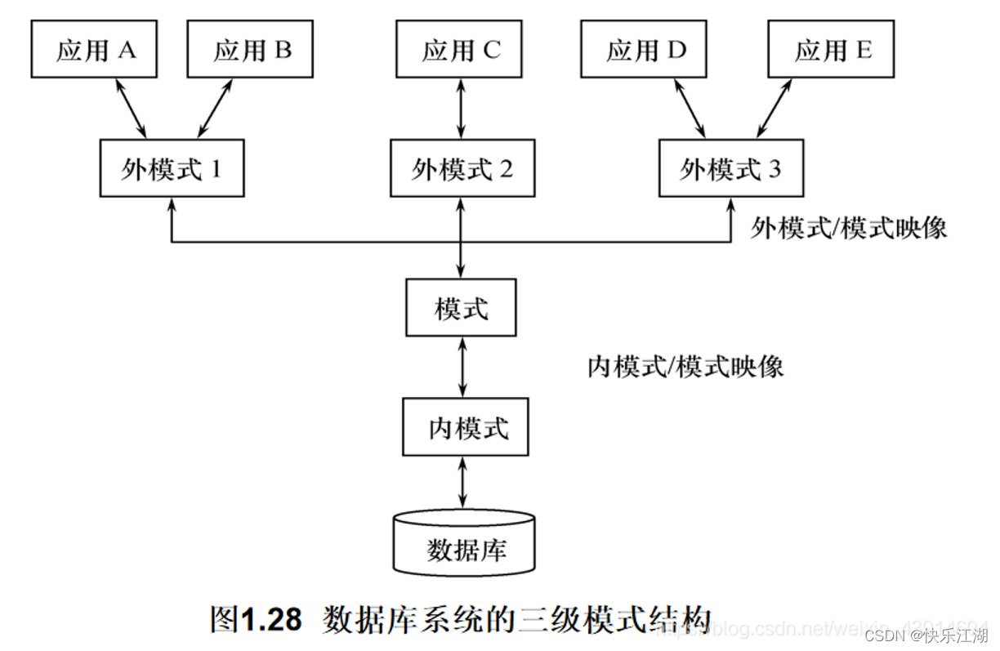

（1）模式(schema)
模式：是数据库中全体数据的逻辑结构和特征的描述，是所有用户的公共数据视图，综合了所有用户的需求，对应概念模式

- 它是数据库模式结构的中间层，既不涉及数据的物理存储细节和硬件环境，又与具体的应用程序、所使用的应用开发工具及高级语言无关

- **一个数据库只有一个模式**
- 数据库模式以某一种数据模型为基础，统一考虑所有用户需求，并将这些需求有机结合为一个逻辑整体
- DBMS提供模式DDL来严格定义模式

（2）外模式(external schema)
外模式：是数据库用户（包括程序员和最终用户）能够看见和使用的局部的逻辑结构和特征的描述，是数据库用户的==数据视图==，是与某一应用有关的数据的逻辑描述

- 外模式通常是模式的一个子集，所以模式与外模式的关系为一对多

- 一个数据库可以有多个外模式，反映了不同用户的需求（比如爱奇艺的付费用户和普通用户）
- 同一个外模式也可以为某一用户的多个应用系统所使用，但一个应用程序只能使用一个外模式
- 外模式是保证数据库安全性的一个有力措施。每个用户只能看见和访问所对应的外模式中的数据，数据库中的其余数据是不可见的
- DBMS提供外模式DDL来严格定义外模式

（3）内模式(internal schema)
内模式：是数据物理结构和存储方式的描述，是数据在数据库内部的表示方式

**一个数据库只有一个内模式**

**二级映像**

**（1）外模式/模式映像**
同一个模式可以有任意多个外模式，对于每一个外模式，数据库系统都有一个外模式/模式映像，它定义了该外模式与模式之间的对应关系

当模式改变时( 例如增加新的关系、新的属性、改变属性的数据类型等)，由数据库管理员对各个外模式/模式的映像作相应改变，可以使外模式保持不变。应用程序是依据数据的外模式编写的，从而应用程序不必修改，保证了数据与程序的逻辑独立性，简称数据的逻辑独立性

**（2）模式/内模式映像**
当数据库的存储结构改变时( 例如选用了另一种存储结构)，由数据库管理员对模式/内模式映像作相应改变，可以使模式保持不变。从而应用程序不必改变，保证了数据与程序的物理独立性，简称数据的物理独立性

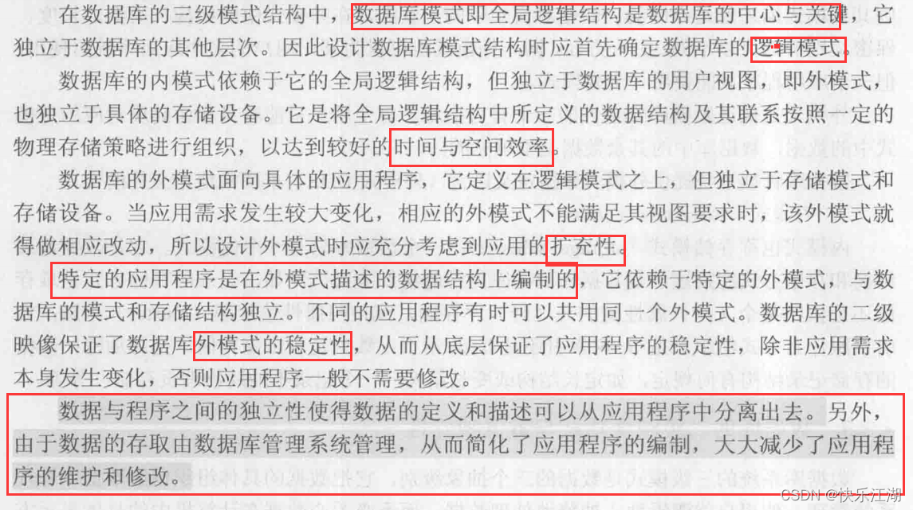

### 第二章 关系数据库

#### 2.1关系数据结构及其形式化定义

 数据模型由以下三部分构成

- 数据结构
- 数据操作
- 数据的完整性约束条件

**A.关系**

**域**     **是一组具有相同数据类型的值的集合**

**笛卡儿积**--->元组和分量

**关系**     

​          ==基本概念==
​             R(D1、D2......Dn)-->笛卡尔积的子集在域的关系

​              R是关系名，n是关系的目或度（n=1单元关系，n=2二元关系 ）
​              关系既然是笛卡尔积的子集（有限子集），所以关系也是一张**二维表**
​             **表的每一行对应一个元组，表的每一列对应一个域**
​             由于域可以相同，为了区分，**必须对每列起一个名字，称为属性**（比如                                上面的表中研究生和导师都是人，为了区分，所以才取了不同的名字）

​           ==码==
假设 R（学号、姓名、性别、课程名、期末分数）
**候选码**：若关系中的某一属性组（注意是组不是某单个属性，当然有时属性组也可能只有一个属性）能**唯一地标识一个元组**，而**其子集不能**，（学号，姓名）

**超码：**能够唯一标识一条记录的属性或属性集，**候选码是最小的超码**（学号，课程号，姓名），（学号，课程号，性别）
**主码：候选码中的天选之子**，候选码不止一个，但是数据库设计者会根据实际需求选取一个候选码作为主码，**可以唯一标志一条记录的最小属性集**
**外码**：**是本关系的属性且不是码，而是另一个关系的主码
全码：**极端情况下，关系的所有属性组是这个关系模式的候选码
**主属性和非主属性：**包含在候选码中的属性称为主属性，不包含的成为非主属性。（上面关系中，姓名、性别、期末分数都是非主属性）

   ==关系的三种类型==

- **基本关系（又称基本表）**：**实际存在**的表，是实际存储数据的逻辑表示

- **查询表**：**查询结果**对应的表

- **视图表**：由基本表或其他视图表导出的表，**是虚表**，不对应实际存储的数据

  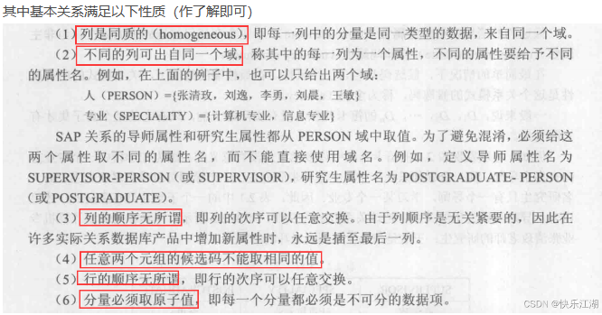

**B.关系模式**

**在关系数据库中，关系模式就是型，关系就是值，关系模式是对关系的描述**，具体来说要描述以下方面

- 元组集合的结构（由哪些属性构成、这些属性来自哪些域、属性与域之间的映像关系）
- 元组语义以及完整性约束
- 属性之间的数据依赖关系

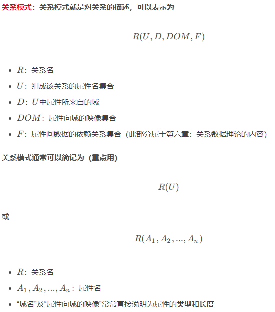

**C.关系数据库**

（1）基本概念
关系数据库：在一个给定的应用领域中，所有关系的集合构成的一个关系数据库

（2）关系数据库的型与值
关系数据库的型：也称为关系数据库模式，是对关系数据库的描述，包括

- 若干域的定义
- 在这些域上定义的若干关系模式

关系数据库的值：这些关系模式在某一时刻对应的关系的和，通常就叫做关系数据库

#### 2.2关系操作和关系完整性

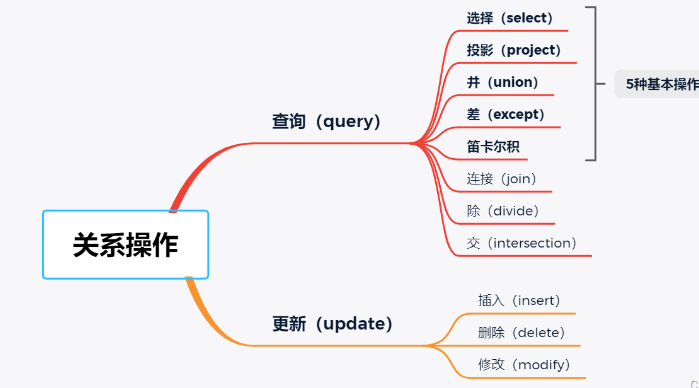

完整性约束

- **实体完整性**

​                         主属性不可以取空

- **参照完整性**

A.参照关系

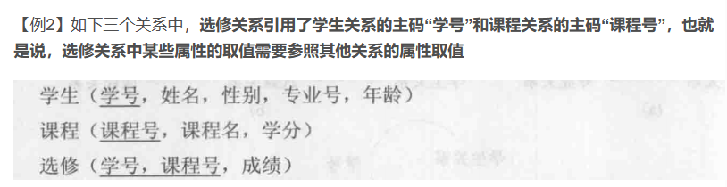

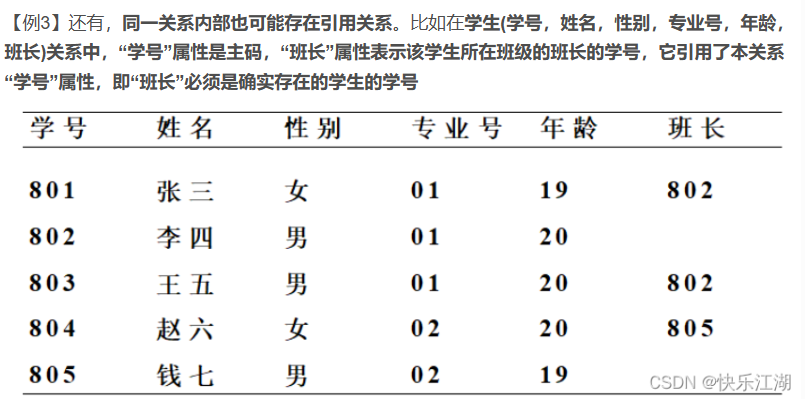

B.外码

**外码并不一定要与相应的主码同名**，如上面第三个例子中，学生关系的主码为学号，外码为班长。不过，在实际应用中为了便于识别，当外码与相应的主码属于不同关系时，往往给它们取相同的名字。

C.参照完整性规则

参照完整性：若属性或属性组F是基本关系R的**外码**，它与基本S的**主码**相对应（关系R和S不一定是不同的关系），则对于R中每个元组在F上的值必须

1. 要么取**空值**（此时F的每个属性值均为空值）
2. 要么等于S中**某个元组的主码值**

- **用户自定义完整性**

用户自定义完整性1针对某一具体关系数据库的约束条件，反映**某一具体应用所涉及的数据必须满足的语义要求**，例如某个属性必须取唯一值，某个非主属性不能取空值等等

#### 2.3关系代数

- 并  ∪

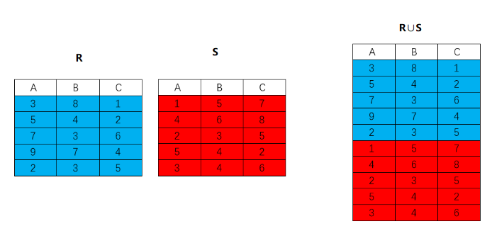

- 差   -

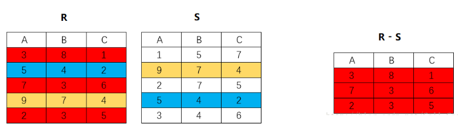

- 交   ∩

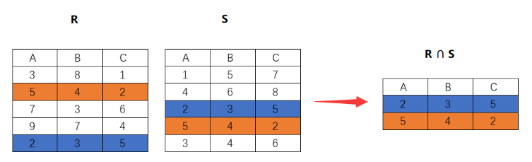

- 笛卡尔积 ×

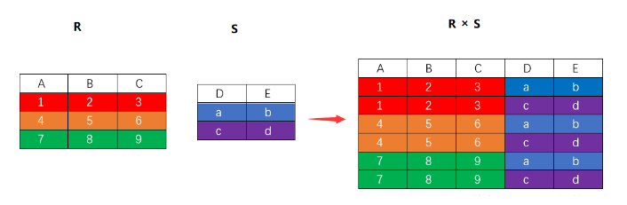

------

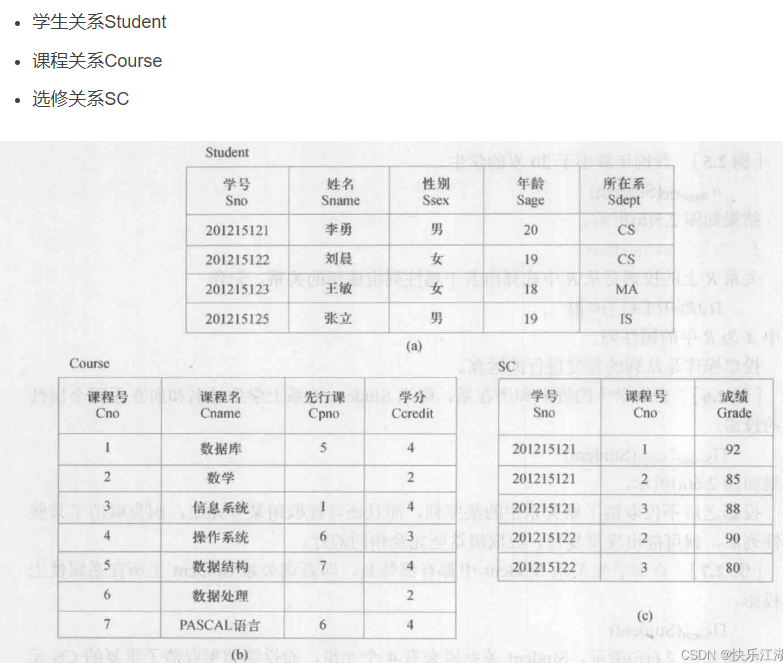

- 选择  σ

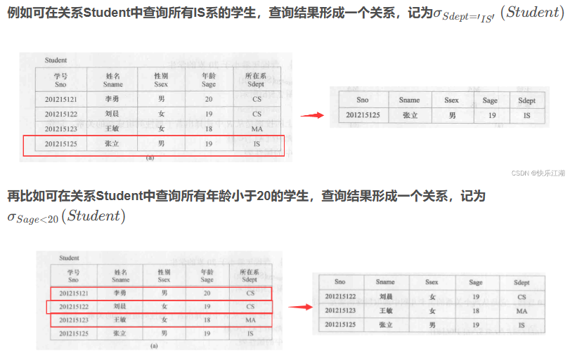

- 投影  ∏   (投影一定要消除完全相同的行)

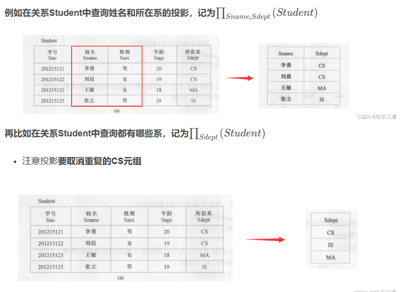

- 连接

A.等值连接

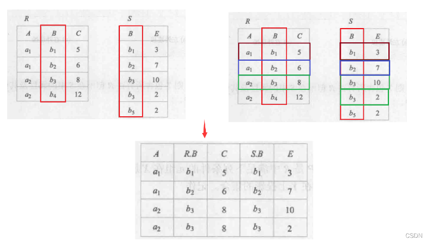

B.自然连接（等值连接的基础之上去掉重复的列）

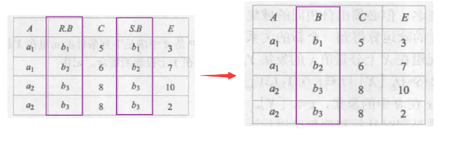

C.外连接

左外连接：只保留左边关系R RR中的悬浮元组
右外连接：只保留右边关系R RR中的悬浮元组

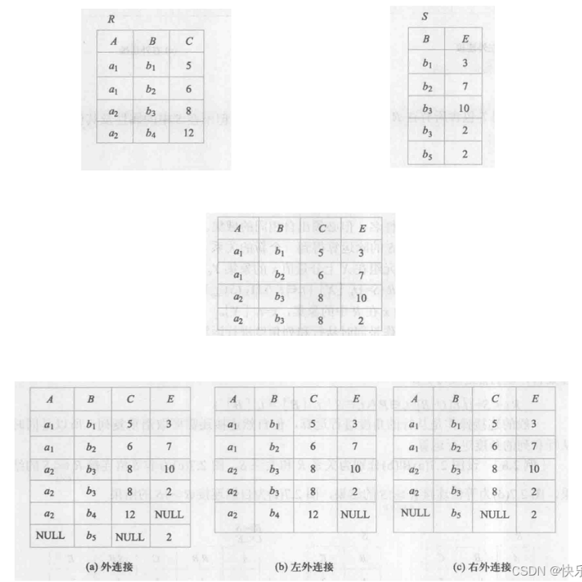

- 除   ÷（笛卡尔积的逆运算）

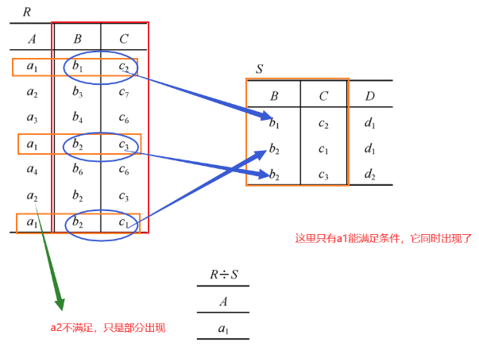

### 第三章 关系数据库标准语言 S Q L

#### 3.1 数据定义

#### 3.2 数据查询

#### 3.3 数据更新

#### 3.4  视图

### 第四章 数据库安全性

### 第五章 数据库完整性

## B.设计与应用开发篇

### 第六章 关系数据理论

### 第七章 数据库设计

### 第八章 数据库编程

## C.系统篇

### 第九章 关系查询处理和关系优化

### 第十章 数据库恢复技术

### 第十一章 并发控制

### 第十二章 My S Q L和J D B C编程