# HTML

```HTML
<!DOCTYPE html>
<html>
<head>
<meta charset="utf-8">
<title>ZONGXP</title> #描述了文档的标题
</head>#包含了文档的元（meta）数据
<body>#包含了可见的页面内容
 
<h1>这是标题 1</h1>
<h2>这是标题 2</h2>
<h3>这是标题 3</h3>
<h4>这是标题 4</h4>
<h5>这是标题 5</h5>
<h6>这是标题 6</h6>
 
</body>
</html>
```


1.HTML 标题（Heading）是通过<h1> - <h6> 标签来定义的.

```html
<h1>这是标题 1</h1>
<h2>这是标题 2</h2>
<h3>这是标题 3</h3>
<h4>这是标题 4</h4>
<h5>这是标题 5</h5>
```

2.段落

```HTML
<p>这是一个段落。</p>
<p>这是一个<br>段落。</p>
<p>这是一个段落。</p>
```

3.链接

```HTML
<a href="https://blog.csdn.net/zong596568821xp">这是一个链接使用了 href 属性</a>
```

4.图像

```HTML

```

5.表格

```HTML
<table border="1">
    <tr>
        <th>Header 1</th>
        <th>Header 2</th>
    </tr>
    <tr>
        <td>row 1, cell 1</td>
        <td>row 1, cell 2</td>
    </tr>
    <tr>
        <td>row 2, cell 1</td>
        <td>row 2, cell 2</td>
    </tr>
</table>
```

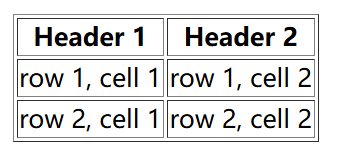

## **速查**

1.基本文档

```HTML
<!DOCTYPE html>
<html>
<head>
<title>文档标题</title>
</head>
<body>
可见文本...
</body>
</html>
```

2.基本标签

```HTML
<h1>最大的标题</h1>
<h2> . . . </h2>
<h3> . . . </h3>
<h4> . . . </h4>
<h5> . . . </h5>
<h6>最小的标题</h6>
 
<p>这是一个段落。</p>
<br> （换行）
<hr> （水平线）
<!-- 这是注释 -->
```

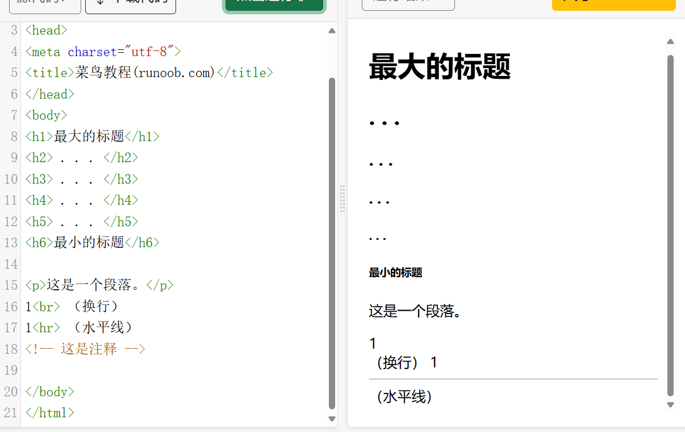

3.文本格式化

```HTML
<b>粗体文本</b>
<code>计算机代码</code>
<em>强调文本</em>
<i>斜体文本</i>
<kbd>键盘输入</kbd> 
<pre>预格式化文本</pre>
<small>更小的文本</small>
<strong>重要的文本</strong>
 
<abbr> （缩写）
<address> （联系信息）
<bdo> （文字方向）
<blockquote> （从另一个源引用的部分）
<cite> （工作的名称）
<del> （删除的文本）
<ins> （插入的文本）
<sub> （下标文本）
<sup> （上标文本）
```

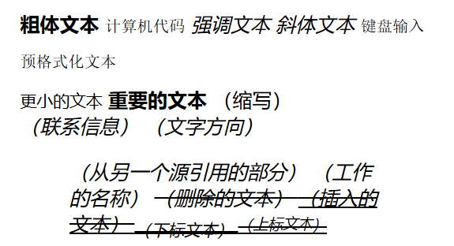

4.链接

```HTML
普通的链接：<a href="http://www.example.com/">链接文本</a>
图像链接： <a href="http://www.example.com/"></a>
邮件链接： <a href="mailto:webmaster@example.com">发送e-mail</a>

<a href="https://www.bilibili.com"target="_self">主页</a>#在当前窗口跳链接
<a href="https://www.bilibili.com"target="_blank">主页</a>#在新窗口跳链接
书签：
<a id="tips">提示部分</a>
<a href="#tips">跳到提示部分</a>
```

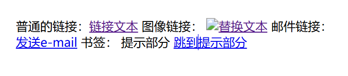

5.图片

```HTML

```

6.样式/区块

div是块级元素，一行独占一块

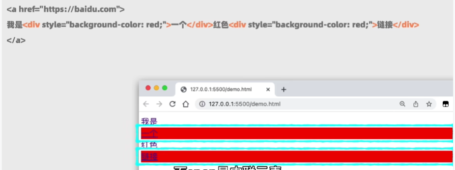

span是内联元素，不会独占一块

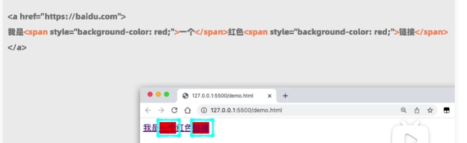

```HTML
<style type="text/css">
h1 {color:red;}
p {color:blue;}
</style>
<div>文档中的块级元素</div>
<span>文档中的内联元素</span>
```

下面的例子涉及到CSS 

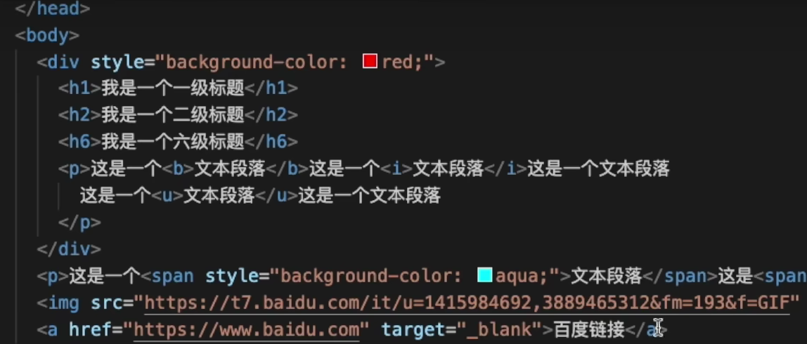

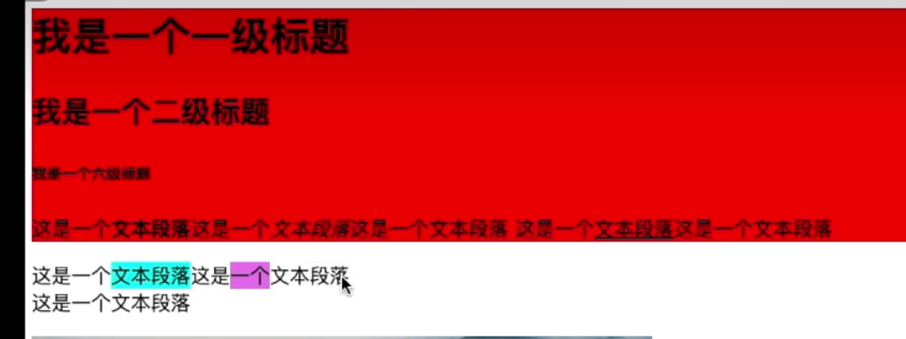

7.无序列表(unordered list)

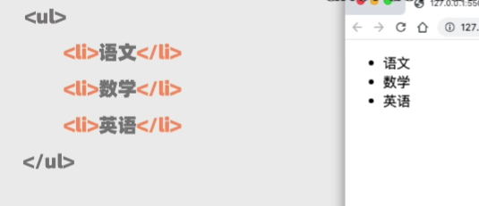

```html
<ul>
    <li>项目</li>
    <li>项目</li>
</ul>
```

8.有序列表（list item）

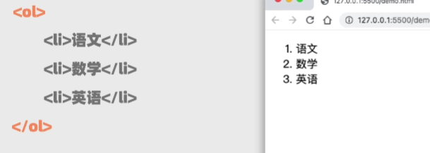

```html
<ol>
    <li>第一项</li>
    <li>第二项</li>
</ol>
```

9.定义列表

```html
<dl>
  <dt>项目 1</dt>
    <dd>描述项目 1</dd>
  <dt>项目 2</dt>
    <dd>描述项目 2</dd>
</dl>
```

10.表格

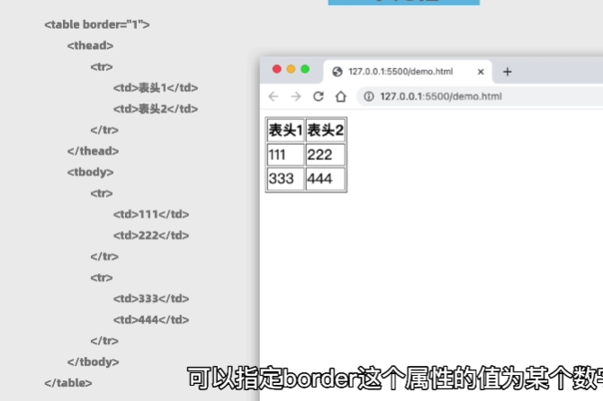

```HTML
<table border="1">
  <tr>
    <th>表格标题</th>
    <th>表格标题</th>
  </tr>
  <tr>
    <td>表格数据</td>
    <td>表格数据</td>
  </tr>
</table>
```

11.框架

```HTML
<iframe src="demo_iframe.htm"></iframe>
```

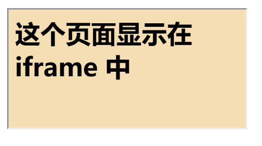

12.表单

```HTML
<form action="demo_form.php" method="post/get">
<input type="text" name="email" size="40" maxlength="50">
<input type="password">
<input type="checkbox" checked="checked">
<input type="radio" checked="checked">
<input type="submit" value="Send">
<input type="reset">
<input type="hidden">
<select>
<option>苹果</option>
<option selected="selected">香蕉</option>
<option>樱桃</option>
</select>
<textarea name="comment" rows="60" cols="20"></textarea>
 
</form>
```

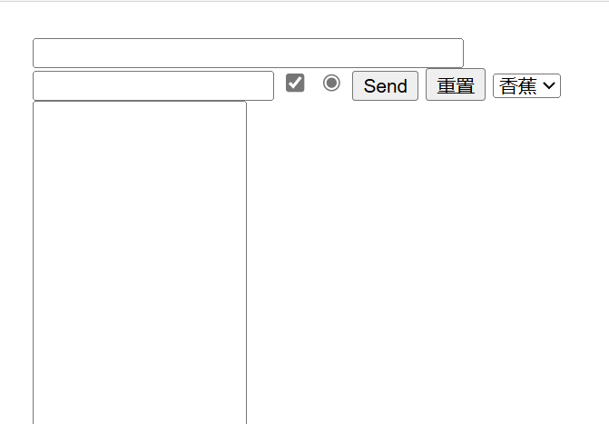

13.实体

```HTML
&lt; 等同于 <
&gt; 等同于 >
&#169; 等同于 ©
```

14.类

```
<p class="content">666</p>
<p class="review">777</p>
```


# CSS3

1.标签选择器

格式：标签名 { }
     作用：页面中所有该标签名的元素都选中 

```css
<style>
	div{
        color: aqua;
        border: 1px solid black;
     }
</style>
```

```css
<div>xiaobin</div>
```


2.class选择器
        格式：.class名 {}
        作用：页面中所有有该class名的元素都选中。
         class名是由自己定义的，但需要遵守一下命名规则：

    1. 不能使用纯数字或者数字开头： 对： d1, b2。 错： 123， 2b
        2. 应该使用英文、数字、下划线_或者中划线-来命名。  对： a-b, a_b, _2 

```css
<style>
    .box1{
        color: aqua;
        border: 1px solid black;
    }
</style>
```

```css
<div class="box1">
       xiaobin
</div>
```


3.id选择器
	格式：#id名 { }
	作用：页面中所有有该id名的元素都选中

```css
<style>
	#box1{
		color: aqua;
		border: 1px solid black;
	}
</style>
```

```css
<div id="box1">
	xiaobin
</div>
```


注：关于**选择器权重**的问题
1.当一个元素给多个选择器选中，并且选择器的属性有冲突。那么浏览器会使用权重大（高）选择器的属性。
2.以上三种基础选择器权重(优先级)：id选择器>class选择器>标签选择器
3.继承选择器是所有选择器之和。
4.行内样式的权重默认高于样式表的权重。
5.权重最高的是在属性后加上 !important。

其中， id选择器与class选择器除了权重（优先级）不同以外，还有class选择器在同一页面上能多次使用相同该选择器名，而id选择器只能使用一次（不过在CSS中没有细致区分这两个选择器，但由于id选择器易发生错误，所以还是建议使用class选择器进行编译）


4.并列表选择器

​		格式： 选择器1, 选择器2, 选择器3....{}
​        作用： 所有的选择器选中的元素都使用相同的属性。

```css
	<style>
        div{
        color: aqua;
        border: 1px solid black;
     }
     .box1{
        color: aqua;
        border: 1px solid black;
    }
      #box1{
           color: aqua;
           border: 1px solid black;
        }
    </style>

</head>
<body>
    <div id="box1">666</div>
	<div class="box1">777</div>
	<div>888</div>
	888
</body>
</html>
```


5.5.继承选择器：

 **大继承选择器：**
    格式：父选择器 子选择器 子子选择器....{}
    作用：页面中完全符合选择器路径的元素都选中。
    例子：p a{}   .box1 a {}

**小继承选择器：**
格式： 父选择器>子选择器>子子选择器....{}
作用： 页面中完全符合选择器路径的元素都选中。

==区别在于，大继承可以跳级。小继承不能跳级。==

```css
<style>
    .u1 li { /*大继承选择器*/
        background-color: palegreen;
    }
    .u2 li {/*大继承选择器*/
        background-color: orange;
    }
    .u1 a {/*大继承选择器*/
        color: red;
    }
    .u2>li a {/*小继承与大继承混合选择器*/
        color: green;
    }
</style>
```

```css
<body>
    <ul class="u1">
        <li>
            <a href="#">广州</a>
        </li>
        <li>
            <a href="#">深圳</a>
        </li>
    </ul>

    <ul class="u2">
        <li>
            <a href="#">小明</a>
        </li>
        <li>
            <a href="#">小红</a>
        </li>
    </ul>
```


