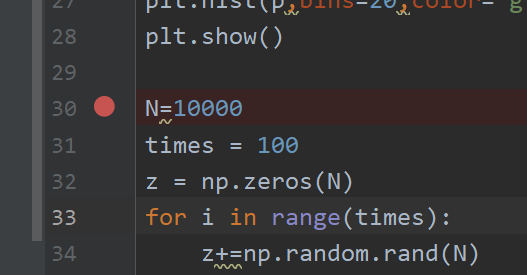
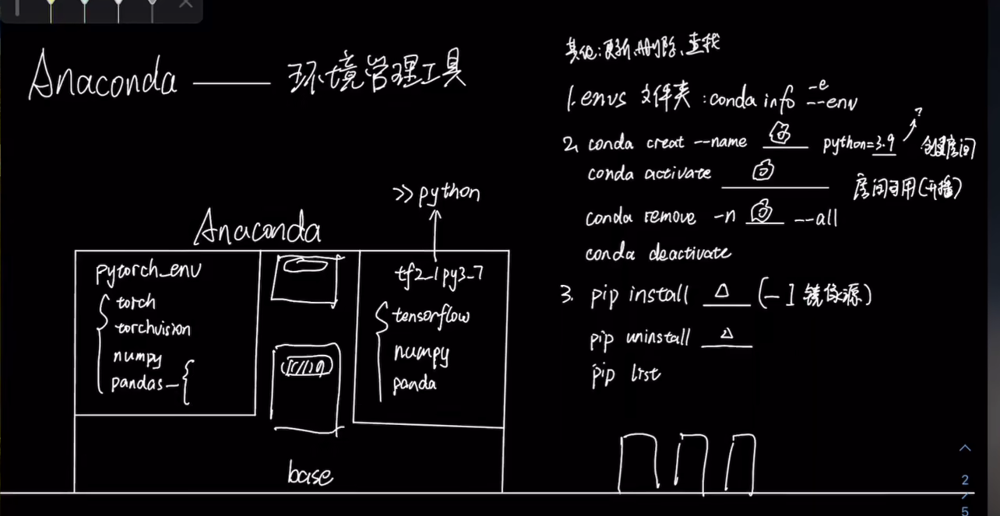

# python及其数学库

1.数据收集->数据清洗->特征工程->数学建模->模型预测
深度学习（主要是在模型的搭建）
机器学习（主要研究如何提取特征）

2.有监督学习和无监督学习

3.python打断点，F8



4.传入数据

```python
d = np.random.rand(3,4)
print(d)
print(type(d))
data = pd.DataFrame(data = d,columns=list('abcd'))
print('='*50)
print(data)
print(type(data))
print(data[list('a')])
data.to_csv('data.csv',index=False,header=True)
print("ok")
```

**5.求导，A/B，即矩阵A中的每个元素对应矩阵B中的每个元素求导。标量不变，向量拉伸。df/dx，f横向拉伸，x纵向拉伸。**


# A.绪论

1.有监督学习和无监督学习

- 有监督学习：通过现有的数据集，数据集中的每个元素都有对应的属性，从而去回归预测，或者去判断某个东西的类别是什么。
- 无监督学习：没有任何的标签或者有相同的标签。所以通过特征值的提取，去聚类。比如新闻聚类


2.环境



```python
#创建虚拟环境
conda create -n 环境名
#列出虚拟环境
conda env list #或者 conda info -e
#进入虚拟环境
conda activate 虚拟环境名
#退出虚拟环境
conda deactivate 虚拟环境名
#删除某个虚拟环境
conda remove -n 虚拟环境名--all
#重命名虚拟环境（base不可以）
conda rename -n 现在的名称  新的名称
#安装某个包
#建议先进入相应的虚拟环境再进行安装，不建议全部安装在base
conda install 包名
#进入某个虚拟环境之后也可以使用pip安装包
pip install 包名
#删除某个包
conda remove 包名
#查看已经安装的包
conda list
#将包更新到最新版本
conda update 包名
conda update -n 环境名 包名
#查看conda的配置
conda info
conda config --show
#修改conda配置文件
channels:
  - defaults
envs_dirs:
  - D:\Anaconda3\envs
```

