正则表达式
多线程
数据库
数据分析


爬虫的步骤：

- 获取网页内容

**HTTP请求**：客户端和服务器之间通信

GET：获取数据。进入网页，得到网页内容。

POST：创建数据。比如我们提交账号注册表单，浏览器会发送POST请求，将账号密码等内容打包好发送给服务器。


```http
POST/user/info?new_user=true HTTP/1.1 #请求行,(方法类型/资源路径/协议版本)
#资源路径指明要访问服务器的哪个资源 
HOST:www.example.com #请求头 主机域名
User-Agent:curl/7.77.0
Accept:*/*
{"username":"erha666", #请求体
 "email":"154838285@qq.com"}
```

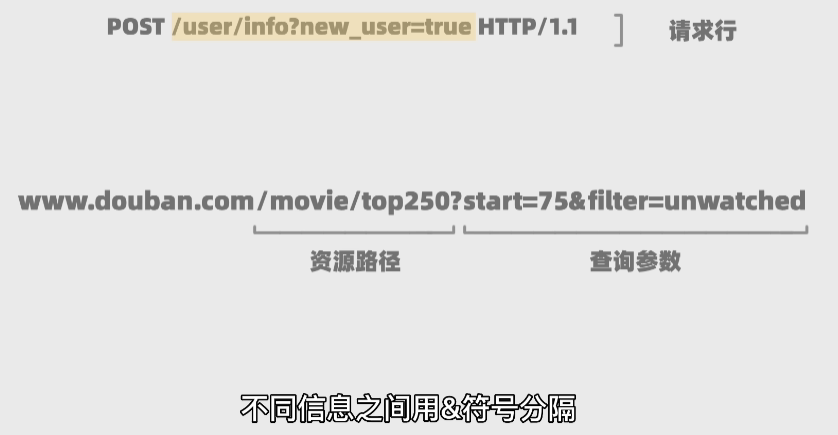


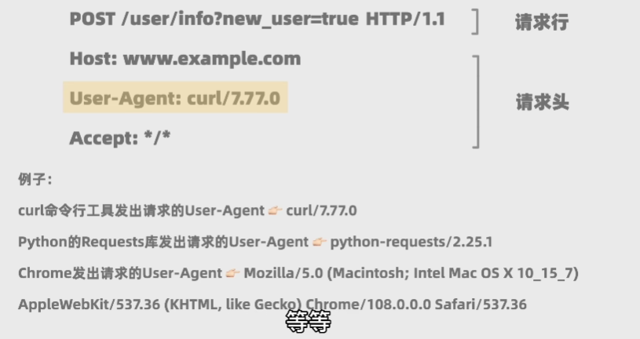


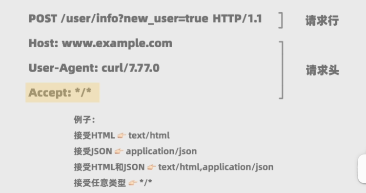


**HTTP响应：**

```http
HTTP/1.1 200 OK #状态行（协议版本、状态码、状态消息）
Date:Fri,27 Jan 2023 02:10:48 GMT #响应头
Content-Type:text/html;charset=utf-8

<!DOCTYPE html>
	<head><title>首页</title></head> #响应体
	<body><h1>666</h1><p>hello!</p></body>
</html>
```

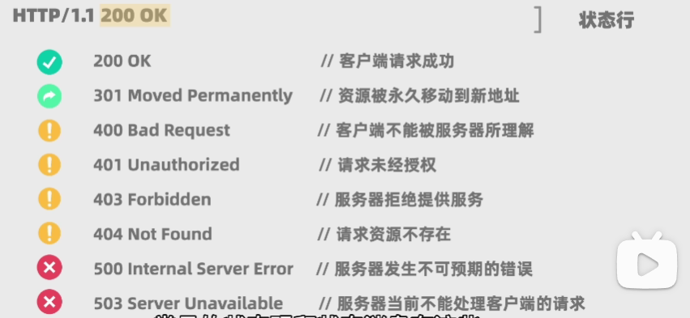

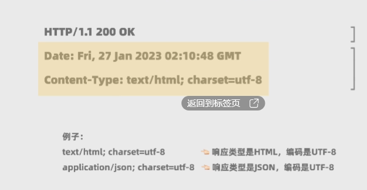

- 解析网页内容

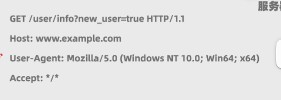

通过篡改User-Agent的参数，可以让网页知道是浏览器发送的请求还是程序发送的请求

练习：

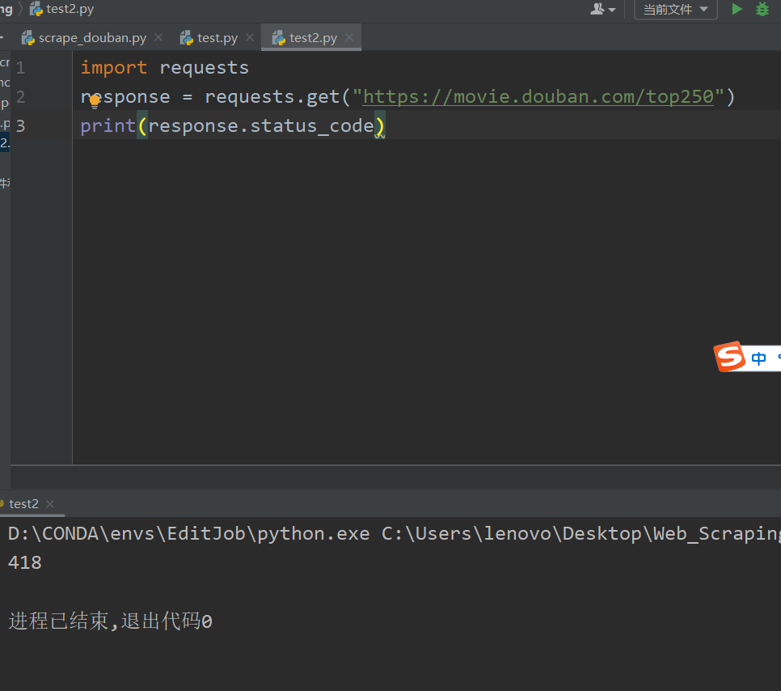

产生这个原因：豆瓣回应爬虫的时候，只想响应正常的浏览器而不想，然后忽略所有爬虫程序的请求。所以这种情况，我们可以绕过去的一个方法就是通过定义请求头，把程序伪装成浏览器。

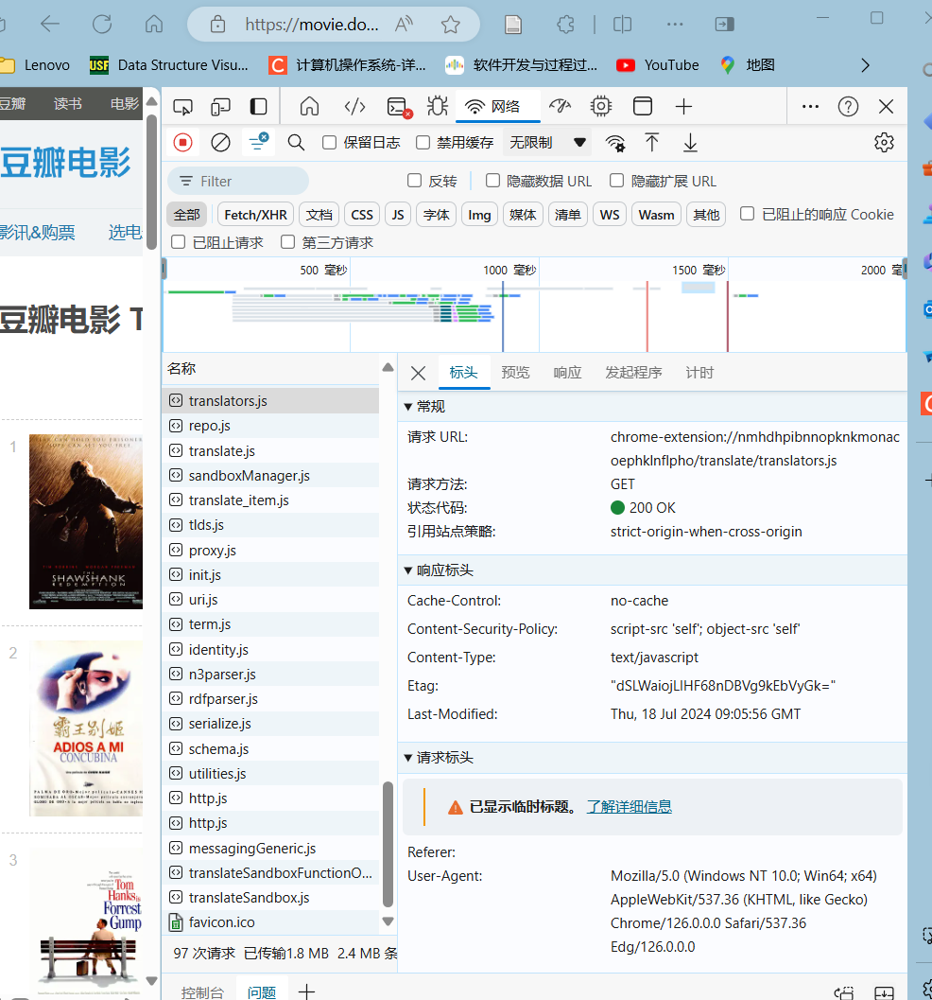

找到user-agent,复制下去，伪装成浏览器。

HTML：定义网页的结构和信息

CSS：定义网页样式

JavaScript：定义用户和网页的交互逻辑 

11

**Beautiful Soup**

```python
url = "http://www.example.com/"
content = requests.get(url, headers=headers).text#作为字符串存储在content
soup = BeautifulSoup(content,"html.parser")#去指定解析器去解析HTML
```

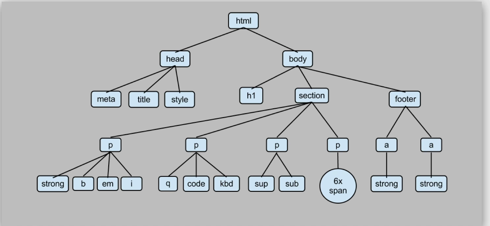

找网站上的所有书名，我们发现他们都在<h3>标签下面的<a>里面

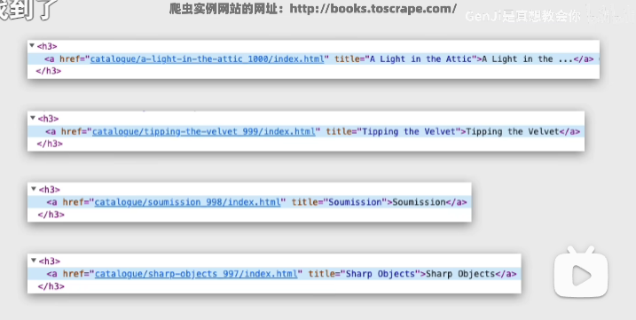

```python
url = "http://books.toscrape.com/"
content = requests.get(url, headers=headers).text
soup = BeautifulSoup(content,"html.parser")
all_titles = soup.findAll("h3")#根据标签属性，找到所有符合要求的元素
for title in all_titles:
    all_links = title.findAll("a")
    for link in all_links:
        print(link.string)
```

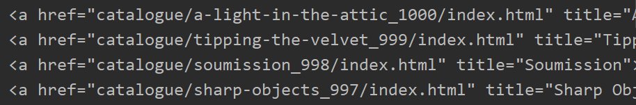


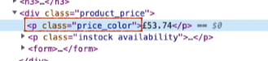

```python
all_prices = soup.findAll("p",attrs={"class": "price_color"})
for price in all_prices:
    print(price.string[2:])
```

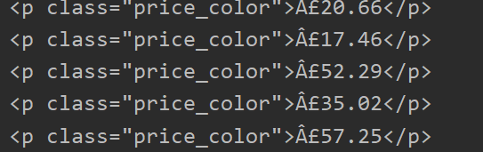


**分页功能**

```python
for start_num in range(0, 250, 25):
    response = requests.get(f"https://movie.douban.com/top250?start={start_num}", headers=headers)
    html = response.text
    soup = BeautifulSoup(html, "html.parser")
    all_titles = soup.findAll("span", attrs={"class": "title"})
    for title in all_titles:
        if "/" not in title.string:
            print(title.string)
```


- 储存或分析数据


**写的虫要是一只温和善良的虫，访问频率不能太快，否则无异于DDoS攻击**

查看网页的robots.txt，了解可爬取范围