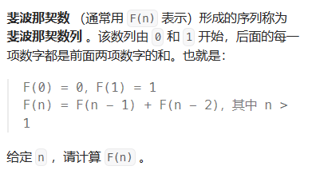
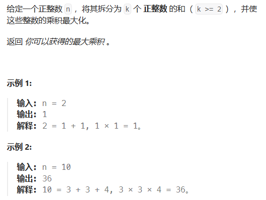
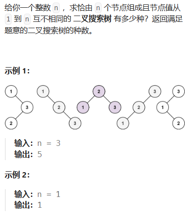

# 动态规划专题


## **1.理论基础**

**某一问题有很多的重叠子问题的时候**，使用动态规划最有效。

**每一个状态一定由上一个状态推导出来的，这一点就区分于贪心。因为贪心没有理论推导，直接从局部选出最优**

## **2.解题步骤**

1. 确定dp数组（dp table）以及下标的含义
2. 确定递推公式（状态转移公式特别重要）
3. dp数组如何初始化
4. 确定遍历顺序
5. 举例推导dp数组
6. （打印dp数组）

## **3.如何Debug**

**找问题的最好方式就是把dp数组打印出来，看看究竟是不是按照自己思路推导的！**

**做动规的题目，写代码之前一定要把状态转移在dp数组的上具体情况模拟一遍，心中有数，确定最后推出的是想要的结果**。

然后再写代码，如果代码没通过就打印dp数组，看看是不是和自己预先推导的哪里不一样。

如果打印出来和自己预先模拟推导是一样的，那么就是自己的递归公式、初始化或者遍历顺序有问题了。

如果和自己预先模拟推导的不一样，那么就是代码实现细节有问题。

**这样才是一个完整的思考过程，而不是一旦代码出问题，就毫无头绪的东改改西改改，最后过不了，或者说是稀里糊涂的过了**。

**!!!发出这样的问题之前，其实可以自己先思考这三个问题：!!!**

- 这道题目我举例推导状态转移公式了么？
- 我打印dp数组的日志了么？
- 打印出来了dp数组和我想的一样么？


# 基础题目

## 1.斐波那契数列（509）



```c++
//状态转移方程 dp[i] = dp[i - 1] + dp[i - 2];
//初始化 dp[0] = 0; dp[1] = 1;
class Solution {
public:
    int fib(int N) {
        if (N <= 1) return N;
        vector<int> dp(N + 1);
        dp[0] = 0;
        dp[1] = 1;
        for (int i = 2; i <= N; i++) {
       dp[i] = dp[i - 1] + dp[i - 2];
        }
        return dp[N];
    }
};


int fib(int N){//优化，不需要记录整个数组的长度
    if(N<=1) return N;
    int dp[2];
    dp[0] = 0;
    dp[1] = 1;
    for(int i = 2;i<=N;i++){
        int sum = dp[0] + dp[1];
        dp[0] = dp[1];
        dp[1] = sum;
    }return dp[1];
}
```


## 2.爬楼梯（70）


```c++
//dp[i]代表爬到第i层楼梯，有dp[i]种方法
//首先是dp[i - 1]，上i-1层楼梯，有dp[i - 1]种方法，那么再一步跳一个台阶不就是dp[i]了么。
//还有就是dp[i - 2]，上i-2层楼梯，有dp[i - 2]种方法，那么再一步跳两个台阶不就是dp[i]了么。
dp[1] = 1;dp[2] = 2;
for(int i = 3;i<=n;i++){
    int sum = dp[1]+dp[2];
    dp[1] = dp[2];
    dp[2] = sum;
}return dp[n];
```


## 3.使用最小花费爬楼梯（746）


```c++
//到达第i台阶所花费的最少体力为dp[i]！！！
//dp[i] = min(dp[i - 1] + cost[i - 1], dp[i - 2] + cost[i - 2]);
//dp[0] = 0,dp[1] = 0;一旦你往上跳的时候才需要消耗体力
class Solution {
public:
    int minCostClimbingStairs(vector<int>& cost) {
        vector<int> dp(cost.size() + 1);
        dp[0] = 0; // 默认第一步都是不花费体力的
        dp[1] = 0;
        for (int i = 2; i <= cost.size(); i++) {
            dp[i] = min(dp[i - 1] + cost[i - 1], dp[i - 2] + cost[i - 2]);
        }
        return dp[cost.size()];
    }
};


```


## 4.不同路径


```c++
//图论中的深搜可以解决，但是时间复杂度太大了
class Solution {
private:
    int dfs(int i, int j, int m, int n) {
        if (i > m || j > n) return 0; // 越界了
        if (i == m && j == n) return 1; // 找到一种方法，相当于找到了叶子节点
        return dfs(i + 1, j, m, n) + dfs(i, j + 1, m, n);
    }
public:
    int uniquePaths(int m, int n) {
        return dfs(1, 1, m, n);
    }
};//树的深度是m+n-1
```

```c++
//dp[i][j] ：表示从（0 ，0）出发，到(i, j) 有dp[i][j]条不同的路径。
//dp[i][j] = dp[i - 1][j] + dp[i][j - 1]
//for (int i = 0; i < m; i++) dp[i][0] = 1;
//for (int j = 0; j < n; j++) dp[0][j] = 1;
//因为从(0, 0)的位置到(i, 0)的路径只有一条，所以dp[i][0]一定为1，dp[0][j]也同理。
class Solution {
public:
    int uniquePaths(int m, int n) {
        vector<vector<int>> dp(m, vector<int>(n, 0));
        for (int i = 0; i < m; i++) dp[i][0] = 1;
        for (int j = 0; j < n; j++) dp[0][j] = 1;
        for (int i = 1; i < m; i++) {
            for (int j = 1; j < n; j++) {
                dp[i][j] = dp[i - 1][j] + dp[i][j - 1];
            }
        }
        return dp[m - 1][n - 1];
    }
};

```

$$
（3）C_{m+n-2}^{m-1}  数论解决办法，但是两个int相乘要解决可能出现的溢出问题
$$

## 5.不同路径2（63）


```c++
//有没有障碍物用1  0 来划分
//dp[i][j] ：表示从（0 ，0）出发，到(i, j) 有dp[i][j]条不同的路径。
//if (obstacleGrid[i][j] == 0) { // 当(i, j)没有障碍的时候，再推导dp[i][j]
//    dp[i][j] = dp[i - 1][j] + dp[i][j - 1];}
//初始化   注意代码里for循环的终止条件，一旦遇到obstacleGrid[i][0] == 1的情况就停止dp[i][0]的赋值1的操作，dp[0][j]同理
class Solution {
public:
    int uniquePathsWithObstacles(vector<vector<int>>& obstacleGrid) {
        int m = obstacleGrid.size();
        int n = obstacleGrid[0].size();
	if (obstacleGrid[m - 1][n - 1] == 1 || obstacleGrid[0][0] == 1) //如果在起点或终点出现了障碍，直接返回0
            return 0;
        vector<vector<int>> dp(m, vector<int>(n, 0));
        for (int i = 0; i < m && obstacleGrid[i][0] == 0; i++) dp[i][0] = 1;
        for (int j = 0; j < n && obstacleGrid[0][j] == 0; j++) dp[0][j] = 1;
        for (int i = 1; i < m; i++) {
            for (int j = 1; j < n; j++) {
                if (obstacleGrid[i][j] == 1) continue;
                dp[i][j] = dp[i - 1][j] + dp[i][j - 1];
            }
        }
        return dp[m - 1][n - 1];
    }
};
```

## 6.整数拆分（343）



```c++
//dp[i]：分拆数字i，可以得到的最大乘积为dp[i]。
//dp[i] = max({dp[i], (i - j) * j, dp[i - j] * j});（拆1个，2个，三个及三个以上）
//dp[0] = 0,dp[1] = 0,dp[2] = 1；
//遍历
for (int i = 3; i <= n ; i++) {
    for (int j = 1; j < i - 1; j++) {
        dp[i] = max(dp[i], max((i - j) * j, dp[i - j] * j));
    }
}
//优化版 for (int j = 1; j <= i / 2; j++)
//因为尽量拆成几个相等的数字连乘，最后得到的数字是最大的

class Solution {
public:
    int integerBreak(int n) {
        vector<int> dp(n + 1);
        dp[2] = 1;
        for (int i = 3; i <= n ; i++) {
            for (int j = 1; j <= i / 2; j++) {
                dp[i] = max(dp[i], max((i - j) * j, dp[i - j] * j));
            }
        }
        return dp[n];
    }
};
```

本题也可以用贪心算法

```c++
class Solution {
public:
    int integerBreak(int n) {
        if (n == 2) return 1;
        if (n == 3) return 2;
        if (n == 4) return 4;
        int result = 1;
        while (n > 4) {
            result *= 3;
            n -= 3;
        }
        result *= n;
        return result;
    }
};
```


## 7.不同的二叉搜索树（96）



```c++
//dp[i] ： 1到i为节点组成的二叉搜索树的个数为dp[i]。
//dp[i] += dp[j - 1] * dp[i - j]; ，j-1 为j为头结点左子树节点数量，i-j 为以j为头结点右子树节点数量
//从递归公式上来讲，dp[以j为头结点左子树节点数量] * dp[以j为头结点右子树节点数量] 中以j为头结点左子树节点数量为0，也需要dp[以j为头结点左子树节点数量] = 1， 否则乘法的结果就都变成0了。所以初始化dp[0] = 1
class Solution {
public:
    int numTrees(int n) {
        vector<int> dp(n + 1);
        dp[0] = 1;
        for (int i = 1; i <= n; i++) {
            for (int j = 1; j <= i; j++) {
                dp[i] += dp[j - 1] * dp[i - j];
            }
        }
        return dp[n];
    }
};
```


# 背包问题


# 打家劫舍


# 股票问题


# 子序列问题