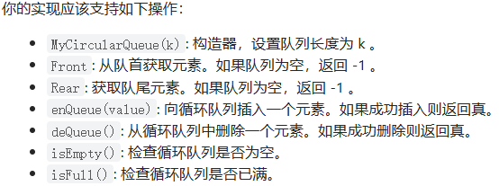
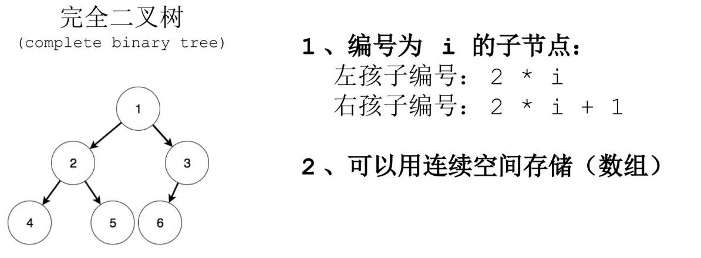
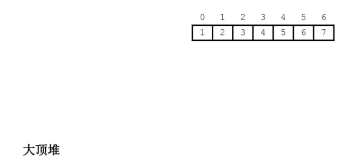
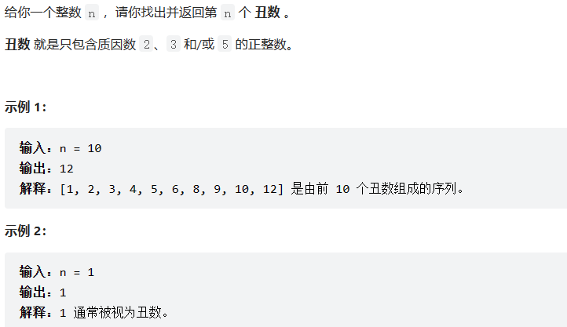

#                                           算法与数据结构(OJ~)

## 第0章：从复杂度开始认识算法

### 1.算法与数据结构的学习方法

A.如何学习数据结构

-  数据结构 = 结构定义+结构操作（增删改查......）
- 学习，学细节；使用，用性质；

B.如何学习算法

- ​     学习，学流程及其正确性。
- ​     使用，用输出

C.如何确定程序中的BUG
             先沿着【算法逻辑】，检查数据处理流程是否出问题，再检查程序中每个阶段的【数据】是否符合预期。

### 2.学习复杂度分析方法

A.复杂度对算法学习的作用		【复杂度】是一种衡量指标

B.时间复杂度与空间复杂度

- 时间复杂度：跑的快不快
- 空间复杂度：吃的多不多
  ！！！通常的状况是："时" "空" 互换

大O表示法

用常数1：如加法操作
在修改后的运行次数函数中，只保留最高阶项
如果最高阶项存在且不是1，则去除与这个项目相乘的常数

```c++
int main(void){//每项相加
    int a1,n,d,sum;
    cin>>a1>>n>>d;
    for(int i = a1,j=0;j<n;j++,i+=d){//2+3n次
        sum+=i;
    }
    cout<<sum<<endl;
    return 0;
}//时间复杂度O（n）,空间复杂度O（1）（额外开辟了多少个空间，要是常数个那就是1）
```

C.学会这几种复杂度，解决90%的问题---实际生产生活中O（100 n）和O（1/100 n）还是需要比较的

  O（1）时间复杂度：常数的关系，**运算的规模与程序的计算之间的关系**
  O（n）:枚举的做法，线性关系
  O（n 2）：循环套循环
  O（log n）:二分算法或者是树形结构相关内容  ~底数不重要~

```c++
for(int i = 1;i<n;i*=2){//log2n +1 下取整
  cout<<i<<endl;
}
```

O（nm）

```c++
for(int i = 0;i<n;i++){
    for(int j = 0;j<m;j++){
        cout<<""<<endl;
    }
}
```

O(n +m)

```c++
for(int i = 0;i<n;i++){}
for(int j = 0;j<m;j++){}
```

其余种类，如判断素数 O（根号n），分块算法，素数筛 O（log log n）等

```c++
for(int i = 0;i*i <n;i++){}
```


## 第1章 递归函数的设计技巧

### 1.递归函数的基本使用方法

1.数学归纳法


​                                     数学归纳法和结构归纳法！！->提高编码能力

2.递归函数设计的三个重要部分

a.给递归函数一个明确的语言【很重要】
b.实现边界条件时的程序逻辑
c.假设递归函数调用返回结果是正确的，实现本层函数逻辑

3.求阶乘（一般性模板）

```c++
int func(int n){  //明确的语义信息
    if(n ==1||0) return 1;//边界条件 1
    return func(n-1)*n;//返回结果是正确的，并且可以实现本层函数逻辑
}
```


### 2.递归函数的原理                                                                                                                                                                                                                                                                                                                                                                                                                                                                                                                                                                                                                                                                                                                                                                                                                                                                                                                                                                                                                                                                                                                                                                                                                                                                                                                                                                                                                                                                                                                                                                                                                                                                                                                                                                                                                                                                                                                                                                                                                                                                                                                                                                                                                                                                                                                                                                                                                                                                                                                                                                                                                                                                                                                                                                                                                                                                                                                                                                                                                                                                                                                                                                                                                                                                                                                                                                                                                                                                                                                                                                                                                                                                                                                                                                                                                                                                                                                                                                                                                                                                                                                                                                                                                                    

 

**递归调用好比是调用栈一样~~~**

1.

```c
#include <stdio.h>
void f()
{
	char x;
	scanf("%c",&x);
	if(x=='*'){
		printf("%c",x);
	}
	else{
		f();
		printf("%c",x);
	}
	return;
}
int main()
{
	f();
	return 0;
}

```


输入样例   abc*          输出样例  *cba 

这里面X是局部变量

上面是进入函数f( )后的运行过程，刚开始输入x=a，if为假，再次调用f( )函数，再次输入x=b，以此类推下去，到最后if为真时，输出x= *，再返回输出x=c，以此类推下去，最后的到的结果是 *cba。

**而由于变量x是局部变量，存放在内存的栈区，属于动态存储类别, 占动态存储区空间，函数调用结束后自动释放。**
如：看上面的流程图1，当第⑤执行后，则第四个框内的数据都会被系统回收，x的值就看第三个框，变为c，以此下去，直到结束。所以最后的结果并不会跟程序2的结果一样输出。


2.

```c
#include <stdio.h>
char x;
void f()
{
	scanf("%c",&x);
	if(x=='*'){
		printf("%c",x);
	}
	else{
		f();
		printf("%c",x);
	}
	return;
}
int main()
{
	f();
	return 0;
}


```


**程序2中的自定义函数f( )与程序1的执行过程差不多，只是变量x变成了全局变量。全局变量存放在内存中的静态区，在该区的数据只有在程序全部执行完之后才会被释放。**

看上面的流程图2，x是全局变量，所以x放在了静态区里面，每次激活函数f( )后，输入的x的值会覆盖前一个x的值，当程序执行到第⑤步执行后，x的值并不会像程序1那样被系统回收，它会保留下来，当函数进入第三个框内的时候，输出的x依然是*,以此推下去。因此，程序会输出****。


### 3.递归函数经典例题

4.弹簧板问题

有一个小球掉落在一串连续的弹簧板上，小球落到某一个弹簧板后，会被弹到某一个地点，直到小球被弹到弹簧板以外的地方。

假设有 n个连续的弹簧板，每个弹簧板占一个单位距离，a[i]代表代表第 i 个弹簧板会把小球向前弹 a[i]个距离。比如位置 11 的弹簧能让小球前进 22 个距离到达位置 33 。如果小球落到某个弹簧板后，经过一系列弹跳会被弹出弹簧板，那么小球就能从这个弹簧板弹出来。现在小球掉到了1号弹簧板上面，那么这个小球会被弹起多少次，才会弹出弹簧板。 1号弹簧板也算一次。

```c++
int bound(int n,int len,vector<int>&arr) {//弹射对应位置的次数,
	if (n >= len) return 0;
	return bound(n + arr[n], len, arr)+1;
}
int main(void) {
	int len;
	cin >>len;
	vector<int> arr;
	for (int i = 0,a;i < len; i++) {
		cin >> a;
		arr.push_back(a);//形成一个动态数组
	}
	cout<<bound(0,len,arr)<<endl;
	return 0;
}
```

5.递归实现指数型枚举

从 1-n,这 n个整数中随机选取任意多个，每种方案里的数从小到大排列，按字典序输出所有可能的选择方案。 每行一组方案，每组方案中两个数之间用空格分隔。注意每行最后一个数后没有空格。


```c++
int arr[10];
void stdprint(int n) {//标准化输出->这里是八股文
    for (int i = 0; i <=n; i++) {
        if (i) cout << " ";
        cout << arr[i];
    }
    cout << endl;
    return;
}
void func(int i, int j,int n) {//i是格子的下标，j是每个格子里面的最小值，n是最大值
    if (j> n) return;
    for (int k = j; k <= n; k++) {
        arr[i] = k;
        stdprint(i);
        func(i + 1,k + 1,n);
    }
}
int main(void){
    int n;
    cin>>n;
    func(0,1,n);
    return 0;
}
```

5.递归实现组合型枚举

从 1−n 这 n个整数中随机选取 m 个，每种方案里的数从小到大排列，按字典序输出所有可能的选择方案。(以下图片为了验证)


```c++
#include <iostream>
using namespace std;
int arr[10];
int cnt = 1;
void stdprint(int n) {
	for (int i = 0; i < n; i++) {
		if (i) cout << " ";
		cout << arr[i];
	}cout << endl;
	return;
}

void func(int m, int n, int i, int j,int cnt) {
	if (cnt > n) {
		stdprint(n); return;
	}
	for (int k = j; k <= m; k++) {
		arr[i] = k;
		func(m,n,i+1,k+1,cnt + 1);
	}
	return;
}


int main(void) {
	int m, n;
	cin >> m >> n;
	func(m, n, 0, 1, 1);
	system("pause");
	return 0;
}
```

6.递归实现排列型枚举

 从 1−n这 n个整数排成一排并打乱次序，按字典序输出所有可能的选择方案。

 

```c++
#include<iostream>
using namespace std;
int arr[10] = { 0 };
int val[10] = { 0 };//vis数组是为了判断这个数字是否被输出过,或者这里开一个布尔数组bool vis[10];默认初始值为1
int cnt =1;
void stdprint(int n) {//标准化输出
	for (int i = 1; i <=n; i++) {
		if (i) cout << " ";
		cout << arr[i];
	}cout << endl;
}
void func(int n,int cnt,int i) {//n是n个整数，cnt是计数用的
	if (cnt>n) {
		stdprint(n); return;
	}
	for (int k = 1; k <= n; k++) {
		if (val[k]) { continue; }//没有重复的
		arr[i] = k;
		val[k] = 1;
		func(n, cnt + 1, i + 1);
		val[k] = 0;
	}return;
}

int main(void) {
	int n;
	cin >> n;
	func(n,1,1);
	system("pause");
	return 0;
}
```


### 4.递归的优化

**递归的缺点：**在程序执行中，递归是利用堆栈来实现的。每当进入一个函数调用，栈就会增加一层栈帧，每次函数返回，栈就会减少一层栈帧。而栈不是无限大的，当递归层数过多时，就会造成 ***栈溢出*** 的后果。显然有时候递归处理是高效的，比如归并排序；有时候是低效的，比如数孙悟空身上的毛，因为堆栈会消耗额外空间，而简单的递推不会消耗空间。

**a.考虑是否重复计算**


递归计算的时候，重复计算了两次 f(5)，五次 f(4)。。。。这是非常恐怖的，n 越大，重复计算的就越多，所以我们必须进行优化。

如何优化？一般我们可以把我们计算的结果保证起来，例如把 f(4) 的计算结果保证起来，当再次要计算 f(4) 的时候，我们先判断一下，之前是否计算过，如果计算过，直接把 f(4) 的结果取出来就可以了，没有计算过的话，再递归计算。

用什么保存呢？可以用数组或者 Hash Map 保存，我们用数组来保存把，把 n 作为我们的数组下标，f(n) 作为值，例如 arr[n] = f(n)。f(n) 还没有计算过的时候，我们让 arr[n] 等于一个特殊值，例如 arr[n] = -1。

当我们要判断的时候，如果 arr[n] = -1，则证明 f(n) 没有计算过，否则， f(n) 就已经计算过了，且 f(n) = arr[n]。直接把值取出来就行了。代码如下：

```c
// 我们实现假定 arr 数组已经初始化好的了。
int f(int n){
    if(n <= 1){
        return n;
    }
    //先判断有没计算过
    if(arr[n] != -1){
        //计算过，直接返回
        return arr[n];
    }else{
        // 没有计算过，递归计算,并且把结果保存到 arr数组里
        arr[n] = f(n-1) + f(n-1);
        reutrn arr[n];
    }
}
```

**也就是说，使用递归的时候，必要须要考虑有没有重复计算，如果重复计算了，一定要把计算过的状态保存起来。**

**b.考虑是否可以自底向上******(尾递归算法！！！)****

对于递归的问题，我们一般都是从上往下递归的，直到递归到最底，再一层一层着把值返回。

不过，有时候当 n 比较大的时候，例如当 n = 10000 时，那么必须要往下递归10000层直到 n <=1 才将结果慢慢返回，如果n太大的话，可能栈空间会不够用。

对于这种情况，其实我们是可以考虑自底向上的做法的。例如我知道   f(1) = 1;   f(2) = 2;

那么我们就可以推出 f(3) = f(2) + f(1) = 3。从而可以推出f(4),f(5)等直到f(n)。因此，我们可以考虑使用自底向上的方法来取代递归，代码如下：(这种方法称之为**递推**)

```c
public int f(int n) {
       if(n <= 2)
           return n;
       int f1 = 1;
       int f2 = 2;
       int sum = 0;

       for (int i = 3; i <= n; i++) {
           sum = f1 + f2;
           f1 = f2;
           f2 = sum;
       }
       return sum;
   }
```

举例：斐波那契数列问题

优化前：

```c++
int F(int n) //斐波那契数列函数 递归形式
{
    if(n == 0) //初始化
		return 0;
	if(n == 1 || n == 2)
		return 1;
    return F(n-1) + F(n-2);  //如果n != 1 && n != 2 进行递归运算
```

优化后（尾递归）：

解决斐波那契问题，n表示递归次数，终止条件是 n=1 或者 n=2 的情况，此时返回 F( n -1) + F( n -2 ) …… F( 2 ) + F ( 1 ) 即可，否则，我们就需要使用尾递归，其中中间值放在参数中，使用 temp1 与 temp2 来代替，其中temp2始终记录每次递归的最后结果。

```c++
int Fibonacci_sequence_better(int n,int temp1,int temp2) {
	if (n == 1 || n == 2)
		return temp2;
	else
		return Fibonacci_sequence_better(n - 1, temp2, temp1+temp2);	
}
```


### 5.什么时候可以用递归

具有以下特征的问题可考虑递归求解：

- 当问题和子问题具有递推关系，比如杨辉三角、计算阶乘（后文讨论）。
- 具有递归性质的数据结构，比如链表、树、图。
- 反向性问题，比如取反。

总结下来，最根本的还是要**抓住问题本身是否可以通过层层拆解到最小粒度来得解。**


## **第2章 顺序表与链表**

### 1.顺序表

插入操作：


删除操作：


```c++
#include<stdio.h>
#include<stdlib.h>
#include<time.h>
#define  Max_op 20//宏定义
typedef struct vector {//顺序表结构定义
    int size, count;//size 顺序表总大小，count元素个数
    int* data;//连续的存储整形存储区  这里相当于一个数组！！！
}vector;

vector* getnewVector(int n) {//初始化并且创建顺序表
    vector* p = (vector*)malloc(sizeof(vector));//开辟顺序表空间
    p->size = n;
    p->count = 0;
    p->data = (int*)malloc(sizeof(int) * n);
    return p;
}

void clear(vector* v) {//清除顺序表
    if (v == NULL) return;
    free(v->data);
    free(v);
    return;
}

int insert(vector* v, int pos, int val) {//在什么位置插入什么
    if (pos < 0 || pos >= v->count) return 0;
    if (v->size == v->count) return 0;
    for (int i = v->count - 1; i >= pos; i--) {//这里要逆序遍历
        v->data[i + 1] = v->data[i];//这里可以借鉴
    }
    v->data[pos] = val;
    v->count += 1;
    return 1;
}

int erase(vector* v, int pos) {//删除某一元素
    if (pos < 0 || pos >= v->count) return 0;
    for (int i = pos + 1; i < v->count; i++) {
        v->data[i - 1] = v->data[i];
    }
    v->count -= 1;
    return 1;
}
void out_put(vector* v) {//输出
    int len = 0;
    for (int i = 0; i < v->size; i++) {
        len += printf("%5d", i);//我们想要计算第一行输出多长
    }
    printf("\n");
    for (int i = 0; i < v->count; i++) {
        printf("%5d", v->data[i]);
    }
    printf("\n");
    return;
}
int main(void) {
    srand(time(0));
    vector* v = getnewVector(Max_op);
    for (int i = 0; i < Max_op; i++) {
        int op = rand() % 4, pos, val;
        switch (op) {
        case 0:
        case 1:
        case 2:
            pos = rand() % (v->count + 2);
            val = rand() % 100;
            printf("insert %d at %d to vector = %d\n", val, pos, insert(v, pos, val));
            break;
        case 3:
            pos = rand() % (v->count + 2);
            printf("erase item at %d in vector = %d\n", pos, erase(v, pos));
            break;

        }
        out_put(v);
    }
    clear(v);
        return 0;
}

```

**顺序表的扩容操作：**

```c++
if(v->size==v->count&&expand(v)) return 0;

int expand(vector *v){
    if(v==NULL) return 0;
    v->data = (int*)realloc(v->data,sizeof(int)*2*v->size);
    v->size *=2;
    return 1;//表示扩容成功
}
//realloc 的机制，（1）要是向后扩容不成功，他会乖乖的找一片新的内存，然后把原内存的内容拷贝到新内存来，并且返回新内存的地址（原内存销毁）。（2）在扩容没成功并且新找的地方内存也不够就返回NULL，会覆盖原来的地址，造成数据缺失
//优化realloc
int* p = (int*)realloc(v->data,sizeof(int)*2*v->size);
if(p==NULL) return 0;//扩容失败
v->data = p;
```


### 2.链表

结构展示：(头节点存储链表首地址)


插入元素：


**错误插入：会造成内存泄漏，如图所示！！！**


**无头链表与有头链表：**


```c++
#include<stdio.h>
#include<stdlib.h>
#include<time.h>
#define DL 3
#define STR(n) #n
#define DIGIT_LEN_STR(n) "%" STR(n) "d"
typedef struct Node {//链表结构定义
	int data;
	Node *next;
}Node;

Node* getnewnode(int val) {
	Node* p = (Node*)malloc(sizeof(Node));
	p->data = val;
	p->next = NULL;
	return p;
}

void clearnode(Node* head) {
	if (head==NULL) return;
	for (Node* p = head,*q;p;p=q) {
		//free（p）这里不能直接这么写，要是这么写了之后，后面的数据相当于泄露了
		//所以这时候需要另外一个指针指向下一个节点
		q = p->next;
		free(p);
	}
	return;
}

Node* insert(Node* head,int pos,int val) {//因为这里是无头链表，链表首地址可能会发生改变，所以返回值应该是新链表的首地址-》》》》》头插法
	if (pos == 0) {//插入到了第一个位置
		Node* p = getnewnode(val);
		p->next = head;
		return p;
		}
	//要先找到待插入位置的前一个元素
	Node* p = head;
	for (int i = 1; i < pos; i++)  p = p->next;//指向了前一位
	Node* node = getnewnode(val);
	node->next = p->next;
	p->next = node;
	return head;
}
void output_linklist(Node* head,int flag = 0) {
	int n = 0;
	for (Node* p = head; p; p = p->next) n += 1;
	for (int i = 0; i < n; i++) {
		printf(DIGIT_LEN_STR(DL),i);
		printf("  ");
	}
	printf("\n");
	for (Node* p = head; p; p = p->next) {
		printf(DIGIT_LEN_STR(DL),p->data);
		printf("->");
	}
	printf("\n");
	if (flag == 0) printf("\n\n");

	return;
	
}

bool find(Node* head, int val) {
	Node* p = head;
	int n = 0;
	while (p) {
		if (p->data == val) {
			output_linklist(head,1);
			int len = n * (DL + 2)+2;//空格数量
			for (int i = 0; i < len; i++) printf(" ");
			printf("^\n");
			for (int i = 0; i < len; i++) printf(" ");
			printf("|\n");
			return true ;
		}
		n += 1;
		p = p->next;
	}
}

int main(void) {
	srand(time(0));
    #define Max_op 7
	Node* head = NULL;
	for (int i = 0; i < Max_op; i++) {
		int pos = rand() % (i + 1), val = rand() % 100;
		printf("insert %d at %d to linklist\n",val,pos);
		head = insert(head, pos, val);
		output_linklist(head);
	}
	int val;
	while (~scanf_s("%d", &val)) {
		if (!find(head,val)) {
			printf("not found\n");
		}
	}
	clearnode(head);
	return 0;
}

//这里简单叙述一下尾插法(头指针加尾指针)
Node * r,*s;
Node *s = (*Node)malloc(sizeof(Node));
s->data = x;
r->next = s;
s->next = NULL;
r = s;
```

有头链表（哨兵）：

```c++
Node* insert1(Node* head, int pos, int val) {//插入操作
	Node* new_head, * p,*node = getnewnode(val);
	p = new_head;
	new_head->next = head;//创造一个虚拟头节点
	//此时就不去管POS是否为0了
	for (int i = 0; i < pos; i++) p = p->next;
	node->next = p->next;
	p->next = node;
	return head;
}
```

### 3.循环链表以及双向链表

**单向循环链表：**


**双向链表：**


### 4.链表经典例题（双指针！！！）

1.反转链表

给你单链表的头节点 `head` ，请你反转链表，并返回反转后的链表。

输入：head = [1,2,3,4,5]          输出：[5,4,3,2,1]


```c++
class Solution {
public:
	Node* reverselist1(Node* head) {//头插法将其转移到一个新链表中
		Node* new_head, * p = head, * q;
		new_head->next = NULL;//新链表头部
		while (p) {
			q = p->next;//q记录一下
			p->next = new_head->next;
			new_head->next = p;
			p = q;
		}
		return new_head->next;
	}
	Node* reverselist2(Node* head) {//递归算法
		if (head == NULL || head->next == NULL) return head;//空节点和一个结点的链表不用动
		Node* tail = head->next;
		Node* new_head = reverselist2(head->next);
		head->next = tail->next;
		tail->next = head;
		return new_head;
	}
    ListNode* reverseList3(ListNode* head) {//双指针算法
        ListNode *temp;  //保存cur的下一个结点
        ListNode *cur=head; 
        ListNode *pre=NULL;
        while(cur)
        {   //保存cur的下一个结点，因为接下来要改变cur->next的指向了
            temp=cur->next;
            cur->next=pre;  //反转操作
            //更新pre和cur指针
            pre=cur;
            cur=temp;
        }
 
        return pre;
        
    }

```

2.环形链表（链表判环！！！--快慢指针）

给你一个链表的头节点 head ，判断链表中是否有环。如果链表中有某个节点，可以通过连续跟踪 next 指针再次到达，则链表中存在环。 为了表示给定链表中的环，评测系统内部使用整数 pos 来表示链表尾连接到链表中的位置（索引从 0 开始）。注意：pos 不作为参数进行传递 。仅仅是为了标识链表的实际情况。如果链表中存在环 ，则返回 true 。 否则，返回 false 。


```c++
class Solution {//快指针和慢指针思想
public:
	bool hasCycle(Node* head) {
		Node* p = head,*q = head;//q是快指针
		while (q && q->next) {
			p = p->next;
			q = q->next->next;
			if (p == q) return true;
		}
		return false;
	}
};
```

3.快乐数问题（很有代表性！！！）

编写一个算法来判断一个数 n 是不是快乐数。对于一个正整数，每一次将该数替换为它每个位置上的数字的平方和。然后重复这个过程直到这个数变为 1，也可能是 无限循环 但始终变不到 1。如果这个过程 结果为 1，那么这个数就是快乐数。如果 n 是 快乐数 就返回 true ；不是，则返回 false 。

```c++
//这个类似一个链表结构，也就是说如果第一个数是82，那么第二个数一定是68，以此类推，最后那个1就好比是NULL，从头结点遍历要是一直走不到1说明有环！！！
class Solution{
public:
    int getNext(int x){
        int y = 0,d;
        while(x){
            d = x%10;
            y+=d*d;
            x /= 10;
        }
        return y;
    }
    bool IsHappy(int n){
        int p = n,q = n;
        while(q!=1){
            p = getNext(p);
            q = getNext(getNext(q));
            if(p==q&&q!=1) return false;
        }return true;
    }    
};

```

4.旋转链表（双指针等距移动法）

给你一个链表的头节点 `head` ，旋转链表，将链表每个节点向右移动 `k` 个位置。


```c++
class Solution {
public:
    int getlenth(node* head) {
        int n = 0;
        while (head) {
            n++;
            head = head->next;
        }
    }
    node* rotateRight(node* head, int k) {
        if (head == NULL) return head;
        int n = getlenth(head);
        k %= n;
        if (k == 0) return head;
        node* p = head, * q = head;
        for (int i = 0; i <= k; i++) p = p->next;//p先走k+1步
        while (p) { p = p->next; q = q->next; }
        p = q->next;//新链表的头结点
        q->next = NULL;
        q = p;
        while (q->next) q = q->next;//遍历到第二块的末尾
        q->next = head;//连一起
        return p;
    }//其实这道题要是用循环链表可能更加简便
};
```

5.删除链表的倒数第N个结点

给你一个链表，删除链表的倒数第 `n` 个结点，并且返回链表的头结点。


本题是双指针用法的经典应用，如果要删除倒数第n个结点，则让fast移动n步，然后让fast和slow同时移动，直到fast指向链表末尾，删除slow所指向的结点就可以了。

删除链表中的倒数第n个结点分为如下几个步骤：

推荐使用虚拟头结点，这样方便处理删除实际头结点的逻辑；
定义fast指针和slow指针，初始值为虚拟头结点(dummyhead)，删除导数第n个结点；
fast先向前移动n+1步，原因是只有这样，fast和slow同时移动的时候slow才能指向删除结点的上一个结点（方便做删除操作）；
fast和slow同时移动，直至fast指向末尾；
删除slow指向的下一个结点； 

```c++

class Solution {
public:
    int getlen(node* head) {
        int cnt = 0;
        while (head) {
            cnt++;
            head = head->next;
        }
        return cnt;
    }
    node* removeNthFromEnd(node* head, int n) {//双指针等距移动法
        node new_head, * p = &new_head, * q = p;//为了处理要是删除第一个结点,所以采用虚拟头结点的技巧~
        new_head.next = head;
        for (int i = 0; i <= n; i++) q = q->next;
        while (q) p = p->next; q = q->next;//p指向待删除结点的前一位
        p->next = p->next->next;
        return new_head.next;
    }
};
```

6.环形链表（2）

给定一个链表的头节点  head ，返回链表开始入环的第一个节点。 如果链表无环，则返回 null。

如果链表中有某个节点，可以通过连续跟踪 next 指针再次到达，则链表中存在环。 为了表示给定链表中的环，评测系统内部使用整数 pos 来表示链表尾连接到链表中的位置（索引从 0 开始）。如果 pos 是 -1，则在该链表中没有环。注意：pos 不作为参数进行传递，仅仅是为了标识链表的实际情况。


思路
本题的关键就在于两点：

判断链表是否有环；
如果有环，那么如何找到这个环的入口；
如何判断链表是否有环？

可以利用快慢指针，分别定义fast和slow指针，从头结点出发，fast指针每次移动两个结点，slow指针每次移动一个结点，如果fast和slow指针在途中相遇，则说明这个链表有环。

如何寻找环的入口？

这里需要运用一些数学知识，假设头结点到环的入口结点的结点数为x，环的入口结点到fast指针和slow指针相遇结点的结点数为y，从相遇结点到环的入口结点的结点数为z，如图所示：


当fast和slow指针相遇时，slow指针移动的节点数为x+y，fast指针移动的结点数为x+y+n(y+z)，n的含义为fast指针在环内移动了n圈才遇到slow指针，y+z为一圈内的结点数。

由于fast是一次移动两步，而slow指针是一次移动一步，所以fast指针移动的结点数=2×slow指针移动的结点数，即（x+y）×2=x+y+n（y+z）。

因为要找环的入口，所以计算的是x。最后整理的公式为：x=(n-1)(y+z)+z 

如何来理解这个公式呢？

当n=1的时候，x=z。这就意味着一个指针从头结点出发，另一个指针从相遇结点出发，这两个指针每次一起移动一个结点，那么这两个指针相遇的结点就是环入口结点。 

其实当n>1的情况也是一样的，无非是从相遇处出发的指针多转了n-1圈，然后再遇到从头结点出发的指针。


```c++
node* detectcycle(node*head){
node*p = head,*q = head;
while(q&&q->next){
p = p->next;
q = q->next->next;
if(p==q) break;
}
if(q==NULL||q->next==NULL) return NULL;
p = head;
while(p!=q) p = p->next,q = q->next;
return p;
}
```

7.反转链表（2）

给你单链表的头指针 head 和两个整数 left 和 right ，其中 left <= right 。请你反转从位置 left 到位置 right 的链表节点，返回 反转后的链表 。


```c++
node* reversebetween(node*head,int left,int right){
    if(left==1&&right==1) return head;
    if(left!=1){
        head->next = reversebewteen(head->next,left-1,right-1);//我们只需要宏观主体的明白这个函数是干什么的就OK
    }else{
        node*tail = head->next,*new_head;//当前结点的下一个结点
        new_head = reversebetween(head->next;left;right-1);
        head->next = tail->next;
        tail->next = head;  head = new_head;
    }
    return head;
}


```

 

## 第3章  栈和队列--（数据结构的嵌套操作）

### 1.队列（FIFO）


**出队列：(pop)**


**入队列：（push）**


双端队列：


**队列的假溢出：**


**循环队列：**---解决假溢出问题（count<size）


**循环队列判满条件：**第一种方法是设置一个标志量flag,当front==rear且flag=0时为空，当front==rear且flag=1时队列为满；

第二种方法是我们修改条件，保留一个元素空间，也就是说，数组中还有一个空闲单元时，我们就认为这个队列已经满了。

接下来我们重点讨论第二种方法，由于rear可能比front大，也可能是比front小，所以尽管他们只相差一个位置时候就是满的情况，但是也可能说是相差整整一圈。所以若队列最大尺寸为QueueSize，那么队列满的条件就是(rear+1）%QueueSize==front(这里取模“%”目的就是为了整合rear与front大小为一个问题）。比如图一所示，QueueSize=5,front=0,rear=4，根据公式（4+1）%5=0，所以此时队列满。


```c++
//顺序表实现
#include <stdio.h>
#include <stdlib.h>
#include <time.h>

typedef struct vector {
    int *data;
    int size;
} vector;

vector *initVector(int n) {
    vector *v = (vector *)malloc(sizeof(vector));
    v->size = n;
    v->data = (int *)malloc(sizeof(int) * n);
    return v;
}

int vectorSeek(vector *v, int pos) {
    if (pos < 0 || pos >= v->size) return -1;
    return v->data[pos];
}

int insertVector(vector *v, int pos, int val) {
    if (pos < 0 || pos >= v->size) return 0;
    v->data[pos] = val;
    return 1;
}

void clearVector(vector *v) {
    if (v == NULL) return ;
    free(v->data);
    free(v);
    return ;
}

typedef struct Queue {
    vector *data;
    int size, head, tail, count;
} Queue;

Queue *initQueue(int n) {
    Queue *q = (Queue *)malloc(sizeof(Queue));
    q->data = initVector(n);
    q->size = n;
    q->head = q->tail = q->count = 0;
    return q;
}

int empty(Queue *q) {
    return q->count == 0;
}

int front(Queue *q) {
    return vectorSeek(q->data, q->head);
}

int push(Queue *q, int val) {
    if (q->count == q->size) return 0;
    insertVector(q->data, q->tail, val);
    q->tail += 1;
    if (q->tail == q->size) q->tail = 0;
    q->count += 1;
    return 1;
}

int pop(Queue *q) {
    if (empty(q)) return 0;
    q->head += 1;
    // 注意这里有个小 bug，由于是循环队列，别忘了判断 head 是否越界
    if (q->head == q->size) q->head = 0;
    q->count -= 1;
    return 1;
}

void clearQueue(Queue *q) {
    if (q == NULL) return ;
    clearVector(q->data);
    free(q);
    return ;
}

void outputQueue(Queue *q) {
    printf("Queue : ");
    for (int i = 0; i < q->count; i++) {
        printf("%4d", vectorSeek(q->data, (q->head + i) % q->size));
    }
    printf("\n\n");
    return ;
}

int main() {
    srand(time(0));
    #define MAX_OP 10
    Queue *q = initQueue(5);
    for (int i = 0; i < MAX_OP; i++) {
        int op = rand() % 5, val = rand() % 100; // 0,1 : pop | 2,3,4 : push
        switch (op) {
            case 0:
            case 1:
                printf("front of queue : %d\n", front(q));
                pop(q);
                break;
            case 2:
            case 3:
            case 4:
                printf("push %d to queue\n", val);
                push(q, val);
                break;
        }
        outputQueue(q);
    }
    clearQueue(q);
    return 0;
}
```


```c++
//链表实现

#include <stdio.h>
#include <stdlib.h>
#include <time.h>

typedef struct Node {//不存在假溢出问题了
    int data;
    Node *next;
} Node;

typedef struct LinkList {
    Node head, *tail;//这里是头结点（head），不存东西
} LinkList;

Node *getNewNode(int val) {
    Node *p = (Node *)malloc(sizeof(Node));
    p->data = val;
    p->next = NULL;
    return p;
}

LinkList *initLinkList() {
    LinkList *l = (LinkList *)malloc(sizeof(LinkList));
    l->head.next = NULL;
    l->tail = &(l->head);
    return l;
}

void clearLinkList(LinkList *l) {//遍历操作
    Node *p = l->head.next, *q;
    while (p) {
        q = p->next;
        free(p);
        p = q;
    }
    free(l);
    return ;
}

typedef struct Queue {
    LinkList *l;
    int count;
} Queue;

Queue *initQueue() {
    Queue *q = (Queue *)malloc(sizeof(Queue));
    q->l = initLinkList();
    q->count = 0;    
    return q;
}

int emptyList(LinkList *l) {
    return l->head.next == NULL;
}

int frontList(LinkList *l) {
    if (emptyList(l)) return 0;
    return l->head.next->data;
}

int insertTail(LinkList *l, int val) {
    Node *node = getNewNode(val);
    l->tail->next = node;
    l->tail = node;
    return 1;
}

int eraseHead(LinkList *l) {
    if (emptyList(l)) return 0;
    Node *p = l->head.next;
    l->head.next = l->head.next->next;
    if (p == l->tail) l->tail = &(l->head);
    free(p);
    return 1;
}

int empty(Queue *q) {
    return q->count == 0;
}

int front(Queue *q) {
    if (empty(q)) return 0;
    return frontList(q->l);
}

int push(Queue *q, int val) {
    insertTail(q->l, val);
    q->count += 1;
    return 1;
}

int pop(Queue *q) {
    eraseHead(q->l);
    q->count -= 1;
    return 1;
}

void clearQueue(Queue *q) {
    if (q == NULL) return ;
    clearLinkList(q->l);
    free(q);
    return ;
}

void outputQueue(Queue *q) {
    printf("Queue : ");
    Node *p = q->l->head.next;
    for (int i = 0; i < q->count; i++, p = p->next) {
        printf("%4d", p->data);
    }
    printf("\n\n");
    return ;
}

int main() {
    srand(time(0));
    #define MAX_OP 10
    Queue *q = initQueue();
    for (int i = 0; i < MAX_OP; i++) {
        int op = rand() % 5, val = rand() % 100; // 0,1 : pop | 2,3,4 : push
        switch (op) {
            case 0:
            case 1:
                printf("front of queue : %d\n", front(q));
                pop(q);
                break;
            case 2:
            case 3:
            case 4:
                printf("push %d to queue\n", val);
                push(q, val);
                break;
        }
        outputQueue(q);
    }
    clearQueue(q);
    return 0;
}

```

### 2.栈（FILO）


```c++

#include <stdio.h>
#include <stdlib.h>
#include <time.h>

typedef struct Stack {
    int *data;
    int size, top;//top指向栈顶元素
} Stack;

Stack *initStack(int n) {
    Stack *s = (Stack *)malloc(sizeof(Stack));
    s->data = (int *)malloc(sizeof(int) * n);
    s->size = n;
    s->top = -1;//这里top指针不能指向0
    return s;
}

int empty(Stack *s) {
    return s->top == -1;
}

int top(Stack *s) {
    if (empty(s)) return 0;
    return s->data[s->top];
}

int push(Stack *s, int val) {
    if (s->top + 1 == s->size) return 0;//判定栈满操作
    s->top += 1;
    s->data[s->top] = val;
    return 1;
}

int pop(Stack *s) {
    if (empty(s)) return 0;
    s->top -= 1;
    return 1;
}

void clearStack(Stack *s) {
    if (s == NULL) return ;
    free(s->data);
    free(s);
    return ;
}

void outputStack(Stack *s) {
    printf("Stack : ");
    for (int i = s->top; i >= 0; --i) {
        printf("%4d", s->data[i]);
    }
    printf("\n\n");
    return ;
}

int main() {
    srand(time(0));
    #define MAX_OP 10
    Stack *s = initStack(5);
    for (int i = 0; i < MAX_OP; i++) {
        int op = rand() % 3, val = rand() % 100;
        switch (op) {
            case 0:
                printf("pop stack, item = %d\n", top(s));
                pop(s);
                break;
            case 1:
            case 2:
                printf("push stack, item = %d\n", val);
                push(s, val);
                break;
        }
        outputStack(s);
    }
    clearStack(s);
    return 0;
}
```


### 3.经典例题

1.括号匹配

给定一个只包括 '('，')'，'{'，'}'，'['，']' 的字符串 s ，判断字符串是否有效。有效字符串需满足：左括号必须用相同类型的右括号闭合。左括号必须以正确的顺序闭合。每个右括号都有一个对应的相同类型的左括号。


```c++
//遇到左括号就进栈，遇到右括号就和栈顶的左括号匹配，如果成功，栈顶元素出栈，如果失败，则括号序列不合法！！！
void solve (char str[]){
    int flag = 1;
    stack*s = initstack(100);
    for(int i == 0;str[i];i++){
        if(str[i]=="("||str[i]=="["||str[i]=="{"){
            push(s,str[i]);
        }else{
            switch(str[i]){//逆向
                case')': if(!empty(s)&&top(s)=='(') {pop(s);
                    }else{flag = 0;}break;
                case'}':if(!empty(s)&&top(s)=='{') {pop(s);
                    }else{flag = 0;}break;
                case']':if(!empty(s)&&top(s)=='[') {pop(s);
                    }else{flag = 0;}break;
            }
        }
        if(flag==0)break;
    }
    if(flag==0||!empty(s)){ printf("error");}
    else{ printf("success");}
    clearstack(s);
    return;
}

int main(){
    char str[100];
    while(~scanf("%s",str)){solve(str);}
    clearstack(s);
    return 0;
}


```

2.程序调用关系


```c++
int main(void) {//用一个数组来模拟栈
    int n;
    int flag = 0;//标记位的灵活使用
    cin >> n;
    string target;//要查找的目标函数
    vector<string> ops(n),s;//这里代表语句的这个数组的个数,s是一个数组，用数组来模拟代替栈
    for (int i = 0; i < n; i++) cin >> ops[i];
    cin >> target;

    for (int i = 0; i < n; i++) {
        if (target == ops[i]) {
            s.push_back(ops[i]);//数组尾端当成了栈顶 
            flag = 1;
            break;
        }
        if (ops[i] == "return") s.pop_back();
        else  s.push_back(ops[i]);
    }

    if (flag) {
        for (int i = 0; i < s.size(); i++) {//这个标准输入输出要牢记！！！，重点八股文之一
            if (i) cout << "->";
            cout << s[i];
        }cout << endl;
    }else { cout << "NOT REFFERENCE!"<<endl; }

	return 0;
}
```

3.某年例题

定义三元组（a,b, c）（a,b,c 均为正数）的距离 D=|a-b|+|b-c|+|c-a|。给定 3 个非空整数集合 S1, S2 ,S3, 按升序分别存储在 3 个数组中。请设计一个尽可能高效的算法，计算并输出所有可能的三元组（a, b, c）（a∈S1,b∈S2,c∈S3）中的最小距离。例如 S1={-1, 0, 9}, S2={-25，-10，10，11}，S3={2，9，17，30，41}，则最小距离为 2，相应的三元组为（9，10，9）。


```c++
#include<iostream>
#include<cstdlib>
#include<cstdio>
int min_num(int a, int b, int c) {
        if (a > b) swap(a, b);
        if (a > c) swap(a, c);
        return a;
    }

int func(queue<int> que1, queue<int> que2, queue<int> que3) {//相当于数轴上的数字，中间的可以任意移动，最右边的移动会变大，但是最左边移动的这个ans值很有可能是最小的。
    int ans = 0x3f3f3f3f;//这是一个极大值
    while (!que1.empty() && !que2.empty() && !que3.empty()) {
        int a = que1.front(), b = que2.front(), c = que3.front();//三个极小值
        int temp_ans = abs(a - b) + abs(b - c) + abs(a - c);
        if (temp_ans < ans) ans = temp_ans;
        int d = min_num(a, b, c);
        //逐步夹逼！~
        if (a == d) que1.pop();
        if (b == d) que2.pop();
        if (c == d) que3.pop();
    }
    return ans;
}

int main() {
    int m, n, k, x;
    queue<int> que1, que2, que3;
    cin >> m >> n >> k;
    for (int i = 0; i < m; i++) {
        cin >> x;
        que1.push(x);
    }
    for (int i = 0; i < n; i++) {
        cin >> x;
        que2.push(x);
    }
    for (int i = 0; i < k; i++) {
        cin >> x;
        que3.push(x);
    }
    cout << func(que1, que2, que3) << endl;
    return 0;
    }

```


4.比较含空格的字符串

给定 s 和 t 两个字符串，当它们分别被输入到空白的文本编辑器后，如果两者相等，返回 true 。# 代表退格字符。

注意：如果对空文本输入退格字符，文本继续为空。

```c++
class solution{
void pushstack(string& s, stack<char>s1) {
	for (int i = 0; s[i]; i++) {
		if (s[i] == '#') {
			if (!s1.empty()) s1.pop();
		}
		else { s1.push(s[i]); }
	}
	return;
}

bool comparestring(string s, string t) {
	stack<char> s1,s2;
	pushstack(s, s1);
	pushstack(t, s2);//字符串已经压入栈中
	if (s1.size() != s2.size()) return false;
	while (!s1.empty()&&!s2.empty()) {
		if (s1.top() != s2.top()) return false;
		s1.pop(); s2.pop();
	}return true;
}
};
```

5.验证栈序列

给定 pushed 和 popped 两个序列，每个序列中的值都不重复，只有当它们可能是在最初空栈上进行的推入 push 和弹出 pop 操作序列的结果时，返回 true；否则，返回 false 。


```c++
class Solution {
public:
    bool validateStackSequences(vector<int>& pushed, vector<int>& popped) {
        int x = 0, n = pushed.size();//x相当于指针
        stack<int> s;
        //两种情况，POPED的数可能在栈顶也有可能没入栈呢
        for (int i = 0; i < n; i++) {
            if (s.empty() || s.top() != popped[i]) {//出栈序列当前位置元素不等于栈顶元素
                while (x < pushed.size() && pushed[x] != popped[i]) {
                    s.push(pushed[x]);//可以一直入栈
                    x += 1;
                }
                if (x == pushed.size()) return false;//说明所有都压进去了还没找见
                s.push(pushed[x]); x += 1;
            }
            s.pop();
        }
        return true;
    }
};
```

6.括号画家

 Candela是一名漫画家，她有一个奇特的爱好，就是在纸上画括号。这一天，刚刚起床的 Candela 画了一排括号序列，其中包含小括号 `()`、中括号 `[]` 和大括号 `{}`，总长度为 N。这排随意绘制的括号序列显得杂乱无章，于是 Candela 定义了什么样的括号序列是美观的：

```
 1. 空的括号序列是美观的；
 2. 若括号序列 `A` 是美观的，则括号序列 `(A)、[A]、{A}` 也是美观的；
 3. 若括号序列 `A、B` 都是美观的，则括号序列 `AB` 也是美观的；
```

例如 `[(){}]()` 是美观的括号序列，而 `)({)[}](` 则不是。

现在 Candela 想在她绘制的括号序列中，找出其中连续的一段，满足这段子序列是美观的，并且长度尽量大。你能帮帮她吗？


```c++

```


7.设计循环队列

设计你的循环队列实现。 循环队列是一种线性数据结构，其操作表现基于 FIFO（先进先出）原则并且队尾被连接在队首之后以形成一个循环。它也被称为“环形缓冲器”。循环队列的一个好处是我们可以利用这个队列之前用过的空间。在一个普通队列里，一旦一个队列满了，我们就不能插入下一个元素，即使在队列前面仍有空间。但是使用循环队列，我们能使用这些空间去存储新的值。



```c++
struct Node {
    int data;
    Node *next;
};//单向循环链表

class MyCircularQueue {
public:
    int size, count;//count表示存储了多少个数据，size表示循环链表有大小
    Node *head, *tail;
    MyCircularQueue(int k) {//初始化循环链表
        head = new Node();
        tail = head;
        for (int i = 1; i < k; i++) {
            tail->next = new Node();
            tail = tail->next;//tail往后走一步
        }
        tail->next = head;
        size = k;
        count = 0;
        return ;
    }
    bool enQueue(int value) {//入队列
        if (isFull()) return false;
        tail = tail->next;
        tail->data = value;
        count += 1;
        return true;
    }
    
    bool deQueue() {
        if (isEmpty()) return false;
        head = head->next;
        count -= 1;
        return true;
    } 
    
    int Front() {//查看队首元素
        if (isEmpty()) return -1;//判空
        return head->data;
    }
    
    int Rear() {//查看队尾元素
        if (isEmpty()) return -1;
        return tail->data;
    }
    
    bool isEmpty() {
        return count == 0;
    }
    
    bool isFull() {
        return count == size;//这个表示要是等于size，就是满了，返回true
    }
};
```


### 4.栈的深入理解（特别重要！！！）--》重看


### 5.栈的应用


## 第四章 树和二叉树


#### 1.计算机中的树形结构


```c++
typedef struct node{
    int data;
    node *next[3];//这个代表三叉树
}node,*tree;
//树形结构中的度就是出度，所以叶子结点的度为0；
```

深入理解！！！树的节点代表【集合】，边代表【关系】，根节点代表【全集】

##### **广度优先遍历（层序遍历）**

​                                                         **---借用队列**


比如头指针指向1，那么1所对应的子节点入队列


##### **深度优先遍历**

​                              **---运用栈，把子节点压入栈，压不了了全部弹出**


比如判断8是不是3的子节点，实际上就是看上述的那个大的时间序列有没有**包含关系**（栈的深入理解），比如8是【10-11】,3是【6-17】，则8是3的子节点

总结：

**栈：树的深度遍历，深度优先搜索（图）**

**队列：树的层序遍历，广度优先搜索（图）**

**当遍历树的时候有递归遍历，递归说到底就是系统栈。**

#### 2.二叉树：结构讲解


**完全二叉树（堆的底层实现）**--->根据父的编号**记算**出子的编号！！！（通过计算可以节省大量的空间，记录可以节省大量的时间，如链表就是**记录**下一个节点的编号）



##### **二叉树作用**


比如上图中，三叉树18个指针空间，二叉树只需要12个指针空间

##### **结构实现**

```c++
#include <stdio.h>
#include <stdlib.h>
#include <time.h>

typedef struct Node {
    int key;
    struct Node *lchild, *rchild;
} Node;

Node *getNewNode(int key) {//给一个间值，包装成二叉树结点
    Node *p = (Node *)malloc(sizeof(Node));
    p->key = key;
    p->lchild = p->rchild = NULL;
    return p;
}

Node *insert(Node *root, int key) {//随机插入
    if (root == NULL) return getNewNode(key);
    if (rand() % 2) root->lchild = insert(root->lchild, key);
    else root->rchild = insert(root->rchild, key);
    return root;
}

void clear(Node *root) {
    if (root == NULL) return ;
    clear(root->lchild);
    clear(root->rchild);
    free(root);
    return ;
}

#define MAX_NODE 10
Node *queue[MAX_NODE + 5];
int head, tail;

void bfs(Node *root) {//广度优先遍历
    head = tail = 0;
    queue[tail++] = root;
    while (head < tail) {
        Node *node = queue[head];
        printf("\nnode : %d\n", node->key);
        if (node->lchild) {
            queue[tail++] = node->lchild;
            printf("\t%d->%d (left)\n", node->key, node->lchild->key);
        }
        if (node->rchild) {
            queue[tail++] = node->rchild;
            printf("\t%d->%d (right)\n", node->key, node->rchild->key);
        }
        head++;
    }
    return ;
}

int tot = 0;
void dfs(Node *root) {//深度优先遍历
    if (root == NULL) return ;
    int start, end;
    tot += 1;
    start = tot;
    if (root->lchild) dfs(root->lchild);
    if (root->rchild) dfs(root->rchild);
    tot += 1;
    end = tot;
    printf("%d : [%d, %d]\n", root->key, start, end);
    return ;
}

int main() {
    srand(time(0));
    Node *root = NULL;
    for (int i = 0; i < MAX_NODE; i++) {
        root = insert(root, rand() % 100);
    }
    bfs(root);
    dfs(root);
    return 0;
}
```

#### 3.二叉树：遍历与线索化

##### 遍历


前序遍历：124536（第一次看见）
中序遍历：452136（根在中间）-->作用比较多 **比如完成二叉树的序列化**
后序遍历：452631（最后一次看见）

**序列化：**比如说A计算机的数据通过网络传到B计算机，此时我们不关心传的数据的地址，我们只关注传的数据。通过两次遍历可以找到根节点，然后恢复二叉树（数据）的过程。（中+前or中+后可以恢复，但是**前+后不可以恢复**，因为从中我们无法判断出左右节点数目）


##### 线索化


**左边空指针->前驱          右边空指针->后继**

**作用：将二叉树的遍历方式从递归到非递归，表现的像个链表**

```c++
typedef struct Node {
    int key;
    int ltag, rtag; // 1 : thread, 0 : edge
    struct Node *lchild, *rchild;
} Node;

Node *getNewNode(int key) {
    Node *p = (Node *)malloc(sizeof(Node));
    p->key = key;
    p->ltag = p->rtag = 0;//初始化，原来都是实际的边
    p->lchild = p->rchild = NULL;
    return p;
}

Node *insert(Node *root, int key) {
    if (root == NULL) return getNewNode(key);
    if (rand() % 2) root->lchild = insert(root->lchild, key);
    else root->rchild = insert(root->rchild, key);
    return root;
}

void clear(Node *root) {
    if (root == NULL) return ;
    if (root->ltag == 0) clear(root->lchild);
    if (root->rtag == 0) clear(root->rchild);//销毁实际的边
    free(root);
    return ;
}

//下面的遍历，条件判断ltag,rtag的值，只遍历实际的边
void pre_order(Node *root) {//前序遍历
    if (root == NULL) return ;
    printf("%d ", root->key);
    if (root->ltag == 0) pre_order(root->lchild);
    if (root->rtag == 0) pre_order(root->rchild);
    return ;
}

void in_order(Node *root) {//中序遍历
    if (root == NULL) return ;
    if (root->ltag == 0) in_order(root->lchild);
    printf("%d ", root->key);
    if (root->rtag == 0) in_order(root->rchild);//左->根->右--递归！！！
    return ;
}

void post_order(Node *root) {//后序遍历
    if (root == NULL) return ;
    if (root->ltag == 0) post_order(root->lchild);
    if (root->rtag == 0) post_order(root->rchild);
    printf("%d ", root->key);
    return ;
}

Node *pre_node = NULL, *inorder_root = NULL;//pre_node记录前驱结点，inorder_root是中序遍历的第一个结点
void __build_inorder_thread(Node *root) {
    if (root == NULL) return ;
    if (root->ltag == 0) __build_inorder_thread(root->lchild);//实际的边
    
    if (inorder_root == NULL) inorder_root = root;//如果为空，证明这是中序遍历的第一个结点
    if (root->lchild == NULL) {//如果左孩子为空，前驱！
        root->lchild = pre_node;
        root->ltag = 1;
    }
    if (pre_node && pre_node->rchild == NULL) {//前一个结点的后继
        pre_node->rchild = root;
        pre_node->rtag = 1;
    }
    pre_node = root;//做完了这些之后，当前结点处理完了，要更新pre_node
    
    if (root->rtag == 0) __build_inorder_thread(root->rchild);//实际的边
    return ;
}

void build_inorder_thread(Node *root) {
    __build_inorder_thread(root);
    pre_node->rchild = NULL;//为了处理最后一个结点的后继,这里封装了一下
    pre_node->rtag = 1;
    return ;
}

Node *getNext(Node *root) {
    if (root->rtag == 1) return root->rchild;//获得下一个结点
    root = root->rchild;
    while (root->ltag == 0 && root->lchild) root = root->lchild;//根结点的下一个是右子树的最左面的结点
    return root;
}

int main() {
    srand(time(0));
    Node *root = NULL;
    #define MAX_NODE 10
    for (int i = 0; i < MAX_NODE; i++) {
        root = insert(root, rand() % 100);
    }
    pre_node = inorder_root = NULL;
    build_inorder_thread(root);

    pre_order(root); printf("\n");
    in_order(root);   printf("\n");
    post_order(root); printf("\n");

    // like linklist
    Node *node = inorder_root;//像链表一样，访问二叉树，指向中序遍历的第一个结点
    while (node) {
        printf("%d ", node->key);
        node = getNext(node);
    }
    printf("\n");
    clear(root);
    return 0;
}
```


#### 4.二叉树的广义表表示法

（序列化！！！）

                            

二叉树转广义表-> 根（左，右）

```c++
#include <stdio.h>
#include <stdlib.h>
#include <time.h>
#include <string.h>
#define KEY(n) (n ? n->key : -1)//如果n不是空，返回n->key,否则返回-1
#define MAX_NODE 10

typedef struct Node {
    int key;
    struct Node *lchild, *rchild;
} Node;

Node *getNewNode(int key) {
    Node *p = (Node *)malloc(sizeof(Node));
    p->key = key;
    p->lchild = p->rchild = NULL;
    return p;
}

Node *insert(Node *root, int key) {//随机插入，都是递归！！！
    if (root == NULL) return getNewNode(key);
    if (rand() % 2) root->lchild = insert(root->lchild, key);
    else root->rchild = insert(root->rchild, key);
    return root;
}

Node *getRandomBinaryTree(int n) {//随机生成二叉树
    Node *root = NULL;
    for (int i = 0; i < n; i++) {
        root = insert(root, rand() % 100);
    }
    return root;
}
    
void clear(Node *root) {
    if (root == NULL) return ;
    clear(root->lchild);//这里也是递归清理！！！
    clear(root->rchild);
    free(root);//注意free
    return ;
}

char buff[1000];//存储字符串的数组
int len = 0;//广义表长度

void __serialize(Node *root) {//序列化
    if (root == NULL) return ;
    len += snprintf(buff + len, 100, "%d", root->key);
    
    if (root->lchild == NULL && root->rchild == NULL) return ;
    len += snprintf(buff + len, 100, "(");
    __serialize(root->lchild);//左子树序列化
    
    if (root->rchild) {
        len += snprintf(buff + len, 100, ",");
        __serialize(root->rchild);//右子树序列化
    }
    len += snprintf(buff + len, 100, ")");
    return ;//序列化结果就是在buff数组中写入了序列化数据
}

void serialize(Node *root) {
    memset(buff, 0, sizeof(buff));//初始化函数
    len = 0;
    __serialize(root);
    return ;
}

void print(Node *node) {
    printf("%d(%d, %d)\n", KEY(node), 
        KEY(node->lchild),
        KEY(node->rchild)
    );
    return ;
}

void output(Node *root) {//递归输出！！！
    if (root == NULL) return ;
    print(root);
    output(root->lchild);
    output(root->rchild);
    return ;
}

Node *deserialize(char *buff, int n) {//反序列化
    //遇到关键字--->生成新的结点
    //遇到左括号--->将刚才的新节点压入到栈
    //遇到 逗号--->标记当前处理右子树
    //遇到右括号--->将栈顶节点出栈
    //每生成一个新节点--->根据标记生成左右子树
    Node **s = (Node **)malloc(sizeof(Node *) * MAX_NODE);//这个栈每个位置存的是结点的地址
    int top = -1, flag = 0, scode = 0;//flag 0左子树，1 右子树
    Node *p = NULL, *root = NULL;
    for (int i = 0; buff[i]; i++) {//状态机算法
        switch (scode) {
            case 0: {//任务分发
                if (buff[i] >= '0' && buff[i] <= '9') scode = 1;
                else if (buff[i] == '(') scode = 2;
                else if (buff[i] == ',') scode = 3;
                else scode = 4;
                i -= 1;//抵消0状态码的i+1
            } break;
            case 1: {
                int key = 0;
                while (buff[i] <= '9' && buff[i] >= '0') {//判断是不是数字
                    key = key * 10 + (buff[i] - '0');//字符串转换为数字
                    i += 1;
                }
                p = getNewNode(key);//生成新的结点
                if (top >= 0 && flag == 0) s[top]->lchild = p;//flag 0 左子树
                if (top >= 0 && flag == 1) s[top]->rchild = p;//flag 1 右子树
                i -= 1;//i回退一下
                scode = 0;//每次分发完任务之后要重新置为0！！！
            } break;
            case 2: {//入栈
                s[++top] = p;
                flag = 0;
                scode = 0;
            } break;
            case 3: { flag = 1; scode = 0; } break;
            case 4: {//出栈
                root = s[top];//root来记录最后一个弹栈的是谁
                top -= 1;
                scode = 0;
            } break;
        }
    }
    return root;
}

int main() {
    srand(time(0));
    Node *root = getRandomBinaryTree(MAX_NODE);//拥有十个节点的二叉树
    serialize(root);//序列化
    output(root);
    printf("Buff[] : %s\n", buff);
    Node *new_root = deserialize(buff, len);
    output(new_root);
    return 0;
}
```


#### 5.最优变长编码：哈夫曼编码


证明：（所有字符覆盖的第H层结点总数，不能超过第H层的节点总数）


**代码实现：**

```c++
#include <stdio.h>
#include <stdlib.h>
#include <string.h>
 
typedef struct Node {
    char ch;
    int freq;
    struct Node *lchild, *rchild;
} Node;
 
Node *getNewNode(int freq, char ch) {
    Node *p = (Node *)malloc(sizeof(Node));
    p->ch = ch;
    p->freq = freq;
    p->lchild = p->rchild = NULL;
    return p;
}
 
void swap_node(Node **node_arr, int i, int j) {
    Node *temp = node_arr[i];
    node_arr[i] = node_arr[j];
    node_arr[j] = temp;
    return ;
}
 
int find_min_node(Node **node_arr, int n) {//寻找最小的那个！！！
    int ind = 0;
    for (int j = 1; j <= n; j++) {
        if (node_arr[ind]->freq > node_arr[j]->freq) ind = j;
    }
    return ind;
}
 
Node *buildHaffmanTree(Node **node_arr, int n) {
    for (int i = 1; i < n; i++) {
        // find two node
        int ind1 = find_min_node(node_arr, n - i);
        swap_node(node_arr, ind1, n - i);
        int ind2 = find_min_node(node_arr, n - i - 1);
        swap_node(node_arr, ind2, n - i - 1);
        // merge two node 
        int freq = node_arr[n - i]->freq + node_arr[n - i - 1]->freq;
        Node *node = getNewNode(freq, 0); 
        node->lchild = node_arr[n - i - 1];
        node->rchild = node_arr[n - i];
        node_arr[n - i - 1] = node;//把新节点放到数组中的倒数第二位
    }
    return node_arr[0];//返回到第一位，建立哈夫曼树成功
}
 
void clear(Node *root) {//销毁哈夫曼树
    if (root == NULL) return ;
    clear(root->lchild);
    clear(root->rchild);
    free(root);
    return ;
}
 
#define MAX_CHAR_NUM 128
char *char_code[MAX_CHAR_NUM] = {0};
 
void extractHaffmanCode(Node *root, char buff[], int k) {//提取哈夫曼树中的相关编码信息，k是当前提取到的长度
    buff[k] = 0;//这个是存储编码信息的数组，比如010,101，左0右1
    if (root->lchild == NULL && root->rchild == NULL) {
        char_code[root->ch] = strdup(buff);//拷贝一份赋值给字符指针
        return ;
    }
    buff[k] = '0';
    extractHaffmanCode(root->lchild, buff, k + 1);
    buff[k] = '1';
    extractHaffmanCode(root->rchild, buff, k + 1);
    return ;
}
 
int main() {
    char s[10];
    int n, freq;
    scanf("%d", &n);
    Node **node_arr = (Node **)malloc(sizeof(Node *) * n);//开辟一个数组，数组里每个数据都是结点 
    for (int i = 0; i < n; i++) {
        scanf("%s%d", s, &freq);
        node_arr[i] = getNewNode(freq, s[0]);
    }
    Node *root = buildHaffmanTree(node_arr, n);
    char buff[1000];
    extractHaffmanCode(root, buff, 0);
    for (int i = 0; i < MAX_CHAR_NUM; i++) {//字典序
        if (char_code[i] == NULL) continue;
        printf("%c : %s\n", i, char_code[i]);
    }
    clear(root);
    return 0;
}

```

### 经典例题

1.N 叉树的前序遍历


```c++
class Node {
public:
    int val;
    vector<Node*> children;
 
    Node() {}
 
    Node(int _val) {
        val = _val;
    }
 
    Node(int _val, vector<Node*> _children) {
        val = _val;
        children = _children;
    }
};
class Solution {//方法一
public:
    void __preorder(Node *root, vector<int> &ans) {//善于封装！！！
        if (root == NULL) return ;//传引用是为了减少一次拷贝过程
        ans.push_back(root->val);
        for (auto x : root->children) {
            __preorder(x, ans);
        }
        return ;
    }    
    vector<int> preorder(Node* root) {
        vector<int> ans;
        __preorder(root, ans);
        return ans;
    }
};

class Solution {//方法二
public:
    vector<int> preorder(Node* root) {
        if (root == NULL) return vector<int>();
        vector<int> ans;
        ans.push_back(root->val);
        for (auto x : root->children) {//遍历容器（如向量、数组等）时非常方便。这个语法允许直接遍历容器中的每个元素，而无需使用索引来访问。
            vector<int> temp = preorder(x);
            for (auto y : temp) ans.push_back(y);
        }
        return ans;
    }
};
```


2.从前序与中序遍历序列构造二叉树
给定两个整数数组 preorder 和 inorder ，其中 preorder 是二叉树的先序遍历， inorder 是同一棵树的中序遍历，请构造二叉树并返回其根节点。


```c++
/**
 * Definition for a binary tree node.
 * struct TreeNode {
 *     int val;
 *     TreeNode *left;
 *     TreeNode *right;
 *     TreeNode() : val(0), left(nullptr), right(nullptr) {}
 *     TreeNode(int x) : val(x), left(nullptr), right(nullptr) {}
 *     TreeNode(int x, TreeNode *left, TreeNode *right) : val(x), left(left), right(right) {}
 * };
 */
class Solution {
public:
    TreeNode* buildTree(vector<int>& preorder, vector<int>& inorder) {
        if(preorder.size() = 0) return NULL;
        int pos = 0,n = preorder.size();
        while(inorder[pos]!=preorder[0]) pos++;//找到左右子树分叉点
        TreeNode *root = new TreeNode(preorder[0]);
        vector<int>inArr,preArr;
        for (int i = 1; i <= pos; i++) preArr.push_back(preorder[i]);
        for(int i = 0;i<pos;i++) inArr.push_back(inorder[i]);
        root->left = buildTree(preArr, inArr);
        preArr.clear();
        inArr.clear();
        for (int i = pos + 1; i < n; i++) preArr.push_back(preorder[i]);
        for (int i = pos + 1; i < n; i++) inArr.push_back(inorder[i]);
        root->right = buildTree(preArr, inArr);
        return root;
    }
};
```


3.二叉树的层序遍历

给你二叉树的根节点 `root` ，返回其节点值的 **层序遍历** 。 （即逐层地，从左到右访问所有节点）。


```c++
/**
 * Definition for a binary tree node.
 * struct TreeNode {
 *     int val;
 *     TreeNode *left;
 *     TreeNode *right;
 *     TreeNode() : val(0), left(nullptr), right(nullptr) {}
 *     TreeNode(int x) : val(x), left(nullptr), right(nullptr) {}
 *     TreeNode(int x, TreeNode *left, TreeNode *right) : val(x), left(left), right(right) {}
 * };
 */
class Solution {//广搜
public:
    vector<vector<int>> levelOrder(TreeNode* root) {
        if(root == NULL) return vector<vector<int>>();
        TreeNode *node;
        queue<TreeNode *> q;//层序遍历借用栈
        q.push(root);
        vector<vector<int>> ans;
        while (!q.empty()) {
            int cnt = q.size();//本层有多少结点
            vector<int> temp;
            for (int i = 0; i < cnt; i++) {
                node = q.front();
                temp.push_back(node->val);//每次弹出的数组值，压入到temp这个临时数组中
                if (node->left) q.push(node->left);
                if (node->right) q.push(node->right);
                q.pop();
            }
            ans.push_back(temp);
        }
        return ans;//队列不用递归
    }
};

class Solution {//深搜
public:
    void dfs(TreeNode *root, int k, vector<vector<int>> &ans) {//k是层数
        if (root == NULL) return ;
        if (k == ans.size()) ans.push_back(vector<int>());//表示访问第一层
        ans[k].push_back(root->val);
        dfs(root->left,  k + 1, ans);
        dfs(root->right, k + 1, ans);
        return ;
    }
    vector<vector<int>> levelOrder(TreeNode* root) {
        vector<vector<int>> ans;
        dfs(root, 0, ans);
        return ans;//栈需要递归
    }
};
```

4.翻转二叉树


```c++
/**
 ``* Definition for a binary tree node.
 ``* struct TreeNode {
 ``*   int val;
 ``*   TreeNode *left;
 ``*   TreeNode *right;
 ``*   TreeNode() : val(0), left(nullptr), right(nullptr) {}
 ``*   TreeNode(int x) : val(x), left(nullptr), right(nullptr) {}
 ``*   TreeNode(int x, TreeNode *left, TreeNode *right) : val(x), left(left), right(right) {}
 ``* };
 ``*/
class Solution {
public:
  TreeNode* invertTree(TreeNode* root) {
    if(root == NULL) return` `NULL;
    swap(root->left, root->right);
    invertTree(root->left);
    invertTree(root->right);
    return root;
  }
};
```

5.二叉树的层序遍历
   给你二叉树的根节点 `root` ，返回其节点值 **自底向上的层序遍历** 。 （即按从叶子节点所在层到根节点所在的层，逐层从左向右遍历）


```c++
/**
 * Definition for a binary tree node.
 * struct TreeNode {
 *     int val;
 *     TreeNode *left;
 *     TreeNode *right;
 *     TreeNode() : val(0), left(nullptr), right(nullptr) {}
 *     TreeNode(int x) : val(x), left(nullptr), right(nullptr) {}
 *     TreeNode(int x, TreeNode *left, TreeNode *right) : val(x), left(left), right(right) {}
 * };
 */
class Solution {
public:
    void dfs(TreeNode *root, int k, vector<vector<int>> &ans) {
        if (root == NULL) return ;
        if (k == ans.size()) ans.push_back(vector<int>());
        ans[k].push_back(root->val);
        dfs(root->left,  k + 1, ans);
        dfs(root->right, k + 1, ans);
        return ;
    }
    vector<vector<int>> levelOrderBottom(TreeNode* root) {
        vector<vector<int>> ans;
        dfs(root, 0, ans);
        for (int i = 0, j = ans.size() - 1; i < j; i++, j--) {
            swap(ans[i], ans[j]);
        }
        return ans;
    }
};
```

6.二叉树的锯齿形层序遍历

给你二叉树的根节点 `root` ，返回其节点值的 **锯齿形层序遍历** 。（即先从左往右，再从右往左进行下一层遍历，以此类推，层与层之间交替进行）。


 

```c++
/**
 * Definition for a binary tree node.
 * struct TreeNode {
 *     int val;
 *     TreeNode *left;
 *     TreeNode *right;
 *     TreeNode() : val(0), left(nullptr), right(nullptr) {}
 *     TreeNode(int x) : val(x), left(nullptr), right(nullptr) {}
 *     TreeNode(int x, TreeNode *left, TreeNode *right) : val(x), left(left), right(right) {}
 * };
 */

class Solution {
public:
    void dfs(TreeNode *root, int k, vector<vector<int>> &ans) {
        if (root == NULL) return ;
        if (k == ans.size()) ans.push_back(vector<int>());
        ans[k].push_back(root->val);
        dfs(root->left,  k + 1, ans);
        dfs(root->right, k + 1, ans);
        return ;
    } 
    vector<vector<int>> zigzagLevelOrder(TreeNode* root) {
        vector<vector<int>> ans;
        dfs(root, 0, ans); // step1
        // step2
        for (int k = 1; k < ans.size(); k += 2) {
            for (int i = 0, j = ans[k].size() - 1; i < j; i++, j--) {
                swap(ans[k][i], ans[k][j]);
            }
        }
        return ans;
    }
};
```

7.树的子结构

输入两棵二叉树A和B，判断B是不是A的子结构。(约定空树不是任意一个树的子结构)，B是A的子结构， 即 A中有出现和B相同的结构和节点值。


```c++
/**
 * Definition for a binary tree node.
 * struct TreeNode {
 *     int val;
 *     TreeNode *left;
 *     TreeNode *right;
 *     TreeNode(int x) : val(x), left(NULL), right(NULL) {}
 * };
 */
class Solution {
public:
    bool match_one(TreeNode *A, TreeNode *B) {
        if (A == NULL) return B == NULL;
        if (B == NULL) return true;
        if (A->val != B->val) return false;
        return match_one(A->left, B->left) && match_one(A->right, B->right);
    }
    bool isSubStructure(TreeNode* A, TreeNode* B) {
        if (A == NULL) return B == NULL;
        if (B == NULL) return false;
        if (A->val == B->val && match_one(A, B)) return true;
        if (isSubStructure(A->left,  B)) return true;
        if (isSubStructure(A->right, B)) return true;
        return false;
    }
};
```


## 第五章 堆与优先队列

### 1.堆与优先队列

1**.相当于一个数组，连续存储，左孩子2i,右孩子（2i+1）；**


2.**定义：**父节点值大于左右子节点的值--->大顶堆，小顶堆同理


3.**堆的尾部插入调整**---向上调整


**4.堆的头部弹出调整**---向下调整


5.堆--->按着权值大小弹出队列，这就是**优先队列**


**优先队列（堆）的代码演示**

堆的第一个元素**从1开始**（这个问题不是个死记硬背的问题，就是看从哪里存方便）


```c++
#include <stdio.h>
#include <stdlib.h>
#include <time.h>
 
#define cmp >//宏定义的训练
#define ROOT 1
#define FATHER(i) ((i) / 2)//这里返回的是父节点的值（单数双数都是一个值）
#define LEFT(i)   ((i) * 2)
#define RIGHT(i)  ((i) * 2 + 1)
#define swap(a, b) { \
    printf("swap(%d, %d)\n", a, b); \
    __typeof(a) __c = (a); \
    (a) = (b); \
    (b) = __c; \
}
 
typedef struct PriorityQueue {
    int *__data, *data;
    int size, n;//存储空间大小和存储元素数量
} PriorityQueue;
 
PriorityQueue *initPQ(int n) {//开辟多少个元素的优先队列
    PriorityQueue *p = (PriorityQueue *)malloc(sizeof(PriorityQueue));//首先开辟堆的存储空间
    p->__data = (int *)malloc(sizeof(int) * n);//然后开辟堆里面有多少个数据（相当于数组）
    p->data = p->__data - ROOT;//这里处理的很惊艳，也就是说data指向了-1，data指向1的位置就相当于指向0的位置，如上图
    p->n = 0;//
    return p;
}
 
int empty(PriorityQueue *p) {
    return p->n == 0;
}
int full(PriorityQueue *p) {
    return p->n == p->size;
}
int top(PriorityQueue *p) {
    return p->data[ROOT];//这里的data[1]相当于__data[0]
}
 
void up_update(int *data, int i) {//！！！，假设是大顶堆，i代表个数
    printf("\nUP update : %d\n", data[i]);
    while (i > ROOT && data[i] cmp data[FATHER(i)]) {
        swap(data[i], data[FATHER(i)]);
        i = FATHER(i);
    }
    printf("\n");
    return ;
   //这里可以改成递归实现。if(i>root&&data[i] cmp data[FATHER(i)])....up_date(*data,FATHER(i));
}
 
void down_update(int *data, int i, int n) {//假设是大顶堆！！！,n是我最大的那个下标是什么
    printf("\ndown update : %d\n", data[i]);
    while (LEFT(i) <= n) {//这个结点有左孩子
        int ind = i, l = LEFT(i), r = RIGHT(i);
        //处理三元组比较大小，可以用下面的方法来比较
        if (data[l] cmp data[ind]) ind = l;//如果左子树的值大，更新Index，index是最大值
        if (r <= n && data[r] cmp data[ind]) ind = r;//如果右子树的值大，更新Index
        if (ind == i) break;
        swap(data[i], data[ind]);
        i = ind;
    }
    printf("\n");
    return ;
}
 
int push(PriorityQueue *p, int x) {//压入到优先队列中
    if (full(p)) return 0;
    p->n += 1;
    p->data[p->n] = x;
    up_update(p->data, p->n);
    return 1;
}
 
int pop(PriorityQueue *p) {
    if (empty(p)) return 0;
    p->data[ROOT] = p->data[p->n];
    p->n -= 1;
    down_update(p->data, ROOT, p->n);
    return 1;
}
 
void clearPQ(PriorityQueue *p) {
    if (p == NULL) return ;
    free(p->__data);
    free(p);
    return ;
}
 
void output(PriorityQueue *p) {
    printf("PQ(%d) : ", p->n);
    for (int i = 1; i <= p->n; i++) {
        printf("%d ", p->data[i]);
    }
    printf("\n");
    return ;
}
 
int main() {
    int op, x;
    #define MAX_OP 100
    PriorityQueue *p = initPQ(MAX_OP);
    while (~scanf("%d", &op)) {
        if (op == 1) {
            scanf("%d", &x);
            printf("insert %d to priority_queue : \n", x);
            push(p, x); // push
            output(p);
        } else {
            printf("pop : %d\n", top(p));
            pop(p);     // pop
            output(p);
        }
    }
    clearPQ(p);
    return 0;
}

```


### 2.堆排序与线性建堆法

**堆排序：**（都是向下调整）


**演示如下：**


**建堆（向上调整）：**




**线性建堆（向下调整）：**


**时间复杂度推导过程：**（相当于把数组扫一遍）


**代码演示：**

```c++
//堆排序---线性建堆法代码演示
#include <stdio.h>
#include <stdlib.h>
#include <string.h>
#include <time.h>
 
#define cmp >
#define ROOT 1
#define FATHER(i) ((i) / 2)
#define LEFT(i)   ((i) * 2)
#define RIGHT(i)  ((i) * 2 + 1)
 
#define swap(a, b) { \
    __typeof(a) __c = (a); \
    (a) = (b), (b) = __c; \
}
 
#define TEST(func, arr, n) { \
    printf("TEST : %s ", #func); \
    int *temp = (int *)malloc(sizeof(int) * n); \
    memcpy(temp, arr, sizeof(int) * n); \
    long long b = clock(); \
    func(temp, n); \
    long long e = clock(); \
    if (check(temp, n)) { \
        printf("OK\t"); \
    } else { \
        printf("FAIL\t"); \
    } \
    printf("%lld ms\n", 1000 * (e - b) / CLOCKS_PER_SEC); \
    free(temp); \
}
 
int *getRandData(int n) {
    int *arr = (int *)malloc(sizeof(int) * n);
    for (int i = 0; i < n; i++) arr[i] = rand() % 100000;
    return arr;
}
 
bool check(int *arr, int n) {
    for (int i = 1; i < n; i++) {
        if (arr[i] < arr[i - 1]) return false;
    }
    return true;
}
 
inline void up_update(int *data, int i) {//如上，内联函数
    while (i > 1 && data[i] cmp data[FATHER(i)]) {
        swap(data[i], data[FATHER(i)]);
        i = FATHER(i);
    }
    return ;
}
 
inline void down_update(int *data, int i, int n) {//如上，内联函数
    while (LEFT(i) <= n) {
        int ind = i, l = LEFT(i), r = RIGHT(i);
        if (data[l] cmp data[ind]) ind = l;
        if (r <= n && data[r] cmp data[ind]) ind = r;
        if (ind == i) break;
        swap(data[ind], data[i]);
        i = ind;// recursive_down_update(data, 1, n);可以递归来处理更深层次的代码
    }
    return ;
}
 
inline void normal_heap_build(int *data, int n) {
    for (int i = 2; i <= n; i++) {
        up_update(data, i);
    }
    return ;
}
 
inline void linear_heap_build(int *data, int n) {
    for (int i = n / 2; i >= 1; i--) {
        down_update(data, i, n);
    }
    return ;
}
 
void heap_sort_final(int *data, int n) {
    for (int i = n; i >= 2; i--) {
        swap(data[1], data[i]);
        down_update(data, 1, i - 1);
    }
    return ;
}
 
void normal_heap(int *arr, int n) {
    int *data = arr - 1;
    normal_heap_build(data, n);
    heap_sort_final(data, n);
    return ;
}
 
void linear_heap(int *arr, int n) {
    int *data = arr - 1;
    linear_heap_build(data, n);
    heap_sort_final(data, n);
    return ;
}
 
int main() {
    srand(time(0));
    #define MAX_N 10000000
    int *arr = getRandData(MAX_N);
    TEST(normal_heap, arr, MAX_N);
    TEST(linear_heap, arr, MAX_N);
    return 0;
}

```


### 3.优化：哈夫曼编码


代码演示：

```c++
#include <stdio.h>
#include <stdlib.h>
#include <string.h>
 
#define swap(a, b) { \
    __typeof(a) __c = a; \
    a = b, b = __c; \
}
 
typedef struct Node {
    char ch;
    int freq;
    struct Node *lchild, *rchild;
} Node;
 
typedef struct Heap {
    Node **__data, **data;
    int n, size;
} Heap;
 
Heap *getNewHeap(int size) {
    Heap *h = (Heap *)malloc(sizeof(Heap));
    h->__data = (Node **)malloc(sizeof(Node *) * size);
    h->data = h->__data - 1;
    h->n = 0;
    h->size = size;
    return h;
}
 
int fullHeap(Heap *h) {
    return h->n == h->size;
}
 
int emptyHeap(Heap *h) {
    return h->n == 0;
}
 
Node *top(Heap *h) {
    if (emptyHeap(h)) return NULL;
    return h->data[1];
}
 
int cmpHeap(Heap *h, int i, int j) {
    return h->data[i]->freq < h->data[j]->freq;
}
 
void up_maintain(Heap *h, int i) {
    while (i > 1 && cmpHeap(h, i, i / 2)) {
        swap(h->data[i], h->data[i / 2]);
        i = i / 2;
    }
    return ;
}
 
void down_maintain(Heap *h, int i) {
    while (i * 2 <= h->n) {
        int ind = i, l = i * 2, r = i * 2 + 1;
        if (cmpHeap(h, l, ind)) ind = l; 
        if (r <= h->n && cmpHeap(h, r, ind)) ind = r;
        if (ind == i) return ;
        swap(h->data[i], h->data[ind]);
        i = ind;
    }
    return ;
}
 
int pushHeap(Heap *h, Node *n) {
    if (fullHeap(h)) return 0;
    h->n += 1;
    h->data[h->n] = n;
    up_maintain(h, h->n);
    return 1;
}
 
int popHeap(Heap *h) {
    if (emptyHeap(h)) return 0;
    h->data[1] = h->data[h->n];
    h->n -= 1;
    down_maintain(h, 1);
    return 1;
}
 
void clearHeap(Heap *h) {
    if (h == NULL) return ;
    free(h->__data);
    free(h);
    return ;
}
 
Node *getNewNode(int freq, char ch) {
    Node *p = (Node *)malloc(sizeof(Node));
    p->ch = ch;
    p->freq = freq;
    p->lchild = p->rchild = NULL;
    return p;
}
 
void swap_node(Node **node_arr, int i, int j) {
    Node *temp = node_arr[i];
    node_arr[i] = node_arr[j];
    node_arr[j] = temp;
    return ;
}
 
int find_min_node(Node **node_arr, int n) {
    int ind = 0;
    for (int j = 1; j <= n; j++) {
        if (node_arr[ind]->freq > node_arr[j]->freq) ind = j;
    }
    return ind;
}
 
Node *buildHaffmanTree(Node **node_arr, int n) {
    Heap *h = getNewHeap(n);
    for (int i = 0; i < n; i++) pushHeap(h, node_arr[i]);
    for (int i = 1; i < n; i++) {
        Node *node1 = top(h);
        popHeap(h);
        Node *node2 = top(h);
        popHeap(h);
        Node *node3 = getNewNode(node1->freq + node2->freq, 0);
        node3->lchild = node1;
        node3->rchild = node2;
        pushHeap(h, node3);
    }
    Node *ret = top(h);
    clearHeap(h);
    return ret;
}
 
void clear(Node *root) {
    if (root == NULL) return ;
    clear(root->lchild);
    clear(root->rchild);
    free(root);
    return ;
}
 
#define MAX_CHAR_NUM 128
char *char_code[MAX_CHAR_NUM] = {0};
 
void extractHaffmanCode(Node *root, char buff[], int k) {
    buff[k] = 0;
    if (root->lchild == NULL && root->rchild == NULL) {
        char_code[root->ch] = strdup(buff);
        return ;
    }
    buff[k] = '0';
    extractHaffmanCode(root->lchild, buff, k + 1);
    buff[k] = '1';
    extractHaffmanCode(root->rchild, buff, k + 1);
    return ;
}
 
int main() {
    char s[10];
    int n, freq;
    scanf("%d", &n);
    Node **node_arr = (Node **)malloc(sizeof(Node *) * n);
    for (int i = 0; i < n; i++) {
        scanf("%s%d", s, &freq);
        node_arr[i] = getNewNode(freq, s[0]);
    }
    Node *root = buildHaffmanTree(node_arr, n);
    char buff[1000];
    extractHaffmanCode(root, buff, 0);
    for (int i = 0; i < MAX_CHAR_NUM; i++) {
        if (char_code[i] == NULL) continue;
        printf("%c : %s\n", i, char_code[i]);
    }
    clear(root);
    return 0;
}
```

### 4.用set模拟堆操作

```c++
#include <iostream>
#include <cstdio>
#include <cstdlib>
#include <queue>
#include <stack>
#include <algorithm>
#include <string>
#include <map>
#include <set>
#include <vector>
using namespace std;
 
void test1() {
    cout << "set base usage : " << endl;
    set<int> s;
    cout << s.size() << endl;
    s.insert(3); // 3
    cout << s.size() << endl;
    s.insert(4); // 3, 4
    cout << s.size() << endl;
    s.insert(2); // 3, 4, 2
    cout << s.size() << endl;
    return ;
}
 
void test2() {
    cout << "set item unique feature: " << endl;
    set<int> s;
    cout << s.size() << endl;
    s.insert(3);
    cout << s.size() << endl;
    s.insert(4);
    cout << "insert 4 : " << s.size() << endl;
    s.insert(4);
    cout << "insert 4 : " << s.size() << endl;
    return ;
}
 
void test3() {
    cout << "set item unique feature 2: " << endl;
    typedef pair<int, int> PII;
    set<PII> s;
    int tot = 0;
    cout << s.size() << endl;
    s.insert(PII(3, tot++));//处理重复元素小技巧
    cout << s.size() << endl;
    s.insert(PII(4, tot++));
    cout << "insert 4 : " << s.size() << endl;
    s.insert(PII(4, tot++));
    cout << "insert 4 : " << s.size() << endl;
    return ;
}
 
void test4() {
    cout << "foreach set item : " << endl;
    typedef pair<int, int> PII;
    set<PII> s;
    int tot = 0;
    s.insert(PII(4, tot++));
    s.insert(PII(3, tot++));
    s.insert(PII(4, tot++));
    for (auto x : s) {
        cout << "(" << x.first << ", " << x.second << ")" << endl;
    }
    return ;
}
 
void test5() {//模拟堆
    cout << "set replace heap : " << endl;
    typedef pair<int, int> PII;
    int tot = 0;
    set<PII> s;
    for (int i = 0; i < 10; i++) {
        s.insert(PII(rand() % 20, tot++)); // push
    }
    for (int i = 0; i < 4; i++) {//每一次获取到全局的最小值，set天生就是小顶堆
        cout << "s.begin() = " << s.begin()->first << endl;
        s.erase(s.begin()); // pop
        cout << "pop heap" << endl;
    }
    return ;
}
 
int main() {
    test1();
    test2();
    test3();
    test4();
    test5();
    return 0;
}
```


### 5.典型例题

1.数据流中的第 K 大元素（不去重的第K大个元素）（703）

第K大->小顶堆；第K小->大顶堆


```c++
 class KthLargest {
public:
    typedef pair<int, int> PII;
    int tot, k;
    set<PII> s;
    KthLargest(int k, vector<int>& nums) {
        this->k = k;
        for (auto x : nums) {
            add(x);
        }
        return ;
    }
     
    int add(int val) {//保证堆里的元素正确插入，还能保证不超过k个
        if (s.size() < k) {
            s.insert(PII(val, tot++));
        } else {
            if (s.begin()->first < val) {
                s.insert(PII(val, tot++));
            }
        }
        if (s.size() > k) s.erase(s.begin());
        return s.begin()->first;
    }
};
```


2.数据流的中位数（295）


```c++
class MedianFinder {
public:
    typedef pair<int, int> PII;
    int tot;
    set<PII> s1, s2;
    MedianFinder() {
        tot = 0;
    }
     
    void addNum(int num) {
        if (s1.size() == 0 || num < -s1.begin()->first) {
            s1.insert(PII(-num, tot++));
        } else {
            s2.insert(PII(num, tot++));
        }
        int n1 = (s1.size() + s2.size() + 1) / 2;
        if (n1 == s1.size()) return ;
        if (s1.size() < n1) {
            s1.insert(PII(-s2.begin()->first, tot++));
            s2.erase(s2.begin());
        } else {
            s2.insert(PII(-s1.begin()->first, tot++));
            s1.erase(s1.begin());
        }
        return ;
    }
     
    double findMedian() {
        if ((s1.size() + s2.size()) % 2) {
            return -s1.begin()->first;
        }
        double a = -s1.begin()->first;
        double b = s2.begin()->first;
        return (a + b) / 2.0;
    }
};
```

3.合并K个升序链表（23）


```c++
/**
 * Definition for singly-linked list.
 * struct ListNode {
 *     int val;
 *     ListNode *next;
 *     ListNode() : val(0), next(nullptr) {}
 *     ListNode(int x) : val(x), next(nullptr) {}
 *     ListNode(int x, ListNode *next) : val(x), next(next) {}
 * };
 */
class Solution {
public:
    ListNode* mergeKLists(vector<ListNode*>& lists) {
        typedef pair<int, int> PII;
        int n = lists.size();
        set<PII> s;
        for (int i = 0; i < n; i++) {
            if (lists[i] == nullptr) continue;
            s.insert(PII(lists[i]->val, i));
        }
        ListNode new_head, *p = &new_head, *q;
        new_head.next = nullptr;
        while (s.size()) {
            PII a = *s.begin();
            s.erase(s.begin());
            q = lists[a.second];
            lists[a.second] = lists[a.second]->next;
            p->next = q;
            q->next = nullptr;
            p = q;
            if (lists[a.second]) {
                s.insert(PII(lists[a.second]->val, a.second));
            }
        }
        return new_head.next;
    }
};
```

4.丑数2（264）



```c++
class Solution {
public:
    int nthUglyNumber(int n) {
        set<long long> s;
        s.insert(1);
        long long ans = 0, flag = 0;
        while (n--) {
            ans = *s.begin();
            s.erase(s.begin());
            if (ans % 5 == 0) flag = 2;
            else if (ans % 3 == 0) flag = 1;
            else flag = 0;
            switch (flag) {
                case 0: s.insert(ans * 2);
                case 1: s.insert(ans * 3);
                case 2: s.insert(ans * 5);
            }
        }
        return ans;
    }
};
```

