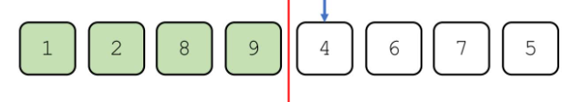
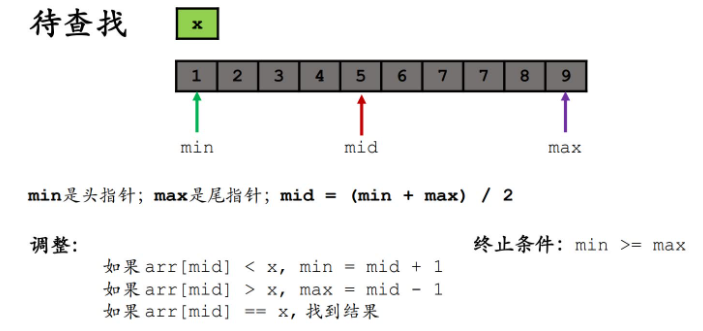
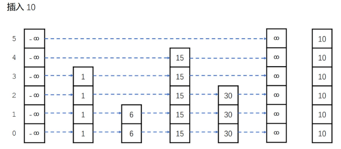
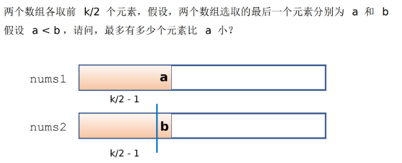
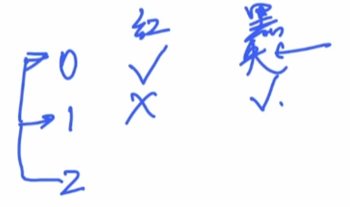
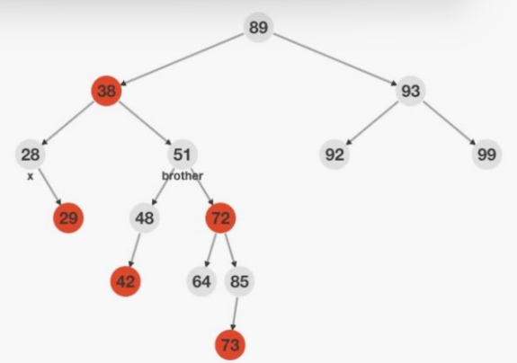
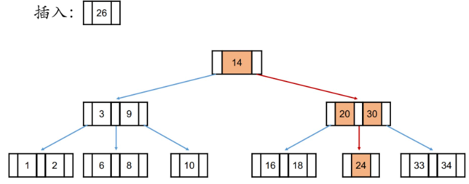
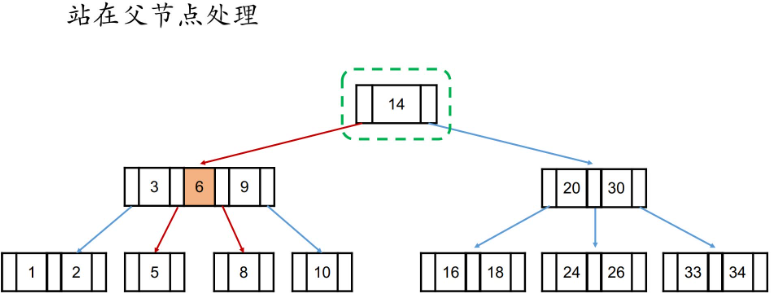
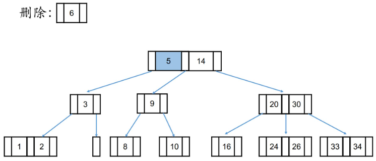

## 第六章 排序算法

//区间范围l  r **左闭右开**   （数组下标）      下面代码边界处会有一些问题

```c++
//这个是 0.sort_test.h
#ifndef _SORT_TEST_H
#define _SORT_TEST_H
 
#include <string.h>
 
#define SMALL_DATA_N 5000
#define BIG_DATA_N   1000000
 
__attribute__((constructor))
void __init_Rand__() {
    printf("init rand\n");
    srand(time(0));
}
 
bool check(int *arr, int l, int r) {
    for (int i = l + 1; i < r; i++) {
        if (arr[i] < arr[i - 1]) return false;
    }
    return true;
}
 
int *getRandData(int n) {
    int *arr = (int *)malloc(sizeof(int) * n);
    for (int i = 0; i < n; i++) arr[i] = rand() % 10000;
    return arr;
}
 
#define swap(a, b) { \
    __typeof(a) __c = a; \
    a = b, b = __c; \
}
 
#define TEST(func, arr, n) { \
    printf("Test %s : ", #func); \
    int *temp = (int *)malloc(sizeof(int) * n); \
    memcpy(temp, arr, sizeof(int) * n); \
    long long b = clock(); \
    func(temp, 0, n); \
    long long e = clock(); \
    if (check(temp, 0, n)) { \
        printf("\tOK "); \
    } else { \
        printf("Failed "); \
    } \
    printf(" %ditems %lldms\n", n, (e - b) * 1000 / CLOCKS_PER_SEC); \
    free(temp);\
}
 
#endif
```


### 1.堆排序

​                 详情见第五章“堆”

### 2.选择排序

$$
O(n) = (n*1)*n/2-->O(n^2/2)
$$

**1、将数组分成『已排序区』和『待排序区』**

**2、每⼀轮从『待排序区』中选择⼀个最小的元素放到『已排序区』的尾部**

**3、直到『待排序区』没有元素为⽌**


```C++
#include <stdio.h>
#include <stdlib.h>
#include <time.h>
#include "0.sort_test.h"
 
void selection_sort(int *arr, int l, int r) {//从小到大排序,当前数组待排序范围，l,r是数组的下标
    for (int i = l, I = r - 1; i < I; i++) {//这里的i = r-1意味着，如果待排序区间就剩一个元素的话，就不用排序了
        int ind = i;
        for (int j = i + 1; j < r; j++) {
            if (arr[j] < arr[ind]) ind = j;
        }
        swap(arr[i], arr[ind]);
    }
    return ;
}
 
int main() {
    int *arr = getRandData(SMALL_DATA_N);
    TEST(selection_sort, arr, SMALL_DATA_N);
    free(arr);
    return 0;
}


```

### 3.插入排序

$$
O(n) = \frac{(n*1)*n}{4}-->O(\frac{n^2}{4})
$$

**1、将数组分成『已排序区』和『待排序区』**

**2、将『已排序区』后面⼀个元素，向前插⼊到『已排序区』中**

**3、直到『待排序区』没有元素为⽌**



```C++
#include <stdio.h>
#include <stdlib.h>
#include <time.h>
#include "0.sort_test.h"
 
void insert_sort(int *arr, int l, int r) {
    for (int i = l + 1; i < r; i++) {//开始时，已排序部分只包含一个元素，即数组的第一个元素，因此外层循环应从第二个元素开始
        int j = i;
        while (j > l && arr[j] < arr[j - 1]) {//j>l是为了说明j前面还有元素或者说是前面的已经排好不能动了
            swap(arr[j], arr[j - 1]);
            j -= 1;
        }
    }
    return ;
}
int main() {
    int *arr = getRandData(SMALL_DATA_N);
    TEST(insert_sort, arr, SMALL_DATA_N);
    TEST(unguarded_insert_sort, arr, SMALL_DATA_N);
    free(arr);
    return 0;
}
```

插入排序可能是选择排序执行次数的一半。选择排序遍历多，插入排序交换多。所以底层cpu耗时可能插入排序更多一些


```C++
void unguarded_insert_sort(int *arr, int l, int r) {//插入排序优化算法
    //先把全局最小值放在第一位，然后再进行插入排序
    int ind = l;
    for (int i = l + 1; i < r; i++) {
        if (arr[i] < arr[ind]) ind = i;
    }//index指向了全局最小值
    //不能直接换成swap(arr[ind],arr[l])，因为插入排序算法具有稳定性？？？？
    while (ind > l) {
        swap(arr[ind], arr[ind - 1]);
        ind -= 1;
    }
    for (int i = l + 1; i < r; i++) {//为了去掉j>l的这个判断条件
        int j = i;
        while (arr[j] < arr[j - 1]) {
            swap(arr[j], arr[j - 1]);
            j -= 1;
        }
    }//对于一个随机序列而言，它的逆序数的范围应该在n方量级，原来那个判断条件进行了n方的量级。所以节省了O(N^2)-O（N）的时间复杂度
    return ;
}
```

### 4.希尔排序 

​                  **（分组插入排序）**

**1、设计⼀个【步长】序列**

**2、按照步长，对序列进⾏分组，每组采用插⼊排序**

**3、直到执⾏到步长为1为⽌**


```C++
/*************************************************************************
    > File Name: 3.shell_sort.cpp
    > Author: huguang
    > Mail: hug@haizeix.com
    > Created Time: 
 ************************************************************************/
 
#include <stdio.h>
#include <stdlib.h>
#include <time.h>
#include "0.sort_test.h"
 
void unguarded_insert_sort(int *arr, int l, int r, int step) {///无监督的插入排序  
    int ind = l;
    for (int i = l + step; i < r; i += step) {
        if (arr[i] < arr[ind]) ind = i;
    }
    while (ind > l) {
        swap(arr[ind], arr[ind - step]);
        ind -= step;
    }
    for (int i = l + 2 * step; i < r; i += step) {//为了在初始的插入排序步骤中加快元素的调整过程，从而在整个排序过程中提高效率
        int j = i;
        while (arr[j] < arr[j - step]) {
            swap(arr[j], arr[j - step]);
            j -= step;
        }
    }
    return ;
}
void shell_sort(int *arr, int l, int r) {
    int k = 2, n = (r - l), step;
    do {
        step = n / k == 0 ? 1 : n / k;//这里是计算步长
        for (int i = l, I = l + step; i < I; i++) {//这里是分组！
            unguarded_insert_sort(arr, i, r, step);
        }
        k *= 2;//希尔增量
    } while (step != 1);
    return ;
}
 
void shell_sort_hibbard(int *arr, int l, int r) {//HIBBARD增量序列的希尔排序
    int step = 1, n = (r - l);
    while (step <= n / 2) step = step * 2 + 1;
    do {
        step /= 2;//注意！！！
        for (int i = l, I = l + step; i < I; i++) {
            unguarded_insert_sort(arr, i, r, step);
        }
    } while (step > 1);
    return ;
}
 
int main() {
    int *arr = getRandData(BIG_DATA_N);
    TEST(shell_sort,         arr, BIG_DATA_N);
    TEST(shell_sort_hibbard, arr, BIG_DATA_N);
    free(arr);
    return 0;
}
```

增量序列设计：
希尔排序的效率和【步长序列】紧密

相关参考时间复杂度：
$$
O(nlogn)-O(n2)
$$

$$
最坏的时间复杂度O(n^2)  -希尔增量序列：\frac{n}{2}、\frac{n}{4}、\frac{n}{8}、\frac{n}{16}……
$$

$$
最坏的时间复杂度O(n^{1.5})-Hibbard增量序列：1、3、7…2k-1
$$


### 5.冒泡排序

**1、将数组分成『已排序区』和『待排序区』**

**2、从头到尾扫描『待排序区』，若前面元素比后面元素⼤，则交换**

**3、每⼀轮都会将『待排序区』中最⼤的放到『已排序区』的开头**

**4、直到『待排序区』没有元素为⽌**


```c++
#include <stdio.h>
#include <stdlib.h>
#include "0.sort_test.h"
 //冒泡的优化
void bubble_sort(int *arr, int l, int r) {
    for (int i = r - 1, I = l + 1, cnt; i >= I; i--) {//将最大值放在哪一位上
        cnt = 0;
        for (int j = l; j < i; j++) {
            if (arr[j] <= arr[j + 1]) continue;//扫描的时候没有发生任何一次交换
            swap(arr[j], arr[j + 1]);
            cnt += 1;
        }
        if (cnt == 0) break;//本轮扫描没有任何一次交换，就说明本身就是有序的了，直接跳出循环
    }
    return ;
}
 
int main() {
    int *arr = getRandData(SMALL_DATA_N);
    TEST(bubble_sort, arr, SMALL_DATA_N);
    free(arr);
    return 0;
}
```


### 6.快速排序

$$
时间复杂度：O(nlogn)--O(n^2)
$$


```c++
#include <stdio.h>
#include <stdlib.h>
#include "0.sort_test.h"
 
void quick_sort(int *arr, int l, int r) {//递归处理  从小到大
    if (r - l <= 2) {//剩两个元素比较大小交换，剩一个元素不用管直接返回
        if (r - l <= 1) return ;
        if (arr[l] > arr[l + 1]) swap(arr[l], arr[l + 1]);
        return ;
    }
    // partition
    int x = l, y = r - 1, z = arr[l];//头指针，尾指针，基准值
    while (x < y) {
        while (x < y && z <= arr[y]) --y;
        if (x < y) arr[x++] = arr[y];//表示尾部指针找到了一个应该放在前面的元素
        while (x < y && arr[x] <= z) ++x;
        if (x < y) arr[y--] = arr[x];//表示头部指针找到了一个应该放在后面的元素
    }//尾指针向前，头指针向后，直到二者相遇
    arr[x] = z;
    quick_sort(arr, l, x);
    quick_sort(arr, x, r);//对于区间的理解，运用递归！！！
    return ;
}
 
void quick_sort_v1(int *arr, int l, int r) {//优化1
    if (r - l <= 2) {
        if (r - l <= 1) return ;
        if (arr[l] > arr[l + 1]) swap(arr[l], arr[l + 1]);
        return ;
    }
    // partition
    int x = l, y = r - 1, z = arr[l];
    do {
        while (arr[x] < z) ++x;
        while (arr[y] > z) --y;
        if (x <= y) {
            swap(arr[x], arr[y]);
            ++x, --y;
        }
    } while (x <= y);    
    quick_sort(arr, l, x);
    quick_sort(arr, x, r);
    return ;
}
 
inline int three_point_select(int a, int b, int c) {//三点取中法，选择基准值的过程
    if (a > b) swap(a, b);
    if (a > c) swap(a, c);
    if (b > c) swap(b, c);
    return b;
}
 
void quick_sort_v2(int *arr, int l, int r) {//优化2，在基准值的选择上做文章
    if (r - l <= 2) {
        if (r - l <= 1) return ;
        if (arr[l] > arr[l + 1]) swap(arr[l], arr[l + 1]);
        return ;
    }
    // partition
    int x = l, y = r - 1;
    int z = three_point_select(
        arr[l], 
        arr[r - 1], 
        arr[(l + r) / 2]
    );
    do {
        while (arr[x] < z) ++x;
        while (arr[y] > z) --y;
        if (x <= y) {
            swap(arr[x], arr[y]);
            ++x, --y;
        }
    } while (x <= y);    
    quick_sort(arr, l, x);
    quick_sort(arr, x, r);
    return ;
}
 
void quick_sort_v3(int *arr, int l, int r) {//优化3，减少递归执行次数。单边递归法！ 大数据
    if (r - l <= 2) {
        if (r - l <= 1) return ;
        if (arr[l] > arr[l + 1]) swap(arr[l], arr[l + 1]);
        return ;
    }
    while (l < r) {
        // partition
        int x = l, y = r - 1;
        int z = three_point_select(
            arr[l], 
            arr[r - 1], 
            arr[(l + r) / 2]
        );
        do {
            while (arr[x] < z) ++x;
            while (arr[y] > z) --y;
            if (x <= y) {
                swap(arr[x], arr[y]);
                ++x, --y;
            }
        } while (x <= y);    
        quick_sort(arr, l, x); // left，左半边递归调用
        l = x;//右半边相当于循环处理来减少递归调用过程
    }
    return ;
}
 
#define threshold 16//阈值，如果超过16就是快排，小于16我们就可以进行插入排序
 
void unguarded_insert_sort(int *arr, int l, int r) {
    int ind = l;
    for (int i = l + 1; i < r; i++) {
        if (arr[i] < arr[ind]) ind = i;
    }
    while (ind > l) {
        swap(arr[ind], arr[ind - 1]);
        ind -= 1;
    }
    for (int i = l + 1; i < r; i++) {
        int j = i;
        while (arr[j] < arr[j - 1]) {
            swap(arr[j], arr[j - 1]);
            j -= 1;
        }
    }
    return ;
}
 
void __quick_sort_v4(int *arr, int l, int r) {//小数据的情况，我们可以直接变成递归
    while (r - l > threshold) {
        // partition
        int x = l, y = r - 1;
        int z = three_point_select(
            arr[l], 
            arr[r - 1], 
            arr[(l + r) / 2]
        );
        do {
            while (arr[x] < z) ++x;
            while (arr[y] > z) --y;
            if (x <= y) {
                swap(arr[x], arr[y]);
                ++x, --y;
            }
        } while (x <= y);    
        __quick_sort_v4(arr, l, x); // left
        l = x;
    }
    return ;
}
 
void quick_sort_v4(int *arr, int l, int r) {
    __quick_sort_v4(arr, l, r);
    unguarded_insert_sort(arr, l, r);//区中元素有序，最后就进行无监督的插入排序即可
    return ;
}
 
int main() {
    int *arr_s = getRandData(SMALL_DATA_N);
    int *arr_b = getRandData(BIG_DATA_N);
    TEST(quick_sort, arr_s, SMALL_DATA_N);
    TEST(quick_sort, arr_b, BIG_DATA_N);
    TEST(quick_sort_v1, arr_b, BIG_DATA_N);
    TEST(quick_sort_v2, arr_b, BIG_DATA_N);
    TEST(quick_sort_v3, arr_b, BIG_DATA_N);
    TEST(quick_sort_v4, arr_b, BIG_DATA_N);
    free(arr_s);
    free(arr_b);
    return 0;
}
```


### 7.归并排序

$$
O(n) = nlogn
$$


```c++
#include <stdio.h>
#include <stdlib.h>
#include "0.sort_test.h"
//分治+归并
int *buff;//这样可以节省反复开辟空间的过程
void merge_sort(int *arr, int l, int r) {
    if (r - l <= 1) return ;
    int mid = (l + r) / 2;
    merge_sort(arr, l, mid);
    merge_sort(arr, mid, r);//递归进行分治处理
    // merge
    int p1 = l, p2 = mid, k = 0;
    while (p1 < mid || p2 < r) {
        if (p2 == r || (p1 < mid && arr[p1] <= arr[p2])) {//第二个数组满了或者第一个数组对应元素值小于第二个数组
            buff[k++] = arr[p1++];
        } else {
            buff[k++] = arr[p2++];
        }
    }//buff数组是结果数组
    for (int i = l; i < r; i++) arr[i] = buff[i - l];//最后拷贝回去
    return ;
}
 
int main() {
    int *arr_s = getRandData(SMALL_DATA_N);
    int *arr_b = getRandData(BIG_DATA_N);
    buff = (int *)malloc(sizeof(int) * BIG_DATA_N);
    TEST(merge_sort, arr_s, SMALL_DATA_N);
    TEST(merge_sort, arr_b, BIG_DATA_N);
    free(arr_s);
    free(arr_b);
    free(buff);
    return 0;
}
```


### 8.基数排序

**相同数字相对位置不变**


**对个位排序**


**对十位排序**

 

```c++
#include <stdio.h>
#include <stdlib.h>
#include "0.sort_test.h"
 
void radix_sort(int *arr, int l, int r) {
    #define K 65536
    int *cnt  = (int *)malloc(sizeof(int) * K);
    int *temp = (int *)malloc(sizeof(int) * (r - l));
    // round 1
    memset(cnt, 0, sizeof(int) * K);
    for (int i = l; i < r; i++) cnt[arr[i] % K] += 1;
    for (int i = 1; i < K; i++) cnt[i] += cnt[i - 1];
    for (int i = r - 1; i >= l; i--) temp[--cnt[arr[i] % K]] = arr[i];
    memcpy(arr + l, temp, sizeof(int) * (r - l));
    // round 2
    memset(cnt, 0, sizeof(int) * K);
    for (int i = l; i < r; i++) cnt[arr[i] / K] += 1;
    for (int i = 1; i < K; i++) cnt[i] += cnt[i - 1];
    for (int i = r - 1; i >= l; i--) temp[--cnt[arr[i] / K]] = arr[i];
    memcpy(arr + l, temp, sizeof(int) * (r - l));
    return ;
}
 
int main() {
    int *arr_s = getRandData(SMALL_DATA_N);
    int *arr_b = getRandData(BIG_DATA_N);
    TEST(radix_sort, arr_s, SMALL_DATA_N);
    TEST(radix_sort, arr_b, BIG_DATA_N);
    free(arr_s);
    free(arr_b);
    return 0;
}
```


### 9.排序算法总结

**稳定性：相同值的元素的相对顺序是否改变**


**内部排序还是外部排序：是否使用到了额外的存储空间**

所以上述排序过程中：外部排序-->可以使用硬盘空间-->**可以对更大的数据进行排序**
**归并排序（两个有序数组合并成一个数组）** 
**基数排序（原数组的结果整理到新的数组当中）**


### 10.C++ sort使用方法和技巧

```c++
#include <iostream>
#include <cstdio>
#include <cstdlib>
#include <queue>
#include <stack>
#include <algorithm>
#include <string>
#include <map>
#include <set>
#include <vector>
#include "0.sort_test.h"
using namespace std;
 
void output(int *arr, int n, const char *s = "arr");
template<typename T>//模板
void output(vector<T> &arr);
 
void test1() {//对数组
    printf("\ntest array : \n");
    // sort array
    int *arr = getRandData(10);
    output(arr, 10);
    sort(arr, arr + 10); // [)
    output(arr, 10);
    sort(arr, arr + 10, greater<int>());//正常是从小到大排序，然后加一个greater<int>()，就是从大到小排序
    output(arr, 10);
    free(arr);   
    return ;
}
 
void test2() {//对动态数组
    printf("\ntest vector : \n");
    // sort vector
    vector<int> arr;
    for (int i = 0; i < 10; i++) arr.push_back(rand() % 10000);
    output(arr);
    sort(arr.begin(), arr.end());
    output(arr);
    sort(arr.begin(), arr.end(), greater<int>());
    output(arr);
    return ;
}
 
struct Data {
    int x, y;
};
 
ostream &operator<<(ostream &out, const Data &d) {
    out << "(" << d.x << ", " << d.y << ")";
    return out;
}
 
bool cmp(const Data &a, const Data &b) {
    if (a.x != b.x) return a.x < b.x;
    return a.y > b.y;
}
 
void test3() {
    printf("\ntest my data structure : \n");
    vector<Data> arr;//传结构体或者类
    for (int i = 0; i < 10; i++) {
        Data d;
        d.x = rand() % 10, d.y = rand() % 10;
        arr.push_back(d);
    }
    output(arr);
    sort(arr.begin(), arr.end(), cmp);
    output(arr);
    return ;
}
 
void test4() {
    printf("\ntest sort ind : \n");
    int *arr = getRandData(10);//不对arr排序，但是可以对下标数组排序
    int *ind = getRandData(10);
    for (int i = 0; i < 10; i++) ind[i] = i;
    output(arr, 10);
    sort(ind, ind + 10, [&](int i, int j) -> bool {//lambda表达式
        return arr[i] < arr[j];
    });
    output(arr, 10);
    output(ind, 10, "ind");
    return ;
}
 
int main() {
    test1();
    test2();
    test3();
    test4();
    return 0;
}
 
template<typename T>
void output(vector<T> &arr) {
    printf("arr[%lu] = ", arr.size());
    for (int i = 0; i < arr.size(); i++) {
        cout << arr[i] << " ";
    }
    printf("\n");
    return ;
}
 
void output(int *arr, int n, const char *s) {
    printf("%s[%d] = ", s, n);
    for (int i = 0; i < n; i++) {
        printf("%d ", arr[i]);
    }
    printf("\n");
    return ;
}
```


### 经典例题

1.两数之和（leetcode 01）  双指针！！！ 

  


```c++
class Solution {//上图是杨氏矩阵
public:
    vector<int> twoSum(vector<int>& nums, int target) {
        int n = nums.size();
        vector<int> ind(n);//Ind（n）是下标数组
        for (int i = 0; i < n; i++) ind[i] = i;
        sort(ind.begin(), ind.end(), [&](int i, int j) -> bool {
            return nums[i] < nums[j];
        });
        int p1 = 0, p2 = n - 1;
        while (nums[ind[p1]] + nums[ind[p2]] != target) {
            if (nums[ind[p1]] + nums[ind[p2]] < target) p1 += 1;
            else p2 -= 1;
        }
        vector<int> ret(2);//这是结果数组
        ret[0] = ind[p1], ret[1] = ind[p2];
        if (ret[0] > ret[1]) swap(ret[0], ret[1]);
        return ret;
    }
};
```

2.排序链表（leetcode 148）   ！！！！


```c++
/**
 * Definition for singly-linked list.
 * struct ListNode {
 *     int val;
 *     ListNode *next;
 *     ListNode() : val(0), next(nullptr) {}
 *     ListNode(int x) : val(x), next(nullptr) {}
 *     ListNode(int x, ListNode *next) : val(x), next(next) {}
 * };
 */
class Solution {//方法一是快速排序
public:
    ListNode* sortList(ListNode* head) {
        if (head == NULL) return head;
        int l = head->val, r = head->val, z;
        ListNode *p = head, *h1 = NULL, *h2 = NULL, *q;
        while (p) l = min(p->val, l), r = max(p->val, r), p = p->next;//找到链表中的最大值和最小值
        z = (l + r) >> 1;//左移符号，向下取整。/这是向零取整，基准值！！！因为是快速排序
        
        //向上取整：比自己大的最小整数；向下取整：比自己小的最大整数；四舍五入：更接近自己的整数；
        
        if (l == r) return head;//特殊判断，表明链表中每个元素都是相同的，可以不用排序
        p = head;
        while (p) {
            q = p->next;//头插法
            if (p->val <= z) {
                p->next = h1;
                h1 = p;//分配到第一个链表中
            } else {
                p->next = h2;
                h2 = p;
            }
            p = q;//这里是p指向下一个元素
        }//这里相当于是完成了分区操作
        h1 = sortList(h1);
        h2 = sortList(h2);
        p = h1;
        while (p->next) p = p->next;
        p->next = h2;//合并两个有序链表
        return h1;
    }
};
```

```c++
class Solution {//方法二是归并排序
public:
    int getLength(ListNode *head) {
        int n = 0;
        while (head) n += 1, head = head->next;
        return n;
    }
    ListNode *merge_sort(ListNode *head, int n) {
        if (n <= 1) return head;
        int l = n / 2, r = n - l;//左边和右边
        ListNode *p = head, *p1, *p2, ret;
        for (int i = 1; i < l; i++) p = p->next;
        p1 = head; p2 = p->next;//这里要复习啊
        p->next = NULL;
        p1 = merge_sort(p1, l);
        p2 = merge_sort(p2, r);//分治
        
        p = &ret; ret.next = NULL;
        while (p1 || p2) {
            if (p2 == NULL || (p1 && p1->val <= p2->val)) {
                p->next = p1;
                p = p1;
                p1 = p1->next;
            } else {
                p->next = p2;
                p = p2;
                p2 = p2->next;
            }
        }
        return ret.next;
    }
    ListNode* sortList(ListNode* head) {
        int n = getLength(head);
        return merge_sort(head, n);
    }
};
```

3.合并两个有序数组(leetcode 88)
  给你两个按 **非递减顺序** 排列的整数数组 `nums1` 和 `nums2`，另有两个整数 `m` 和 `n` ，分别表示 `nums1` 和 `nums2` 中的元素数目。请你 **合并** `nums2` 到 `nums1` 中，使合并后的数组同样按 **非递减顺序** 排列。**注意：**最终，合并后数组不应由函数返回，而是存储在数组 `nums1` 中。为了应对这种情况，`nums1` 的初始长度为 `m + n`，其中前 `m` 个元素表示应合并的元素，后 `n` 个元素为 `0` ，应忽略。`nums2` 的长度为 `n` 。


```c++
class Solution {
public:
    void merge(vector<int>& nums1, int m, vector<int>& nums2, int n) {
        int p1 = m - 1, p2 = n - 1, k = m + n - 1;
        while (p1 != -1 || p2 != -1) {
            if (p2 == -1 || (p1 != -1 && nums1[p1] >= nums2[p2])) {
                nums1[k--] = nums1[p1--];
            } else {
                nums1[k--] = nums2[p2--];
            }
        }
        return ;
    }
};
```

4.合并两个有序链表（leetcode 21）


```c++
/**
 * Definition for singly-linked list.
 * struct ListNode {
 *     int val;
 *     ListNode *next;
 *     ListNode() : val(0), next(nullptr) {}
 *     ListNode(int x) : val(x), next(nullptr) {}
 *     ListNode(int x, ListNode *next) : val(x), next(next) {}
 * };
 */
class Solution {
public:
    ListNode* mergeTwoLists(ListNode* list1, ListNode* list2) {
        ListNode ret, *p = &ret;
        while (list1 || list2) {
            if (list2 == NULL || (list1 && list1->val <= list2->val)) {
                p->next = list1;
                list1 = list1->next;
                p = p->next;
            } else {
                p->next = list2;
                list2 = list2->next;
                p = p->next;
            }
        }
        return ret.next;
    }
};
```

5.寻找两个正序数组的中位数(leetcode 4)

给定两个大小分别为 `m` 和 `n` 的正序（从小到大）数组 `nums1` 和 `nums2`。请你找出并返回这两个正序数组的 **中位数** 。算法的时间复杂度应该为 `O(log (m+n))` 。

```c++
class Solution {
public:
    double findMedianSortedArrays(vector<int>& nums1, vector<int>& nums2) {
        int n = nums1.size(), m = nums2.size();
        vector<int> temp(n + m);
        int p1 = 0, p2 = 0, k = 0;
        while (p1 < n || p2 < m) {
            if (p2 == m || (p1 < n && nums1[p1] <= nums2[p2])) {
                temp[k++] = nums1[p1++];
            } else {
                temp[k++] = nums2[p2++];
            }
        }
        double a = temp[(n + m) /2], b = temp[(n + m) /2];
        if ((n + m) % 2 == 0) b = temp[(n + m) /2 - 1];//b指向a的前一个元素
        return (a + b) / 2.0;
    }
};
```

6.存在重复元素2（leetcode219）


```c++
class Solution {
public:
    bool containsNearbyDuplicate(vector<int>& nums, int k) {
        int n = nums.size();
        vector<int> ind(n);
        for (int i = 0; i < n; i++) ind[i] = i;
        sort(ind.begin(), ind.end(), [&](int i, int j) -> bool {
            if (nums[i] != nums[j]) return nums[i] < nums[j];
            return i < j;
        });
        for (int i = 0, I = n - 1; i < I; i++) {
            if (nums[ind[i]] - nums[ind[i + 1]]) continue;
            if (ind[i + 1] - ind[i] <= k) return true;
        }
        return false;
    }
};
```


## 第七章 查找算法

### 1.二分算法

最多进行log2n 次   O（logn）



**举例子：**


**中心指针指向0的时候如何操作；**

**中心指针指向1的时候如何操作；**

**头尾指针指向交叉处的时候会不会出现Bug.（P1找1，P2找0）**


### 二分查找中的数组和函数的关系

时间换空间，空间换时间！数组和函数本质上没有区别（P2是判断可以用二分算法思想的条件）


```c++
#include <iostream>
#include <vector>
using namespace std;
 
void output(int *arr, int n, int ind = -1) {
   int len = 0;
    for (int i = 0; i < n; i++) {
        len += printf("%4d", i);//回顾printf的返回值
    }
    printf("\n");
    for (int i = 0; i < len; i++) printf("-");//输出等长的分割线！！！！！
    printf("\n");
    for (int i = 0; i < n; i++) {
        if (i == ind) printf("\033[1;32m");
        printf("%4d", arr[i]);
        if (i == ind) printf("\033[0m");
    }
    printf("\n");
    return ;
}
 
int binary_search(int *arr, int n, int x) {//二分查找
    int head = 0, tail = n - 1, mid;
    while (head <= tail) {
        mid = (head + tail) / 2;
        printf("[%d, %d], mid = %d, arr[%d] = %d\n", 
            head, tail, mid,
            mid, arr[mid]
        );
        if (arr[mid] == x) return mid;
        if (arr[mid] < x) head = mid + 1;
        else tail = mid - 1;
    }
    return -1;
}

void test_binary_search(int n) {
    int *arr = (int *)malloc(sizeof(int) * n);
    arr[0] = rand() % 10;
    for (int i = 1; i < n; i++) arr[i] = arr[i - 1] + rand() % 10;//随机有序数组的建立
    output(arr, n);
    int x;
    while (~scanf("%d", &x)) {
        if (x == -1) break;//x等于-1的时候就退出
        int ind = binary_search(arr, n, x);//查找x
        output(arr, n, ind);
    }
    free(arr);
    return ;
}
 
int main() {
    #define MAX_N 10
    test_binary_search(MAX_N);
    test_binary_algorithm();
    return 0;
}

```


符合二分算法，f(x)单调，并且x->y简单，y->x有点难

```c++
void test_binary_algorithm() {//这个应用特别重要
    printf("\ntest binary algorithm\n");
    double y;
    while (~scanf("%lf", &y)) {
        if (y < 0) break;
        double x = bineary_algorithm(y);
        printf("f(%.2lf) = %.2lf\n", x, y);
    }
    return ;
}

double bineary_algorithm(double y) {//税后工资y
    double head = 0, tail = 1000000, mid;
    while (tail - head >= EXP) {
        mid = (head + tail) / 2.0;
        printf("[%lf, %lf], mid = %lf, arr[%lf] = %lf\n", 
            head, tail, mid,
            mid, f(mid)
        );
        if (f(mid) < y) head = mid;
        else tail = mid;
    }
    return head;//找到了！！！
}
#define EXP 1e-4
#define min(a, b) ((a) < (b) ? (a) : (b))
 
double f(double x) {//通过税前找税后
    if (x >= 0)     x -= min(x, 3000) * 0.03;
    if (x > 3000)   x -= (min(x, 12000) - 3000) * 0.1;
    if (x > 12000)  x -= (min(x, 25000) - 12000) * 0.2;
    if (x > 25000)  x -= (min(x, 35000) - 25000) * 0.25;
    if (x > 35000)  x -= (min(x, 55000) - 35000) * 0.3;
    if (x > 55000)  x -= (min(x, 80000) - 55000) * 0.35;
    if (x > 80000)  x -= (x - 80000) * 0.45;
    return x;
}
```

### 2.跳跃表

**跳跃表本身会维护跳跃表的有序性，每个高度都不同**


**跳跃表查找操作**（下一位的值与要查找的值进行比较，要是下一个值比较大向下走，反之向右走）


**跳跃表插入操作**



```c++
#include <stdio.h>
#include <stdlib.h>
#include <string.h>
#include <inttypes.h>
#include <time.h>
 
typedef struct Node {
    int key, level;
    struct Node *next, *down, *up;
} Node;
 
 
typedef struct Skiplist {//跳跃表
    Node *head, *tail;
    int max_level;
} Skiplist;
 
Node *getNewNode(int key, int n) {//封装成每一摞结点，n是层的数目
    Node *nodes = (Node *)malloc(sizeof(Node) * n);
    for (int i = 0; i < n; i++) {
        nodes[i].key = key;
        nodes[i].level = i;
        nodes[i].next = NULL;
        nodes[i].down = (i ? nodes + (i - 1) : NULL);//连接下一个，所以是n-1
        nodes[i].up = (i + 1 < n ? nodes + (i + 1) : NULL);//连接上一个结点，所以是n+1
    }
    return nodes + n - 1;//返回最上层结点地址
}
 
Skiplist *getNewSkiplist(int n) {//形成跳跃表
    Skiplist *s = (Skiplist *)malloc(sizeof(Skiplist));
    s->head = getNewNode(INT32_MIN, n);//32整形的最小值
    s->tail = getNewNode(INT32_MAX, n);//32整形的最大值
    s->max_level = n;
    Node *p = s->head, *q = s->tail;
    while (p) {
        p->next = q;
        p = p->down, q = q->down;
    }
    while (s->head->level != 0) s->head = s->head->down;
    return s;
}
 
Node *find(Skiplist *s, int x) {
    Node *p = s->head;
    while (p && p->key != x) {
        if (p->next->key <= x) p = p->next;
        else p = p->down;
    }
    return p;
}
 
double randDouble() {
    #define MAX_RAND_N 1000000
    return (rand() % MAX_RAND_N) * 1.0 / MAX_RAND_N;
    #undef MAX_RAND_N
}
 
int randLevel(Skiplist *s) {//层数越高，概率越低
    int level = 1;
    double p = 1.0 / 2.0;
    while (randDouble() < p) level += 1;
#define min(a, b) ((a) < (b) ? (a) : (b))
    return min(s->max_level, level);
#undef min
}
 
void insert(Skiplist *s, int x) {
    int level = randLevel(s);
    printf("rand level = %d\n", level);
    while (s->head->level + 1 < level) s->head = s->head->up;//层号从0开始，level从1开始
    Node *node = getNewNode(x, level);
    Node *p = s->head;
    printf("insert begin\n");
    fflush(stdout);
    while (p->level != node->level) p = p->down;
    while (p) {
        while (p->next->key < node->key) p = p->next;//这时候p指的结点就是Node要去的结点的前一位
        node->next = p->next;
        p->next = node;
        p = p->down;
        node = node->down;
    }
    return ;
}

void clearNode(Node *p) {
    if (p == NULL) return ;
    free(p);
    return ;
}
 
void clearSkiplist(Skiplist *s) {
    Node *p = s->head;
    while(p){
        Node *q = p->next;
        while(q){
            Node *temp = q->next;
            clearNode(q);
            q = temp;
        }
        Node *temp = p->down;
        clearNode(p);
        p = temp;        
    }
    free(s);
    return ;
}
 
void output(Skiplist *s) {
    Node *p = s->head;
    int len = 0;
    for (int i = 0; i <= s->head->level; i++) {
        len += printf("%4d", i);
    }
    printf("\n");
    for (int i = 0; i < len; i++) printf("-");
    printf("\n");
    while (p->level > 0) p = p->down;
    while (p) {
        bool flag = (p->key != INT32_MIN && p->key != INT32_MAX);
        for (Node *q = p; flag && q; q = q->up) {
            printf("%4d", q->key);
        }
        if (flag) printf("\n");
        p = p->next;
    }
    return ;
}
 
int main() {
    srand(time(0));
    int x;
#define MAX_LEVEL 32
    Skiplist *s = getNewSkiplist(MAX_LEVEL);
#undef MAX_LEVEL
    // insert
    while (~scanf("%d", &x)) {
        if (x == -1) break;
        insert(s, x);
        output(s);
    }
    output(s);
    // find
    while (~scanf("%d", &x)) {
        Node *p = find(s, x);
        printf("find result : ");
        if (p) {
            printf("key = %d, level = %d\n", p->key, p->level);
        } else {
            printf("NULL\n");
        }
    }
    clearSkiplist(s);
    return 0;
}

```


### 3.哈希表（unordered_map）和布隆过滤器

#### 哈希表（效率最高）


哈希表处理冲突的方法：1.开放定址法 2.再哈希法3.建立公共溢出区4.链式地址法（拉链法）

**1.开放定址法** 


**2.再哈希法（不常用）**


**3.建立公共溢出区**


4.链式地址法（拉链法）

**实际工程中：外层是哈希表，内层每个结点是个红黑树，外层O(1)，内层具体到某个位置是O(logn)**


**传统哈希表**：存储空间与元素数量有关

**布隆过滤器**：存储空间与元素数量无关 **应用：网络爬虫->需要一个记录查过的地址的存储结构**

#### 布隆过滤器

“1”被标记过，“0”没被标记过，某个元素通过三个哈希函数形成的值，然后1越多，越可能被标记过。
都是0，一定没出现过.如果出现过，也都是概率性问题，大概率出现过。如何减少误判---增加布隆过滤器底层存储的空间


```c++
#include <stdio.h>
#include <stdlib.h>
#include <string.h>
#include <time.h>
 
#define swap(a, b) { \
    __typeof(a) __c = a; \
    a = b, b = __c; \
}
 //拉链法---数组套数组？？？
typedef struct Node {
    char *s;
    struct Node *next;
} Node;//这里就是
 
typedef struct HashTable {
    Node *data;//底层有个数组
    int cnt, size;
} HashTable;
 
void expand(HashTable *h);
void clearHashTable(HashTable *h);
 
Node *getNewNode(const char *s) {
    Node *p = (Node *)malloc(sizeof(Node));
    p->s = strdup(s);//复制一份
    p->next = NULL;
    return p;
}
 
HashTable * getNewHashTable(int n) {
    HashTable *h = (HashTable *)malloc(sizeof(HashTable));
    h->data = (Node *)malloc(sizeof(Node) * n);
    h->size = n;
    h->cnt = 0;
    return h;
}
 
int hash_func(const char *s) {
    int seed = 131, h = 0;
    for (int i = 0; s[i]; i++) {
        h = h * seed + s[i];
    }
    return h & 0x7fffffff;
}
 
bool find(HashTable *h, const char *s) {
    int hcode = hash_func(s), ind = hcode % h->size;//通过某个字符串去获得所对应的哈希值，在通过哈希函数获得存储的位置
    Node *p = h->data[ind].next;
    while (p) {
        if (strcmp(p->s, s) == 0) return true;//strcmp()函数是判断字符串是否匹配
        p = p->next;
    }
    return false;
}
 
 
bool insert(HashTable *h, const char *s) {
    if (h->cnt >= h->size * 2) {//每次超2倍才进行扩容操作
        expand(h);//扩容操作
    }
    int hcode = hash_func(s), ind = hcode % h->size;
    Node *p = getNewNode(s);
    p->next = h->data[ind].next;//头插法 ，也就是虚拟头结点的后面
    h->data[ind].next = p;
    h->cnt += 1;
    return true;
}
 
void swapHashTable(HashTable *h1, HashTable *h2) {
    swap(h1->data, h2->data);
    swap(h1->cnt,  h2->cnt);
    swap(h1->size, h2->size);
    return ;
}
 
void expand(HashTable *h) {//这个扩容很有趣
    printf("expand Hash Table %d -> %d\n", h->size, h->size * 2);
    HashTable *new_h = getNewHashTable(h->size * 2);
    for (int i = 0; i < h->size; i++) {
        Node *p = h->data[i].next;
        while (p) {
            insert(new_h, p->s);
            p = p->next;
        }
    }
    swapHashTable(h, new_h);//新哈希表变成原来的哈希表
    clearHashTable(new_h);
    return ;
}
 
void clearNode(Node *p) {
    if (p == NULL) return ;
    if (p->s) free(p->s);
    free(p);
    return ;
}
 
void clearHashTable(HashTable *h) {
    if (h == NULL) return ;
    for (int i = 0; i < h->size; i++) {
        Node *p = h->data[i].next, *q;//上方的那个链表，头结点不存东西的  
        while (p) {
            q = p->next;
            clearNode(p);
            p = q;
        }
    }
    free(h->data);//哈希表数据存储区的空间
    free(h);//回收掉哈希表
    return ;
}
 
void output(HashTable *h) {
    printf("\n\nHash Table(%d / %d) : \n", h->cnt, h->size);
    for (int i = 0; i < h->size; i++) {
        printf("%d : ", i);
        Node *p = h->data[i].next;
        while (p) {
            printf("%s -> ", p->s);
            p = p->next;
        }
        printf("\n");
    }
    return ;
}
 
int main() {
    srand(time(0));
    char s[100];
    #define MAX_N 2
    HashTable *h = getNewHashTable(MAX_N);
    while (~scanf("%s", s)) {//不断的读入字符串
        if (strcmp(s, "end") == 0) break;
        insert(h, s);
    }
    output(h);//展示哈希表
    while (~scanf("%s", s)) {
        printf("find(%s) = %d\n", s, find(h, s));
    }
    #undef MAX_N
    return 0;
}
```

### 经典例题

1.两数之和（再学）


```c++
class Solution {
public:
    vector<int> twoSum(vector<int>& nums, int target) {
        unordered_map<int, int> h;//STL的哈希表，哈希表的值和原始数据中的那个下标编号
        vector<int> ret(2);//结果数组
        for (int i = 0, I = nums.size(); i < I; i++) {
            if (h.find(target - nums[i]) != h.end()) {//h.find（）这个，查找哈希表的值，要是找到了就返回一个迭代器，如果找不到会返回h.end()这个值
                ret[0] = h[target - nums[i]];//哈希表中所对应的那个值
                ret[1] = i;//当前数字
                break;
            }
            h[nums[i]] = i;
        }
        return ret;
    }
};

class Solution {//二分查找
public:
    int binary_search(vector<int> &nums, vector<int> &ind, int b, int x) {
        int head = b, tail = nums.size() - 1, mid;
        while (head <= tail) {
            mid = (head + tail) / 2;
            if (nums[ind[mid]] == x) return mid;
            if (nums[ind[mid]] < x) head = mid + 1;
            else tail = mid - 1;
        }
        return -1;
    }
    vector<int> twoSum(vector<int>& nums, int target) {
        int n = nums.size();
        vector<int> ind(n, 0);
        for (int i = 0; i < n; i++) ind[i] = i;
        sort(ind.begin(), ind.end(), [&](int i, int j) -> bool {
            return nums[i] < nums[j];
        });
        vector<int> ret(2);
        for (int i = 0; i < n; i++) {
            int j = binary_search(nums, ind, i + 1, target - nums[ind[i]]);
            if (j == -1) continue;
            ret[0] = ind[j];
            ret[1] = ind[i];
        }
        if (ret[0] > ret[1]) swap(ret[0], ret[1]);
        return ret;
    }
};
```

2.搜索插入位置（leetcode 35）！！！

给定一个排序数组和一个目标值，在数组中找到目标值，并返回其索引。如果目标值不存在于数组中，返回它将会被按顺序插入的位置。请必须使用时间复杂度为 `O(log n)` 的算法。--->前面一堆0，后面一堆1的二分查找算法


```c++
class Solution {
public:
    int searchInsert(vector<int>& nums, int target) {
        int head = 0, tail = nums.size(), mid;//尾指针要设置成整个搜索区域！！！！！！！
        while (head < tail) {
            mid = (head + tail) / 2;
            if (nums[mid] < target) head = mid + 1;
            else tail = mid;
        }
        return head;
    }
};
```

3.存在重复元素（//for新特性）

**unordered_set和unordered_map的用法！！！**

给你一个整数数组 `nums` 。如果任一值在数组中出现 **至少两次** ，返回 `true` ；如果数组中每个元素互不相同，返回 `false` 。


```c++
class Solution {
public:
    bool containsDuplicate(vector<int>& nums) {
        unordered_set<int> h;//底层其实也是哈希表
        for (auto x : nums) {
            if (h.find(x) != h.end()) return true;//找到了
            h.insert(x);
        }
        return false;
    }
};
```

4.两个数组的交集

给定两个数组 `nums1` 和 `nums2` ，返回 *它们的交集* 。输出结果中的每个元素一定是 **唯一** 的。我们可以 **不考虑输出结果的顺序** 。


```c++
//准备两个哈希表，用第二个哈希表的元素去判断第一个哈希表中的元素，如果存在，就把结果存到一个集合当中（set可以自动去重）
//如果找到的话，那个数放到结果数组中，然后把那个元素在Num1中删除掉
class Solution {
public:
    vector<int> intersection(vector<int>& nums1, vector<int>& nums2) {
        unordered_set<int> h;
        vector<int> ret;
        for (auto x : nums1) h.insert(x);//自动帮我们去重
        for (auto x : nums2) {
            if (h.find(x) == h.end()) continue;//如果没有存在过~
            ret.push_back(x);
            h.erase(h.find(x));
        }
        return ret;
    }
};
```

5.无重复字符的最长子串

给定一个字符串 `s` ，请你找出其中不含有重复字符的 **最长子串** 的长度


```c++
class Solution {
public:
    bool check(string &s, int l) {//l是窗口长度
        int cnt[256] = {0}, k = 0;//cnt代表每个元素出现的次数，k代表窗口中不同元素的数量
        for (int i = 0; s[i]; i++) {
            cnt[s[i]] += 1;//当前位置字符数量加一，->cnt['p'],是这样的数组，之所以开256个空间，是因为ASCII码有256个
            if (cnt[s[i]] == 1) k += 1;//新元素
            if (i >= l) {//说明有一个字符已经出了窗口
                cnt[s[i - l]] -= 1;//相应的这个字符数量应该减一
                if (cnt[s[i - l]] == 0) k -= 1;//说明窗口中少了一个字符
            }
            if (l == k) return true;
        }
        return false;
    }
    int lengthOfLongestSubstring(string s) {
        int head = 0, tail = s.size(), mid;
        // 11111000000
        while (head < tail) {
            mid = (head + tail + 1) / 2;
            if (check(s, mid)) head = mid;//不要多想，把他当做一个01数组
            else tail = mid - 1;
        }
        return head;
    }
};
```

6.寻找两个正序数组的中位数(leetcode 4)---练习二分算法挺重要的

给定两个大小分别为 `m` 和 `n` 的正序（从小到大）数组 `nums1` 和 `nums2`。请你找出并返回这两个正序数组的 **中位数** 。算法的时间复杂度应该为 `O(log (m+n))` 。


```c++
#include <cinttypes>
class Solution {
public:
    int findK(vector<int> &n1, int ind1, vector<int> &n2, int ind2, int k) {
        int n = n1.size(), m = n2.size();
        if (k == 1) {
            int a = (n1.size() == ind1 ? INT32_MAX : n1[ind1]);
            int b = (n2.size() == ind2 ? INT32_MAX : n2[ind2]);
            return min(a, b);
        }
        if (n == ind1) return n2[k - 1];
        if (m == ind2) return n1[k - 1];
        int cnt1 = min(k / 2, n - ind1);
        int cnt2 = min(k - cnt1, m - ind2);
        cnt1 = k - cnt2;
        if (n1[ind1 + cnt1 - 1] <= n2[ind2 + cnt2 - 1]) {
            return findK(n1, ind1 + cnt1, n2, ind2, k - cnt1);
        }
        return findK(n1, ind1, n2, ind2 + cnt2, k - cnt2);
    }
    double findMedianSortedArrays(vector<int>& nums1, vector<int>& nums2) {
        int n = nums1.size(), m = nums2.size();
        if ((n + m) % 2 == 1) return findK(nums1, 0, nums2, 0, (n + m) / 2 + 1);
        double a = findK(nums1, 0, nums2, 0, (n + m) / 2);
        double b = findK(nums1, 0, nums2, 0, (n + m) / 2 + 1);
        return (a + b) / 2.0;
    }
};
```



## 第八章 平衡树基础

算法题中几乎没有，主要就是运用在以后的工程当中

### 1.二叉排序树


**二叉排序树的插入**


**二叉排序树的删除**


**1.删除叶子结点 直接让他的父亲结点指向NULL；**

**2.删除出度为1的结点**-->**将那个子孩子直接变成父节点的子孩子**


**3.删除出度为2的结点**-->**找到前驱或者后继替换后  转换为   删除度为1的节点问题**，这里的前驱或者后继指的是中序遍历的结果
前驱结点一定没有右子树，后继结点一定没有左子树。因为对于根节点而言，前驱是他**左子树的右孩子尽头结点**，后继是他**右子树左孩子尽头结点**


```c++
#include <stdio.h>
#include <stdlib.h>
#include <time.h>
 
#define KEY(n) (n ? n->key : -1)
 
typedef struct Node {
    int key;
    struct Node *lchild, *rchild;
} Node;
 
Node *getNewNode(int key) {
    Node *p = (Node *)malloc(sizeof(Node));
    p->key = key;
    p->lchild = p->rchild = NULL;
    return p;
}
 
Node *insert(Node *root, int key) {//这个插入尤为重要！！！
    if (root == NULL) return getNewNode(key);
    if (key == root->key) return root;
    if (key < root->key) root->lchild = insert(root->lchild, key);
    else root->rchild = insert(root->rchild, key);
    return root;
}
 
Node *predecessor(Node *root) {//一直找前驱
    Node *temp = root->lchild;
    while (temp->rchild) temp = temp->rchild;
    return temp;
}
 
Node *erase(Node *root, int key) {
    if (root == NULL) return root;
    if (key < root->key) root->lchild = erase(root->lchild, key);
    else if (key > root->key) root->rchild = erase(root->rchild, key);
    else {//通过递归来说明，当前节点就是要删除的值
        if (root->lchild == NULL && root->rchild == NULL) {//度为0
            free(root);
            return NULL;
        } else if (root->lchild == NULL || root->rchild == NULL) {//度为1
            Node *temp = root->lchild ? root->lchild : root->rchild;
            free(root);
            return temp;//temp作为唯一根结点返回，就相当于是他唯一的子孩子
        } else {//度为2
            Node *temp = predecessor(root);//这里假设我们找他的前驱
            root->key = temp->key;
            root->lchild = erase(root->lchild, temp->key);
        }
    }
    return root;
}
 
void clear(Node *root) {
    if (root == NULL) return ;
    clear(root->lchild);
    clear(root->rchild);
    free(root);
    return ;
}
 
void output(Node *root) {
    if (root == NULL) return ;
    printf("(%d ; %d, %d)\n", 
        KEY(root), 
        KEY(root->lchild),
        KEY(root->rchild)
    );
    output(root->lchild);
    output(root->rchild);
    return ;
}
 
void in_order(Node *root) {
    if (root == NULL) return ;
    in_order(root->lchild);
    printf("%d ", root->key);
    in_order(root->rchild);
    return ;
}
 
int main() {
    srand(time(0));
    #define MAX_OP 10
    Node *root = NULL;
    for (int i = 0; i < MAX_OP; i++) {
        int key = rand() % 100;
        printf("insert key %d to BST\n", key);
        root = insert(root, key);
    }
    output(root);
    printf("in order : ");
    in_order(root);
    printf("\n");
     
    int x;
    while (~scanf("%d", &x)) {
        printf("erase %d from BST\n", x);
        root = erase(root, x);
        in_order(root); printf("\n");
    }
    return 0;
}
```


### 2. A V L树


#### 旋转方式

**1.左旋**

​                                                                          

**2.右旋**

​                                                                           


#### 失衡类型


**1. L L型**          root右旋
第一个不平衡的点为根节点


**2. R R型**         root左旋


**3. L R型**       左子树左旋然后root右旋


**4. R L型**     右子树右旋然后root左旋


举一个插入一组元素的过程    **[5,9,8,3,2,4,1,7]**


```c++
#include <stdio.h>
#include <stdlib.h>
#include <time.h>
 
typedef struct Node {
    int key, h;//AVL中增加了树高的值
    struct Node *lchild, *rchild;
} Node;
 
Node __NIL;//创造了一个虚拟空节点
#define NIL (&__NIL)
#define K(n) (n->key)
#define H(n) (n->h)
#define L(n) (n->lchild)
#define R(n) (n->rchild)
__attribute__((constructor))//手动配置属性，先于主函数执行
void init_NIL() {
    NIL->key = -1;
    NIL->h = 0;
    NIL->lchild = NIL->rchild = NIL;//虚拟空节点
    return ;
}
 
Node *getNewNode(int key) {
    Node *p = (Node *)malloc(sizeof(Node));
    p->key = key;
    p->h = 1;
    p->lchild = p->rchild = NIL;
    return p;
}
 
void update_height(Node *root) {
    H(root) = (H(L(root)) > H(R(root)) ? H(L(root)) : H(R(root))) + 1;
    return ;
}
 
Node *left_rotate(Node *root) {
    printf("left rotate : %d\n", root->key);
    Node *new_node = root->rchild;//新根是原根的右子树
    root->rchild = new_node->lchild;//原根的右子树指向新根的左子树
    new_node->lchild = root;//新根的左子树是原根
    update_height(root);
    update_height(new_node）//更新新根结点高度
    return new_node;
}
 
Node *right_rotate(Node *root) {//和左旋同理
    printf("right rotate : %d\n", root->key);
    Node *new_node = root->lchild;//新根是原根的左子树
    root->lchild = new_node->rchild;//原根的左子树指向新根的右子树
    new_node->rchild = root;//新根的右子树是原根
    update_height(root);
    update_height(new_node);
    return new_node;
}
 
const char *type_str[5] = {//type1,2,3,4，
    "",
    "maintain type : LL",
    "maintain type : LR",
    "maintain type : RR",
    "maintain type : RL"
};
 
Node *maintain(Node *root) {//!!!
    if (abs(H(L(root)) - H(R(root))) <= 1) return root;//此时不需要调整
    int type = 0;
    if (H(L(root)) > H(R(root))) {//LL  or  LR
        if (H(R(L(root))) > H(L(L(root)))) {//LR
            root->lchild = left_rotate(root->lchild);//抓着左子树先左旋，然后root右旋
            type += 1;
        }
        root = right_rotate(root);
        type += 1;
    } else {
        type = 2;
        if (H(L(R(root))) > H(R(R(root)))) {
            root->rchild = right_rotate(root->rchild);
            type += 1;
        }
        root = left_rotate(root);
        type += 1;
    }
    printf("%s\n", type_str[type]);
    return root;
}
 
Node *insert(Node *root, int key) {
    if (root == NIL) return getNewNode(key);
    if (root->key == key) return root;//不进行重复的插入操作
    if (key < root->key) root->lchild = insert(root->lchild, key);
    else root->rchild = insert(root->rchild, key);
    update_height(root);
    return maintain(root);//平衡调整
}
 
Node *predecessor(Node *root) {
    Node *temp = root->lchild;
    while (temp->rchild != NIL) temp = temp->rchild;
    return temp;
}
 
Node *erase(Node *root, int key) {
    if (root == NIL) return root;
    if (key < root->key) root->lchild = erase(root->lchild, key);
    else if (key > root->key) root->rchild = erase(root->rchild, key);
    else {
        if (root->lchild == NIL || root->rchild == NIL) {
            Node *temp = root->lchild != NIL ? root->lchild : root->rchild;
            free(root);
            return temp;//度为0  1都能删除
        } else {//度为2
            Node *temp = predecessor(root);
            root->key = temp->key;
            root->lchild = erase(root->lchild, temp->key);
        }
    }
    update_height(root);
    return maintain(root);
}
 
Node *find(Node *root, int key) {
    if (root == NIL) return NIL;
    if (root->key == key) return root;
    if (key < root->key) return find(root->lchild, key);
    return find(root->rchild, key);
}
 
void clear(Node *root) {
    if (root == NIL) return ;
    clear(root->lchild);
    clear(root->rchild);
    free(root);
    return ;
}
 
void output(Node *root) {
    if (root == NIL) return ;
    printf("(%d[%d] | %d, %d)\n", 
        K(root), H(root), 
        K(L(root)), K(R(root))
    );
    output(root->lchild);
    output(root->rchild);
    return ;
}
 
int main() {
    srand(time(0));
    Node *root = NIL;
    int x;
    // insert
    while (~scanf("%d", &x)) {
        if (x == -1) break;
        printf("insert %d to avl tree\n", x);
        root = insert(root, x);
        output(root);
    }
    // erase
    while (~scanf("%d", &x)) {
        if (x == -1) break;
        printf("erase %d from avl tree\n", x);
        root = erase(root, x);
        output(root);
    }
    // find
    while (~scanf("%d", &x)) {
        if (x == -1) break;
        printf("find %d in avl : %d\n", x, find(root, x) != NIL);
    }
    return 0;
}
```


### 3.红黑树

#### 红黑树的平衡条件


**问题1：红⿊树中，组长路径和最短路径长度的关系？**
答：根据平衡条件第4、5两点最短路径，都是黑色最长路径，红黑相间最长是最短的两倍
**问题2：怎么理解条件3中的NIL节点**
答：就像文章中的标点符号，虽然它不属于内容的部分，平时你也不会注意他，可要是真没有，就会很麻烦。
**问题3：新插⼊的节点是什么颜⾊的？红⾊，⿊⾊？**
答：红色，因为插入黑色一定引发失衡，插入红色不一定引发失衡，一个必死，一个有概率活，正常人，都会选后者。
**平衡调整终极法门**
                            **插⼊调整站在祖⽗节点看     删除调整站在⽗节点看     插⼊和删除的情况处理⼀共五种**

**调整原则：调整之前每条路径上有多少个黑色节点，调整后不能变**

**1.插入调整情况一**（双红冲突，叔父结点是红色）


黑红红->红黑黑

这个也包含LL,LR,RL,RR四种情况，但是处理方法是唯一的

**2.插入调整情况二**（双红冲突，叔父结点是黑色）LL型->大右旋---后面推导哪些结点颜色是确定的

红色上浮//红色下沉

同理LR类型  左子树左旋然后root右旋 ，然后红色下沉或红色上浮

​        RR类型 大左旋 ，然后红色下沉或红色上浮

​        RL类型 右子树右旋然后root左旋 ，然后红色下沉或红色上浮


**问题4：删除什么样的节点，会引发红⿊树的失衡？**
答：**删除度为0的⿊⾊节点**的时候，会引发红⿊树的失衡。⽆处安放的1个⿊，导致NIL成了背锅侠。从此以后，**NIL彻底⿊化**。
这就是【双重⿊】的诞⽣过程。

删除度为0的红色结点：直接删
删除度为1的红色结点：这种结点不存在
删除度为0的黑色结点：**NIL会变成双重黑结点，下面就要处理这个问题**
删除度为1的黑色结点：把度为2黑色节点的唯一子孩子的颜色变成黑色，并且进行提升  （并且只有可能是红色--->**红提升变黑色**）
删除度为2的结点通过找前驱或者后继并且交换位置可以转换为删除度为1或者度为0的问题，**见“平衡二叉树”**



**删除处理主要是为了去掉双重黑结点**

**1.删除调整情况一**（标记的那个x的结点，就是我们的双重黑的那个结点）
**x的兄弟结点是黑色并且兄弟节点下面没有红色子孩子**
这个时候父节点加上一次黑色，然后兄弟结点和x减去一次黑色

​                                                      

**2.删除调整情况二 LL/RR**
**x的兄弟结点是黑色，并且兄弟结点的同侧是一个红色结点（72）RR类型**
RR/RL，只要bro的右侧是红色就是RR,并且RR的优先级大于RL，所以BRO的左子树颜色不确定
总结：RR/LL，只需要一次大的左旋或者右旋，调整最上面三元组颜色即可。**两个子节点改成黑色，新根结点改成原根结点颜色**



**3.删除调整情况三RL/LR**
72右旋，root左旋

​                                                                       

​                                                                                         

**4.如果兄弟结点是红色怎么处理呢**
分为左旋和右旋，兄弟结点在右侧，就左旋，反之，右旋。


```c++
//红黑树完整代码
#include <stdio.h>
#include <stdlib.h>
#include <time.h>
 
#define RED    0
#define BLACK  1
#define DBLACK 2
#define NIL (&__NIL)
#define K(n) (n->key)
#define L(n) (n->lchild)
#define R(n) (n->rchild)
#define C(n) (n->color)
 
typedef struct Node {
    int key, color; // 0 red, 1 black, 2 double black
    struct Node *lchild, *rchild;
} Node;
 
Node __NIL;
 
__attribute__((constructor))
void init_NIL() {
    NIL->key   = -1;
    NIL->color = BLACK;
    NIL->lchild = NIL->rchild = NIL;
    return ;
}
 
Node *getNewNode(int key) {
    Node *p = (Node *)malloc(sizeof(Node));
    p->key   = key;
    p->color = RED;
    p->lchild = p->rchild = NIL;
    return p;
}
 
bool has_red_node(Node *root) {
    return root->lchild->color == RED || root->rchild->color == RED;
}
 
Node *left_rotate(Node *root) {
    Node *new_root = root->rchild;
    root->rchild = new_root->lchild;
    new_root->lchild = root;
    return new_root;
}
 
Node *right_rotate(Node *root) {
    Node *new_root = root->lchild;
    root->lchild = new_root->rchild;
    new_root->rchild = root;
    return new_root;
}
 
Node *insert_maintain(Node *root) {
    int flag = 0;
    if (C(L(root)) == RED && has_red_node(L(root))) flag = 1;
    if (C(R(root)) == RED && has_red_node(R(root))) flag = 2;
    if (flag == 0) return root;
    if (C(L(root)) == RED && C(R(root)) == RED) goto red_up_maintain;
    if (flag == 1) {
        if (C(R(L(root))) == RED) {
            L(root) = left_rotate(L(root));
        }
        root = right_rotate(root);
    } else {
        if (C(L(R(root))) == RED) {
            R(root) = right_rotate(R(root));
        }
        root = left_rotate(root);
    }
red_up_maintain:
    C(root) = RED;
    C(L(root)) = C(R(root)) = BLACK;
    return root;
}
 
Node *__insert(Node *root, int key) {
    if (root == NIL) return getNewNode(key);
    if (root->key == key) return root;
    if (key < root->key) root->lchild = __insert(root->lchild, key);
    else root->rchild = __insert(root->rchild, key);
    return insert_maintain(root);
}
 
 
Node *insert(Node *root, int key) {
    root = __insert(root, key);
    root->color = BLACK;
    return root;
}
 
Node *predecessor(Node *root) {
    Node *temp = root->lchild;
    while (temp->rchild != NIL) temp = temp->rchild;
    return temp;
}
 
Node *erase_maintain(Node *root) {
    if (C(L(root)) != DBLACK && C(R(root)) != DBLACK) return root;
    // brother : red
    if (has_red_node(root)) {
        root->color = RED;
        if (root->lchild->color == RED) {
            root = right_rotate(root);
            root->rchild = erase_maintain(root->rchild);
        } else {
            root = left_rotate(root);
            root->lchild = erase_maintain(root->lchild);
        }
        root->color = BLACK;
        return root;
    }
    if ((root->lchild->color == DBLACK && !has_red_node(root->rchild)) 
        || (root->rchild->color == DBLACK && !has_red_node(root->lchild))) {
        root->color += 1;
        root->lchild->color -= 1;
        root->rchild->color -= 1;
        return root;
    }
    if (root->rchild->color == DBLACK) {
        root->rchild->color = BLACK;
        if (root->lchild->lchild->color != RED) {
            root->lchild = left_rotate(root->lchild);
        }
        root->lchild->color = root->color;
        root = right_rotate(root);
    } else {
        root->lchild->color = BLACK;
        if (root->rchild->rchild->color != RED) {
            root->rchild = right_rotate(root->rchild);
        }
        root->rchild->color = root->color;
        root = left_rotate(root);
    }
    root->lchild->color = root->rchild->color = BLACK;
    return root;
}
 
Node *__erase(Node *root, int key) {
    if (root == NIL) return root;
    if (key < root->key) {
        root->lchild = __erase(root->lchild, key);
    } else if (key > root->key) {
        root->rchild = __erase(root->rchild, key);
    } else {
        if (root->lchild == NIL || root->rchild == NIL) {
            Node *temp = root->lchild == NIL ? root->rchild : root->lchild;
            temp->color += root->color;
            free(root);
            return temp;
        }
        Node *temp = predecessor(root);
        root->key = temp->key;
        root->lchild = __erase(root->lchild, temp->key);
    }
    return erase_maintain(root);
}
 
Node *erase(Node *root, int key) {
    root = __erase(root, key);
    root->color = BLACK;
    return root;
}
 
void clear(Node *root) {
    if (root == NIL) return ;
    clear(root->lchild);
    clear(root->rchild);
    free(root);
    return ;
}
 
void output(Node *root) {
    if (root == NIL) return ;
    printf("(%d| %d; %d, %d)\n", 
        C(root), K(root),
        K(L(root)), K(R(root))
    );
    output(root->lchild);
    output(root->rchild);
    return ;
}
 
int main() {
    srand(time(0));
    #define MAX_N 10
    Node *root = NIL;
    for (int i = 0; i < MAX_N; i++) {
        int x = rand() % 100;
        printf("\ninsert %d to red black tree : \n", x);
        root = insert(root, x);
        output(root);
    }
    int x;
    while (~scanf("%d", &x)) {
        printf("\nerase %d from red black tree\n", x);
        root = erase(root, x);
        output(root);
    }
    return 0;
}

```


### 4. B-树

**为了硬盘快速读取数据（降低IO操作次数）而设计的一种平衡的多路查找树。**

#### 结构定义

**⼀棵m阶B树，需要满⾜下列特性：**

**1.树中每个节点，最多含有m棵⼦树**
**2.若根节点不是叶⼦节点，则⾄少有2棵⼦树**
**3.除根结点之外的所有非终端结点⾄少有⌈m/2⌉棵⼦树**
**4.如果⼀个结点有n-1个关键字，则该结点有n个分支，且这n-1个关键字按照递增顺序排列**
**5.每个结点的结构为： (n，A0，K1，A1，K2，A2，…，Kn，An)**
**6.非根结点中关键字的个数n，满⾜：⌈m/2⌉-1≤n≤m-1**
**7.所有叶⼦节点处在同⼀层**


**元素插入**




**插入调整(上溢)**
节点分裂--->中间的节点分裂上升


​                                 

​                                

​                                    

​                                                                                      


**元素删除**


**删除（一）** 终端节点

​                                    

​                                  

​                                      

​                                                                                       

**删除（二）**非终端节结点

​                                    

​                                       


**删除调整（下溢）**


```c++
#include <stdio.h>
#include <stdlib.h>
#include <string.h>
#include <time.h>
 
#define MAX_M 3
#define MAX_OP 12
#define LCHILD(root, pos) (root->next[pos])
#define RCHILD(root, pos) (root->next[pos + 1])
#define LAST_KEY(root) (root->key[root->n - 1])
#define LAST_CHILD(root) (root->next[root->n - 1])
#define swap(a, b) { \
    __typeof(a) __c = a; \
    a = b, b = __c; \
}
typedef struct Node {
    int n;
    int key[MAX_M + 1];
    struct Node *next[MAX_M + 1];
} Node;
 
Node *getNewNode() {
    Node *p = (Node *)malloc(sizeof(Node));
    p->n = 0;
    memset(p->next, 0, sizeof(Node *) * (MAX_M + 1));
    return p;
}
 
Node *insert_key(Node *root, int key) {
    if (root == NULL) {
        root = getNewNode();
        root->key[(root->n)++] = key;
        return root;
    }
    int pos = 0;
    while (pos < root->n && root->key[pos] < key) pos += 1;
    if (root->key[pos] == key) return root;
    for (int i = root->n - 1; i >= pos; i--) {
        root->key[i + 1] = root->key[i];
    }
    root->key[pos] = key;
    root->n += 1;
    return root;
}
 
Node *insert_maintain(Node *root, Node *child, int pos) {
    if (child->n < MAX_M) return root;
    int spos = MAX_M / 2;
    Node *node1 = getNewNode();
    Node *node2 = getNewNode();
    node1->n = spos;
    node2->n = MAX_M - 1 - spos;
    for (int i = 0; i < spos; i++) {
        node1->key[i]  = child->key[i];
        node1->next[i] = child->next[i];
    }
    node1->next[spos] = child->next[spos];
    for (int i = 0; i < node2->n; i++) {
        node2->key[i]  = child->key[i + spos + 1];
        node2->next[i] = child->next[i + spos + 1];
    }
    node2->next[node2->n] = child->next[child->n];
    for (int i = root->n; i >= pos; i--) {
        root->key[i + 1] = root->key[i];
        root->next[i + 1] = root->next[i];
    }
    root->key[pos] = child->key[spos];
    root->next[pos] = node1;
    root->next[pos + 1] = node2;
    root->n += 1;
    free(child);
    return root;
}
 
Node *__insert(Node *root, int key) {
    if (root == NULL || root->next[0] == NULL) {
        return insert_key(root, key);
    }
    int pos = 0;
    while (pos < root->n && root->key[pos] < key) pos += 1;
    if (pos < root->n && root->key[pos] == key) return root;
    __insert(root->next[pos], key);
    return insert_maintain(root, root->next[pos], pos);
}
 
Node *insert(Node *root, int key) {
    root = __insert(root, key);
    if (root->n == MAX_M) {
        Node *p = getNewNode();
        p->next[0] = root;
        root = insert_maintain(p, root, 0);
    }
    return root;
}
 
void erase_pos(Node *root, int pos) {
    for (int i = pos +  1; i < root->n; i++) {
        root->key[i - 1] = root->key[i];
    }
    root->n -= 1;
    return ;
}
 
void right_rotate(Node *root, int pos) {
    for (int i = RCHILD(root, pos)->n + 1; i >= 0; i--) {
        RCHILD(root, pos)->key[i]  = RCHILD(root, pos)->key[i - 1];
        RCHILD(root, pos)->next[i] = RCHILD(root, pos)->next[i - 1];
    }
    RCHILD(root, pos)->key[0]  = root->key[pos];
    root->key[pos] = LAST_KEY(LCHILD(root, pos));
    RCHILD(root, pos)->next[0] = LAST_CHILD(LCHILD(root, pos));
    LAST_CHILD(LCHILD(root, pos)) = NULL;
    RCHILD(root, pos)->n += 1;
    LCHILD(root, pos)->n -= 1;
    return ;
}
 
void left_rotate(Node *root, int pos) {
    LCHILD(root, pos)->key[LCHILD(root, pos)->n] = root->key[pos];
    LCHILD(root, pos)->n += 1;
    root->key[pos] = RCHILD(root, pos)->key[0];
    LAST_CHILD(LCHILD(root, pos)) = RCHILD(root, pos)->next[0];
    for (int i = 0; i < RCHILD(root, pos)->n; i++) {
        RCHILD(root, pos)->key[i]  = RCHILD(root, pos)->key[i + 1];
        RCHILD(root, pos)->next[i] = RCHILD(root, pos)->next[i + 1];
    }
    LAST_CHILD(RCHILD(root, pos)) = NULL;
    RCHILD(root, pos)->n -= 1;
    return ;
}
 
void merge_node(Node *root, int pos) {
    Node *node = getNewNode();
    for (int i = 0; i <= LCHILD(root, pos)->n; i++) {
        node->key[i]  = LCHILD(root, pos)->key[i];
        node->next[i] = LCHILD(root, pos)->next[i];
    }
    node->n = LCHILD(root, pos)->n + 1;
    node->key[node->n - 1] = root->key[pos];
    for (int i = 0; i <= RCHILD(root, pos)->n; i++) {
        node->key[i + node->n]  = RCHILD(root, pos)->key[i];
        node->next[i + node->n] = RCHILD(root, pos)->next[i];
    }
    node->n += RCHILD(root, pos)->n;
    free(LCHILD(root, pos));
    free(RCHILD(root, pos));
    for (int i = pos + 1; i <= root->n; i++) {
        root->key[i - 1]  = root->key[i];
        root->next[i - 1] = root->next[i];
    }
    root->next[pos] = node;
    root->n -= 1;
    return ;
}
 
Node *erase_maintain(Node *root, int pos) {
    int lower_bound = (MAX_M + 1) / 2 - 1;
    if (root->next[pos]->n >= lower_bound) return root;
    if (pos > 0 && root->next[pos - 1]->n > lower_bound) {
        right_rotate(root, pos - 1);
    } else if (pos < root->n && root->next[pos + 1]->n > lower_bound) {
        left_rotate(root, pos);
    } else {
        if (pos > 0) merge_node(root, pos - 1); // merge(i, j) -> (j, j + 1)
        else merge_node(root, pos);
    }
    return root;
}
 
Node *__erase(Node *root, int key) {
    if (root == NULL) return root;
    int pos = 0;
    while (pos < root->n && root->key[pos] < key) pos += 1;
    if (root->next[0] == NULL) {
        if (root->key[pos] == key) erase_pos(root, pos);
        return root;
    } else {
        if (pos < root->n && root->key[pos] == key) {
            Node *temp = root->next[pos];
            while (temp->next[temp->n]) temp = temp->next[temp->n];
            int val = temp->key[temp->n - 1];
            swap(root->key[pos], temp->key[temp->n - 1]);
        }
        root->next[pos] = __erase(root->next[pos], key);
    }
    return erase_maintain(root, pos);
}
 
Node *erase(Node *root, int key) {
    root = __erase(root, key);
    if (root->n == 0) {
        Node *temp = root->next[0];
        free(root);
        root = temp;
    }
    return root;
}
 
void clear(Node *root) {
    if (root == NULL) return ;
    for (int i = 0; i <= root->n; i++) {
        clear(root->next[i]);
    }
    free(root);
    return ;
}
 
void print_node(Node *root) {
    printf("%d : ", root->n);
    for (int i = 0; i < root->n; i++) {
        printf("%4d", root->key[i]);
    }
    printf(" | ");
    if (root->next[0] == NULL) goto output_end;
    for (int i = 0; i <= root->n; i++) {
        printf("%4d", root->next[i]->key[0]);
    }
output_end:
    printf("\n");
    return ;
}
 
void output(Node *root) {
    if (root == NULL) return ;
    print_node(root);
    for (int i = 0; i <= root->n; i++) {
        output(root->next[i]);
    }
    return ;
}
 
int main() {
    srand(time(0));
    Node *root = NULL;
    for (int i = 0; i < MAX_OP; i++) {
        int val = rand() % 100;
        root = insert(root, val);
        printf("\ninsert %d to BTree : \n", val);
        output(root);
    }
    int x;
    while (~scanf("%d", &x)) {
        printf("erase %d from BTree : \n", x);
        root = erase(root, x);
        output(root);
    }
    return 0;
}
```

### 5.B+树

#### 结构定义

- **每个分支结点最多有m棵树和m个关键字**
- **根结点至少两棵子树，其他每个分支结点至少有⌈m/2⌉棵子树**
- **结点的子树个数与关键字个数相等**
- **每个关键字都应该出现在其对应子结点中，且每个结点都按照从小到大的顺序排列**
- **所有终端结点包含全部关键字及指向相应记录的指针。同时终端结点将关键字从小到大顺序排列，并且相终端结点按大小顺序相互链接起来。**
- **同样是是绝对平衡的**


## 第九章 递归函数转非递归

### 1.系统栈模拟法

```c++
int f(int n){
if(n==1) return 1;
return n*f(n-1);
}
```

​                                              

​                                

### 代码演示

**1.阶乘的递归转非递归**


```c++
#include <iostream>
#include <cstdio>
#include <cstdlib>
#include <stack>
 
using namespace std;
 
int f(int n) {//递归实现
    if (n == 1) return 1;//状态码0
    return n * f(n - 1);//状态码1
}
 
struct Data {//设计参数环节
    Data(int n, int *pre_ret) : n(n), pre_ret(pre_ret) {
        code = 0;
    }
    int n;//数值
    int code, ret, *pre_ret;//node代表状态码，ret代表用来接收f(n-1)的返回值，*pre_ret用来存储上一次接收返回值的地址
};
 
int non_f(int n) {
    stack<Data> s;
    int ans;
    Data d(n, &ans);//初始化
    s.push(d);
    while (!s.empty()) {
        Data &cur = s.top();//cur指向栈顶参数
        switch (cur.code) {//状态机
            case 0: {
                if (cur.n == 1) {
                    *(cur.pre_ret) = 1;
                    s.pop();
                } else {
                    cur.code = 1;
                }
            } break;
            case 1: {
                Data d(cur.n - 1, &(cur.ret));
                cur.code = 2;
                s.push(d);
            } break;
            case 2: {
                // n * f(n - 1)
                *(cur.pre_ret) = cur.ret * cur.n;
                s.pop();
            } break;
        }
    }
    return ans;
}
 
int main() {
    int n;
    while (cin >> n) {
        cout << f(n) << endl;
        cout << non_f(n) << endl;
    }
    return 0;
}
```

2.中序遍历转非递归

```c++
#include <stdio.h>
#include <stdlib.h>
#include <stack>
#include <time.h>
using namespace std;
 
#define KEY(n) (n ? n->key : -1)
 
typedef struct Node {
    int key;
    struct Node *lchild, *rchild;
} Node;
 
Node *getNewNode(int key) {
    Node *p = (Node *)malloc(sizeof(Node));
    p->key = key;
    p->lchild = p->rchild = NULL;
    return p;
}
 
Node *insert(Node *root, int key) {
    if (root == NULL) return getNewNode(key);
    if (key == root->key) return root;
    if (key < root->key) root->lchild = insert(root->lchild, key);
    else root->rchild = insert(root->rchild, key);
    return root;
}
 
Node *predecessor(Node *root) {
    Node *temp = root->lchild;
    while (temp->rchild) temp = temp->rchild;
    return temp;
}
 
Node *erase(Node *root, int key) {
    if (root == NULL) return root;
    if (key < root->key) root->lchild = erase(root->lchild, key);
    else if (key > root->key) root->rchild = erase(root->rchild, key);
    else {
        if (root->lchild == NULL && root->rchild == NULL) {
            free(root);
            return NULL;
        } else if (root->lchild == NULL || root->rchild == NULL) {
            Node *temp = root->lchild ? root->lchild : root->rchild;
            free(root);
            return temp;
        } else {
            Node *temp = predecessor(root);
            root->key = temp->key;
            root->lchild = erase(root->lchild, temp->key);
        }
    }
    return root;
}
 
void clear(Node *root) {
    if (root == NULL) return ;
    clear(root->lchild);
    clear(root->rchild);
    free(root);
    return ;
}
 
void output(Node *root) {
    if (root == NULL) return ;
    printf("(%d ; %d, %d)\n", 
        KEY(root), 
        KEY(root->lchild),
        KEY(root->rchild)
    );
    output(root->lchild);
    output(root->rchild);
    return ;
}
 
void in_order(Node *root) {
    if (root == NULL) return ; // code = 0
    in_order(root->lchild);    // code = 1
    printf("%d ", root->key);  // code = 2
    in_order(root->rchild);    // code = 3
    return ;                   // code = 4
}
 
struct Data {
    Data(Node *root) : root(root), code(0) {}
    Node *root;
    int code; 
};
 
void non_in_order(Node *root) {
    stack<Data> s;
    Data d(root);
    s.push(d);
    while (!s.empty()) {
        Data &cur = s.top();
        switch (cur.code) {
            case 0: {
                if (cur.root == NULL) {
                    s.pop();
                } else {
                    cur.code = 1;
                }
            } break;
            case 1: {
                Data d(cur.root->lchild);
                cur.code = 2;
                s.push(d);
            } break;
            case 2: {
                printf("%d ", cur.root->key);
                cur.code = 3;
            } break;
            case 3: {
                Data d(cur.root->rchild);
                cur.code = 4;
                s.push(d);
            } break;
            case 4: {
                s.pop();
            } break;
        }
    }
    return ;
}
 
int main() {
    srand(time(0));
    #define MAX_OP 10
    Node *root = NULL;
    for (int i = 0; i < MAX_OP; i++) {
        int key = rand() % 100;
        printf("insert key %d to BST\n", key);
        root = insert(root, key);
    }
    output(root);
    printf("in order : \n");
    in_order(root);
    printf("\n");
    non_in_order(root);
    printf("\n");
     
    int x;
    while (~scanf("%d", &x)) {
        printf("erase %d from BST\n", x);
        root = erase(root, x);
        in_order(root); printf("\n");
    }
    return 0;
}

```

3.快速排序转非递归

```c++
#include <stdio.h>
#include <stdlib.h>
#include <stack>
#include "0.sort_test.h"
using namespace std;
 
#define swap(a, b) { \
    __typeof(a) __c = a; \
    a = b, b = __c; \
}
 
void quick_sort(int *arr, int l, int r) {
    // code = 0
    if (r - l <= 2) {
        if (r - l <= 1) return ;
        if (arr[l] > arr[l + 1]) swap(arr[l], arr[l + 1]);
        return ;
    }
    // code = 1, partition
    int x = l, y = r - 1, z = arr[l];
    while (x < y) {
        while (x < y && z <= arr[y]) --y;
        if (x < y) arr[x++] = arr[y];
        while (x < y && arr[x] <= z) ++x;
        if (x < y) arr[y--] = arr[x];
    }
    arr[x] = z;
    // code = 2
    quick_sort(arr, l, x);
    // code = 3
    quick_sort(arr, x + 1, r);
    return ; // code = 4
}
 
struct Data {
    Data(int *arr, int l, int r)
    : arr(arr), l(l), r(r), code(0) {}
    int *arr, l, r, x;
    int code;
};
 
void non_quick_sort(int *arr, int l, int r) {
    stack<Data> s;
    Data d(arr, l, r);
    s.push(d);
    while (!s.empty()) {
        Data &cur = s.top();
        switch (cur.code) {
            case 0: {
                if (cur.r - cur.l <= 2) {
                    if (cur.r - cur.l <= 1) s.pop();
                    else {
                        if (cur.arr[cur.l] > cur.arr[cur.l + 1]) { 
                            swap(cur.arr[cur.l], cur.arr[cur.l + 1]);
                        }
                        s.pop();
                    }
                } else {
                    cur.code = 1;
                }
            } break;
            case 1: {
                int x = cur.l, y = cur.r - 1, z = cur.arr[cur.l];
                while (x < y) {
                    while (x < y && z <= cur.arr[y]) --y;
                    if (x < y) cur.arr[x++] = cur.arr[y];
                    while (x < y && cur.arr[x] <= z) ++x;
                    if (x < y) cur.arr[y--] = cur.arr[x];
                }
                cur.arr[x] = z;
                cur.x = x;
                cur.code = 2;
            } break;
            case 2: {
                Data d(cur.arr, cur.l, cur.x);
                cur.code = 3;
                s.push(d);
            } break;
            case 3: {
                Data d(cur.arr, cur.x + 1, cur.r);
                cur.code = 4;
                s.push(d);
            } break;
            case 4: { s.pop(); } break;
        }
    }
    return ;
}
 
 
void quick_sort_v1(int *arr, int l, int r) {
    if (r - l <= 2) {
        if (r - l <= 1) return ;
        if (arr[l] > arr[l + 1]) swap(arr[l], arr[l + 1]);
        return ;
    }
    // partition
    int x = l, y = r - 1, z = arr[l];
    do {
        while (arr[x] < z) ++x;
        while (arr[y] > z) --y;
        if (x <= y) {
            swap(arr[x], arr[y]);
            ++x, --y;
        }
    } while (x <= y);    
    quick_sort_v1(arr, l, x);
    quick_sort_v1(arr, x, r);
    return ;
}
 
inline int three_point_select(int a, int b, int c) {
    if (a > b) swap(a, b);
    if (a > c) swap(a, c);
    if (b > c) swap(b, c);
    return b;
}
 
void quick_sort_v2(int *arr, int l, int r) {
    if (r - l <= 2) {
        if (r - l <= 1) return ;
        if (arr[l] > arr[l + 1]) swap(arr[l], arr[l + 1]);
        return ;
    }
    // partition
    int x = l, y = r - 1;
    int z = three_point_select(
        arr[l], 
        arr[r - 1], 
        arr[(l + r) / 2]
    );
    do {
        while (arr[x] < z) ++x;
        while (arr[y] > z) --y;
        if (x <= y) {
            swap(arr[x], arr[y]);
            ++x, --y;
        }
    } while (x <= y);    
    quick_sort_v2(arr, l, x);
    quick_sort_v2(arr, x, r);
    return ;
}
 
void quick_sort_v3(int *arr, int l, int r) {
    if (r - l <= 2) {
        if (r - l <= 1) return ;
        if (arr[l] > arr[l + 1]) swap(arr[l], arr[l + 1]);
        return ;
    }
    while (l < r) {
        // partition
        int x = l, y = r - 1;
        int z = three_point_select(
            arr[l], 
            arr[r - 1], 
            arr[(l + r) / 2]
        );
        do {
            while (arr[x] < z) ++x;
            while (arr[y] > z) --y;
            if (x <= y) {
                swap(arr[x], arr[y]);
                ++x, --y;
            }
        } while (x <= y);    
        quick_sort_v3(arr, l, x); // left
        l = x;
    }
    return ;
}
 
#define threshold 16
 
void unguarded_insert_sort(int *arr, int l, int r) {
    int ind = l;
    for (int i = l + 1; i < r; i++) {
        if (arr[i] < arr[ind]) ind = i;
    }
    while (ind > l) {
        swap(arr[ind], arr[ind - 1]);
        ind -= 1;
    }
    for (int i = l + 1; i < r; i++) {
        int j = i;
        while (arr[j] < arr[j - 1]) {
            swap(arr[j], arr[j - 1]);
            j -= 1;
        }
    }
    return ;
}
 
void __quick_sort_v4(int *arr, int l, int r) {
    while (r - l > threshold) {
        // partition
        int x = l, y = r - 1;
        int z = three_point_select(
            arr[l], 
            arr[r - 1], 
            arr[(l + r) / 2]
        );
        do {
            while (arr[x] < z) ++x;
            while (arr[y] > z) --y;
            if (x <= y) {
                swap(arr[x], arr[y]);
                ++x, --y;
            }
        } while (x <= y);    
        __quick_sort_v4(arr, l, x); // left
        l = x;
    }
    return ;
}
 
void quick_sort_v4(int *arr, int l, int r) {
    __quick_sort_v4(arr, l, r);
    unguarded_insert_sort(arr, l, r);
    return ;
}
 
int main() {
    int *arr_s = getRandData(SMALL_DATA_N);
    int *arr_b = getRandData(BIG_DATA_N);
    TEST(quick_sort, arr_s, SMALL_DATA_N);
    TEST(quick_sort, arr_b, BIG_DATA_N);
    TEST(non_quick_sort, arr_b, BIG_DATA_N);
    TEST(quick_sort_v1, arr_b, BIG_DATA_N);
    TEST(quick_sort_v2, arr_b, BIG_DATA_N);
    TEST(quick_sort_v3, arr_b, BIG_DATA_N);
    TEST(quick_sort_v4, arr_b, BIG_DATA_N);
    free(arr_s);
    free(arr_b);
    return 0;
}
```


### 2.拓扑序分解法

### 

### 代码演示

1.拓扑排序

```c++
#include <iostream>
#include <vector>
using namespace std;
 
#define MAX_N 2000
int indeg[MAX_N + 5] = {0};
vector<vector<int>> g(MAX_N + 5);
int ans[MAX_N + 5], cnt = 0;
 
int main() {
    int n, m;
    cin >> n >> m;
    for (int i = 0, a, b; i < m; i++) {
        cin >> a >> b;
        indeg[b] += 1;
        g[a].push_back(b);
    }
    set<int> q;
    for (int i = 1; i <= n; i++) {
        if (indeg[i] == 0) q.insert(i);
    }
    while (q.size() > 0) {
        int now = *q.begin(); // top()
        ans[cnt++] = now;
        q.erase(q.begin());   // pop()
        //-------
        for (int i = 0, I = g[now].size(); i < I; i++) {
            int t = g[now][i];
            indeg[t] -= 1;
            if (indeg[t] == 0) {
                q.insert(t);
            }
        }
        //-------
    }
    for (int i = 0; i < n; i++) {
        if (i) cout << " ";
        cout << ans[i];
    }
    cout << endl;
    return 0;
}

```

2.旅行计划

```c++
#include <iostream>
#include <cstdio>
#include <cstdlib>
#include <queue>
#include <stack>
#include <algorithm>
#include <string>
#include <map>
#include <set>
#include <vector>
using namespace std;
 
#define MAX_N 100000
int indeg[MAX_N + 5] = {0};
int ans[MAX_N + 5] = {0};
vector<vector<int>> g(MAX_N + 5);
 
int main() {
    int n, m;
    scanf("%d%d", &n, &m);
    for (int i = 0, x, y; i < m; i++) {
        scanf("%d%d", &x, &y);
        indeg[y] += 1;
        g[x].push_back(y);
    }
    queue<int> q;
    for (int i = 1; i <= n; i++) {
        if (indeg[i]) continue;
        q.push(i);
        ans[i] = 1;
    }
    while (!q.empty()) {
        int now = q.front();
        q.pop();
        for (int i = 0, I = g[now].size(); i < I; i++) {
            int t = g[now][i];
            indeg[t] -= 1;
            if (indeg[t] == 0) q.push(t);
            ans[t] = max(ans[now] + 1, ans[t]);
        }
    }
    for (int i = 1; i <= n; i++) {
        printf("%d\n", ans[i]);
    }
    return 0;
}

```

3.归并排序转非递归


```C++
#include <stdio.h>
#include <stdlib.h>
#include <vector>
#include "0.sort_test.h"
using namespace std;
 
int *buff;
void merge_sort(int *arr, int l, int r) {
    if (r - l <= 1) return ;
    int mid = (l + r) / 2;
    merge_sort(arr, l, mid);
    merge_sort(arr, mid, r);
    // merge
    int p1 = l, p2 = mid, k = 0;
    while (p1 < mid || p2 < r) {
        if (p2 == r || (p1 < mid && arr[p1] <= arr[p2])) {
            buff[k++] = arr[p1++];
        } else {
            buff[k++] = arr[p2++];
        }
    }
    for (int i = l; i < r; i++) arr[i] = buff[i - l];
    return ;
}
 
struct Data {
    Data(int l, int r) : l(l), r(r) {}
    int l, r;
};
 
void merge_sort_once(int *arr, int l, int r) {
    int mid = (l + r) / 2;
    int p1 = l, p2 = mid, k = l;
    while (p1 < mid || p2 < r) {
        if (p2 == r || (p1 < mid && arr[p1] <= arr[p2])) {
            buff[k++] = arr[p1++];
        } else {
            buff[k++] = arr[p2++];
        }
    }
    for (int i = l; i < r; i++) arr[i] = buff[i];
    return ;
}
 
void non_merge_sort(int *arr, int l, int r) {
    Data init_d(l, r);
    vector<Data> d_arr;
    d_arr.push_back(init_d);
    for (int i = 0; i < d_arr.size(); i++) {
        int ll = d_arr[i].l, rr = d_arr[i].r;
        int mid = (ll + rr) / 2;
        if (mid - ll >= 2) {
            d_arr.push_back(Data(ll, mid));
        }
        if (rr - mid >= 2) {
            d_arr.push_back(Data(mid, rr));
        }
    }
    for (int i = d_arr.size() - 1; i >= 0; i--) {
        merge_sort_once(arr, d_arr[i].l, d_arr[i].r);
    }
    return ;
}
 
int main() {
    int *arr_s = getRandData(SMALL_DATA_N);
    int *arr_b = getRandData(BIG_DATA_N);
    buff = (int *)malloc(sizeof(int) * BIG_DATA_N);
    TEST(merge_sort, arr_s, SMALL_DATA_N);
    TEST(merge_sort, arr_b, BIG_DATA_N);
    TEST(non_merge_sort, arr_b, BIG_DATA_N);
    free(arr_s);
    free(arr_b);
    free(buff);
    return 0;
}

```

