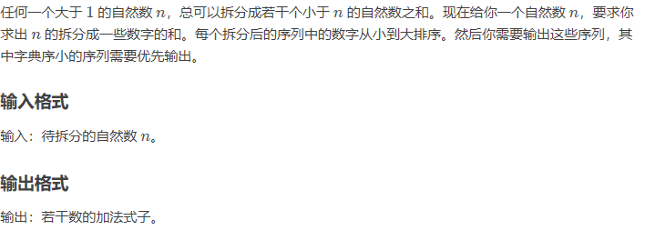
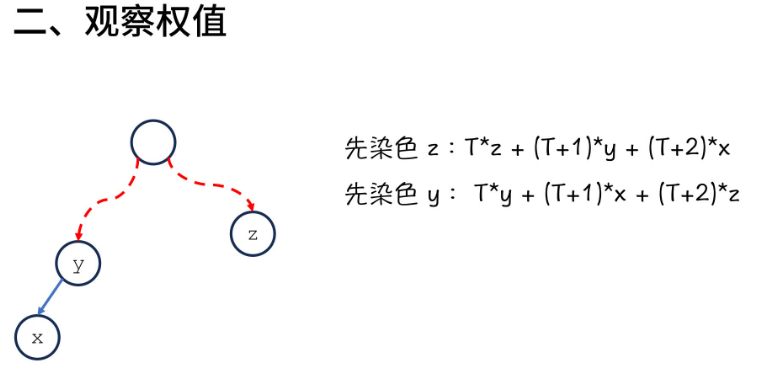
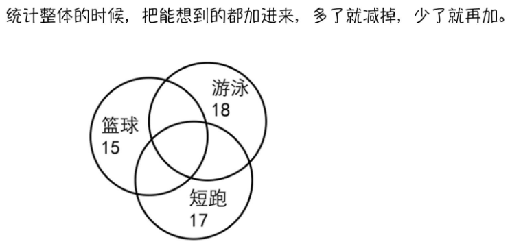
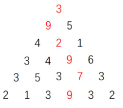

## 第十章 森林与并查集

### 1.什么是：连通性问题

并查集是为了**解决连通性算法**


1. 基于**染⾊**的思想，⼀开始所有点的颜⾊不同
2. 连接两个点的操作，可以看成将**⼀种颜⾊**的点染成**另⼀种颜⾊**
3. 如果两个点颜⾊⼀样，证明联通，否则不联通
4. 这种⽅法叫做并查集的：【Quick-Find算法】

### 2. Quick-Find算法


```c++
#include <iostream>
#include <cstdio>
#include <cstdlib>
#include <queue>
#include <stack>
#include <algorithm>
#include <string>
#include <map>
#include <set>
#include <vector>
using namespace std;
 
#define MAX_N 10000//代表点的数量
int color[MAX_N + 5];
 
void init(int n) {//初始化一个n个结点的并查集
    for (int i = 0; i <= n; i++) color[i] = i;
    return ;
}
 
int find(int a) {//返回相关节点的颜色
    return color[a];
}
 
int merge(int a, int b, int n) {//联通操作
    int aa = find(a), bb = find(b);
    if (aa == bb) return 0;//说明本次联通操作没有必要，两个结点颜色已经相同了
    for (int i = 0; i <= n; i++) {//合并
        if (color[i] == aa) {
            color[i] = bb;
        }
    }
    return 1;
}
 
void output(int n) {
    int ret = 0;
    for (int i = 0; i <= n; i++) {
        ret += printf("%3d", i);
    }
    printf("\n");
    for (int i = 0; i < ret; i++) printf("-");
    printf("\n");
    for (int i = 0; i <= n; i++) {
        printf("%3d", color[i]);
    }
    printf("\n");
    return ;
}
 
int main() {
    int n, a, b;
    cin >> n;
    init(n);
    while (cin >> a >> b) {
        printf("merge %d with %d : %d\n", a, b, merge(a, b, n));
        output(n);
    }
    return 0;
}

```

并查集的连接操作实质上是**两个集合合并**的一个操作
**1、联通判断：O(1)**
**2、合并操作：O(n)->只是为了两个集合的合并**
问题思考：
**1、quick-find算法的联通判断非常快，可是合并操作非常慢**
**2、本质上问题中只是需要知道⼀个点与哪些点的颜⾊相同**
**3、⽽若⼲点的颜⾊可以通过间接指向同⼀个节点**
**4、合并操作时，实际上是将⼀棵树作为另⼀棵树的⼦树**


### 3. Quick-Union算法

转换为树形结构！！！如果8存储的是8，就证明这是根节点（下标和值是一样的，3的父节点是8）
右图1，quick-find  右图2，quick-union


```c++
#include <iostream>
#include <cstdio>
#include <cstdlib>
#include <queue>
#include <stack>
#include <algorithm>
#include <string>
#include <map>
#include <set>
#include <vector>
using namespace std;
 
#define MAX_N 10000
int fa[MAX_N + 5];
 
void init(int n) {
    for (int i = 0; i <= n; i++) {
        fa[i] = i;
    }
    return ;
}
 
int find(int x) {
    if (fa[x] == x) return x;
    return find(fa[x]);//返回根节点下标
}
 
int merge(int a, int b) {
    int aa = find(a), bb = find(b);
    if (aa == bb) return 0;
    fa[aa] = bb;
    return 1;
}
 
void output(int n) {
    int ret = 0;
    for (int i = 0; i <= n; i++) {
        ret += printf("%3d", i);
    }
    printf("\n");
    for (int i = 0; i < ret; i++) printf("-");
    printf("\n");
    for (int i = 0; i <= n; i++) {
        printf("%3d", fa[i]);
    }
    printf("\n");
    return ;
}
 
int main() {
    int n, a, b;
    cin >> n;
    init(n);
    while (cin >> a >> b) {
        printf("merge %d with %d : %d\n", a, b, merge(a, b));
        output(n);
    }
    return 0;
}
```


### 4.并查集的按秩优化

高度优先或者节点数量优先


### 5.路径压缩优化

均摊时间复杂度O（1）


```c++
//按秩优化
#include <iostream>
#include <cstdio>
#include <cstdlib>
#include <queue>
#include <stack>
#include <algorithm>
#include <string>
#include <map>
#include <set>
#include <vector>
using namespace std;
 
#define MAX_N 10000
int fa[MAX_N + 5];
int size[MAX_N + 5];
 
void init(int n) {
    for (int i = 0; i <= n; i++) {
        fa[i] = i;
        size[i] = 1;
    }
    return ;
}
 
int find(int x) {
    if (fa[x] == x) return x;
    return find(fa[x]);
}
 
int merge(int a, int b) {
    int aa = find(a), bb = find(b);
    if (aa == bb) return 0;
    if (size[aa] < size[bb]) {
        fa[aa] = bb;
        size[bb] += size[aa];
    } else {
        fa[bb] = aa;
        size[aa] += size[bb];
    }
    return 1;
}
 
void output(int n) {
    int ret = 0;
    for (int i = 0; i <= n; i++) {
        ret += printf("%3d", i);
    }
    printf("\n");
    for (int i = 0; i < ret; i++) printf("-");
    printf("\n");
    for (int i = 0; i <= n; i++) {
        printf("%3d", fa[i]);
    }
    printf("\n");
    for (int i = 0; i <= n; i++) {
        printf("%3d", size[i]);
    }
    printf("\n");
    return ;
}
 
int main() {
    int n, a, b;
    cin >> n;
    init(n);
    while (cin >> a >> b) {
        printf("merge %d with %d : %d\n", a, b, merge(a, b));
        output(n);
    }
    return 0;
}

```

```c++
//路径压缩 优化
int find(int x) {
    return fa[x] = (fa[x] == x ? x : find(fa[x]));
}
 
int merge(int a, int b) {
    int aa = find(a), bb = find(b);
    if (aa == bb) return 0;
    if (size[aa] < size[bb]) {
        fa[aa] = bb;
        size[bb] += size[aa];
    } else {
        fa[bb] = aa;
        size[aa] += size[bb];
    }
    return 1;
}
```


### 课后阅读

http://blog.csdn.net/dm_vincent/article/details/7655764

http://blog.csdn.net/dm_vincent/article/details/7769159

### 6.经典例题

1.最长连续序列（leetcode-128）


```c++
class UnionSet {
public :
    UnionSet(int n) : fa(n + 1), size(n + 1) {
        for (int i = 0; i <= n; i++) {
            fa[i] = i;
            size[i] = 1;
        }
    }
    int find(int x) {
        return fa[x] = (fa[x] == x ? x : find(fa[x]));
    }
    int merge(int a, int b) {
        int aa = find(a), bb = find(b);
        if (aa == bb) return 0;
        fa[aa] = bb;
        size[bb] += size[aa];
        return 1;
    }
    vector<int> fa, size;
};
 
class Solution {
public:
    int longestConsecutive(vector<int>& nums) {
        int n = nums.size(), cnt = 0;
        unordered_map<int, int> h;
        UnionSet u(n);
        for (int i = 0; i < n; i++) {
            int x = nums[i];
            if (h.find(x) != h.end()) continue;
            h[x] = (cnt++);
            if (h.find(x + 1) != h.end()) u.merge(h[x], h[x + 1]);
            if (h.find(x - 1) != h.end()) u.merge(h[x], h[x - 1]);
        }
        int ans = 0;
        for (int i = 0; i < cnt; i++) {
            ans = max(ans, u.size[i]);
        }
        return ans;
    }
};
```


2.被围绕的区域(leetcode-130)


```c++
class UnionSet {
public :
    UnionSet(int n) : fa(n + 1) {
        for (int i = 0; i <= n; i++) fa[i] = i;
    }
    int get(int x) {
        return fa[x] = (fa[x] == x ? x : get(fa[x]));
    }
    void merge(int a, int b) {
        if (get(a) == get(b)) return ;
        fa[get(a)] = get(b);
        return ;
    }
    vector<int> fa;
};
 
class Solution {
public:
    void solve(vector<vector<char>>& board) {
        int m = board.size(), n = board[0].size();
        UnionSet u(m * n);
        for (int i = 0; i < m; i++) {
            for (int j = 0; j < n; j++) {
                int ind = i * n + j + 1;
                if (board[i][j] != 'O') continue;
                if (i == 0 || i == m - 1) u.merge(ind, 0);
                if (j == 0 || j == n - 1) u.merge(ind, 0);
                if (j + 1 < n && board[i][j + 1] == 'O') u.merge(ind, ind + 1);
                if (i + 1 < m && board[i + 1][j] == 'O') u.merge(ind, ind + n);
            }
        }
        for (int i = 0; i < m; i++) {
            for (int j = 0; j < n; j++) {
                if (board[i][j] != 'O') continue;
                int ind = i * n + j + 1;
                if (u.get(ind) != u.get(0)) board[i][j] = 'X';
            }
        }
        return ;
    }
};
```

3.岛屿数量(leetcode-200)


```c++
class UnionSet {
public :
    UnionSet(int n) : fa(n + 1) {
        for (int i = 0; i <= n; i++) fa[i] = i;
    }
    int get(int x) {
        return fa[x] = (fa[x] == x ? x : get(fa[x]));
    }
    void merge(int a, int b) {
        fa[get(a)] = get(b);
        return ;
    }
    vector<int> fa;
};
 
class Solution {
public:
    int numIslands(vector<vector<char>>& grid) {
        int n = grid.size(), m = grid[0].size();
        UnionSet u(n * m);
        for (int i = 0; i < n; i++) {
            for (int j = 0; j < m; j++) {
                if (grid[i][j] == '0') continue;
                int ind = i * m + j + 1;
                if (j + 1 < m && grid[i][j + 1] == '1') {
                    u.merge(ind, ind + 1);
                }
                if (i + 1 < n && grid[i + 1][j] == '1') {
                    u.merge(ind, ind + m);
                }
            }
        }
        int ans = 0;
        for (int i = 0; i < n; i++) {
            for (int j = 0; j < m; j++) {
                int ind = i * m + j + 1;
                if (grid[i][j] == '1' && u.get(ind) == ind) ans += 1;
            }
        }
        return ans;
    }
};
```

4.省份数量(leetcode-547)


```c++
class UnionSet {
public :
    UnionSet(int n) : fa(n + 1) {
        for (int i = 0; i <= n; i++) fa[i] = i;
    }
    int get(int x) {
        return fa[x] = (fa[x] == x ? x : get(fa[x]));
    }
    void merge(int a, int b) {
        fa[get(a)] = get(b);
    }
    vector<int> fa;
};
 
 
class Solution {
public:
    int findCircleNum(vector<vector<int>>& isConnected) {
        int n = isConnected.size();
        UnionSet u(n);
        for (int i = 0; i < n; i++) {
            for (int j = i + 1; j < n; j++) {
                if (isConnected[i][j]) u.merge(i, j);
            }
        }
        int ans = 0;
        for (int i = 0; i < n; i++) {
            if (u.get(i) == i) ans += 1;
        }
        return ans;
    }
};
```


## 第十一章 单调队列与单调栈

### 1.单调队列


**单调队列---维护过程**

​                              

​                              

**结论：**


```c++
void output(vector<int> &arr) {
    int n = arr.size(), len = 0;
    for (int i = 0; i < n; i++) {
        len += printf("%3d", i);
    }
    printf("\n");
    for (int i = 0; i < len; i++) printf("-");
    printf("\n");
    for (int i = 0; i < n; i++) {
        len += printf("%3d", arr[i]);
    }
    printf("\n");
    return ;
}
 
int main() {
    int n, k;
    cin >> n >> k;
    vector<int> arr;
    deque<int> q;
    for (int i = 0, a; i < n; i++) {
        cin >> a;
        arr.push_back(a);
    }
    output(arr);
    for (int i = 0; i < n; i++) {
        while (!q.empty() && arr[q.back()] > arr[i]) q.pop_back();
        q.push_back(i); // index
        if (i - q.front() == k) q.pop_front();
        printf("[%d, %d] = arr[%d] = %d\n", 
            max(i - k + 1, 0), i,
            q.front(), arr[q.front()]
        );
    }
    return 0;
}
```


### 2.单调栈


**单调递增：最近小于关系**

**单调递减：最近大于关系**

总结：

```c++
void output(vector<int> &arr) {
    int n = arr.size(), len = 0;
    for (int i = 0; i < n; i++) {
        len += printf("%3d", i);
    }
    printf("\n");
    for (int i = 0; i < len; i++) printf("-");
    printf("\n");
    for (int i = 0; i < n; i++) {
        len += printf("%3d", arr[i]);
    }
    printf("\n");
    return ;
}
 
int main() {
    int n;
    cin >> n;
    vector<int> arr;
    arr.push_back(-1);
    stack<int> s;
    for (int i = 0, a; i < n; i++) {
        cin >> a;
        arr.push_back(a);
    }
    arr.push_back(-1);
    vector<int> l(arr.size() + 1), r(arr.size() + 1);
    output(arr);
    // right
    for (int i = 0, I = arr.size(); i < I; i++) {
        while (!s.empty() && arr[s.top()] > arr[i]) {
            r[s.top()] = i;
            s.pop();
        }
        s.push(i);
    }
    // left
    while (!s.empty()) s.pop();
    for (int i = arr.size() - 1; i >= 0; i--) {
        while (!s.empty() && arr[s.top()] > arr[i]) {
            l[s.top()] = i;
            s.pop();
        }
        s.push(i);
    }
    // output result
    for (int i = 1; i <= n; i++) {
        printf("arr[%d] = %d, right : arr[%d] = %d, left : arr[%d] = %d\n",
            i, arr[i],
            r[i], arr[r[i]],
            l[i], arr[l[i]]
        );
    }
    return 0;
}
```


### 3.经典例题

1.滑动窗口（HZOJ-271）

```c++
int main() {
    int n, k;
    cin >> n >> k;
    vector<int> arr(n);
    deque<int> q;
    for (int i = 0; i < n; i++) {
        cin >> arr[i];
    }
    for (int i = 0; i < n; i++) {
        while (!q.empty() && arr[q.back()] > arr[i]) q.pop_back();
        q.push_back(i);
        if (i - q.front() == k) q.pop_front();
        if (i + 1 < k) continue;
        if (i >= k) cout << " ";
        cout << arr[q.front()];
    }
    cout << endl;
    q.clear();
    for (int i = 0; i < n; i++) {
        while (!q.empty() && arr[q.back()] < arr[i]) q.pop_back();
        q.push_back(i);
        if (i - q.front() == k) q.pop_front();
        if (i + 1 < k) continue;
        if (i >= k) cout << " ";
        cout << arr[q.front()];
    }
    cout << endl;
    return 0;
}
```

2.最大子序和（HZOJ-270）

```c++
int main() {
    int n, m;
    cin >> n >> m;
    vector<int> s(n + 1);
    deque<int> q;
    s.push_back(0);
    for (int i = 1; i <= n; i++) {
        cin >> s[i];
        s[i] += s[i - 1];
    }
    q.push_back(0);
    int ans = INT32_MIN;
    for (int i = 1; i <= n; i++) {
        ans = max(ans, s[i] - s[q.front()]);
        while (!q.empty() && s[i] < s[q.back()]) q.pop_back();
        q.push_back(i);
        if (q.front() == i - m) q.pop_front();
    }
    cout << ans << endl;
    return 0;
}
```

3.队列的最大值（Leetcode-Offer59）

```c++
class MaxQueue {
public:
    queue<int> q;
    deque<int> mq;
    MaxQueue() {}
     
    int max_value() {
        if (q.empty()) return -1;
        return mq.front();
    }
     
    void push_back(int value) {
        q.push(value);
        while (!mq.empty() && value > mq.back()) mq.pop_back();
        mq.push_back(value);
        return ;
    }
     
    int pop_front() {
        if (q.empty()) return -1;
        int val = q.front();
        q.pop();
        if (mq.front() == val) mq.pop_front();
        return val;
    }
};
```

4.绝对差不超过限制的最长连续子数组（leetcode-1438）

```c++
class Solution {
public:
    int longestSubarray(vector<int>& nums, int limit) {
        if (limit < 0) return 0;
        deque<int> min_q, max_q;
        int l = 0, ans = 1;
        min_q.push_back(0);
        max_q.push_back(0);
        for (int r = 1, n = nums.size(); r < n; r++) {
            while (!min_q.empty() && nums[r] < nums[min_q.back()]) min_q.pop_back();
            while (!max_q.empty() && nums[r] > nums[max_q.back()]) max_q.pop_back();
            min_q.push_back(r);
            max_q.push_back(r);
            while (nums[max_q.front()] - nums[min_q.front()] > limit) {
                if (min_q.front() == l) min_q.pop_front();
                if (max_q.front() == l) max_q.pop_front();
                l += 1;
            }
            ans = max(ans, r - l + 1);
        }
        return ans;
    }
};
```

5.最大矩形面积（HZOJ-264）

```c++
int main() {
    long long n;
    scanf("%lld", &n);
    vector<long long> arr(n + 2, -1), l(n + 2), r(n + 2);
    for (long long i = 1; i <= n; i++) {
        scanf("%lld", &arr[i]);
    }
    stack<long long> s;
    for (long long i = 1; i <= n + 1; i++) {
        while (!s.empty() && arr[i] < arr[s.top()]) {
            r[s.top()] = i;
            s.pop();
        }
        s.push(i);
    }
    while (!s.empty()) s.pop();
    for (long long i = n; i >= 0; i--) {
        while (!s.empty() && arr[i] < arr[s.top()]) {
            l[s.top()] = i;
            s.pop();
        }
        s.push(i);
    }
    long long ans = 0;
    for (long long i = 1; i <= n; i++) {
        long long height = arr[i], width = r[i] - l[i] - 1;
        ans = max(height * width, ans);
    }
    printf("%lld\n", ans);
    return 0;
}
```


## 第十二章 回溯算法


**1.理论基础**

回溯是递归的副产品，只要有递归就会有回溯。

**回溯函数也就是递归函数，指的都是一个函数**。

**2.回溯法的效率**

本质就是穷举所有可能性。要是想提高效率，可以进行剪枝操作。
暴力搜索，有些问题没得选，只能用回溯算法

**3.递归和回溯的比较**

举个例子
给定一组不含重复元素的整数数组 nums，返回该数组所有可能的子集（幂集）。

A.递归

```c++
class Solution {
public:
    vector<vector<int>> subsets(vector<int>& nums) {
        vector<vector<int>>v={{}};
        for(int i=0;i<nums.size();++i)
        {
            int n=v.size();
            for(int j=0;j<n;++j)
            {
                v.emplace_back(v[j]);
                v[n+j].emplace_back(nums[i]);
            }
        }
        return v;
    }
};
```

B.回溯

以示例为例，画出树状图。每次添加一个元素，每次只添加上一节点右边的元素。每一个节点即为一个子集。


```c++
class Solution {
public:
    void dfs(vector<int>&nums,vector<vector<int>>& v,vector<int>& tmp,int start)
    {
        for(int i=start;i<nums.size();++i)
        {
            tmp.emplace_back(nums[i]);//向当前子集添加元素
            v.emplace_back(tmp);//将新子集放入子集数组
            dfs(nums,v,tmp,i+1);
            tmp.pop_back();//上一节点下所有节点遍历完成，将元素取出以便更换
        }
    }
    vector<vector<int>> subsets(vector<int>& nums) {
        vector<vector<int>>v={{}};//存放所有子集
        vector<int>tmp;//存放一个子集
        dfs(nums,v,tmp,0);
        return v;
    }
};


```

回溯法解决的问题可以抽象为树形结构。因为回溯法解决的是在集合中递归查找子集，集合的大小就构成了树的宽度，递归的深度，都构成树的深度。

**回溯法模板**

A.回溯函数模板返回值以及参数
  因为回溯算法需要的参数可不像二叉树递归的时候那么容易一次性确定下来，所以一般是先写逻辑，然后需要什么参数，就填什么参数。

```c++
void backtracking(参数)
```

B.回溯函数终止条件

```c++
if (终止条件) {
    存放结果;
    return;
}
```

C.回溯搜索的遍历过程

在上面我们提到了，回溯法一般是在集合中递归搜索，集合的大小构成了树的宽度，递归的深度构成的树的深度。


注意图中，我特意举例集合大小和孩子的数量是相等的！

回溯函数遍历过程伪代码如下：

```c++
for (选择：本层集合中元素（树中节点孩子的数量就是集合的大小）) {
    处理节点;
    backtracking(路径，选择列表); // 递归
    回溯，撤销处理结果
}
```

for循环就是遍历集合区间，可以理解一个节点有多少个孩子，这个for循环就执行多少次。

backtracking这里自己调用自己，实现递归。

大家可以从图中看出**for循环可以理解是横向遍历,backtracking（递归）就是纵向遍历**，这样就把这棵树全遍历完了，一般来说，搜索叶子节点就是找的其中一个结果了。

分析完过程，回溯算法模板框架如下：

```c++
void backtracking(参数) {
    if (终止条件) {
        存放结果;
        return;
    }

    for (选择：本层集合中元素（树中节点孩子的数量就是集合的大小）) {
        处理节点;
        backtracking(路径，选择列表); // 递归
        回溯，撤销处理结果
    }
}
```

**这份模板很重要，后面做回溯法的题目都靠它了！**

------

### 1.回溯算法基本原理

**递归回溯算法**

- 递归：关注代码实现
- 回溯：关注问题解决

**如何理解回溯法**

- 问题求解树 
- 深搜遍历树
- 某些问题求解中剪枝优化操作

比如递归实现排列型枚举（搜索树）


```c
void func(int n,int cnt,int i) {//n是n个整数，cnt是计数用的
	if (cnt>n) {
		stdprint(n); return;
	}
	for (int k = 1; k <= n; k++) {
		if (val[k]) { continue; }//没有重复的
		arr[i] = k;
		val[k] = 1;
		func(n, cnt + 1, i + 1);
		val[k] = 0;
	}return;
}
```

**回溯法的设计**

- 问题状态搜索树的建立
- 切勿妄想一步到位：先实现，再优化
- 搜索剪枝算法：无招胜有招


### 回溯算法11讲


#### A.八皇后问题

  一个如下的 6*6的跳棋棋盘，有六个棋子被放置在棋盘上，使得每行、每列有且只有一个，每条对角线（包括两条主对角线的所有平行线）上至多有一个棋子。


请编一个程序找出所有棋子放置的解。并把它们以上面的序列方法输出，解按字典顺序排列。请输出前3个解。最后一行是解的总个数。

```c++
#define MASK(n) ((1 << (n + 1)) - 2)//生成掩码
 
unordered_map<int, int> ind;//哈希表实现一个位权到编号的映射
int total_ans = 3;
int arr[20];
 
void print_one_result(int n) {
    for (int i = 1; i <= n; i++) {
        if (i > 1) printf(" ");
        printf("%d", arr[i]);
    }
    printf("\n");
    total_ans -= 1;
    return ;
}
 
int dfs(int i, int t1, int t2, int t3, int n) {//I表示当前第几行
    if (i > n) {
        if (total_ans) print_one_result(n);
        return 1;
    }
    int ans = 0;//统计答案，累加dfs的返回值
    for (int t = t1; t; t -= (-t & t)) {//t -=(-t & t)代表那个数字是否使用
        int j = ind[-t & t];//j代表搞到哪一列，位权->编号，就是列
        if ((t2 & (1 << (i + j - 1))) && (t3 & (1 << (i - j + n)))) {//如果正反斜线都是1的话，即都可以使用
            arr[i] = j;
            ans += dfs(i + 1, t1 ^ (1 << j), //^这是异或，将那个位置的1标记为0
                t2 ^ (1 << (i + j - 1)),
                t3 ^ (1 << (i - j + n)),
                n
            );
        }
    }
    return ans;
}
 
int main() {
    int n, MASK;
    scanf("%d", &n);
    total_ans = 3;
    for (int i = 0; i < 2 * n; i++) ind[1 << i] = i;
    int ans = dfs(1, MASK(n), MASK(2 * n - 1), MASK(2 * n - 1), n);//正斜边和反斜边都是2n-1条，返回值代表总的方法总数//已经确定了几行皇后，每一列放置了哪些皇后，斜行，反斜行......
    printf("%d\n", ans);
    return 0;
```

优化1：**将原来的数组变成二进制数字（状态压缩）**


优化2：   **（快速枚举）**

当前状态下我们可以使用的最小的那个数字的位权（一般是正数的补码，变负数的补码）


优化3：**斜边表示**

（同样开辟二进制位！，保持不在对应的斜边上）

​                                          


#### B.奇怪的电梯


```c++
#define MAX_N 200
int to[MAX_N + 5];//每个结点的值
int dis[MAX_N + 5] = {0};//起点到达某个点的已知最短距离
 
void dfs(int k, int a, int n) {
    if (dis[a] <= k) return ;
    dis[a] = k;//更新
    //接下来就是分成左右两边去搜索
    if (a + to[a] <= n) dfs(k + 1, a + to[a], n);
    if (a - to[a] >= 1) dfs(k + 1, a - to[a], n);
    return ;
}
 
int main() {
    int n, a, b;//总结点个数，起点，终点
    scanf("%d%d%d", &n, &a, &b);
    for (int i = 1; i <= n; i++) scanf("%d", to + i);//读入每个按钮的值
    for (int i = 1; i <= n; i++) dis[i] = n + 1;//初始是极大值
    dfs(0, a, n);//当前点走了几步，起点，总结点个数（n就是那个最高的楼层）
    printf("%d\n", dis[b] == n + 1 ? -1 : dis[b]);
    return 0;
}
```

记录起点到某个点的距离比之前记录的距离要短的话就去剪枝--->**历史答案剪枝方法**


#### C.选数


```c++
#include<iostream>
#include<cstdio>
using namespace std;
#define MAX_N 20
int val[MAX_N];
long long ans = 0;

int is_prime(int x) {
    if (x < 2) return 0;
    for (int i = 2; i * i <= x; i++) {
        if (x % i == 0) return 0;
    }
    return 1;
}


void dfs(int i, int cnt, int n, int k, int sum) {
    if (cnt == k) {
        if (is_prime(sum)) ans += 1;
        return;
    }
    for (int j = i; j < n ; j++) {
        dfs(j + 1, cnt + 1, n, k, sum + val[j]);
    }
}


int main() {
    int n, k;
    scanf("%d%d", &n, &k);
    for (int i = 0; i < n; i++) {
        scanf("%d", val + i);
    }
    dfs(0, 0, n, k, 0);
    printf("%lld\n", ans);
    return 0;
}
```

**递归实现组合型枚举！！！**

#### D.马的遍历


```c++
#define MAX_N 400
int dir[8][2] = {
    {2, 1}, {-2, 1}, {2, -1}, {-2, -1},
    {1, 2}, {1, -2}, {-1, 2}, {-1, -2}
};
int dis[MAX_N + 5][MAX_N + 5];
int n, m;
 
void dfs(int step, int x, int y) {
    if (dis[x][y] != -1 && dis[x][y] <= step) {
        return ;
    }
    dis[x][y] = step;
    for (int k = 0; k < 8; k++) {
        int dx = x + dir[k][0];
        int dy = y + dir[k][1];
        if (dx < 1 || dx > n) continue;
        if (dy < 1 || dy > m) continue;
        dfs(step + 1, dx, dy);
    }
    return ;
}
 
int main() {
    int a, b;
    scanf("%d%d%d%d", &n, &m, &a, &b);
    for (int i = 1; i <= n; i++) {
        for (int j = 1; j <= m; j++) {
            dis[i][j] = -1;
        }
    }
    dfs(0, a, b);
    for (int i = 1; i <= n; i++) {
        for (int j = 1; j <= m; j++) {
            if (j > 1) printf(" ");
            printf("%d", dis[i][j]);
        }
        printf("\n");
    }
    return 0;
}
```

```c++
#define MAX_N 400
int dir[8][2] = {
    {2, 1}, {-2, 1}, {2, -1}, {-2, -1},
    {1, 2}, {1, -2}, {-1, 2}, {-1, -2}
};
int dis[MAX_N + 5][MAX_N + 5];//最短步数
struct Node {//广搜队列
    Node(int x, int y, int s) : x(x), y(y), s(s) {}//到达x,y的最短距离，s步
    int x, y, s;
};
 
void bfs(int n, int m, int a, int b) {
    queue<Node> q;
    q.push(Node(a, b, 0));
    dis[a][b] = 0;//初始化
    while (!q.empty()) {
        Node now = q.front();
        q.pop();//弹出队首结点，然后扩展再入队列，实现BFS
        for (int k = 0; k < 8; k++) {
            int dx = now.x + dir[k][0];
            int dy = now.y + dir[k][1];
            if (dx < 1 || dx > n) continue;
            if (dy < 1 || dy > m) continue;//判断是否合法
            if (dis[dx][dy] != -1) continue;//判断是否到过
            q.push(Node(dx, dy, now.s + 1));
            dis[dx][dy] = now.s + 1;
        }
    }
    return ;
}
 
int main() {
    int n, m, a, b;
    scanf("%d%d%d%d", &n, &m, &a, &b);
    for (int i = 1; i <= n; i++) {
        for (int j = 1; j <= m; j++) {
            dis[i][j] = -1;
        }
    }
    bfs(n, m, a, b);
    for (int i = 1; i <= n; i++) {
        for (int j = 1; j <= m; j++) {
            if (j > 1) printf(" ");
            printf("%d", dis[i][j]);
        }
        printf("\n");
    }
    return 0;
}
```

编程技巧：方向数组


层序遍历适合求解最短步长，


#### E.迷宫


```c++

```


#### F.吃奶酪


```c++

```


#### G.单词接龙


```c++

```


#### H.字串变换


```c++

```


#### I.自然数的拆分问题



```c++

```


#### J.单词方阵


```c++

```


#### K.考前临时抱佛脚


```c++

```


## 第十三章 贪心算法


1.理论基础

**本质：选择每一阶段的局部最优，从而达到全局最优**

**什么时候用：**没有固定的套路，如果发现可以通过局部最优达到总体最优，并且举不出反例的时候，就可以用贪心**【常识性推导+举反例】**


### 1.贪心算法基本原理

不从整体最优上加以考虑，算法得到的是在某种意义上的局部最优解。**贪心算法关键是：贪心策略的选择。**

**适用情况举例**


**不适用情况举例**


**偏序关系**


### 贪心算法十讲

#### A.最大整数


```c
bool cmp(const string &a, const string &b) {
    return a + b > b + a;
}
 
int main() {
    vector<string> arr;
    string s;
    int n;
    cin >> n;
    for (int i = 0; i < n; i++) {
        cin >> s;
        arr.push_back(s);
    }
    sort(arr.begin(), arr.end(), cmp);
    for (int i = 0; i < n; i++) {
        cout << arr[i];
    }
    cout << endl;
    return 0;
}
```

贪心策略：局部A+B>B+A，A排在前面。
证明：A的字典序大于B的字典序；A<B且A不是B的前缀树（不成立）；A是B的前缀（绿大于红）


当A+B>B+A那么如何保证A排在B的前面能保证**全局最优**呢。反证法。本来最优的是ACB，但是假设这里最优策略是BCA。
如果字典序是A>B>C，那么不可能成立。
如果A是C的前缀，C是B的前缀。那么红比绿大，但是（A+B>B+A）,绿应该大于红的，所以原假设不成立


#### B.删数


179566（4）->15    903071（3）->1

```C
#define MAX_N 500
char s[MAX_N + 5];
int k;
 
int main() {
    cin >> s >> k;
    for (int i = 0; i < k; i++) {
        int j = 0;
        while (s[j + 1] && s[j] <= s[j + 1]) ++j;//指向第一个逆序位的高位
        while (s[j]) s[j] = s[j + 1], j += 1;//把高位覆盖掉
    }
    for (int i = 0, flag = 1; s[i]; i++) {//输出（前导0）
        if (s[i] == '0' && flag) continue; 
        cout << s[i];
        flag = 0;//判断是否输出过数字
    }
    cout << endl;
    return 0;
}
```

局部：每次删除一个离最高位最近的逆序位的第一个数字

整体：按照这个策略执行n次之后就可以得到最小的整数

假设：A、B 是只有一位不同的n位整数，其中A≤B
证明1：在同时删除m 位的情况下，A 始终可以得到一个数字A‘，A‘≤B’


证明2：n 位数字删除一个离最高位最近的逆序位的第一个数字，得到的是n-1位数字的最小值（删除一个数字，能使这个数在新的数字变小）

证明全局最优：上述两个证明联立，在所有的n-1位中满足结论1，然后通过结论二相当于运用偏序关系


#### C.独木舟问题


```c
int main() {
    int w, n;
    cin >> w >> n;//w代表独木舟的载重，n是人
    vector<int> arr(n);
    for (int i = 0; i < n; i++) cin >> arr[i];
    sort(arr.begin(), arr.end());//由小到大排序
    int i = 0, j = n - 1, cnt = 0;//设置两个指针，i指向最轻了，j指向最重的，cnt是船的数量
    while (i < j) {
        if (arr[i] + arr[j] <= w) {
            i++, j--;
        } else {
            j--;//体重最重的单独坐一个船
        }
        cnt += 1;
    }
    if (i == j) cnt += 1;//如果最后还剩下一个人的时候
    cout << cnt << endl;
    return 0;
}
```

局部：每次安排，如果最重的人和最轻的人能坐一起，就坐一条独木舟，否则最重的人自己坐一条船。
整体：按照如上策略执行，就能得到最少的独木舟数量

证明1：假设独木舟承重w，人员全集A，子集分别为X1,X2，且X1+X2=A，F函数返回最少的独木舟数量，证明：F(A)≤F(x1)+F(x2)

**证明相等关系：**由于X1+X2=A，按照X1与X2的分配方案，也是A 的某一种合法的分配方案，所以相等关系可以成立。

**证明小于关系：**
情况1：X1中存在某个一人拆分a1，以及X2中存在另外一个一人拆分a2，其中a1+a2≤w，**让A1 A2坐一个船。**
情况2：X1或X2中存在一个两人拆分(a1，a2)，并且存在另外两个一人拆分a3，a4，使得，a1+a3≤w且a2+a4≤w，原本a1a2  a3  a4是三条船，然后**重分配**，坐两条船

证明2：

1.F(x1~xn)与F(xn)+F(x1~xn-1)不存在小于关系  

2.F(x1~xn)与F(x1xn)+F(x2~xn-1)不存在小于关系


#### D.最大子阵和

给定一个矩阵（N*N），在其中找一个子矩阵，使得子矩阵中所有元素的和加在一起最大。


```c
#define MAX_N 100//前缀和技巧！！！！！
int arr[MAX_N + 5][MAX_N + 5];
 
int main() {
    int n;
    cin >> n;
    for (int i = 1; i <= n; i++) {
        for (int j = 1; j <= n; j++) {
            cin >> arr[i][j];
            arr[i][j] += arr[i - 1][j];//每个位置的值等于相应的这一列的和值
        }
    }
    int ans = INT32_MIN;
    for (int i = 1; i <= n; i++) {//枚举起始行号和终止行号
        for (int j = i; j <= n; j++) {//i-j
            int S = 0;
            for (int k = 1; k <= n; k++) {
                int a = arr[j][k] - arr[i - 1][k];//其中求每一列的和值的时候，可以用前缀和去加速
                if (S >= 0) S += a;
                else S = a;//如果比0小，就从a开始重新求子序和
                if (S > ans) ans = S;
            }
        }
    }
    cout << ans << endl;
    return 0;
}//这道题相当于每一行的组合都枚举了，在这个前提之下还对每列求得了最大子序和，时间复杂度很大
```

高度在红色区域内的最大子矩阵和，相当于a1---an这个序列当中去求最大子序和

先去枚举子矩阵中起始行和终止行的位置，然后再变成一维-->最大子序和问题

局部：s 代表以**前一个位置为结尾**的最大子序和，当前值为a，则s≥0，s+=a否则s=a
整体：按照如上策略执行，过程中s 的最大值，就是最大子序和


#### E.最少操作次数

给出两个整数 a,b，每次操作可以把 a变成 a+1或 a∗k。求把 a变成 b 至少需要几步操作。

```c
int main() {//把这道题想象成a是K进制数据
    long long a, b, k, ans = 0;
    cin >> a >> b >> k;
    if (k == 1) {
        cout << b - a << endl;
        return 0;
    }
    if (k == 0) {
        if (b != 0) cout << b - a << endl;
        else cout << !!(a) << endl;
        return 0;
    }
    while (1) {
        if (a * k <= b) {
            ans += 1 + b % k;
            b /= k;
        } else {
            ans += b - a;
            break;
        }
    }
    cout << ans << endl;
    return 0;
}
```

**局部**：ans代表最少操作次数，则ans更新策略如下：
情况1：若a * k≤b，ans+=1+b%k，b/=k
情况2：若a * k＞b，ans+=(b-a)，终止

**整体**：按照如上策略执行，最终得到的ans，就是最少操作次数

乘以K，就是在K进制表示后+0，+1操作转换成*k的操作需要加（k-1）a


本题也可以用**动态规划**来求解

```python
#dp[i] 表示将数字 a 变成 i 所需的最小操作次数
if i + 1 <= b:
            dp[i + 1] = min(dp[i + 1], dp[i] + 1)
if i * k <= b:
            dp[i * k] = min(dp[i * k], dp[i] + 1)
```


#### F.安装雷达


```c
#define MAX_N 1000
 
struct Range {//映射之后的区间
    double l, r;
} arr[MAX_N + 5];//每个数组相当于存了两个数字的数组，就是结点！！！
 
bool cmp(const Range &a, const Range &b) {
    return a.r < b.r;//按照结束位置从小到大排序
}
 
int main() {
    int n;
    double r, x, y, pos;
    cin >> n >> r;
    for (int i = 0; i < n; i++) {
        cin >> x >> y;
        if (y > r) {//无解的时候输出-1，也就是离岸边太远了
            cout << -1 << endl;
            return 0;
        }
        double delta = sqrt(r * r - y * y);
        arr[i].l = x - delta;
        arr[i].r = x + delta;
    }
    sort(arr, arr + n, cmp);//按照结束位置从小到大排序
    int ans = 1;//雷达
    pos = arr[0].r;
    for (int i = 1; i < n; i++) {
        if (arr[i].l > pos) {
            ans += 1;
            pos = arr[i].r;
        }
    }
    cout << ans << endl;
    return 0;
}
```

**数据映射转换**

有若干个区间，在每个区间里面至少放置一个雷达，求放置雷达的最少数量。


局部：按照区间[li,ri]**结束位置从小到大排序**，**雷达放置在区间末尾**，**pos**代表**最后一个雷达的位置**，若pos<li,雷达数量+1，pos= ri
整体：按照如上策略执行，最终得到的雷达数量，就是最少数量。

**偏序关系**

设：F(l,r)是l到r中的所有区间**最少放置雷达数量**，其中{l,r}={l1,r1}U{l2,r2}，则：证明：F(l,r)≤F(l1,r1)+ F(l2,r2)

- 情况1：当{l1,r1}与{l2,r2}无交集时，等于关系成立
- 情况2：当{l1,r1}与{l2,r2}有交集时，小于关系可能成立

**证明贪心策略**

假设：已处理的区间范围[l,r]，新区间[ l1,r1]，其中r1≥r。（按照排序之后处理的）


#### G.挤奶


```c
#define MAX_N 50000
 
struct Data {
    int l, r, id;
} arr[MAX_N + 5];
int m_time[MAX_N + 5], ans[MAX_N + 5];
int cnt = 0;
 
bool cmp(const Data &a, const Data &b) {
    if (a.l != b.l) return a.l < b.l;
    return a.id < b.id;
}
 
int main() {
    int n;
    scanf("%d", &n);
    for (int i = 0; i < n; i++) {
        scanf("%d%d", &arr[i].l, &arr[i].r);
        arr[i].id = i;
    }
    sort(arr, arr + n, cmp);
    for (int i = 0; i < n; i++) {
        int pos = -1;
        for (int j = 0; j < cnt; j++) {
            if (m_time[j] < arr[i].l) {
                pos = j;
                break;
            }
        }
        if (pos == -1) pos = (cnt++);
        m_time[pos] = arr[i].r;
        ans[arr[i].id] = pos + 1;//挤奶机编号
    }
    printf("%d\n", cnt);
    for (int i = 0; i < n; i++) {
        printf("%d\n", ans[i]);
    }
    return 0;
}
```

局部：按照挤奶开始时间，安排每一头奶牛，将当前奶牛安排给可以安排的编号最小的挤奶机，当无法安排时，增加挤奶机数量。

整体：按照如上策略执行，得到的数量，就是最少挤奶机数量

证明：F(n)代表对前n 头奶牛的最优安排（数学归纳法）


#### H.奶牛晒太阳


```c
#define MAX_N 2500
 
struct Data {
    int a, b;
};
 
Data cow[MAX_N + 5], item[MAX_N + 5];
 
bool cmp(const Data &a, const Data &b) {
    if (a.b != b.b) return a.b < b.b;
    return a.a < b.a;//上方图片，先排防晒霜后排奶牛
}//防晒霜a是数量，b是防晒强度。
 //奶牛a是最小强度，b是最大强度。
 
int main() {
    int C, L;
    cin >> C >> L;
    for (int i = 0; i < C; i++) {
        cin >> cow[i].a >> cow[i].b;
    }//奶牛数据
    for (int i = 0; i < L; i++) {
        cin >> item[i].b >> item[i].a;
    }//防晒霜数据
    sort(item, item + L, cmp);
    sort(cow, cow + C, cmp);
    int ans = 0;
    for (int i = 0; i < C; i++) {//遍历奶牛
        int flag = 0;
        for (int j = 0; j < L; j++) {
            if (item[j].a == 0) continue;
            if (item[j].b <= cow[i].b && item[j].b >= cow[i].a) {
                flag = 1;//可以涂
                item[j].a -= 1;
                break;//跳出循环
            }
        }
        ans += flag;
    }
    cout << ans << endl;
    return 0;
}
```

**问题匹配**：本题的模型就是在数轴上给出一些线段（每个牛对应的区间），再给出一些点，一个点能和一条线段配对当且仅当他们有交，求最大匹配数

**局部**：将所有点从小到大排序，所有线段按右端点从小到大排序，右端点相同，按照左端点从小到大排序。依次判断点与线段是否匹配。
**整体**：按照如上策略执行，得到的就是**最大匹配数量**


#### I.公司的任务

**提示：**


```c
#define MAX_N 100000
 
struct Data {
    int x, y;
};
Data task[MAX_N + 5], ma[MAX_N + 5];
int cnt[105] = {0};
 
bool cmp(const Data &a, const Data &b) {
    if (a.x - b.x) return a.x > b.x;
    return a.y > b.y;
}
 
int main() {
    int n, m;
    long long ans = 0, task_cnt = 0;
    scanf("%d%d", &n, &m);
    for (int i = 0; i < n; i++) {
        scanf("%d%d", &ma[i].x, &ma[i].y);
    }
    for (int i = 0; i < m; i++) {
        scanf("%d%d", &task[i].x, &task[i].y);
    }
    sort(ma, ma + n, cmp);
    sort(task, task + m, cmp);
    for (int i = 0, j = 0; i < m; i++) {
        while (j < n && ma[j].x >= task[i].x) {
            cnt[ma[j].y] += 1;
            j += 1;
        }
        for (int y = task[i].y; y <= 100; y++) {
            if (cnt[y] == 0) continue;
            cnt[y] -= 1;
            ans += 500 * task[i].x + 2 * task[i].y;
            task_cnt += 1;
            break;
        }
    }
    cout << task_cnt << " " << ans << endl;
    return 0;
}
```

**局部：**将所有任务以及机器按照时间**从大到小排序**，时间相同的按照任务难度**从大到小排序**，维护能处理当前任务的所有机器，选择其中难度系数最小的。
**整体：**按照如上策略执行，得到的就是最大报酬

**保证最优的两点：**

- 留给第i个任务的机器组合最优
- 如果能选择，则选择第i个任务即为最优


#### J.树的颜色


```c
#define MAX_N 1000
 
int C[MAX_N + 5] = {0};
int fa[MAX_N + 5] = {0};
int vis[MAX_N + 5] = {0};
int cnt[MAX_N + 5] = {0};
double w[MAX_N + 5] = {0};
int n, r;
long long ans = 0;
 
int find_x() {
    int x = -1;
    for (int i = 1; i <= n; i++) {
        if (i == r || vis[i] == 1) continue;
        if (x == -1 || w[x] < w[i]) x = i;
    }
    return x;
}
 
int find_father(int x) {
    if (vis[fa[x]]) return find_father(fa[x]);
    return fa[x];
}
 
int main() {
    cin >> n >> r;
    for (int i = 1; i <= n; i++) {
        cin >> C[i];
        ans += C[i];
        fa[i] = i;
        w[i] = C[i];
        cnt[i] = 1;
    }
    for (int i = 1, a, b; i < n; i++) {
        cin >> a >> b;
        fa[b] = a;
    }
    for (int i = 1; i < n; i++) {
        int x = find_x();
        int father_x = find_father(x);
        ans += cnt[father_x] * C[x];
        C[father_x] += C[x];
        cnt[father_x] += cnt[x];
        w[father_x] = 1.0 * C[father_x] / cnt[father_x];
        vis[x] = 1;
    }
    cout << ans << endl;
    return 0;
}
```



**delta = 父节点包含的结点数量*子节点权值和**


### 贪心算法总结


## 第十四章 动态规划（DP）


### 1.递推问题

#### 1.1 如何求解递推问题


#### 1.2容斥原理的基本思想

在计数时，必须注意没有重复，没有遗漏。为了使重叠部分不被重复计算，人们研究出一种新的计数方法，这种方法的基本思想是：先不考虑重叠的情况，把包含于某内容中的所有对象的数目先计算出来，然后再把计数时重复计算的数目排斥出去，使得计算的结果既无遗漏又无重复，这种计数的方法称为容斥原理。



例子（钱币问题）：现在给你1、2、5、10、20、50、100、200元若⼲张，问你想要凑⾜N元钱，⼀共有多少种不同的⽅法？注意(1,1,2)和(1,2,1)属于同⼀种⽅法。


#### 1.3爬楼梯问题


#### 1.4墙壁涂色


### 2.递推-课后实战

1.数的划分

将整数 n分成 k 份，且每份不能为空，任意两个方案不相同（不考虑顺序）。


```c++
#define MAX_N 200
#define MAX_K 6
 
int f[MAX_N + 5][MAX_K + 5] = {0};
 
int main() {
    int n, k;
    cin >> n >> k;
    f[0][0] = 1;
    for (int i = 1; i <= n; i++) {
        f[i][1] = 1;
        for (int j = 2, J = min(i, k); j <= J; j++) {
            f[i][j] = f[i - 1][j - 1] + f[i - j][j];
        }
    }
    cout << f[n][k] << endl;
    return 0;
}
```

2.数的计算


```c++
#define MAX_N 1000
int f[MAX_N + 5] = {0};
 
int main() {
    int n;
    cin >> n;
    for (int i = 1; i <= n; i++) {
        f[i] = 1;
        for (int j = 1; j <= i / 2; j++) {
            f[i] += f[j];
        }
    }
    cout << f[n] << endl;
    return 0;
}
```


3.神经网络（P1038）

```c++
#define MAX_N 100
int c[MAX_N + 5], u[MAX_N + 5];//神经元目前状态
int w[MAX_N + 5][MAX_N + 5];//权值
int indeg[MAX_N + 5], outdeg[MAX_N + 5];//入度和出度
vector<int> g[MAX_N + 5];//出边
 
int main() {
    int n, p;
    cin >> n >> p;
    for (int i = 1; i <= n; i++) {
        cin >> c[i] >> u[i];
        if (c[i] == 0) c[i] -= u[i];
    }
    for (int i = 0, a, b, W; i < p; i++) {//a指向b的权值
        cin >> a >> b >> W;
        w[a][b] = W;
        indeg[b] += 1;
        outdeg[a] += 1;
        g[a].push_back(b);
    }
    queue<int> q;
    for (int i = 1; i <= n; i++) {
        if (indeg[i]) continue;
        q.push(i);
    }
    while (!q.empty()) {
        int ind = q.front();
        q.pop();
        if (c[ind] > 0) {//证明被激活了
            for (int i = 0; i < g[ind].size(); i++) {
                int to = g[ind][i];
                c[to] += w[ind][to] * c[ind];
            }
        }
        for (int i = 0; i < g[ind].size(); i++) {
            int to = g[ind][i];
            indeg[to] -= 1;
            if (indeg[to] == 0) {
                q.push(to);
            }
        }
    }
    int flag = 0;
    for (int i = 1; i <= n; i++) {
        if (outdeg[i]) continue;
        if (c[i] <= 0) continue;
        cout << i << " " << c[i] << endl;
        flag = 1;
    }
    if (flag == 0) cout << "NULL" << endl;
    return 0;
}
```

4.1-n的合法出栈序列有多少种


```c++
#define MAX_N 18
int f[MAX_N + 5];
 //容斥原理思想对全集进行拆分
int main() {
    int n;
    cin >> n;
    f[0] = 1;
    for (int i = 1; i <= n; i++) {
        f[i] = 0;
        for (int x = 1; x <= i; x++) {
            f[i] += f[x - 1] * f[i - x];
        }
    }
    cout << f[n] << endl;
    return 0;
}
```

5.数的循环（*n* 的正整数次幂的最后 k位的循环长度。）（大整数）


```c++
int main() {//打表找规律
    int n, k, base = 1, x, y;
    cin >> n >> k;
    for (int i = 0; i < k; i++, base *= 10) ;
    x = n % base;//x代表的是n这个数的最后k位
    y = x;
    int cnt = 1;//循环节
    while (x * y % base != x) {//末两位是否相等
        cout << "y = " << y << "(" << cnt << "), ";
        y = y * x % base;
        cnt += 1;
        if ((cnt - 1) % 4 == 0) cout << endl;
    }
    cout << cnt << endl;
    return 0;
}
```

```c++
class BigInt : public vector<int> {
public :
    BigInt() { push_back(0); }
    BigInt(int n, int v) : vector<int>(n, v) {}
    BigInt(int x) {//传入整形 
        push_back(x);
        proccess_digit();//处理进位
        return ;
    }
    BigInt(string &s, int k) {//S的最后K位
        for (int i = 0, j = s.size() - 1; i < k; i++, j--) {
            push_back(s[j] - '0');//ASCII🐎转换成数字，0的ASCII是48，字符转数字
        }
        return ;
    }
    BigInt &operator *=(int x) {
        for (int i = 0; i < size(); i++) at(i) *= x;
        proccess_digit();
        return *this;
    }
    BigInt operator*(const BigInt &a) {
        BigInt ret(min(MaxLen, int(size() + a.size() - 1)), 0);
        for (int i = 0; i < size(); i++) {
            for (int j = 0; j < a.size(); j++) {
                if (i + j >= MaxLen) continue;
                ret[i + j] += at(i) * a[j];
            }
        }
        ret.proccess_digit();
        return ret;
    }
 
    static int MaxLen;
 
private:
    void proccess_digit() {
        for (int i = 0; i < size(); i++) {
            if (at(i) < 10) continue;
            if (i + 1 < MaxLen) {//是否越界 
                if (i + 1 == size()) push_back(0);
                at(i + 1) += at(i) / 10;
            }
            at(i) %= 10;
        }
        return ;
    }
};
 
int BigInt::MaxLen = 0;//静态类属性
 
ostream &operator<<(ostream &out, const BigInt &a) {
    for (int i = a.size() - 1; i >= 0; --i) {
        out << a[i];
    }
    return out;
}
 
int main() {
    string s;
    int k;
    cin >> s >> k;
    BigInt::MaxLen = k;//大整数的最长位数，k
    BigInt n(s, k);//s整数的倒数k位
    BigInt pre_y = n, y;//pre y是已知的循环节的基数
    vector<int> arr;//每位的循环长度，存到数组中
    for (int i = 0; i < n.size(); i++) {//按位确定循环节长度
        y = pre_y;
        int cnt = 1;
        while ((y * n).at(i) != n[i]) {
            y = y * pre_y;
            cnt += 1;
            if (cnt == 11) break;//鸽巢原理，比如0-9的数字都遍历的，但是到11位了还没有出来，则不存在循环节
        }
        if (cnt == 11) {
            cout << "-1" << endl;
            return 0;
        }
        arr.push_back(cnt);
        pre_y = y;
    }
    BigInt ans = 1;
    for (int i = 0; i < arr.size(); i++) {
        ans *= arr[i];
    }
    cout << ans << endl;
    return 0;
}

```

6.传球游戏


```c++
#define MAX_N 30
#define MAX_M 30
int f[MAX_N + 5][MAX_N + 5] = {0};
 //F[J][I]代表传j轮，在第i人手里的方法总数
int main() {
    int n, m;
    cin >> n >> m;
    f[0][1] = 1;
    for (int j = 1; j <= m; j++) {
        for (int i = 2; i <= n - 1; i++) {
            f[j][i] = f[j - 1][i + 1] + f[j - 1][i - 1];//可能在左边人手里，也可能在右边人手里
        }
        f[j][1] = f[j - 1][2] + f[j - 1][n];//为了防止越界，开头的人和结尾的人单独处理
        f[j][n] = f[j - 1][1] + f[j - 1][n - 1];
    }
    cout << f[m][1] << endl;
    return 0;
}
```


7.汉诺塔问题(大整数)


```c++
#define MAX_N 200
 
class BigInt : public vector<int> {//大整数类型
public :
    BigInt() { push_back(0); }
    BigInt(int x) {
        push_back(x);
        proccess_digit();
    }
     
    BigInt &operator*=(int x) {
        for (int i = 0; i < size(); i++) {
            at(i) *= x;
        }
        proccess_digit();
        return *this;
    }
    BigInt operator*(int x) {
        BigInt ret(*this);
        ret *= x;
        return ret;
    }
    
    BigInt &operator+=(int x) {
        at(0) += x;
        proccess_digit();
        return *this;
    }
 
    BigInt operator+(int x) {
        BigInt ret(*this);//拷贝构造函数
        ret += x;
        return ret;
    }
 
private:
   void proccess_digit() {
    for (int i = 0; i < size(); i++) {
        if (at(i) < 10) continue; // 如果当前位小于10，不需要处理进位
        if (i + 1 == size()) push_back(0); // 如果当前位是最高位，需要额外添加一位来存储进位
        at(i + 1) += at(i) / 10; // 将当前位的进位部分加到下一位
        at(i) %= 10; // 将当前位的值保留在0到9的范围内
    }
}

};
 
BigInt f[MAX_N + 5];
ostream &operator<<(ostream &out, const BigInt &a) {
    for (int i = a.size() - 1; i >= 0; i--) {
        out << a[i];
    }
    return out;
}
int main() {
    int n;
    cin >> n;
    f[1] = 2;
    for (int i = 2; i <= n; i++) {
        f[i] = f[i - 1] * 2 + 2;
    }
    cout << f[n] << endl;
    return 0;
}
```


### 3.动态规划

#### 3.1如何求解动态规划问题


**四个概念**！！！！！

**阶段**：把所给求解问题的过程恰当地分成若干个相互联系的阶段，以便于求解，过程不同，阶段数就可能不同。描述阶段的变量称为阶段变量。

**状态**：一个阶段中，包含了若干个状态，状态与状态之间存在某种递推关系，这种递推关系一般满足『最优子结构』和『重叠子问题』两个性质。

**无后效性**：如果给定某一阶段的状态，则在这一阶段以后过程的发展不受这阶段以前各段状态的影响，所有各阶段都确定时，整个过程也就确定了。

**决策**：一个阶段的状态给定以后，从该状态演变到下一阶段某个状态的一种选择称为决策。在许多问题中，决策可以表示为一个数或一组数。


#### 3.2全面剖析：数字三角形问题

有⼀个由数字组成的三角形，站在上⼀层的某个点，只能到达其下⽅左右的两个点。现在请找到⼀条从上到下的路径，使得路径上所有数字相加之和最⼤。

​                                          

==思考一==：如果由下向上⾛的话，很容易获得最后⼀⾏站在**每个点**上能够获得的最⼤值，由此得到倒数第⼆⾏的**每个点**的最⼤值，依次递推。**（自底向上）**


```c++
#define MAX_N 1000
int val[MAX_N + 5][MAX_N + 5];
int f[MAX_N + 5][MAX_N + 5];
 
int main() {
    int n;
    scanf("%d", &n);
    for (int i = 1; i <= n; i++) {
        for (int j = 1; j <= i; j++) {
            scanf("%d", &val[i][j]);
        }
    }
    for (int i = 1; i <= n; i++) f[n][i] = val[n][i];
    for (int i = n - 1; i >= 1; i--) {
        for (int j = 1; j <= i; j++) {
            f[i][j] = max(f[i + 1][j], f[i + 1][j + 1]) + val[i][j];
        }
    }
    //for (int i = 1; i <= n; i++) {
    //    for (int j = 1; j <= i; j++) {
    //        printf("%3d", f[i][j]);
    //    }
    //    printf("\n");
    //}
    printf("%d\n", f[1][1]);
    return 0;
}
```

==思考二==：如果由上向下⾛的话，很容易获得第⼀⾏站在**每个点**上能够获得的最⼤值，由此得到第⼆⾏的**每个点**的最⼤值，依次递推。**（自顶向下）**


```c++
#define MAX_N 1000
int val[MAX_N + 5][MAX_N + 5];
int f[MAX_N + 5][MAX_N + 5];
 
int main() {
    int n;
    scanf("%d", &n);
    for (int i = 1; i <= n; i++) {
        for (int j = 1; j <= i; j++) {
            scanf("%d", &val[i][j]);
        }
    }
    f[1][1] = val[1][1];
    for (int i = 2; i <= n; i++) {
        for (int j = 2; j <= i - 1; j++) {
            f[i][j] = max(f[i - 1][j - 1], f[i - 1][j]) + val[i][j];
        }
        f[i][1] = f[i - 1][1] + val[i][1];
        f[i][i] = f[i - 1][i - 1] + val[i][i];
    }
    int ans = f[n][1];
    for (int i = 2; i <= n; i++) {
        if (f[n][i] > ans) ans = f[n][i];
    }
    printf("%d\n", ans);
    return 0;
}
```


总结

阶段：每层就是一个阶段
状态：f[i] [j]就是一个状态
无后效性：f[i] [j]的值确定之后不会被修改
决策：动规方程中的max部分就是一种决策


#### 3.3 DP经典问题入门

##### 1.0-1背包问题

给有⼀个能承重V的背包，和n件物品，我们用重量和价值的⼆元组来表示⼀个物品，第i件物品表示为(vi,wi)，问在背包不超重的情况下，得到物品的最⼤价值是多少？

```c++
//dp[i][j]代表前i件物品中，背包承重为j时所获得的最大价值
```

方法一：


```c++
#define MAX_N 100
#define MAX_V 10000
int v[MAX_N + 5], w[MAX_N + 5];
int dp[MAX_N + 5][MAX_V + 5] = {0};
 
int main() {
    int V, n;//最大承重和物品数量
    scanf("%d%d", &V, &n);
    for (int i = 1; i <= n; i++) {
        scanf("%d%d", v + i, w + i);
    }//读入每个商品的重量和价值
    for (int i = 1; i <= n; i++) {
        for (int j = 1; j <= V; j++) {
            dp[i][j] = dp[i - 1][j];//这一层没放物品的时候，最优价值去继承前一种状态
            if (j < v[i]) continue;//容量不够
            dp[i][j] = max(dp[i][j], dp[i - 1][j - v[i]] + w[i]);
        }
    }
    printf("%d\n", dp[n][V]);
    return 0;
}
```

方法二：（滚动数组优化）

我们根据状态转移方程d p [ i ] [ j ] = m a x ( d p [ i − 1 ] [ j ] ,   d p [ i − 1 ] [ j − v [ i ] ] + w [ i ] ) dp[i][j]=max(dp[i-1][j],\ dp[i-1][j-v[i]]+w[i])dp[i][j]=max(dp[i−1][j], dp[i−1][j−v[i]]+w[i])不难发现，计算某一行的值只与前一行有关，所以假设物品总件数为n，背包总空间大小为c，原本需要使用n行c列的数组，可以优化为2行c列的二维数组，这两行按照偶奇的顺序交替使用。

```c++
#define MAX_N 100
#define MAX_V 10000
int v[MAX_N + 5], w[MAX_N + 5];
int dp[2][MAX_V + 5] = {0};//滚动数组
 
int main() {
    int V, n;
    scanf("%d%d", &V, &n);
    for (int i = 1; i <= n; i++) {
        scanf("%d%d", v + i, w + i);
    }
    for (int i = 1; i <= n; i++) {
        for (int j = 1; j <= V; j++) {
            int ind = i % 2, rind = (i - 1) % 2;//本行和上一行
            dp[ind][j] = dp[rind][j];
            if (j < v[i]) continue;
            dp[ind][j] = max(dp[ind][j], dp[rind][j - v[i]] + w[i]);
        }
    }
    printf("%d\n", dp[n % 2][V]);
    return 0;
}
```

方法三：（一维数组优化）


```c++
#define MAX_V 10000
int dp[MAX_V + 5] = {0};
 //dp数组优化成dp[j]背包承重为j的时候的最大价值
int main() {
    int V, n;
    scanf("%d%d", &V, &n);
    for (int i = 1,v, w; i <= n; i++) {
        scanf("%d%d", &v, &w);//边处理边读入 
        for (int j = V; j >= v; j--) {
            dp[j] = max(dp[j], dp[j - v] + w);//没更新之前，i j代表 i-1 j的值。更新之后，i-1 j去代表j的值。从后向前更新，因为更新dp[i][j]的时候保证dp[j-v]没有被更新
        }
    }
    printf("%d\n", dp[V]);
    return 0;
}
```


##### 2.完全背包问题

给有⼀个能承重V的背包，和n种物品，每种数量任意多，我们用重量和价值的⼆元组来表示⼀个物品，第i种物品表示为(vi,wi)，问在背包不超重的情况下，得到物品的最⼤价值是多少？

**（每件商品都是无限多的，所有就不是在前i-1件中选）**


```c++
#define MAX_V 10000
int dp[MAX_V + 5] = {0};
 
int main() {
    int n, V;
    scanf("%d%d", &n, &V);
    for (int i = 1, c, v; i <= n; i++) {
        scanf("%d%d", &c, &v);
        for (int j = c; j <= V; j++) {//c代表物体的体积，V代表承重上限
            dp[j] = max(dp[j], dp[j - c] + v);//正向刷表，dp[j]更新之前代表dp[i-1][j],更新之后dp[i-1][j]更新之前代表dp[i][j]。更新dp[j]的时候，需要dp[j-c]的值代表dp[i][j-c]的值，所以需要前面的先更新
        }
    }
    printf("%d\n", dp[V]);
    return 0;
}
```


##### 3.多重背包问题

给有⼀个能承重V的背包，和n种物品，每种物品的数量有限多，我们用重量、价值和数量的三元组来表示⼀种物品，第i种物品表示为(vi,wi,si)，问在背包不超重的情况下，得到物品的最⼤价值是多少？


```c++
#define MAX_V 100000
int dp[MAX_V + 5] = {0};
 
int main() {
    int n, V;
    scanf("%d%d", &V, &n);
    for (int i = 1, v, w, s; i <= n; i++) {
        scanf("%d%d%d", &v, &w, &s);
        for (int k = 0; k < s; k++) {//当成多个0-1背包去做
            for (int j = V; j >= v; j--) {
                dp[j] = max(dp[j], dp[j - v] + w);
            }
        }
    }
    printf("%d\n", dp[V]);
    return 0;
}
```


##### 4.最长上升子序列问题


```c++
#define MAX_N 1000000
int val[MAX_N + 5];//存值
int dp[MAX_N + 5] = {0};//以每个数字为结尾的最长上升子序列的长度
 
int main() {
    int n;
    scanf("%d", &n);
    for (int i = 1; i <= n; i++) {
        scanf("%d", val + i);
    }
    val[0] = INT32_MIN;//初始化成极小值
    int ans = 0;
    for (int i = 1; i <= n; i++) {
        for (int j = 0; j < i; j++) {//枚举所有i位置可能接到的j位置的值
            if (val[j] < val[i]) dp[i] = max(dp[i], dp[j] + 1);//0位置代码i独自一个元素的序列
        }
        ans = max(ans, dp[i]);//记录个数
    }
    printf("%d\n", ans);
    return 0;
} 
```

**对于动态规划问题，只要我们知道最优解，我们就能得到最优方案。**

```c++
#define MAX_N 1000000
int val[MAX_N + 5];
int dp[MAX_N + 5] = {0};
int pre[MAX_N + 5] = {0};
 
int main() {
    int n;
    scanf("%d", &n);
    for (int i = 1; i <= n; i++) {
        scanf("%d", val + i);
    }
    val[0] = INT32_MIN;
    int ans = 0, ind = 0;
    for (int i = 1; i <= n; i++) {
        for (int j = 0; j < i; j++) {
            if (val[j] >= val[i]) continue;
            if (dp[j] + 1 > dp[i]) {
                dp[i] = dp[j] + 1;
                pre[i] = j;//记录
            }
        }
        if (dp[i] > ans) {//记录下结尾的位置，在index位
            ans = dp[i];
            ind = i;
        }
    }
    printf("%d\n", ans);
    while (ind) {
        printf("%d(%d)->", ind, val[ind]);
        ind = pre[ind];
    }
    printf("\n");
    return 0;
}//链表方式存取
```


##### 5.最长公共子序列问题


```c++
#define MAX_N 1000
char s1[MAX_N + 5], s2[MAX_N + 5];
int dp[MAX_N + 5][MAX_N + 5] = {0};
 
int main() {
    scanf("%s%s", s1 + 1, s2 + 1);//下标从1开始读
    int n = strlen(s1 + 1), m = strlen(s2 + 1);
    for (int i = 1; i <= n; i++) {
        for (int j = 1; j <= m; j++) {
            dp[i][j] = max(dp[i - 1][j], dp[i][j - 1]);
            if (s1[i] == s2[j]) {
                dp[i][j] = max(dp[i][j], dp[i - 1][j - 1] + 1);
            }
        }
    }
    printf("%d\n", dp[n][m]);
    return 0;
}
```


##### 6.切割回文（区间dp，类似于矩阵连乘问题）

从区间较短的开始更新，然后**以区间长度作为更新方向**，比如先求长度为1的子串答案，然后2,3......--->区间dp

    

```c++
#define MAX_N 1000//枚举切一刀的位置
char s[MAX_N + 5];
int dp[MAX_N + 5][MAX_N + 5] = {0};
 
int main() {
    scanf("%s", s + 1);
    int n = strlen(s + 1);//'\0'
    for (int l = 1; l <= n; l++) {//区间长度，子串长度
        for (int i = 1; i <= n - l + 1; i++) {//遍历所有子串的可能起始位置
            int j = i + l - 1;//子串的结束位置
            if (s[i] == s[j] && dp[i + 1][j - 1] == 0) {//如果本身就是回文串
                dp[i][j] = 0;
            } else {
                dp[i][j] = l;
                for (int k = i; k < j; k++) {//枚举切割位置
                    dp[i][j] = min(dp[i][j], dp[i][k] + dp[k + 1][j] + 1);
                }
            }
        }
    }
    printf("%d\n", dp[1][n]);
    return 0;
}
```


##### 7.棋盘分割


```c++
int val[10][10] = {0};
int dp[20][10][10][10][10] = {0};
 
int VAL(int i, int j, int k, int l) {
    return val[k][l] - val[k][j - 1] - val[i - 1][l] + val[i - 1][j - 1];
}
 
int S(int x) {
    return x * x;
}
 
#define INF 0x3f3f3f3f
 
int main() {
    int n;
    scanf("%d", &n);
    for (int i = 1; i <= 8; i++) {
        for (int j = 1; j <= 8; j++) {
            scanf("%d", &val[i][j]);
            val[i][j] += val[i - 1][j] + val[i][j - 1] - val[i - 1][j - 1];
        }
    }
    for (int i = 1; i <= 8; i++) {
        for (int j = 1; j <= 8; j++) {
            for (int k = i; k <= 8; k++) {
                for (int l = j; l <= 8; l++) {
                    dp[1][i][j][k][l] = S(VAL(i, j, k, l));
                }
            }
        }
    }
    for (int t = 2; t <= n; t++) {
        for (int i = 1; i <= 8; i++) {
            for (int j = 1; j <= 8; j++) {
                for (int k = i; k <= 8; k++) {
                    for (int l = j; l <= 8; l++) {
                        int ans = INF;
                        for (int c = j; c < l; c++) {
                            int val1 = dp[1][i][j][k][c] + dp[t - 1][i][c + 1][k][l];
                            int val2 = dp[t - 1][i][j][k][c] + dp[1][i][c + 1][k][l];
                            ans = min(ans, min(val1, val2));
                        }
                        for (int c = i; c < k; c++) {
                            int val1 = dp[1][i][j][c][l] + dp[t - 1][c + 1][j][k][l];
                            int val2 = dp[t - 1][i][j][c][l] + dp[1][c + 1][j][k][l];
                            ans = min(ans, min(val1, val2));
                        }
                        dp[t][i][j][k][l] = ans;
                    }
                }
            }
        }
    }
    printf("%d\n", dp[n][1][1][8][8]);
    return 0;
}
```


### 4.动态规划的优化


#### 4.1去除冗余状态

##### 乌龟棋


##### 0-1背包问题

**2维变一维，然后逆向刷表**


#### 4.2状态重定义

##### 墙壁涂色


##### 扔鸡蛋

#### 4.3优化转移过程

##### 切割回文优化


​                    

```c++
#define MAX_N 500000
int dp[MAX_N + 5];
char s[MAX_N + 5];
vector<int> g[MAX_N + 5];
 
void extract(int i, int j) {
    while (s[i] == s[j]) {
        g[i].push_back(j - 1);
        i++, j--;
    }
    return ;
}
 
int main() {
    cin >> (s + 1);
    int n = strlen(s + 1);
    for (int i = 1; i <= n; i++) {
        extract(i, i);
        extract(i, i + 1);
    }
    dp[0] = -1;
    for (int i = 1; s[i]; i++) {
        dp[i] = i;
        for (auto j : g[i]) {
            dp[i] = min(dp[i], dp[j] + 1);
        }
    }
    cout << dp[n] << endl;
    return 0;
}
```


##### 最长上升子序列优化（二分搜索）

​                                    


```c++
#define MAX_N 1000000
int dp[MAX_N + 5], len[MAX_N + 5];
 
int binary_search(int *len, int n, int x) {
    int head = 0, tail = n, mid;
    while (head < tail) {
        mid = (head + tail + 1) >> 1;//计算中间值
        if (len[mid] < x) head = mid;
        else tail = mid - 1;
    }//最后一个小于x的位置
    return head;
}
 
int main() {
    int n, ans = 0;//最后一位存储数据的位置是ans
    scanf("%d", &n);
    len[0] = -1;
    for (int i = 0, a; i < n; i++) {
        scanf("%d", &a);
        dp[i] = binary_search(len, ans, a) + 1;//dp数组是以i位为结尾的最长上升子序列长度，len数组中最后一位小于a的值
        len[dp[i]] = a;
        if (dp[i] > ans) ans = dp[i];
    }
    return 0;
}
```

len数组的**单调性**证明：


##### 多重背包优化（二进制和单调队列）

**优化1：**


运用**二进制优化**之后，相当于原来0-1背包问题跑了14次，但是二进制方法只跑了4次

```c++
#define MAX_V 100000
int dp[MAX_V + 5] = {0};
 
int main() {
    int V, n;
    scanf("%d%d", &V, &n);
    for (int i = 0, v, w, s; i < n; i++) {//读入当前物品的相关信息
        scanf("%d%d%d", &v, &w, &s);
        for (int k = 1; s; s -= k, k *= 2) {//按照二进制的方式来切分
            k = min(s, k);
            for (int j = V; j >= k * v; j--) {//0-1背包刷表
                dp[j] = max(dp[j], dp[j - k * v] + k * w);
            }
        }
    }
    printf("%d\n", dp[V]);
    return 0;
}
```


**优化2：**


**减去偏移量，做到了对象相等！！！**


```c++
#define MAX_V 100000
#define MAX_N 100
int dp[MAX_N + 5][MAX_V + 5];
 
int main() {
    int V, n;
    scanf("%d%d", &V, &n);
    for (int i = 1, v, w, s; i <= n; i++) {
        scanf("%d%d%d", &v, &w, &s);//价值 重量 个数
        for (int r = 0; r < v; r++) {//内两层循环相当于是遍历了0-V的所有重量
            deque<int> q;
            for (int j = r; j <= V; j += v) {//同一余数系下的重量，单调队列分摊时间复杂度O(1)
                dp[i - 1][j] -= j / v * w;
                while(!q.empty()&&dp[i-1][q.back()])
                while (!q.empty() && dp[i - 1][q.back()] < dp[i - 1][j]) q.pop_back();//单调队列的实现
                q.push_back(j);//压入单调队列
                if ((j - q.front()) / v > s) q.pop_front();//弹出过期队首元素
                dp[i][j] = dp[i - 1][q.front()] + j / v * w;//最大值 
            }
        }
    }
    printf("%d\n", dp[n][V]);
    return 0;
}//时间复杂度是O(nV)
```

##### 矩形优化（单调栈优化）


#### 4.4斜率优化

**（是否有混合值）**

##### 古老的打字机


```C++
#define MAX_N 1000000
#define SQ(x) ((x) * (x))
long long c[MAX_N + 5], sum[MAX_N + 5];
long long dp[MAX_N + 5], f[MAX_N + 5];
int q[MAX_N + 5], head, tail;
long long n, M;
 
double slope(int i, int j) {
    return 1.0 * (f[i] - f[j]) / (sum[i] - sum[j]);
}
 
void set(int i, int j) {
    dp[i] = dp[j] + SQ(sum[i] - sum[j]) + M;
    f[i] = dp[i] + SQ(sum[i]);
    return ;
}
 
int main() {
    scanf("%lld%lld", &n, &M);
    for (int i = 1; i <= n; i++) {
        scanf("%lld", c + i);
        sum[i] = sum[i - 1] + c[i];
    }
    head = tail = 0;
    q[tail++] = 0;
    for (int i = 1; i <= n; i++) {
        while (tail - head >= 2 && slope(q[head + 1], q[head]) < 2 * sum[i]) head += 1;
        set(i, q[head]);
        while (tail - head >= 2 && slope(q[tail - 1], q[tail - 2]) > slope(i, q[tail - 1])) {
            tail -= 1;
        }
        q[tail++] = i;
    }
    printf("%lld\n", dp[n]);
    return 0;
}
```


### 5.动态规划-课后实战

