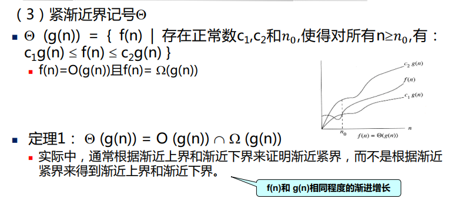
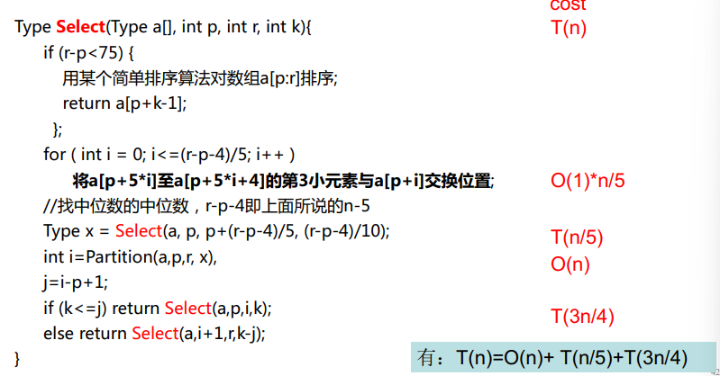

# 算法设计与分析

## 第一章 算法概述

 **算法书写规则**：

>算法名称：
>
>输入：
>
>输出：
>
>步骤：
>
>     - 1.
>     - 2.
>     - 。。。

对于算法的复杂性(算法所需要的计算机资源)，**输入数据的大小，时间复杂性T(n)和空间复杂性S(n)**

**算法渐近复杂性**

**算法步骤示例：**

复杂度分析实例：

## 第二章 递归与分支策略

**分治法的基本思想**：将一个规模为n的问题分解为k个规模较小的子问题，这些子问题互相独立且与原问题相同。

**分治条件**：

- 该问题的规模缩小到一定的程度就可以容易地解决；
- 该问题可以分解为若干个规模较小的相同问题，即该问题具有**最优子结构性质**
- 利用该问题分解出的子问题的解**可以合并**为该问题的解；
- 该问题所分解出的各个子问题是**相互独立**的，即子问题之间不包含公共的子问题。

### 1.二分搜索

$$
\mathrm{T}(\mathrm{n})=\left\{\begin{array}{ll}
1 & \mathrm{n}=1 \\
T\left(\frac{n}{2}\right)+1 & n>1
\end{array}\right.
$$

### 2.合并排序

$$
\mathrm{T}(\mathrm{n})=\left\{\begin{array}{ll}
O(1) & \mathrm{n}\le 1 \\
2T\left(\frac{n}{2}\right)+O(n) & n>1
\end{array}\right.
$$
最坏时间复杂度O(nlogn)

平均时间复杂度O(nlogn)

辅助空间O(n)

### 3.快速排序

最坏时间复杂度O(n^2)

平均时间复杂度O(nlogn)

辅助空间O(n)或者O(logn)

快排的优化，修改partition，设计出采用随机选择策略的快速排序算法

### 4.线性时间选择(第k选择问题)

与快排的异同点：

基本思想相同，即对输入数组进行递归划分。不同点则在于线性时间选择只对划分出的子数组之一进行递归处理

## 第三章 动态规划

A.动态规划基本思想：不管该子问题以后是否被用到，只要他被计算过，就将其填入表中，避免大量重复计算

B.**分治法和动态规划法的不同**：适用于动态规划求解的问题，其子问题往往不是互相独立的

C.动态规划的**基本步骤**：

1. 找出最优解的性质，并刻划其结构特征 
2. 递归地定义最优值
3. 以自底向上的方式计算出最优值 
4. 根据计算最优值时得到的信息，构造最优解

D.动态规划的**基本要素**：

​                          **最优子结构性质**：问题的最优解包含了子问题的最优解

​                          **重叠子问题性质**：求解问题时并不总是新问题

​                          **无后效性**

### 1.矩阵连乘问题

$$
m[i,j]=\left\{\begin{array}{11}
0&i = j \\\min_{i\le k< j} \left \{ m[i,k]+m[k+1,j]+p_{i-1} p_{k}p_{j} \right \} 
&i<j
\end{array}\right.
$$

循环体内的计算量为O(1)
3重循环的总次数为O(n3)。
因此算法的计算时间上界为O(n3)。
算法所占用的空间显然为O(n2)

最优子结构证明：

### 2.最长公共子序列LCS

$$
c[i][j] = \left\{\begin{matrix}
  0 & i = 0,j = 0\\
  c[i-1][j-1]+1&i,j>0;x_{i}=y_{j}  \\
  \max\begin{Bmatrix}{c[i][j-1],c[i-1][j]}
\end{Bmatrix}&i,j>0;x_{i}\ne y_{j}
\end{matrix}\right.
$$

最优子结构性质

时间复杂度：O(m n)      空间复杂度：O(m n)

### 3.0-1背包问题

物品i的重量是wi，其价值为vi，背包的容量为C。
**m[i,j]是背包容量为j，可选择物品为i，i+1,...,n时0-1背包问题的最优值.**
$$
m[i,j] = \left\{\begin{matrix}m[i+1,j]
  & 0\le j< w_{i} \\
  max\begin{Bmatrix}
  m[i+1,j],m[i+1][j-w_{i}]+v_{i}
\end{Bmatrix}&j\ge w_{i} 
\end{matrix}\right.
$$

时间复杂度：O(nC)
空间复杂度：O(nC)

### 4.凸多边形最优三角剖分

## 第四章 贪心算法

### 1.活动安排问题

### 2.哈夫曼编码

### 3.单源最短路径

### 4.最小生成树

## 第五章 回溯法

### 1.0-1背包问题

### 2.旅行售货员问题

## 第六章 分支限界法

### 1.单源最短路径

### 2.0-1背包问题

### 3.旅行售货员问题

