#                                PHP   
## 前言

------

PHP是安全中需要掌握的一门语言，就这么一点儿时间教网络安全，不可能精通，这里就不要求你精通PHP，但是对于一些基础代码能够认识、能够编写那么就可以了。

同时，这里需要和**HTML**结合，如果你HTML还没懂，那么就需要加强一些HTML的技术能力了。值得一提的是，你看网页中那么多HTML代码，真的是人去写的么，那是不现实的，都是通过**框架自动**生成的，像现在的少儿编程不也是一样么。


## 第一章 PHP语言学习介绍

web开发领域，PHP是将程序嵌入到HTML文档中执行，执行**效率**比完全生成HTML标记的CGI要高许多；PHP还可以执行编译后代码，编译可以达到加密和优化代码运行，**使代码运行更快**。

### 1.1 PHP部署安装环境

phpstudy 配置

### 1.2 PHP代码工具选择

phpstorm

## 第二章 PHP代码基本语法

### 2.1 PHP函数知识介绍

- [ x ] 任务一

```php
<?php
phpinfo();
?>
```

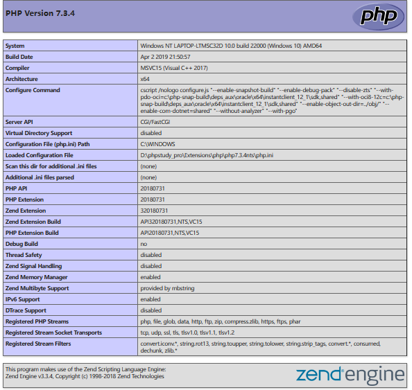

**phpinfo是一个函数（功能），这个函数会显示一个当前电脑（服务器）的详细的PHP信息。**

### 2.2 PHP常量变量介绍

#### 2.2.1 PHP变量知识：

```php
<?
$iphone = 5880;
$iphoneplus = 6088;
echo $iphone+iphoneplus;
?>
```

php的变量必须以$开始

变量情况的分类

1.可变变量

```php
<?php
// 服务器读取的  编码设置
header('Content-type:text/html;charset=utf-8');
//定义了一个变量叫作$shu 将$shu这个变量的值设为字符串的biao
$shu = "biao";
//定义了一个变量叫作$biao 将他的值设置为鼠标
$biao = "鼠标";
//$$shu就是可变变量；在已声明的变量$shu前又加上了一个变量符
echo $shu;
echo $$shu;
echo $biao;
?>
//<<biao鼠标鼠标
```

2.外部变量

```html 
<html>
  <head>
  </head>
  <body>
<!-- 这一行method 对应的值改为post --->
<form action="req.php" method="post">
<input type="text" name="username"/>
<input type="password" name="pwd"/>
<input type="submit" name="提交"/>
</form>
  </body>
</html>

```

PHP代码调用以上HTML代码中的外部变量方法如下所示：

```php
<?php
//$_POST[‘username’]，将username作为字符串放在中括号里面，就得到了表单里面的<input type=”text”name=”username”/>的值
$u = $_POST['username'];
echo $u.'<br />';
//$_POST[‘pwd’]，将pwd作为字符串放在中括号里面，就得到了表单里面的<input type=”text”name=”pwd”/>的值
$passwd = $_POST['pwd'];
echo $passwd.'<br />';
?>

```

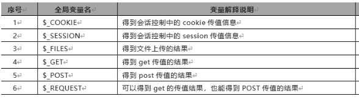


3.其他环境变量

```php
<?php
phpinfo();
?>
```

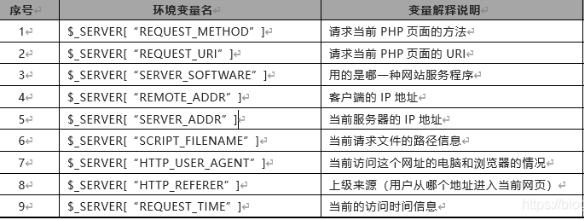

#### 2.2.2 PHP常量知识：

```php
define(常量名, 常量值)
    
<?php
define('MY_NAME','PHP中文网');
echo MY_NAME;
//下面是错误的调用方式
echo '我的名字是MY_NAME';
//下面是正确的调用方式
echo '我的名字是'.MY_NAME;
?>
```

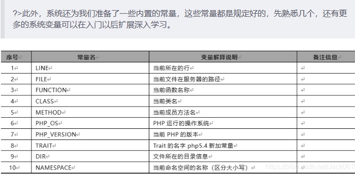

### 2.3 PHP注释信息介绍

```php
//		表示单行注释
#		表示单行注释，用的比较少
```

### 2.4 PHP数据类型介绍

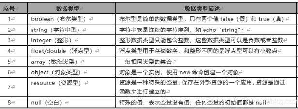

#### 2.4.1 整形数据类型

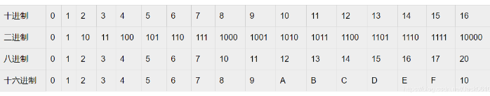

#### 2.4.2 布尔数据类型

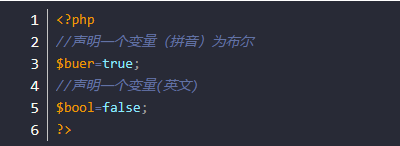

#### 2.4.3 字符串数据类型

```php
<?php
//声明字符串变量$zifu
$zifu='好好学习吧';
echo $zifu;
?>

<?php
//声明字符串变量$str
$str="我想好好学习";
echo $str;
?>
    
<?php
$dingjie = <<<ABC
//1、在变量后面的等号写三个小于号 <<<
//2、然后在<<<后面写上字符（建议英文大写字符）
  如果
      非要在这个测试
    前
        面<br />
       加上一段
    <i>有趣的话</i>
    我想说，<h1>努力学习不好么<h1>
ABC;
//3、然后换行写上任意想写的字符
//4、写完后，顶行。在行最开始处，再写上<<<后面的字符和分号。
echo $dingjie
?>

```

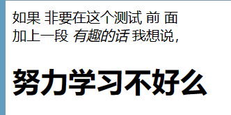

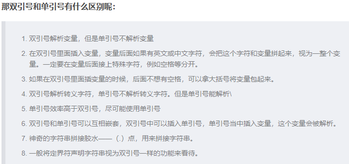

#### 2.4.4 浮点型数据类型

```php
<?php
//声明变量fudian的植为12121.3232
$fudian=12121.3232;
echo $fudian;
?>

<?php
//声明变量$f1的植为0.8873
$f1=0.8873;
var_dump($f1)
?>

```

var_dump() 函数用于输出变量的相关信息。显示关于一个或多个表达式的结构信息，包括表达式的类型与值。数组将递归展开值，通过缩进显示其结构。

#### 2.4.5 PHP数据类型之查看和判断数据类型

查看数据类型：
1、gettype（传入一个变量）能获得变量的类型
2、var_dump（传入一个变量）输出变量类型和值

```php
<?php
//声明一个变量88.8,可以自己多做几次实现换成其他类型看看$type输出是多少。
$float = 88.8;
$type = gettype($float);
echo $type;
?>

<?php
//多换几个类型试试
$str = '你喜欢男人还是喜欢女人';
$type = var_dump($str);
echo $type;
?>

```

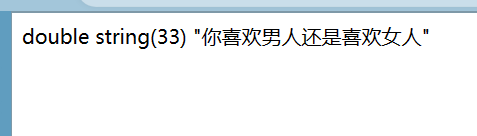

### 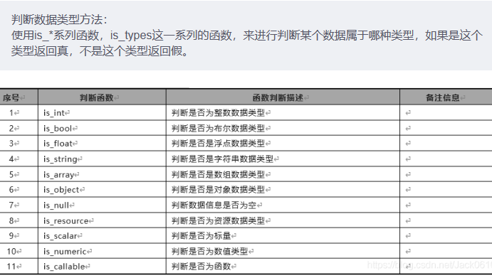

```php
<?php
//is_*系列函数有个特点，就是如果是这个类型的返回的值为真，不是这个数据类型就返回的是假
//声明类型为假
$fo = false;
if (is_bool($fo)) {
    echo '执行真区间';
}else{
    echo '执行假区间';
}
echo "<br />";

//检查未声明的变量$p是否为空，为空就执行真区间
if(is_null($p)) {
    echo '执行真区间';
}else{
    echo '执行假区间';
}
echo "<br />";

//字符串类型的数值，检查执行的真还是假
$str = '18.8';
if(is_numeric($str)) {
    echo '执行真区间';
}else{
    echo '执行假区间';
}
echo "<br />";

//把sca的值换为整数 浮点 布尔和字符串试试
$sca = true;
if(is_scalar($sca)) {
    echo '执行真区间';
}else{
    echo '执行假区间';
}
echo "<br />";

//换成echo，is_int试试，为什么echo执行假区间呢？
if(is_callable('var_dump')) {
    echo '执行真区间';
}else{
    echo '执行假区间';
}
echo "<br />";//这是换行代码
?>

```

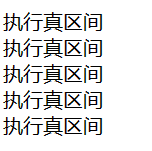

### 2.5 PHP流程控制语句

```php
<?php
//我们定义一个泡到美女的变量($pao)为true，意思为泡到了
$pao =fales;
if($pao){
    echo '林志玲，我爱死你了';
    echo '我愿意去死';
}else{
    echo '照骗，爱会消失的';
    echo '我不愿意去死';
}
?>
```

### 2.6 PHP算数运算方法

```php
<?php
$x=5;
$y=6;
//5+6为11
echo $x+$y;
?>
```

#### 2.6.1 PHP程序自加自减运算

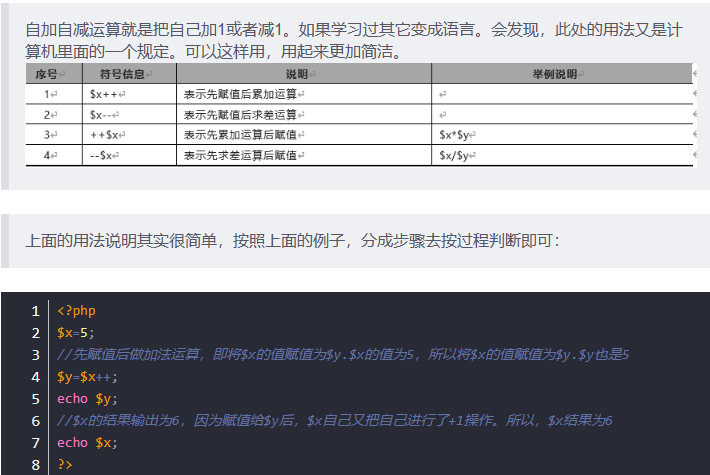

#### 2.6.2 PHP程序比较运算符号

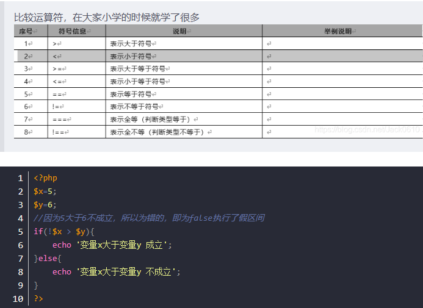

#### 2.6.3 PHP程序逻辑运算符号

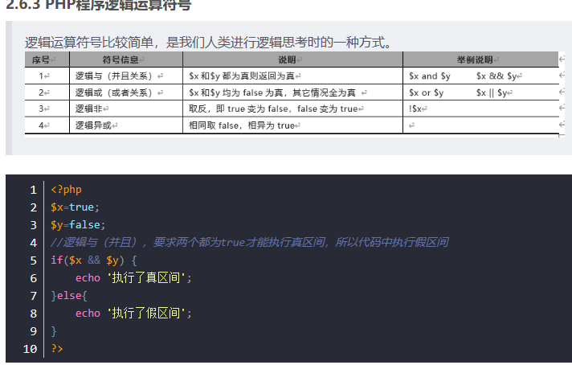

#### 2.6.4 PHP程序位运算

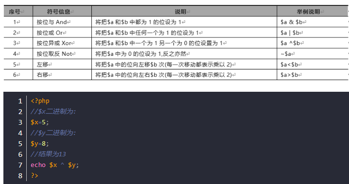

#### 2.6.5 PHP三元运算符合其它运算符

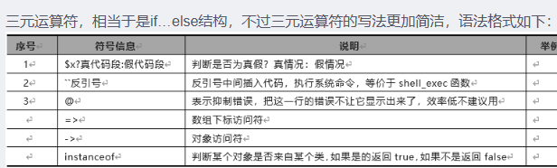

```php
<?php
$x=true;
$x?$y=5:$y=6;
//输出5
echo $y;
?>

<?php
echo '<pre>';
echo `ipconfig`;
echo '</pre>';
?>

```


## 第三章 PHP流程控制语句

### 3.1 if条件控制语句

```php
<?php
If(判断语句1){
   执行语句体1
}elseif（判断语句2）{
   执行语句体2
} elseif（判断语句n）{
   执行语句体n
}else{
   最后的else语句可选
}

```

### 3.2 if嵌套语句

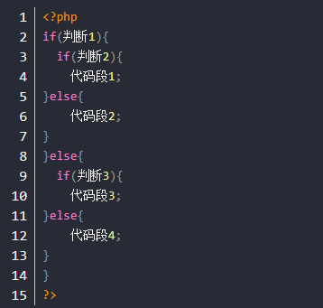

### 3.3 switch语句使用

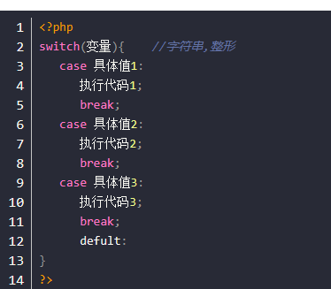

### 3.4 while循环语句说明

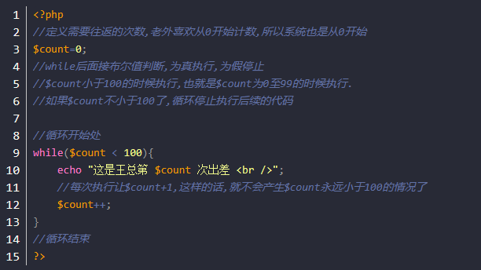

### 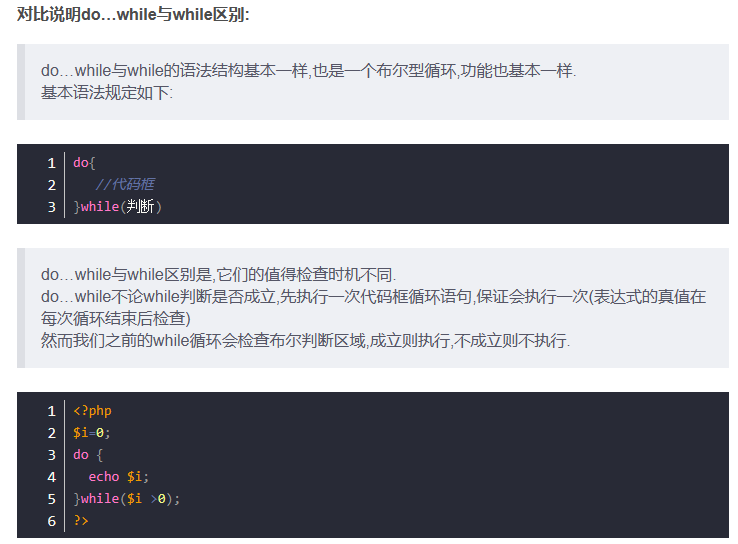3.5 for循环语句

```php
<?php
for($i=1;$i<=10;$i++)
  echo ‘分手后第’.$i.’年, 我全都忘了你的样子<br />’;
}
?>
```

## 第四章 PHP函数基本语法

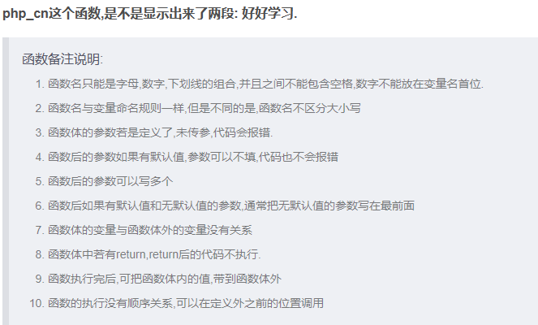

```php
Function 函数名(参数名1=[值1], 参数名2=[值2] , 参数名n=[值n])
{
    函数中的功能体
    [return 返回值]
}

<?php
function php_cn(){
    echo "好好学习";
    
}
php_cn();
php_cn();//调用函数
?>

```

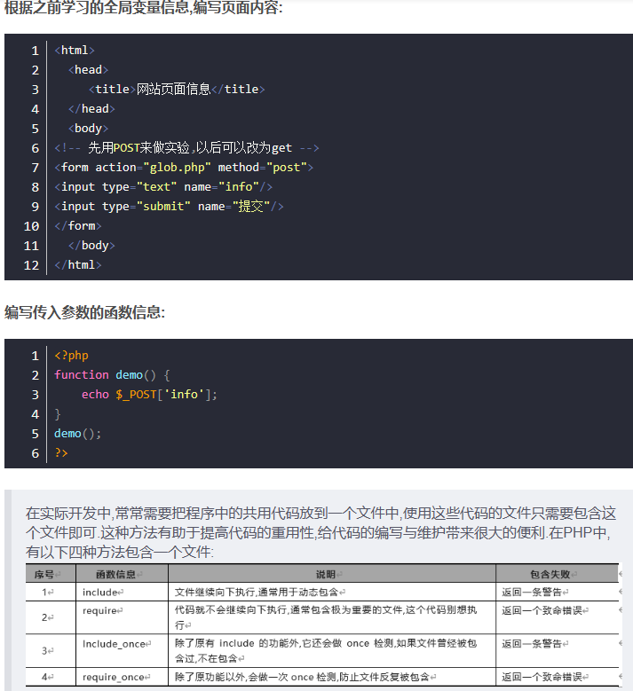

## 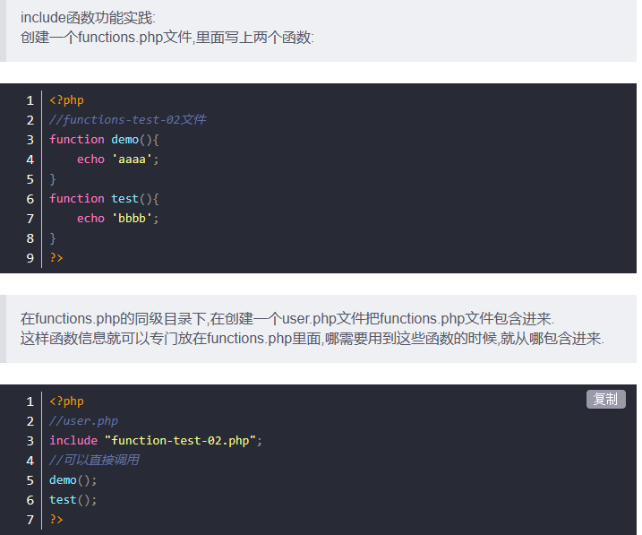

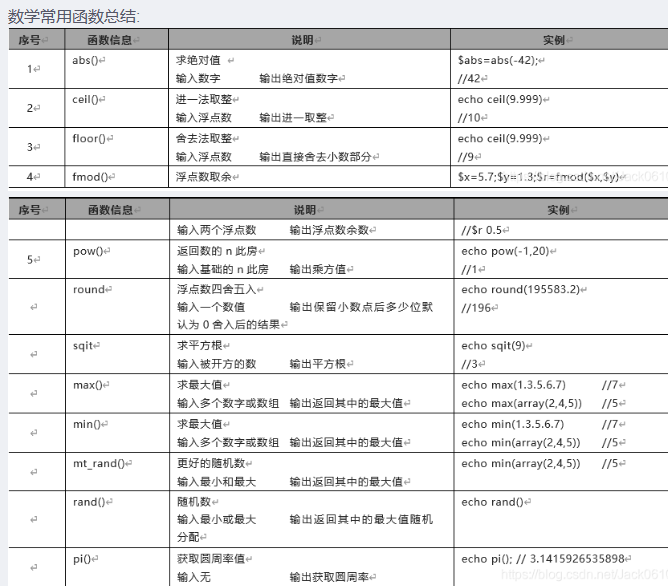

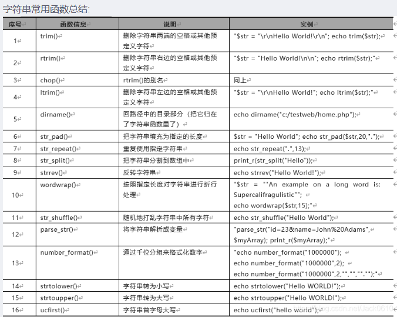

## 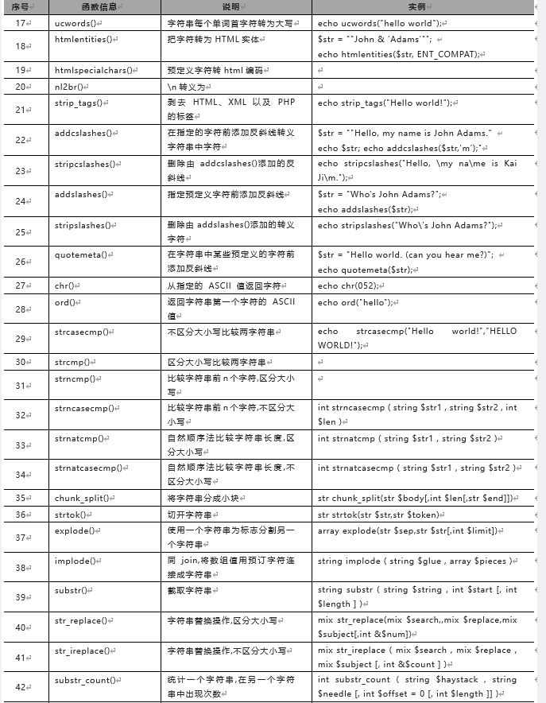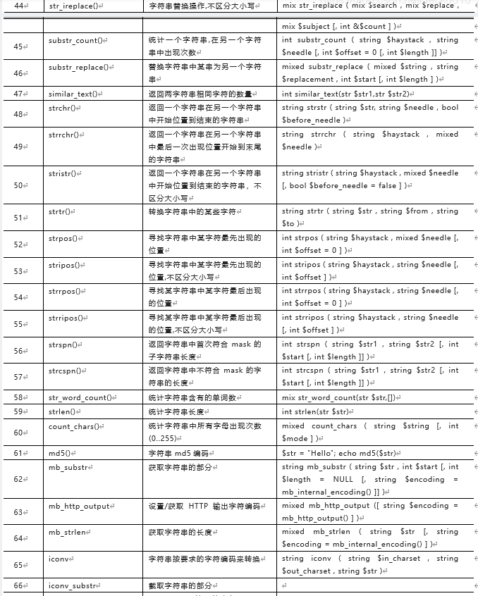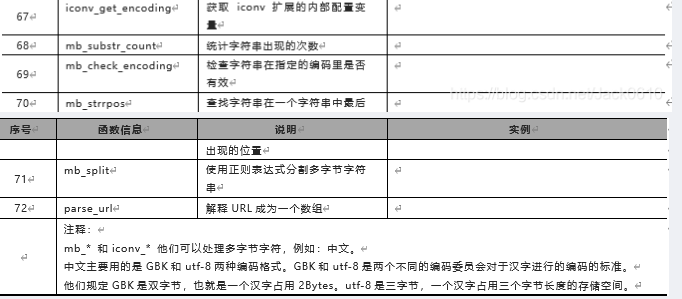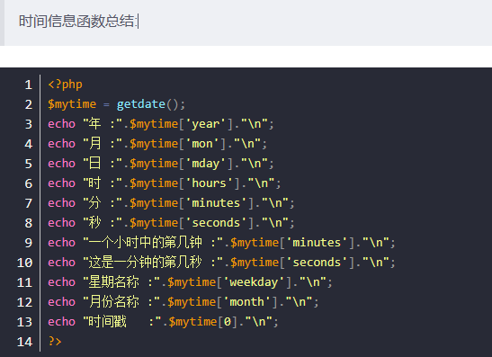第五章 PHP数组结构

```php
<?php
$shu = array(1 , 1.5 , true ,'天王盖地虎，小鸡炖蘑菇');
echo '<pre>';
var_dump($shu);
echo '</pre>';
?>
```

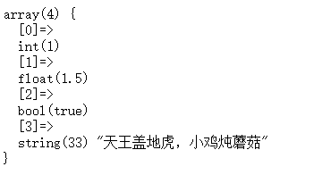

```php
<?php
$kele = array('只有不断努力才能博得未来',10 => 'NoAlike', 'PHP中文网' , '去PHP中文网学PHP', 19 => '苹果和梨子我都爱' , '橘子我最爱');
//打印显示$kele
echo '<pre>';
var_dump($kele[0]);
var_dump($kele[9]);
var_dump($kele[10]);
var_dump($kele[12]);
var_dump($kele[19]);
echo '</pre>';
?>

```

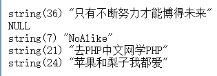

### 5.1 for循环遍历索引数组

```php
<?php
//声明一个数组，值为1到10
$num = array(1,2,3,4,5,6,7,8,9,10);

//按照索引数组的特点，下标从0开始。所以1的下标为0，10的下标为9
echo $num[0].'<br />';
echo $num[9].'<br />';

//我们可以得到数组中元素的总个数,为10
echo count($num) .'<br />';

//遍历这个索引数组的话，我们就可以定义一个变量为$i
//$i 的值为0，从0开始
//可以设定一个循环条件为：$i 在下标的(9)最大值之内循环
for($i = 0 ; $i < count($num) ; $i++){
   echo $num[$i].'<br />';
}
?>

```


### 5.2 常用操作数组函数

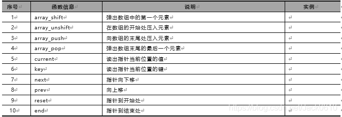

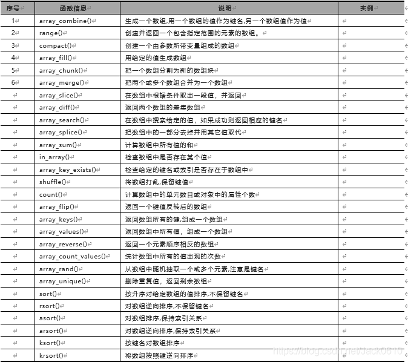

```php
<?php
$mingren = array("test", "test1", "test2", "test3");
$dc = array_shift($mingren);
echo $dc .'<br />';
print_r($mingren);
?>

```


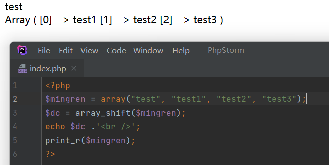

## 第六章 PHP正则表达式

正则表达是会在开发中经常看到，它主要用在以下一些地方：**匹配**邮箱、手机号码、验证码、替换敏感的关键词。例如：涉及政治和骂人的话

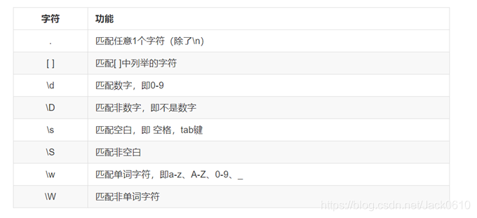

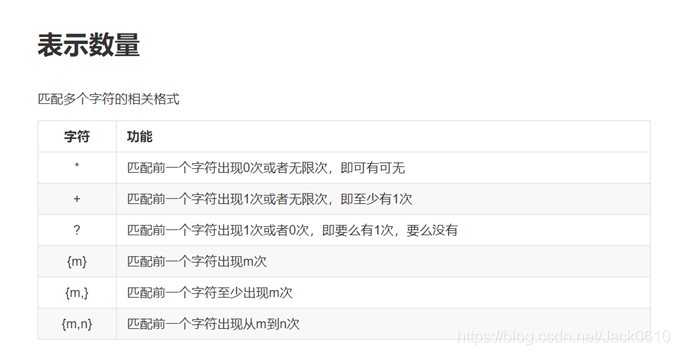

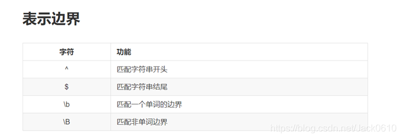

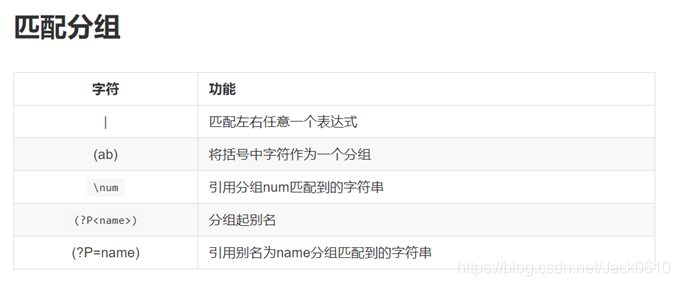

```php
例子						说明
/中间写正则/				正确
$中间写正则$				正确
%中间写正则%			    正确
^中间写正则^			    正确
@中间写正则@			    正确
(中间写正则)				错误  /\//
A中间写正则A			    错误
```

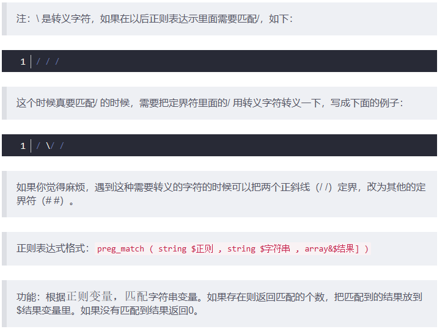

```php
<?php
$zz = '/wq/';
$string = 'ssssswqaaaaaa';
if(preg_match($zz, $string, $matches)){
   echo '匹配到了，结果为：';
   var_dump($matches);
}else{
   echo '没有匹配到';
}
?>
```

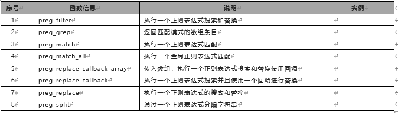


## 第七章 PHP文件系统管理

### 7.1 fopen、fread、fclose操作读取文件

### 7.2 PHP创建和修改文件内容

### 7.3 PHP创建临时文件

### 7.4 php移动、拷贝和删除文件

## 总结
