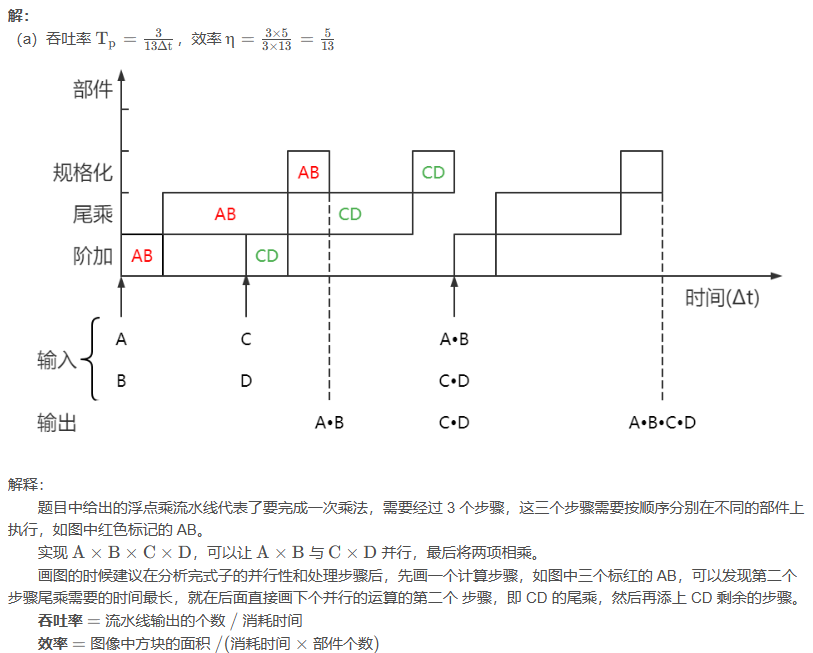

# 计算机体系结构

## 第 1 章 计算机系统结构概论

  不考大题。

## 第 2 章 数据表示、寻址方式与指令系统

### 1.浮点数尾数基值

**题目描述**：给出 **阶值、尾数位数、尾数基值**，计算 **最大最小阶值、阶的个数、最大最小尾数值、最大最小可表示值、可表示数个数**。

### 2. ROM 表

### 3. 哈夫曼码

**题目描述**：根据 **指令频度** 计算 **等长码**、**哈夫曼码**、**扩展操作码**平均码长

补充：
  1）画完哈夫曼树要检查，如果出现频度低的码长比频度高的短，一定是画错了；
  2）哈夫曼树的意思就是将节点的 2 个分支看作 0 和 1 的编码，假设左分支为 0，右分支为 1，最左边的 0.01 的指令编码为 000000，最右边 0.15 的指令编码为 111；

（3）两种码长的扩展操作码：
  哈夫曼编码是最优化的编码，但是也可以看出他的码长种类比较多，这样不利于译码，所以就在此基础上妥协为码长种类较少的扩展操作码。
  编码的时候短码不能是长码的前缀，例如一个指令是 001，另一个是 0011，个人理解是系统拿到一长串指令又不预先知道每个指令的长度那么就会混淆；可以看下哈夫曼树，它的构造方法就不会出现前缀的情况。

  本题就是在 4 种码长的哈夫曼码上转化成两种码长的扩展操作码。先观察哈夫曼码，14 条指令中 6 条码长是 3，3 位二进制表示数有 8 个，那么就会剩下 2 个作为长码的前缀；剩下还有 8 条指令，那么后缀就要能表示 4 个数，那么后缀用 2 位就可以了。所以本题就是 6 个频度高的码长为 3，8 个频度低的码长用 5。平均码长是一样算的，结果是 3.4。

补充：
  这里算起来有点凭感觉，但是一般指令数量和码长种类都不多，多算几种情况对比一下，有的时候频度集中在个别一两条指令的时候可以考虑让他们的码长短一些，然后剩下的码长长一些，也许会是更优解。

## 第 3 章 存储、中断、总线与 I/O 系统

### 1. 并行主存系统

### 2. 中断屏蔽位、程序运行图

怎么画的：
中断响应次序： 1 → 2 → 3 → 4 → 5 1\to2\to3\to4\to51→2→3→4→5
中断处理次序： 1 → 4 → 5 → 2 → 3 1\to4\to5\to2\to31→4→5→2→3
红色序号：图的框架，(4) 中断处理程序下面的序号对应中断响应次序
蓝色序号：
(1) 用户程序运行
(2) 同时出现 ②④ 中断请求
(3) 按照响应次序 ② 要先响应，但是 ④ 的处理优先级高，所以只响应不处理；响应的时间很短，往下凹一点点就代表响应
(4) ④ 响应并处理，短横线代表交换程序状态字的时间，理解为切换到中断处理程序
(5) ④ 处理完了回 ②
(6) 响应并处理 ②
(7) ② 还没处理完出现了 ①③⑤ 中断请求
(8) 打断 ② 的处理，响应 ①，由于此时 ① 的优先级最高，直接处理 ①
(9) ① 处理完后回到 ② 响应一下，此时因为还有高于 ② 的 ⑤ 还没处理所以先不处理 ②
(10) 响应并处理 ⑤
(11) 处理完 ⑤ 回到 ② 响应并继续处理 ② 剩余的部分
(12) ② 是从用户程序过来的，要先回到用户程序，再去处理 ③
(13) 响应并处理 ③
(14) ③ 处理完回到用户程序，继续执行用户程序

易错点：
（1）(9) 到 (10) 的过程中不响应 ③，理解为此时程序已经响应了 ②，导致中断屏蔽位屏蔽了 ③
（2）(11) 到 (12)，从哪儿来回哪儿去，② 是从用户程序来的，执行完要先回去，而不能直接去处理 ③
（3）(14)，最后回到用户程序的时候容易忘了画短横线

### 3. 通道流量设计

**题目描述**：根据通道 **选择设备** 和 **传送一个字节数据** 的时间，以及各个设备的 **工作速率(传送速率)** 或 **申请间隔**，计算不同类型通道的 **最高流量(极限流量)** 和 **能挂哪些设备**。

## 第 4 章 存储体系

### 1. 页表法地址映像

### 2. 页面替换算法：FIFO、LRU

课后习题 4-7 FIFO
  有一个虚拟存储器，主存有 0~3 四页位置，程序有 0~7 八个虚页，采用全相连映像和 FIFO 替换算法。给出如下程序页地址流：2, 3, 5, 2, 4, 0, 1, 2, 4, 6。
（1）假设程序的 2, 3, 5 页已先后装入主存的第 3, 2, 0 页位置，请画出上述页地址流工作过程中，主存各页位置上所装程序各页页号的变化过程图，标出命中时刻；
（2）求出此期间虚存总的命中率 H HH。

课后习题 4-11 FIFO
  考虑一个 920 个字的程序，其访问虚存的地址流为 20, 22, 208, 214, 146, 618, 370, 490, 492, 868, 916, 728。
（1）若页面大小为 200 字，主存容量为 400 字，采用 FIFO 替换算法，请按访存的各个时刻，写出其虚页地址流，计算主存的命中率；
（2）若页面大小改为 100 字，再做一遍；
（3）若页面大小改为 400 字，再做一遍；
（4）由前三问的结果可得出什么结论？
（5）若把主存容量增加到 800 字，按第（1）小题再做一遍，又可以得到什么结论？

### 3. 页面替换算法：堆栈模拟

### 4. Cache 组相联映像

课后习题 4-14 LRU
  有一个 Cache 存储器。主存共分 8 个块 (0~7)，Cache 为 4 个块 (0~3)，采用组相联映像，组内块数为 2 块，替换算法为 LRU。
（1）画出主存、Cache 地址的各字段对应关系图（标出位数）；
（2）画出主存、Cache 空间块的映像对应关系示意图；
（3）对于如下主存块地址流：1, 2, 4, 1, 3, 7, 0, 1, 2, 5, 4, 6, 4, 7, 2，如主存中内容一开始未装入 Cache 中，请列出 Cache 中各块随时间的使用状况；
（4）对于（3），指出块失效又发生块争用的时刻；
（5）对于（3），求出此期间 Cache 之命中率。

相关概念：
  之前页面替换算法的题目是把 虚存 的地址存到 主存 时发生替换，这里是把 主存 的地址存到 高速缓存 Cache 时发生替换，替换方法并没有区别，但是地址映像之前是 全相连映像，这里是 组相联映像。
  全相连映像：主存中任意一块都可映像装入到 Cache 中任意一块位置；就像之前的题目一样，每个虚地址都可以存到主存的任意一页中，没有限制。
  直接映像：主存空间按 Cache 大小等分成区，每个区内的个块只能按位置一一对应到 Cache 的相应块位置上；举例说明比较直接：主存有 0~7 共 8 个块，Cache 有 0~3 共4 个块，那么主存的 0、4 只能存到 Cache 的 0：
( 0 , 4 ) → 0
( 1 , 5 ) → 1
( 2 , 6 ) → 2 
( 3 , 7 ) → 3 
  组相联映像：Cache 分成若干组，主存按 Cache 分区，每个区也按 Cache 的样子分组，然后组和组之间直接映像，组和组内部的块相联映像；具体看本题答案可以直观理解。

### 5. 存储体系性能参数

## 第 5 章 流水和指令级高度并行的超级机

### 1. 重叠

### 2. 流水线

**题目描述**：画 **时空图**，计算流水线 **效率** 和 **吞吐率**，**瓶颈消除** 方法。

### 3. 流水预约表

### 4. CRAY-1 向量流水处理

## 6. 阵列处理机

### 1. 单级互连网络

### 2. 多级立方体网络

### 3. 并行存储器无冲突访问

## 7. 多处理机

### 1. 霍纳法则

### 2. FORK、JOIN 语句

## 8. 数据流机和归约机

  不考大题。
