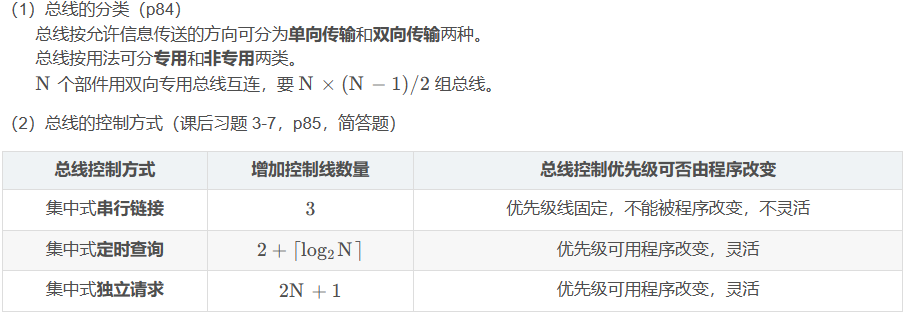
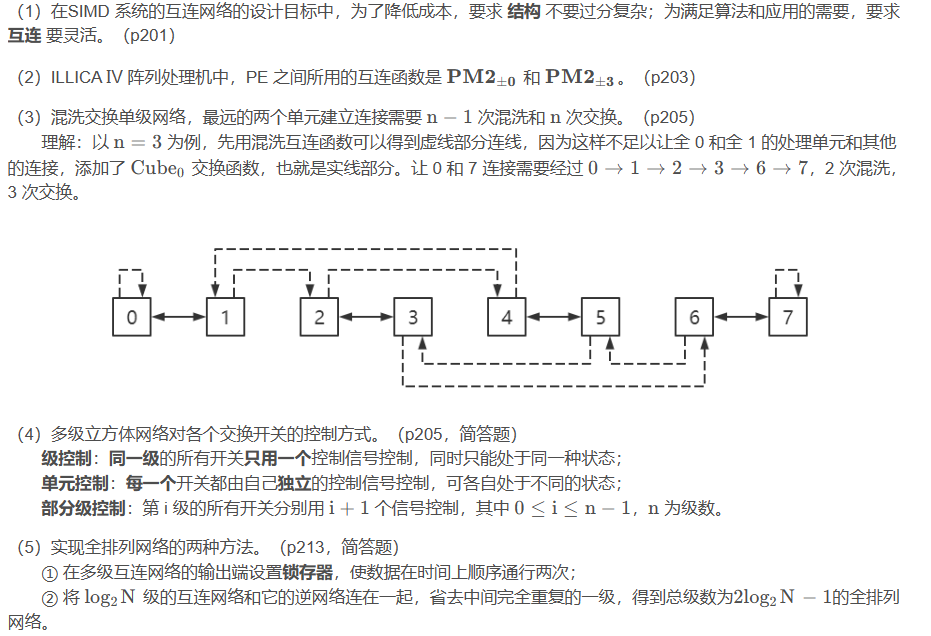

# 体系结构

## 1.计算机系统结构概论

1.1 计算机系统的多级层次结构
（1）计算机系统的多级层次结构（p1）
  M5：应用语言机器    应用语言程序 → 应用程序包翻译 →  高级语言程序
  M4：高级语言机器    高级语言程序 → 编译程序翻译 → 汇编语言
  M3：汇编语言机器    汇编语言程序 →汇编程序翻译 → 机器语言程序
  M2：操作系统机器    用机器语言程序解释作业控制语句
  M1：传统机器语言机器  用微指令程序解释机器指令
  M0：微程序机器     微指令由硬件直接执行

1.2 计算机系统结构、组成与实现
（1）定义和内涵（p3）
  计算机系统结构：也叫计算机系统的体系结构，它只是系统结构中的一部分，指的是传统机器级的系统结构。计算机系统结构研究的是软、硬件之间的功能分配以及对传统机器级界面的确定。
  计算机组成：计算机系统结构的逻辑实现，包括机器级内部的数据流和控制流的组成以及逻辑设计等。
  计算机实现：计算机组成的物理实现，包括处理机、主存等部件的物理结构，器件的集成度和速度，器件、模块、插件、底板的划分与连接，专用器件的设计，微组装技术，信号传输，电源、冷却及整机装配技术等。

（2）例子（p4）
例一：
  计算机系统结构：指令系统的确定。
  计算机组成：指令的实现，如取指令、指令操作码译码、计算操作数地址、取数、运算、送结果等的操作安排和排序。
  计算机实现：实现这些指令功能的具体电路、器件的设计及装配技术。

例二：
  计算机系统结构：确定指令系统中是否要设乘法指令。
  计算机组成：乘法指令是用专门的高速乘法器实现，还是靠用加法器和移位器经一连串时序信号控制其相加和右移来实现。
  计算机实现：乘法器、加法-移位器的物理实现，如器件的类型、集成度、数量、价格，微组装技术的确定和选择。

例三：
  计算机系统结构：主存容量与编址方式（按位、按字节还是按字访问等）的确定。
  计算机组成：为达到性能价格要求，主存速度应该为多少，逻辑结构是否采用多体交叉。
  计算机实现：主存器件的选定、逻辑设计、微组装技术的使用。

1.3 计算机系统的软硬取舍、性能评测及定量设计原理
（1）程序访问的局部性定律（p13）
  程序访问的局部性包括了时间上和空间上的两个局部性。

（2）计算机系统设计方法（p14）
  计算机系统设计方法最好是从中间向两边设计。（中间确定软硬件功能分配，然后往两边）

1.4 软件、应用、器件对系统结构的影响
（1）实现软件移植的技术途径及其适用环境。（p15~17，简答题）
  ① 统一高级语言：适用于结构完全相同以至完全不同的机器之间的高级语言程序应用软件的移植；
  ② 采用系列机：适用于结构相同或相近的机器之间的汇编语言应用软件和部分系统软件的移植；
  ③ 模拟与仿真：适用于结构不同的机器之间的机器语言程序的移植。

（2）模拟与仿真的概念及两者区别（p17，简答题）
  模拟：用机器语言程序解释实现软件移植的方法。
  仿真：用微程序直接解释另一种机器指令系统的方法。
  模拟与仿真的主要区别在于解释用的语言及其存储的位置，
  模拟是用机器语言程序解释，其解释程序存储于主存中；
  仿真是用微程序解释，其解释程序存储于控制存储器中。

1.5 系统结构中的并行性发展和计算机系统的分类
（1）提高计算机系统并行性技术的三个途径。（p24，简答题）
  ① 时间重叠：在并行性概念中引入时间因素，让多个处理过程在时间上相互错开，轮流重叠地使用同一套硬件设备的各个部分，加快硬件周转来赢得速度。
  ② 资源重复：在并行概念中引入空间因素，通过重复设置硬件资源来提高可靠性或性能。
  ③ 资源共享：用软件方法让多个用户按一定时间顺序轮流使用同一套资源来提高资源利用率，从而提高系统的性能。

（2）弗林提出按 指令流 和 数据流 的多倍性对计算机系统进行分类。（p26）
  ① 单指令流单数据流 SISD：传统单处理器计算机；
  ② 单指令流多数据流SIMD：阵列处理机（ILLICA Ⅳ、分布式存储器阵列处理机）；相联处理机；
  ③ 多指令流单数据流 MISD：处理机间的宏流水；脉动阵列流水机；
  ④ 多指令流多数据流MIMD：多处理机；

## 2.数据表示、寻址方式与指令系统

2.1 数据表示
（1）标志符和数据描述符的差别（课后习题 2-2，p32~36，简答题）
  标志符是和每个数据相连的，合存在一个存储单元中，描述单个数据的类型特征；
  数据描述符是与数据分开存放，用于描述所要访问的数据是整块的还是单个的，访问该数据块或数据元素所要的地址以及其他信息。

（2）尾基 r m的影响。（p42）
  rm越大，可表示数范围越大，可表示数的个数越多，数在数轴上的分布越稀疏，可表示的精度越低，运算中的精度损失越小，运算速度越快。

（3）浮点数尾数的下溢处理方法。（p44）
  ① 截断法：实现简单，不增加硬件，不需要处理时间。
  ② 舍入法：最大误差 0.5，统计平均误差趋于 0。
  ③ 恒置 “1” 法：平均误差趋于 0，最大误差最大。
  ④ 查表舍入法：平均误差可调节到 0，是最好的方法。

2.2 寻址方式
（1）指令中常用下列寻址方式来得到操作数：立即操作数、间接寻址、直接寻址、寄存器寻址、自相对寻址。请分别说明这些寻址方式的原理，并对它们在如下四个方面进行比较：（课后习题 2-8）
① 可表示操作数的范围大小；
② 除取指外，为获得操作数所需访主存的最少次数；
③ 为指明该操作数所占用指令中的信息位数多少；
④ 寻址复杂性程度。

立即寻址
  立即操作数的寻址原理是，操作数以常数形式直接存放在指令中操作码的后面。一旦指令被取出，操作数也被取得，立即可以使用。
① 立即操作数由于受机器指令字长的限制，可表示数的范围小，一般为 8 位或 16 位的二进制常数。
② 指令取出后，为获得操作数不需要再访存，即访存 0 次。
③ 操作数所占用指令中的信息位数是立即数在可表示最大值范围时所要占用的二进位位数。
④ 寻址的复杂性程度相对低。

间接寻址
  间接寻址可以有寄存器间接寻址和存储器间接寻址两种。其寻址原理是，在指令的操作数地址字段上只给出存放操作数在内存中物理地址的寄存器号或存储单元地址。先由指令操作数地址字段，从寄存器或存储单元中取出数在存储器中的地址。再按此地址访存，才能间接取得所要的操作数。
① 间接寻址访问到的操作数范围大，可以是主存中能访问到可表示数值范围最大的数。
② 除取指外，获得所需操作数所需访问主存的最少次数，对于寄存器间接寻址为一次，对于存储器间接寻址为两次。
③ 为指明该操作数所占用指令中的信息位数，对于寄存器间接寻址来说，只是为寄存器标号所占用的二进位位数，这种位数一般很短；而对于存储器间接寻址来说，需占访存逻辑地址所需的全部位数。
④ 间接寻址的复杂性一般最高。其中，寄存器间接寻址较存储器间接寻址简单，最复杂的是存储器多重间接寻址。

直接寻址
  直接寻址的原理是，由指令中操作数地址码字段给出存放操作数在内存中的有效地址或物理地址。
① 直接寻址可表示操作数值的范围大，可以是主存中能访问的可表示值范围最大的数。
② 除取指外，为获得所需操作数，需要再访问一次主存。
③ 为指明操作数所占用指令中的信息位数，是访存单元的有效地址或物理地址所需要的位数。
④ 直接寻址的复杂性较寄存器寻址的大，而它较寄存器间接寻址要简单些。

寄存器寻址
  寄存器寻址的原理是，指令的操作数地址码字段给出存放操作数所用的寄存器号。
① 可表示操作数的范围大小取决于存放操作数所用的寄存器的二进位位数。
② 除取指外，为获得操作数不用访存，即访存 0 次。
③ 为指明操作数所占用指令中的信息位数，只是寄存器编号所占的二进位位数，很短。
④ 寄存器寻址简单，其取数的时间要比访存的时间短得多。

自相对寻址
  自相对寻址方式主要用于转移指令形成转向目标地址，有的也用于访问存储器寻找操作数，以访问存储器操作数寻址为例，指令中操作数字段给出所访问操作数存放在主存中相对于指令计数器当前值的位移地址。
① 自相对寻址所寻址的操作数可表示范围大，可以是主存中能访问的可表示值范围最大的值。
② 除取指外，为获得操作数所需访问的次数为 1 次。
③ 为指明该操作数所占用指令中的信息位数取决于允许的最大相对位移量大小。
④ 寻址复杂性较直接寻址的略复杂些。

2.3 指令系统的设计和优化
2.4 指令系统的发展和改进
（1）在机器指令系统的设计、发展和改进上有两种不同的途径和方向，分别是 复杂指令系统计算机 (CISC) 和 精简指令系统计算机 (RISC)。（p57）

（2）设计 RISC 的基本原则（p63，简答题）
  ① 确定指令系统时，只选择使用频度很高的指令，再增加少量能有效支持操作系统、高级语言实现及其他功能的指令；
  ② 减少指令系统所用寻址方式种类；
  ③ 让所有指令都在一个机器周期内完成；
  ④ 扩大通用寄存器数，尽量减少访存；
  ⑤ 大多数指令都用硬联控制实现，少数指令用微程序实现；
  ⑥ 通过精简指令和优化设计编译程序，简单有效地支持高级语言的实现。

（3）设计 RISC 结构的基本技术。（p64~66，简答题）
  ① 按照设计 RISC 的一般原则来设计；
  ② 逻辑实现采用硬联和微程序相结合；
  ③ 在 CPU 中设置大量工作寄存器并采用重叠寄存器窗口；
  ④ 指令用流水和延迟转移；
  ⑤ 采用高速缓冲存储器 Cache，设置指令 Cache 和数据 Cache 分别存放指令和数据；
  ⑥ 优化设计编译系统。

## 3.存储、中断、总线与I/O 系统

3.1 存储系统的基本要求和并行主存系统
（1）并行主存系统是指能并行读出多个 CPU 字的 单体多字 和 多体单字、多体多字 的交叉访问主存系统。（p75）

（2）提高模 m值，影响主存实际频宽的因素及结果。（p76，简答题）
  原因一：对模 m交叉，若都是顺序取指，效率可提高到 m倍。但实际程序中指令不总是顺序执行的，一旦出现转移，效率会下降。转移频率越高，并行主存系统效率下降越大。而数据的顺序性比指令要差，实际的频宽还可能要低一些。
  原因二：工程实现上由于模 m越大，存储器数据总线越长，总线上并联的负载越重，有时还不得不增加门的级数，会使传输延迟增加。
  结果：提高模 m 值能提高主存系统的最大频宽，但主存的实际频宽并不随 m值增大而线性提高，实际效率并不像所希望的那么高。

3.2 中断系统
（1）中断概念（p77，简答题）
  中断是指 CPU 中止正在执行的程序，转去处理随机提出的请求，待处理完后，再回到原先被打断的程序继续恢复执行的过程。

（2）中断的分类依据及分类的目的。（课后习题 3-3，p78，简答题）
  分类依据：将中断源性质相近、中断处理过程类似的归为一类；
  分类的目的：减少中断处理程序的入口，每一类给一个中断服务程序总入口，可以减少中断服务程序入口地址形成的硬件数量。

（3）中断分类（p78）
  中断可分为内部中断、外部中断和软件中断三类。内部中断由 CPU 内的异常引起，外部中断由中断信号引起，软件中断由自陷指令引起。
  IBM 370 把中断分为 6 类：
  ① 机器校验：设备故障（电源故障、运算电路误动作、主存出错、通道动作故障、处理器硬件故障）
  ② 管理程序调用
  ③ 程序性：指令和数据的格式错误、程序执行中出现异常
  ④ 外部：来自机器外部（定时器中断、外部信号中断、中断键中断）
  ⑤ 输入 / 输出
  ⑥ 重新启动

（3）IBM 370 中断响应优先次序。（课后习题 3-4，p79）
  由高到低：紧急的机器校验、访管、管理程序调用和程序性、可抑制的机器校验、外部、输入 / 输出、重新启动

（4）中断系统采用软硬件结合的好处（p83，简答题）
  中断响应用排队器硬件实现可以加快响应和断点现场的保存；
  中断处理采用软的技术可以提供很大的灵活性。

3.3 总线系统

（3）总线的各个控制方式优缺点（课后习题3-8，p85，简答题)
  ① 串行链接
  优点：选择算法简单，用于解决总线控制分配的控制线的线数少，只需要 3 根，且不取决于部件的数量；部件的增减容易，只需要简单地把它连到总线上或从总线上去掉即可，可扩充性好；逻辑简单，容易通过重复设置提高可靠性。
  缺点：对“总线可用”线及其有关电路的失效敏感；优先级是线连固定，不能由程序改变，不灵活；因“总线可用”信号必须顺序脉动地通过各个部件，所以限制了总线的分配速度；因受总线长度的限制，增减或移动部件也受到限制。
  ② 定时查询
  优点：因计数器初值、部件号均可由程序置定，优先次序可用程序控制，灵活性强；不会因某个部件失效而影响其他部件对总线的使用，可靠性强。
  缺点：控制线的线数较多，需 2 + ⌈ l o g 2 N ⌉ 根；可以共享总线的部件数受限于定时查询线的线数（编址能力)，扩展性稍差；控制较为复杂；总线分配的速度取决于计数信号的频率和部件数，不能很高。
  ③ 独立请求
  优点：总线分配速度快，所有部件的总线请求同时送到总线控制器，不用查询；控制器可以使用程序可控的预定方式、自适应方式、循环方式或它们的混合方式灵活确定下一个使用总线的部件；能方便地隔离失效部件的请求。
  缺点：控制线数量过大，为控制 N个设备必须有 2 N + 1  根控制线，且总线控制器要复杂很多。

3.4 输入 / 输出系统
（1）字节多路通道、数组多路通道、选择通道分别适用连接的设备及各通道的特点。（p94，简答题）
  字节多路通道：适用于连接大量的字符类低速设备， 传送一个字符 (字节) 的时间很短，但字符 (字节) 间的等待时间很长；
  数组多路通道：适用于连接多台高速设备， 设备的传送速率很高，但传送开始前的寻址辅助操作时间很长；
  选择通道：适用于连接优先级高的高速设备，在数据传送期内独占通道，只能执行一道通道程序。

（2）字节多路、数组多路和选择通道的数据传送方式。（习题 3-10，p94，简答题）
  字节多路通道每选择好一台设备后，设备与通道只传送一个字节就释放总线，通道以字节交叉的方式轮流为多台低速设备服务。某台设备要想传送 n 个字节，就需经 n 次申请使用通道总线才行。
  数组多路通道在每选择好一台设备后，要连续传送完固定 K个字节的成组数据后，才释放总线，通道再去选择下一台设备，再传送该设备 K个字节。如此，以成组方式轮流交叉地为多台高速设备服务。某台设备要想传送 n 个字节，就需要先后经 ⌈ n / K ⌉次申请使用通道总线才行。
  选择通道每选择一台设备，就让该设备独占通道，将 n个字节全部传送完后，才释放通道总线，又去选择下一台设备，再传送它的全部字节数据。因此，每台设备为传送 n 个字节数据只需一次申请使用通道总线。

## 4.存储体系

4.1 存储体系的概念
（1）提出虚拟存储器的原因。（p101，简答题）
  虚拟存储器是从主存容量满足不了要求而提出来的。

4.2 虚拟存储器
（1）虚拟存储器的存储管理方式按存储映像算法不同，有 段式、页式 和 段页式 等。（p104，简答题）

（2）页式虚拟存储器页面失效和实页冲突发生的原因及所确定替换算法的依据。（p112，简答题）
  当处理机要用到的指令或数据不在主存中时，会发生页面失效；
  当主存已满且发生页面失效时，会发生实页冲突。
  替换算法的确定主要看主存是否有高的命中率、是否便于实现和辅助软硬件成本是否低。

（3）虚拟存储器的等效访问速度受主存命中率和访问主存时间影响。主存命中率受页地址流、页面调度策略、替换算法、页面大小、分配给程序的页数 (主存容量) 等因素影响。（p119）

4.3 高速缓冲存储器
（1）Cache 全相联映像的概念及其优缺点。（p126，简答题）
  Cache 全相联映像是主存中任意一块都可映像装入 Cache 中的任意一块位置的地址映像。
  优点：块冲突概率最低，只有当 Cache 全部装满才可能出现块冲突，Cache 的空间利用率最高；
  缺点：要构成容量为
$$
2^{n_{cb}}
$$
项的相联存储器的代价太大； Cache 容量很大时，其查表速度很难提高。

（2）组相联映像 指的是各组之间是 直接 映像，而组内各块之间是 全相联 映像。（p129）

（3）Cache 的写策略主要包括 写回法 (抵触修改法) 和 写直达法 (存直达法) 两种。

4.4 Cache — 主存 — 辅存三级层次
4.5 主存保护

## 5.流水和指令级高度并行的超级机

5.1 重叠方式
（1）标量处理机的重叠方式中二次相关的是指令 k与指令 k+2 存在先写后读相关。（p154）
  一次、二次指的是相关指令相隔的指令条数；写写相关指的是两条指令都要往同一个单元写入内容。

5.2 流水方式
（1）流水的分类（p157）
  ① 依据向下扩展和向上扩展的思路，可分为计算机功能子过程的流水线和多个处理机之间的流水线。
  ② 流水按处理的级别可分为部件级、处理机级和系统级。
    部件级：构成部件内各个子部件间的流水；
    处理机级：构成处理机的各部件之间的流水；
    系统级：构成计算机系统的多个处理机之间的流水。
  ③ 从流水具有功能的多少，可分为单功能流水线和多功能流水线。
    单功能流水：只能实现单一功能的流水，要完成多功能的流水将多个单功能流水组合。
    多功能流水：同一流水线的各个段之间可以有多种不同的连接方式，以实现不同的功能。
    按多功能流水线的各段能否允许同时用于多种不同功能连接流水，可把流水线分为静态流水线和动态流水线。
    静态流水线在某一段时间内各段只能按一种功能连接流水。
  ④ 从计算机所具有的数据表示，分为标量流水机和向量流水机。
  ⑤ 从流水线中各功能段之间是否有反馈回路，分为线性流水和非线性流水。

（2）总结 IBM360/91 解决流水控制的一般方法、途径和特点。（课后习题 5-10，简答题）
  采用流水控制的方法是总线式分布处理。
  途径：
  ① 在各个寄存器中设置忙位标志来判断是否相关。当寄存器正在使用时，置该寄存器的忙位标志为 “1”；当寄存器被释放，其忙位标志清为 “0”。因此，访问寄存器时，先看忙位标志，如为 “1”， 表示相关。
  ② 设置多条流水线，让它们并行地工作，同时在分布于各流水线的入、出端上分别设置若干个保存站来缓冲存放信息。一旦相关后，采用异步方式流动。
  ③ 通过分布设置的站号来控制相关专用通路的连接。
  ④ 相关专用通路采用总线方式，相关后通过更改站号来实现不同相关专用通路的连接。
  特点：
  ① 不必对进入流水线各条指令的源操作数地址和目的操作数地址做两两配对的比较，就可判知是否发生了相关。所以，相关判断的控制大大简化。
  ② 对于异步流动的先写后读、先读后写以及写写三类相关都能很方便且不加区分地予以解决。
  ③ 相关专用通路采用总线方式，使该通路可以为各种相关所共用，大大简化了硬件。
  ④ 多条流水线采取异步并行，且多条相关的指令可以一直链接下去，使系统有高的性能

（3）流水线机器全局性相关的概念及处理全局性相关的四种方法。（p169，简答题）
  全局性相关指的是已进入流水线的转移指令和其后续指令之间相关。
  处理全局性相关的四种方法有：猜测法、加快和提前形成条件码、采取延迟转移、加快短循环程序的处理。

（4）全局相关处理中，采用猜测法猜错后保证恢复分支点原先现场的方法。（p170，简答题）
  方法一，采取对指令只译码和准备操作数，在转移条件码出现之前不进行运算；
  方法二，让指令运算完但不送回运算结果，只要猜对分支可送回运算结果；
  方法三，采用后援寄存器把可能被破坏的原始状态保存起来，一旦猜错，就取出后援寄存器中的内容来恢复分支点的现场。

（5）流水机器的中断处理（p171）
  流水机器 IBM 360 / 91 对指令中断的处理方法是不精确断点法。

5.3 向量的流水处理与向量流水处理机
（1）CRAY - 1 向量处理的一个显著特点是只要不出现功能部件使用冲突和源向量寄存器使用冲突，通过链接机构可使有数据相关的向量指令仍能大部分时间并行执行。

5.4 指令级高度并行的超级处理机
（1）超标量处理机与超流水处理机的区别。（p188，简答题）
  ① 超标量处理机 是利用资源重复，设置多个执行部件寄存器堆端口；
  ② 超流水处理机 是着重开发时间并行，在公共的硬件上采用较短的时钟周期，深度流水来提高速度，需使用高速的时钟机制来实现。

（2）超标量超流水线处理机是 超标量流水线 和 超流水线 处理机的结合。（p188）

## 6.阵列处理机

6.1 阵列处理机的原理

6.3 共享主存构形阵列处理机中并行存储器的无冲突访问
6.4 脉动阵列处理机
（1）脉动阵列结构的特点。（p218，简答题）
  ① 结构简单、规整，模块化强，可扩充性好，非常适合用超大规模集成电路实现。
  ② 处理单元 (PE) 间数据通信距离短、规则，使数据流和控制流的设计、同步控制等均简单规整。
  ③ 脉动阵列中所有 PE 能同时运算，具有极高的计算并行性，可通过流水获得很高的运算效率和吞吐率。
  ④ 脉动阵列结构的构形与特定计算任务和算法密切相关，具有某种专用性。

## 7.多处理机

7.1 多处理机的概念、问题和硬件结构
（1）多处理机的概念（p223，简答题）
  多处理机是指有两台以上的处理机，共享 I/O 子系统，机间经共享主存或高速通信网络通信，在统一操作系统控制下，协同求解大而复杂问题的计算机系统。

（2）设计多处理机的目的。（p223，简答题）
  ① 通过多台处理机对多个作业、任务进行并行执行来提高解题速度，从而提高系统的整体性能;
  ② 使用冗余的多个处理机通过重新组织来提高系统的可靠性、适应性和可用性。

（3）由于应用的目的和结构不同，多处理机有 同构型、异构型 和 分布型 三种。（p223）

（4）多处理机与阵列处理机在指令流和并行等级的区别。（p223，简答题）
  阵列处理机：单指令流多数据流，主要针对向量、数组处理，实现向量指令操作级的并行，是开发并行性的同时性；
  多处理机：多指令流多数据流，实现的是更高一级的作业或任务间的并行，是开发并行性的并发性。

（5）多处理机有紧耦合和松耦合两种不同的构形。（p224，简答题）

（6）松耦合多处理机中，每台处理机都有一个容量较大的 局部存储器，用于存储经常用的指令和数据，以减少紧耦合系统中存在的 访主存 冲突。（p226）

（7）采用分布式结构的多处理机机间互连形式为开关枢纽结构。（p232）

7.2 紧耦合多处理机多 Cache 的一致性问题
（1）紧耦合多处理机中解决多 Cache 一致性的办法。（p236~237，简答题）
  ① 解决进程迁移引起的多 Cache 不一致性，可以通过禁止进程迁移的方法予以解决，也可以在进程挂起时，靠硬件方法将 Cache 中该进程改写过的信息块 强制写回主存相应位置。
  ② 以硬件为基础实现多 Cache 的一致性，主要有监视 Cache 协议法，即各个处理机中的 Cache 控制器随时都在监视着其他 Cache 的行动。另一种是目录表法，建立一个目录表，记录每一个数据块的使用情况。
  ③ 以软件为基础实现多 Cache 的一致性，例如依靠编译程序的分析，不把一些公用的可写数据存入 Cache 中。

7.3 多处理机的并行性和性能
（1）多处理机程序并行性（p240~242）
  ① “先写后读” 数据相关：不能并行执行，特殊情况可以交换串行
  ② “先读后写” 数据反相关：不能交换串行，硬件上保证对相关单元先读后写次序就可以并行
  ③ “写写” 数据输出相关：不能交换串行，保证先写后写顺序就能并行
  ④ 同时 “先写后读” 和 “先读后写” 两种相关：必须并行执行，不能顺序串行也不能交换串行。
理解：
  “先写后读” 如：A=B+D; C=A*E 第二步的输入用到第一步的输出，能交换串行的特殊情况是 A=2*A; A=3*A
  “先读后写” 如：C=A+E; A=B*D 第二步会输出第一步的输入
  “写写” 如：A=B+D; A=C+E 两步的输出相同
  同时 “先写后读” 和 “先读后写” 如：A=B; B=A 交换数据
  交换就是两步计算交换顺序，串行就是顺序执行

（2）多处理机任务粒度（p247）
  任务粒度过小，辅助开销大，系统效率低；
  任务粒度过大，并行度低，性能不会很高。
  处理机之间通信较少的应用程序宜用 细粒度 处理，要求冗长计算才能得到结果的题目宜用 粗粒度 处理。

7.4 多处理机的操作系统
（1）多处理机操作系统有 3 种类型： 主从型、各自独立型 和 浮动型。（p248）

7.5 多处理机的发展
（1）对称多处理机的各个处理器的地位是均等的，可以同等地访问 共享存储器、I/O 设备和运行操作系统。（p250）

## 8.数据流机和归约机

（1）传统的 Von Neumann 型计算机采用控制驱动方式；非 Von Neumann 型计算机包括使用数据流语言，基于数据驱动的数据流计算机；使用函数语言，基于需求驱动的归约机。（p256）

8.1 数据流计算机
（1）数据流计算机中的数据驱动的策略是 滞后求值。（p258）

（2）根据对 数据令牌 处理的方式不同，数据流计算机可以划分为 静态 和 动态 两种类型。（p263）

（3）数据流机器存在的问题。（p264）
  ① 数据流机主要目的是为了提高操作级并行的开发水平，但如果题目本身数据相关性很强，内涵并行性成分不多时，就会使效率反而比传统的 Von Neumann 型机的还要低。
  ② 在数据流机器中为给数据建立、识别、处理标记，需要花费较多的辅助开销和较大的存储空间。
  ③ 数据流机不保存数组。对标量运算有利，而对数组、递归及其他高级操作比较难管理。
  ④ 数据流语言的变量代表数值而不是存储单元位置，使程序员无法控制存储分配。为有效回收不用的存储单元，增大了编译程序的难度。
  ⑤ 数据流机互连网络设计困难，输入 / 输出系统仍不够完善。
  ⑥ 数据流机没有程序计数器，给诊断和维护带来了困难。

8.2 归约机
（1）归约机结构的特点。（p265，简答题）
  ① 归约机应当是面向函数式语言，或以函数式语言为机器语言的非 Neumann 型机器；
  ② 具有大容量物理存储器并采用大虚存容量的虚拟存储器，具备高效的动态存储分配和管理的软、硬件支持；
  ③ 处理部分应当是一种有多个处理器或多个处理机并行的结构形式；
  ④ 采用适合于函数式程序运行的多处理器 (机) 互连的结构，最好采用树形方式的互连结构或多层次复合的互连结构形式；
  ⑤ 尽量把运行进程的结点机安排成紧靠该进程所需用的数据，并使运行时需相互通信的进程所占用的处理机也靠近，让各处理机的负荷平衡。

（2）根据机器内部对函数表达式所用存储方式的不同，将归约方式分成 串归约 和 图归约 两类。（p265）

