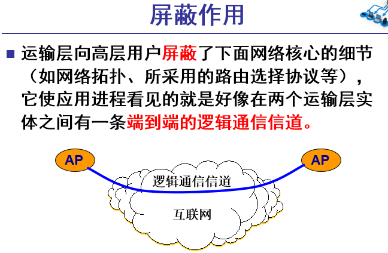
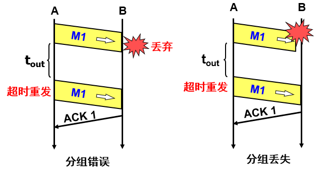

## 第三章、传输层

向上提供通信服务，**它属于面向通信部分的最高层，同时也是用户功能中的最底层。**
当网络边缘部分中的两个主机使用网咯核心部分的功能进行端到端的通信的通信时，**只有位于网络边缘部分的主机的协议栈才有运输层**，而网络核心部分中的路由器在转发分组时都只用到下三层的功能。

传输层位于应用层和网络层之间，是分层的网络体系结构中重要的部分，该层为运行在不同主机上的应用进程提供直接的通信服务起着至关重要的作用。在这里我们将讨论两个大的问题：将网络层在不同端系统之间的通信服务扩充到运行在两个端系统上不同的应用层进程之间的通信服务（如何实现进城之间通信的可靠传输）和控制传输层实体的传输速度以避免网络拥塞或者从网络拥塞中恢复过来，这里需要考虑的有拥塞的后果和原因以及常见的拥塞控制手段，特别的，我们将了解TCP协议中的拥塞控制。

### **3.1 概述和运输层服务**

传输层协议为运行在不同端系统上的应用进程之间提供**逻辑通信**功能；应用层进程使用传输层提供的逻辑通信功能而无需考虑实现通信的物理基础设施的细节；

值得注意的是，**传输层协议是在端系统中实现**的**而不是在路由器中实现的**。**传输层接收来自应用层的报文并通过添加传输层首部以生成传输层报文段**。在生成过程中可能会对来自应用层的报文加以分割；然后在发送端系统中，运输层会将这些报文段交给网络层；网络层将其封装成网络层分组，也被称为数据报，然后向目的地发送。**路由器不会检查封装在数据报中的传输层报文段的字段**；在接收端，网络层从数据报中抽取传输层报文段，并将其交给传输层，传输层接收到报文段后，使该报文段中的数据被接收进程所使用。

网络应用可以使用多种传输层协议**，因特网有两种传输层协议，即TCP和UDP，不同的传输层协议提供不同的运输层服务**

应用     应用层协议     运输层协议
电子邮件     SMTP     TCP
远程终端访问     Telnet     TCP
Web     HTTP     TCP
文件传输     FTP     TCP
远程文件服务器     NFS     UDP
流式多媒体     通常专用     UDP或TCP
因特网电话     通常专用     UDP或TCP
网络管理     SNMP     UDP
路由选择协议     RIP     UDP
名字转换     DNS     UDP

#### 3.1.1 传输层和网络层的关系

值得注意的是，网络层提供主机之间的逻辑通信而传输层为运行在不同主机上的应用进程提供逻辑通信；运输层协议只工作在端系统中。在端系统中，传输层协议将来自应用进程的报文移动到网络边缘即网络层，反过来也从网络层接收这些报文段；传输层对报文段如何在网络核心传输并不做干涉；事实上中间路由器既不处理也不识别传输层加载应用层报文上的任何信息

运输层协议能提供的服务常常受制于底层网络层协议的服务类型，**如果网络层协议无法为主机之间的通信提供时延和带宽保证的话，运输层协议也就无法为进程之间发送的应用程序报文提供时延或者带宽保证.**

然而即使底层网络协议不能在网络层提供响应的服务，运输层协议也能提供某些服务。例如，即使底层网络协议是不可靠的，运输协议也能为应用程序提供可抗的数据传输服务。

#### 3.1.2 因特网传输概述

因特网为应用层提供了截然不同的两种传输层协议：**UDP**（用户数据报协议）它提供一种不可靠、无连接的服务；另一种是**TCP**，它提供可靠的，面向连接的服务；运输层分组也被称为报文段；

简单了解一下因特网的网络层，网络层协议有一个名字即IP，即网际协议。IP为主机间提供逻辑通信，IP的服务模型为尽力而为交付服务（best-effort delivery service）这意味着**IP尽最大的努力在主机间交付报文段**，但是不做任何保证。它不保证**报文段的交付**、不保证报文段**按序交付**、不保证报文段中**数据的完整性**；即IP提供一种不可靠的服务；**每台主机都需要有一个网络层地址，即IP地址。**

**UDP和TCP最基本的责任**就是**将IP提供的主机间交付服务扩展到不同端系统上两个个进程之间的服务**。这也被称为传输层的多路分解和多路复用；UDP和TCP通过在传输层**首部添加差错检查字段**来**提供完整性检查**。**进程到进程之间的数据交付和差错检查是最低限度的两种传输层服务**，也是UDP可以提供的仅有的两种服务。**UDP和IP一样，也是不可靠服务；**

TCP提供额外的服务，首先它是一种可靠数据服务，这意味着TCP协议保证数据的按序、完整地从发送端应用进程发送到接收端应用进程；T**CP通过序号、确认、定时器以及流量控制来将IP的不可靠数据传输转换为可靠数据传输**；其次，TCP提供**拥塞控制**，拥塞控制与其说是一种提供给应用程序的服务，不如说是一种提供给整个网络的服务，因为整个网络都将因为拥塞控制而受益；不太严格地说，拥塞控制力求为每一个经过一条拥塞网络的连接提供平等的共享网络链路带宽，从而避免一条TCP连接用过多的流量来淹没通信主机之间的链路和设备；拥塞控制是通过调节发送进网络的的流量速率来做得到；**UDP不提供拥塞控制，使用UDP传输的应用程序可以根据需要以任意的速率发送数据。**

#### 端口（重点）

数据链路和IP中的地址，分别指的是**MAC地址和P地址**。前者用来识别**同一链路中不同的计算机**，后者用来识别**TCP/IP网络中互连的主机和路由器**。在**传输层**中也有这种类似于地址的概念，那就是**端口号**。端口号用来识别同一台计算机中进行通信的不同应用程序。因此，它也被称为**程序地址**。

根据端口号识别应用
一台计算机上同时可以运行多个程序。例如，接受WWW服务的Web 浏览器、电邮客户端、远程登录用的 ssh 客户端等程序都可同时运行。传输层协议正是利用这些端口号识别本机中正在进行通信的应用程序，并准确地将数据传输。

**通过IP地址、端口号、协议号进行通信识别**
如下图所示，①和②的通信是在两台计算机上进行的。它们的目标端口号相同，都是80。例**如打开两个Web浏览器，同时访问两个服务器上不同的页面，就会在这个浏览器跟服务器之间产生类似前面的两个通信。**在这种情况下可以根据源端口号加以区分。①跟③的目标端口号和源端口号完全相同，但是它们各自的源IP地址不同，可以通过源地址进行区分。
此外，还有一种情况，IP地址和端口全都一样，只是协议号(表示上层是TCP或UDP的一种编号)不同。这种情况下，也会认为是两个不同的通信。

- 因此，TCP/P或UDP/IP通信中通常采用5个信息来识别一个通信。它们是“源P地址”、“目标P地址”、“协议号”、“源端口号”、“目标端口号”。只要其中某一项不同，则被认为是其他通信。
  **如何确定端口号**
  在实际进行通信时，要事先确定端口号。确定端口号的方法分为两种:

- 标准既定的端口号（静态方法），它是指每个应用程序都有其指定的端口号。

  像HTTP、TELNET、FTP等广为使用的应用协议中所使用的端口号是固定的。这些端口号也被称之为知名端口号(Well—Known Port Number )。应用程序应该避免使用知名端口号进行既定目的之外的通信，以免产生冲突。

  除知名端口号之外，还有一些端口号也被正式注册，不过，这些端口号可用于任何通信用途。它们分布在1024到49151的数字之间。

- 时序分配法（动态分配法），此时，服务端有必要确定监听端口号，但是接受服务的客户端没必要确定端口号。

  在这种方法下，客户端应用程序可以完全不用自己设置端口号，而全权交给操作系統进行分配。操作系统可以为每个应用程序分配互不冲突的端口号。例知，每需要一个新的端口号时，就在之前分配号码的基础上加1。这样，操作系统就可以动态地管理端口号了。

  根据这种动态分配端口号的机制，即使是同一个客户端程序发起的多个TCP连接，识别这些通信连接的5部分数字也不会全部相同。动态分配的端口号取值范围在49152到65535之间。

**端口号与协议的关系**
端口号由其使用的传输层协议决定。因此，不同的传输协议可以使用相同的端口号。例如，TCP与UDP使用同一个端口号，但使用目的各不相同。这是因为端口号上的处理是根据每个传输协议的不同而进行的。

数据到达IP层后，会先检查IP首部中的协议号，再传给相应协议的模块。如果是TCP则传给TCP模块、如果是UDP则传给UDP模块去做端口号的处理。即使是同一个端口号，由于传输协议是各自独立地进行处理，因此相互之间不会受到影响。

### 3.2 多路复用和多路分解

有前面的介绍，我们可以知道，传输层将网络层提供的面向主机的逻辑通信扩充为面向不同应用进程的逻辑通信，并且这一过程称为多路复用和多路分解；值得注意的是，多路复用和多路分解是每个计算机网络都需要的

实际上，传输层和应用程序进程之间通过**Socket（套接字）**关联，这样**通过Socket就可以区别同一主机上的不同应用进程**，从而传输层提供服务变为可能；传输层从同一台主机上的不同Socket接收数据的过程称为多路复用；传输层向同一台主机上的不同Socket传输数据的过程称为多路分解；为了实现多路复用和多路分解，我们需要标志套接字，并将相关信息添加到报文段中。

实际上，**每个套接字都有一个唯一的ID，被称为端口号**；而在传输层接收到来自应用程序的分组并通过添加传输层首部而形成报文段的过程中，该端口号被写入；端口号大小在0-65535之间，其中0-1023属于周知端口号，它们为特定的Socket而拥有。

**无连接的多路复用与多路分解**
需要注意的是，在创建Socket的时候，是由传输层为之分配端口号；一个UDP套接字是由一个目的IP地址和目的端口号即二元组来标志的；如果两个UDP报文段有不同的源IP地址或者源端口号，但是有相同的目的IP和目的端口号的话，它们将通过同一个Socket到达同一个应用程序

**面向连接的多路复用与多路连接**
TCP协议中的Socket是通过一个四元组来标记的：（源IP地址，源端口号，目的IP地址，目的端口号）；两个具有不同源IP地址或者源端口号，但有相同的目的IP地址和目的端口号的TCP报文段将通过两个不同的Socket进入同一应用进程；这也表示，一个应用进程可以关联多个Socket，而一个Socket将只关联一个应用进程；常常，这样的对应关系是通过线程来实现的：一个进程有多个线程，而每个线程关联了一个Socket；这样做可以提高服务器性能嘛

实际上，传输层就是根据这些信息来实现多路分解的；而这些信息是在多路复用的时候被放置在报文段中的

### 3.3 无连接运输：UDP

一个不提供不必要服务的传输层协议是什么样的呢？什么都不做？那是不行的，我们必须做一些什么！前面提到过，差错检查和进程到进程的数据交付是传输层协议必须提供的功能，事实上，UDP的确做到了这些，并且。。只做了这些。它几乎没有对IP增强别的东西；因为在发送报文段之前，发送方和接收方的传输层实体之间没有握手，所以UDP也被称为无连接的；

DNS是一个使用UDP的应用层协议例子；UDP在接收到来自Socket的数据时，UDP为该报文添加首部字段（源和目的端口号，以及其他两个小字段），然后将报文段交给网络层，网络层通过IP协议尽力地将该报文段交付，至于结果，尽力就好；当DNS客户端等待不到对该查询的响应时（有可能网络层将其丢失了）则会向其他Name Server发送查询请求，要么就通知应用程序，做不到

既然TCP提供了可靠数据传输，并且提供了拥塞控制，为什么人们还需UDP呢？事实上，有些应用很适合UDP（**因为没有连接过程啊，因为不会受拥塞控制的调节啊，更自由**）；

**UDP只是在IP的数据报服务之上增加了很少的功能：**

- 复用和分用的功能
- 差错检验

**UDP有以下好处：**（面向报文的）

- 关于何时、发送什么数据的应用层控制更为精细：这是因为一旦应用程序将数据交给UDP，UDP就会打包将其发送给网络层，不会受到传输层的调节，这在一些实时应用中比较实用；当然，应用程序还可以通过UDP+自主开发一些功能的模式来扩展UDP。
- **无需建立连接**：所以就不会引入额外的时延。这也可能是DNS使用UDP而不是TCP的主要原因，如果使用TCP的话，DNS服务将会慢很多；HTTP使用TCP的主要原因是对TCP的可靠性的依赖超过对速度的要求；
- **无需维护连接状态：**TCP为了实现可靠数据传输和拥塞控制需要在端系统中维护一些参数，这些参数包括：接收和发送的缓存、拥塞控制参数、确认号和序号；这些参数信息都是必须的；而UDP因为不建立连接，所以自然也就不需要维护这些状态，这就减少了时空开销；
- **分组首部更小：**TCP有20字节的首部开销，而UDP只有8字节；

这些应用程序使用了**TCP作为其传输层协议：电子邮件、远程终端访问、Web、文件传输**；这些应用通常使用**UDP作为其传输层协议：远程文件服务器、网络管理（因为这里应用即便在网络处于拥塞的情况下仍要工作，所以UDP更为合适*）、路由选择协议和名称转换（DNS）***；**这些应用两个都有使用：流式多媒体、因特网电话等多媒体应用；这些应用对实时性的要求较高同时对可靠性的要求又不是很高，所以既可以使用UDP也可以使用TCP协议。**

不过在UDP之上运行多媒体应用是有争议的，因为UDP没有拥塞控制协议，所以其对网络有很大的威胁性：大**量的UDP流量将使网络过度拥塞而造成TCP连接几乎无法传输数据，并且因为网络拥塞，所以应用又有着较高的丢包率，而因为丢包率UDP很有可能继续发送数据，由此使得网络效率低下。也有研究人员提出一些新的机制，使得所有数据源，包括UDP源执行自适应的拥塞控制来解决这一问题；**

需要注意的是，使用UDP仍然可以实现可靠数据传输，只不过这一部分功能需要在应用程序中自主开发；将可靠性直接构建于应用程序中，将使其既可以可靠地传输数据又可以避免受制于TCP的拥塞控制（传输速率的控制）

#### 3.3.1 UDP报文结构

UDP首部只有4个字段，每个字段占用两个字节，分别是：源端口号、目的端口号、长度和校验和；其中，长度表示包含首部在内的UDP报文段长度，以字节为单位；校验和字段用来计算报文段在传输的过程中是否出现了差错；一种常见的校验和的计算方法是：发送方将前三个字段做按位加运算，然后将其取反作为校验和；然后接收方对所有四个字段（每个字段16位）进行求和，如果没有出现差错，则最后的结果全是1，否则就表明出现了错误；**出现错误的原因可能有：传输链路上数据受到干扰、数据存储在中间路由器的时候，出现了错误**

UDP作为传输层协议，提供的差错检测功能很有可能和底层协议提供的相似功能产生冗余；但是，这是必须的，因为由于不能保证源和目的地之间所有链路都提供差错检测功能，即便数据在链路上正确传输，也无法保证其在中间路由器的内存中不发生错误；所以要实现端到端的差错检测，就必须在传输层协议中实现该功能；这一原则在系统设计中被称为**端到端原则**：“因为某一功能必须在端到端实现，与在较高层次提供这些功能的代价相比，在较低层次上设置的功能可能是冗余的，或者根本是没有用的”

**IP作为网络层协议，可以运行在任何第二层协议上，所以运输层提供差错检测也是必须的；UDP可以检测差错，但是无法恢复差错，能做的除了将其丢弃外，便是将其交给应用程序然后给出警告.**

#### 3.3.2面向报文的UDP

### 3.4 可靠数据传输原理

- **停止-等待协议SW**
- **回退N帧协议GBN**
- **选择重传协议SR**
- 

可靠数据传输的问题，**不仅在传输层需要考虑，在链路层以及应用层都需要考虑这个问题**，所以了解一些其基本原理是必要的，特别是在详细了解TCP中为实现可靠数据传输而采取的。许多原理可靠数据传输为上层实体提供的服务抽象是：数据可以通过一套**可靠的信道进行传输**，借助于可靠信道，传输数据就**不会受到损坏或者丢失**；并且所有数据都可以**按照其发送顺序进行交付**。而这正是TCP向调用它的应用所提供的服务模型实现这种抽象服务是可靠数据传输的责任，但是因为可靠数据传输的底层协议可能是不可靠的，所以这项任务有一点困难；单方向的可靠数据传输流程大概是这样的：可靠数据传输->不可靠数据传输->不可靠的传输信道->可靠数据接收->上传Data

**理想的传输条件特点：**

- **传输信道不产生差错。**
- **不管发送方以多快的速度发送数据，接收方总是来得及处理收到的数据。**

在这样的理想传输条件下，不需要采取任何措施就能够实现可靠传输。

**然而实际的网络都不具备以上两个理想条件。必须使用一些可靠传输协议**，在不可靠的传输信道实现可靠传输。

#### 3.4.1停止等待协议

#### 流水线传输

#### 

rdt 3.0 是一个功能正确的协议，但是由于它是一个停等协议，大部分的时间都浪费在等待确认上面，所以性能不好。
解决这种特殊性能问题的一个简单的方法是：不使用停等方式运行，允许发送方发送多个分组而无需等待确认。这种技术被称为 **流水线。**

**要使用流水线技术，则须：**

- **增加序号范围**。因为要传送多个分组，而每个传输中的分组必须有一个单独的序号。

- **协议的发送方和接收方两端必须能缓存多个分组**。发送方至少得能缓存那些已发送但未确认的分组，而接收方或许也需要缓存那些已经正确接收的分组。

- **所需序号的范围和对缓冲的要求取决于数据传输协议如何处理丢失、损坏及延时过大的分组。**

  

 **流水线的差错恢复有两种基本方法：**

-  **回退 N 步**
- ​    **选择重传**

#### 3.4.2连续ARQ协议

####  回退N步(GBN)

在回退N步中，发送方维护一个**N——窗口大小**和一个**base——发送方期待收到的最小待确认分组序号**，同样也是窗口的起点，还有一个**next Sequence变量**，表示上层需要发送分组时，可以使用的序号。这样全部序号就被划分为**0-base-1**，这一部分的分组是已发送且收到接收方确认的分组，**base~next Sequence-1**这一部分的分组是已发送但是尚未收到确认的，其中base是尚未收到确认的最小序号；**next-1~base+N-1**表示当前发送方可以使用的序号，表示一种发送能力；当发送方收到确认号为base的确认分组后就会向前移动窗口，所以回退N步也被称为**滑动窗口协议**

这是发送方需要维护的数据，同时发送方需要响应的事件有：**上层调用、收到ACK、超时事件；**

- 上层调用：检查next Sequence是否在窗口之内，如果在，这说明发送方还有发送能力，发送之；
- 收到ACK：回退N步策略对序号为n的分组采取**累积确认**的方式，即**当收到序号为n的ACK时，表明序号小于等于n的分组全部到位；**发送方收到的ACK毕竟来自接收方，收到ACK的情况还得看接收方如何发送；
- 超时事件：如果发生超时事件，那么发送方会重发所有已发送但是未确认的分组，即分组号在base和next sequence-1之间的所有分组；这也是为什么叫“回退N步”，如果收到一个ACK，则定时器会重行启动；如果没有待确认的分组，定时器将被终止；

在接收方，如**果到达分组的序号为n且该分组是按序到达，那么发送ACK，这就导致发送方移动窗口**；如果不是按序到达，那么接收方丢弃所有失序分组；丢弃一个正确接收的失序分组可能会导致更多的重传

#### 选择重传（SR）

回退N步协议存在一个问题就是当窗口和带宽的时延都较大时，单个分组的差错可能会引起**GBN重传大量的分组**，然后许多本来不用重传的分组会充斥在信道中，造成资源浪费；选择重传就是让发送方仅重传那些丢失和受损的分组而避免不必要的重传

**SR 发送方的事件和动作：**

- 从上层接收数据： 检查下一个可用于该分组的序号，若在发送方的窗口内，则将数据打包发送。
- **超时： 定时器再次用来防止丢失分组。但是现在每个分组必须得有单独的定时器。**
- 收到 ACK：倘若该分组序号在窗口内，则 SR 发送方将那个被确认的分组标记为已接收。如果该分组的序号等于send_base，则窗口基序号向前移动到具有最小序号的未确认分组处。如果窗口移动了并且该序号落在窗口内的未发送分组，则发送这些分组。

**SR 接收方的事件于动作：**

- 序号在 [rcv_base, rcv_base + N -1] 内的分组被正确接收：在此情况下，收到的分组落在接收方的窗口内，一个选择 ACK 被回送给发送方。如果该分组以前没收到过，则缓存该分组。如果该分组的序号等于接收窗口的基序号，则该分组及以前缓存的序号连续的分组交付给上层。
- 序号在 [rcv_base - N, rcv_base - 1] 内的分组被正确接收： 产生一个 ACK，即使该分组是接收方以前已确认过的分组。因为视图不一致
- 其他情况：忽略该分组。

接收方将确认一个正确接收的分组而不管其是否按序；**失序的分组被缓存，直到形成连续数据后将其提交给上层**；值得注意的是，如果接收方收到了已经确认的分组，则说明确认ACK丢失，或者时延太长，接收方和发送方沟通不及时；这也表明了关于那些分组到位了，那些分组还没到位，接收方和发送方有着不一样的视图。

另外还需要注意的是，**序号的重用问题**，如果在分组中序号字段的位数为k，那么最大的序号为2^k-1，所以有可能不同分组同时占用一个序号，为了避免这种情况，需要做的是控制分组的生命周期。**窗口长度必须小于或等于序号空间大小的一半**。

### 3.5 面向连接的TCP

**如果目的主机该端口正在ing ,返回一个特殊报文段。RST置位**

- **TCP 是一个传输层协议，他的作用是为上层的应用层提供服务；传输层处于应用层和网络层之间**
- **当数据从网络层不断地运送到传输层，TCP 将这些打包好的数据（IP 数据报）进行重新解包，并拼接成字节流的形式进行处理；处理完之后再向上递交到应用层，供应用层的各种应用使用**
- **TCP 是面向 连接的、可靠的、字节流形式 的传输服务**

#### socket 的作用和存在意义

- 因为 TCP 是面向连接的协议，所以发送和接收数据的时候，都要指定收发双方的 IP 地址和端口号；

  a.IP 地址是对计算机终端在网络中位置的唯一标识，通过 IP 地址可以找到网络中的某台计算机
  b.端口号 port 是对这台计算机中的某个应用服务进程进行唯一标定，让数据能够在计算机内部找到对应的应用进程
  因为 TCP 的字节流需要向下交付到网络层，然后进行打包成 IP 数据报再发送

- 如果没有 socket，那么数据每次向下传输到网络层的时候都需要附带传一个 5元组，这样增大了层与层之间的数据压力，而且每次都如此很麻烦

- **有了 socket 就相当于把这个 5 元组通过 socket 打包成了一个值，每次向网络层传递这个值，网络层就明白了，哦原来是想往这个目标地址和端口号发送**

  

#### 如何保证传输的可靠性

**可靠性包含这么几个方面：**

- 建立起可靠的传输：三次握手

- 数据不能有丢包，解决这个问题要靠：

  **重传机制** 重发丢失的数据包来保证数据整体的完整

  **流量控制** 避免收发速度不匹配导致的缓冲区满造成丢包问题；流量控制的过程中涉及到 TCP 的接收和发送缓冲区的设置以及 滑动窗口 的使用

  同样的，流量控制 和 重传机制 只能最大程度缓解 TCP 本身的丢包问题，但是网络拥堵导致的丢包问题，他们无能为力，但是为了可靠的传输过程**，TCP 同样也想到了 拥塞控制 来实时感受网络的拥塞程度，进而对发送方的发送速度进行限制**

- 数据传输过程中不能有错误，解决这个靠 **检验和**（checksum）

- 信息不能乱序：通常信息的乱序问题是由于丢包或者网络情况不好引起的，所以这篇文章中把如何保证消息的顺序也包含在上述各种技术和算法的介绍中

- 可靠的连接断开：**四次挥手**

#### 3.5.1 TCP连接

TCP协议之所以被称为是**面向连接**的协议，是因为在一个应用进程可以向另一个应用进程发送数据前，这两个进程将**首先“握手”**，即它们必须交换一些预报文段，已建立对关于数据传输的参数的共识；作为TCP连接建立的一部分，通信双方都将初始化与TCP连接的许多相关变量

TCP的连接，并不是一条像电路交换网络中端到端的TDM、FDM电路，也不是一条虚电路；其连接状态被端系统所维护而中间路由器完全忽略了该协议，中间路由器看到的只是数据，也就是说，TCP只运行在端系统之上；所以，**TCP连接更像一种状态而不是物理的、实际的连接**

**TCP提供全双工服务，并且是点对点的**，数据从A到B的同时，也能从B到A；TCP协议**无法提供“多播”**服务，一**条TCP连接只关联一个发送方和接收方（当然，发送方也是接收方）**；

对于TCP建立过程中的“握手”阶段，需要明白的是，手一共握了三次，前两次报文段不承载“有效负载”，第三次握手的时候，报文段是可以装载“有效负载”的；这个过程是这样的：通信的发起方首先发送一个特殊的TCP报文段给接收方，这是第一次握手；接收方收到该报文段后，对该报文段进行响应，此为第二次握手；发送方接收到响应报文段后，发送第三个报文段，其中包含了有效负载；因为TCP建立的过程，一共发生了三次握手，所以该过程也被称为**“三次握手”**

当TCP连接建立后，两个应用进程就可以发送数据了。应用程序将要发送的数据通过**Socket传递给TCP**，TCP将数据引导到该连接的发送缓存，**发送缓存**大小是在三次握手的过程中确定的；之后TCP将时不时从该缓存中拿出数据进行发送，一个有趣的事情是，TCP规范中没有规定TCP应该在何时发送缓存里的数据，描述为“TCP应该在它方便的时候以报文段的形式发送数据”；TCP每次可以从**缓存中发送的最大数据长度称为MSS**(Maximum Segment Size)。一般来说，MSS+TCP/IP首部的长度要小于等于链路的**MTU（即链路层最大帧长度Maximum Transport Unit）**而以太网和PPP的MTU都等于1500字节，TCP/IP的首部通常为20字节，所以MSS一般来说为1460字节。

注意：**MSS指的是报文段中应用层数据最大长度，而不是包括TCP首部的报文段长度。**

**TCP为每块客户数据加上TCP首部后就形成了一个个TCP报文段**；这**些TCP报文段被交给网络层，然后被发送到网络中；当TCP报文段到达接收端时，便进入了接收端的缓存，等待被应用程序读取。**

**TCP连接的每一端都有发送和接收缓存**

#### 3.5.2 TCP报文段结构

在TCP/IP协议栈中，IP协议层只关心如何使数据能够跨越本地网络边界的问题，而不关心数据如何传输。整体TCP/IP协议栈，共同配合一起解决数据如何通过许许多多个点对点通路，顺利传输到达目的地。一个点对点通路被称为一“跳”（hop），通过TCP/IP协议栈，网络成员能够在许多“跳”的基础上建立相互的数据通路。

传输层TCP协议提供了一种面向连接的、可靠的字节流服务，其数据帧格式，大致如下图所示：

**（一）源端口号**
源端口号表示报文的发送端口，占16位。源端口和源IP地址组合起来，可以标识报文的发送地址。

**（二）目的端口号**
目的端口号表示报文的接收端口，占16位。目的端口和目的IP地址相结合，可以标识报文的接收地址。

TCP协议是基于IP协议的基础上传输的，TCP报文中的源端口号+源IP，与TCP报文中的目的端口号+目的IP一起，组合起来唯一性的确定一条TCP连接。

**（三）序号（Sequence Number）**
TCP传输过程中，在发送端出的字节流中，传输报文中的数据部分的每一个字节都有它的编号。序号（Sequence
Number）占32位，发起方发送数据时，都需要标记序号。

序号（Sequence Number）的语义与SYN控制标志（ControlBits）的值有关。根据控制标志（Control Bits）中的SYN是否为1，序号（Sequence
Number）表达不同的含义：

（1）当SYN = 1时，当前为连接建立阶段，此时的序号为初始序号ISN((Initial Sequence
Number)，通过算法来随机生成序号；

（2）当SYN = 0时在数据传输正式开始时，第一个报文的序号为 ISN +1，后面的报文的序号，为前一个报文的SN值+TCP报文的净荷字节数(不包含TCP头)。比如，如果发送端发送的一个TCP帧的净荷为12byte，序号为5，则发送端接着发送的下一个数据包的时候，序号的值应该设置为5+12=17。

在数据传输过程中，TCP协议通过序号（Sequence
Number）对上层提供有序的数据流。发送端可以用序号来跟踪发送的数据量；接收端可以用序号识别出重复接收到的TCP包，从而丢弃重复包；对于乱序的数据包，接收端也可以依靠序号对其进行排序。

**（四）确认序号（Acknowledgment Number）**
确认序号（Acknowledgment
Number）标识了报文接收端期望接收的字节序列。如果设置了ACK控制位，确认序号的值表示一个准备接收的包的序列码，注意，它所指向的是准备接收的包，也就是下一个期望接收的包的序列码。

举个例子，假设发送端（如Client）发送3个净荷为1000byte、起始SN序号为1的数据包给Server服务端，Server每收到一个包之后，需要回复一个ACK响应确认数据包给Client。ACK响应数据包的ACK
Number值，为每个Client包的为SN+包净荷，既表示Server已经确认收到的字节数，还表示期望接收到的下一个Client发送包的SN序号，具体的ACK值如下图左边的正常传输部分所示。

在上图的左边部分，Server第1个ACK包的ACK
Number值为1001，是通过Client第1个包的SN+包净荷=1+1000计算得到，表示期望第2个Client包的SN序号为1001；Server第2个ACK包的ACK
Number值为2001，为Client第2个包的SN+包净荷=2001，表示期望第3个Server包的SN为2001，以此类推。

如果发生错误，假设Server在处理Client的第二个发送包异常，Server仍然回复一个ACK
Number值为1001的确认包，则Client的第二个数据包需要重复发送，具体的ACK值如上图右边的正常传输部分所示。

只有控制标志的ACK标志为1时，数据帧中的确认序号ACK
Number才有效。TCP协议规定，连接建立后，所有发送的报文的ACK必须为1，也就是建立连接后，所有报文的确认序号有效。如果是SYN类型的报文，其ACK标志为0，故没有确认序号。

**（五）头部长度**
该字段占用4位，用来表示TCP报文首部的长度，单位是4bit位。其值所表示的并不是字节数，而是头部的所含有的32bit的数目（或者倍数），或者4个字节的倍数，所以TCP头部最多可以有60字节（4*15=60）。没有任何选项字段的TCP头部长度为20字节，所以其头部长度为5，可以通过20/4=5计算得到。

**（六）预留6位**
头部长度后面预留的字段长度为6位，作为保留字段，暂时没有什么用处。

（**七）控制标志**
控制标志（Control
Bits）共6个bit位，具体的标志位为：URG、ACK、PSH、RST、SYN、FIN。6个标志位的说明，如下表所示。

**（八）窗口大小：**
长度为16位，共2个字节。此字段用来进行流量控制。流量控制的单位为字节数，这个值是本端期望一次接收的字节数。

**（九）校验和：**
长度为16位，共2个字节。对整个TCP报文段，即TCP头部和TCP数据进行校验和计算，接收端用于对收到的数据包进行验证。

（**十）紧急指针：**
长度为16位，2个字节。它是一个偏移量，和SN序号值相加表示紧急数据最后一个字节的序号。

以上十项内容是TCP报文首部必须的字段，也称固有字段，长度为20个字节。接下来是TCP报文的可选项和填充部分。

**（十一）可选项和填充部分**
可选项和填充部分的长度为4n字节（n是整数），该部分是根据需要而增加的选项。如果不足4n字节，要加填充位，使得选项长度为32位（4字节）的整数倍，具体的做法是在这个字段中加入额外的零，以确保TCP头是32位（4字节）的整数倍。

最常见的选项字段是MSS（Maximum Segment
Size最长报文大小），每个连接方通常都在通信的第一个报文段（SYN标志为1的那个段）中指明这个选项字段，表示当前连接方所能接受的最大报文段的长度。

由于可选项和填充部分不是必须的，所以TCP报文首部最小长度为20个字节。

至此，TCP报文首部的字段，就全部介绍完了。TCP报文首部的后面，接着的是数据部分，不过数据部分是可选的。在一个连接建立和一个连接终止时，双方交换的报文段仅有TCP首部。如果一方没有数据要发送，也使用没有任何数据的首部来确认收到的数据，比如在处理超时的过程中，也会发送不带任何数据的报文段。

**总体来说，TCP协议的可靠性，主要通过以下几点来保障：**

（1）应用数据分割成TCP认为最适合发送的数据块。这部分是通过MSS（最大数据包长度）选项来控制的，通常这种机制也被称为一种协商机制，MSS规定了TCP传往另一端的最大数据块的长度。值得注意的是，MSS只能出现在SYN报文段中，若一方不接收来自另一方的MSS值，则MSS就定为536字节。一般来讲，MSS值还是越大越好，这样可以提高网络的利用率。

（2）重传机制。设置定时器，等待确认包，如果定时器超时还没有收到确认包，则报文重传。

（3）对首部和数据进行校验。

（4）接收端对收到的数据进行排序，然后交给应用层。

（5）接收端丢弃重复的数据。

（6）TCP还提供流量控制，主要是通过滑动窗口来实现流量控制。

至此TCP协议的数据帧格式介绍完了。接下来开始为大家重点介绍：TCP传输层的三次握手建立连接，四次挥手释放连接。

#### 3.5.3 往返时间的估计与超时

TCP使用超时重传机制来处理报文段的问题；虽然这在概念上很简单，但是一个问题是，如何设置超时时间？如何设置超时时间，取决于网络的状态，所以需要做的是估计网络的状态。TCP使用一种**Sample RTT**的方法来估计RTT。Sample RTT就是从某报文段发出到收到对该报文段的确认之间的时间量。大多数TCP的实现是在某个时刻做一个Sample RTT测试。TCP并不为已经重发的报文段做Sample RTT测试，它只为传输一次的报文段测量Sample RTT。

TCP一般来说通过**Estimated RTT=(1-a)Estimated RTT+a*Sample** RTT来计算因路由器的拥塞和端系统负载变化所导致变化的RTT。a一般取1/8；因为Estimated RTT表示最近的网络状况，所以其理应得到较大的权值；这种方法也被称为**指数加权移动平均**

**除了估计RTT外，计算RTT的变化也是ok的**，**DevRTT =(1-b)DevRTT+b*|Sample RTT-Estimated RTT|**；其中b的推荐值为0.25；当Sample RTT变化较大的时候，DevRTT的值较大，当Sample RTT变化较小的时候，DevRTT就较小；

TCP是如何考虑超时时间的呢？该时间因略大于测量的RTT，不易过小——容易引起不必要的重传，也不易过大——网络对于报文段丢失情况的反应就会变慢；最后TCP采用了如下计算方式：Timeout Interval=Estimated RTT+4*Dev RTT；

当出现超时后，TimeOutInteval值将加倍。不管怎么样，一旦报文段收到并更新Estimated RTT后，TimeInteval就又用上值计算了

#### 3.5.4 可靠数据传输

IP协议提供的是尽力而为的服务：不保证不丢失、不保证按序到达、不保证没有损坏，**TCP协议在IP协议之上，提供可靠数据传输**，从而保证一个进程从其相关联的缓存中读取的数据和另一端进程发送的数据是一致的；TCP使用**超时重传和冗余确认**技术来处理超时、丢失等情况；使用**确认、序号**等技术来保证按序到达；使用**校验和**来检验是否报文段在传输过程中是否发生了错误；

TCP 发送方有三个与发送和重传有关的事件：

- 从上层应用程序接收数据

- 定时器
- 收到 ACK

**1.超时时间加倍**

在大多数TCP实现中，当发生超时事件时，超时时间并不是从Estimated RTT和Dev RTT推算出来而是直接将超时时间设置为原来的两倍；然而，每当定时器在另两个事件（收到ACK和接收到上层应用数据）发生时，新的超时时间将由上面提到的两个值计算出来；实际上，这是一种形式受限的拥塞控制

2. **快速重传**

响应超时事件，然后重传尚未收到确认的报文段，但是，当超时时间过长的时候，会显著增加端到端的延迟；一种可行的方法是对冗余ACK的的检测；在理解冗余ACK之前，需要先看一下接收方为什么会发送冗余ACK。接收方接收到某个报文段时，会检查该报文段是否是按序到达，如果不是，那么接收端会发送对已经收到的最后一个连续报文段的确认，所以如果发送方收到冗余ACK，说明有多个报文段到达了接收端，但不是接收端所期望的——这意味着，很有可能发生了丢失。所以发送方可以在定时器过时之前快速重传所丢失的报文段

下表是 TCP 接收方的 ACK 接收策略：

3.超时重传

**重传时间的选择是TCP 最复杂的问题之一。**

    

**动态调整的超时时间**
现在我们知道网络环境是很复杂的，如果贸然设置一个较大或者较小的网络超时时间是不符合常理的，因此我们想让这个超时时间的设定根据实际情况自己做出调整。
设置每个被发送的 TCP segment 都有一个重传 timer （retransmission timer RTO):
最开始使用默认值来初始化这个 RTO，然后根据网络的实际情况做出调整

#### SACK

3.**5是回退N步还是选择重传**

首先，我们需要明白的是，TCP采用了**累计确认的机制**，也就说，如果接收方正确接收了某一失序到达的分组，那么接收方发送的ACK将是对最后接收的按序到达的分组的确认，而不是对刚刚接收的分组的确认；当然，许多TCP实现都会缓存失序的分组；那么问题来了，发生超时事件后，GBN将重传所有待确认的分组，而不是丢失的分组；而选择重传会好很多

对TCP提出的一种修改意见是所谓的选择确认——即接收方对失序到达的分组也会确认，当该机制和重传机制相结合使得TCP更像选择重传，于是TCP的差错恢复协议最好被分类为GBN和SR协议的混合体.

#### 3.5.5 流量控制

流量控制是一个**速度匹配**服务：TCP连接的发送方和接收方都各自维护一个缓存，因此两者的数据交换应该在一个合理的速度范围内：不让对方发生数据溢出；TCP为它的应用程序提供了这种服务：流量控制服务。虽然流量控制和拥塞控制所采取的动作非常相似，但是它们的目的很明显并不同。在接下来的讨论中，我们将假设TCP是这样实现的，即TCP接收方丢弃失序到达的报文段

在TCP首部中有一个**窗口大小**字段，TCP连接的双方通过该字段来向对方表明自己的窗口大小，即缓存空间的大小；同样，在TCP连接的两端，各自维护着相关的变量：last Sent、last Acked；在发送方，这两个变量之间的分组就是**已经发送但是尚未确认**的分组；而在接收方，last Read表示应用进程下一次读取的数据，last Revd表示最后纳入缓存的报文段编号（注意，我们讨论的前提是TCP会将失序到达的报文段丢弃哦~）；通过这些变量以及报文段首部中窗口大小字段，我们就可以对发送速度做一些控制：**在发送方last Sent-last Acked应该小于等于接收方的窗口大小；在接收端A=last Received-last Read就是已经使用的空间大小，所以窗口大小=buffer-A；**

**对了，还有一个问题就是，如果接收方的窗口大小为0，那么发送端该如何处理呢**？一个需要注意的事实是，接收方在没有ACK或者数据要向发送端发送的时候，是不会通知发送方其窗口大小已经改变，即如果应用程序读取了缓存中的数据，发送方是不会知道的，除非它向接收方发送了数据，而发送方对其进行了确认；实际上，发送方也是这么做的！当接收到窗口大小为0的报文段后，**发送方会向接收方间隔发送只有一个字节的数据。**

#### 3.3.6 TCP连接管理

1. **TCP三次握手**

PS：TCP协议中，主动发起请求的一端称为『客户端』，被动连接的一端称为『服务端』。不管是客户端还是服务端，TCP连接建立完后都能发送和接收数据。

起初，服务器和客户端都为CLOSED状态。在通信开始前，双方都得创建各自的传输控制块（TCB）。
服务器创建完TCB后遍进入LISTEN状态，此时准备接收客户端发来的连接请求。

**第一次握手**

客户端向服务端发送连接请求报文段。该报文段的头部中SYN=1，ACK=0，seq=x。请求发送后，客户端便进入SYN-SENT状态。

    PS1：SYN=1，ACK=0表示该报文段为连接请求报文。
    PS2：x为本次TCP通信的字节流的初始序号。
    TCP规定：SYN=1的报文段不能有数据部分，但要消耗掉一个序号。

**第二次握手**

服务端收到连接请求报文段后，如果同意连接，则会发送一个应答：SYN=1，ACK=1，seq=y，ack=x+1。
该应答发送完成后便进入SYN-RCVD状态。

    PS1：SYN=1，ACK=1表示该报文段为连接同意的应答报文。
    PS2：seq=y表示服务端作为发送者时，发送字节流的初始序号。
    PS3：ack=x+1表示服务端希望下一个数据报发送序号从x+1开始的字节。

**第三次握手**

当客户端收到连接同意的应答后，还要向服务端发送一个确认报文段，表示：服务端发来的连接同意应答已经成功收到。
该报文段的头部为：ACK=1，seq=x+1，ack=y+1。
客户端发完这个报文段后便进入ESTABLISHED状态，服务端收到这个应答后也进入ESTABLISHED状态，此时连接的建立完成！

**2.TCP连接的释放一共需要四步，因此称为『四次挥手』：**
我们知道，TCP连接是双向的，因此在四次挥手中，前两次挥手用于断开一个方向的连接，后两次挥手用于断开另一方向的连接。
**第一次挥手**

若A认为数据发送完成，则它需要向B发送连接释放请求。该请求只有报文头，头中携带的主要参数为：
FIN=1，seq=u。此时，A将进入FIN-WAIT-1状态。

    PS1：FIN=1表示该报文段是一个连接释放请求。
    PS2：seq=u，u-1是A向B发送的最后一个字节的序号。

**第二次挥手**

B收到连接释放请求后，会通知相应的应用程序，告诉它A向B这个方向的连接已经释放。此时B进入CLOSE-WAIT状态，并向A发送连接释放的应答，其报文头包含：
ACK=1，seq=v，ack=u+1。

    PS1：ACK=1：除TCP连接请求报文段以外，TCP通信过程中所有数据报的ACK都为1，表示应答。
    PS2：seq=v，v-1是B向A发送的最后一个字节的序号。
    PS3：ack=u+1表示希望收到从第u+1个字节开始的报文段，并且已经成功接收了前u个字节。
    A收到该应答，进入FIN-WAIT-2状态，等待B发送连接释放请求。

第二次挥手完成后，A到B方向的连接已经释放，B不会再接收数据，A也不会再发送数据。但B到A方向的连接仍然存在，B可以继续向A发送数据。

**第三次挥手**

当B向A发完所有数据后，向A发送连接释放请求，请求头：FIN=1，ACK=1，seq=w，ack=u+1。B便进入LAST-ACK状态。
**第四次挥手**

A收到释放请求后，向B发送确认应答，此时A进入TIME-WAIT状态。该状态会持续2MSL时间，若该时间段内没有B的重发请求的话，就进入CLOSED状态，撤销TCB。当B收到确认应答后，也便进入CLOSED状态，撤销TCB。

**为什么A要先进入TIME-WAIT状态，等待时间后才进入CLOSED状态？**

为了保证B能收到A的确认应答。
若A发完确认应答后直接进入CLOSED状态，那么如果该应答丢失，B等待超时后就会重新发送连接释放请求，但此时A已经关闭了，不会作出任何响应，因此B永远无法正常关闭。

**三次握手、四次挥手的常见面试题**
有关TCP的连接建立的三次握手及拆除过程的四次挥手的面试问题，是技术面试过程中的出现频率很高的重点和难点问题，常见问题大致如下：

**问题（1）：为什么关闭连接的需要四次挥手，而建立连接却只要三次握手呢？**
关闭连接时，被动断开方在收到对方的FIN结束请求报文时，很可能业务数据没有发送完成，并不能立即关闭连接，被动方只能先回复一个ACK响应报文，告诉主动断开方：“你发的FIN报文我收到了，只有等到我所有的业务报文都发送完了，我才能真正的结束，在结束之前，我会发你FIN+ACK报文的，你先等着”。所以，被动断开方的确认报文，需要拆开成为两步，故总体就需要四步挥手。

而在建立连接场景中，Server端的应答可以稍微简单一些。当Server端收到Client端的SYN连接请求报文后，其中ACK报文表示对请求报文的应答，SYN报文用来表示服务端的连接也已经同步开启了，而ACK报文和SYN报文之间，不会有其他报文需要发送，故而可以合二为一，可以直接发送一个SYN+ACK报文。所以，在建立连接时，只需要三次握手即可。

**问题（2）：为什么连接建立的时候是三次握手，可以改成两次握手吗？**
三次握手完成两个重要的功能：一是双方都做好发送数据的准备工作，而且双方都知道对方已准备好；二是双方完成初始SN序列号的协商，双方的SN序列号在握手过程中被发送和确认。

如果把三次握手改成两次握手，可能发生死锁。两次握手的话，缺失了Client的二次确认ACK帧，假想的TCP建立的连接时二次挥手，可以如下图所示：

图：假想的TCP建立的连接时二次握手的示意图

在假想的TCP建立的连接时二次握手过程中，Client发送Server发送一个SYN请求帧，Server收到后发送了确认应答SYN+ACK帧。按照两次握手的协定，Server认为连接已经成功地建立了，可以开始发送数据帧。这个过程中，如果确认应答SYN+ACK帧在传输中被丢失，Client没有收到，Client将不知道Server是否已准备好，也不知道Server的SN序列号，Client认为连接还未建立成功，将忽略Server发来的任何数据分组，会一直等待Server的SYN+ACK确认应答帧。而Server在发出的数据帧后，一直没有收到对应的ACK确认后就会产生超时，重复发送同样的数据帧。这样就形成了死锁。

**问题（3）：为什么主动断开方在TIME-WAIT状态必须等待2MSL的时间？**
原因之一：主动断开方等待2MSL的时间，是为了确保两端都能最终关闭。假设网络是不可靠的，被动断开方发送FIN+ACK报文后，其主动方的ACK响应报文有可能丢失，这时候的被动断开方处于LAST-ACK状态的，由于收不到ACK确认被动方一直不能正常的进入CLOSED状态。在这种场景下，被动断开方会超时重传FIN+ACK断开响应报文，如果主动断开方在2MSL时间内，收到这个重传的FIN+ACK报文，会重传一次ACK报文，后再一次重新启动2MSL计时等待，这样，就能确保被动断开方能收到ACK报文，从而能确保被动方顺利进入到CLOSED状态。只有这样，双方都能够确保关闭。反过来说，如果主动断开方在发送完ACK响应报文后，不是进入TIME_WAIT状态去等待2MSL时间，而是立即释放连接，则将无法收到被动方重传的FIN+ACK报文，所以不会再发送一次ACK确认报文，此时处于LAST-ACK状态的被动断开方，无法正常进入到CLOSED状态。

原因之二：防止“旧连接的已失效的数据报文”出现在新连接中。主动断开方在发送完最后一个ACK报文后，再经过2MSL，才能最终关闭和释放端口，这就意味着，相同端口的新TCP新连接，需要在2MSL的时间之后，才能够正常的建立。2MSL这段时间内，旧连接所产生的所有数据报文，都已经从网络中消失了，从而，确保了下一个新的连接中不会出现这种旧连接请求报文。

**问题（4）：如果已经建立了连接，但是Client端突然出现故障了怎么办？**
TCP还设有一个保活计时器，Client端如果出现故障，Server端不能一直等下去，这样会浪费系统资源。每收到一次Client客户端的数据帧后，Server端都的保活计时器会复位。计时器的超时时间通常是设置为2小时，若2小时还没有收到Client端的任何数据帧，Server端就会发送一个探测报文段，以后每隔75秒钟发送一次。若一连发送10个探测报文仍然没反应，Server端就认为Client端出了故障，接着就关闭连接。如果觉得保活计时器的两个多小时的间隔太长，可以自行调整TCP连接的保活参数。

### 3.6 拥塞控制原理

#### 3.6.1.概述

- TCP进行拥塞控制的算法有四种，即**慢开始、拥塞避免、快重传和快恢复。**
- 拥塞控制也叫作**基于窗口**的拥塞控制，为此，发送方维持一个叫做拥塞窗口cwnd(congestion window)的状态变量，**拥塞窗口的大小取决于网络的拥塞程度，并且在动态的发生变化**，发送方让自己的发送窗口等于拥塞窗口 (注：**在这里我们假设接受方总是有足够大的缓存空间，因而发送窗口的大小取决于网络的拥塞程度，实际上真正的窗口值 = min(接收方窗口，拥塞窗口)**
- 发送方控制**拥塞窗口cwnd**的原则是：只要网络没有出现拥塞，拥塞窗口就可以在增大一些，以便把更多的分组发送出去。但是只要网络出现拥塞或有可能出现拥塞，**就必须把拥塞窗口减小一些**，以减少注入到网络中的分组数，以便环节网络出现的拥塞。
- **发送方又是如何知道网络中出现了拥塞呢？** 我们知道，当网络中出现了拥塞时，路由器就要丢弃分组，**因此只要发送方没有及时收到应当到达的确认报文，也就是说只要出现了超时**，就可以猜想网络可能出现了拥塞，(现在通信线路的传输质量一般都很好，因传输出差错而丢弃的概率是很小的(远小于1%)) 因此，判断网络拥塞的依据就是出现了超时。

#### 2.慢开始

慢开始算法的思路： 当主机开始发送数据时，由于并不清楚网路的负荷情况，所以如果立即把大量数据字节注入到网络，那么就有可能引发网络发生拥塞。所以最好的方法是先探测一下，即由小到大逐渐增大发送窗口，也就是说，由小到达逐渐增大拥塞窗口值。

下面的例子说明慢开始算法的原理，**(请注意：虽然实际上TCP是用字节数作为窗口大小的单位，但这为了方便期间，使用报文段的个数作为窗口大小的单位，这样可以使用较小的单位来阐述拥塞控制的原理)**

#### 3.拥塞避免

为了防止拥塞窗口cwnd增长过大引起网络拥塞，还需要设置一个慢开始门限ssthresh状态变量，sshthresh的用法如下。

- 当cwnd < ssthresh时，使用上述的慢开始算法。

- 当cwnd > ssthresh时，停止使用慢开始算法而改用拥塞避免算法。
- 当cwnd = ssthresh时，既可使用慢开始算法，也可使用拥塞避免算法。

**拥塞避免算法**

让拥塞窗口cwnd缓慢的增大，每经过一个往返时间RTT就把发送方的拥塞窗口+1，而不是像慢开始那样成倍的增加。即加法增大

**流程图示(无3ACK情况出现，关于3ACK见快重传与快恢复)**

- **假设**初始ssthresh为16，现在开始执行慢开始，
- 当到cwnd = 16时，改为拥塞避免算法,即加法增大
- 假设当cwnd = 24时，出现了网络拥塞，那么执行ssthresh乘法减小，即 ssthresh = cwnd / 2 = 12，
- 重新开始执行慢开始(cwnd = 1),然后cwnd = 12时开始执行拥塞避免。。。

#### 4.快重传与快恢复

**为什么需要快重传**

有时，个别报文段会在网络中丢失，但实际上网络并未发生拥塞，如果发送方迟迟收不到确认，就会产生超时，就会误认为网络发生了拥塞，就导致了上图中重新开始了慢开始，将拥塞窗口cwnd又设置为1，因而降低了传输效率。

**快重传执行流程**

- 采用快重传算法可以让发送方尽早知道发生了个别报文段的丢失。

- 快重传算法首先要求接收方不要等待自己发送数据时才进行捎带确认，而是要立即发送确认，即使收到了失序的报文段也要立即发出对已收到的报文段的重复确认。

如下图所示，接收方收到了M1和M2后都分别及时发出了确认。现假定接收方没有收到M3但却收到了M4。本来接收方可以什么都不做。但按照快重传算法，接收方必须立即发送对M2的重复确认，以便让发送方尽早知道接收方没有收到报文段M3。发送方接着发送M5和M6.接收方收到后也仍要再次分别发出对M2的重复确认。

快重传算法规定，**发送方只要一连收到3个重复确认，就知道接收方确实没有收到报文段M3，因而应该立即进行重传(即“快重传”)**，这样就不会出现超时 (如果没有快重传，只要发生超时就执行门限ssthresh / 2,然后慢开始) ，**发送方也不就会误认为出现了网络拥塞。使用快重传可以使整个网络的吞吐量提高约20%。**

快恢复执行过程

- 因此，在下图中的点④，发送方知道现在只是丢失了个别的报文段，于是不启动慢开始，而是执行快恢复算法
- 调整门限值ssthresh = cwnd / 2 = 16 / 2 = 8, 同时设置cwnd = ssthresh = 8，**开始拥塞避免算法(注意是拥塞避免，非慢开始)。**

