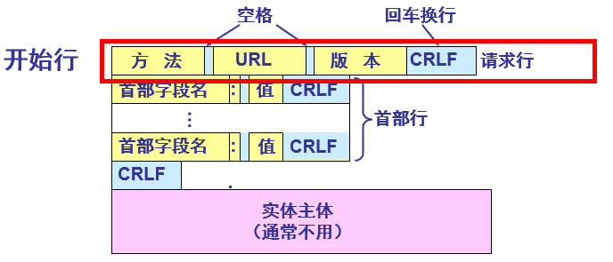
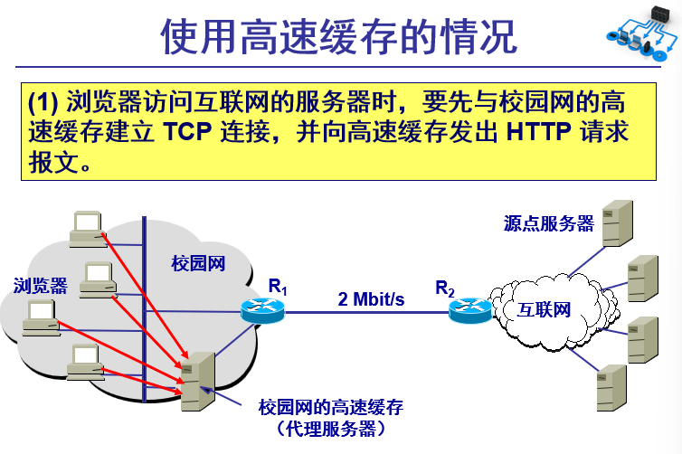
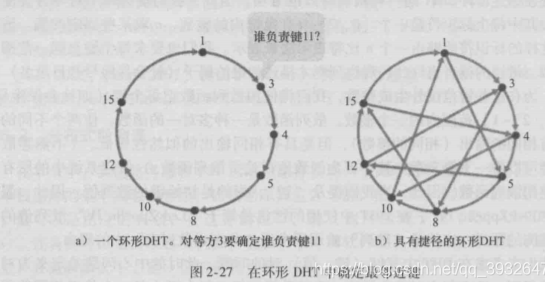
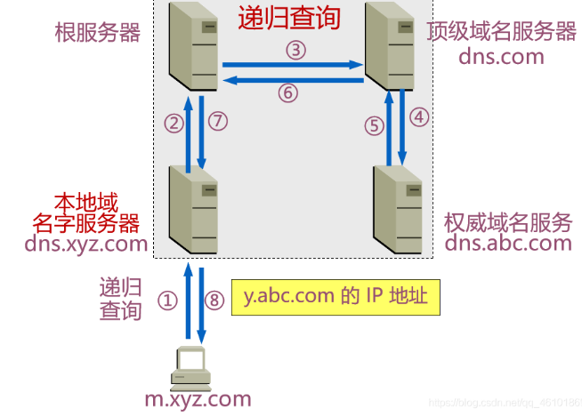
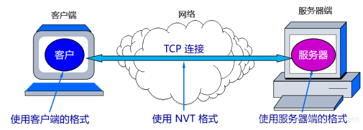

## 第二章 应用层


### 2.1 应用层协议原理

研发网络应用的核心是写出能够运行在不同端系统和通过网络彼此通信的程序；值得注意的是，我们不需要写在网络核心设备如路由器或者链路层交换机上运行的软件，这种设计方式即将应用程序限制在端系统的方法，促进了大量网络应用程序的迅速研发和部署

#### 2.2.1 网络应用程序体系结构

------

应用程序的体系结构不同于网络的体系结构。从应用程序研发者的角度来看，网络体系结构是固定的，并为应用程序提供特定的服务集合；换言之，应用程序体系结构使用应用程序开发设计的，它规定了在端系统上如何组织应用程序。两种常见的现代网络应用程序所采用的体系结构为：**客户-服务器体系结果和对等体系结构**

------

**A.客户-服务器体系结构**(C/S)
在该体系结构中，有一个**总是打开**的主机，即服务器，它接收和服务来自其他许多被称为客户的主机请求；值得注意的是，在该体系结构中，**客户之间是不直接通信的**；**该服务器具有固定的、周知的地址**

客户-服务器体系结构的著名应用有：Web、FTP、Telnet和电子邮件。

通常，如果仅有一台服务器处理所有的请求，那么服务器系统将很快变得不堪重负，为此，配备大量主机的数据中心常被用于创建强大的虚拟的服务器，一个数据中心可以有数十万台服务器，它们需要供电和维护，同时服务提供商还需要支付不断出现的互联和带宽费用，以及发送和接收到达/来自数据中心的数据；


- **客户进程的特点**
  在进行通信时临时成为客户，它也可在本地进行其它的计算
  用户计算机上运行，在打算通信时**主动**向远地服务器发起通信
  **客户方必须知道服务器进程所在主机的IP地址才能发出服务请求**
  需要时可以与多个服务器进行通信

- **服务器进程的特点**
  专门用来提供某种服务的程序，可“同时”处理多个远地或本地客户的请求
  **必须始终处于运行状态才有可能提供服务**
  通信开始之前服务器进程不需要知道客户进程所在主机的IP地址，无论客户请求来自哪里，服务器进程被动等待服务请求的到来即可
  通常是当系统启动时即自动调用并一直运行着。某些服务器程序也可以由用户或其它进程在通信前启动
  **被动等待**并接受来自多个客户的通信请求

  

**B.P2P体系结构**
在P2P体系结构中，对位于数据中心的专用服务器有着最小（或者没有）依赖。**应用程序在间断连接的主机对之间使用直接通信，这些主机被称为对等方**。对等方并不为服务提供商所拥有，因为这种对等方通信不需要通过专门的服务器，所以该体系结构也被称为对等方到对等方结构


目前，**流量密集型应用**都是P2P体系结构的。这些应用包括文件共享（例如BitTorrent）、协助下载（例如迅雷）、因特网电话（例如Skype）和IPTV(例如迅雷看看)。

值得注意的是，**某些应用具有混合的体系结构**，它们结合了客户-服务器和P2P这两种体系结果，比如许多的即时通讯工具，服务器用来跟踪用户IP地址，但是用户之间的通信则使用直接发送

P2P体系结构最引人入胜的特性之一就是它们的**自扩展性**。比如在文件共享应用中，对等方可能通过向文件的原始拥有者发出请求而产生工作量，但是对等方也有可能通过为其他对等方传送文件而为原始拥有者分担压力；P2P体系结构也是成本有效的，因为他通常不需要庞大的服务器基础设施和服务带宽。

**但是P2P也面临着以下三个问题：**

- ISP友好。大多数住宅ISP受制于非对称带宽应用，也就是下载比上传要多得多。但是P2P视频和文件分发应用改变了从服务器到住宅ISP的上载流量，因而给ISP带来压力；
- 安全性。因为其高度的分布和开放式，P2P应用也可能给安全带来挑战；
- 激励。如何说服用户资源向应用提供带宽、存储和计算资源？这是一个问题；

#### 2.1.2 进程通信

------

在操作系统中，实际进行通信的是进程而不是应用程序；当进程运行在同一个端系统上时，它们使用进程间通信机制相互通信；而进程间通信的规则是由端系统上的操作系统确定的。当进程运行在不同的端系统上时，它们通过跨越计算机网络的报文相互通信；发送进程产生报文并且向网络中发送，接收进程接收报文并对此作出响应（不响应也是一种响应）。

**客户进程和服务器进程**
对于没对通信进程，我们通常将这两个进程之一标识为客户，而另一个进程标识为服务器。
需要注意的是，**在某些P2P应用中，一个进程可能既是客户也是服务器**，因为在一个文件共享应用中，一个进程的确既能请求文件也能发送文件。所以从进程所扮演的角色来区分是客户进程还是服务器进程不够精确，所以我们从发起通信的顺序来定义它们：在给定的一对进城之间，**首先发起通信的进程被标记为客户进程，在会话开始时等待联系的进程被称为服务器进程。**


**进程与计算机网络之间的接口**
多数应用程序是由通信进程对组成的，运行在不同端系统上的进程对之间通过计算机网络来实现通信。所以，在应用程序进程和计算机网络之间存在一个接口，该接口被称为**套接字**。更为准确的说，套接字是同一台主机内**应用层和运输层之间的接口**。由于该套接字是建立网络应用程序的可编程接口，因此套接字也被称为应用程序和网络之间的**应用编程接口**（Application Programming Interface）.

应用程序开发者可以控制套接字在应用层的一切内容，但是对于运输层的相关部分，几乎没有控制权，可以做的有：

- 选择传输层协议和设定几个传输层参数，比如最大缓存和最长传输层报文长度

- 进程寻址

为了向特定目的进程发送报文，发送机进程需要知道接收进程（更为准确的说是，接收进程对应的套接字）的标记。该标记由两部分组成：**接收进程所在的主机地址和接收进程在该主机中的标记**；在因特网中，主机由IP地址标记，其中IP地址是一个**32位（IPV4）标记**；而接收进程（或者说是其对应的套接字）使用端口号标记；一些常用的应用程序有着固定的端口号，比如Web服务器使用80端口、邮件服务器（运行SMTP协议）使用25端口等

#### 2.1.3 可供应用程序使用的运输服务

传输层协议的特点大致可以从以下这四个方面考量：**可靠数据传输、吞吐量、定时和安全性**

**可靠数据传输**
如同在第一章中介绍的，分组在传输过程中可能会丢失。比如，分组因为路由器中的缓存溢出而被丢弃或者分组在传输的过程中发生了损坏等情况；有些应用是不允许数据发生丢失的，比如电子邮件、文件传输、远程主机访问、Web文档传输以及金融应用等。为了支持这些应用，必须做一些工作以**确保应用程序一段发送的数据正确、完全地交付给接收数据的进程**。如果一个协议提供了这样得确保数据交付的服务，就认为该协提供了可靠数据传输。当应用程序使用可靠数据传输的传输层协议时**，只要将要发送的数据传输进套接字就可以完全相信该数据可以完整无差错地到达接收方**；

当一个运输层协议不提供可靠数据传输时，由发送方发送的数据就可能不能够到达接收进程。有些应用是允许这样的情况发生的，这些应用被称为丢失允许的应用。这类应用常见的有：交谈式音频和视频。它们能够承担丢失一定量的数据损失，在这些应用中，如果丢失少量数据将出现小干扰，但是不会出现致命的损伤，这些应用为**容忍丢失的应用**。

**吞吐量**
在一条网络路径上的两个进程之间的通信会话中，**可用吞吐量**就是指**能够向接收进程交付比特的速率**。因为会有其他会话共享该网络的路径的带宽，并且因为这些会话的到来和离开，可用吞吐量将发生变化；这就导致另一种自然的服务，即运输层协议能够提供确切的可用吞吐量。使用这种服务时，应用程序就能以明确的速度接收数据，并且运输层应当保证可用吞吐量必须总是至少为该速度；

对吞吐量有明确要求的应用程序被称为**带宽敏感的应用**。许多多媒体应用是带宽敏感的（尽管某些多媒体应用程序可能采用自适应编码技术对数字视频和音频以与当前可用带宽相匹配的速度加解码。），比如因特网电话。而**弹性应用**则对吞吐量没有严格的要求。这类应用包括：电子邮件、文件传输以及web传送等。值得注意的是，吞吐量当然是越多越好了。

**定时**
定时和吞吐量都是关于速度的。一个提供定时服务的例子是：发送方注入套接字中的每个比特到达接收方的套接字不迟于100ms。也就是说，**定时**是**对数据从发送到到达所需时间的要求**，而**吞吐量**是**对数据交付速度的要求**。打个比方，**吞吐量是指一个小时内经过某个收费站的汽车数目，而定时则是第一辆车从出发到进入收费站的时间**。有些应用为了服务的有效性而对数据到达时间有严格的要求，常见的应用有：因特网电话、多方在线游戏等；

**安全性**
运输层可以提供一些安全服务，以防止传输的数据以某种方式在这两个进程之间被察觉到。这些安全服务包括：数据的加解密、数据的完整性和端点鉴别等。

#### 2.1.4 因特网提供的传输层服务

因特网（更一般的是TCP/IP网络）为应用程序提供连个运输层协议，即UDP和TCP。每个协议对应用程序提供了不同服务的组合。以下为常见的因特网应用的特点：


- **TCP服务**
  TCP服务模型包括了面向连接的服务和可靠数据传输服务。

  **面向连接的服务**：在应用层数据报文开始流动之前，TCP会在客户端和服务器端相互交换传输层控制信息。这个握手过程将提示客户端和服务器端，让它们为即将到来的大量分组做好准备；握手阶段接收后将建立一个TCP连接。这条链接是全双工的，即连接双方使用该条链接可以同时进行报文的收发。这条连接将在通讯结束后拆除；
  **可靠的数据传输**：应用程序使用TCP协议可实现无差错、按适当顺序交付所有发送的数据，没有字节的丢失和冗余；

  TCP服务还提供了**拥塞控制机制**。该机制不一定会给通行双方带来好处，但是会给网络带来整体好处；当发送方和接收方之间的网络出现拥塞时，TCP将使用拥塞控制机制来使网络恢复正常

- **UDP服务**

  UDP服务是一种不提供不必要服务的轻量级运输协议。它仅提供最小服务。UDP是无连接的也就是说通信之前没有握手；UDP不提供数据的可靠传输；UDP也没有拥塞控制机制。有些应用场景下，UDP协议将带来更多的便利和效率，比如DNS和一些因特网电话服务（为了避免拥塞控制协议的控制而使用UDP）

- **传输层无法提供的服务**
  从可靠数据传输、吞吐量、定时、安全性等四个角度来看运输层提供的服务，我们发现，运输层无法对吞吐量和定时做出保证。但是，今天的因特网能够为时间敏感的应用提供满意的服务，尽管它并不提供任何定时或者带宽保证；

#### 2.1.5 ssl与tcp与http

**HTTP/HTTP S——应用层**
  HTTP/HTTP S的握手过程是一个数据传输的过程、一个从应用层经过表示层、会话层到达传输层TCP、SSL/TLS的地方。

**HTTP：**
超文本传输协议（HTTP，HyperText Transfer Protocol）是互联网上应用最为广泛的一种网络协议。设计 HTTP 最初的目的是为了提供一种发布和接收 HTML 页面的方法。它可以使浏览器更加高效。**HTTP 协议是以明文方式发送信息的，如果黑客截取了 Web 浏览器和服务器之间的传输报文，就可以直接获得其中的信息。**

**HTTP S：**
以安全为目标的 HTTP S通道，是 HTTP 的安全版。HTTP S 的**安全基础**是 **SS L**。SS L 协议位于 TCP/I P 协议与各种应用层协议之间，为数据通讯提供安全支持。SSL 协议可分为两层：**SSL 记录协议**（SSL Record Protocol），它建立在可靠的传输协议（如TCP）之上，为高层协议提供数据封装、压缩、加密等基本功能的支持。**SSL 握手协议**（SSL Handshake Protocol），它建立在 SSL 记录协议之上，用于在实际的数据传输开始前，通讯双方进行身份认证、协商加密算法、交换加密密钥等。


**HTTPS和HTTP的区别**
主要如下：
1、https协议需要到ca申请证书，一般免费证书较少，因而需要一定费用。
2、http是超文本传输协议，信息是明文传输，https则是具有安全性的ssl加密传输协议。
3、http和https使用的是完全不同的连接方式，默认端口也不一样，前者是80，后者是443。
4、http的连接很简单，是无状态的；HTTPS协议是由SSL+HTTP协议构建的可进行加密传输、身份认证的网络协议，比http协议安全。
5、HTTP协议运行在TCP之上，所有传输的内容都是明文，客户端和服务器端都无法验证对方的身份。
HTTPS为了数据传输的安全，在HTTP的基础上加入了SSL协议，SSL依靠证书来验证服务器的身份，并为浏览器和服务器之间的通信加密。所有传输的内容都经过加密，加密采用对称加密，但对称加密的密钥用服务器方的证书进行了非对称加密。**HTTPS协议的主要作用**可以分为两种：一种是建立一个**信息安全通道**，来保证数据传输的安全；另一种就是**确认网站的真实**性。

**HTTP通信过程：**
（1）浏览器建立与WEB服务器之间的连接；
（2）浏览器将请求数据打包（生成请求数据包）并发送给WEB服务器；
（3）WEB服务器将处理结果打包（生成相应数据包）并发给浏览器；
（4）WEB服务器关闭连接。

**HTTPS通信过程：**
HTTPS 协议之所以是安全的是因为 HTTPS 协议会对传输的数据进行加密，而加密过程是使用了非对称加密实现。但其实，HTTPS 在内容传输的加密上使用的是对称加密，非对称加密只作用在证书验证阶段。
HTTPS的整体过程分为证书验证和数据传输阶段，**具体的交互过程如下**：


HTTPS 协议之所以是安全的是因为 HTTPS 协议会对传输的数据进行加密，而加密过程是使用了非对称加密实现。但其实，HTTPS 在内容传输的加密上使用的是对称加密，在证书验证阶段才使用了非对称加密。

**（1） 证书验证阶段**
浏览器发起 HTTPS 请求
服务端返回 HTTPS 证书
客户端验证证书是否合法，如果不合法则提示告警
**（2）数据传输阶段**
当证书验证合法后，在本地生成随机数（例如：生成abcde）
通过公钥加密随机数，并把加密后的随机数传输到服务端
服务端通过私钥对随机数进行解密（解密后服务端得到：abcde）
服务端通过客户端传入的随机数构造对称加密算法，对返回结果内容进行加密后传输

**TCP——传输层**
TCP（Transmission Control Protocol，传输控制协议）是一种面向连接的、可靠的、基于字节流的通信协议，数据在传输前要建立连接，传输完毕后还要断开连接。

TCP的三次握手：
1、从最开始双方都处于CLOSED状态。然后服务端开始监听某个端口，进入了LISTEN状态。
2、然后客户端主动发起连接，这一过程由客户端执行connect来触发。将标志位 SYN置为1，随机生成一个序号seq=x ， 自己变成了SYN-SENT状态。
3、服务端接收到，将SYN和ACK(对应客户端发来的SYN)都置为1，随机生成一个序号seq=y，还生成一个确认号ack=对方序号+1，自己变成了SYN-RCVD。
4、客户端收到确认后，检查收到的ack是否为自己的序号+1，若没问题则将ACK置为1，将自己的序号值seq设为对方的确认号，将自己的确认号ack置为对方序号+1，发给服务端，将自己变成了ESTABLISHED状态；服务端收到数据包之后，检查ack是否为自己序号+1，如果没问题也变成了ESTABLISHED状态。
两方可以开始传输数据了。


**（小结：三次握手的关键是要确认对方收到了自己的数据包，这个目标就是通过“确认号（Ack）”字段实现的。计算机会记录下自己发送的数据包序号Seq，待收到对方的数据包后，检测“确认号（Ack）”字段，看Ack = Seq + 1是否成立，如果成立说明对方正确收到了自己的数据包。）**

**为什么需要第三次通信 ？**
1、在第一次通信过程中，A向B发送信息之后，**B**收到信息后可以确认**自己的收信能力和A的发信能力**没有问题。
2、在第二次通信中，B向A发送信息之后，**A**可以确认**自己的发信能力和B的收信能力**没有问题，但是B不知道自己的发信能力到底如何，所以就需要第三次通信。
3、在第三次通信中，A向B发送信息之后，**B就可以确认自己的发信能力没有问题。**
小结：3次握手完成两个重要的功能，既要**双方做好发送数据的准备工作(双方都知道彼此已准备好)**，也要**允许双方就初始序列号进行协商**，这个序列号在握手过程中被发送和确认。

**TCP的四次挥手：**

四次挥手 指断开一个TCP连接时，需要客户端和服务端总共发送4个包以确认连接的断开。在socket编程中，这一过程由客户端或服务端任一方执行close来触发。
由于TCP连接时**全双工**的，因此，每个方向都必须要单独进行关闭，这一原则是当一方完成数据发送任务后，发送一个FIN来终止这一方向的连接，收到一个FIN只是意味着这一方向上没有数据流动了，即不会再收到数据了，但是在这个TCP连接上仍然能够发送数据，直到这一方向也发送了FIN。首先进行关闭的一方将执行主动关闭，而另一方则执行被动关闭。
（1）第一次挥手：Client发送一个FIN，ACK，确认号和序号，用来关闭Client到Server的数据传送，Client进入FIN_WAIT_1状态。
（2）第二次挥手：Server收到FIN后，发送一个ACK给Client，确认号为对方序号+1，Server进入CLOSE_WAIT状态。
（3）第三次挥手：Server发送一个FIN和ACK，序号用对方的确认号，确认号为对方序号＋1，关闭Server到Client的数据传送，Server进入LAST_ACK状态。
（4）第四次挥手：Client收到FIN后，Client进入TIME_WAIT状态，接着发送一个ACK给Server，确认号为对方序号+1，Server进入CLOSED状态，完成四次挥手。


上面是一方主动关闭，另一方被动关闭的情况，实际中还会出现同时发起主动关闭的情况:


应用层的进程，同时发出关闭命令，两端均从 ESTABLISHED 变为了 FIN_WAIT1 状态，同时发送 FIN 段给对方。
然而发送完 FIN 段后，并未收到对端的 ack 而是对方发来的一个 FIN 段，于是直接进入 CLOSING 状态，CLOSING 状态是一个新状态，之前我们没有遇到过，只在 TCP 状态机图里看到过。现在你要记住，CLOSING 状态是由于同时关闭导致的。
又过了一会儿，TCP 接收到 ack 后，进入 TIME_WAIT 状态。

**提问：为什么连接的时候是三次握手，关闭的时候却是四次握手？**
①因为当Server端收到Client端的SYN连接请求报文后，可以直接发送SYN+ACK报文。其中ACK报文是用来应答的，SYN报文是用来同步的。
②但是关闭连接时，当Server端收到FIN报文时，很可能并不会立即关闭SOCKET，所以只能先回复一个ACK报文，告诉Client端，“你发的FIN报文我收到了”。
③只有等到我Server端所有的报文都发送完了，我才能发送FIN报文，因此不能一起发送。故需要四步握手。

**4、 TLS/SSL——传输层**
TLS/SSL 的功能实现主要依赖于三类基本算法：散列函数 Hash、对称加密和非对称加密，其利用非对称加密实现身份认证和密钥协商，对称加密算法采用协商的密钥对数据加密，基于散列函数验证信息的完整性。
散列函数 Hash：常见的有 MD5、SHA1、SHA256，该类函数特点是函数单向不可逆、对输入非常敏感、输出长度固定，针对数据的任何修改都会改变散列函数的结果，用于防止信息篡改并验证数据的完整性。在信息传输过程中，散列函数不能单独实现信息防篡改，因为明文传输，中间人可以修改信息之后重新计算信息摘要，因此需要对传输的信息以及信息摘要进行加密。
对称加密：常见的有 AES-CBC、DES、3DES、AES-GCM 等，信息的加密和解密用相同的密钥，掌握密钥才能获取信息。在对称加密中，信息安全的基础是保证密钥的安全。
非对称加密：即常见的 RSA 算法，还包括 ECC、DH 等算法，算法特点是，密钥成对出现，一般称为公钥(公开)和私钥(保密)。因此掌握公钥的不同客户端之间不能互相解密信息，只能和掌握私钥的服务器进行加密通信。服务器持有私钥可以实现一对多的通信，而客户端可以用公钥来验证服务器发送的数字签名。服务器只需要维持一个私钥就能够和多个客户端进行加密通信，但该算法的计算复杂，加密速度慢。

结合三类算法的特点，TLS/SSL 的基本工作方式是，客户端使用非对称加密与服务器进行通信，实现身份验证并协商对称加密使用的密钥，然后对称加密算法采用协商密钥对信息以及信息摘要进行加密通信，不同的节点之间采用的对称密钥不同，从而可以保证信息只能通信双方获取。


**SSL / TLS 握手详细过程**

1、“client hello” 消息：客户端通过发送 “client hello” 消息向服务器发起握手请求，该消息包含了客户端所支持的 TLS 版本，支持的算法列表和密码组合以供服务器进行选择，还有一个 “client random” 随机字符串。
2、“server hello” 消息：服务器发送 “server hello” 消息对客户端进行回应，该消息包含了服务器选择的加密算法，服务器选择的密码组合，数字证书和 “server random” 随机字符串。
验证：客户端对服务器发来的证书进行验证，确保对方的合法身份，验证过程可以细化为以下几个步骤：
（1）检查数字签名
（2）验证证书链
（3）检查证书的有效期
（4）检查证书的撤回状态 (撤回代表证书已失效)
4、"premaster secret"字符串：客户端向服务器发送另一个随机字符串 “premaster secret (预主密钥)”，这个字符串是经过服务器的公钥加密过的，只有对应的私钥才能解密。
5、使用私钥：服务器使用私钥解密 “premaster secret”。
6、生成共享密钥：客户端和服务器均使用 client random，server random 和 premaster secret，并通过相同的算法生成相同的共享密钥 KEY。
7、客户端就绪：客户端发送经过共享密钥 KEY 加密过的 “finished” 信号，为了防止握手过程遭到篡改，该消息的内容是前一阶段所有握手消息的MAC值。
8、服务器就绪：服务器发送经过共享密钥 KEY 加密过的 “finished” 信号，该消息的内容是前一阶段所有握手消息的 MAC 值。
9、达成安全通信：握手完成，双方使用对称加密进行安全通信。


第 8 与第 9 步用以防止握手本身遭受篡改。设想一个攻击者想要控制客户端与服务器所使用的算法。客户端提供多种算法的情况相当常见，某些强度弱而某些强度强，以便能够与仅支持弱强度算法的服务器进行通信。攻击者可以删除客户端在第 1 步所提供的所有高强度算法，于是就迫使服务器选择一种弱强度的算法。第 8 步与第 9 步的 MAC 交换就能阻止这种攻击，因为客户端的 MAC 是根据原始消息计算得出的，而服务器的 MAC 是根据攻击者修改过的消息计算得出的，这样经过检查就会发现不匹配。

5、证书校验
记录一个个人引发的问题，为什么窃听者不能有两个公钥和私钥去进行信息截取呢，这样不就完美获取信息了吗。

以下是解答：
1、什么是证书？是用来干嘛的？
证书就是数字化的文件，里面有一个实体(网站，个人等)的公共密钥和其他的属性，如名称、CA信息、加密算法等。该公共密钥只属于某一个特定的实体，它的作用是防止一个实体假装成另外一个实体。

证书主要有两个作用，一个是加密通信，一个是数字签名。
　加密通信是保证数据不被别人截获并且不被知道通信内容的，主要是两个层次，一个是通信双方身份确认，避免对方是冒充的，另一个是数据通过公钥加密传输和使用私钥解密。这方面常见的具体应用就是SSL和HTTPS。
　数字签名是用于识别签名者身份的，这个从字面就可以理解。你使用你的私钥进行签名，然后用户看到你的签名后用公钥检查，发现的确是你的数字签名，就可以了。这个常见的应用有代码发行商签名，就是签名控件的那种，邮件数字签名，电子公章等。

2、什么是CA，证书只有CA能发吗，我自己不能发证书吗？
CA是Certification Authoritcation的缩写，即证书颂发机构，他是一个负责发放和维护证书的实体，一般是第三方的。
CA的组织结构跟域名有些相似，有一个根CA，然后它派生了一些子的，子又生孙，孙又生子，子子孙孙无穷匮也。但是给人家当孙子的滋味是不好受的，要交年费的，而且一个证书一年上万块。于是乎，你可以自己当老大，就是自己当根，然后再发放证书，有一个缺陷是要取得别人的认可才行。自己做根CA要有一个根证书，然后自己给自己签名，就行了。然后再用这个根证书和根私钥给你的子机构签发证书就可以了。用户使用你签名的证书之前必须要把你的根证书给用户，让用户安装在受信任的根区域就算认可了。

3、证书校验的过程
证书链 (certificate chain)：也称为证书路径，是用于认证实体合法身份的证书列表，具体到 HTTPS 通信中，就是为了验证服务器的合法身份。之所以使用证书链，是为了保证根证书 (root CA certificate) 的安全，中间层可以看做根证书的代理，起到了缓冲的作用，如下图所示：


### 

证书链从根证书开始，并且证书链中的每一级证书所标识的实体都要为其下一级证书签名，而根证书自身则由证书颁发机构签名。客户端在验证证书链时，必须对链中所有证书的数字签名进行验证，直到达到根证书为止。

4、根证书是CA认证中心给自己颁发的证书,是信任链的起始点。**安装根证书意味着对这个CA认证中心的信任。**
从技术上讲，证书其实包含三部分，用户的信息，用户的公钥，还有CA中心对该证书里面的信息的签名。验证一份证书的真伪（即验证CA中心对该证书信息的签名是否有效），需要用CA 中心的公钥验证，而CA中心的公钥存在于对这份证书进行签名的证书内，故需要下载该证书，但使用该证书验证又需先验证该证书本身的真伪，故又要用签发该证书的证书来验证，这样一来就构成一条证书链的关系，这条证书链在哪里终结呢？答案就是根证书，根证书是一份特殊的证书，它的签发者是它本身，下载根证书就表明您对该根证书以下所签发的证书都表示信任，而技术上则是建立起一个验证证书信息的链条，证书的验证追溯至根证书即为结束。**所以说用户在使用自己的数字证书之前必须先下载根证书**。


#### 2.1.6 应用层协议

应用层协议定义运行在不同端系统上的应用程序进程如何相互传递信息。涉及的内容包括：交换的报文类型（请求或者响应）、报文中包含哪些字段、字段如何被解释、一个进程何时收发报文并如何对报文进行响应等内容

需要注意的是，**应用层协议是网络应用的一部分**

#### 2.1.7 涉及的应用层应用

即将介绍的应用包括：Web、文件传输、电子邮件、目录服务和P2P。Web部分将介绍HTTP协议，它比较简单和易于理解；FTP则和HTTP形成了对照；电子邮件是比Web更为复杂的应用，因为它使用了多个应用层协议；大多数用户不会直接和DNS接触，但是DNS很好地说明了一种核心的网络功能是如何在应用层实现的。最后便是P2P应用的简单介绍了。

### 2.2 WEB和HTTP

#### www体系结构与协议（C/S）


URL格式在上面


#### 2.2.1 HTTP概述

HTTP（HyperText Transfer Protocol）是WEB的应用层协议，它是Web的核心；HTTP有两部分实现，一个客户端程序一个服务器程序；HTTP定义了客户和服务器进行报文交换的方法；

Web页面是由对象组成的，一个对象是一个文件，它们通过一个**URL地址**进行寻址。客户和服务器交互的核心思想是客户通过HTTP请求对服务器发出对Web页面的请求报文，服务器收到该报文后将返回包含该对象的HTTP响应报文。**URL地址由两部分组成**：**存放对象的服务器主机名**和**对象的路径名**

**HTTP使用TCP作为它的传输层协议**；HTTP客户首先发起一个与服务器的TCP连接，需要注意的是，服务器根据请求作出响应，但是不存储任何关于该客户的状态信息；也正因为这样，**HTTP被称为无状态协议**。同时，**Web使用了客户端-服务器的应用体系结构；**其中web服务器总是开着的

#### 2.2.2 持续连接和非持续连接

在因特网应用程序中，客户端和服务器将在很长的时间范围里通信；应用程序将根据自身的特点，选择以规则的间隔周期性性发出请求也可以间断性一个个发出请求。当通信是使用TCP协议时，服务器端需要做出一个决定：这些请求是使用一个TCP连接完成还是通过独立的TCP连接完成。如果采取前一个方法，则称应用程序使用**持续连接**，如果使用后一种方式，则称为**非持续连接**。

**HTTP既可使用持续连接也可以使用非持续连接。尽管HTTP在静默情况下使用持续连接**


1.**采用非持续连接的HTTP**
使用非持续连接时，每个TCP连接在服务器发送一个对象后就会关闭，也就是**每个TCP只传送一个请求报文和响应报文；**

为了描述持续连接和非持续连接的特点，我们引入RTT(Round-Trip Time)。**RTT**指的是，**一个短分组从客户端到服务器，然后再返回客户端所用的时间**。RTT包括分组的**传播时延、排队时延、处理时延**（因为是短分组，所以其传输时延可不计）；因为客户端和服务器建立TCP连接的时候，会通过一个三次握手的过程来交换传输控制信息。**三次握手的前两次占用了一个RTT**，客户结合**第三次握手通行会通过该连接发送一个HTTP请求报文，一旦该分组到达服务器，服务器便开始使用TCP传输HTML对象**。因此，粗略地说，**响应时间是两个RTT加上传输HTML的时间（不是传播）。**

2.**采用持续连接的HTTP**
从上面可以看出，非持续连接必须为每个请求新建一个TCP连接，而每个TCP连接将占用系统资源，包括缓冲区和变量等，这样服务器的负担就很重了。第二，一个对象将通过两个RTT的时延才能交付。

如果使用持续连接，那么服务器在发送响应报文后将保持该TCP打开，后续客户端可以使用该连接来向服务器发出请求。不但一个完整的页面可以通过同一个连接传送，同一台服务器上的多个页面也可以通过同一个连接发送。这就提高了效率；

一般来说，**如果一条连接在一定的时间间隔后没被使用的话，就会被关闭。HTTP默认使用的是带流水线的持续连接。**

#### 2.2.3 HTTP报文格式：请求报文和响应报文

- **请求报文**


一个请求报文具有至少一行的内容。请求报文的第一行称为**请求行**，其后继的各行被称为首部行。请求行包含三个内容：方法字段、URL字段、HTTP版本；其中方法字段可为：GET、POST、PUT、DELETE、HEAD等。URL字段里可以传递请求对象的标志；

首部行包含是否在发送完响应报文后关闭TCP连接的Connection；请求的主机地址（该头部信息被Web高速缓存所要求）；浏览器版本；可接受的语言等头部信息；

在首部行之后一个空行，之后便是请求的“实体体”。该实体体可以在POST方法里传递Form表单内容或者传递其它一些二进制流数据等。值得注意的是，表单也不一定必须使用POST方法。如果使用get,实体体为空，会显示在url中。

Head类似于get方法，将会用一个http报文进行响应，但是不返回请求对象，经常用作调试跟踪。put方法允许用户上传对象到指定的Web服务器上指定的路径。Delete方法允许用户或应用程序删除Web服务器上的对象。



报文由三个部分组成，即**开始行、首部行和实体主体。**
在请求报文中，开始行就是请求行。
方法--->命令。因此，**请求报文的类型**是由它所采用的**方法决定的。**

**HTTP响应报文格式**


响应报文总体上也分三个部分，第一部分是**状态行**，包含HTTP版本、状态以及状态信息等内容；第二部分是**首部行**，包含发送日期、服务器类型、上一次修改请求资源的时间、内容的类型等内容。第三部分是**实体体。实体体包含请求对象本身。**

这里的Date是从文件系统中检索到该对象，插入到响应报文，并发送该响应报文的时间。


URL是所请求的资源的 **URL**
版本是**HTTP** **的版本**。
响应报文的开始行是**状态行。状态行包括三项内容，即** **HTTP** **的版本**，**状态码**，以及**解释状态码的简单短语。**

**常见状态码**
200：请求成功 处理方式：获得响应的内容，进行处理

301：请求到的资源都会分配一个永久的URL，这样就可以在将来通过该URL来访问此资源 处理方式：重定向到分配的URL

400：非法请求 处理方式：丢弃

404：没有找到 处理方式：丢弃

505：服务器不支持请求报文使用的http版本。

#### 2.2.4 用户与服务器的交互：Cookie


前面提到，**HTTP是无状态协议**，但是Web站点为了识别用户身份或者限制用户访问的时间或者将用户访问的内容同用户身份相关联，**Web站点可以使用Cookie技术**；

- Cookie技术包含4个组件

- ​    HTTP响应报文里增加一个关于Cookie的首部行；
- ​    HTTP请求报文里增加一个关于Cookie的首部行；
- ​    用户端系统保留一个Cookie文件，由浏览器保存维护；
- ​    Web站点建立Cookie和用户身份的关联；

虽然，Cookie的使用方便了用户也方便了服务端，但是它的使用存在争议，因为使用Cookie被认为是对用户隐私的一种侵犯，因为Web站点可以通过Cookie得到很多用户的信息，并有可能将这部分信息卖给第三方等

#### 2.2.5 Web缓存

Web缓存器也被称为**代理服务器**，它代表初始web服务器来满足HTTP请求。它**有自己的存储空间**，并**在存储空间里保持有最近请求过的对象的副**本；可以通过配置浏览器，**将所有指向初始服务器的请求首先指向代理服务器**。

当代理服务器收到一个HTTP请求后，它将检查本地是否缓存过该对象，如果缓存过该对象，将**检查是否过期**，如果没有过期，则直接将该对象返回给浏览器；**如果本地不存在或者存在已过期，则代理服务器将根据请求报文里的Host首部行以及请求行里的URL字段向初始服务器发出请求，然后将响应对象返回给浏览器并缓存在本地。**

通常，代理服务器与客户端的通信速度要快于初始服务器与客户端的连接速度；Web代理服务器可以大起大减少对客户请求的响应时间；而且，缓存器能从整体上大大降低因特网上的web流量，从而有助于提高所有应用程序的性能；

通过使用内容分发网络（Content Distribution Network），Web缓存器正在因特网中发挥越来越重要的作用

**Web缓存即是客户又是服务器**





#### 2.2.6 条件GET方法

高速缓存器的使用，带来很多好处，但是有一个问题就是代理服务器对缓存对象的管理：如何确保所请求的对象是最新的？其实HTTP提供了一种机制，允许缓存器证实其使用的对象是最新的，这种机制就是条件GET方法。使用条件GET方法只需在使用GET方法的时候，增加一个If-Modified-Since首部行，其对应的内容是一个时间，如果所请求的资源在指定日期后被修改了，那么服务器将返回新的对象，否则服务器将返回一个包含空实体体的报文。这样代理服务器就可以确认缓存是否过期了。

#### 万维网的文档

**1.超文本标记语言HTML**

```javascript
<HTML>         //HTML文档开始              <HEAD>         //首部开始                      <TITLE>一个 HTML 的例子</TITLE>//标题
</HEAD>    //首部结束
<BODY>     //主体开始
      <H1>HTML 很容易掌握</H1>//一级标题
      <P>这是第一个段落。虽然很//第一个段落
       短，但它仍是一个段落。</P>
      <P>这是第二个段落。</P>//第二个段落
</BODY>//主体结束
</HTML>//HTML文档结束

```

HTML还规定了链接的设置方法。每个链接都有一个起点和终点。

**远程链接：**超链的终点是其他网点上的页面。

**本地链接：**超链指向本计算机中的某个文件。


### 


### 2.3 文件传输协议FTP

**在一个典型的FTP应用中，用户通过FTP代理和FTP交互**。用户首先提供远程主机的主机名，使得FTP用户代理建立一个到远程主机的TCP连接，之后需要用户提供用户名和密码，它们作为FTP命令的一部分在TCP连接上传输；一旦服务器授权，用户便可以和服务器进行文件传输了。

**HTTP和FTP都是应用层协议**，它们都运行在**TCP协议**之上，但是它们之间也有一些重要区别，其中一个就是**FTP使用连个并行的TCP连接来传输数据**，**一个TCP被称为控制连接，用来传输FTP命令；一个TCP连接被称为数据连接，用于传输文件数据；**因为FTP协议内，控制信息是通过一个独立的TCP连接传输，所以我们称FTP的控制信息是**带外传送的**；**如果控制信息和数据信息通过同一个TCP传输，则称为带内传送**。TCP控制连接端口21，数据连接端口20

需要注意的是，**FTP中控制连接贯穿整个会话，但是数据连接会在一个文件开始传输的时候建立**，在传输结束后关闭；所以每次传输一个新的文件时，都会新建一个数据连接；

同时，**FTP需要在整个会话期间，保留用户的状态**，也就是将控制连接同用户账户关联起来，同时记录用户在远程目录树上的操作，这就限制了FTP可以同时维持的会话总数.

FTP命令和回答
从客户到服务器的命令和从服务器到客户的回答，都是以7比特ASCII格式在控制连接上传递的


#### 简单文件传送协议TFTP


**TFTP 的工作很像停止等待协议**

- 发送完一个文件块后就等待对方的确认，确认时应指明所确认的块编号。
- n发完数据后在规定时间内收不到确认就要重发数据 PDU。
- 发送确认 PDU 的一方若在规定时间内收不到下一个文件块，也要重发确认 PDU。这样就可保证文件的传送不致因某一个数据报的丢失而告失败。 
- **开始工作时，TFTP** 客户进程发送一个读请求 PDU 或写请求 PDU 给 TFTP 服务器进程，其熟知端口号码为 69。
- TFTP 服务器进程要选择一个新的端口和 TFTP 客户进程进行通信。
- n若文件长度恰好为 512 字节的整数倍，则在文件传送完毕后，还必须在最后发送一个只含首部而无数据的数据 PDU。
- 开始工作时，TFTP** 客户进程发送一个读请求 PDU 或写请求 PDU 给 TFTP 服务器进程，其熟知端口号码为 69。
- TFTP 服务器进程要选择一个新的端口和 TFTP 客户进程进行通信。
- 若文件长度恰好为 512 字节的整数倍，则在文件传送完毕后，还必须在最后发送一个只含首部而无数据的数据 PDU。
- 若文件长度不是 512 字节的整数倍，则最后传送数据 PDU 的数据字段一定不满 512 字节，这正好可作为文件结束的标志。
- 若文件长度不是 512 字节的整数倍，则最后传送数据 PDU 的数据字段一定不满 512 字节，这正好可作为文件结束的标志。**

### 2.4 因特网中的电子邮件（C/S）


**发送和接收电子邮件的几个重要步骤**

- **发件人调用 PC 中的用户代理撰写和编辑要发送的邮件。**
- **发件人的用户代理把邮件用 SMTP 协议发给发送方邮件服务器，**
-  **SMTP 服务器把邮件临时存放在邮件缓存队列中，等待发送。**
- **发送方邮件服务器的 SMTP 客户与接收方邮件服务器的 SMTP 服务器建立 TCP 连接，然后就把邮件缓存队列中的邮件依次发送出去。**
- **运行在接收方邮件服务器中的SMTP服务器进 程收到邮件后，把邮件放入收件人的用户邮箱中，等待收件人进行读取。**
- **收件人在打算收信时，就运行 PC 机中的用户代理，使用 POP3（或 IMAP）协议读取发送给自己的邮件。**** 
- **因特网电子邮件系统有三个核心组件：用户代理、邮件服务器、SMTP（简单邮件传输协议，Simple Mail Transfer Protocol）。**
- **用户代理 UA 就是用户与电子邮件系统的接口，是电子邮件客户端软件。**

**请注意，**POP3**服务器和** **POP3** **客户之间的通信是由** **POP3** **客户发起的。**

邮件服务器构成了电子邮件系统的核心。每个收发方在邮件服务器上拥有一个邮箱；一个典型的电子邮件发送过成为：发送方通过用户代理将邮件传送到发送方的邮件服务器，然后再传输到接收方的邮件服务器，然后邮件被分发到接收方的邮箱里；接收方从邮件服务器里获取自己的邮件时需要通过邮件服务器的验证

SMTP是因特网中电子邮件的主要应用层协议，它使用TCP可靠数据传输从发送方的邮件服务器向接收方的邮件服务器发送邮件；在每台邮件服务器上同时运行SMTP服务器和SMTP客户端。当邮件服务器接收其他邮件服务器的邮件时，它表现为SMTP服务器，当邮件服务器向其他邮件服务器发送邮件时，表现为SMTP客户端。

如果发送端不能将邮件发送个接受端的服务器，发送端的邮件服务器会在一个报文队列中保持该报文并在以后尝试再次发送。


#### 2.4.1 SMTP

**传输的三个阶段：握手、传输、关闭连接。**

SMTP25号端口。**SMTP是持续连接的**。对每一报文，客户使用一个新的MAIL FROM：crepes.fr开始。当所有报文发送完后才发送QUIT，断开连接。SMTP出现在因特网之前，尽管它有着很不错的特性，但是它具有的某种陈旧的特征表明它仍然是一种继承的技术，比如，它限制邮件报文的所有部分只能使用7比特的ASCII表示，这就导致二进制多媒体文件需要编码为ASCII，而且在发送方需要编码，接收方则需要解码。

值得注意的是，**SMTP报文一般不使用中间邮件服务器发送报文**，也就是邮件不会在中间某个邮件服务器保留；在SMTP握手阶段，SMTP客户端将介绍发送方和接收方的邮箱地址；一旦介绍完毕后，SMTP客户端将开始发送报文


#### 2.4.2 与HTTP对比

HTTP和SMTP都是用TCP协议；持续的HTTP和SMTP都是用持续连接；但是两者也有区别。

- 首先HTTP被设计为一个Pull协议而SMTP被设计为一个Push协议。即用户通过HTTP主动向服务器请求内容，而SMTP则是客户将内容推向服务器端；
- 第二个区别就是HTTP传输的数据不一定是用ASCII字符，但是SMTP则只能使用ASCII字符；
- 第三个重要区别就是，HTTP将每个对象封装在自己的响应报文里，而SMTP则将所有的报文对象放到一个报文之中；

#### 2.4.3 邮件报文格式和MIME


报文由两部分组成：一个包含环境信息的首部和一个包含邮件内容的报文体；首部和报文体之间使用空行分开；首部行的格式为关键字：及其值；**每个首部必须包含一个From和To首部**行。首部也可以包含其它信息，比如Subject等。这与2.4.1中接触的SMTP命令不同，那节中的命令是握手协议的一部分；本节中研究的内容是邮件报文自身的一部分

**MIME**：通过互联网邮件扩充MIME并没有改动SMTP或取代他。MIME的意图是继续使用目前的[RFC 822]的格式，但增加了邮件主体的结构，并定义了传送非ASCII码的编码规则


- **SMTP** **有以下**缺点：
- **SMTP** **不能传送可执行文件或其他的二进制对象。**
- **SMTP** **限于传送** **7** **位的** **ASCII** **码。许多其他非英语国家的文字（如中文、俄文，甚至带重音符号的法文或德文）就无法传送。**
- **SMTP** **服务器会拒绝超过一定长度的邮件。**
- **某些** **SMTP** **的实现并没有完全按照[RFC 821]**的SMTP**标准。** 


#### 2.4.4 邮件访问协议


需要注意的是，**SMTP是邮件服务器之间发送邮件报文的协议**，并不是用户通过代理和邮件服务器之间通信的协议；用户代理使用邮件访问协议来从邮件服务器上获取邮件信息；目前常用的邮件访问协议有POP3（Post Office Protocol-Version 3）、因特网邮件访问协议（IMAP，Internet Mail Access protocol）和HTTP

- **POP3**（C/S）
  POP3是一个非常简单的协议，因为简单，所以功能有限；POP3使用端口110来建立TCP连接（SMTP使用端口25）；POP3按照三个阶段进行工作：特许、事务处理和更新；在特许阶段，用户代理发送密码和用户名，进行身份鉴别；第二阶段，用户代理取回报文，同时还可以做删除、取消删除等标记或者统计邮件信息；第三个阶段是在用户退出后，POP3结束会话，删除被标记的邮件；

  一个需要注意的是，POP3用户代理可以使用两种事务处理模式：**一种是下载并删除，另一种是下载保留**；POP3代理发出的命令和其工作模式相关；下载并删除的方法存在的问题是，如果用户在一台设备上查看了邮件（下载了邮件）后，邮件将被删除，那么在其他设备上将无法查看邮件；这给用户带来一定的不便。使用下载保存方式，则用户下载邮件后，邮件还在服务器上。

  在用户代理与邮箱服务器之间的POP3会话期间，该POP3服务器保留了一些状态信息，特别是标记了哪些用户报文被标记为删除了。但是POP3服务器并不在POP3绘画过程中携带状态信息，大大简化了POP3的服务。

  

- **IMAP**（C/S）
  POP3协议无法为用户提供邮件分类管理的功能，虽然用户可以通过将邮件下载到本地，然后由用户代理程序做分类管理，但是处理的结果是无法同步到其他查看设备上的。为了解决这一问题，IMAP诞生了。**IMAP是一个邮件访问协议，比POP3要复杂的多**，当然也就有更多的特色了。

  （远程）IMAP将每一份邮件和一个一个文件夹联系起来，当报文第一次到达服务器时，它与收件人的INBOX相关联。收件人可以将邮件移到新创建的文件夹，阅读邮件，删除邮件等。IMAP允许用户在不同文件夹里移动邮件并且查询邮件。值得注意的是，IMAP服务器维护了IMAP会话的用户状态信息，但是POP3并不；IMAP协议还允许用户代理获取报文组件而不是报文整体。

  
  
- **基于Web的电子邮件**
  这种方式主要是指，用户使用HTTP协议和邮件服务器通信。用户代理就是普通的浏览器，但是，邮件服务器之间还是使用SMTP协议的

- 
  
  ### 2.5 DNS：因特网的目录服务
  
  #### 2.5.1 DNS提供的服务
  
  首先，需要注意的是，在计算机网络里，我们通过IP地址来标记某一时刻网络中唯一的主机。IP地址（IPV4）由4个字节组成，有着严格的层次结果，每个字节使用点号分隔。同时，为了方便记忆，我们也通过为主机提供一个便于记忆的主机名来标志主机，这样主机之间的通信就变得方便了。但是，同时也就引入一个问题：**主机名和IP地址的转换问题**；因为在信息的发送者一端，通常使用主机名来标识主机，但是在计算机网络里是使用IP地址来标机主机。
  
  计算机网络里有一种应用专门提供这样的服务，它就是**DNS（Domain Name System）域名系统。DNS是一个由分层的DNS服务器组成的分布式数据库和一个使得主机可以查询分布式数据库的应用层协议组成；**
  
  用户主机上应该运行着DNS客户端。DNS通常被其他应用层协议使用，比如：HTTP、SMTP和FTP等。这些协议在正式工作以前，首先利用DNS提供的服务，将主机名转换为IP地址，可以发现的是，DNS为用户带来方便的同时，也为网络应用带来额外的时延——查询DNS服务器的时延。需要注意的是，缓存作为一种提高性能，特别是查询性能的手段，在DNS中同样适用。
  
  DNS运行在UDP之上，使用53号端口
  
  **除了提供主机名到IP地址的转换外，DNS还提供以下重要服务：**
      **主机别名**：虽然，主机名比起IP地址好记多了，但是有时候我们的主机名仍然很长，很不好记忆，所以我们需要为主机名再起一个名字，这就是主机别名，DNS不但提供主机名到IP地址的转换服务，还提供主机名与主机别名的转换；此时主机名被称为规范主机名；
      **邮件服务器别名**：DNS同样也提供邮件服务器主机名和别名的转换服务，实际上，公司的邮件服务器和Web服务器可以使用相同的主机别名；MX记录允许一个公司的邮件服务器和Web服务器使用相同的主机名。
      **负载分配**：DNS也被用在冗余的服务器之间分配负载。每个服务器有着不同的IP地址，但是它们都和同一个主机名相关联，也就是一个IP地址集合同一个规范主机名相联系；当某个DNS服务器收到DNS请求时，该服务器奖使用IP地址的整个集合作为相应，但是在每个应答中，循环这些地址的次序。因为客户端通常都是使用IP地址集合的首个元素，所以DNS就在冗余的Web服务器之间分配了负载。同理，多个邮件服务器可以具有相同的别名。
  
  #### 2.5.2 DNS工作机理概述
  
  首先，DNS使用**UDP**作为其传输层协议；DNS服务使用53端口；当主机上的DNS客户端收到一个转换请求时，客户端将向网络发送一个DNS查询报文，然后客户端将收到一个包含相关信息的DNS回答报文，这个报文里有客户端想要的内容，之后DNS客户端将IP地址返回给请求的提出者即可。从使用DNS服务的请求者来看，DNS就像一个简单的提供直接转换服务的黑盒子，实际上这个黑盒子非常复杂，由分布在全球的大量DNS服务器以及定义DNS服务器和查询主机之间如何通信的应用层协议组成；
  
  **DNS采用分布式的设计方案**，实际上，DNS是一个在因特网实现分布式数据库的精彩范例！而之所以这样做，是因为，**单一的DNS服务器无法解决单点故障、无法保证通信容量以及无法临近所有的查询主机和维护困难等问题**


为了处理扩展性问题，DNS服务器采用层次式组织，并且分布在全世界范围内；大致来说，存在三种DNS服务器：根DNS服务器、顶级域DNS服务器和权威DNS服务器；举例说明，其工作的普遍流程：一个DNS客户端，希望获得www.baidu.com的IP地址，粗略的说，DNS客户端首先和根DNS服务器取得联系，它将返回负责解析顶级域名com的服务器的IP地址（或者其集合），客户将同这些服务器之一取得联系，然后顶级域DNS服务器建返回baidu.com的权威服务器的IP集合，客户端通过与这些服务器之一取得联系，获得www.baidu.com的IP地址。

- **根DNS服务器**：因特网上有13个根DNS服务器，大部分分布在北美洲，尽管我们可以将这13个根DNS服务器视为单个的服务器，但是每台服务器实际上是一个冗余的计算机网络以提供安全性和可靠性；
- **顶级域DNS服务器**：负责顶级域名，如com，org，net，edu，gov以及各个国家的顶级域名的转换。
- **权威DNS服务器**：因特网上，具有公共可访问主机的每个组织机构必须公共可访问的DNS记录，这些记录将主机名映射为IP地址。一个组织的权威DNS服务器收藏了这些DNS记录，多数大学和大公司实现和维护它们自己的基本和辅助（备份）权威DNS服务器；当然，也可以通过付费的方式，将相关的信息插入到其它权威服务器中；

除了上面三种DNS服务器，还有一种不在DNS层次结构之中，但是很重要的DNS，是**本地DNS服务器**。本地DNS服务器通常邻近其所在网络的其他主机。当主机发出DNS请求时，该请求被发往本地DNS服务器，它起着代理的作用，并将请求转发到DNS服务器层次结构中。

**DNS查询有两种**，**一种是递归查询一种是迭代查询**；实践中，查询通常满足这样的模式：**从请求主机到本地DNS服务器的查询是递归的，其余查询是迭代的**。所谓迭代就是，如果请求的接收者不知道所请求的内容，那么接收者将扮演请求者，发出有关请求，直到获得所需要的内容，然后将内容返回给最初的请求者。也就是说，在递归查询中，一定要给请求者想要的答案；迭代查询则是指，如果接收者没有请求者所需要的准确内容，接收者将告诉请求者，如何去获得，但是自己并不去发出请求。

**DNS缓存**
DNS缓存实际上是为了盖上时延性能并且减少在因特网上传输的DNS报文数量而引入的。DNS缓存原理十分简单，每当DNS服务器发出请求后收到回答时，就将回答的内容缓存在它自己的主机空间上。这样，如果有相同的请求到达时，就不需要再去发出请求，直接使用缓存即可；因为有了缓存，本地DNS就可以直接提供一些经常被访问的主机名所对应的IP地址，而不需要询问根DNS服务器了。需要注意的是，缓存不可避免的一个问题：有效时间。如果缓存过时而未得到更新，那么就会导致一些请求失败。

个人认为，缓存技术就是一种典型的使用空间换时间的策略

#### 2.5.3 DNS记录和报文

共同实现分布式数据库的所有DNS服务器存储了资源记录(Resource Record)。而RR提供了主机名到IP地址的映射信息；一条RR是具有一下字段的4元组：（name, value, type, TTL）;其中TTL是指该记录的生存时间，它决定了该条记录何时被删除。

首先看看type，type有4种取值，包括：A、NS、CNAME、MX等：

- type=A：则name为主机名，value为对应的IP地址；
- type=NS：则name为域，value为如何获得该域下主机IP地址的权威DNS服务器的主机名；
- type=CNAME：则value为name（本身为主机别名）所对应的主机的规范主机名；
- type=MX：则value为那么所对应的邮件服务器的规范主机名；

如果为了获得邮件服务器的规范主机名，请求一条MX记录；为了获得其它服务器的规范主机名，请求一条CNAME记录所以如果一条记录为type=A，则它直接包含了需要的信息；如果是NS，需要进一步得到权威DNS服务器的IP地址（同时返回一条NS记录，并返回一条以该NS记录的value值为name的A记录）希望得到一条A记录；而type=CNAME和MX的记录则实现了主机别名到主机规范名的转换，可以通过该规范名继续构建查询链条，直到获得希望的IP地址；

**DNS报文**
DNS报文有两种，即查询报文和回答报文，并且两种报文有着相同的结构：
DNS报文结构：


前12字节为首部区域。标识符是一个用来标记该查询的16比特数。该标志符会被复制到相应的回答报文里，以便匹配请求和回答；
    标志字段有若干标志，用来指出报文的类型（请求还是响应）、查询类型（递归还是迭代）、是否是所请求名字的权威DNS服务器、以及4个有关数量的字段，用来指示4类数据区域出现的数量；
    问题区域包含了正在进行的查询信息，包括名字字段、查询类型；
    回答区域包含了对最初请求的名字的资源记录，回答报文的回答区域可以包含多条RR，因此一个主机名能有多个IP地址；
    权威区域包含了其他权威服务器的信息；
    附加区域包含了其它有帮助的记录，比如在对于一个MX类型的请求回答报文里，回答区域里指出了邮件服务器的规范主机名，而附加区域里就有可能包含一个类型为A的关于该规范主机名的的IP地址；

**向DNS数据库中插入数据**
需要在注册登记机构完成这一任务，当你注册一个域名时，需要向该机构提供你的基本和辅助DNS服务器的名字和IP地址；该注册机构将确保一个类型为NS和类型为A的记录输入对应的顶级域名服务器；这样就完成了插入数据

### 2.6 P2P应用

对总是打开的基础设施服务器没有依赖，成对间歇连接的主机之间相互通信。

有两种典型因特网应用十分适合P2P体系结构，一种是文件分发（BitTorrent)，另一种是大型对等方社区中的数据库；我们将探讨分布式散列表的概念。P2P体系结构有着良好的自扩展性。这种扩展性的直接成因是：对等方除了比特的消费者之外还是他们的重新分发者

#### 2.6.1 P2P文件分发（BitTorrent)

BitTorrent 是一种用于文件分发的流行P2P协议；用BitTorrent的术语来说，参与一个特定文件分发的所有对等方的集合被称为一个洪流；在一个洪流中的对等方彼此下载等长度的文件块；当一个对等方下载文件块的时候，也向其他对等方发送了多个块；一旦某对等方获得了完整文件，就可以自私地离开洪流或者大公无私地留下来继续向其他对等方发送文件.

P2P文件共享协议，参与一个特定文件分发的所有对等方结合被称为一个洪流（torrent），在一个洪流的对等方彼此下载等长度的文件块，可以随时离开洪流，也可继续向其他对等方上载。每个洪流都有一个**追踪器**。
Alice加入某洪流时，会在追踪器里进行注册，周期性通知追踪器它仍在洪流中。我们称所有与ALICE成功的创建了一个TCP链接的对等方成为邻近对等方。
洪流随机从参与对等方的结合中选择一个子集，将他们的IP地址发给Alice，Alice维护这张对等方列表，试图与所有对等方建立并行的TCP连接。
Alice周期询问每个邻近对等方（连上的）他们有的文件块列表，她随时知道邻居有哪些文件块
Alice使用最稀缺优先技术，首先请求那些邻居们副本数量最少的块，使该文件块迅速分发，以均衡每个块在洪流中的副本数量
BitTorrent使用一种算法，Alice优先从像她传时速度最快的邻居（4个，每10s修改一次）那里获取文件块。
每过30s，Alice也要随机选择另外一个对等方Bob，向他发送块。若Alice是Bob最快的前四快，Bob也是Alice的前4快，则Bob和Alice互相发送数据。
每过30s换一个新的对象，互相交换数据（一报还一报），为了使对等方能够找到彼此协调的速率上传

#### 2.6.2 分布式散列表（DHT）

分布式、P2P版本的key-value数据库，在大量对等方上存储key-value值（键值对）
分布式数据库用来定位拥有某key-value的对等方，然后向查询方返回该键值对
使用散列函数把每个键映射为[0,-1]之间的一个整数。
把（键，值）对存储在最邻近对等方那里。比如有8个对等方，标识符为1，3，4，5，8，10，12和15。因此将（11，“wangwenxuan")存储在12上。
环形DHT。（就是环形）。为了防止放松的报文太多了，还可以可以增加捷径，使每个对等方不仅仅联系直接前驱和直接后继。
对等方扰动。对等方可能忽然离开或到来。为了处理对等方扰动。我们要求每个对等方联系第一个和第二个后继。周期性的证实他们俩是活着的。



### 2.7 套接字编程

当发送进程能够将数据分组退出套接字之门之前，当使用UDP时，必须将目的地址（IP+端口号）附着在分组上。在分组传给发送方的套接字后，因特网将使用目的地址通过因特网为该分组选路到接受进程的套接字。发送方的源地址也是由**IP和端口号**组成。然而，将源地址附着在分组上通常是由底层操作系统自动完成的。


### 2.8域名系统


#### 2.8.1 域名系统名字空间和层次结构


#### 2.8.2 域名解析过程

- 递归查询

  当收到查询请求报文的域名服务器不知被查询域名的IP地址时，该域名服务器就以DNS客户的身份向下一步应查询的域名服务器发出查询请求，即替本地域名字服务器继续查询

  较少使用



- 迭代查询

  当收到查询请求报文的域名服务器不知道被查询域名的IP地址时，就把自己知道的下一步应查询的域名服务器IP地址告诉本地域名字服务器，由本地域名字服务器继续向该域名服务器查询，直到得到所要解析的域名的IP地址，或者查询不到所要解析的域名的IP地址

  通常使用


#### 2.8.3域名服务器


### 2.9.远程登录Telnet

- Telnet协议引入网络虚拟终端NVT（Network Virtual Terminal），使用一种专门的键盘定义来屏蔽不同计算机系统对键盘输入的差异性，同时定义客户进程与远程服务器进程之间的交互过程
- NVT是Telnet协议定义的一组通用字符集，通过这种统一的数据表示方式，来保证不同硬件、软件与数据格式的终端与主机之间通信的兼容性
- 本地终端输入的字符首先由本地Telnet客户进程转换为NVT格式，通过网络将NVT格式的字符传输到远程主机，远程Telnet服务器进程再将NVT格式的字符转换为远程主机能够识别和处理的字符格式
- 使用Telnet协议在网络中传输的数据都是NVT格式，不同的用户终端与服务器进程均与本地终端格式无关

**Telnet的工作过程**

- 本地Telnet客户进程与远程主机上的Telnet服务器进程建立TCP连接
- 将本地终端上输入的用户名和口令及以后输入的任何命令或字符以网络虚拟终端NVT格式传输给远程主机
- 将远程主机输出的NVT格式的数据转化为本地所接受的格式送回本地终端，包括输入命令回显和命令执行结果
- 本地终端对远程主机撤销连接，从而结束 Telnet远程登录过程



### 2.10内容分发网络CDN

#### 2.10.1概述

- 内容分发网络CDN

- 基本思想源于MIT对Web服务瞬间拥塞问题的解决（1998）

  一种Web缓存系统，靠近网络边缘（用户）提供内容服务

  目前提供更丰富的服务，包括静态内容、流媒体、用户上传视频等

- 主要优点

  降低响应时延，避免网络拥塞

  避免原始服务器过载及防止DDoS攻击

  分布式架构，具有良好的可扩展性

  对用户透明，无需用户感知

  

  #### 2.10.2 关键问题

  怎样将内容（如从百万的视频中选定的内容）分发给同时发起访问的数百万用户？

**2.10.3机理与解决方式**
**DNS重定向实现CDN**

- 将请求调度到较近或负载较轻的CDN服务器

- HTTP重定向请求内容，服务提供者返回清单CDN

  原始服务器决策CDN服务器

  HTTP响应：状态码30X，Location：指明新的位置

**DNS辅助实现CDN**

- 负载均衡DNS负责决策CDN服务器选择

- 负载均衡DNS需要收集CDN服务器的位置和负载情况

- 如果找不到被请求的对象，需要从原始服务器获取

  

### 2.11动态主机配置协议DHCP

**当我们将客户主机ip地址设置为动态获取方式时，DHCP服务器就会根据DHCP协议给客户端分配IP，使得客户机能够利用这个IP上网。**

**DHCP作用及特点**

- DHCP可以自动分配**IP、子网掩码、网关、DNS。**
- DHCP客户端使用的端口68，服务端使用端口67，使用的UDP应用层的协议。
- DHCP一般不为服务器分配IP，因为他们要使用固定IP，所以DHCP一般只为办公**环境**的主机分配IP。
- DHCP服务器和客户端需要在一个局域网内，在为客户端分配IP的时候需要进行多次广播。但DHCP也可以为其他网段内主机分配IP，只要连接两个网段中间的路由器能转发DHCP配置请求即可，但这要求路由器配置中继功能。


**DHCP服务器IP分配三种方式**
1）自动分配（MAC地址与IP绑定）

自动分配是当DHCP客户端第一次成功地从DHCP服务器端分配到一个IP地址之后，就永远使用这个地址。

2）动态分配  常用方式

动态分配是当DHCP客户端第一次从DHCP服务器分配到IP地址后，并非永久地使用该地址，每次使用完后，DHCP客户端就得释放这个IP地址，以给其他客户端使用。

3）手动分配

手动分配是由DHCP服务器管理员专门为客户端指定IP地址。

**三种方式的区别：**

1. 自动分配和手动分配都是分配静态ip
2. 自动分配需要在配置文件中配置IP与MAC对应关系，在在静态表中，获取IP必须通过DHCP服务器
3. 手动分配需要人工操作，不需要通过DHCP服务器
4. 动态分配有时效性

**DHCP协议中的报文**

- DHCP DISCOVER ：客户端开始DHCP过程发送的包，是DHCP协议的开始

- DHCP OFFER ：服务器接收到DHCP DISCOVER之后做出的响应，它包括了给予客户端的IP（yiaddr）、客户端的MAC地址、租约过期时间、服务器的识别符以及其他信息

- DHCP REQUEST ：客户端对于服务器发出的DHCP OFFER所做出的响应。在续约租期的时候同样会使用。

- DHCP ACK ：服务器在接收到客户端发来的DHCP REQUEST之后发出的成功确认的报文。在建立连接的时候，客户端在接收到这个报文之后才会确认分配给它的IP和其他信息可以被允许使用。

- DHCP NAK ：DHCP ACK的相反的报文，表示服务器拒绝了客户端的请求。

- DHCP RELEASE ：一般出现在客户端关机、下线等状况。这个报文将会使DHCP服务器释放发出此报文的客户端的IP地址

- DHCP INFORM ：客户端发出的向服务器请求一些信息的报文

- DHCP DECLINE :当客户端发现服务器分配的IP地址无法使用（如IP地址冲突时），将发出此报文，通知服务器禁止使用该IP地址。

  

**DHCP服务器工作流程**


### 2.12  SNMP

[]: https://blog.csdn.net/lixinkuan328/article/details/125255466?ops_request_misc=%257B%2522request%255Fid%2522%253A%2522168484333216800227416236%2522%252C%2522scm%2522%253A%252220140713.130102334..%2522%257D&amp;request_id=168484333216800227416236&amp;biz_id=0&amp;utm_medium=distribute.pc_search_result.none-task-blog-2~all~top_click~default-2-125255466-null-null.142^v87^control_2,239^v2^insert_chatgpt&amp;utm_term=SNMP&amp;spm=1018.2226.3001.4187

