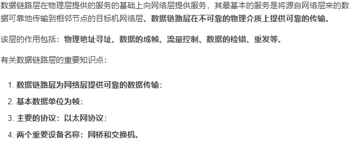

## 第五章、链路层

### 5.1 链路层概述

​    **运行链路层协议的任何设备均称为结点**，沿着通信路径连接相邻结点的通信信道称为**链路**。通过特定链路时，传输结点将数据报封装在链路层**帧**中，将该帧传入链路
​    举例：游客想从苏州到临汾玩，旅行社安排的线路是：第一段线路是从苏州乘火车到上海，第二段线路是在上海坐飞机到太原，第三段线路是太原坐大巴到临汾
​        **游客相当于数据报
​        每个运输段相当于一条链路
​        每种运输方式相当于一种链路层协议
​        旅行社相当于一个路由选择协议**

#### 封装成帧

#### **透明传输** 

#### SLIP

#### 差错检验

CRC

丢失、失序、重复---所以有的在CRC的基础之上增加了帧编号、确认和重传机制

#### 5.1.1链路层提供的服务

​    **能够提供的协议可能包括：（不同协议包括不同，细节不同）**
​        **成帧**
​            网络层数据报经链路传送前，链路层协议要将其用链路层帧封装起来
​            帧的结构由链路层协议规定
​        **链路接入**
​            **媒体访问控制MAC协议**，规定帧在链路上传输的规则，协调多个结点的帧传输
​        **可靠交付**
​            保证无差错经链路层移动每个网络层数据报
​            **确认和重传**，类似TCP
​            通常用于高差错率链路，如无线链路，同轴电缆、光纤、双绞线等链路不需要
​            **目的是在差错发生的链路上纠正差错，而不是通过运输层或应用层进行端到端数据重传**

链路层可靠交付可能会被认为是一种不必要的开销。由于这个原因，许多有线的链路层协议**不提供可靠交付服务**。

**差错检测和纠正（硬件）**

- ​    奇偶校验
- ​    检验和
- ​    循环冗余检测

#### 5.1.2 链路层在何处实现（较硬件）

​    路由器中：在线路卡中实现
​    端主机中：**网络适配器（网络接口卡，网卡）**，位于其核心的是**链路层控制器**，一个实现了许多链路层服务（成帧、链路介入、差错检测）的专用芯片。之前是物理分离的卡，现在网卡直接焊在了主板上
​    大部分链路层是在**硬件**中实现的，但部分链路层是在运行于主机CPU上的软件中实现的，软件实现了高级功能，如组装链路层寻址信息和激活控制器硬件，响应控制器中断
​    **链路层是协议栈中软件和硬件交接的地方**

### 5.2 差错检测和纠正技术

**比特级差错检测与纠正**，即对从一个结点发送到另一个物理上连接的邻近结点的链路层帧中的比特损伤进行检测与纠正，它们通常是链路层提供的两种服务。

为了保护比特免受差错，使用**差错检测和纠正比特（EDC**）。通常，要保护的数据不仅包括从网络层传递下来需要通过链路传输的数据报，而且包括链路帧首部中的链路级的寻址信息、序号和其它字段。

即使采用差错检验比特，也还是可能有未检出比特差错。

**传输数据中检测差错的三种技术**
    奇偶校验（描述差错检测和纠正背后的思想）
    检验和方法（应用于运输层）
    循环冗余检测（应用在适配器中的链路层）
  **奇偶校验**

 **单个奇偶校验位**

​      单个比特的奇偶校验是指在要发送的数据最后附加一个奇偶校验位.奇校验的意思就是整个编码中的1的个数要是奇数.偶校验就是1的个数是偶数.显然如果有偶数个比特发生错误,那么奇偶校验就检测不出来了.
​    **二维奇偶校验**

D中的d个比特被划分为i行j列.对每行没咧计算奇偶值.产生的i + j + 1奇偶比特就构成了链路层帧的差错检测比特.
           当出现单个比特差错时,发生错误的行和列都会出现差错.接收方不仅可以检测差错,还可以根据行列索引来纠正它.
           二维奇偶校验也可以检测(但不能纠正)两个比特错误的任何组合.
           如果在同一行两个比特错误,则那一行的奇偶校验正确,但是会有两列的奇偶校验失败.如果不同行,则会有四列出错.这两种情况都无法纠错,只能检测.但是还是有一些偶数个错误的情况是二维奇偶校验无法检测的.
            接收方检测和纠错的能力被称为**前向纠错（FEC）--海明码？？？.**
校验和方法

在校验和方法中,数据被切成k比特的序列,这些序列全部相加之后取反码就是校验和.接收方收到数据之后,把所有数据加起来(包括校验和).用结果是否全为1来作为判断数据是否出错的标准.

和CRC相比,校验和提供较弱的保护.
**为什么传输层使用校验和而链路层使用CRC呢?**

1. 传输层使用软件实现,采用简单快速的方案是必须的(校验和)
2. 链路层的CRC用硬件实现,能够快速执行CRC操作.
   
   循环冗余检测(CRC)
   
   #### **循环冗余检测(CRC)**

### 5.3 多路访问链路和协议

​    **有两种类型的网络链路**
​        **点对点链路**
​            点对点协议PPP
​            高级数据链路控制协议HDLC

#### HDLC

        

**广播链路**
            让多个发送和接收结点都连接到相同的、单一的、共享的广播信道上
            当任何一个结点传输一个帧时，信道广播该帧，其他结点都收到一个副本
            如以太网和无线局域网
    **多路访问问题**
        如何协调多个发送和接收结点对一个共享广播信道的访问
        所有结点都能传输帧，多个结点可能会同时传输帧，所有结点同时接到多个帧，传输的帧在所有接收方出碰撞了，发生碰撞时，所有帧丢失
        **多路访问协议**：结点通过协议规范它们在共享的广播信道上的传输行为
            **信道划分协议**
 **随机接入协议**
            轮流协议**
        **协议希望有的特性，理想情况下对速率R bps的广播信道**
            仅有一个结点发送数据，结点具有R bps的吞吐量
            M个结点发送数据时，每个结点平均吞吐量R/M bps
            协议分散，不会因为主结点故障似整个系统崩溃
            协议简单不昂贵

#### 5.3.1信道划分协议

**TDM(时分多路复用)**

TDM把时间划分为时间帧,并进一步把时间帧划分为N个时隙(slot).(时间帧和链路层交换的单元帧不是一个意思)
然后把每个时隙分给N个节点中的一个.无论何时某个节点在有分组想要发送的时候,他在循环的TDM帧中指派给它的时隙内传输分组比特.时隙长度一般应是一个时隙内能传输一个分组

   **TDM的缺点**

- 最高速率只能达到R/N bps ,即使只有一个人使用信道
- 节点总是总是要等待它的时隙,可能会对缓存等造成压力
- 消除了碰撞且十分公平

**FDM(频分多路复用)**

FDM将Rbps的信道划分为不同的频段(每个频段具有R/N带宽),并把每个频段分给N个结点中的一个.因此FDM在N个较大的信道中创建了N个较小的R/N信道.

FDM的缺点和TDM相同,限制了每个结点只能使用R/N带宽..

 **码分多址CDMA**
            TDM和FDM分别为结点分配时隙和频率，CDMA对每个结点分配不同的编码
            每个结点用其唯一编码对发送数据进行编码，使得不同结点能同时传输，接收方仍能正确而接收
            抗干扰，军用系统，民用蜂窝电话

#### 5.3.2随机接入协议

​        传输结点总是以信道**全部速率R** bps进行发送

有碰撞时，涉及碰撞的每个节点反复重发它的帧（等待一个随机时延），直到该帧无碰撞的通过

常用随机接入协议：
**1.时隙ALOHA**
    当结点有新帧发送时，等到下一个时隙开始传输整个帧（设一个时隙传一个帧）。时隙开始时传输。
    如果有碰撞，结点在时隙结束之前检测到这次碰撞，以p的概率在后序的每个时隙重传它的帧，直到无碰撞。

时隙ALOHA的确需要在结点中对时隙同步。刚好有一个结点传输的时隙称为一个成功时隙。时隙多路访问协议的效率定义为：当有大量的活跃结点且每个结点总有大量的帧要发送时，长期运行中成功时隙的份额。
效率：当活跃结点数量趋向无穷大时，最大效率1/e，即37%。一个给定的结点成功传送的概率是,因为有N个结点，任意一个结点成功传送的概率是N。

**2.（纯）ALOHA**
    碰撞时，立即以概率p重传该帧，否则等待一个帧传输时间
    效率：仅为时隙ALOHA的一半：.一个给定结点成功传输一次的该概率是

**3.载波侦听多路访问CSMA**
    在时隙和纯ALOHA种，一个结点传输的决定独立于其他结点，不关心自己传输时别人是不是在传输
    举例：有礼貌的人类谈话有两个重要规则
        说话之前先听。如果在说话，等他们说完话再说，网络中称为载波侦听 ，结点等待直到一小段时间没有传输，然后开始传输
        如果与他人同时开始说话，停止说话。称为碰撞检测，当一个传输结点在传输时一直侦听此信道，如果检测到另一个结点正在传输，它就停止，等待一段随机事件，重复『侦听=当空闲时传输』动作
    这两个规则包含在CSMA和具有碰撞检测的CSMA/CD协议族中
    所有结点都载波侦听了，为何当初会发生碰撞？
        B的比特沿着广播媒体传播所实际需要的时间不是0（即使2*10^8），在还没到D时，尽管B正在发，但D侦听的信道空闲，D就开始传输，于是发生了碰撞
        广播信道端到端信道传播时延决定了性能，时延越大，不能侦听到已传输结点的可能就越大，碰撞越多，性能越差

**4.具有碰撞检测的载波侦听多路访问CSMA/CD**

**半双工通信**

​    与广播信道相连的适配器：
​        适配器从网络层一条获得一条数据报，准备链路层帧，并将其放入帧适配器缓存中
​        如果适配器侦听到信道空闲，开始传输帧；如果侦听到信道在忙，等待，直到空闲
​        传输过程中，适配器监视信道
​        如果适配器传输整个帧而未检测到其他信号，该适配器完成了该帧，否则停止传输帧
​        中止传输后，适配器等待一个随机时间量，继续侦听
​    选择随机回退时间间隔太大，信道会空闲，太小会再次碰撞。当碰撞结点数量较少时时间应该间隔较短，否则较长。二进制指数后退算法解决这个问题
​        帧经历一连串n次碰撞，结点随机从{0，1，2，…，2^n-1}选择一个K值
​        一个帧经历碰撞越多，K选择的间隔越大.该算法称为二进制指数倒退。
​        以太网中，一个结点等待的实际时间量是K*512bit的时间.
​    效率
​        信道在大多数时间都会有效地工作。

#### 5.3.3 轮流协议

​    **轮询协议**
​        指定一个主结点，以循环的方式轮询每个结点
​        主结点首先向结点A发送一个报文，告知A能传输帧的最大数量，A传完后主结点告诉B能传帧的最多数量，如此循环
​        缺点：有轮询时延；主结点故障，整个信道就GG
​    **令牌传递协议**
​        没有主结点，一个叫令牌token的特殊帧在结点之间以固定次序交换，如1发给2，2发给3，N发给1，就像网络拓扑结构中的环状网络令牌
​        当一个结点收到令牌时，有帧发送，则发送最大数量的帧，然后转发令牌；没帧发送，直接把令牌转发.

​    缺点：单点故障。

**DOCISIS**：用于电缆因特网接入的链路层协议

### 局域网和广域网

[]: https://blog.csdn.net/vavid317/article/details/126038959?ops_request_misc=%257B%2522request%255Fid%2522%253A%2522168441882816782427499077%2522%252C%2522scm%2522%253A%252220140713.130102334.pc%255Fall.%2522%257D&amp;request_id=168441882816782427499077&amp;biz_id=0&amp;utm_medium=distribute.pc_search_result.none-task-blog-2~all~first_rank_ecpm_v1~rank_v31_ecpm-3-126038959-null-null.142^v87^control_2,239^v2^insert_chatgpt&amp;utm_term=%E5%B1%80%E5%9F%9F%E7%BD%91%E5%92%8C%E5%B9%BF%E5%9F%9F%E7%BD%91%E7%9A%84%E5%8C%BA%E5%88%AB&amp;spm=1018.2226.3001.4187

### 5.4 交换局域网

交换机运行在链路层，它们**使用链路层地**址而不是IP地址来转发链路层帧通过交换机网络

#### 5.4.1 链路层寻址和ARP

**1.MAC地址**
    并不是主机或路由器具有链路层地址，**而是它们的适配器（网络接口）具有链路层地址**。具有多个网络接口的主机或路由器也有多个链路层地址，就像它也有多个IP地址一样。
    链路层交换机并没有链路层地址，交换机透明地执行在主机与路由器之间承载数据报的任务
    **链路层地址也叫LAN地址、物理地址、MAC地址**
    MAC地址长度6字节，2^48个可能的MAC地址，通常用**十六进制**表示法，如5C-66-AB-90-75-B1
    MAC地址一般是固定的（也有软件改变适配器MAC地址的可能）
    **没有两块适配器有相同的MAC地址**，MAC地址空间由IEEE管理，IEEE给公司固定前24个比特，后面24个比特让公司自己去生成
    MAC地址具有扁平接口。比如具有802.11接口的手机总是有相同mac地址，而当主机移动时，IP地址会改变（IP地址是层次结构）
    MAC地址像身份证号，IP地址像邮政地址，有层次，会改变
    当某适配器要向目的适配器发送一个帧时，发送适配器将目的适配器的MAC地址插入该帧，发送到局域网上，适配器可以接受一个并非向它寻址的帧，当适配器接受一个帧时，检查帧中的目的MAC地址与自己的MAC地址是否匹配，若匹配则取出数据报，向上传递，否则丢弃
    适**配器通过MAC广播地址FF-FF-FF-FF-FF-FF来广播**

   2. #### 地址解析协议ARP（即插即用的）
      
        转换网络层地址和链路层地址，如IP地址和MAC地址的转换
        DNS为因特网中任何地方的主机解析主机名，而ARP只为在同一个子网上的主机和路由器接口解析IP地址
        每台主机和路由器在内存中有一个ARP表，包含IP地址到MAC地址的映射关系，过期时间20分钟
        若发送方的ARP表没有目的主机的表项，发送反公用ARP协议来解析这个地址
            首先发送方构造一个ARP分组，字段包括发送和接受IP地址和MAC地址，ARP查询分组和响应分组格式相同
            适配器用MAC广播地址发送该ARP查询分组，每个适配器都把ARP分组向上传递给ARP模块，检查自己的IP地址和分组中的目的IP地址是否一致
            匹配的主机发送回一个ARP响应分组，然后查询主机更新它的ARP表，并发送它的IP数据报
        ARP协议是一个跨越链路层和网络层的协议
   3. **发送数据报到子网以外**
        路由器有几个接口，就有几个IP地址、ARP模块和适配器，假设一个路由器连着两个子网A、B
        子网A中的适配器要发往子网B中的适配器，先通过子网A的ARP把数据报发到子网A跟子网B相连的路由器（目的地址是路由器的MAC），路由器通过子网B的ARP将该数据报转发给目的适配器（目的地址是最终目的地的MAC）。

####    5.4.2 以太网（无连接不可靠）

[]: https://blog.csdn.net/weixin_40274679/article/details/105995323?ops_request_misc=%257B%2522request%255Fid%2522%253A%2522168441921516782427430818%2522%252C%2522scm%2522%253A%252220140713.130102334..%2522%257D&amp;request_id=168441921516782427430818&amp;biz_id=0&amp;utm_medium=distribute.pc_search_result.none-task-blog-2~all~top_positive~default-1-105995323-null-null.142^v87^control_2,239^v2^insert_chatgpt&amp;utm_term=%E4%BB%A5%E5%A4%AA%E7%BD%91&amp;spm=1018.2226.3001.4187

​        以太网占领了现有的**有线局域网**市场，就像因特网之于全球联网的地位
​        集线器是一种物理层设备，作用于比特而不是帧。当0或1的比特到达一个接口时，集线器只是重新生成这个比特，将其能量强度放大，并将该比特向其他所有接口传输出去
​        早期基于集线器**星形拓扑以太网**，现在位于中心的集线器被交换机所取代。交换机是无碰撞的存储转发分组交换机，运行在链路层
​    **以太网帧结构**

**数据字段（46~1500字节**）：承载了IP数据报（如），超过1500字节的数据报需要分片；若小于46字节，需要填充到46字节
**目的地址（6字节**）：目的适配器的MAC地址。当目的适配器收到一个以太网帧，**若目的地址是自己的MAC地址或广播地址**，将数据字段传给网络层，其他则丢弃
源地址
类型字段：允许以太网复用多种网络层协议
**CRC（4字节）**：差错检测
前同步码（8字节）：以太网帧以前同步码开始，前7个字节用于唤醒接收适配器，同步发送方接收方时钟，第8个字节最后两个比特（11）警告目的适配器，重要内容来了
以太网技术向网络层提供不可靠、无连接服务。没有通过CRC校验只是丢弃。

以太网有时候的确重传了数据，但并不知道正在传输新数据还是旧数据。

**以太网技术**
    早期10BASE-2和10BASE-5标准规定两种类型的同轴电缆的10Mbps以太网，每种标准限制在500米，通过转发器得到更长运行距离。

BASE表示基带以太网。前面的数字代表速率。T代表双绞线。F代表光纤。  100BASE-FX
今天的以太网，结点经点对点由双绞铜线或光纤构成的线段与一台交换机相连
10Gbps以太网，5类UTP线缆
线代交换机是全双工的，一台交换机和一个结点能同时向对方发送帧而没有干扰。在基于交换机的以太局域网中，没有必要使用MAC协议了！

#### 5.4.3 链路层交换机

**全双工**

​    交换机的任务：接收入链路层帧，转发到出链路
​    交换机自身对子网中的主机和路由器是透明的，主机/路由器向另一个主机/路由器寻址一个帧，顺利将帧发送进局域网，并不知道交换机干嘛

交换机输出接口设有缓存
交换机是即插即用设备，管理员无需配置
**交换机是双工的，任何交换机接口能同时发送和接收**

**转发和过滤**
    借助于交换机表，包含局域网上某些主机和路由器的表项（MAC地址，通向该地址的交换机接口，表项放置的时间）
    **假定目的地址为DD-DD-DD-DD-DD-DD的帧从交换机接口x到达，交换机用该MAC地址索引交换机表，有三种可能：**
        表中没有该地址，交换机广播该帧
        表中有表项将该地址与接口x联系起来，过滤掉，因为该帧从x来，DD也通过x去，说明该帧跟DD适配器在同一个局域网段，该帧已经在包含目的地的局域网网段广播过了
        表中有表象将该地址与接口y≠x联系起来，该帧需要被转发到与接口y相连的局域网段，放到接口y前的输出缓存，完成转发功能
**自学习：表是自动、动态建立的**
    交换机表初始为空
    对于每个接口接收到的每个入帧，交换机在其表中存储
        该帧源MAC地址
        帧到达的接口
        当前时间
    一段时间后，交换机没有接受到以该地址作为源地址的帧，在表中删除该地址。如果一台PC被另一台PC代替，原来PC的MAC地址将被清除
**链路层交换机的性质**
    消除碰撞
        交换机缓存帧并且不会在网段上同时传输多于一个帧，交换机提供了比广播链路局域网高的多的性能改善
    异质的链路
        交换机将链路彼此隔离，因此局域网中的不同链路能够以不同速率运行，在不同媒介上运行
    网络管理
        主动断开异常适配器
        收集带宽使用的统计数据、碰撞率和流量类型，这些信息用来调试解决问题
**安全性**
    交换机毒化：向交换机发送大量不同伪造源MAC地址的分组，用伪造表项填满了交换机表，没有为合法主机留下空间，导致交换机广播大多数帧，被嗅探器俘获到
**交换机和路由器比较**

路由器是第三层的分组交换机，交换机是第二层的分组交换机
**交换机：**

- ​    交换机即插即用，相对高的分钟过滤和转发速率
- ​    防止广播帧循环，交换网络的活跃拓扑限制为一颗生成树
- ​    大型交换网络要求在主机和路由器中有大的ARP表，生成大量ARP流量和处理量
- ​    **对广播风暴不提供任何保护，使得以太网崩溃**

**路由器：**

- ​    分组不会被限制到生成树上，可以使用源到目的地的最佳路径，拓扑结构更加丰富
- ​    对第二层的广播风暴提供了防火墙保护
- ​    不是即插即用，需要人为配置IP地址
- ​    对分组处理时间较长，因为必须处理第三层字段       

### 点对点PPP协议

 

### 媒体接入控制

### 静态划分信道

### 动态接入控制

载波监听，多点接入，碰撞检测

### 虚拟局域网VLAN

避免广播风暴！！！

### 集线器与交换机（前者是物理层，交换机和网桥是链路层）

### 交换机自学习和转发帧

G给A发的帧到达A和交换机1，交换机1查表发现是A1，但是该帧就是从1来的，不会再转发回去。于是丢弃。

需要注意的是：帧交换表中的每条记录都有自己的存活时间，到期自动删除。为什么呢？

**MAC地址和接口对应关系会改变.**

### 交换机生成树协议STP

