---

---

#      **计算机网络---自顶而下**

## 第一章 计算机网络和因特网

[各层协议的封装](https://blog.csdn.net/weixin_47826078/article/details/127959152?ops_request_misc=%7B%22request%5Fid%22%3A%22168482721516782427444635%22%2C%22scm%22%3A%2220140713.130102334.pc%5Fall.%22%7D&request_id=168482721516782427444635&biz_id=0&utm_medium=distribute.pc_search_result.none-task-blog-2~all~first_rank_ecpm_v1~rank_v31_ecpm-1-127959152-null-null.142^v87^control_2,239^v2^insert_chatgpt&utm_term=各层的报文封装&spm=1018.2226.3001.4187)

[TCP/IP深入理解]: https://blog.csdn.net/crazymakercircle/article/details/114527369

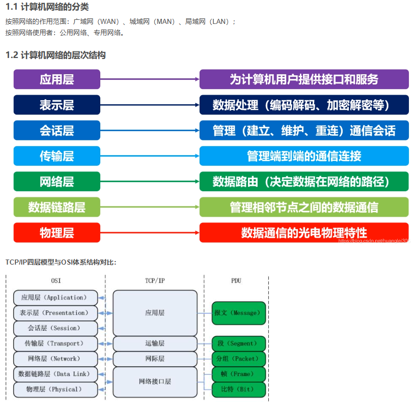

### 1.1什么是因特网

  我们可以从两个角度来回答这个问题：一种是描述组成它的软硬件；另一种是将其视为为分布式应用提供基础服务的联网设施来描述。其实，第一种角度，是从它的组成来描述，第二种角度是从它的功能来描述

#### 1.1.1组成描述

因特网是一个世界范围的计算机网络，这意味着它互联了数以亿计的计算设备（不仅仅是计算机哦）；这些设备包括但不限于传统PC、工作站以及所谓的服务器。现在有更多的设备加入到因特网中，比如便携式计算机、电视机、汽车、传感器等。

用因特网的术语来说，所有连入因特网的设备都叫做**主机或者端系统**

以下是**重点的一些概念**：

- **端系统**通过**通信链路和分组交换机**连接到一起。
-  端系统之间发送数据时，发送端系统将其数据分成一段一段，然后加上必要的信息后形成一个个的数据包，这个数据包用术语来说叫做**分组**。于是**分组==用户数据+必要信息**。链路系统就是用来传输分组的。分组到达接收端系统后，接收端系统将根据必要信息来抽取用户数据；

- 分组交换机从它的一条入链路接收分组，并且选择一条出链路将分组转发出去；**分组交换机**也有很多种类，最为有名的是**路由器**和**链路层交换机**；两者的的不同之处在于，**链路层交换机主要用在接入网中，路由器主要用在网络核心.**

- 端系统**通过因特网服务提供商**（Internet Service Provider，简称**ISP**）接入因特网；

- 很有名的协议有：**TCP（Transport Control Protocol，传输控制协议）和IP(Internet Protocol，网际协议)**；因为协议控制了信息的传递，所以对协议达成一致就很重要，所以需要一个标准来规范协议，以便创造可以协同工作的系统和产品

#### 1.1.2服务描述

​                    应用程序编程接口（API)

#### 1.1.3协议

前面提到了分组这一概念，分组==用户数据+必要数据；这些必要数据为分组接收者理解用户数据提供保障，而**协议就是如何使用必要数据理解用户数据的方法或者规则**；分组接收者接收到分组并按照协议获得了用户数据后，还应该对此消息做出反应，而如何做出反应也是协议规范的一部分（不反应也是一种反应哦）

**协议**:定义了两个或多个通信实体（不一定是端系统，还有可能是分组交换机等）之间交换信息的格式和次序以及对该信息所采取的动作

**凡是通信实体的所有活动都要受到协议的约束**。比如，硬件实现的控制协议控制了两块网卡之间的比特流；在端系统中，拥塞控制协议控制了发送方和接收方之间传输数据的速率等

### 1.2 网络的边缘

- **端系统**：与因特网相连的计算机和其它设备，往往处于网络的**边缘**
- **端系统分类**：**客户和服务器**

#### 1.2.1 接入网

- **接入网**：是指将**端系统连入到边缘路由器的物理链路**
- **边缘路由器**：是指端系统到任何其他远程端系统路径上的**第一台路由器**

- **DSL(Digital Subscribe Line)数字用户线**
  这是一种宽带住宅接入的方法，它的ISP是本地电话公司。其使用的通信链路的物理材质为电话线，是一种双绞线。

  用户使用DSL调制解调器通过电话线与ISP中的数字用户线接入复用器（DSLAM）来交换数据；家庭DSL调制解调器将数字数据转换为高频音后通过电话线传输到ISP中心，并且通过DSL解调器将DSLAM发送过来的模拟信号转为数字信号；

  

- **CIC(Cable Internet Access)电缆因特网接入**
  这是另一种宽带住宅接入方法，它的ISP是有线电视公司。其使用的通信链路的物理材质有光纤和同轴电缆，也被称为混合光纤同轴（Hybrid Fiber Coax HFC）；

  用户使用电缆调制解调器通过同轴电缆与光纤结点相连，光纤结点通过光缆与电缆头端相连，而电缆头端接入了因特网。在电缆头端，电缆调制解调器端接系统（Cable Modem Termination System）起到DSLAM的作用，即实现模拟信号和数字信号的转换；

  

- **FTTH(Fiber TO The Home)光纤到户**
  这里主要是指使用光纤作为通信链路的材质，有两种竞争性的光纤分布方案，一种是主动光纤网络（Active Optical Network），另一种是被动光纤网络(Passive Optical Network).其主要区别在于，是否在传输数据时共享光纤。

  

- **以太网和WIFI**
  以太网接入是一种在公司、大学、家庭里很流行的接入方式；用户使用双绞线与以太网交换机相连，从而接入因特网；接入以太网交换机的速度可达100Mbps;

  在无线局域网中，无线用户从一个接入点发送和接收数据，而该接入点与企业网相连，企业网最终接入因特网；在无线LAN中，用户需要在一个接入点的几十米范围之内；

  

- **广域无线接入**
  在移动设备中，通过蜂窝网提供商运营的基站来发送和接收分组，与WIFI不同的是，用户仅需要位于基站的数万米范围之内即可；

#### 1.2.2 物理媒体

**传输媒体是构成通信链路的主要部分**，物理媒体通常可以分为导引性媒体和非导引性媒体；其中导引性媒体，信号沿着固体前行；而非导引性媒体中，信号沿着固体媒体前行

值得注意的是，架设传输媒体的人历成本要远远高于物理材料的成本

**双绞线**
最便宜的引导性传输媒体，由两条相互螺旋缠绕的铜线组成。目前局域网中的双绞线数据传输速率在10Mbps到10Gbps之间，所能达到的数据传输速率取决于线的粗细以及传输距离；双绞线实际上已经成为高速局域网联网的主要方式；因为现代的双绞线技术速率和传输距离都是很不错的；

**同轴电缆**
也由两个铜导体构成，但是它们是同心的，而非并行的；借助特殊的结构和绝缘层，同轴电缆可得到较高的数据传输速率；在电视系统中应用广泛；同轴电缆可被用作引导性的共享媒体；

**光纤**
一种可以引导光脉冲的媒体

**陆地无线电信道**
无线电信道承载电磁频谱中的信号，不需要物理线路，提供与移动用户的连接以及长距离承载信号的方式；是一种有吸引力的媒体；

**卫星无线电信道**
通过卫星连接两个或多个在地球上的微波发射方（也被称为地面站），该卫星在一个频段上接收信号，在另一个频段上发送信号；种类有同步卫星和近地轨道卫星；

### 1.3 网络核心

网络核心即为**由互联端系统的分组交换机和链路构成的网状网络**

通过**网络链路和交换机移动数据**有两种基本方法：**电路交换和分组交换**

#### 1.3.1 分组交换

------

分组在通信链路上以等于该链路的最大传输速率传输通过通信链路。因此如果某条链路的最大传输速率为R，分组长度为L，则该链路传输该分组的时间为L/R；这个时间也被称为传输时延（值得注意的是，这里说的时间很有可能是传播时延而不是传输时延，这两者的区别在关于延迟时间的计算中将详细解释，虽然这里书上写的是传输，但是根据后文，我认为是传播）；**分组交换的常见方式是存储转发机制；**

------

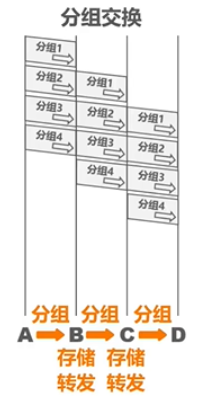

**分组交换可以随时发送分组，不需要事先建立连接。**
将原始报文拆分成一个个分组，依次在各节点交换机上储存转发。各节点在发送分组的同时还需要缓存分组，提升效率。

- **存储转发**
  大多数分组交换机采用存储转发机制来转发分组；所谓存储转发是指**交换机在收到一个完成的分组，才会向链路输出转发分组，否则就将收到的部分分组缓存起来**；因为缓存等待一个分组的全部数据而导致的时间开销被称为**存储转发时延**

  因为需要缓存分组，所以此时分组交换机需要一个**缓冲队列**；缓冲队列的空间有限性就有可能导致分组交换机无法继续缓存分组（因为链路被占用或者分组还没全部到位）而使到达分组交换机的数据包被迫丢弃；**这就导致了分组不但承担了传输时延，还承担了队列时延。**

  

- **排队时延与分组丢失**
  因为需要缓存分组，所以此时分组交换机需要一个输出缓存和输出队列；缓冲队列的空间有限性就有可能导致分组交换机无法继续缓存分组（因为链路被占用或者分组还没全部到位）而使到达分组交换机的数据包被迫丢弃；**这就导致了分组不但承担了传输时延，还承担了队列时延。**

  

- **转发表与路由选择协议**

  实际上，分组交换机之所以能够知道往哪去是因为其内部有一个**转发表**，这个表维护了一个IP地址和链路的对应关系，所以处理流程为：

  **1.通过分组的必要信息，获得目的端系统的IP地址**
  **2.通过IP地址索引转发表，从而确定输出链路**

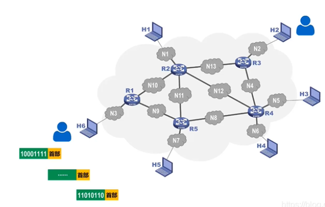

#### 1.3.2 电路交换

------

在电路交换网络中，在端系统通信会话期间，交换机会预留端系统间通信路径上的相关资源（缓存，链路传输速率），即先建立连接，然后通信；而在分组交换网络中，这些资源没有被预留；也就是说，在端系统进行通信时，其所需要的资源是被保持的，其他通信是无法使用这一部分资源的；也就说，端系统间真正建立了一条“连接”；而这一连接，用电话的术语被称为“电路”。传统的电话网络就是电路交换网络的例子。

------

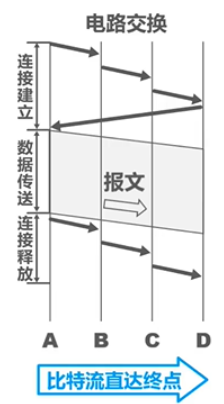

在电路交换过程中要先进行建立连接，连接建立完成后直接进行报文传输，传输完成后释放连接。传输时以**比特流直通形式**传输。

**电路交换网络中的复用**
**时分复用**（Time-Division Multiplexing TDM）：是指将时间划分为固定区间的帧，每个帧则又被划分为固定数量的**时间空隙**；当网络需要建立一条连接时，网络将在每个帧中为该连接指定一个时隙；在该时隙内，链路用来传输该链接的数据；

**频分复用**(Frequency-Division Multiplexing)：将频率域划分为频段，然后将频段分配给连接；此频段被用来专门传输链接的数据。该频段的宽度成为带宽。

电路交换的步骤：

**1、建立连接（分配通信资源）**

**2、通话（一直占用通信资源）**

**3、释放连接（归还通信资源）**

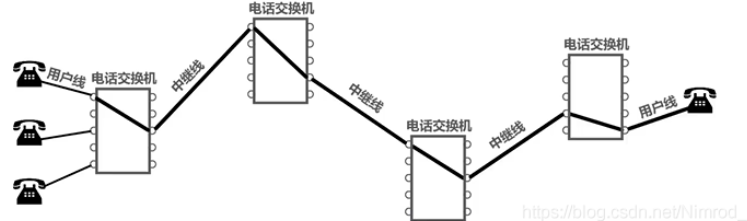

#### 1.3.3 分组交换和电路交换的对比

**分组交换的优点：**

它提供了比电路交换更好的带宽共享；
它比电路交换更简单、更有效、实现成本更低；

**分组交换的缺点：**

分组交换不适合实时服务，因为端到端的时延是可变、不可预测的，这和整个网络的情况相关；

**电路交换的优点：** 

提供了端对端传输数据的速率保证；

**电路交换的缺点：**

电路交换存在静默期，这是指专用电路空闲时，其占用的资源并没有得到充分的利用；
建立连接的过程比较复杂；

总体上来说，分组交换的性能要好于电路交换的性能，但是不同类型的分组交换方式有不同的应用场景；比如一些对最低速率有着严格要求的应用，比如实时服务等，为了获得速率保证，牺牲网络的效率也是可以接受的。趋势向着分组交换发展
网络的网络

#### 1.3.4 网络的网络

不得不说，因特网是一个庞大而复杂的系统，但是我们仍然有办法描述它（我们不是已经这么做过了吗？），但是我们需要一个模型来刻画因特网的结构；该用什么样的结构来刻画因特网呢？我想，最普遍的说法就是：因特网是网络的网络。但是这一说法足够精炼的同时也不够明确。更重要的是，我们可以选择更明确的方法来刻画因特网；书中通过5个模型不断过渡到最终模型，其实过渡的过程就结构不断合理、连接方式不断明确的过程。

我们在什么是因特网 一节中介绍ISP，端系统是通过ISP接入因特网的，为了实现端系统的互联，ISP也必须互联，其实网络模型就是用来表达ISP和端系统以及ISP之间的结构的抽象；

**网络结构1：**存在唯一的全球承载ISP互联所有的接入ISP，这是指，全球ISP是一个又路由器和通信链路构成的网络，该网络跨越全球，并且其他的接入ISP都至少和一个它的路由器相连；

**网络结构2：**存在多个全球承载ISP，它们分别于一部分的接入ISP互联；为了实现端系统的互联，这多个全球ISP也必须互联；网络结构是一个两层结构，其中全球承载ISP位于顶层，接入ISP处于底层；

**网络结构3：**顶层全球承载ISP基本上已经定型，但是接入ISP现在还很混乱，比如，它们直接同顶层ISP相连；而网络结构3中，接入ISP也是分层的：较小区域中的ISP连入较大区域的ISP，而不是直接与顶层ISP相连；为什么会出现这样的结构呢？这是因为，如果都直接同顶层ISP相连，那么两个同一较小区域内，分属不同ISP的端系统之间通信的数据也会到顶层ISP中心去一趟，如果它们不是直接接入顶层ISP，而是接入了一个较大区域的ISP，那么它们之间的通信数据就不用去顶层ISP中心了，因为它们通过较大区域的ISP已经实现了互连，所以通信速度肯定就上去了。

**网络结构4：**是在网络结构3的基础上，增加了以下特点而形成的结构：存在点（Point of Presence，PoP）、多宿、对等、因特网交换点（Internet exchange point，IXP）。

PoP存在于等级结构中所有层次，但是底层ISP除外；一个PoP是ISP网络中的一台或者多台路由器群组，其中客户ISP能够通过第三方提供的高速链路直接将它的路由器和供应商的PoP连接，从而实现与提供商ISP连接。这样接入速度很明显就提高了。
多宿（multi-home）是指，任何ISP（除第一层ISP）都可以与两个或者多个提供商ISP连接，这被称为多宿；这样网络的可靠性就提高了
对等（peer） 是指，位于相同等级结构层次的一对邻近ISP能够直接将它们的网络连接到一起，使它们之间流量经直接连接而不是经过上游的中间ISP传输，这样既不用付费，速度也可能会快一些；
因特网交换点是为了实现多个ISP可以对等而创建的。

**网络结构5：**网络结构5是在网络结构4的基础上增加了内容提供商网络而构成。内容提供商构建自己的网络，并且通过与较低层ISP对等而“绕过”较高层因特网ISP，而且内容提供商对端用户也有了更多的控制。

总体来说，今天的因特网是一个“网络的网络”，其结构复杂，由十多个顶层ISP和数十万个较低层ISP构成。近年来，主要的内容提供商创建自己的网络，直接在可能的地方与较低层ISP互联

### 1.4 分组交换中的时延、丢包、吞吐量

因特网能够看成是一种运行在端系统上的分布式应用提供服务的基础设施

计算机网络必定要要**限制**在**端系统之间的吞吐量**，故在端系统之间存在**时延、丢包**；

#### 1.4.1 分组交换网中的时延概述

一个分组在沿途每个节点承受不同类型的时延，这些时延中最为重要的是：**结点处理时延、排队时延、传输时延和传播时延.这些时延总体累加起来是结点总时延**

**时延的类型**

- **处理时延**
  处理时延是因为节点需要解析分组的必要信息然后决定其出链路（索引转发表等操作）而产生的，通常在微秒或者更低数量级；
- **排队时延**
  排队时延是因为分组所对应的出链路前面有其他分组正在传输，所以分组需要该链路的缓冲队列里等待其他分组传输完毕而产生的；一般来说，排队时延是到达该队列的流量强度和性质的函数，通常可以达到毫秒级到微秒级；
- **传输时延**
  传输时延是将所有分组的比特推向链路所有需要的时间，实际的传输时延通常在毫秒到微秒数量级。用L表示分组的长度，用Rbps表示从路由器A到B的链路传输速率。传输时延是L/R。
- **传播时延**
  传播时延是指比特进入链路后，从该链路的起点到下一个结点所用的时间；一旦分组中的最后一个比特到达路由器就意味着该分组的所有比特都已到达路由器；广域网中，传播时延一般是毫秒级的。传播时延是d/s。d是路由器A到B的距离。s是链路的传播速率。

**传输时延和传播时延的对比**

如果打个比方的话，传输时延就是大卡车经过收费站的时间而传播时间就是车在高速公路上行驶的时间。传输时延是分组长度和链路传输速率的函数。传播时延是两台路由器间距离的函数

#### 1.4.2 排队时延和丢包

**丢包**：到达的分组发现一个满的队列。由于**没有地方存储**这个分组，路由器将**丢弃**该分组，该分组将会丢失

排队时延和丢包与网络的状况和结点的缓冲空间大小、处理速度相关；如果分组到达的速度高于结点的处理速度，那么分组就会在缓冲队列里排队等待。当缓冲空间用完后，如果还有到的分组，那么该分组将被迫丢弃

为了描述网络状体，我们引入了**流量强度**这一概念：流量强度=分组到达的速度/结点的处理速度；流量工程里一个金科玉律就是：设计系统时流量强度不能大于1；

**当流量强度持续大于1时，就将出现丢包现象**

#### 1.4.3 端到端时延

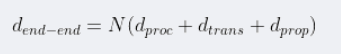

#### 1.4.4 计算机网络的吞吐量

计算机网络的吞吐量实际上是一个**速度指标**，它描述了比特经过某个节点的速度。对于某条路径上的结点来说，和该结点有关的速度有两个：**接收数据的速度和发送数据的速度，而该结点的吞吐量是这两个速度中较小的一个**；对于某条路径来说，该路径的吞吐量则是所有节点的吞吐量的最小值；网络的吞吐量可以衡量网络的性能.

任何时间的**瞬时吞吐量**是主机B接受到该文件的速率

如果该文件由F比特组成，主机B接受到所有比特用去Ts，则文件的平均吞吐量为F/T bps

**吞吐量可以近似为源和目的地之间路径的最小传输速率**。最小传输速率的链路为**瓶颈链路**。

**在今天，因特网对吞吐率的限制因素通常是接入网。**

### 1.5 协议层次及其服务模型

因特网是一个极为复杂的系统，该系统里存在着大量的应用程序和协议、各种类型的端系统、分组交换机和各种类型的链路级媒体。但是它同时也是有着清晰结构的，就像我们前面在网络核心 一节介绍的，我们仍能构建它的结构模型

#### 1.5.1 分层体系结构

计算机网络采用分层的体系结构，**分层**的体系结构因为提供模块化而具有很高的价值，同时也易于服务实现的多样性：某一层对其上一层提供服务，同时它可以利用下一层提供的服务。只要对上提供的服务和对下利用的服务没有变化，其层内部的实现并不会对系统结构产生影响；对于大而复杂且需要不断更新的系统来说，改变服务的实现而不影响系统其他组件是分层模式的另一个重要优点

为了给网络协议的设计提供一个结构，网络设计者以**分层的方式**组织协议以及实现这些协议的软硬件

一个协议层可以使用软硬件实现，同时某个协议层的不同部分常常位于网络组件的各部分。协议分层具有概念化和结构化的优点。模块化使得更新系统组件更为容易。但是分层也有其缺点，就是功能上的**冗余**，比如**许多协议栈针对链路和端到端两种情况都提供了差错恢复功能**。第二种潜在的缺点就是**某层的功能可能需要仅在其它层才出现的信息**

总体来说，将各层的所有协议组合起来，称为**协议栈**。因特网的协议栈有5个层次组成：**物理层、链路层、网络成、传输层、应用层**

- **应用层（网络应用）**

  应用层协议分布在多个端系统，端系统中的应用程序使用该协议与另一个端系统中的应用程序通信。**处于应用层的分组称为报文；**
  **功能**：应用层是网络应用程序及其应用层协议存留的地方。
    提供为应用软件而设的接口，以设置与另一应用软件之间的通信。例如: HTTP（web文档的请求），HTTPS，FTP（文件的传送），TELNET，SSH，SMTP，POP3等。
  一个端的应用程序使用协议与另一个端系统的应用程序交换信息分组

  

- **传输层（端-端）**：传输层在应用程序端点之间传输**应用层报文**，因特网中有两个传输层协议：**TCP和UDP**。处于传输层的分组称为报文段。TCP提供确保传递、流量控制、拥塞控制机制。UDP提供无连接服务，即不提供不必要服务的服务。没有可靠性、没有流量和拥塞控制。

  

- **网络层（源主机-目的主机）**：网络层将称为数据报的网络层分组从一台主机移动到另一台主机。因特网的网络层包括IP协议，该协议定义了在**数据报**中的各个字段以及端系统和路由器如何运作这些字段。所有网络层的组件必须运行IP协议。
  因特网的网络层也包括路由协议（顾名思义，该协议可以决定路由的选择），他根据该路由将数据报从源传输到目的地。因特网有很多路由选择协议。

  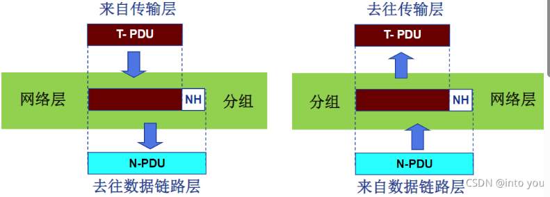

- **链路层（点-点）**：链路层将称为帧的链路层分组从一个结点移动到路径上的另一个端点。一个帧可能被沿途不同链路上的不同链路层协议处理。
- 数据链路层负责网络寻址、错误侦测和改错。当表头和表尾被加至数据包时，会形成帧。**数据链表头**（DLH）是包含了物理地址和错误侦测及改错的方法。**数据链表尾**（DLT）是一串指示数据包末端的字符串。例如以太网、无线局域网（Wi-Fi）和通用分组无线服务（GPRS）等。
  **由链路层提供的服务取决于应用于该链路的特定链路层协议**，与TCP协议不同的是，TCP提供一个端到另一个端的交付，在此过程中可能会经过多条链路，每条链路都有不同的链路层协议。
  通俗来讲**TCP提供的协议是一个起始地点到目的地的寻址**，然而这条路上会遇到不同的站点（路由），**每个站点间的传输需要链路层协议来完成。**
  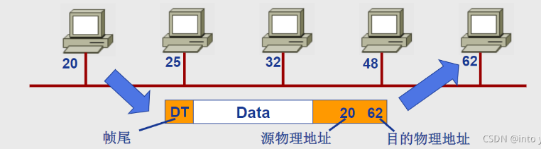

- **物理层（点-点）**：物理层的任务是将帧中的比特从一个结点移动到下一个节点，它提供了传输信息的实际物理通道；

**完整流程图如下：**

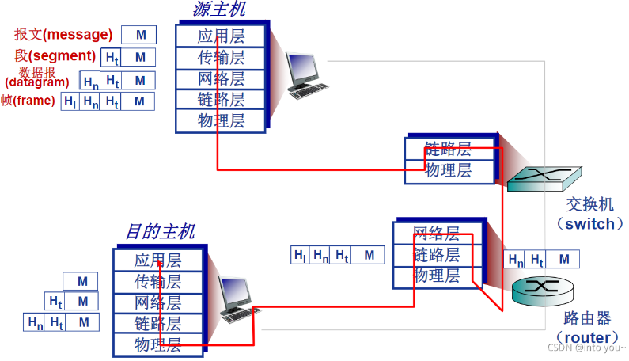

如图所示，链路层交换机完成了第一层和第二层(物理层、链路层)，路由器实现了第一层到第三层（物理层、链路层、网络层）。
上图也具化了该体系的封装概念。在发送主机端，一个应用层报文M被传输给传输层（运输层），运输层收到报文并附上附加信息Ht（首部信息），该首部将被接收端的传输层使用。应用层报文和传输层首部信息构成了传输层报文（Ht + M）。在网络层增加了如源和目的端系统地址等网络首部信息Hn生成了网络数据层报。在链路层生成链路层帧，由上至下一步一步封装，构成首部字段+有效载荷字段的结构。

**OS I模型**
在因特网协议栈出现以前，OSI模型是ISO组织研发的计算机网络结构模型。OSI的模型一共有7层，从下到上依次为：物理层，链路层，网络层，传输层，会话层，表示层，应用层。相比因特网体系结构，OSI多了两层。

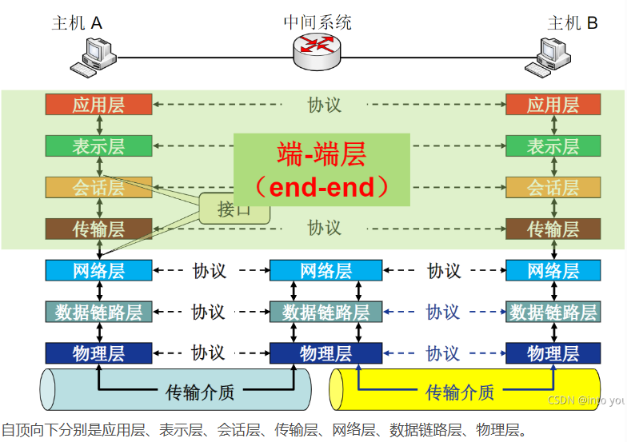

因特网将两层的功能留给了开发者自行实现。

**TCP/IP协议栈**

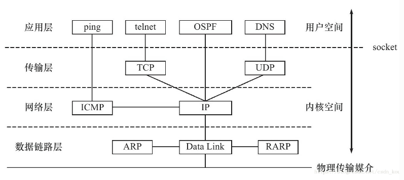

**数据链路层：**处理数据在物理媒介上的传输。

**网络层：**实现数据包的选路和转发。

**传输层：**为两个主机上的应用程序提供端到端的通信。两个协议：TCP协议、[UDP](https://so.csdn.net/so/search?q=UDP&spm=1001.2101.3001.7020)协议。

**应用层：**负责处理应用程序的逻辑。

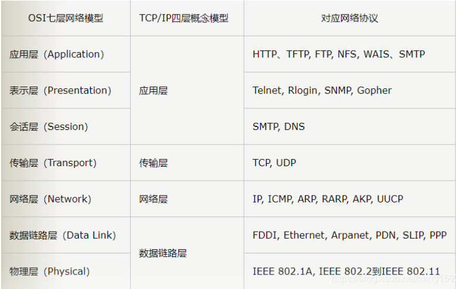

**IP地址、mac地址和端口号**
在利用TCP/IP协议族进行通信的时候，有三个比较关键的确认身份的信息：mac地址、IP地址和端口号。

1. IP地址：（基于计算机或路由器）在网络层的IP头部里，用于识别网络中互联的主机和路由器，其实主要是确认子网，通过子网掩码确认某个IP地址所在的子网，而后再在子网内部确认mac地址就能找到准确的用户了。（32位，全球唯一）

2. MAC地址（物理地址）：（基于网卡或路由器）在数据链路层包裹在以太网头部中的，它主要用来识别同一个链路中的不同计算机。Mac地址即网卡号，每块网卡出厂的时候，都有一个全世界独一无二的 MAC 地址，长度是 48 个二进制位，通常用 12 个十六进制数表示。（全球唯一，局部使用）

3. 端口号：在传输层包含在TCP/UDP头部中的，用于识别应用程序。一台主机上能运行多个程序，那么接收到的消息到底是哪个程序的呢？就需要端口号来确认。（主机中唯一）

   **端口号有两种：**

   　　固定的端口号，是形如http,telnet,ftp等广为使用的应用协议所使用的端口号是固定的

   　　动态分配的端口号，这个时候服务端要确定监听端口号，接受服务的客户端没必要确定端口号

#### 1.5.2封装

------

一个分组，在不同的层次有不同的称谓，是因为它们经过每一层的时候就被该层封装上了属于该层的相关信息，也就是前面提到的必要信息；于是，每一分层的分组有两种类型的字段：首部字段和有效负载；其中有效负载即为来自上一层的分组数据，而首部字段就是该层加上的必要信息；分组不断被封装以实现各层协议规定的相关功能

------

## 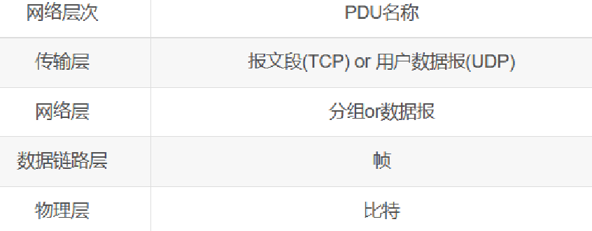

## 1.4 计算机网络的性能指标

速率：bps=bit/s
时延：发送时延、传播时延、排队时延、处理时延
往返时间**RTT：数据报文在端到端通信中的来回一次的时间**。
