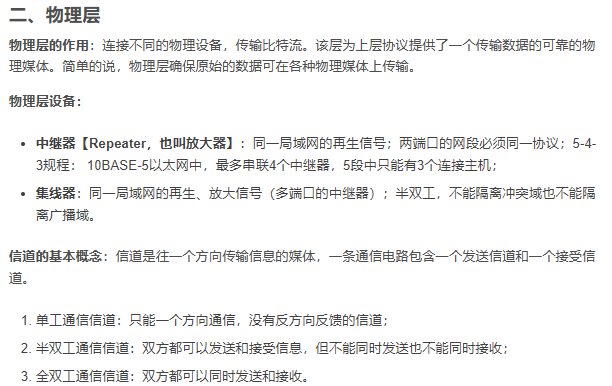
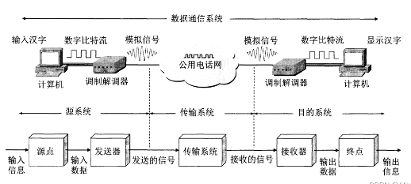
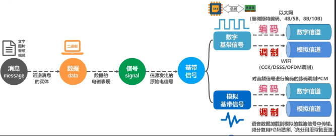
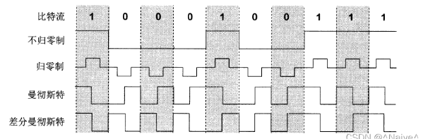
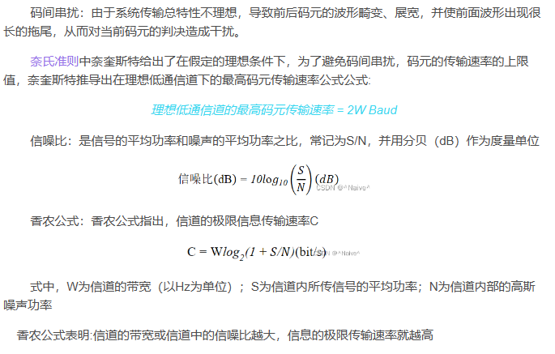
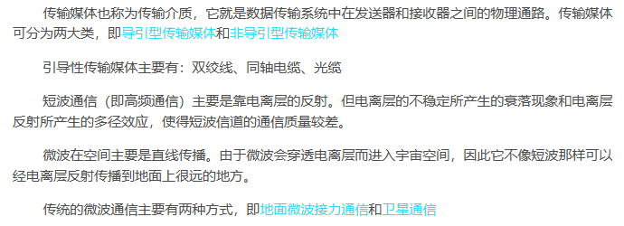

## 物理层

### 一、物理层的基本概念

​        物理层考虑的是怎样才能在连接各种计算机的传输媒体上传输数据比特流，而不是具体的传输媒体。

物理层的作用是要尽可能地屏蔽掉传输媒体和通信手段的差异，使物理层上面的数据链路感觉不到这些差异，这样就可**使数据链路层**只需要考虑如何完成本层的协议和服务，而不必考虑网络具体的传输媒体和通信手段是什么。用于物理层的协议也常称为物理层规程。

可以将物理层的主要任务描述为确定与传输媒体的接口有关的一些特性，即：

- 机械特性：指明接口所用接线器的形状和尺寸、引脚数目和排列、固定和锁定装置等。

- 电气特性：指明在接口电缆的各条线上出现的**电压**的范围。

- 功能特性：指明某条线上出现的某一电平的电压的意义。

- 过程特性：指明对于不同功能的各种可能事件的出现顺序。

### 二、数据通信基础知识

​        一个数据通信系统可划分为三大部分，即源系统、传输系统和目的系统。

####  **有关信道的几个概念：**

1. 单工通信：只能有一个方向的通信而没有反方向的交互

2.半双工通信：即通信的双方都可以发送信息，但不能双方同时发送

3.双工通信：即通信的双方可以同时发送和接收信息

基带信号：来自信源的信号，基带信号往往含有较多的**低频成分**，甚至有**直流成分**，所以要是信号在信道中传输，需要对基带信号进行**调制**、

**编码**：`用数字信号`承载数字或模拟数据
**调制**：`用模拟信号`承载数字或模拟数据

**调制可以分两大类：**    

- <1>基带调制：对基带信号的波形进行变换，使它能够与信道特性相适应，变换后的信号仍是基带信号
- <2>载波调制：把基带信号的频率范围搬移到较高的频段，并转换为模拟信号

基本调制方法有：调幅（AM），调频（FM），调相（PM）。

#### **常见的编码方式：**

- 不归零制：正电平代表1，负电平代表0。

- 归零制：正脉冲代表1，负脉冲代表0。
- 曼彻斯特编码：位周期中心的向上跳变代表0，位周期中心的向下跳变代表1。但也可反过来定义。
- 差分曼彻斯特编码：在每一位的中心处始终都有跳变。位开始边界有跳变代表0，而位开始边界没有跳变代表1

#### **信道的极限容量：**  

### 三、物理层下面的传输媒体

