## 第四章 网络层

### 4.1 概述

#### 4.1.1 转发和路由选择

​    **网络层的作用：将分组从一台发送主机移动到一台接收主机。需要两种功能**：
​        **转发**：当一个分组到达路由器的一条输入链路时，路由器必须将该分组移动到适当的输出链路
​        **路由选择**：分组从发送方流向接收方时，网络层必须决定这些分组采用的路由或路径，路由选择算法
​        转发是路由器本地动作，路由选择是网络范围过程。比如开车从北京到上海，转发相当于在某个路口选择某一条岔路，路由选择相当于规划从北京到上海所有线路的过程
​    每台路由都有一张**转发表**。路由器检查分组首部字段值（可能是目的地址或所属连接，看网络层协议）来转发分组，使用该值在转发表索引查询。该值指出了该分组将被转发的路由器输出链路接口
​    **路由选择算法**决定了插入路由器转发表中的值。路由器接收路由选择协议报文，来配置转发表。**有两种算法：**

- ​        集中式
- ​        分布式

​    **分组交换机：**指一台通用分组交换设备，根据分组首部字段值从输入链路接口转移分组到**输出链路接口**。
​        **链路层交换机：**基于链路层字段中的值做转发决定
​        **路由器：**基于**网络层**字段值做转发决定
​    **连接建立：某些网络结构（ATM、帧中继、MPLS）除了转发和路由选择功能**，还有连接建立功能。要求从源到目的地沿着所选择路径彼此握手，建立连接。

#### 4.1.2 网络服务模型

​    定义了分组在发送与接收端系统之间的**端到端运输特性**
​    网络层可以提供的服务（注意**IP并没有这些服务！**）：

-  确保交付
-   具有时延上界的确保交付
-    有序分组交付
-    确保最小带宽：模仿发送方和接收方之间一条特定比特率传输链路的行为。发送速率低于该速率，分组不会丢失，且会在预定时延内到达
- ​    确保最大时延抖动：确保发送方两个相继分组之间的时间 = 目的地接收到它们之间的时间
- ​     安全性服务：使用仅由源和目的地主机知晓的密钥，加密数据报，源加密，目的主机解密。此外还有数据完整性和源鉴别服务

因特网的网络层IP协议提供单一服务，尽力而为服务，无带宽保证，无丢包保证，无顺序保证，不定时，无拥塞指示。

   **其他提供服务的服务模型：**

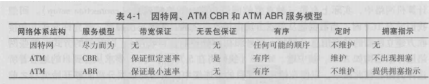

- 恒定比特率（CBR) ATM网络服务
      就是使网络连接看起来就像在发送和接收主机之间存在一条专用的、固定带宽的传输链路，以使用性质相同的虚拟管道来提供分组（ATM术语称为信元）流。
- 可用比特率（ABR）ATM网络服务
  比尽力而为的服务稍好一点的服务。然而与IP不同的是，信元不能重排序。最小传输速率是可以保证的。

### 4.2虚电路和数据报网络

**仅在网络层提供连接服务的计算机网络成为虚电路**；**仅在网络层提供无连接服务的计算机网络称为数据报网络。**

运输层面向连接服务是在位于网络边缘的端系统中实现的；我们很快看到，网络层连接服务除了在端系统中，也在位于网络核心的路由器中实现

#### 4.2.1 虚电路网络

​    包括**ATM、帧中继**的体系结构是虚电路网络，在网络层使用连接。IP是数据报网络

虚电路组成：

- 源和目的主机之间的路径，一系列链路和路由器
- VC号，该路径每段链路一个号码，属于一条虚电路的分组首部有VC号
- 该路径每台路由器转发表表项。当跨越一台路由器创建一条虚电路时，转发表增加一个新表项，终止将会删除

一条虚电路每条链路上可能有不同VC号，每台路由器必须用一个新的VC号更新每个分组的VC号（which can get from the forwarding tables）也就是一个分组经过一台路由器，首部VC号可能就变了，原因：

- 逐链路代替该号码减少了分组首部VC字段长度
- 大大简化虚电路建立。如果要求一个VC号，创建虚电路时路由器需要交换处理大量报文来约定VC号

虚电路网络中的路由器必须为进行中的连接维护**连接状态信息**。创建一个连接，转发表加一项，释放一个连接，转发表删一项。该信息将VC号与输出接口号联系起来。即使没有VC号转换，仍有必要维持状态信息，该信息将VC号和输出接口号联系起来。
**虚电路3个阶段：**

- 虚电路建立
      发送运输层与网络层联系，指定接收方地址，等待网络建立虚电路
      网络层决定发送方和接收方之间的路径，即虚电路要通过一系列链路     和路由器，为每条链路设置vc号
      网络层在路径上每台路由器的转发表增加一个表项
     预留该虚电路路径上的资源
- 数据传送
      发起呼叫—>入呼叫—>接收呼叫—>呼叫连接—>数据流开始—>接收数据

- 虚电路拆除
      网络层通知网络另一侧端系统结束呼叫，更新删除路由器上转发表项以表明虚电路不存在（说明路由器转发表项是虚电路的物理体现）

**信令报文**

端系统向网络发送指示 虚电路启动与终止的报文
路由器之间传递的用于建立虚电路（修改路由器表中的连接状态）的报文。

用来交换这些报文的协议称为**信令协议**

#### 4.2.2 数据报网络

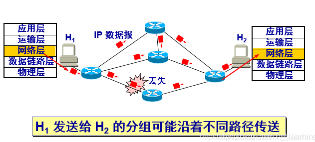

 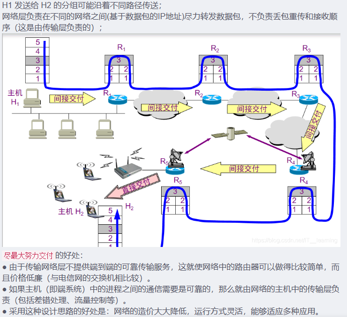

   每当端系统要发送分组，为分组加上目的地地址，推进网络。
    分组从源到目的地传输，通过一系列路由器传递，每台都使用分组的目的地址转发该分组
     **每个路由器有转发表，将目的地址映射到输出链路接口，路由器将分组向该接口转发**
    目的地址（其实就是IP地址）32bit，转发表不可能对每个目的地址有一个表项，因此，路由器用分组的目的地址的前缀与表项进行匹配。当有多个匹配时，使用**最长前缀匹配规则**。
    数据包网络中路由器不维持连接状态信息，但是**维护了转发状态信息**。实际上每1-5分钟，路由选择算法更新一次转发表。

   因为在数据包网络中的转发表能在任何时刻修改，从一个端系统到另一个端系统发送一系列分组可能在通过网络时走不同的路径，并可能无序到达

#### 4.2.3 虚电路和数据报网络的由来

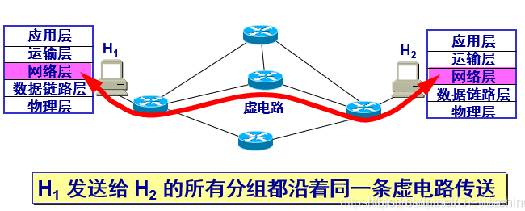

​    虚电路来源于电话界（真电路）
​    端系统设备复杂，网络层服务模型应尽可能简单，复杂功能在更高级实现（按序、可靠数据传输、拥塞控制等）
​        因为简单，所以互联各种链路（卫星、以太网、光纤、无线）和丢包特性的网络变得容易
​        增加一个新服务器只需连接一台主机到网络，定义一个新的应用层协议即可，使得Web之类的新服务很快在因特网部署

#### 数据包的路由过程

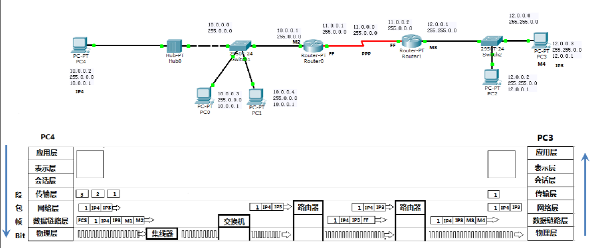

**（1）发送端(封装数据)**

① 应用层准备要传输的数据；
② 传输层把文件进行分段并编号；(数据段)
③ 网络层把传输层的每一个数据包增加原IP地址和目标IP地址；(数据包)
④ 数据链路层把每个数据加上MAC地址；(数据帧)
● 使用自己的子网掩码，判断自己和目标地址分别在哪个网段，若在同一个网段(不通过路由器)，通过ARP协议广播的方式得到目标IP地址的MAC地址，然后就能封装出一个数据帧进行组播协议发送；
● 如果子网掩码不是一个网段，通过ARP协议广播的方式得到路由器(网关)的MAC地址，然后把数据通过交换机发送到路由器M2(图中路由器)，因为M2和M3是点对点通信，没有别的主机，所以它们之间的MAC地址就是FF
⑤物理层把数据帧变成数字信号(bit流)，交给物理层传输

**（2）接收端(解封)：**

① 交换机Switch1(图中的交换机)接收bit流，能对数据进行存储转发。它根据数据帧的MAC地址，确定数据是从哪来的（是上一跳不是发送端），要去哪
② 路由器M2获取交换机的数据包，识别其中的IP地址，根据路由表选择出口，它无法识别数据段内容
③ 路由器M2到M3是点对点通信，遵守PPP协议
④ PC3收到bit流后，数据链路层发现MAC地址是自己的，去掉MAC地址给它的网络层，网络层去掉IP地址给传输层，传输层把数据给应用层，应用层把各个数据拼接起来

### 4.3 路由器工作原理

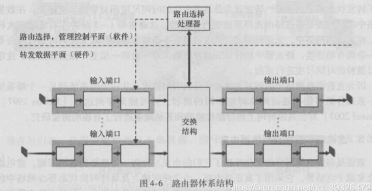

 **路由器的组成部分**

- **输入端口：**
      执行将一条输入的物理链路与路由器相连接的**物理层功能**
      执行与位于入链路远端的数据链路层交互的**数据链路层功能**
      查找功能，查询转发表决定路由器的输出端口，将分组转发到输出端口
- **交换结构**
      将路由器的输入端口与输出端口相连
      分组通过交换结构转发到输出端口
- **输出端口**
      存储从交换结构接收的分组，执行必要的链路层和物理层功能在输入链路上传输这些分组。
      当链路是双向的时，输出端口与输入端口在同一线路卡成对出现
- **路由选择处理器**
      执行路由选择协议
      维护路由选择表、连接的链路状态信息，为路由器计算转发表
  **路由转发平面**
      一台路由器的输入端口、输出端口和交换结构共同实现了转发功能，并且用硬件实现（软件太慢，需以纳秒时间尺度运行）
  **路由控制平面**
      路由器的控制功能（执行路由选择协议、对上线或者下线链路进行响应、管理功能），在毫秒时间尺度上运行，用软件实现并在选择处理器上执行（一种cpu）

#### 4.3.1 输入端口：

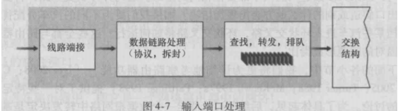

**查找：**
        查找必须在纳秒级别执行，不仅要用硬件执行查找，而且要对大型转发表使用快速查找算法，而且需要更快的内存访问速度（DRAM、SRAM）。

**影子副本：**
  转发表由路由选择处理器计算和更新，从路由选择处理器经过独立总线复制到（输入）线路卡（影子副本）
        有了转发表副本，转发决策能在每个输入端口本地做出，无须调动路由选择处理器，避免集中式处理

**排队：**
        查找确定了某分组输出端口，分组就能发送进入交换结构。一个被阻塞的分组必须在输入端口处排队。

**尽管查找在输入端口可以说是最为重要的，但必须采取许多其它动作：**

必须出现物理层和数据链路层处理

必须检验分组的版本号、检验和和寿命字段。后两个字段必须重写

必须更新用于网络管理的计数器

**匹配加动作**

#### 4.3.2 交换结构

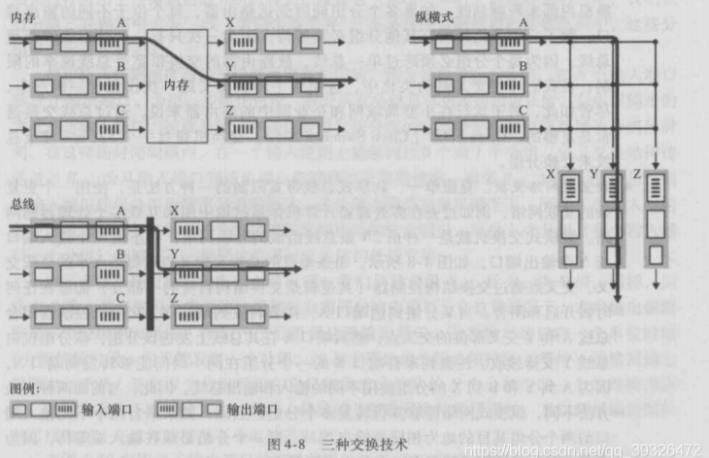

 通过交换结构，分组才能实际地从一个输入端口交换（转发）到一个输出端口中
    三种交换方式：

  经内存交换
        一个分组到达输入端口时，该端口会先通过中断方式向路由选择处理器发出信号
        分组从输入端口复制到处理代路由器查找交换进内存，是器内存中（现由输入线路卡处理的）
        早期路由选择处理器从首部提取目的地址，在转发表查找输出端口，将分组复制到输出端口

经总线交换
    输入端口经一根共享总线将分组直接传送到输出端口，无需路由选择处理器的干预
    路由器的交换带宽受总线速率限制

经互联网络交换
    纵横式交换机，2N条总线组成网络，连接N各输入端口和N个输出端口
    每条垂直的总线与每条水平的总线交叉，交叉点通过交换结构控制器开启闭合
    某分组到达端口A，需要转发到Y，交换机控制器闭合总线A和Y的交叉点，A在其总线上发送分组，仅由Y接收；同时B也能发分组到X，因为没有公用总线。纵横式网络能并行转发多个分组。但是如果两个不同输入端口的两个分组的目标是同一个输出端口。则一个分组必须在输入端等待。

#### 4.3.3 输出端口

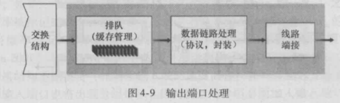

#### **4.3.4 何处出现排队**

​    输入、输出端口都能形成分组队列，取决于流量负载、交换结构
​    随着队列增长，路由器缓存空间会耗尽，出现丢包
​    **需要路由器缓存吸收流量负载波动，需要多少缓存？**
​        少量TCP流：RTT * C（链路容量）
​        大量TCP流：RTT* C/ (N^1/2)
​    输出端口排队，需要分组调度程序选出一个分组发送。提供服务质量保证。

   输出端口的一个**分组调度程序**必须在这些排队的分组中选取一个发送。分组调度程序在提供**服务质量保证上**有很大的作用
    **主动队列管理（RQM）：**
        缓存填满前丢弃（或首部加个标记）一个分组，向发送方提供一个拥塞信号
        **随机早期检测算法（RED）：**平均队列长度在某个范围内时，以某种概率被丢弃/标记。
    **线路前部阻塞（HOL）**

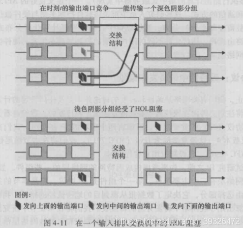

深色阴影分组必须等待。但不仅该分组要等待，左下角队列中排在该分组之后的浅色阴影分组也要等待，即使右侧输出端口中无竞争。这种现象叫做线路前部阻塞（HOL）

#### 4.3.5 路由选择控制平面

​    网络范围的路由选择控制平面是分布式的，即不同部分（如路由选择算法）执行在不同的路由器上，并且通过彼此发送控制报文进行交互

### 4.4 网际协议（IP）：因特网中的转发和编址

​    网络层三个组件

- IP协议
- 路由选择协议
- 控制报文协议（ICMP）：报告数据报中的差错、对某些网络层信息请求进行响应的设施

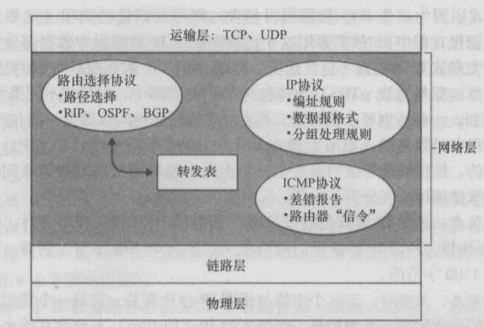

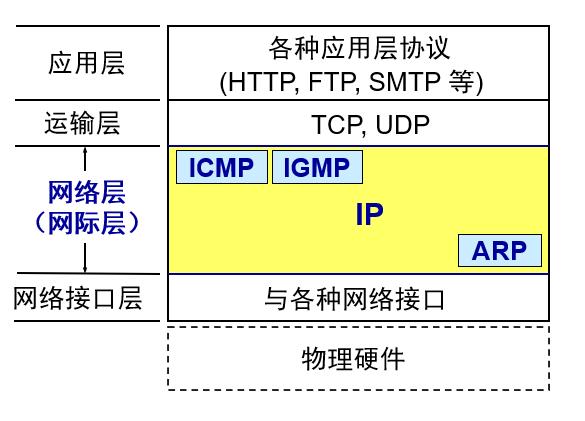

#### 4.4.1 数据报格式

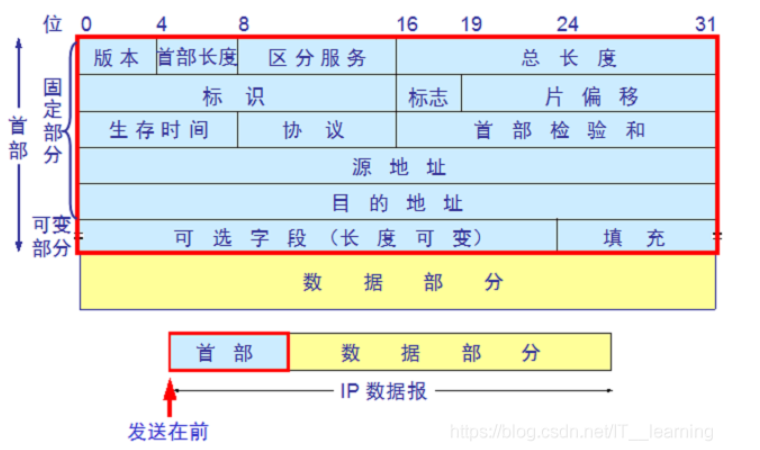

-  版本：指定IP数据报中使用的IP协议版本，占4位。IPv4对应值为4（0100）
- 首部长度：指示IP数据报头部的总长度，占4位。IP数据报头部的总长度以4字节为单位（即4字节的整数倍）
- 区分服务：用于表示数据报的优先级和服务类型，占8位。包括一个3位长度的优先级，4位长度的标志位，最高位未用
- 总长度：标识整个IP数据报的总长度，包括报头和数据部分，占16位，由此可知IPv4的最大长度为65535（64KB）
- 标识：用于表示IP数据报的标识符，占16位，每个IP数据报有一个唯一的标识（不是序号）。当数据报分段时，这个标识的值就被复制到所有分段的标识字段中，相同的标识字段值使分段后的数据报分段最后能正确地重组成为原来的数据报。
- 标志：指出该IP数据报后面是否还有分段，为分段标志，占3位，仅最低位有意义
- 片偏移：指出该分段在数据报中的相对位置。相对于用户数据字段的起点，该字段从何处开始，占13位
- 生存时间：标识IP数据报在网络中传输的有效期，以秒来计数，占8位。现在通常认为这个数值是指数据报允许经过的路由器数，当值为0时，就丢弃这个数据报。设定生存时间是为了防止数据报在网络中无限制地循环转发。
- **协议：用来标识此IP数据报所采用的协议类型（如TCP、UDP或ICMP等），以便使目的主机的IP层知道应将数据部分上交给哪个处理过程，占8位**
- **首部校验和**：用来检验IP数据报的包头部分（不含“数据”部分）在传输到接收端后是否发生了变化，占16位。因为数据报每经过一个路由器，路由器都要重新计算一下报头校验和
- 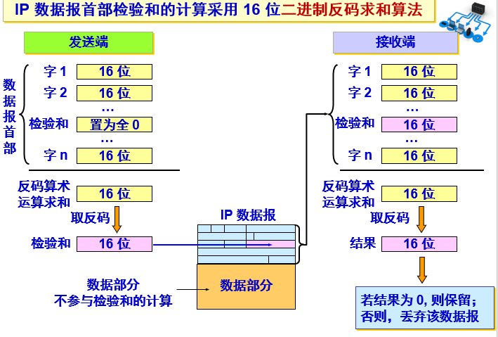
- 源地址/目的地址：分别表示该IP数据报发送者和接收者的IP地址，各站32位
- 可变部分：用来支持各种选项，提供扩展余地，可用来支持排错、测量以及安全等措施。后面的填充字段就是为了保证IP数据报的报头是32位的整数倍。

一个IP数据报有**长为20的首部**，如果数据报承载一个TCP报文段，则每个无分片数据报承载总长**40的首部（还有TCP的20）**以及应用层报文

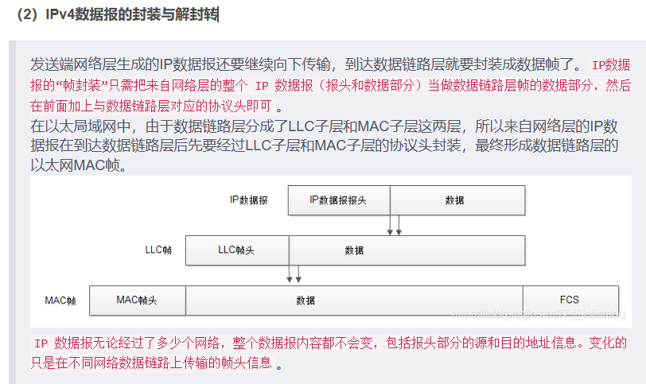

 1. **IP数据报分片  more**

网络链路存在**MTU (最大传输单元**)—链路层数据帧可封装数据的上限不同链路的MTU不同

IPv4的设计者决定把数据报的重新组装工作放在端系统而不是路由器中。

大IP分组向较小MTU链路转发时， 可以被“分片” (fragmented)

    1个IP分组分为多片IP分组
    IP分片到达目的主机后进行“重组”(reassembled)

IP首部的相关字段用于标识分片以及确定分片的相对顺序

    总长度、标识、标志位和片偏移

假设原IP分组总长度为L，待转发链路的MTU为M
若L>M，且DF=0，则可以/需要分片
分片时每个分片的标识复制原IP分组的标识
通常分片时，除最后一个分片，其他分片均分为MTU允许的最大分片

最后一个片的标志为0，其余的为1.

例：4000字节的数据报，在MTU1500字节的链路上

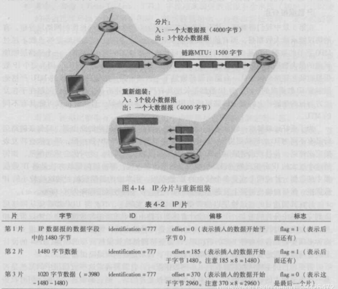

数据报的有效载荷仅当在IP层已完全重构为初始IP数据报时，才会传递给目的地传输层。如果一个或多个片没有到达目的地，则该不完整的数据报被丢失。
并不是所有链路层协议都能承载相同长度的网络层分组，如以太网帧能承载不超过1500字节的数据，某些广域网链路帧不超过576字节
一个链路层帧承载的最大数据量：**最大传送单元MTU**
限制了IP数据报的长度，且发送方与目的路径上的每段链路可能使用不同的链路层协议，有不同的MTU。

**1）如何将过大的IP分组压缩进链路层帧的有效载荷字段？**
            将IP数据报中的数据分片成多个较小的IP数据报，用单独的链路层帧封装这些小IP数据报，每个小数据报叫片
            IPv4将数据报的重新组装放在端系统中，而不是路由器中
    **标识、标志、片偏移字段，帮助主机执行重组任务**
        一个4000字节的数据报（20+3980）到达一台路由器，转发到一条MTU为1500子节的链路上。必须分配3个独立的片，假设初始数据报的标识号是777，则前两片字节都为20+1480，第三层为20+1020
        IPv6废除了分片，简化了IP分组的处理

#### 4.4.2 IP 地址

**（1）分类的 IP 地址**

每一类地址都由两个固定长度的字段组成，**其中一个字段是网络号 net-id，它标志主机（或路由器）所连接到的网络，而另一个字段则是主机号，host-id，它标志该主机（或路由器）。**
● 网络号：保证相互连接的两个网段具有不同的标识, 简单来说就是标识网络 (网段:一段范围内的IP, 具体是网络号相同的所有IP)
● 主机号：**同一网段内, 主机之间具有相同的网络号**, 但是必须有不同的主机号, 简单来说就是标识同一网段下的不同主机.
● 子网：IP 地址是以网络号和主机号来表示网络上的主机的, **只有在一个网络号下的计算机之间才能“直接”互通**, **不同网络号的计算机要通过网关（Gateway）才能互通.** 但这样的划分在大多数情况下显得并不十分灵活. 为此IP网络还允许划分成更小的网络, 称为子网（Subnet）.

通过合理的设置网络号和主机号，就可以保证在相互连接的网络中，每台主机的IP地址都不同。那么如何自动管理子网内的IP：

**DHCP 动态主机配置协议** ：首先,这是一个应用层协议，可以自动给子网内新增的主机节点分配IP地址. 。一般的路由器都带有DHCP功能， 因此路由器也可以看做是一个DHCP服务器。
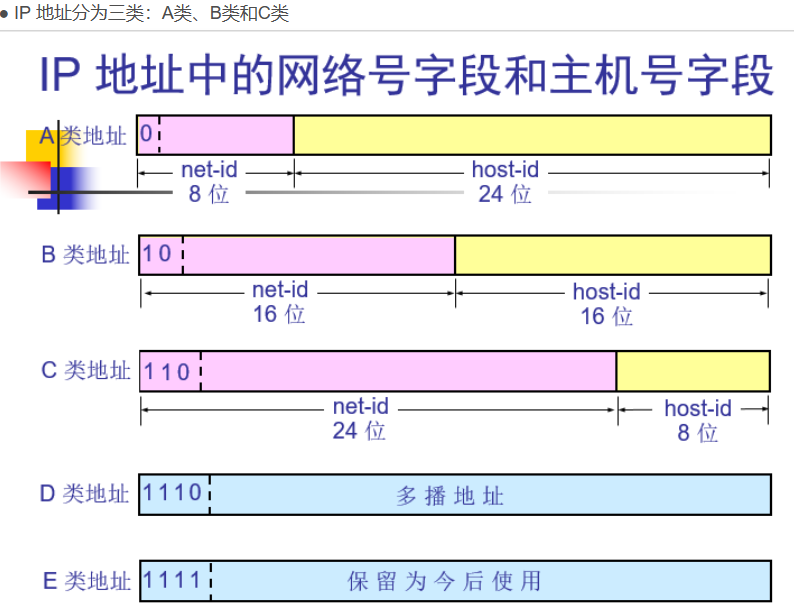

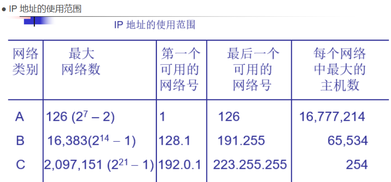

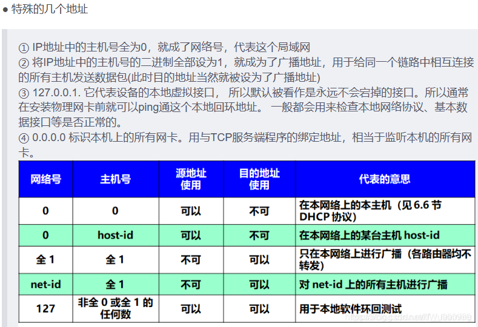

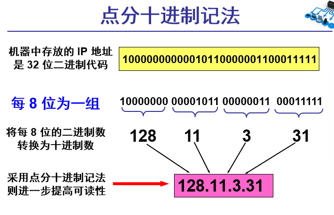

**（2） IP 地址的特点**

① **IP 地址是一种分等级的地址结构。**分两个等级的好处是：

● **IP 地址管理机构在分配 IP 地址时只分配网络号，而剩下的主机号则由得到该网络号的单位自行分配。**这样就方便了 IP 地址的管理。
● **路由器仅根据目的主机所连接的网络号来转发分组（而不考虑目的主机号），这样就可以使路由表中的项目数大幅度减少，从而减小了路由表所占的存储空间。**

② **实际上 IP 地址是标志一个主机（或路由器）和一条链路的接口。**

**当一个主机同时连接到两个网络上时，该主机就必须同时具有两个相应的 IP 地址**，其网络号 net-id 必须是不同的。这种主机称为多接口主机(multihomed host)。
由于一个路由器至少应当连接到两个网络（这样它才能将 IP 数据报从一个网络转发到另一个网络），因此一个路由器至少应当有两个不同的 IP 地址。

③ **用转发器或网桥连接起来的若干个局域网仍为一个网络**

因此这些局域网都具有同样的网络号 net-id。

④ **所有网络都是平等的。**

所有分配到网络号 net-id 的网络，范围很小的局域网，还是可能覆盖很大地理范围的广域网，都是平等的。

⑤ **路由器总是具有两个或两个以上的 IP 地址。**

路由器的每一个接口都有一个不同网络号的 IP 地址。

⑥ 两个路由器直接相连的接口处，可指明也可不指明 IP 地址。

如指明 IP 地址，则这一段连线就构成了一种只包含一段线路的特殊“网络” 。现在常不指明 IP 地址。

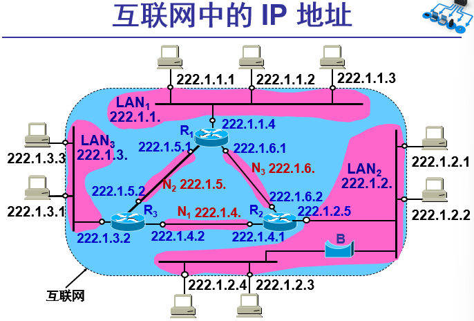

#### 子网掩码

------

IP地址是以网络号和主机号来标示网络上的主机的，我们把网络号相同的主机称之为本地网络，网络号不相同的主机称之为远程网络主机，本地网络中的主机可以直接相互通信；远程网络中的主机要相互通信必须通过本地网关（Gateway）来传递转发数据。

------

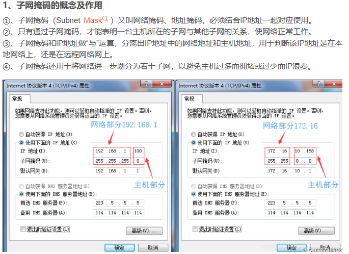

**2、子网掩码的组成**

①、同IP地址一样，子网掩码是由长度为32位二进制数组成的一个地址。
②、子网掩码32位与IP地址32位相对应，IP地址如果某位是网络地址，则子网掩码为1，否则为0。
③、举个栗子：如：11111111.11111111.11111111.00000000

> 注：左边连续的1的个数代表网络号的长度，（使用时必须是连续的，理论上也可以不连续），右边连续的0的个数代表主机号的长度。

**3、子网掩码的表示方法**

**①、点分十进制表示法**
二进制转换十进制，每8位用点号隔开
例如：子网掩码二进制11111111.11111111.11111111.00000000，表示为255.255.255.0

**②、CIDR斜线记法**
IP地址/n
例1：192.168.1.100/24，其子网掩码表示为255.255.255.0，二进制表示为11111111.11111111.11111111.00000000
例2：172.16.198.12/20，其子网掩码表示为255.255.240.0，二进制表示为11111111.11111111.11110000.00000000
不难发现，例1中共有24个１，例2中共有20个１，所以n是这么来的。运营商ISP常用这样的方法给客户分配IP地址。

> 注：n为1到32的数字，表示子网掩码中网络号的长度，通过n的个数确定子网的主机数=2^(32-n)-2（-2的原因：主机位全为0时表示本网络的网络地址，主机位全为1时表示本网络的广播地址，这是两个特殊地址）。

#### **4、为什么要使用子网掩码？**

前面说道，子网掩码可以分离出IP地址中的网络地址和主机地址，那为什么要分离呢？因为两台主机要通信，首先要判断是否处于同一网段，即网络地址是否相同。如果相同，那么可以把数据包直接发送到目标主机，否则就需要路由网关将数据包转发送到目的地。

> 可以这么简单的理解：A主机要与B主机通信，A和B各自的IP地址与A主机的子网掩码进行And与运算，看得出的结果：
>
> 1、结果如果相同，则说明这两台主机是处于同一个网段，这样A可以通过ARP广播发现B的MAC地址，B也可以发现A的MAC地址来实现正常通信。
>
> 2、如果结果不同，ARP广播会在本地网关终结，这时候A会把发给B的数据包先发给本地网关，网关再根据B主机的IP地址来查询路由表，再将数据包继续传递转发，最终送达到目的地B。
>
> ------
>
> 计算机的网关（Gateway）就是到其他网段的出口，也就是路由器接口IP地址。路由器接口使用的IP地址可以是本网段中任何一个地址，不过通常使用该网段的第一个可用的地址或最后一个可用的地址，这是为了尽可能避免和本网段中的主机地址冲突。

 在如下拓扑图示例中，A与B，C与D，都可以直接相互通信（都是属于各自同一网段，不用经过路由器），但是A与C，A与D，B与C，B与D它们之间不属于同一网段，所以它们通信是要经过本地网关，然后路由器根据对方IP地址，在路由表中查找恰好有匹配到对方IP地址的直连路由，于是从另一边网关接口转发出去实现互连。

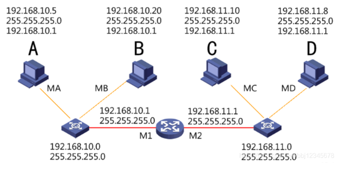

**5、子网掩码的分类**

**①、缺省子网掩码**

也叫默认子网掩码，即未划分子网，对应的网络号的位都置 1 ，主机号都置 0 。

未做子网划分的IP地址：网络号＋主机号

A类网络缺省子网掩码： 255.0.0.0，用CIDR表示为/8

B类网络缺省子网掩码： 255.255.0.0，用CIDR表示为/16

C类网络缺省子网掩码： 255.255.255.0，用CIDR表示为/24

**②、自定义子网掩码**

将一个网络划分子网后，把原本的主机号位置的一部分给了子网号，余下的才是给了子网的主机号。其形式如下：

做子网划分后的IP地址：网络号＋子网号＋子网主机号

举个栗子：

如：192.168.1.100/25，其子网掩码表示：255.255.255.128

意思就是将192.168.1.0这个网段的主机位的最高1位划分为了子网。关于子网划分将在下篇文章讲到，这里不在阐述。

 

**6、子网掩码和IP地址的关系**

子网掩码是用来判断任意两台主机的IP地址是否属于同一网络的依据，就是拿双方主机的IP地址和自己主机的子网掩码做与运算，如结果为同一网络，就可以直接通信。

> **And按位与运算：**
> 与运算是计算机中一种基本的逻辑运算方式，符号表示为&，也可以表示为 and。
> 参加运算的两个数据，按二进制位进行“与”运算。
> 运算规则：0&0=0；0&1=0；1&0=0；1&1=1；
> 即：两位同时为“1”，结果才为“1”，否则为0

**如何根据IP地址和子网掩码，计算网络地址：**

①、将IP地址与子网掩码转换成二进制数。
②、将二进制形式的 IP 地址与子网掩码做“与”运算。
③、将得出的结果转化为十进制，便得到网络地址。
如下图：

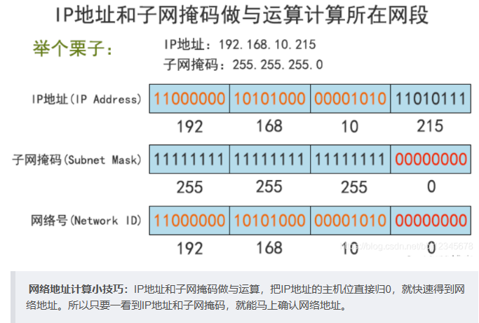

#### CIDR与VLSM

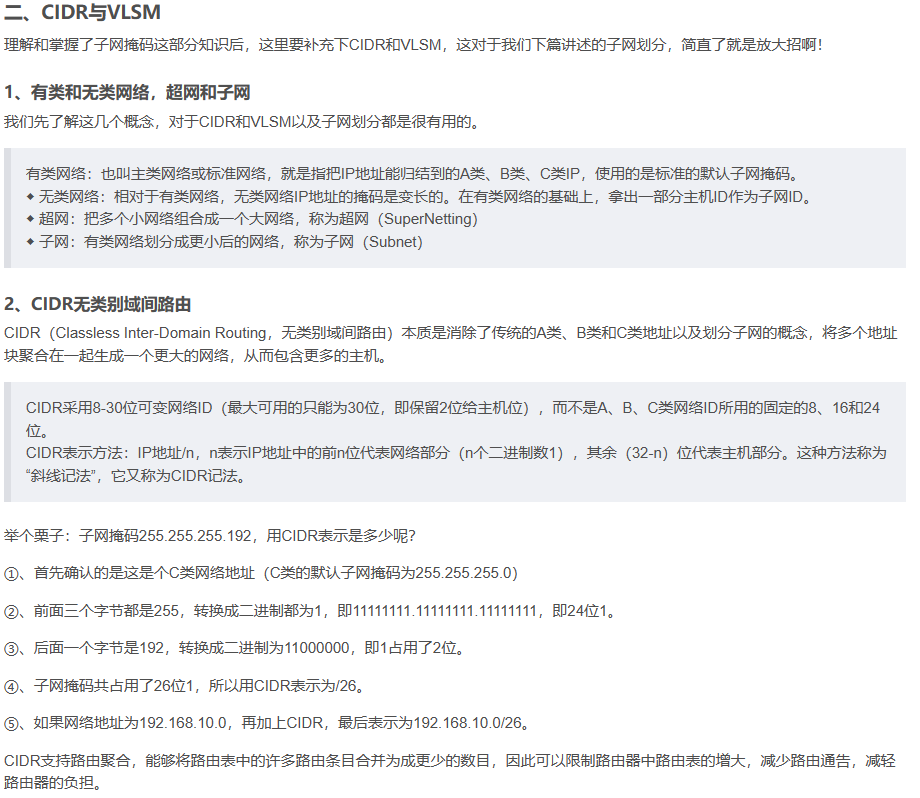

#### 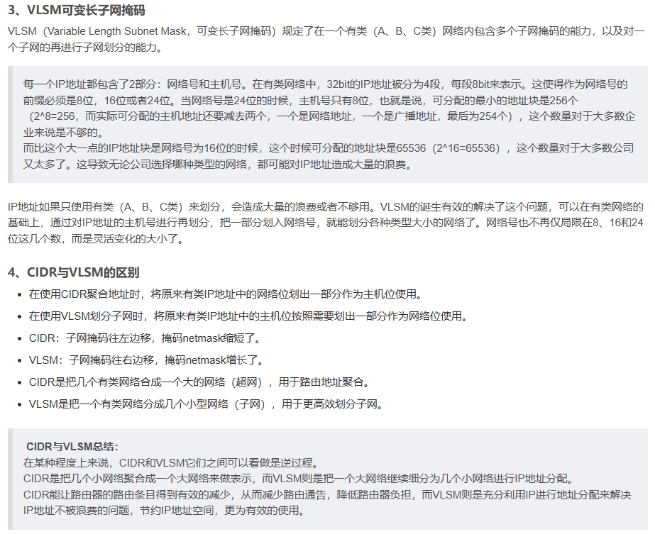

#### ARP协议

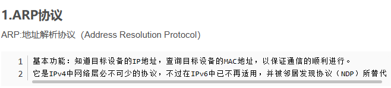

#### 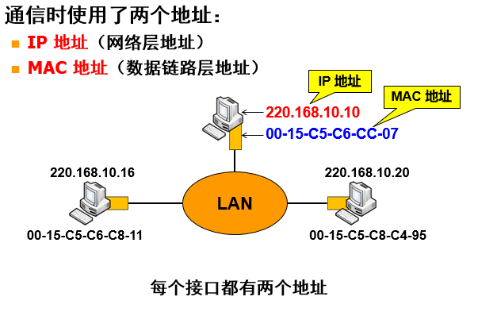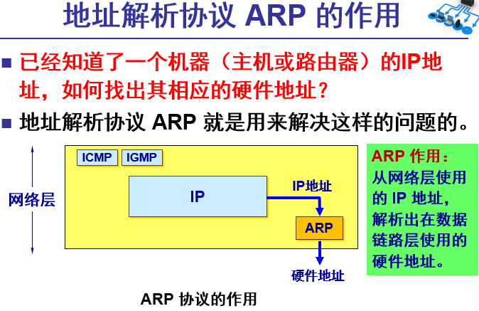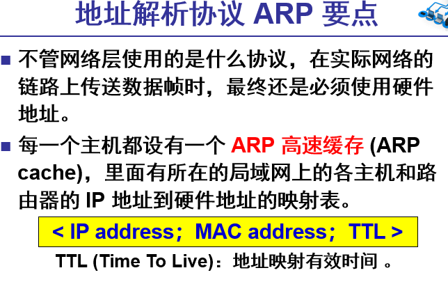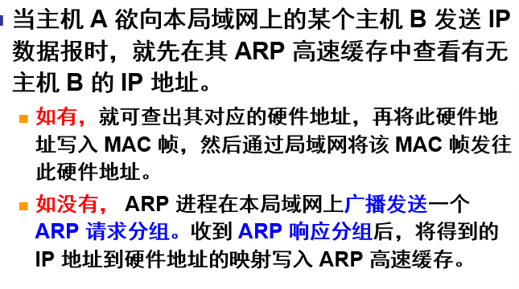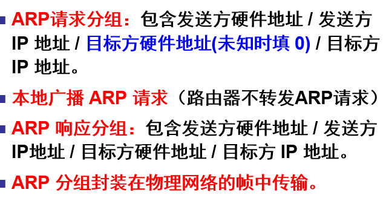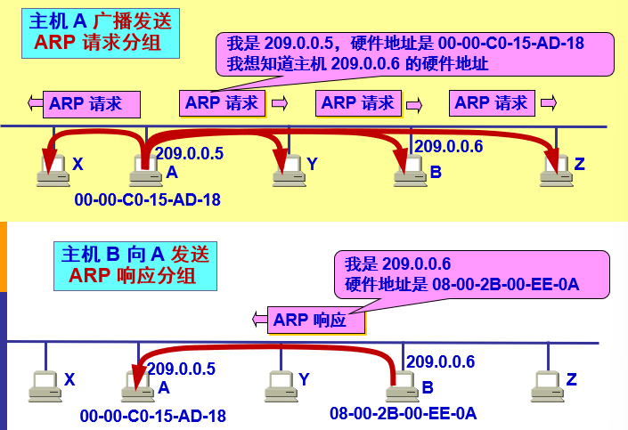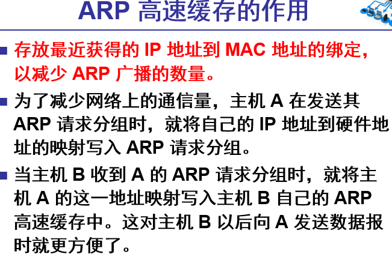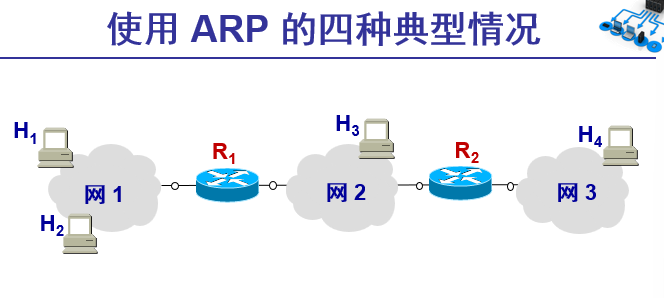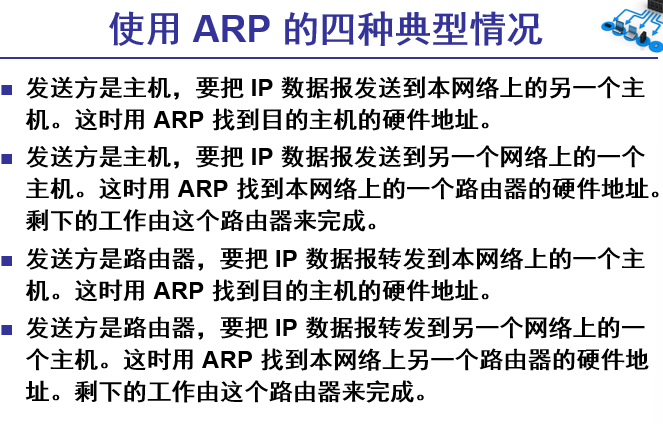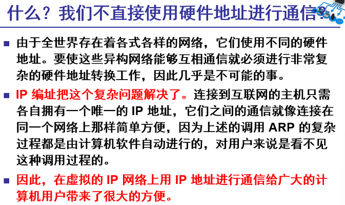4.4.3私有IP地址和公网IP地址

私有IP地址 ：在局域网中使用的IP；
公网IP地址 ：在互联网中使用的地址。

如果一个组织内部组建局域网，IP 地址只用于局域网内的通信，而不直接连到互联网上, 理论上使用任意的 IP 地址都可以，但是 RFC 1918 规定了用于组建局域网的私有IP地址 ：

● 10. * ：前8位是网络号,共16777216个地址, 用于组建大型局域网；
● 172.16. * 到 172.31. * ：前12位是网络号,共1048576个地址, 用于组建中型局域网；
● 192.168.*：前16位是网络号,共65536个地址, 用于组建小型局域网；
包含以上范围中的, 都成为私有IP, 其余的则称为全局IP(或公网IP)

**特点如下：**

● 一个路由器可以配置一个 WAN 口 IP， **一个或多个 LAN 口 IP(私有IP)**。
● **路由器 LAN 口连接的主机，都属于当前这个路由器的子网中。**
● 不同的路由器，子网 IP 其实都是一样的(通常都是192.168.1.1)，子网内的主机 IP 地址不能重复，但是子网之间的 IP 地址就可以重复了。
● 每一个家用路由器，其实又作为运营商路由器的子网中的一个节点。这样的运营商路由器可能会有多级，**最外层的运营商路由器，WAN 口 IP 就是一个公网 IP (如下图所示)。**
● **子网内的主机需要和外网进行通信时， 路由器将 IP 首部中的 IP 地址进行替换(替换成 WAN 口 IP)，这样逐级替换，最终数据包中的 IP 地址成为一个公网 IP，这种技术称为 NAT(Network Address Translation，网络地址转换)。**
● 如果希望我们自己实现的服务器程序， 能够在公网上被访问到， 就需要把程序部署在一台具有外网 IP 的服务器上。可以购买云服务器(比如阿里云、腾讯云、华为云等)。
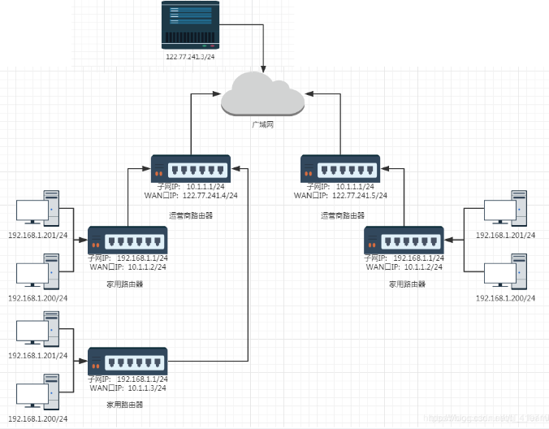

#### 4.4.4、IP 地址与硬件地址

**（1）IP 地址与硬件地址的区别**

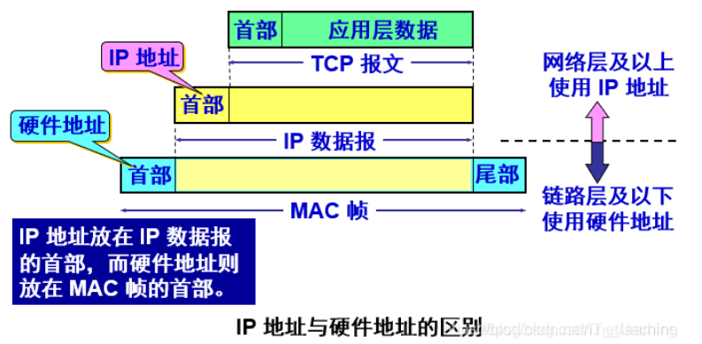

**① IP 地址**

● IP 地址是一种逻辑地址。
● IP 地址称为逻辑地址，是因为IP地址是用软件实现的。
● IP 地址是网络层及其以上各层(包括运输层、应用层等)使用的地址。
● IP 地址放在 IP 数据报的首部。

**② 硬件地址**

● 硬件地址是一种物理地址。
● 硬件地址称为物理地址，是因为硬件地址是用硬件实现的。
● 硬件地址是数据链里层和物理层使用的地址。
● 硬件地址放在 MAC 帧的首部。

**（2）数据发送中的 IP 地址与硬件地址**

**① 发送数据**

● 在发送数据时，数据从高层下到低层，然后才到通信链路上传输。
● 使用 IP 地址的 IP 数据报**一旦交给了数据链路层，就被封装成 MAC 帧了。**
● MAC 帧在传送时使用的**源地址和目的地址都是硬件地址**，这两个硬件地址都写在 **MAC 帧的首部。**
● 当 IP 数据报放入到数据链路层的 MAC 帧中以后，整个 IP 数据报就成了 MAC 帧的数据部分，因而在数据链路层看不见 IP 数据报的 IP 地址。

**② 接收数据**

● 在接收数据时，数据从低层上到高层。
● 连接在通信链路上的设备(主机或路由器)在接收 MAC 帧时，其根据是 **MAC 帧首部的硬件地址**。
● 在数据链路层看不见隐藏在 MAC 帧的数据中的 IP 地址。
● 只有在剥去 MAC 帧的首部和尾部后，把 MAC 帧的数据部分上交给网络层后，网络层才能在 IP 数据报的首部中找到源 IP 地址和目的 IP 地址。

**(屏蔽作用)**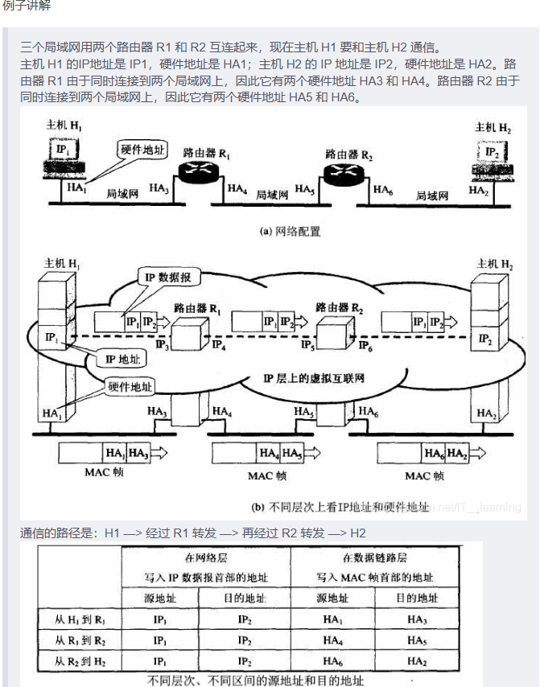

**（3）注意点**

● 在 IP 层抽象的互联网上只能看到 IP 数据报。
● 虽然在 IP 数据报首部有源 IP 地址，但路由器只根据目的站 IP 地址的网络号进行路由选择。
● 在局域网的链路层，**只能看见 MAC 帧**，IP 数据报被封装在 MAC 帧中。MAC 帧在不同网络上传送时，其 MAC 帧首部中的源地址和目的地址在发生变化。
● 尽管互连在一起的网络的硬件地址体系各不相同，但 IP 层抽象的互联网却屏蔽了下层这些很复杂的细节。只要我们在网络层上讨论问题，就能够使用统一的、抽象的 IP 地址研究主机和主机或路由器之间的通信。“屏蔽”是一个很有用，很普遍的基本概念。

#### 4.4.5 IPV4编址

​    **主机与路由器连入网络的方法**

- 一台主机通常只有一条链路连接到网络，主机IP发送数据报从该链路发送
- ​    主机与物理链路的边界叫**接口**，一台路由器有多个接口
- ​    IP要求每台主机和路由器都有自己的**IP地址**，因此一个IP地址实际上是与每一个接口相关联的
- ​    每个IP地址长度32bit（4字节），总共2^32个可能的IP地址，约40亿个
- ​    **点分十进制记法**，如193.32.216.9
- ​    一个接口的IP地址的一部分需要由其连接的子网决定.如互联3个主机接口与1个路由器接口的网络形成一个子网，IP编址为这个子网分配一个地址：**223.1.1.0/24，/24记法称为子网掩码，**指示了32bit中的最左侧24bit定义了**子网地址**
- ​    为了确定子网，分开主机和路由器的每个接口，产生几个隔离的网络岛，使用接口端接这些隔离的网络的端点，这些隔离的网络中每一个都叫做一个子网
-    因特网地址分配策略：**无类别域间路由选择CDIR**
- ​    a.b.c.d/x的地址的x最高比特构成IP地址的网络部分，称为该地址的前缀，一个组织通常被分配一块连续的地址，即具有相同前缀的一段地址。**BGP路由选择协议**中，该组织网络外的路由器仅考虑x，减少了转发表的长度，**因为形式为a.b.c.d/x单一表项足以将数据报转发到该组织内的任何目的地**
- 地址聚合（路由聚合）：使用单个网络前缀通告多个网络的能力

​    一个ISP将8个组织连接到因特网。该ISP向外界通告：向我发送以200.23.16.0/20开始的任何内容。外部无需知道在该地址块内还有8个其他组织，每个组织有自己的子网

- 一个地址的剩余32-x比特可认为是用于区分该组织内部设备的。组织内部路由器转发分组时，才会考虑这些比特
  在**CDIR**出现之前，采用分类编址，A、B、C类网络，分别具有8、16、24比特子网地址
         E类：240.0.0.0~255.255.255.255

  D类       224.0.0.0~239.255.255.255

  C类（/24）仅能容纳2^8-2=254台主机（其中两个用于特殊用途）192.0.0.0~223.255.255.255

  B类（/16）支持65534台主机，一个组织分配一个B类地址却只用2000个接口，造成巨大浪费  128.0.0.0~191.255.255.255

  A类  （/8）0.0.0.0~127.255.255.255

**IP广播地址**
    当一台主机发出目的地址为**255.255.255.255**的数据报时，报文会交付给同一个网络的所有主机，路由器也会有选择的向邻近的子网发送报文（通常不这样做）。可用于DHCP发现报文的发送，广播最小生成树

**如何获取地址、分配地址？**

       1. **获取一块地址**
            **子网获取IP地址：由ISP从它大块地址中分配**
            **ISP获取IP地址**：IP地址由因特网名字和编号分配机构**ICANN**管理（也管理DNS根服务器、AS标识号）。ICANN向区域性因特网注册机构分配地址，处理本地域内的地址分配/管理
       1.   **获取主机地址**
            组织获得一块地址，就可为组织内的主机、路由器接口逐个分配IP地址
            **主机地址能手动配置，也能自动配置，即动态主机配置协议DHC**P
       1. **动态主机配置协议DHCP---UDP**
            DHCP允许主机自动获取一个IP地址
            DHCP可配置，可以使主机每次连网获得相同IP地址，也可每次分配一个临时IP地址。
            DHCP还允许主机查看子网掩码、默认网关（第一跳路由器地址）、本地DNS服务器地址
            DHCP能将主机连接进一个网络的自动能力，常被称为即插即用协议
            DHCP是一个客户-服务器协议。新来的主机要获得自使用的IP地址等网络配置信息
            每个子网都有一台DHCP服务器
             若子网没有DHCP服务器，则由一个路由器做DHCP中继代理，该代理知道该网络的DHCP服务器地址
            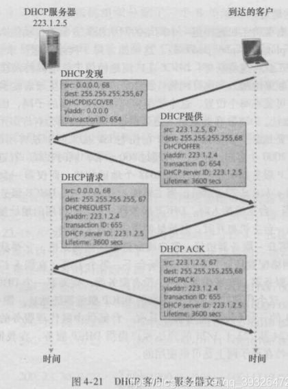

 **新主机到来时，DHCP协议的四个步骤**

------

  **1.DHCP服务器发现**

新到的客户通过广播DHCP发现报文，发现一个要与其交互的DHCP服务器
        客户在UDP分组中向端口67发送该发现报文，此时必须用广播地址255.255.255.255，源地址是0.0.0.0
    **2.DHCP服务器提供
**        DHCP收到DHCP发现报文后，响应一个DHCP提供报文，仍然使用广播地址，因为此时新客户并没有IP地址
        可能有多台DHCP服务器，每台服务器提供的报文中，有向客户主机推荐的IP地址、网络掩码以及IP地址租用期（一般几天或几小时）
    **3.DHCP请求**
        客户从提供中选一个，向选中的服务器提供一个DHCP请求报文进行响应，回显配置参数
    **4.DHCP ACK**
        收到DHCP请求报文后，用DHCP ACK报文对其记性响应，证实所传参数
客户收到ACK后，交互完成，在租期内使用DHCP分配的IP地址。DHCP提供了机制允许客户更新对一个IP地址的租用

 当一个移动结点在子网之间移动时，就不能维持与远程应用的TCP连接。

------

 **VPN**  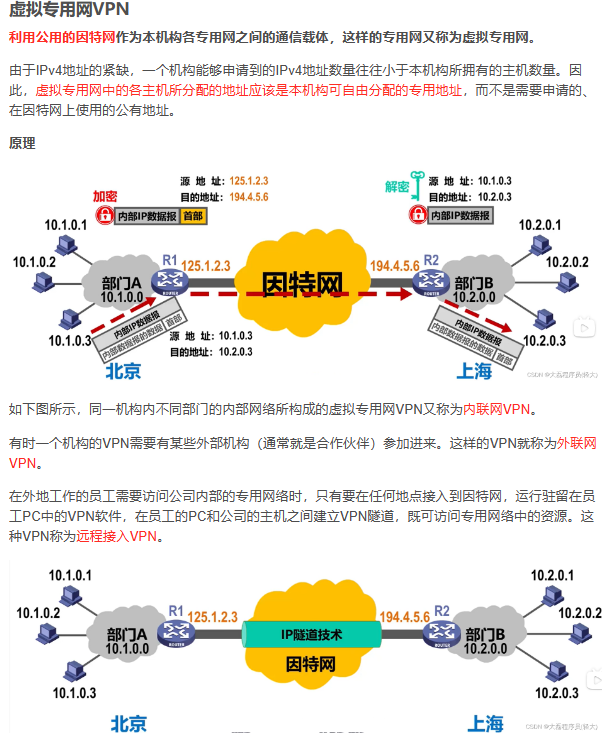

 **4.网络地址转换NAT**

地址10.0.0.0/8是保留的3个IP地址空间之一，这些地址用于家庭网络等专用网络或具有专用地址的地域。具有专用地址的地域是指其地址仅对还网络中的设备有意义的网络。

  当ISP已经为SOHO网络当前地址范围分配过一块连续地址，而SOHO内主机越来也多时，需要用到NAT（比如电信给你家分配一个动态IP地址，家里要好几台手机电脑联网用一个IP地址，需要用NAT）。

**NAT使能路由器**
    NAT路由器对外界来看像一个具有单一IP地址的单一设备。例如，家里有一个NAT使能路由器，其IP地址138.76.29.7，且进入和离开家庭的报文都有同样的该地址
    **NAT路由器对外隐藏了家庭网络的细节**
    **NAT路由器从ISP的DHCP服务器得到它的地址，并且路由器运行一个DHCP服务器，为位于NAT-DHCP路由器控制的家庭网络地址空间中的主机提供地址**

需要在专用网连接到互联网的路由器上安装NAT软件。装有 **NAT** 软件的路由器叫作 NAT路由器，**它至少有一个有效的外部全球IP地址。**

所有使用本地地址的主机在和外界通信时，都要在 **NAT** 路由器上将其本地地址转换成全球 **IP** 地址，才能和互联网连接。

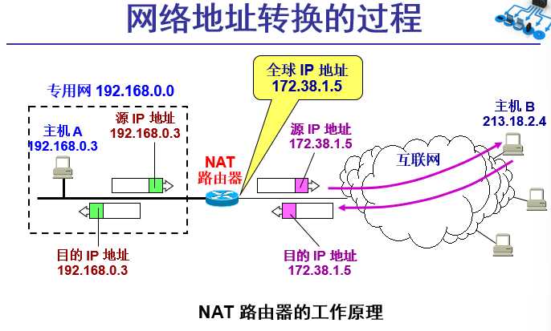

 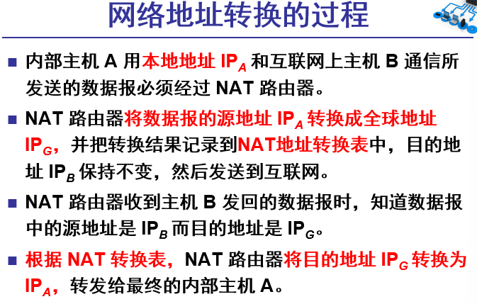

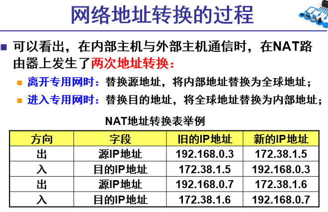

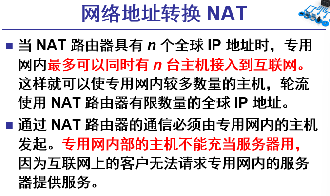

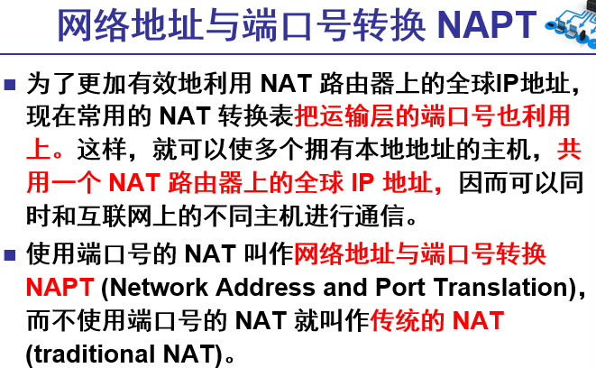

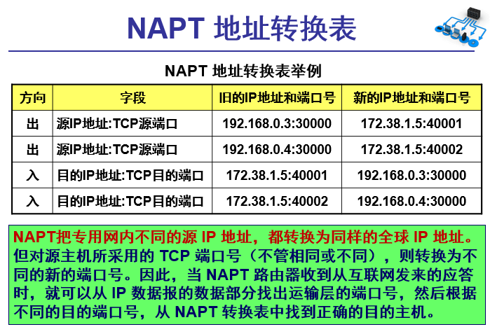

**NAT转换表：**

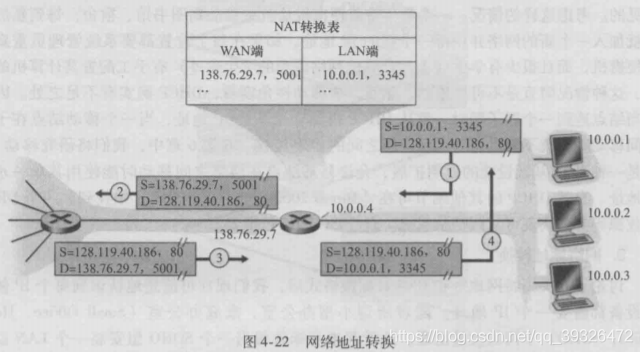

   端口号和IP地址用于路由器将分组转发给特定的内部主机（比如家里的某个手机）
        **NAT重要问题**：
            违反各种原则，应该用IPv6来改进
            妨碍P2P应用程序，包括P2P共享和语音。一个对等方在NAT后面，不能充当服务器并接受TCP连接，其解决办法是连接反转
                连接反转：A通过C与B联系，C不位于NAT之后并与B建立了TCP连接，已经被很多P2P应用用于NAT穿越
                若对等方A和B都在NAT之后，使用应用程序进行中继处理，如Skype中继

​    **5.UPnP**
​        NAT穿越由通用即插即用（UPnP）提供
​        UPnP是一种允许主机发现并配置邻接NAT的协议，要求主机和NAT都是UPnP兼容（运行在NAT使能路由器）。允许外部主机使用TCP和UDP向NAT化的主机发起通信会话。
​        使用UPnP，在主机上运行的应用程序能为某些请求的公共端口号请求一个NAT映射（专用IP地址，专用端口号 — 公共IP地址，公共端口号）。如果某NAT接收请求并生成映射，来自外部的结点能发起到（公共IP地址，公共端口号）的TCP连接。

#### 4.4.6 因特网控制报文协议ICMP

   **1、ICMP介绍**
**（1）简介**

- 为了**更有效地转发 IP 数据报和提高交付成功的机会**，在网际层使用了网际控制报文协议 **ICMP** (Internet Control Message Protocol)。

- **ICMP 是互联网的标准协议**。
- **ICMP 允许主机或路由器报告差错情况和提供有关异常情况的报告。**
- ICMP 报文作为 **IP 数据报的数据**，**加上数据报的首部，组成 IP 数据报发送出去。**
- ICMP **不是高层协议**（看起来好像是高层协议，因为 ICMP 报文是**装在 IP 数据报中，作为其中的数据部分**），而是 IP 层的协议。
- **ICMP只能搭配IPv4工作，如果是IPv6，需要使用ICMPv6**

**（2）ICMP协议的功能**

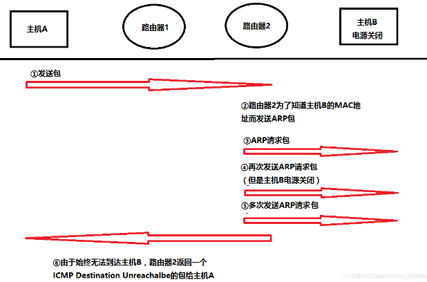

**● 确认IP包是否成功到达目标地址**
**● 通知在发送过程中 IP 包被丢弃的原因**

接收主机根据这两个信息就可以断定引起重定向的IP数据报应该使用哪个路由器来转发，并且以此来更新路由表（通常是更新路由表缓冲，而不是直接更改路由表）。一般来说，主机只能接收ICMP重定向报文，路由器只能发送ICMP重定向报文。

**（3）ICMP 的报文格式**

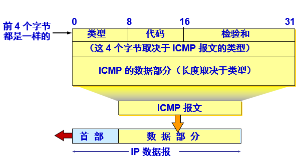

- （1）8 位类型字段用于区分报文类型。它将ICMP报文分为两大类：

   **差错报文**：主要用于回应网络错误，比如目标不可到达（类型值为3）和重定向（类型值为5）

  **查询报文**：用于查询网络信息，比如ping命令就是使用ICMP报文查看目标是否可到达（类型值为8）的

- （2）有的类型通过8位代码字段来进一步细分不同的条件：

  **比如重定向报文使用代码值0表示对网络重定向，代码值1表示对主机重定向**

- （3）ICMP报文使用16位校验和字段对整个报文（包括头部和内容部分）进行CRC校验（循环冗余校验），以校验报文是否损坏

**（4）ICMP 报文的种类**

ICMP 报文的种类有两种，即 ICMP 差错报告报文和 ICMP 询问报文。
ICMP 报文的前 4 个字节是统一的格式，共有三个字段：即类型、代码和检验和。接着的 4 个字节的内容与 ICMP 的类型有关。

**ICMP 差错报告报文的数据字段的内容**

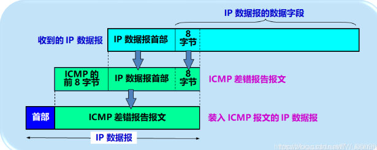

把收到的需要进行差错报告的 IP 数据报的首部和数据字段的前 8 个字节提取出来，作为 ICMP 报文的数据字段，再加上相应的 ICMP差错报告的前8个字节，就构成了ICMP差错报告报文。
ICMP报文包含在IP数据报中，IP报头在ICMP报文的最前面。一个ICMP报文包括IP报头（至少20字节）、ICMP报头（至少八字节）和ICMP报文（属于ICMP报文的数据部分）。当IP报头中的协议字段值为1时，就说明这是一个ICMP报文。

**ICMP 差错报告报文种类**

- **① 终点不可达**

  当路由器发送的数据报不能发送到指定目的地时，或者说当路由器不能够给数据报找到路由或主机不能够交付数据报时，就丢弃这个数据报，然后向发送数据报的源主机设备发回一个终点不可达数据报文。

- **② 端口不可达**

  当目标系统收到一个ip数据报的某个服务请求时，如果本地没有此服务，那么会向源头返回ICMP端口不可达信息。   
  常见的端口不可达有，R1向R3发起一个ftp的传输请求，从R3传输一个文件到R1，由于R3设备没有开启ftp服务的69端口，因此R1在请求R3时会收到R3回复的一个ICMP端口不可达的差错报文。

- **③ 超时**

  ICMP差错报告报文主要在以下几种情况中，会发送ICMP超时报文：
   ●  当路由器接收到的数据报的生命周期字段值为0时，路由器会把该数据报丢弃掉，并向源主机发回一个 ICMP 超时报文。
   ●  当目标主机在规定时间内没有收到所有的数据分片时，会把已经收到的所有数据分片丢弃，并向源主机发回一个 ICMP 超时报文。在超时报文中，代码 0 只能给路由器使用，表示生存周期字段值为 0，代码 1 只能给目的主机使用，它表示在规定的时间内，目的主机没有收到所有的数据分片。

- **④ 参数问题**

  当路由器或目的主机收到的数据报的首部字段中有的字段的值不正确时，就会丢弃该数据报，并向源点回送参数问题报文。

- **⑤ 改变路由（重定向）**
  路由器吧改变路由报文发送给主机，让主机知道下次应将数据报发送给另外的路由器（可通过更好的路由）。

**不应发送 ICMP 差错报告报文的几种情况**

● 对 ICMP 差错报告报文不再发送 ICMP 差错报告报文。
● 对第一个分片的数据报片的所有后续数据报片都不发送 ICMP 差错报告报文。
● 对具有多播地址的数据报都不发送 ICMP 差错报告报文。
● 对具有特殊地址（如127.0.0.0 或 0.0.0.0）的数据报不发送 ICMP 差错报告报文。

**ICMP 询问报文有两种**

● 回送请求和回答报文
● 时间戳请求和回答报文

**应用方面**

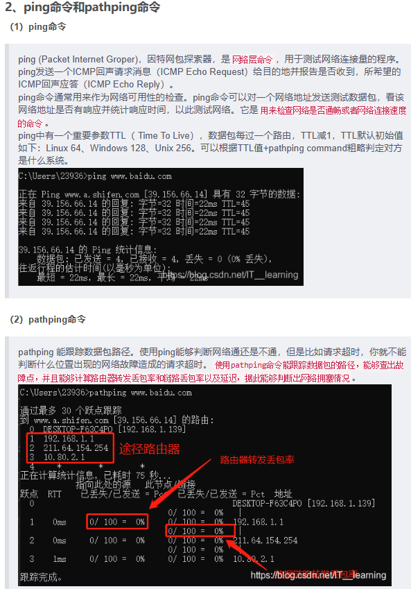

#### 4.4.7 IPV6

 **IPv4地址耗尽，也可升级强化IPv4某些方面**

  **IPv6数据报格式（不一样的地方）**

- **扩大的地址容量**
- **32bit —> 128bit**
- **除了单播多播地址，引入任播地址，使数据报交付给一组主机中的任意一个简化高效的40字节首部**
- **流标签与优先级。 如音频流、视频流、高优先级用户承载的流量**
- **分片/重组。 只能在源与目的地进行**
- **选项 放到了『下一个首部』位置，使得IP首部定长40字节**
- **去除首部检验和**

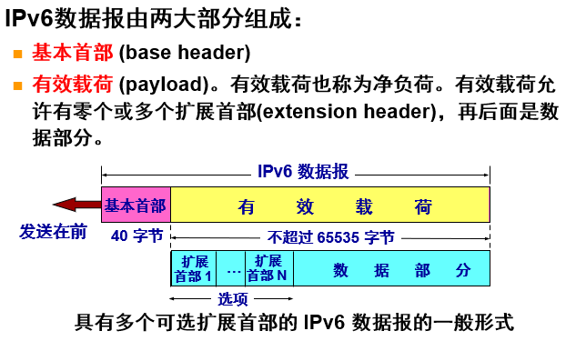

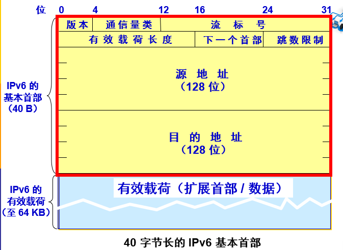

   **IPv6字段**（与IPV4对应）

- 版本号(version)
      不同的IP协议版本使用不同的数据报格式。
- 通信量等级(Traffic Classes)
      使得源节点和路由器能够识别IPv6信息包的优先级。与IPv4服务类型TOS字段含义类似。
- 流标签(Flow Label)
      标记那些需要IPv6路由器特殊处理(如一种非默认服务质量或实时服务)的信息包顺序。

- 有效负载长度(Payload Length)
      定长40字节数据报首部后面的字节数量，包括扩展报头和负载数据，即数据报长度-40。

- 下一个首部(Next Header)
      当IPv6没有扩展报头时，该字段的作用和IPv4的上层协议字段一样。当含有扩展报头时，该字段的值即为第一个扩展报头的类型。

- 跳限制(Hop Limit)
      转发数据报的每台路由器对该字段的值减1，若减为0则丢弃该数据报。

- 源和目的IP地址(Source/Destination Address)
  数据(Data)
      当数据报到达目的地时，该有效载荷就从IP数据报移出，并交给下一个首部字段中指定的协议。

- 源和目的IP地址(Source/Destination Address)
  

2. **IPv4到IPv6的迁移**
        **双协议栈**：同时使用IPv4和IPv6，这种结点有两种地址。**DNS可解析两种地址**。如果发送方和接收方中任意一个仅为IPV4使能的，则必须使用IPv4数据报。

    例：
    
    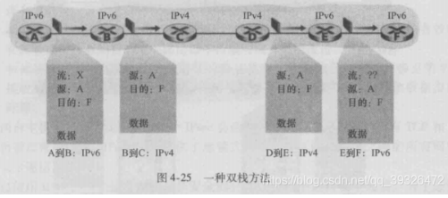

结点B必须生成一个IPv4数据报发给C，IPv6数据报的数据字段可以复制到IPv4数据报的数据字段中，并且要做适当的映射。在IPv4中没有对应的部分的数据，这些字段的信息会丢失

  **建隧道**：图中B和E，要使用IPV6交互，但是它们经由中间IPv4路由器关联的，我们将两台IPv6路由器之间的Ipv4路由器的集合成为一个**隧道**，将整个IPv6数据报放在IPv4的有效载荷中。

**隧道技术**---把IPV6数据报封装成IPV4数据报，也就是说整个的IPV6数据报变成了IPV4数据报的数据部分。当IPV4数据报离开IPV4网络中的隧道时，再把数据部分（即原来的IPV6数据报）交给主机IPV6协议栈

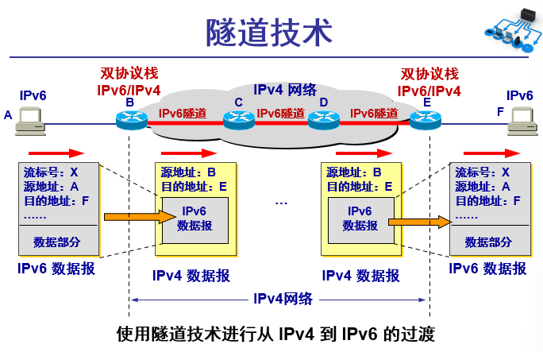

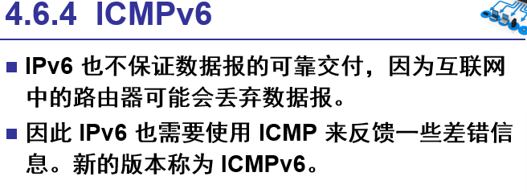

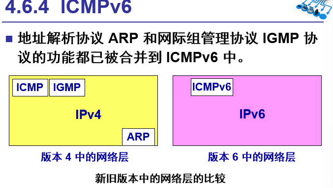

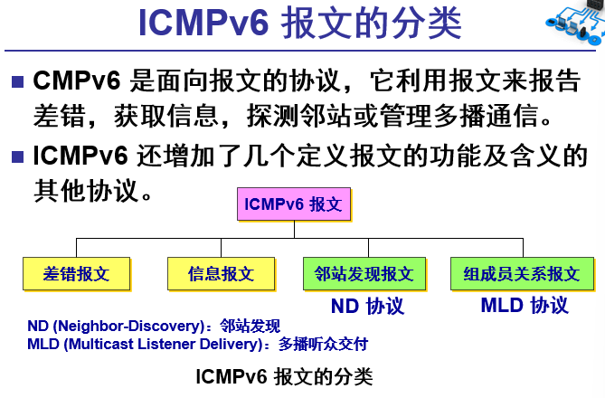

#### 4.4.8 涉足IP安全性

​    新型网络层协议：IPsec（如果你是Mac OS，网络设置中添加VPN服务时你会看到）。与IPv4和IPv6向后兼容
​        **在VPN（虚拟专用网）中部署**
​        两台主机要通信，IPsec只需在两台主机中可用，其他主机和路由器继续用普通的IPv4
​        两台主机首先创建IPsec会话（面向连接的），在两台主机发送的TCP和UDP报文段都享受IPsec的安全性服务

1. 密码技术约定
2. IP数据报有效载荷的加密
3. 数据完整性
4. 初始鉴别。主机确信在数据报中的源IP地址是该数据报的实际源。

### 4.5 路由选择算法

------

路由器转发分组是通过**路由表**转发的，而路由表是通过各种算法得到的。从能否随网络的通信量或拓扑自适应地进行调整变化来划分，路由算法可以分为如下两大类。

------

​    路由选择：确定从发送方到接收方通过路由器网络的好路径
​    主机通常直接与一台路由器相连，该路由器即为该主机的**默认路由器**或**第一跳路由器**
​        源主机默认路由器称为**源路由器**，目的主机默认路由器称为**目的路由器**
​        一个分组从源主机到目的主机 == 从源路由器到目的路由器
​    **路由选择算法**：给定一组路由器和连接路由器的链路，路由选择算法找到一条源路由器到目的路由器好的路径（最低费用），如最短路径算法（图）

####     4.5.1静态路由与动态路由

**①静态路由算法（非自适应路由算法)**
由网络管理员**手工配置**的路由信息。
**静态路由特点：**

当网络的拓扑结构或链路的状态发生变化时，需**手工修改**路由表中的静态路由信息。
它不能及时适应网络状态的变化，对于**简单的小型网络**，可以采用静态路由。

**②动态路由算法（自适应路由算法)**
相互连接的**路由器之间彼此交换信息**，按照一定的算法优化出路由表。
**动态路由特点：**

这些路由信息会在一定时间间隙里不断更新，以随时获得最优的寻路效果。
常用的动态路由算法还可以分为两类：**距离-向量路由算法、链路状态路由选择算法。**

------

  **第一种分类方法：**
**全局式路由选择算法**       
 用完整、全局性的网络信息计算出最短路径（最低费用路径）
  具有全局状态信息的算法称作链路状态算法（LS）

 **分散式路由选择算法**
        迭代、分布式的方式计算最短路径
        没有结点拥有关于网络链路的完整信息，每个结点仅有与其直接相连链路的信息即可工作
        通过迭代计算并与相邻结点交换信息，逐渐计算出最低费用路径，距离向量算法（DV）
**第二种分类方法：**
    **静态路由选择算法**
        变化缓慢，通常人工干预
    **动态路由选择算法**
        网络流量负载或拓扑发生变化时改变路由选择路径
        周期性运行或直接响应变化
        也容易受路由选择循环、路由震荡等问题的影响
**第三种分类方法：**
    **负载敏感算法**
        链路费用动态变化来反映链路拥塞水平
    **负载迟钝算法**
        链路费用与拥塞无关，当今因特网路由选择算法基本都是迟钝的

------

#### 4.5.2 链路状态路由选择算法LS

​    网络拓扑和所有链路费用已知。实践中是由每个节点向网络其他所有节点广播链路状态分组完成的，**例如OSPF路由选择协议由链**，**路状态广播算法完成**      

所有节点都具有该网络的信息，每个节点运行LS算法
**Dijkstra算法**(最短路径)
会产生路由震荡，可以让每台路由器发送链路通告的时间随机化

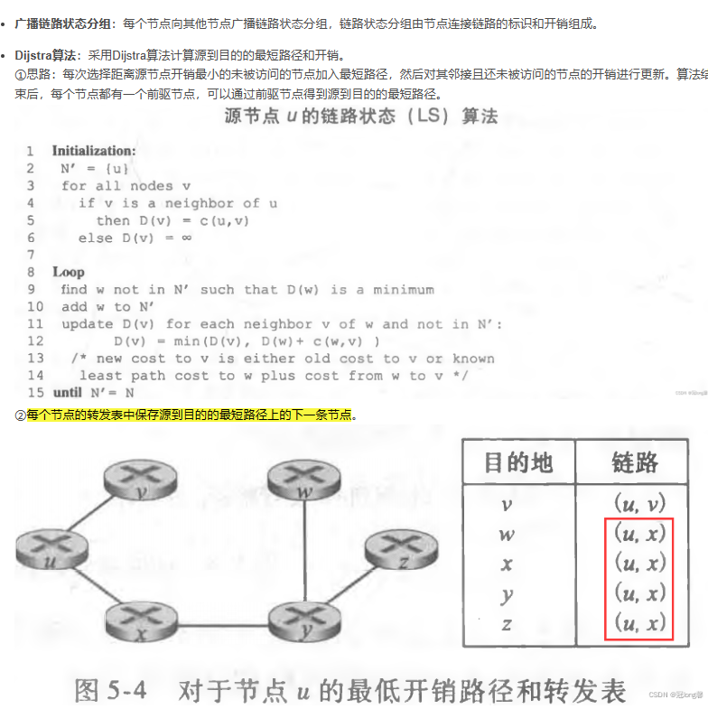

但是这种算法会出现震荡现象：

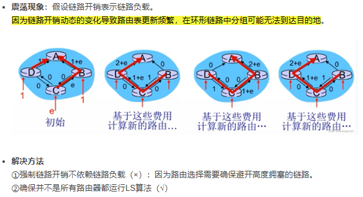

#### 4.5.3 距离向量路由算法DV

​    **迭代、异步、分布式**
​        **分布式**：**每个结点要从一个或多个直接相连邻居接收某些信息，计算，将计算结果发给邻居**
​        **迭代**：过程持续到邻居之间无更多信息交换
​        **异步**：不要求所有节点相互步伐一致操作
​    **DV算法**
​        Bellman-Ford方程（弗洛伊德最短路径算法，O（n^3））
​        无更新报文发送，不会出现进一步路由选择表计算，算法进入静止状态。直到一条链路费用发生改变
​    链路费用改变与链路故障
​    路由选择环路，无穷计数问题
​    增加毒性逆转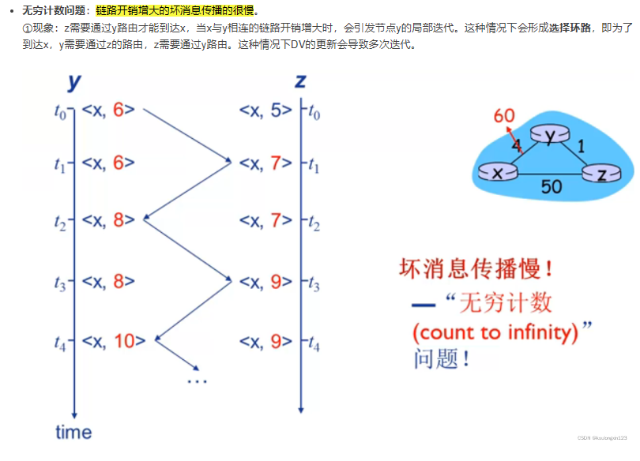

​        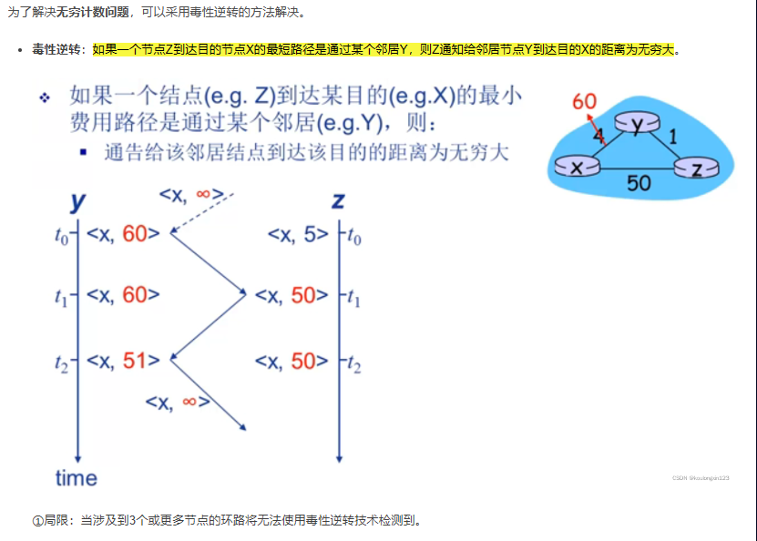

欺骗费用无穷大。如果z通过y路由选择到目的地x，则z通告y，它（z)到x的距离是无限大。
​        解决两个直接相连无穷计数问题，更多结点环路无法解决

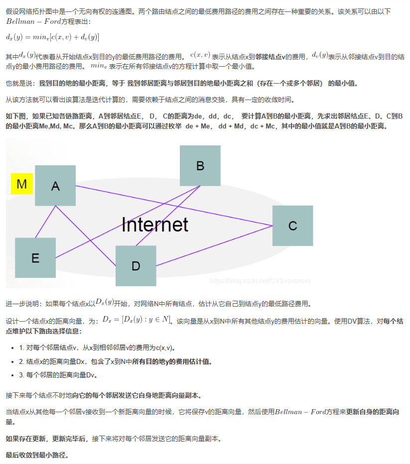

​    **LS与DV路由选择算法的比较**
​        报文复杂性
​            显然LS复杂得多，每条链路费用改变都要通知所有结点
​        收敛速度
​            DV算法收敛较慢，且会遇到路由选择环路和无穷计数问题
​        健壮性
​            路由器发生故障，LS结点仅计算自己的转发表，提供了一定健壮性
​            DV算法一个 不正确的结点会扩散到整个网络
​    其他路由选择算法
​        LS、DV基本上是当前因特网实践中使用的仅有的两种路由选择算法
​        很多种新型算法，一种是基于将分组流量看做网络中源和目的之间的流
​        电路交换路由选择算法也有参考价值

#### 4.5.3 层次路由选择（--AS问题）

   前面介绍的 LS 和 DV 算法的研究中，都将网络抽象为一张图。但是将任意规模的网络抽象为一个图来计算路由**过于理想化**，因为至少有以下两个重要原因：

- **网络规模：**随着路由器数目变得很大，涉及路由选择信息的计算、存储及通信的开销将高的不可实现。在公共因特网上的所有路由器中广播 LS 更新所需的开销将导致没有剩余的带宽来发送数据分组；在如此大量的路由器中迭代的 DV 算法讲课顶**永远无法收敛。**显然必须采取一些措施以减少公共因特网这种大网络中的路由计算的复杂性。
- **管理自治：**每个网络的管理可能都期望自主控制其网内的路由，或对外隐藏其网络的内部组织面貌。在理想情况下，一个组织应当能够按自己的愿望运行和管理其网络，还要能将其网络与其他外部网络相连接。

**这些问题都可以通过将路由器聚合为自治系统（Autonomous System, AS）来解决，每个 AS 由一组通常处在相同管理控制下的路由器组成（例如，由相同的 ISP 运营或属于相同的公司网络**）。在相同的 AS 中的路由器全都运行同样的路由选择算法（如一种 LS 或 DV 算法），称为**自治系统内部路由协议**（intra-autonomous system routing protocol），不同自治系统内的路由器可以运行不同的 AS 内部路由协议。当然，将 AS 彼此互联是必须的，因此在一个 AS 内的一台或多台路由器负责向在本 AS 外的目的地转发分组，这些路由器被称为**网关路由器（gateway router）**，它们通过链路连接其他 AS 的网关路由器。

**可以仅通过 AS 内部路由协议为在 AS 内部的源和目的对决定路由选择路径，但是如何将数据分组路由选择到位于其 AS 外部的目的地呢？**

- 当源 AS 仅有一条通向外部 AS 的链路时（仅有一台网关路由器），直接将数据分组转发到其网关路由器即可；
- 如果源 AS 具有多条链路通往外部 AS，那么对于一个 AS 来说，它首先需要解决的问题是：**从相邻 AS 获取可达性信息和向该 AS 中的路由器传播可达性信息，这正是自治系统间路由选择协议**（inter-autonomous system routing protocol）所负责的，此外还需要从多个网关中进行选择，这也是 AS 间路由选择协议的任务。

因为自治系统间路由协议涉及两个 AS 之间的通信，这**两个通信的 AS 必须运行相同的自治系统间路由选择协议**。事实上，因特网中的所有 AS 中都运行相同的 AS 间路由选择协议，该协议称为 BGP4。如下图中，假设 AS1 内的某路由器收到一个目的地址在 AS1 之外的数据报，那么 AS1 必须知道哪些目的网络可以通过 AS2 到达，哪些可以通过 AS3 到达，且需要向 AS1 中的所有路由器传播这些可达性信息，以配置它们的转发表来处理外部 AS 目的地。

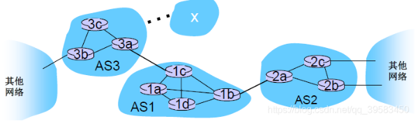

以路由器 1d 为例，看一下它的转发表如何配置。假设 AS1 通过 AS 间路由协议学习到：子网 x xx 可以通过 AS3（网关 1c）到达，但不能通过 AS2 到达，AS1 则向它的所有路由器传播这个信息。当路由器 1d 知道从 AS3 并因此从网关 1c 可达子网 x xx 时，根据 AS1 内部路由选择协议提供的信息，确定其到达 1c 的最小费用路径接口 I II，并将表项 ( x , I ) (x,I)(x,I) 放入其转发表中。

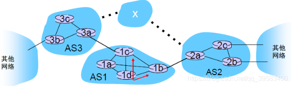

接着上面的例子，假设 AS1 通过 AS 间路由协议学习到：子网 x xx 通过 AS3 和 AS2 均可到达，AS1 将向它的所有路由器传播该信息。为了配置转发表，路由器 1d 必须确定通过哪个网关路由器来转发目的地址为 x xx 的数据分组，这个任务也是由 AS 间路由选择协议来完成。在实践中经常使用的一种方法是热土豆路由：将分组发送给最近的网关路由器。下图总结了路由器 1d 对转发表增加用于 x xx 的表项所采取的动作。

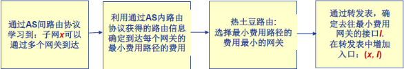

### 4.6 因特网中的路由选择

- **AS内部路由选择协议，又称内部网关协议**
-  **路由选择信息协议RIP，通常设置在下层ISP中**
-  **开放最短优先OSPF，通常设置在上层ISP中**

#### 4.6.1 AS(自治系统)内部的路由选择：RIP（DV思想）

**好消息传的快，坏消息传的慢**

​    AS内部路由选择协议又成为**网关协议**
   是一种**距离向量协议**，使用**跳数作为其费用测度**
​    **跳**：沿着源路由器到目的子网（包括）的最短路径**经过的子网数量**
​    一条路径的**最大费用限制为15**，因此RIP使用限制在网络直径不超过15跳的自治系统内
**路由选择更新信息在邻居之间**通过使用**RIP响应报文**（RIP通告）来交换，大约每30s交换一次
​    一台路由器或主机发出的响应报文包含了该AS内多达25个目的子网的列表，以及发送方到每个子网的距离
​    每台路由器维护一张称为路由选择表的RIP表，包括该路由器的距离向量和转发表（目的子网，下一台路由器，到目的地跳数）
​    路由器收到通告后，将通告与路由选择表合并，记下更短路径（DV算法还在收敛，或者新的链路加入AS）
​    **一台路由器超过180s没有从邻居听到报文，该邻居要么死了，要么链路中断** 
​        **RIP可以修改本地路由选择表，向活着的邻居发送RIP通告**
​        也可以使用RIP请求报文请求邻居到目的地的费用
RIP被当做一个应用进程来实现，能在一个标准socket上发送个接收报文，并且使用一个标准的运输层协议
​    路由器在UDP上用端口520相互发送RIP请求/响应报文。意思是RIP使用一个运输层协议实现网络层功能

#### 4.6.2 AS内部的路由选择：OSPF（LS思想）

OSPF和其兄弟IS-IS通常设置在上层ISP中，RIP在下层ISP和企业网中
OSPF核心：**使用洪泛链路状态信息的LS协议 + Dijkstra最低费用路径算法。各条链路费用（权值）是管理员配置的**
使用OSPF，**一台路由器构建了整个AS的拓扑图，然后在本地运行Dijkstra算法**
使用OSPF，路由器向AS内所有其他路由器广播路由选择信息。即使链路未发生变化，也要周期性广播链路状态（at least 30 minutes at a time）

**OSPF报文由IP直接承载**
**优点：**
    **安全：**能够鉴别OSPF路由器之间的交换，仅有受信任的路由器能参与AS内的OSPF协议。包括使用MD5加密
    **多条相同费用路径：**无需仅选择单一路径承载所有流量
    **支持单播多播路由选择**
    **支持在单个路由选择域内的层次结构**：具有按层次结构构造一个自治系统的能力
一个OSPF AS可以配置成多个区域，每个区域运行自己的OSPF LS算法，一个区域内每台路由器可以向该区域其他路由器广播链路状态
    一个区域内，一台或多台区域边界路由器负责为流向该区域以外的分组提供路由选择
    AS内只有一个OSPF区域配置成主干区域，为其他区域之间的流量提供路由选择。该主干包含AS内所有区域边界路由器，也可能包含一些非边界路由器
    某区域内分组—》区域边界路由器—》主干—》目的区域边界路由器—》目的地

#### 4.6.3 AS间的路由选择：BGP

​    BGP：**边界网关协议**，跨越多个AS的源和目的对之间确定路径，现在用的BGP4
​    BGP为AS提供：
​        从相邻AS获得子网可达性信息
​        向本AS内部所有路由器传播这些可达性信息
​        基于可达性信息和AS策略，决定到达子网的路由
​    BGP使得每个子网向因特网其余部分通告它的存在：一个子网高声宣布『在这！』，并且确保因特网中所有AS知道该子网以及如何到达

**BGP基础**
是因特网中至关重要的协议，正是BGP将一切『粘合』起来
BGP中，路由器通过使用179端口的半永久TCP连接来交换路由信息
    跨越两个 AS的TCP连接称为**外部BGP会话eBGP**，AS内部每对路由器之间的TCP连接成为**内部BGP会话iBGP**
    iBGP并不总与物理链路对应
    位于连接两端的两台路由器成为BGP对等方

你开了公司，与ISP签订协议，获得了一个IP地址范围（子网），每台路由器是通过BGP知道你公司地址的前缀进行转发的，这样别人才能成功将分组发到公司
BGP使每个AS知道经过其相邻AS**可到达哪些目的地子网，目的地是CDIR化的前缀，子网或子网的集合**
BGP中，一个AS由其全局唯一的AS号ASN标识，which is allocated by ICANN
当一台路由器通过BGP会话通告一个前缀时，它在前缀中包括一些属性。带属性的前缀称为一条路由，BGP对等方彼此通告路由
    **AS-PATH**：该属性包含了前缀通告已经通过的AS，当一个前缀传送到一个AS时，AS将其ASN增加到AS-PATH中
        路由器使用AS-PATH属性检测和**防止循环通告**
        路由器使用AS-PATH在多条路径中选择相同的前缀
    NEXT-HOP：是一个开始某AS-PATH的路由器接口
        路由器使用该属性正确地配置它们的转发表
        使用NEXT-HOP值和AS内部路由选择算法，路由器能确定到每条对等链路的路径的费用，用热土豆路由选择决定适当的接口
**BGP路由选择**
    BGP使用eBGP和iBGP向在AS中的所有路由器发布路由，路由器可能知道到达任何一条前缀的多条路由。消除规则**从上到下**：

- 选择具有最高本地偏好值（管理员决定）的路由
- 选择具有最短AS-PATH的路由
- 最靠近NEXT-HOP路由器的路由，最靠近指最低费用路径最低，由AS内部算法决定（hot potato routing）
- 使用BGP标识符选择路由

**路由**选择策略**
    反应ISP之间商业关系**

### 4.7 广播和多播路由选择

------

在**广播路由选择**（必须同一网段)中，网络提供了一种源节点到网络中事务所有其它结点的交付分组的服务；**多播路由选择**使单个源节点能够向其他网络结点的一个子集发送分组的副本。（不必同一网段).

------

#### 4.7.1 广播路由选择算法

------

在**广播路由选择**（必须同一网段)中，网络提供了一种源节点到网络中事务所有其它结点的交付分组的服务；**多播路由选择**使单个源节点能够向其他网络结点的一个子集发送分组的副本。（不必同一网段).

------

​    **1.N次单播**

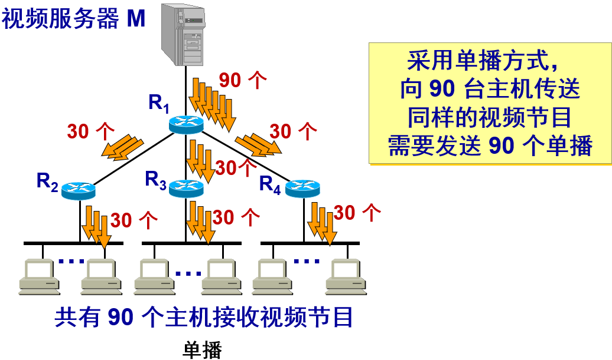        给定N个目的节点，源结点产生该分组的N份副本，对不同目的地每个副本编址，用单播路由选择传送
        效率低，多份独立的副本会重复经过某段链路，让网络结点本身生成分组副本更有效

N次单播的一个假设是广播的接收方及其地址为发送方所知晓。但是怎样得到这些消息呢？最可能的是，可能还需要别的机制。浙江增加更多的开销。

**2.无控制洪泛**
    源节点向所有邻居发送分组副本，结点复制该分组并向它邻居转发
    图中有环，会无休止循环
    当一个结点与两个以上结点连接时，它将生成并转发广播分组的多个副本，副本中的每个又产生多个副本，产生**广播风暴**，使网络变得毫无用处
**3.受控洪泛**
    序号控制洪泛：源节点将其地址或其他唯一标识和广播序号放入广播分组，每个结点维护它已经收到的、复制的和转发的源地址和序号列表。当结点接受到一个广播分组时，它首先检查该分组是否在列表中。如果在，丢弃该分组；如果不在，复制该分组并向该结点的所有邻居转发。
   反向路径转发RPF：仅当分组到达的链路正好位于它自己返回源的最短单薄路径上，才传输报文，否则丢弃。RPF仅需要知道在它到发送方的单薄路径上的下一个邻居；它仅用这个邻居的身份以决定是否洪泛一个接收到的广播分组。
**4.生成树广播**

虽然序号控制洪泛和RPF避免了广播风暴，但它们不能完全避免冗余广播分组的传输。
构造最小生成树；结点只需知道哪些邻居在生成树中
分布式生成树算法
    **基于中心的方法**：建立一棵生成树时，定义一个中心结点（汇合点、核），结点向中心结点单薄加入树的报文。加入树的报文使用单播路由选择朝着中心结点进发，直到它到达一个生成树中，经过的路径再嫁接到现有生成树中。

 **在实践中，广播协议被用于应用层和网络层**

#### 4.7.2 多播

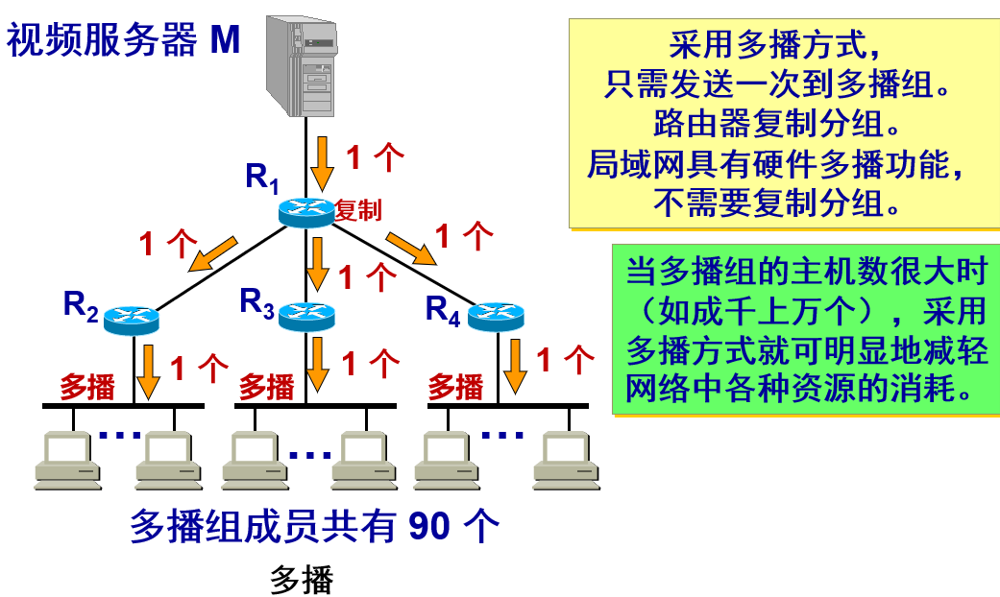

​    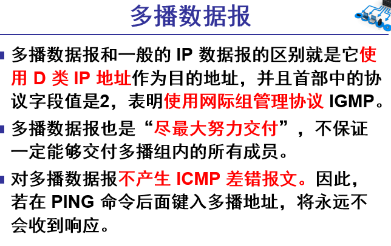

只有一部分路由器（那些具有加入该多播组的相连主机的路由器）实际需要接收多播流量。

一些新兴应用要求将分组从一个或多个发送方交付给一组接收方，比如各种直播、游戏
多播数据报使用间接地址来编址。每个分组难道携带所有接收方IP地址？这不科学
    用一个标识表示一组接收方（D类多播地址），接收方小组称为**多播组**

**在局域网上进行硬件多播**

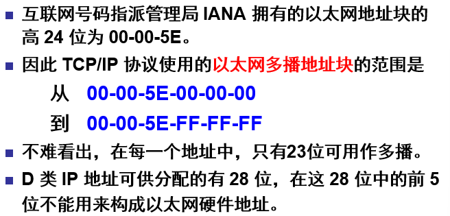

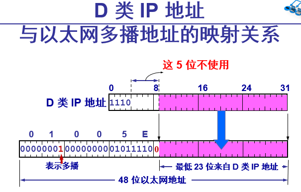

**因特网组管理协议IGMP**

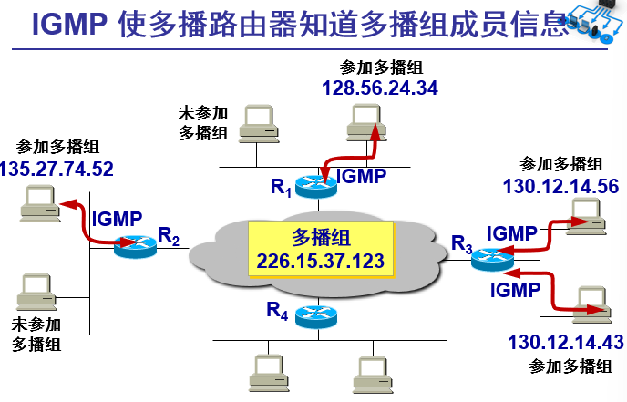    IGMP + 多播路由选择协议 组成网络层多播
**确定多播路由选择：**

**使用一棵组共享树的多播路由选择（共享的）**：通过组共享树进行多播路由选择的基础是构建一棵树。

**使用一棵基于源的树的多播路由选择**：而第二种方法为多播组中的每个源构建一棵多播路由选择树。

解决应用RPF时会收到不想要的多播分组这个问题成为**剪枝**。一台接收到该多播分组的多播路由器，如它无加入改组的相连主机，则它向其上游路由器发送一个剪枝报文，则它就能向上游转发一个剪枝报文。

