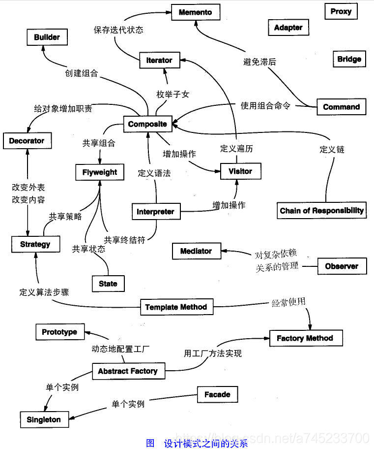
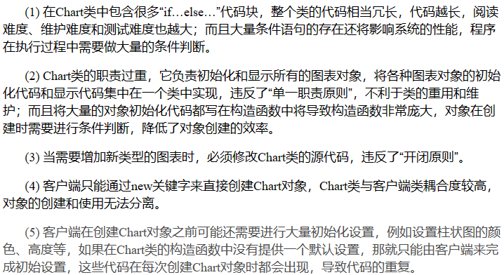
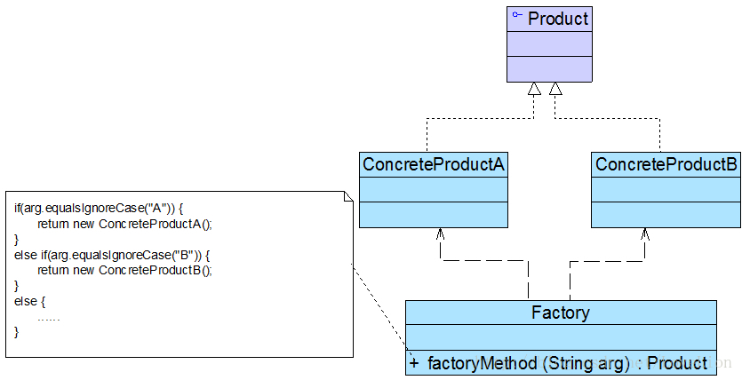

#                                                            设计模式

​                                                                                                                                                             **------手中无模式，心中有模式！！！！！**

## 1.设计模式综述

设计模式是一套经过反复使用的代码设计经验，目的是**为了重用代码**、让代码更容易被他人理解、保证代码可靠性。 设计模式于己于人于系统都是多赢的，它使得代码编写真正工程化，它是软件工程的基石，如同大厦的一块块砖石一样。项目中合理的运用设计模式可以完美的解决很多问题，每种模式在现实中都有相应的原理来与之对应，每种模式描述了一个在我们周围不断重复发生的问题，以及该问题的核心解决方案，这也是它能被广泛应用的原因。总体来说，设计模式分为三大类：

- **创建型模式**：工厂方法模式、抽象工厂模式、单例模式、建造者模式、原型模式
- **结构型模式**：适配器模式、装饰器模式、代理模式、桥接模式、外观模式、组合模式、享元模式
- **行为型模式**：策略模式、模板方法模式、观察者模式、责任链模式、访问者模式、中介者模式、迭代器模式、命令模式、状态模式、备忘录模式、解释器模式
- 让你知道：**如何将代码分散在几个不同的类中？        为什么要有“接口”？           何谓针对抽象编程？        何时不应该使用继承？                                  如果不修改源代码增加新功能？                同时还让你能够更好地阅读和理解现有类库（如JDK）与其他系统中的源代码，**让你早点脱离面向对象编程的“菜鸟期




## 2.设计模式的六大原则：

**（1）开闭原则 ：**开闭原则指的是对扩展开放，对修改关闭。在对程序进行扩展的时候，不能去修改原有的代码，想要达到这样的效果，我们就需要使用**接口或者抽象类**

**（2）依赖倒转原则 ：**依赖倒置原则是开闭原则的基础，指的是针对接口编程，依赖于抽象而不依赖于具体

**（3）里氏替换原则：**里氏替换原则是**继承与复用**的基石，只有当子类可以替换掉基类，且系统的功能不受影响时，基类才能被复用，而子类也能够在基础类上增加新的行为。所以里氏替换原则指的是任何基类可以出现的地方，子类一定可以出现。里氏替换原则是对 “开闭原则” 的补充，实现 “开闭原则” 的关键步骤就是抽象化，而基类与子类的继承关系就是抽象化的具体实现，所以里氏替换原则是对实现抽象化的具体步骤的规范。

**（4）接口隔离原则 ：**使用多个隔离的接口，比使用单个接口要好，降低接口之间的耦合度与依赖，方便升级和维护方便

**（5）迪米特原则 ：**迪米特原则，也叫最少知道原则，指的是**一个类应当尽量减少与其他实体进行相互作用**，使得系统功能模块相对独立，**降低耦合关系**。该原则的初衷是降低类的耦合，虽然可以避免与非直接的类通信，但是要通信，就必然会通过一个“中介”来发生关系，过分的使用迪米特原则，会产生大量的中介和传递类，导致系统复杂度变大，所以采用迪米特法则时要反复权衡，既要做到结构清晰，又要高内聚低耦合。

**（6）合成复用原则：**尽量使用组合/聚合的方式，而不是使用继承。    


## 3.基于Java的23种设计模式

### A.创建型模式（6）

#### 简单工厂模式

**1.图表库的设计**

```java
class Chart {
	private String type; //图表类型
	
	public Chart(Object[][] data, String type) {
		this.type = type;
		if (type.equalsIgnoreCase("histogram")) {
			//初始化柱状图
		}
		else if (type.equalsIgnoreCase("pie")) {
			//初始化饼状图
		}
		else if (type.equalsIgnoreCase("line")) {
			//初始化折线图
		}
	}
 
	public void display() {
		if (this.type.equalsIgnoreCase("histogram")) {
			//显示柱状图
		}
		else if (this.type.equalsIgnoreCase("pie")) {
			//显示饼状图
		}
		else if (this.type.equalsIgnoreCase("line")) {
			//显示折线图
		}	
	}
}
```

上述图表存在的一些问题：


2.**定义：定义一个工厂类，它可以根据参数的不同返回不同类的实例，被创建的实例通常都具有共同的父类。**
   简单工厂模式的要点在于：**当你需要什么，只需要传入一个正确的参数，就可以获取你所需要的对象，而无须知道其创建细节。**简单工厂模式结构比较简单，其核心是工厂类的设计



 在简单工厂模式中，客户端通过工厂类来创建一个产品类的实例，而无须直接使用new关键字来创建对象，它是工厂模式家族中最简单的一员。在使用简单工厂模式时，**首先需要对产品类进行重构**，**不能设计一个包罗万象的产品类**，而需根据实际情况设计一个产品层次结构，将所有产品类公共的代码移至抽象产品类，并在抽象产品类中声明一些抽象方法，以供不同的具体产品类来实现，典型的抽象产品类代码如下所示：

```java
abstract class Product {
    //所有产品类的公共业务方法
    public void methodSame() {
        //公共方法的实现
    }
 
    //声明抽象业务方法
    public abstract void methodDiff();
}
//在具体产品类中实现了抽象产品类中声明的抽象业务方法，不同的具体产品类可以提供不同的实现，典型的具体产品类代码如下所示：
class ConcreteProduct extends Product {
    //实现业务方法
    public void methodDiff() {
        //业务方法的实现
    }
}
//简单工厂模式的核心是工厂类，在没有工厂类之前，客户端一般会使用new关键字来直接创建产品对象，而在引入工厂类之后，客户端可以通过工厂类来创建产品，在简单工厂模式中，工厂类提供了一个静态工厂方法供客户端使用，根据所传入的参数不同可以创建不同的产品对象，典型的工厂类代码如下所示：

class Factory {
    //静态工厂方法
	public static Product getProduct(String arg) {
		Product product = null;
		if (arg.equalsIgnoreCase("A")) {
			product = new ConcreteProductA();
            //初始化设置product
		}
		else if (arg.equalsIgnoreCase("B")) {
			product = new ConcreteProductB();
            //初始化设置product
		}
		return product;
	}
}
       //在客户端代码中，我们通过调用工厂类的工厂方法即可得到产品对象，典型代码如下所示：

class Client {
	public static void main(String args[]) {
		Product product; 
		product = Factory.getProduct("A"); //通过工厂类创建产品对象
		product.methodSame();
		product.methodDiff();
	}
}
```

3.解决方案


```java
//Chart接口充当抽象产品类，其子类HistogramChart、PieChart和LineChart充当具体产品类，ChartFactory充当工厂类。
//抽象图表接口：抽象产品类
interface Chart {
	public void display();
}
 
//柱状图类：具体产品类
class HistogramChart implements Chart {
	public HistogramChart() {
		System.out.println("创建柱状图！");
	}
	
	public void display() {
		System.out.println("显示柱状图！");
	}
}
 
//饼状图类：具体产品类
class PieChart implements Chart {
	public PieChart() {
		System.out.println("创建饼状图！");
	}
	
	public void display() {
		System.out.println("显示饼状图！");
	}
}
 
//折线图类：具体产品类
class LineChart implements Chart {
	public LineChart() {
		System.out.println("创建折线图！");
	}
	
	public void display() {
		System.out.println("显示折线图！");
	}
}
 
//图表工厂类：工厂类
class ChartFactory {
    //静态工厂方法
	public static Chart getChart(String type) {
		Chart chart = null;
		if (type.equalsIgnoreCase("histogram")) {
			chart = new HistogramChart();
			System.out.println("初始化设置柱状图！");
		}
		else if (type.equalsIgnoreCase("pie")) {
			chart = new PieChart();
			System.out.println("初始化设置饼状图！");
		}
		else if (type.equalsIgnoreCase("line")) {
			chart = new LineChart();
			System.out.println("初始化设置折线图！");			
		}
		return chart;
	}
}
```


#### 工厂方法模式


#### 抽象工厂模式


#### 单例模式


#### 建造者模式


#### 原型模式


### B.结构型模式（7）

#### 适配器模式


#### 装饰器模式


#### 代理模式


#### 桥接模式


#### 外观模式


#### 组合模式


#### 享元模式


### C.行为型模式（11）

#### 策略模式


#### 模板方法模式


#### 观察者模式


#### 责任链模式


#### 访问者模式


#### 中介者模式


#### 迭代器模式


#### 命令模式


#### 状态模式


#### 备忘录模式


#### 解释器模式

