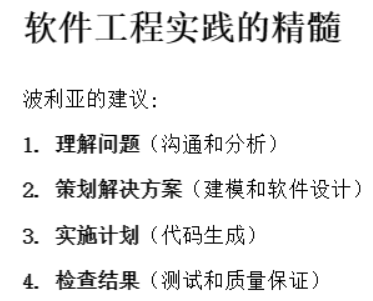
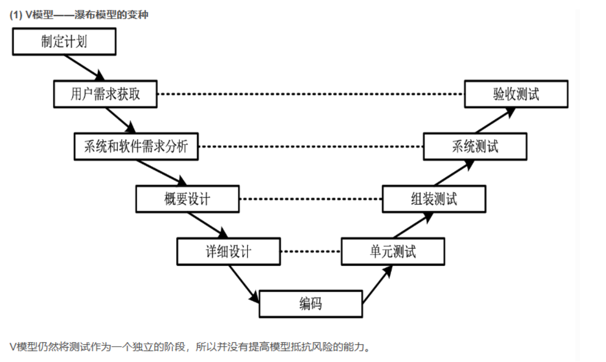

#                    **软件工程基础**

## 一.**软件工程概述**

### **1.定义**

  软件是计算机系统中与硬件相互依存的另一部分，它是包括程序，数据及其相关文档的完整集合。

### **2.软硬件失效**

### **3.软件危机**

软件危机（Software Crisis）：指由于落后的软件生产方式无法满足迅速增长的计算机软件需求，从而导致软件开发与维护过程中出现一系列严重问题的现象。
(1) 软件开发计划难以制订。
(2) 软件开发费用和进度失控。
(3) 软件产品无法让用户满意。
(4) 软件产品的质量难以保证。
(5) 软件通常没有适当的文档资料。
(6) 软件通常是不可维护的。
(7) 软件成本在计算机系统总成本中所占比例逐年上升。

### **4.软件工程三要素**  

###                                                  方法、工具、过程

### **5.软件工程目标**

  在给定成本、进度的前提下，开发出满足用户需求且具有 可修改性、有效性、可靠性、可理解性、可维护性、可重用性、可适应性、可移植性、可追踪性和可互操作性 的软件产品。

### **6.软件工程研究内容**

- 软件开发技术
  软件开发方法学、开发过程模型、开发工具和软件工程环境。
- 软件工程管理
  软件管理学、软件工程经济学、软件心理学等。

### **7.软件工程知识体系**

### 

### 8.**过程框架活动**

​      **沟通，策划，建模（需求分析+设计），构建（代码生成+测试），部署**

### **9.普适性活动**

### **10.杂谈**

**11.软件工程的人员方面**

## 二.软件的生命周期模型

### **2.1软件工程过程**（PDC A循环）

·P (Plan) : 软件规格说明（Specification）。规定软件的功能及其使用的限制；
·D (Do) : 软件开发。产生满足规格说明的软件；
·C (Check) : 软件确认。通过有效性验证以保证软件能够满足客户的要求；
·A (Action) : 软件演进。为满足客户的变更要求，软件必须在使用的过程中不断地改进。

事实上，软件工程过程是一个软件开发机构针对某一类软件产品为自己规定的工作步骤，它应当是科学的、合理的，否则必将影响到软件产品的质量。

### **2.2软件生命周期**

软件生命周期(software life cycle )是指软件产品从考虑其概念开始，到该软件产品不再使用为止的整个时期，一般包括概念阶段、分析与设计阶段、构造阶段、移交阶段等不同时期。

在整个软件生命周期中贯穿了软件工程过程的六个基本活动:

- **制定计划 P**
- **需求分析 D**
- **设计 D**
- **程序编码 D**
- **测试 C**
- **运行维护 A**

① 制定计划: 确定要开发软件系统的总目标，给出它的功能、性能、可靠性以及接口等方面的要求；研究完成该项软件任务的可行性，探讨解决问题的可能方案；制定完成开发任务的实施计划，连同可行性研究报告，提交管理部门审查。
② 需求分析和定义:对待开发软件提出的需求进行分析并给出详细的定义。编写出软件需求说明书及初步的用户手册，提交管理机构评审。
③ 软件设计:设计是软件工程的技术核心。把已确定了的各项需求转换成一个相应的体系结构。进而对每个模块要完成的工作进行具体的描述。编写设计说明书，提交评审。
④ 程序编写:把软件设计转换成计算机可以接受的程序代码。
⑤ 软件测试:在设计测试用例的基础上检验软件的各个组成部分。
⑥ 运行／维护:已交付的软件投入正式使用，并在运行过程中进行适当的维护。

### **2.3过程模型**

软件过程模型有时也称软件生命周期模型，即描述从软件需求定义直至软件经使用后废弃为止，跨越整个生存期的软件开发、运行和维护所实施的全部过程、活动和任务的结构框架，同时描述生命周期不同阶段产生的软件工件，明确活动的执行角色等。

**九个传统软件生命周期模型：**

- **.瀑布模型 .螺旋模型**
- **.V模型和W模型 .喷泉模型**
- **.原型方法 .构件组装模型**
- **.演化模型 .快速应用开发模型**
- **.增量模型**

#### 2.3.1瀑布模型

**优点：**
⑴ 软件生命周期的阶段划分不仅降低了软件开发的复杂程度，而且提高了软件开发过程的透明性，便于将软件工程过程和软件管理过程有机地融合在一起，从而提高软件开发过程的可管理性。
⑵ 推迟了软件实现，强调在软件实现前必须进行分析和设计工作。
⑶ 瀑布模型以项目的阶段评审和文档控制为手段有效地对整个开发过程进行指导，保证了阶段之间的正确衔接，能够及时发现并纠正开发过程中存在的缺陷，从而能够使产品达到预期的质量要求。

**缺点：**
⑴ 模型缺乏灵活性，特别是无法解决软件需求不明确或不准确的问题，这是瀑布模型最突出的缺点。因此，瀑布模型**只适合于需求明确的软件项目**。
⑵ 模型的风险控制能力较弱。成品时间长；体系结构的风险和错误只有在测试阶段才能发现，返工导致项目延期。
⑶软件活动是文档驱动的，文档过多会增加工作量，文档完成情况会误导管理人员。

#### 2.3.2. V模型和W模型

!

#### 2.3.3原型方法

**1.提出原因**
完整准确的需求规格说明很难得到
通过加强评审和确认、全面测试也不能从根本上解决需求不稳定带来的问题。

**2.概述**
原型：是指模拟某种产品的原始模型。软件原型是一个早期可以运行的版本，它反映最终系统的部分重要特性。

**原型方法构造软件系统 ：**

- 获得一组基本的需求说明，快速分析构造出一个小型的软件系统，满足用户的基本要求；

- 用户试用原型系统，对其进行反应和评价；
- 开发者根据用户意见对原型进行改进，获得新的原型版本；
- 周而复始，直到产品满足用户的要求。

**原型化方法是在研究需求分析技术的过程中产生的，但也可以用于软件开发的其他阶段**

**3.原型的种类（目的）**
探索型：弄清对目标系统的要求
实验型：系统实现前考察系统的可行性
进化型：将原型扩展到开发过程，通过原型开发逐步实现所有系统功能。

**4.原型的使用策略**
废弃策略：探索型和实验型
追加策略：进化型
原型不同于最终的系统，需要快速实现和运行，因此，原型可以忽略一切暂时不必关心的部分（抽象）

**5.优点**

- 有助于增进软件人员和用户对系统服务需求的理解
- 提供了一种有力的学习手段
- 容易确定系统的性能、服务的可应用性、设计的可行性和产品的结果
- 原型的最终版本可作为最终产品或最终系统的一部分

**6.缺点**

- 文档容易被忽略
- 建立原型的许多工作会被浪费掉
- 项目难以规划和管理

**8. 原型方法支持的软件生命周期**
**原型方法可以支持软件生命周期的不同阶段：**
辅助或代替分析阶段 (确定需求)
辅助设计阶段 (确定设计方案的合理性)
代替分析与设计阶段
代替分析、设计和实现阶段
代替全部开发阶段 (典型的演化模型 )

#### 2.3.4演化模型

**演化模型主要针对需求不是很明确的软件项目**

**演化模型缺点：**

- 可能会抛弃瀑布模型的文档控制优点，开发过程**不透明**
- 探索式演化模型可能会导致最后的软件系统的系统结构较差
- 可能会用到一些不符合主流、不符合要求或者不成熟的工具和技术

#### 2.3.5增量模型

**1. 增量模型优点**

- 增强了客户使用系统的信心，逐步提出对后续增量的需求
- 项目总体失败的**风险较低**
- 增量从高到低的优先级确定保障了系统重要功能部分的可靠性
- 同一个体系结构提高了系统的稳定性和可维护性

**2. 增量模型缺点**

- 增量的粒度选择问题
- 确定所有的基本业务服务比较困难

#### 2.3.6螺旋模型

**针对大型软件项目的特点提出。**

- 对于复杂的大型软件而言，事先**不能完整清晰地定义需求**是常事，而且设计方案、技术实现方案不允许出现问题，也需要经过多次试验才能明确下来，开发一个只明确需求的原型是远远不能解决问题的，需要开发内容逐步丰富的多个原型。
- 大型软件项目往往**存在着诸多风险因素**，**螺旋模型将瀑布模型与演化模型结合起来**，并加入了两种模型均忽略了的**风险分析**。因为大型项目的规模和复杂性增加，软件开发过程中必然存在着许多风险问题，风险分析是保证项目成功的必要手段。
  

**螺旋模型沿着螺线旋转，在四个象限上分别表达了四个方面的活动，即：**

- 制定计划──确定软件目标，选定实施方案，弄清项目开发的限制条件
- 风险分析──分析所选方案，考虑如何识别和消除风险
- 实施工程──实施软件开发
- 客户评估──评价开发工作，提出修正建议

螺旋模型适合于大型软件的开发;然而**风险分析需要相当丰富的评估经验**，风险的规避又需要深厚的专业知识，这给螺旋模型的应用增加了难度。

#### 2.3.7喷泉模型（迭代模型）

喷泉模型认为软件开发过程具有两个**固有的本质特征**：
迭代：多次重复、演进。
无间隙：各阶段间无明显的界限。支持分析和设计结果的自然复用。

适用：面向对象的软件开发过程。对象概念的引入，对象及对象关系在分析、设计和实现阶段的表达方式的统一，使得开发活动之间的迭代和无间隙性能够容易地实现。

#### **2.3.8构建组装模型**

构件组装模型本质上是演化的，开发过程是迭代的。
**构建组装模型由五个阶段组成：**

- 需求定义和分析
- 软件体系结构设计
- 构件开发
- 应用软件构造
- 测试和发布

**软件的开发过程步骤如下：**

- 定义和分析需求；
- 标识本项目需要什么构件；
- 从库中查找构件或相似的构件；
- 如果可用转(5)，否则自行开发或修改，确认后入库；
- 构造为新系统作第m次迭代；
- 测试、确认。

#### 2.3.9. 快速应用开发(RAD)模型

快速应用开发(Rapid Application Development，RAD)是一个增量型的软件开发过程模型，采用**构件组装方法**进行快速开发。

**RAD模型包含如下阶段：**
(1)**业务建模**：通过捕获业务过程中信息流的流动及处理情况描述业务处理系统应该完成的功能。回答***以什么信息驱动业务过程运作? 要生成什么信息? 谁生成它? 信息流的去向? 由谁处理?*** 可以辅之以**数据流图**。
(2)**数据建模**：对于支持业务过程的数据流，建立数据对象集合,定义数据对象属性,与其它数据对象的关系构成数据模型，可**辅之以E-R图**。
(3)**过程建模**：定义如何使数据对象在信息流中完成各**业务功能**。描述数据对象的**增加、修改、删除、查找**。即细化数据流图中的处理框。
(4)**应用生成**：利用第四代语言(4 G L)写出处理程序，重用已有构件或创建新的可重用构件，利用环境提供的工具，自动生成，构造出整个的应用系统。
(5)**测试及迭代**：由于大量重用，一般只作总体测试，但新创建的构件还是要测试的。当一轮需求完成快速开发后，可以迭代进入下一轮需求的开发。

### 2.4新型软件生命周期模型

#### 2.4.1统一软件开发过程

**RU P（Rational Unified Process）是一个面向对象的基于web的程序开发方法论。**
**RU P既是一种软件生命周期模型，又是一种支持面向对象软件开发的工具**，它将软件开发过程要素和软件工件要素整合在统一的框架中。

**(1) RU P的基本结构**
RU P是一个二维的软件开发模型。
横轴在时间上将生命周期过程展开成**四个阶段（Phase）**，每个阶段特有的**里程碑**（Milestone）是该阶段结束的标志，每个阶段里又划分为不同的**迭代**（Iteration），体现了软件开发过程的动态结构。

纵轴按照活动的内容进行组织，包括**活动（activity）、活动产出的工件（artifact）、活动的执行角色（worker）以及活动执行的工作流（workflow）**，体现软件开发过程的**静态**结构。

**1 - 初始阶段**

阶段目标：通过**业务用例（Business Use Case）了解业务并确定项目的边界，包括项目的验收规范、风险评估、所需资源估计、阶段计划**等。

要确定项目边界，需识别所有与系统交互的外部实体，主要包括识别**外部角色（actor）**、识别所有用例并详细描述一些重要的用例。

Milestone：软件目标里程碑。包括一些重要的**文档**，如**项目愿景（vision）**、**原始用例模型**、原始业务**风险**评估、一个或者多个**原型**、**原始业务场景等**。

需要对这些文档进行**评审**，以确定正确理解用例需求、项目风险评估合理、阶段计划可行等。

**2 - 细化阶段**

阶段目标：分析问题领域，建立适合需求的软件体系结构基础，**编制项目计划**，完成项目中技术**要求高、风险大**的关键需求的开发。

Milestone：体系结构里程碑。包括**风险分析文档、软件体系结构基线(baseline)、项目计划、可执行的进化原型、初始版本的用户手册等**。

通过评审确定软件体系结构的稳定性、确认高风险的业务需求和技术机制已经解决、修订的项目计划可行等。

**3 - 构造阶段**

阶段目标：将所有剩余的技术构件和稳定业务需求功能开发出来，并集成为产品，所有功能被详细测试。从某种意义上说，构造阶段只是一个制造过程，其重点放在管理资源及控制开发过程以**优化成本、进度和质量**。

Milestone：运行能力里程碑。包括可以运行的**软件产品、用户手册**等，它决定了产品是否可以在测试环境中进行部署。

要确定软件、环境、用户是否可以开始系统的**运行**。

**4 - 移交阶段**

阶段目标：软件产品**正常运行并交付用户使用**。交付阶段可以跨越几次迭代，包括为发布做准备的产品**测试**，基于用户反馈的少量调整。

Milestone：产品发布里程碑。包括维**护和售后支持文档手册**等。

要确定最终目标是否实现，是否应该开始产品下一个版本的另一个开发周期。

**(2) RU P的迭代增量开发思想**
**RU P是以用例为驱动，软件体系结构为核心**，应用迭代及增量的新型软件生命周期模型

RU P的每一个阶段可以进一步划分为一个或**多个迭代过程**，从一个迭代过程到另一个迭代过程增量形成最终的系统。
RU P是融合了**喷泉模型和增量模型**的一种综合生命周期模型 。

RU P将整个项目的开发目标划分成一些更易于完成和达到的**阶段性小目标**。每一次迭代就是为了完成一定阶段性小目标而从事的一系列开发活动，包含需求、设计、实施（编码）、部署、测试等。

**(3) RU P的核心工作流**
**6个核心过程工作流(Core Process Work flows)**

- 商业建模（Business Modeling）
- 需求（Requirements）
- 分析和设计（Analysis & Design）
- 实现（Implementation）
- 测试（Test）
- 部署（Deployment）

**3个核心支持工作流(Core Supporting Work flows)**

- 配置和变更管理（Configuration & Change Management）
- 项目管理（Project Management）
- 环境（Environment）

**(4) RU P的最佳实践Best Practice**

- 短时间分区式的迭代
- 适应性开发
- 在早期迭代中解决高技术风险和高业务价值的问题
- 不断地让用户参与迭代结果的评估
- 在早期迭代中建立内聚的核心架构
- 不断地验证质量；尽早、经常和实际地测试
- 使用用例驱动软件建模
- 可视化软件建模：使用UM L进行软件建模
- 仔细地管理需求
- 实行变更请求和配置管理

#### 2.4.2敏捷开发

一种传统软件工程项目的合理的替代品

简述：敏捷软件工程可以快速提供成功的系统（重要特性：**适应需求变更**）

强调：

- 注重”客户的满意度“和”尽早提交可增量的软件产品“（增量交付，开发过程存在迭代）
- 快速交付，不看重中间产品
- 小型，积极的项目团队，协调能力强，看中团队结构，协作态度
- 可用非正式的方法（e.g. 数据库设计没有写完整的设计文档，中间建模尽量简单）
- 最小的work product（开发过程简单，会要求尽量减少work product且work product简单，不完全按照template）
- 整体发展简单（e.g. 封闭开发）
- 软件工程师和其他项目利益相关者（管理人员，客户，最终用户）在一个敏捷的团队，命运共同体，其中roles和responsibility随时调整

特点：

1. story / function： 通过需求调研得到项目的一些功能(story / functions)

2. priority：对story设置优先级

   在这之后，选择优先级高的stories进行第一次迭代，得到可演示产品；demo后进行第二次迭代，包括对上一次的stories进行修改，加入新的stories,......

3. 每次迭代完后均是可以演示运行的产品

基本框架活动 CPMCD (generic process,当然也可以遵循standard process)

**(1) 定义**

敏捷方法的主要特点就是具有**快速及灵活的响应变更的能力**

**敏捷原则：**

1. **Highest** 最高优先级：通过早期early和连续continuous交付有价值的软件来满足客户
2. **Change** 鼓励需求改动，哪怕是开发过程晚期（好的改动可以提升顾客的竞争优势）
3. **Frequently** 经常提供work product，最好有短的schedule
4. **Together** 甲方和开发者daily紧密合作
5. **Motivated** 和有动力的人开发，给他们好的环境和支持，信任他们
6. **F-to-F** 面对面讨论，实时解决问题，这是最高效率的
7. **WorkingSoftware** 进度的最好指标就是产出的可工作的软件
8. **Sustainable** 敏捷过程保持稳定的开发过程，赞助人，开发者和用户应该maintain a constant pace indefinitely (不定期同步跟踪）
9. **Excellence** 持续关注追求技术的改进和设计的优化
10. **Simplicity** 文档尽量简单
11. **Self-organizing** 一个self-organizing的team可以做出最好的架构、需求和设计
12. **Reflection** 定期进行回顾

敏捷开发是一种**以人为核心、迭代、循序渐进的开发方法**。在敏捷开发中，软件项目的构建被切分成多个子项目，各个子项目的成果都经过测试，具备集成和可运行的特征。换言之，就是把一个大项目分为多个相互联系，但也可独立运行的小项目，并分别完成，在此过程中软件一直处于可使用状态。

敏捷方法很多,包括极限编程(X P)、 Scrum、功能驱动开发(F DD)、水晶、净室开发等多种方法，这些方法本质实际上是一样的，都遵循“敏捷宣言”原则。

**(2) 极限编程 (extreme Programming )**

X P是一种轻量级的软件开发方法，是一种以实践为基础的软件工程过程和思想。
它使用快速的反馈，大量而迅速的交流，经过保证的测试来最大限度的满足用户的需求。
X P强调用户满意，开发人员可以对需求的变化作出快速的反应。

**X P的工作环境**
每个参加项目开发的人都将担任一个角色（项目经理、项目监督人等等）并履行相应的权利和义务。
用户也是项目组的一部分。
所有人都在同一个开放的开发环境中工作。

**X P的需求分析**

开发人员和客户一起，把各种需求变成一个个小的需求模块（User Story）；
这些模块又会根据实际情况被组合在一起或者被分解成更小的模块，且它们都被记录在一些小卡片（Story Card）上；
客户根据每个模块的商业价值来指定它们的优先级；
然后，开发人员确定每个需求模块的开发风险；
经过开发人员和客户的评估后，它们被安排在不同的开发周期里，客户将得到一个尽可能准确的开发计划；
客户为每个需求模块指定验收测试（功能测试）。

**X P的设计**
从开发的角度来看，X P内层的过程是一个基于Test Driven Development周期，每个开发周期都有很多相应的单元测试。
随着这些测试的进行，通过的单元测试也越来越多。通过这种方式，客户和开发人员都很容易检验，是否履行了对客户的承诺。

同时，X P还大力提倡设计复核（Review）、代码复核以及重整和优化（Refectory），所有的这些过程其实也是优化设计的过程；

**X P的编程**
X P提倡配对编程（Pair Programming），而且代码所有权是归于整个开发队伍（Collective Code Ownership）。
程序员在写程序和重整优化程序的时候，都要严格遵守编程规范。
任何人都可以修改其他人写的程序，修改后要确定新程序能通过单元测试。

**X P的测试**
X P提倡在开始写程序之前先写单元测试。

开发人员应该经常把开发好的模块整合到一起（Continuous Integration，持续集成），每次整合后都要运行单元测试；
做任何的代码复核和修改，都要运行单元测试；
发现了BUG，就要增加相应的测试。
除了单元测试之外，还有整合测试，功能测试、负荷测试和系统测试等。
所有这些测试，是X P开发过程中最重要的文档之一，也是最终交付给用户的内容之一。

**(3)看板法**

**（4）DE V O PS**

**（5）scrum框架**

## 

### **2.5推荐的过程模型**

**管理软件项目的原则**

- 在没有足够反馈的情况下，使用线性过程模型是有风险的
- 计划前期获取大量的需求既无可能也无必要
- 前期需求获取可能不会降低成本或防止超时
- 软件开发中需要适当的项目管理
- 文档与软件应该同步推进，而不应该拖延到构建开始时
- 应尽早并且频繁地让利益相关者参与到软件开发过程中
- 测试人员应在软件构建前就参与其中

该图显示了原型开发的增量模型。循环图中的组成部分是策划、需求、分析与设计、实现、测试和评价，然后进一步延续到规划。根据这个模型，最初的策划增加了初始策划，实现导致了部署。

**用于原型开发的螺旋模型**

**原型开发的体系结构设计**

**敏捷体系结构设计的要素**

1. 关注关键的质量属性，并在构建它们时将其合并到原型中
2. 请记住，成功的软件产品会将客户可见的功能和基础体系结构结合在一起
3. 如果对体系结构决策和相关质量问题给予足够的重视，那么敏捷体系结构就可以实现代码的可维护性和可扩展性
4. 持续管理并同步功能需求和体系结构需求间的依赖关系，以确保不断演化的体系结构基础能及时适应未来的增量

**敏捷螺旋模型的资源估算**

1. 团队应该使用历史数据来估算在项目开始时完成每个用户故事所需的天数
2. 将用户故事松散地组织到构成计划完成原型的每个冲刺集合中
3. 将完成每个冲刺的天数求和以估算整个项目的持续时间
4. 当项目的需求增加或原型交付并被利益相关者接受时修改估算

**首次原型构建**

1. 从纸质原型过渡到软件设计
2. 设计用户界面原型
3. 创建一个虚拟原型
4. 将输入和输出功能添加到原型
5. 实现算法
6. 测试原型
7. 考虑原型的部署

**原型评价**

1. 在要求原型反馈时提供框架素材
2. 选择适当的人测试你的原型
3. 提出合适的问题
4. 向用户提供备选方案时保持中立
5. 测试时进行调整
6. 欢迎用户提出自己的想法

**继续与否的决策**

1. 策划能否通过需遵循评价过程
2. 根据在评价当前软件原型时发现的问题，提出修订的成本估计和进度更改
3. 对超出预算和错过项目交付日期的风险进行评估
4. 不能满足用户期望的风险也会被考虑，并与利益相关者，有时还与高级管理层进行讨论
5. 风险评估过程的目标是获得所有利益相关者和公司管理层的承诺，以提供创建下一个原型所需的资源

该图显示了推荐软件过程模型。这个过程起点是：项目构思、需求工程、初步体系结构设计、估计所需项目资源和构建第一个原型。从评估原型开始，这个过程是一个循环模型。在评估原型后，进行继续与否的决策，项目可以在此后结束，也可以继续演化系统。在演化系统之后，它将重定义范围，并构建下一个原型。在评估原型之后，这个过程可以遵循以下步骤来达到演化系统：成为软件发布的原型，维护软件，然后演化系统。

**推荐的软件过程步骤**

1.需求工程

- 获取所有利益相关者的用户故事
- 让利益相关者给出用户故事的接受标准

2.初步体系结构设计

- 利用纸质原型和模型
- 评估使用非功能性需求的备选方案
- 记录体系结构设计决策

3.估计所需项目资源

- 使用历史数据估算完成每个用户故事的时间
- 将用户故事组织成冲刺
- 确定完成产品所需的冲刺数
- 在添加或删除用户故事时修改时间估计

4.构建第一个原型

- 选择对利益相关者最重要的用户故事子集
- 把创建纸质原型作为
- 设计过程的一部分设计具有输入和输出的用户界面原型
- 实现第一个原型所需的算法
- 考虑部署方案

5.评价原型

- 在设计原型时创建测试用例
- 使用适当的用户测试原型
- 获取利益相关者的反馈，以便在修订过程中使用

6.继续与否的决策

- 确定当前原型的质量
- 修改完成开发的时间和成本估计
- 确定不能满足利益相关者期望的风险
- 获得继续开发的承诺

7.演化系统

- 定义新原型范围
- 构建新原型
- 评估新原型，包括回归测试
- 评估与持续演化相关的风险

8.发布原型

- 进行验收测试
- 记录发现的缺陷
- 与管理层互通质量风险

9.维护软件

- 变更前理解代码
- 变更后测试软件
- 记录变更
- 告知利益相关者已知的缺陷和风险

**测试新原型**

- 测试应该由开发人员在编码完成前使用设计过程中创建的测试用例进行
- 每个用户故事在创建时都应该附加验收标准，这些验收声明应该指导测试用例的创建，以帮助验证原型是否满足客户的需求
- 测试原型中的缺陷以及性能问题
- 确保增加新特征不会意外地破坏在先前原型中正常工作的特征（回归测试）

**发布候选**

- 除了在原型构建期间进行的测试外，被视为发布候选的原型还必须接受
- 用户验收测试用户验收测试基于商定的验收标准，该标准在创建每个用户故事并将其添加到产品待定项时被记录下来
- 在验收测试期间，用户反馈应该按照用户界面描述的用户可见功能来组织
- 测试人员应该仅在这些更改不会延迟原型发布的情况下进行更改

**维护发布软件**

- 维护 - 在最终用户环境中接受和交付软件之后，保持软件运行所需的活动
- 改正性维护 - 在软件交付给最终用户后，对软件进行反应性修改，以修复发现的问题
- 适应性维护 - 软件交付后的反应性修改，以保证软件在不断变化的最终用户环境中可用
- 完善性维护 - 软件交付后的主动修改，以提供新的用户特征、更好的程序代码结构或改进的文档
- 预防性维护 – 软件交付后对其进行主动修改，以便在用户发现产品故障之前对其进行检测和纠正
- 在敏捷过程模型中，许多（但不是全部）的维护工作是预防性的，或者说是由于新功能的增加而需要进行完善的工作

### 2.6指导实践的原则

#### **指导过程的原则**、

- 原则 #1. 敏捷。关于你所选择的过程模型是传统的还是敏捷的，敏捷开发的基本原则会提供判断方法。
- 原则 #2. 每一步都关注质量。每个过程活动、动作及任务的出口条件都应关注所生产的工作产品的质量。
- 原则 #3. 做好适应的准备。软件开发中没有教条，让你的方法适应于由问题、人员和项目本身施加的限制。
- 原则 #4. 建立一个有效的团队。软件工程过程和实践很重要，但最根本的还是人，必须建立一个自组织团队。
- 原则 #5. 建立沟通与协调机制。项目失败是由于遗漏了重要信息，或是利益相关者未能尽力去创造一个成功的最终产品。
- 原则 #6. 管理变更。管理变更的方法可以是正式的或者非正式的，但是必须建立一种机制，来管理变更要求的提出、变更的评估、变更的批注和变更实施的方案。
- 原则 #7. 评估风险。在进行软件开发时会出现很多问题，建立应急计划是非常重要的。
- 原则 #8. 创造能给别人带来价值的工作产品。唯有那些能为其他过程活动、动作或任务提供价值的工作产品才值得创造。

#### **指导实践的原则**

- 原则 #1. 分治和攻克。分析和设计中应经常强调关注点分离（Separation of Concerns, SoC）。
- 原则 #2. 理解抽象的使用。抽象是对系统中一些复杂元素的简单化，用一个专业用语来交流信息。
- 原则 #3. 力求一致性。熟悉的上下文使软件易于使用。
- 原则 #4. 关注信息传送。必须特别注意界面的分析、设计、构建和测试。
- 原则 #5. 构建能展示有效模块化的软件。模块化提供了一种机制来实现关注点分离。
- 原则 #6. 寻找模式。模式的目标是创建大量资料来帮助开发者解决软件开发中经常遇到的问题。
- 原则 #7. 用大量观点。用大量不同的观点描述问题和其解决方案。
- 原则 #8. 有些人会消耗你的工作产品。记住，有人将要对软件进行维护。

#### **沟通原则** 

- 原则 #1. 倾听。仔细倾听讲话者的每一句话，而不是急于叙述你对这些话的看法。
- 原则 #2. 有准备的沟通。在与其他人碰面前花点时间去理解问题。 
- 原则 #3. 沟通活动需要有人推动。每个沟通会议都应该有一个主持人，使会议向着有效的方向进行。
- 原则 #4. 最好当面沟通。信息的可视化表示会有所帮助。
- 原则 #5. 记笔记并记录所有决定。参与沟通的记录员应该记录下所有要点和决定。
- 原则 #6. 保持通力协作。当团队成员的想法汇聚在一起时，就产生了合作问题。
- 原则 #7. 把讨论集中在限定的范围内。参与交流的人越多，话题转移到其他地方的可能性就越大。
- 原则 #8. 如果某些东西很难表述清楚，就采用图形表示。
- 原则 #9. (a) 一旦认可某件事情，转换话题; (b) 如果不认可某件事情，转换话题; (c) 如果某项特性、功能不清晰或当时无法澄清，转换话题。 
- 原则 #10. 协商不是一场竞赛或游戏，双赢才能发挥协商的最大价值。

#### **策划原则** 

- 原则 #1. 理解项目范围。范围可以为软件开发团队提供一个目的地。
- 原则 #2. 让利益相关者参与策划。他们能够定义一些优先次序，确定项目的约束。 
- 原则 #3. 要认识到计划的制定应按照迭代方式进行。随着工作的开始，项目计划可能会发生改变。
- 原则 #4. 基于已知的估算。估算基于对当前工作的理解，提供关于工作量、成本和任务工期的指标。
- 原则 #5. 计划时考虑风险。如果已经明确哪些风险最容易发生且影响最大，那么应急计划就是必需的了。
- 原则 #7. 调整计划粒度。粒度指的是在制定项目计划时引入要素的详细程度。
- 原则 #8. 制定计划以确保质量。计划中应该确定软件开发团队如何确保开发的质量。
- 原则 #9. 描述如何适应变化。即使是最好的策划也有可能被无法控制的变化破坏。 
- 原则 #10. 经常跟踪并根据需要调整计划。软件项目会一天天地落后于计划。

#### 敏捷建模原则 

- 原则 #1. 软件团队的主要目标是构建软件而不是创建模型。

- 原则 #2. 轻装前进——不要创建任何不需要的模型。

- 原则 #3. 尽量创建能描述问题和软件的最简单模型。

- 原则 #4. 用能适应变化的方式构建模型。

- 原则 #5. 明确描述创建每一个模型的目的。

- 原则 #6. 调整模型来适应待开发系统。

- 原则 #7. 尽量构建有用的模型而不是完美的模型。

- 原则 #8. 对于模型的构造方法不要过于死板，能成功传递信息才是关键。

- 原则 #9. 如果直觉告诉你书面上的模型不妥当，那么你要仔细注意了。

- 原则 #10. 尽可能快地获得反馈。

  

**构建原则 – 编码 **

准备原则：在写下一行代码前，要确保：

- 原则 1. 理解所要解决的问题。
- 原则 2. 理解基本的设计原则和概念。
- 原则 3. 选择一种能够满足构建软件需求的编程语言。
- 原则 4. 选择一种能提供工具以简化工作的编程环境。
- 原则 5. 构件级编码完成后进行单元测试。
- 原则 6. 遵循结构化编程方法来约束算法。
- 原则 7. 考虑使用结对编程。
- 原则 8. 选择能满足设计要求的数据结构。
- 原则 9. 理解软件体系结构并开发出与其相符的接口。
- 原则 10. 适当进行代码走查。
- 原则 11. 进行单元测试并改正所发现的错误。
- 原则 12. 重构代码来改进代码质量。

#### 测试原则

- 原则 #1. 所有的测试都应该可以追溯到用户需求。
- 原则 #2. 测试计划应该远在测试之前就开始着手。(1)测试是一个以查找程序错误为目的的程序执行过程。(2)好的测试用例能最大限度地找到尚未发现的错误。(3)好的测试能找到那些尚未发现的错误。
- 原则 #3. 将Pareto原则应用于软件测试。
- 原则 #4. 测试应该从“微观”开始，逐步转向“宏观”。
- 原则 #5. 穷举测试是不可能的。
- 原则 #6. 为系统中每个模块做相应的缺陷密度测试。
- 原则 #7. 静态测试技术能得到很好的结果。
- 原则 #8. 跟踪缺陷，查找并测试未覆盖缺陷的模式。
- 原则 #9. 包含在演示软件中的测试用例是正常的行为。 

#### **部署原则**

- 原则 #1. 客户对于软件的期望必须得到管理。
- 原则 #2. 完整的交付包应该经过安装和测试。
- 原则 #3. 技术支持必须在软件交付之前就确定下来。 
- 原则 #4. 必须为最终用户提供适当的说明材料。
- 原则 #5. 有缺陷的软件应该先改正再交付。

#### 计划原则

过度计划浪费时间效率，但缺少计划会混乱

软件团队中的每个人都应该参加规划活动

1. **Scope** 确定项目的范围和边界才能planning

2. **Stakeholder** 要和甲方紧密交流，囊括进计划

3. **Iterative** planning是迭代的

4. **Estimate** 基于已知的来进行估算

5. **Risk** 计划时需要考虑风险

   > 对于已经识别的风险，把风险管理作为一个任务在计划中体现；对于未识别的风险，留一定的缓冲buffer空间（风险+预备处理方案）

6. **Realistic** 现实点

7. **Granularity** 做计划时要定义计划的粒度，并调整粒度

   > 比如：一个大任务→分成n阶段→阶段分成子阶段→细分小粒度task

8. **Quality** 制定计划以保证质量（比如:review)

9. **Change** 描述如何适应变更

   > 比如：敏捷模型可以更好适应变更

10. **Track&Adjust** 跟踪计划，并根据需要实时调整计划

    > 比如：敏捷模型明天都要进行跟踪(燃尽图）

#### 建模原则

在软件工程工作中，可以创建两类模型：需求模型和设计模型。需求模型（也称为分析模型analyse model）代表客户要求通过将软件描绘在三个不同的域中：信息域(数据建模UML)，功能域（Activity Diagram）和行为域(State和Sequence Diagram)。设计模型包括：概要设计&详细设计

即：数据建模，功能建模，行为建模

**总体原则：**

1. **Software** 软件团队的主要目标是构建软件，而不是创建模型，模型不用太过细致
2. **Light** 要多少才建模多少，少建模型，开发过程轻量级
3. **Simple** 模型尽量简单
4. **Amenable** 模型要易于在不同迭代过程中进行变更（变更时要做版本控制，是前面提到的）
5. **Purpose** 模型都要有清晰的目的
6. **Adapt** 调整模型，适应待开发系统
7. **Useful** 建立实用的模型，不必完美（强调敏捷，为下一阶段做准备）
8. **Dogmatic** 构建模型的方法不必死板，不用全部按照规范，只要能辅助理解需求即可；如果它成功通信了，怎么表示是次要的
9. **Instinct** 直觉告诉你模型不太ok时，仔细检查
10. **Feedback** 及时反馈（通过daily meeting等）

具体来说，分两个：需求建模和设计建模

1️⃣需求建模原则

1. **Domain** 首先要进行数据建模产生类图

2. **Functions** 定义好软件功能。即：需要进行功能建模

   > eg:下订单的功能，在类图中找到涉及的类，用活动图表示逻辑，再用泳道图表示逻辑中涉及的类

3. **Behavior** 行为建模

   > 借助State Diagram（注重State Transition) 和时序图Sequence Diagram

4. **Layered** 尽可能细化分层

5. **Detail**   analyse的task应该从基本信息转向实施细节，为后面设计建模和代码服务

2️⃣设计建模原则

设计模型为软件创建提供各种不同的系统视图(不同角度去理解系统，帮助coding)

设计建模：

- 概要设计建模
  - 软件体系结构设计
  - 数据设计
    - 数据库
    - 数据仓库
    - 数据结构
    - 数据字典
  - 接口设计
- 详细设计建模（为每个类每个方法进行设计）

1. **Traceable** 设计应追溯到需求模型（和前面的内容前后一致，Strive for consistency)，也就是说，设计建模以分析建模作为依据

2. **Architecture** 概要设计中的软件体系结构（看上面）设计十分重要

3. **Data** 数据设计（看上面）与功能设计一样重要

4. **Interface** 内部接口和外部接口设计

5. **UI** 用户界面设计，要求简易且面向用户需求（一般用prototype model)

6. **Component** 组件设计应该在功能上独立

7. **Loose-coupled** 组件之间，组件与外部环境之间松散耦合

   > 比如：方法调用中形参，实参尽量简单而少，模板之间的参数尽量简单

8. **Understandable** 设计模型应该容易理解

9. **Iterative** 设计应迭代进行

10. **Agile** 设计模型不应该拖累排除敏捷方法

    

#### 结构构建原则

1️⃣coding原则

要关注编程风格，语言方法集等

A. 写代码前：

1. **Problem** 理解问题（详细设计）
2. **Principles** 理解基本的设计原则和概念（看详细设计对不对）
3. **Language** 语言选择，满足要构建的软件的需求以及它将运行的环境
4. **Environment** 环境选择（IDE等）
5. **Test** 写代码前把测试用例写进去，测试先行（单元测试Unit Testing先创建）

B. 写代码时

1. **Structured** 结构化编程以写算法（结构化编程就是条件循环语句等）
2. **Pair** 结对编程
3. **DataStructure** 选好数据结构，要满足设计需求
4. **Arch&&Interface** 了解软件体系架构，创建与之一致的接口（也就是概要设计部分的文档内容）
5. **Simple** 尽可能保证条件逻辑简单
6. **Nested** 嵌套循环不要太深，要保证嵌套循环的可测试性（尽量避免，但不可避免时要使得嵌套循环可以较简单地被测试）
7. **Name** 变量命名要规范有意义
8. **Document** 要有注释（不用太细）
9. **Layout** 代码布局要好，增强代码的可读性（比如缩进空行等）

C. 写代码的第一个代码版本完成后

1. **Walkthrough** 进行一次代码审查

   > walkthrough: 走查。只读评审(e.g. Review)的一种方法，如一行一行地review

2. **Test** 单元测试，手机错误

3. **Refactor** 重构代码

   

## **三.软件需求分析**

### **3.1系统分析**

**1. 系统分析**
系统分析是一组统称为计算机系统工程的活动。它着眼于**所有的系统元素**，而**不仅仅是软件。**
系统分析主要探索软件项目的**目标、市场预期、主要的技术指标**等，用于帮助决策者做出是否进行软件项目立项的决定。

**2. 可行性分析（Feasibility-study）**
可行性分析的目的不是解决问题，而是确定问题**是否值得去解决**。
针对项目的目标和范围进行概要的分析和研究，探索问题域中的核心问题及其相应的解决方案，进一步为决策者提供经济、技术甚至是法律上可行性的分析报告。

### **3.2需求定义**

1. 需求的定义
宽泛地讲，需求来源于用户的一些“需要”，这些“需要”被分析、确认后形成完整的文档，该文档详细地说明了产品“必须或应当”做什么
通俗的软件需求定义：针对待开发的软件产品，软件开发人员通过对软件产品的拥有者和使用者的交流和调研，获取相关的业务职能、业务知识和业务流程等信息，并对这些信息进行分析和整理后形成的有关该软件产品必须提供的功能和性能等指标的规格描述。

2. 需求的不确定性
需求的不确定性反映了需求的重要作用，需求分析的优劣对软件产品的质量影响最大。

### **3.3软件需求分析的目标和任务**

**软件需求分析的任务是：\**准确地定义\**新系统的目标**，回答系统必须“做什么”的问题，并编制需求规格说明书。

**需求分析的目标：** 就是借助于当前系统的逻辑模型导出**目标系统的逻辑模型**，解决目标系统的 “做什么” 的问题。

### **3.4软件需求分析建模的原则和方法**

**分析建模的操作性原则：**

问题的信息域必须被表示和理解。(数据模型)
软件将完成的功能必须被定义。(功能模型)
软件的行为(作为外部事件的结果)必须被表示。 (行为模型)

**数据模型**
问题的信息域包含三个不同的数据和控制视图：
**（1）信息内容和关系**
信息内容表示了个体数据和控制对象，它们可和其他的数据和控制对象关联。
**（2）信息流**
信息流表示了数据和控制在系统中流动时变化的方式。
**（3）信息结构**
信息结构表示了各种数据和控制项的内部组织。

**功能模型**
对进入软件的信息和数据进行变换和处理的模块，它必须至少完成三个常见功能：输入、处理和输出。功能模型从顶层的语境层模型开始，经过一系列的细化迭代，越来越多的功能细节被发现，直至得到所有系统功能。

**行为模型**
大多数软件对来自外界的事件做出反应，这种刺激／反应特征形成了行为模型的基础。行为模型创建了软件状态的表示，以及导致软件状态变化的事件的表示。

**需求分析的工程化原则：**

- 首先要正确地理解问题，再建立分析模型。
- 记录每个需求的起源及原因，保证需求的可回溯性。
- 开发一个人机交互过程的原型。
- 给需求赋予优先级：紧张的开发时间要求尽量避免一次性实现每个软件需求，应采用迭代增量的开发模型。
- 努力删除歧义性：因为大多数需求以自然语言描述，存在歧义性的可能性，正式的技术评审是发现并删除歧义性的一种有效方法。

### **3.5软件需求工程**（需求开发+需求管理）

#### **3.5.1软件需求分析过程**

**A.需求获取**

**(1)需求获取的对象:用户和客户。**
用户：使用软件的人员
客户：购买软件的人员
客户与最终用户可能是同一个人也可能不是同一个人 。

**需求获取难点：**
用户无法清楚地表达需求
需求分析员必须设法搞清楚用户真正的需求，这是需求分析员的职责。

**需求的理解问题**
需求分析员和用户都有可能误解需求，**需求确认工作（属于需求管理）必不可少。**
用户经常变更需求
需求变更并不可怕，可怕的是需求变更失去控制，导致项目混乱。

**(3) 需求获取的准备工作**
起草需求调查问题表，将调查重点锁定在该问题表内。（调查什么？ ）
确定需求调查的方式 。（如何调查？）
确定调查的时间、地点、人员等，撰写需求调查计划 。（“何人”在“何时”调查？ ）

需求调查的方式

与用户交谈，向用户提问题。
参观用户的工作流程，观察用户的操作。
向用户群体发调查问卷。
与同行、专家交谈，听取他们的意见。
分析已经存在的同类软件产品，提取需求。
从行业标准、规则中提取需求。
从Internet上搜查相关资料。
**(4) 需求获取与记录**
在调查过程中随时记录（或存储）需求信息，建议采用表格的形式。

**(5) 撰写用户需求说明书**
需求分析员对收集到的所有需求信息进行分析，消除错误，归纳与总结共性的用户需求。然后按照指定的文档模板撰写《用户需求说明书》。

《用户需求说明书》不同于最终的《软件需求规格说明书》
前者主要采用自然语言来表达用户需求，其内容相对于后者而言比较粗略，不够详细。
后者是前者的细化，更多地采用计算机语言和图形符号来刻画需求，软件需求是软件系统设计的直接依据。
两者之间可能并不存在一一影射关系

**(6) 软件需求类别**
.功能需求 .性能需求
.环境需求 .可靠性需求
.安全保密要求 .用户界面需求
.资源使用需求
.软件成本消耗与开发进度需求
.预先估计以后系统可能达到的目标
除了上述需求之外，还需要考虑一些其他的非功能性的需求并进行相应的分析。

**2.需求建模**

建模可以帮助软件开发人员更好地理解需求。
它着重于描述系统**必须做什么**、而不是如何去做系统。
该过程需要给出系统的逻辑视图（逻辑模型）以及系统的物理视图（物理模型）。

- 逻辑模型给出软件要达到的功能和处理数据之间的关系，而不是实现的细节。

- 软件需求的物理模型给出处理功能和数据结构的实际表示形式，这往往是由设备决定的。

**常用的建模分析方法**

- 面向对象的分析方法（OOA）；
- 面向数据流的结构化分析方法（SA）；
- 面向数据结构的Jackson方法；
- 建立动态模型的状态转换图、PetriNet等

**(3) 编制需求分析文档**

**软件需求规格说明书**
**数据要求说明书**
**初步的用户手册**
**修改、完善与确定软件开发实施计划**

**好的《软件需求规格说明书》应具备如下属性：**
正确、清楚、无二义性、一致、必要、完备、可实现、可验证、确定优先级、阐述“做什么”而不是“怎么做”。

**需求分析评审的主要内容：**

- 系统定义的目标是否与用户的要求一致；
- 系统需求分析阶段提供的文档资料是否齐全；
- 文档中的所有描述是否完整、清晰、准确反映用户要求，有没有遗漏、重复或不一致的地方；
- 与所有其他系统成分的重要接口是否都已经描述；
- 所开发项目的数据流与数据结构是否足够，确定；
- 所有图表是否清楚，在不补充说明时能否理解；
- 主要功能是否已包括在规定的软件范围之内，是否都已充分说明；
- 系统的约束条件或限制条件是否符合实际；
- 开发的技术风险是什么；
- 是否考虑过软件需求的其他方案；
- 是否考虑过将来可能会提出的软件需求；
- 是否详细制定了检验标准，它们能否对系统定义是否成功进行确认；
- 软件开发计划中的估算是否受到了影响。

**评判需求优劣的主要指标有：**
正确性、清晰性、无二义性、一致性、必要性、完备性、可实现性、可验证性。

### 3.6理解需求

非功能性需求

非功能需求(Nonfunctional Requirement, NFR)可以描述成质量属性、性能属性、安全属性或一个系统中的常规限制。使用两阶段过程来确定哪些NFR是兼容的：

- 第一阶段是开发一套NFR列表，列标签表示NFR，行标签表示软件工程指南。
- 在第二阶段，团队根据一套决策规则（用来决定实施哪些指南、放弃哪些指南）划分出同类的非功能需求，并为其建立优先级。

## **四.面向对象需求分析方法**

### **4.1 UM L概述**

UML：统一建模语言 ，UML 是一种标准的图形化建模语言，它是面向对象分析与设计的一种标准表示。

**UML的目标**
为建模者提供现成的、易用的、表达能力强的可视化建模语言，以开发和交换有意义的模型；
提供可扩展性和特殊化机制以延伸核心概念；
与具体的实现无关，可应用于任何语言平台和工具平台；
与具体的过程无关，可应用于任何软件开发的过程；
支持更高级的开发概念，例如构件、协作、框架和模式，强调在软件开发中对架构、框架、模式和构件的重用（UML 1.4规范）；
与最好的软件工程实践经验集成；
可升级，具有广阔的适用性和可用性；
推动对象工具市场的成长。

2. **UML的视图和图**

  **五类不同视图：**

- 用例视图（use case view），强调从用户的角度看到的或需要的系统功能

- 逻辑视图（logical view）， 展现系统的静态或结构组成及特征
- 进程视图（process view），描述设计的并发和同步等特性，关注系统非功能性需求
- 构件视图（component view），关注软件代码的静态组织与管理
- 部署视图（deployment view），描述硬件的拓扑结构以及软件和硬件的映射问题，关注系统非功能性需求（性能、可靠性等）

**每一种UML的视图都是由一个或多个图组成的：**

- 用例图（Use case diagram）：描述系统的功能；

- 类图（Class diagram）：描述系统的静态结构（类及其相互关系）；
- 对象图（Object diagram）： 描述系统在某个时刻的静态结构（对象及其相互关系）；
- 顺序图（Sequence diagram）：按时间顺序描述系统元素间的交互；
- 协作图（Collaboration diagram）：按照时间和空间的顺序描述系统元素间的交互和它们之间的关系；
- 状态图（State diagram）：描述了系统元素的状态条件和响应；
- 活动图（Activity diagram）：描述了系统元素的活动；
- 构件图（Component diagram）：描述了实现系统的元素的组织；
- 部署图（Deployment diagram）：描述了环境元素的配置并把实现系统的元素映射到配置上。

**视图和组成视图的图之间的对应关系：**

- 用例视图：使用用例图和活动图；
- 逻辑视图和进程视图：使用类图、对象图、顺序图、协作图、状态图和活动图；
- 构件视图：使用构件图；
- 部署视图：使用部署图

### 4.2 U ML图

#### 4.2.1用例图

- 参与者（Actor）：是具有行为能力的事物，可以是一个人（由所扮演的角色来识别）、计算机系统、硬件设备或组织。

- 场景（Scenario）：是参与者和被讨论系统之间一系列特定的活动和交互，通常被称为“用例的实例”。场景是使用系统的一个特定情节或用例的一条执行路径。
- 用例（Use Case）：通俗地讲，用例就是描述参与者如何使用系统来达到目标的一组成功场景和失败场景的集合。通过用户和系统的交互，用例向用户提供有价值的结果值。

用例方法是当今广泛使用的用于**发现和记录系统功能性需求**的方法

关系：

参与者与用例之间 关联关系    

用例与用例之间    包含关系   扩展关系   泛化关系

泛华关系：泛化关系（也称类属或概括关系) 泛化关系其实是子类与父类的关系。象类之间的泛化关系一样，用例和参与者也可以继承另一个用例和参与者

参与者与参与者之间    泛化关系 

4.2.2类图

类之间关系的表示
UML中类之间的关系可分为：依赖、关联、聚合、组合和继承

（1）依赖
依赖是一种使用的关系，即一个类的实现需要另一个类的协助，所以依赖关系通常是单向的。UML中使用带箭头的虚线表示依赖关系。

依赖具有偶然性、临时性，是非常弱的关系。简单理解就是类A使用到了类B，使用完毕后关系解除。

代码表现：方法参数、局部变量、静态方法的调用

（2）关联
关联是一种拥有的关系，它使一个类知道另一个类的属性和方法，是一种长期性、相对平等的关系

关联可以有双向(实线)和导航(单向箭头)，关联的两端可以标注重数(基数)，表示类之间的数量对比关系

代码表现：成员变量

关联类：和类一样，关联也可以有自己的属性和操作。此时，这个关联实际上是个关联类（association class）

（3）聚合（aggregation）
聚合是表示整体的类和表示部分的类之间的**“整体–部分”关系**，是一种强类型的关联。在聚合关系中，把作为**“整体”的类称为聚集（aggregate），作为“部分”的类称为成分**
聚合关系中的整体和部分之间用带空心菱形箭头的连线连接，箭头指向整体。

（4）组合（composition)
组合是更强类型的聚合，要求部分的生存周期取决于整体的生存周期，部分不能脱离整体而单独存在，每个部分只能属于一个整体。
除了菱形是实心之外，组合和聚合的表示法相同

（5）继承（generalization）
继承也称泛化，是面向对象描述类之间相似性的一种重要机制
父类与子类的泛化（generalization）关系图示为一个带空心三角形的直线，空心三角形紧挨着父类。

多层继承

多态 polymorphism

类关系由弱到强次序及表示

#### 4.2.3顺序图

顺序图是一种详细表示对象之间以及对象与参与者之间交互的图，它由一组协作的对象（或参与者）以及他们之间可发送的消息组成，强调消息之间的顺序。
顺序图是二维的，其中，垂直方向表示时间，水平方向表示不同的对象或参与者。

**对象生命线**
对象生命线表示对象在一段时间内的存在，表示成垂直虚线，并位于对象符号之下
**控制焦点**
控制焦点表示了对象的一个操作执行的持续时间，也表示了对象和它的调用者之间的控制关系。
用一个窄长的矩形表示控制焦点。
在一个对象的操作递归地调用自己或调用本对象的其他操作的情况下，第二个控制焦点符号画在第一个符号稍微靠右的位置
**消息**
消息是对象之间通信的描述。
消息表示为从一条生命线到另一条生命线的一条带有箭头的水平实线（简称为箭线），从源对象指向目标对象。在箭线上书写消息的名称及其参数或者参数表达式。

- 实箭头用于过程调用或其他的嵌套控制流，称为同步消息。
- 枝装箭线用于异步通信，也就是没有控制嵌套。
- 虚的枝装箭线显示地表示从调用过程的返回。

#### 4.2.4协作图

协作图是一种强调发送和接收消息的对象结构组织的交互图，显示围绕对象以及它们之间的链而组织的交互。
协作图由对象、链以及链上的消息构成，其中也可以有参与者。

协作图有两点不同于顺序图： 协作图有链和消息序号。

顺序图和协作图可以相互转换，而不丢失语义信息，因为这两种图都共享相同的基本模型。它们统称为类和对象的 “交互图” 

### **4.3面向对象分析概述**

1. **什么是OOA**
**面向对象分析（Object-Oriented Analysis，简称OOA）**就是运用面向对象的方法进行系统分析，是软件生命周期的一个阶段，具有一般分析方法共同具有的内容、目标及策略，强调运用面向对象方法，对问题域和系统职责进行分析和理解，找出描述问题域及系统职责所需的对象，定义对象的属性以及它们之间的关系，目标是建立一个符合问题域、满足用户需求的OOA模型。

2. **OOA与OOD的职责划分**
OOA针对现实世界中的问题域与系统职责，用面向对象的方法建立起针对问题域和系统职责的模型，作为分析的结果。
OOA模型不考虑与系统的具体实现相关的因素，独立于具体的实现环境。

OOD则是针对系统的具体实现，运用OO方法进行系统设计。
一是根据实现条件对OOA模型做某些必要的调整和修改，使其成为OOD模型的一部分
二是针对具体实现条件，建立人机界面、数据存储和控制驱动等模型。

3. **OOA过程**
主要包括以下活动：

- **用例建模：**
- 利用用例以及用例图来捕获和描述用户的需求，从而建立系统的功能需求模型。
- **创建领域模型：**
- 从业务需求描述和用例描述中提取“关键概念”，形成领域模型。
- **绘制系统顺序图：**
- 从用例出发，将系统看作一个黑盒子，绘制系统顺序图。
- **创建系统操作契约：**
- 从系统顺序图和领域模型出发，建立系统操作契约。

**4.4 用例建模**
用例建模的基本过程：
第1步．确定系统边界。
第2步．识别主要参与者。
第3步. 根据主要参与者目标，识别和定义用例。

**1.确定系统边界**
系统边界是一个系统所包含的所有系统成分与系统以外各事物的分界线。
系统边界以外是与系统进行交互的人员、设备、外部系统或组织。
系统是由一条边界包围起来的未知空间，系统只通过边界上的有限个接口与外部交互。

**2.识别主要参与者**
（1）参与者（actor） 可以发出请求，要求系统提供服务；系统也可以向参与者发出请求，参与者对此做出响应。系统边界选择的不同将会导致找到不同的主要参与者。
（2）参与者分为三类：
主要参与者：指的是在使用系统服务的过程中满足自己的用户目标的那些参与者。识别出这类参与者，可以帮助找到用户目标，从而确定系统的功能需求。
次要参与者：指的是为系统提供服务的那些参与者。识别出这类参与者，可以帮助确定外部接口和协议。
后台参与者：指的是对用例的行为感兴趣的那些参与者。识别出这类参与者，可以保证找到所有方面的兴趣并让用例满足之。
(3) 参与者之间的继承关系
= 参与者是一个类，因此在参与者之间可以引入类之间的继承关系，通过定义某个抽象参与者来简化参与者的定义。
= 如果一组参与者具有共同的性质，可以把这些性质抽取出来放在另一个参与者中，这组参与者再从中继承，这种关系称为参与者之间的继承关系。
**3.识别和定义用例**
(1) 用例概念
用例（use case） 是描述参与者如何使用系统来达到目标的一组成功场景和失败场景的集合。通过用户和系统的交互，用例向用户提供有价值的结果值
(2) 识别用例
a 根据需求描述中的业务场景，定义参与者使用系统的交互场景
b 找出场景中参与者使用系统的动作(动词短语)，写出参与者每个动作的目标。
c 找出或总结出能满足参与者目标的，能为其带来一次完整意义结果值的动作，将其定义为一个用户级别的用例。
(3)用例有不同的级别和粒度，用例的执行是为了实现参与者的目标：
用户级别的目标，通常是一个完整的业务功能价值（如取款、在线考试）
子功能级别的目标，通常是用户级别用例的一个步骤（如验证用户身份）
重点要关注的是用户级别的目标。
用例表示
将识别出的用例通过用例图表示出来
用例图中通常需要描述参与者、用例、参与者和用例之间的关系，以及用例之间的关系(包含、扩展、继承等)。
用例之间的关系
用例之间的关系有包含关系、扩展关系和继承关系，在此重点介绍前两种关系。

**用例之间的关系**
用例之间的关系有包含关系、扩展关系和继承关系，在此重点介绍前两种关系。

（1）包含关系(include)
一部分行为经常会出现在多个用例中，为了避免重复，可以创建一个子功能级别的用例，并让其他的用例包含它。
一个用例可以包含多个用例，一个用例也可被多个用例包含。

（2）扩展关系(extend)
问题：由于某种原因已有的用例文本不能被修改（例如该用例文本已经是基线），但是可能又要为种种新的扩展场景和条件步骤不断修改用例

使用扩展关系可以解决这个问题。其思路是创建一个扩展或附加用例，在该用例中描述在什么情况下，从基用例什么地方开始扩展基用例的行为

使用场合：（多个）基本用例中的某些场景存在相同的条件判断的情况，可以将其抽取出来作为基本用例的子用例；

**用例描述**
对用例的描述，可以用**自然语言**，也可以采用**用户自定义的语言**。
为了更清楚地说明问题，也可以采用**面向对象的类图、交互图、状态图或活动图**来做进一步的描述。由于现在还只是需求分析阶段，只是在概念上使用这些图。

例如用活动图描述：

### 4.5 创建领域模型 

**（1）定义**
领域模型：针对某一特定领域内概念类或者对象的抽象可视化表示。

主要用于概括地描述业务背景及重要的业务流程，并通过UML的类图和活动图进行展示，帮助软件开发人员在短时间内了解业务。

业务背景：可由需求定义或者用例说明中具有代表业务概念或者业务对象的词汇获得，这些词汇可统称为“概念类”；并通过能够代表关系的词汇建立概念类之间的关系，表示成能够代表业务知识结构的类图；
业务流程：用于辅助解释类图,一般由角色及其执行的活动（活动及任务节点）构成，活动的输出一般有数据对象和传给另一个活动的消息组成，建议使用UML的活动图进行描述。
**（2）创建步骤**
领域模型的创建步骤如下：
第1步 识别或抽象出领域的概念类或对象；
第2步 建立概念类之间的关系；
第3步 设置概念类的关键属性。

**识别概念类**
（1）使用概念分类列表
（2）根据名词短语识别找出概念类

**添加关联**
领域模型中的关联可分为两种：“需要知道”型和“只需理解”型关联，着重考虑前者。
“需要知道”型关联：需要将概念之间的关系信息保持一段时间的关联。领域模型中需要着重考虑。
“只需理解”型关联：有助于增强对领域中关键概念的理解的关联
在识别关联时，一方面可以借助“通用关联列表”，另一方面可以根据动词和动词短语识别。
寻找关联时要遵循下述指导原则：
将注意力集中在需要知道型关联。
识别概念类比识别关联更重要。
太多的关联不仅不能有效地表示领域模型，反而容易使领域模型变得混乱。
避免显示冗余或导出关联。
通常来说，类之间的依赖、关联、聚合、组合以及继承这五类关系是需要标明的。

**添加属性**
属性是对象的数据特性，例如重量、颜色和速度等。领域模型中的属性往往是需求（用例）建议或者暗示我们需要记忆的那些信息。

### **4.6绘制系统顺序图**

一个系统顺序图用来表示在用例的一个特定场景中，外部参与者产生的事件、事件的顺序以及系统之间的事件。

在系统顺序图中，所有的系统都被当作黑盒，图的重点是描述参与者和系统之间、或者系统和系统之间的事件，因此称这些事件为系统事件。系统事件对于理解系统要具备怎样的行为是很有帮助的。

系统事件通常是参与者主动向系统发出的。为了识别系统事件，需要从用例的主要成功场景以及频繁或复杂的替代场景中寻找系统事件，建立系统顺序图。

可以使用UML的顺序图来描述系统顺序图，但不是它的主要用途

### 4.7 创建系统操作契约

系统事件的发生将会触发系统操作，系统操作可以通过发现系统事件来识别。
系统操作使用和系统事件相同的名字，以明确表示是哪个系统事件引发的该系统操作。系统操作的参数同系统事件。

操作契约是为系统操作而定义的，描述系统操作执行的结果（引起系统中对象状态的改变），是在系统顺序图和领域概念模型基础上对系统行为的第三个层次的抽象，是对用例的补充。
契约不是必须的。如果用例可以提供大多数或者所有设计需要的细节，此时契约没有什么价值。
创建契约的指导原则：

首先从系统顺序图中识别系统事件，然后针对每一个系统事件设计对应的系统操作。
对于复杂的、结果微妙的以及不清晰的系统操作，构造一个契约，作为用例的补充。
要描述后置条件。描述关注下面三个方面：

- 实例创建和删除。
- 属性修改。
- 关联形成和断开。

后置条件的陈述应该采用过去时态的声明语气和被动句型，以强调系统状态所发生的变化。
后置条件可在迭代开发中逐步完善。

## **五.结构化分析**

### **5.1数据建模与范式**

概念性模型是一种面向问题的数据模型，是按照用户的观点来对数据和信息建模。它描述了从用户角度看到的数据，反映了用户的现实环境，但与在软件系统中的实现方法无关。

最常用的表示概念性数据模型的方法，是实体/关系方法（Entity Relationship Approach）。这种方法用ER图描述现实世界中的实体，而不涉及这些实体在系统中的实现方法。用这种方法表示的概念性数据模型又称为ER模型。
**数据对象(实体)、属性和关系**

数据对象可能是一个外部实体（例如，生产或消费信息的任何事物）、一个事物（例如，报告或显示）、一次发生（例如，一个电话呼叫）或事件（例如，一个警报）、一个角色（例如，销售人员）、一个组织单位（例如，统计部门）、一个地点（例如，仓库）或一个结构（例如，文件）。
数据对象描述包括了数据对象及其所有属性。通常将数据对象简称为“实体”。
数据对象是相互关联的，关系是由被分析问题的语境定义的。数据对象只封装数据（属性），数据对象中没有指向作用于数据的操作的引用。
**属性**
属性定义了数据对象的性质，它可以具有三种不同的特性，可以用来：
（1）为数据对象的实例命名；
（2）描述这个实例；
（3）建立对另一个表中的另一个实例的引用。
一个或多个属性应被定义为标识符，也就是说，当需要找到数据对象的一个实例时，标识符属性成为一个“关键字”。在有些情况下，标识符的值是唯一的，尽管这不是必须的。

**关系**
客观世界中的事物彼此间通常是以某种方式进行关联的。例如，教师与课程之间存在“教课”这种联系，而学生与课程之间存在“上课”或者“听课”这种联系。
客观世界中的事物在软件系统中通常以数据对象来表示，数据对象之间的相互连接的方式称为关系。
**基数**
数据模型必须能够表示在一个给定的关系中实体出现的次数，即对象—关系对的基数。基数是关于一个（实体）可以与另一个（实体）出现次数相关联的规约。
两个（实体）可能的关联如下：
**一对一（1：1）：**（实体）A的一次出现可以并且只能关联到（实体）B的一次出现，B的一次出现只能关联到A的一次出现。
**一对多（1：N）：**（实体）A的一次出现可以关联到（实体）B的零次、一次或多次出现．但B的一次出现只能关联到A的一次出现。
**多对多（M：N）：**（实体）A的一次出现可以关联列（实体）B的一次或多次出现．同时B的一次出现也可以关联到A的一次或多次出现。

#### **5.1.1实体关系图（ER图）**

ER图的主要目的是以图形的形式表示实体以及实体之间的关系。
ER图标识了一组基本的构件：实体、属性、关系。

#### **5.1.2数据结构规范化**

规范化的目的是消除数据冗余，即消除实体表中数据的重复。
消除多义性，使关系中的属性含义清楚、单一；
使关系单纯化，让每个数据项只是简单的数或字符串，方便操作。
使数据的插入、删除与修改操作可行且方便；
使关系模式更灵活，易于实现接近自然语言的查询方式。

关系规范化的程度通常按属性间的依赖程度来区分，并以范式（Normal Form，NF）来表达。范式是符合某一种级别的关系模式的集合。

目前关系数据库有六种范式。一般说来，数据库只需满足**第三范式（3NF）**就可以达到设计的要求了。

- 第一范式（1NF）：关系中所有属性都是“单纯域”，即不出现“表中有表”；即实体中的某个属性不能有多个值或者不能有重复的属性。简而言之，第一范式就是无重复的列。
- 第二范式（2NF）：**非主属性完全函数依赖于关键字。**满足第二范式必须先满足第一范式。 2NF要求数据库表中的每个实例或行必须可以被唯一地区分。简而言之，第二范式就是非主属性完全依赖于主关键字。
- 第三范式（3NF）：非主属性相互独立，即任何非主属性间不存在函数依赖。 满足第三范式必须先满足第二范式。简而言之，第三范式就是属性不依赖于其它非主属性。

### **5.2功能建模与数据流图**

- 外部实体(数据源点或汇点)： 它表示图中要处理数据的输入来源或处理结果要送往何处。它只是数据流图的外围环境中的实体，故称外部实体。
- 加工： 是以数据结构或数据内容作为加工对象的。加工的名字通常是一个动词短语，简明扼要地表明完成的是什么加工。
- 数据存储：在数据流图中起保存数据的作用，因而称为数据存储（Data store）。它可以是数据库文件或任何形式的数据组织。
- 数据流：是沿箭头方向传送数据的通道，大多是在加工之间传输加工数据的命名通道，也有连接数据存储文件和加工的没有命名的数据通道。

(3) 分层的数据流图

**（3）分层的数据流图**

为表达稍为复杂的实际问题，需要按照问题的层次结构进行逐步分解，并以分层的数据流图反映这种结构关系。
在多层数据流图中，可以把顶层流图、底层流图和中间层流图区分开来。

顶层流图仅包含一个加工，它代表被开发系统。
底层流图是指其加工不须再做分解的数据流图，其加工称为“原子加工”。
中间层流图则表示对其上层父图的细化。

### **5.3系统行为建模**

**最常用的动态分析方法：**

- 状态迁移图（STD, State Transition Diagram）
- 时序图（UML中的序列图）
- Petri网（1962年由德国人Carl Adam Petri提出来的）

(1) 状态迁移图 (STD)
利用状态迁移图（STD）或状态迁移表来描述系统或对象的状态，以及导致系统或对象的状态改变的事件，从而描述系统的行为。
每一个状态代表系统或对象的一种行为模式。状态迁移图指明系统的状态如何相应外部的信号（事件）进行变化。
在状态迁移图中，用圆圈“○”表示可得到的系统状态，用箭头“→”表示从一种状态向另一种状态的迁移。在箭头上要写上导致迁移的信号或事件的名字。

状态迁移图指明了作为特定事件的结果（状态）。在状态中包含可能执行的行为（活动或加工），因此当发生状态转移时，会伴随着相应的处理。

如果系统比较复杂，可以把状态迁移图分层表示。

在状态迁移图中，由一个状态和一个事件所决定的下一状态可能会有多个。实际会迁移到哪一个是由更详细的内部状态和更详细的事件信息来决定的。此时，可采用状态迁移图的一种变形，比如加进判断框和处理框等。

(2) Petri网
最初是用来表达异步系统的控制规则的图形表示法，后来Petri网在计算机科学中也得到广泛的应用。
Petri网简称PNG（Petri Net Graph），是一种有向图，包含四种基本元素，一组位置P（Place）、一组转换T（Transition）、输入函数I（Input）以及输出函数O（Output）。

§5.2 分析模型的结构

§5.2 分析模型的结构
位置P在图中用圆圈代表。
转换在图中用短直线表示。
转换的输入函数，用由位置指向转换的箭头表示。
转换的输出函数，用由转换指向位置的箭头表示。
Petri网位置中如果加了一个黑点，称之为标记（token）。标记在位置中的出现表明了处理要求的到来，表明系统或对象当前正处于此位置。
对于一个转换，当每个输入位置所拥有的标记数大于等于从该位置到转换的线数时，就允许转换。
Petri网中标记总数不是固定不变的
Petri网具有非确定性，即如果几个转换都达到了激发条件，则其中任意一个都可以被激发。

### **5.4数据词典**

## **六.软件设计**

### **6.1软件设计概述**

1. 软件设计的目标
软件设计的最基本目标就是回答“概括地描述系统如何实现用户所提出来的功能和性能等方面的需求？”这个问题。

软件设计的目标是根据软件需求分析的结果，设想并设计软件，即根据目标系统的逻辑模型确定目标系统的物理模型。包括软件体系结构设计、处理方式设计、数据结构和数据存储设计、界面和可靠性设计等方面。

软件设计也是后续开发步骤及软件维护工作的基础。如果没有设计，只能建立一个不稳定的系统结构。

2. 软件设计的过程
从工程管理角度来看，软件设计分两步完成。
首先做概要设计，将软件需求转化为数据结构和软件的系统结构，并建立接口。
然后是详细设计，即过程设计，通过对软件结构进行细化，得到各功能模块的详细数据结构和算法。
从技术观点来看，软件设计包含数据设计、系统结构设计和过程设计。

**3. 软件设计在开发阶段中的重要性**
软件设计是开发阶段中**最重要**的步骤，它是软件开发过程中质量得以保证的关键步骤。
软件设计又是将用户要求准确地转化成为最终的软件产品的唯一途径。
软件设计是后续开发步骤及软件维护工作的基础。

### **6.2软件概要设计的步骤**

1. **制定设计规范**
在进入软件开发阶段之初，首先应为软件开发组制定在设计时应该共同遵守的标准。包括：

阅读和理解软件需求说明书，在给定预算范围内和现有的技术条件下，确认用户的需求能否实现。若不能实现，则需明确实现的条件，从而确定设计的目标，以及它们的优先顺序。
根据目标确定最合适的设计方法。如结构化或面向对象设计方法。
规定设计文档的编制标准，包括文档体系、用纸及样式、记述详细的程度、图形的画法等。
规定编码的信息形式（代码体系），与硬件、操作系统的接口规约，命名规则等。
2. **软件系统结构的总体设计**
采用某种设计方法，将一个复杂的系统按功能划分成模块的层次结构

确定每个模块的功能，建立与已确定的软件需求的对应关系。
确定模块间的调用关系。
确定模块间的接口，即模块间传递的信息。设计接口的信息结构。
优化已有结构使系统达到要求的性能指标。
3. **处理方式设计**
首先，需要确定为实现软件系统的功能需求所必需的算法，评估算法的性能。
其次，需要确定为满足软件系统的性能需求所必需的算法和模块间的控制方式（性能设计)。

4. **数据结构设计**
确定软件涉及的文件系统的结构以及数据库的模式、子模式，进行数据完整性和安全性的设计。包括：

确定输入、输出文件的详细的数据结构。
结合算法设计，确定算法所必需的逻辑数据结构及其操作。
确定对逻辑数据结构所必需的那些操作的程序模块(软件包)。限制和确定各个数据设计决策的影响范围。
数据的保护性设计
5. **可靠性设计**
可靠性设计也称为质量设计。
软件可靠性简言之是指程序和文档中出现的错误较少。
软件经常需要修改和扩充，因此，开始设计软件的时候要考虑如何方便软件的修改和扩充的要求。

6. **界面设计**
界面直观反映软件的系统功能，体现设计人员是否正确理解软件需求，同时也是快速软件开发的一个必需环节。
可以根据所采用的生命周期模型来确定实施界面设计的次序。
界面设计的方式、方法决定一个软件系统的易用性。

7. **编写概要设计阶段的文档**
概要设计阶段完成时应编写以下文档：

**概要设计说明书。**给出系统目标、总体设计、数据设计、处理方式设计、运行设计、出错设计等。
数据库设计说明书。给出所使用数据库简介、数据模式设计、物理设计等。
用户手册。对需求分析阶段编写的初步的用户手册进行审订。
制定初步的测试计划。对测试的策略、方法和步骤提出明确的要求。
8. **概要设计评审**

- 可追溯性：即分析该软件的系统结构、子系统结构，确认该软件设计是否覆盖了所有已确定的软件需求，软件每一成分是否可追溯到某一项需求。
- 接口：即分析软件各部分之间的联系，确认该软件的内部接口与外部接口是否已经明确定义。模块是否满足高内聚和低耦合的要求。模块作用范围是否在其控制范围之内。
- 风险：即确认该软件设计在现有技术条件下和预算范围内是否能按时实现。
- 实用性：即确认该软件设计对于需求的解决方案是否实用。
- 技术清晰度：即确认该软件设计是否以一种易于翻译成代码的形式表达。
- 可维护性：从软件维护的角度出发，确认该软件设计是否考虑了方便未来的维护。
- 质量：确认该软件设计是否表现出良好的质量特征。
- 各种选择方案：看是否考虑过其他方案，比较各种选择方案的标准是什么。
- 限制：评估对该软件的限制是否现实，是否与需求一致。
- 其他具体问题：对于文档、可测试性、设计过程等进行评估。

### **6.3软件详细设计的步骤**

**详细设计过程需要完成的工作：**

- 确定软件各个功能模块内的**算法**以及各功能模块的内部**数据组织**。
- 选定某种过程的**表达形式**来描述各种算法。
- 进行详细设计的**评审**。

### **6.4软件设计模型**

软件设计模型由静态结构和动态结构组成

静态结构：功能结构、数据结构
动态结构：以某种方式表示功能响应需求时处理数据的过程或条件，用于进一步解释软件结构中各功能之间如何协调工作的机制。
软件设计模型取决于需求分析结果模型

**面向对象方法：**
功能结构<—>用例模型
数据结构<—>领域模型
动态结构<—>领域模型中表示业务流程的活动图
**结构化方法：**
功能结构<—>数据流图
数据结构<—>实体关系图
动态结构<—>状态迁移图
**软件设计模型通过软件设计活动得到：**

- 软件的系统结构设计
- 软件的数据设计
- 软件的接口设计
- 软件的过程设计
- 软件的组件设计
- 软件的结构优化设计

### 6.5 软件设计原则

1. **软件设计的一般原则**
软件设计既是过程又是模型。
设计过程是一系列的迭代的设计活动，使设计人员能够描述目标系统的各个侧面。
设计模型首先描述目标系统的整体架构，然后逐步细化架构得到构造每个细节的指导原则，从而得到系统的一系列不同的视图。
良好的设计原则可为设计过程导航。

衡量设计过程的技术原则：

设计必须实现分析模型中描述的所有显式需求，必须满足用户希望的所有隐式需求。
对于开发者和未来的维护者而言，设计必须是可读的、可理解的，使得将来易于编程、易于测试、易于维护。
设计应该给出软件的全貌，包括从实现角度可看到的数据、功能、行为。
衡量设计模型的技术原则：
设计模型应该是一个分层结构。该结构：
使用可识别的设计模式搭建系统结构。
由具备良好设计特征的构件构成。
可以用演化的方式实现。
设计应当模块化。
设计应当包含数据、系统结构、接口和构件（模块）的清晰的视图。
设计应当根据将要实现的对象和数据模式导出合适的数据结构。
设计应当建立具有独立功能特征的构件。
设计应当建立能够降低模块与外部环境之间复杂连接的接口。
设计模型应当通过使用软件需求信息所驱动的可重复的方法导出

2. **模块化**
(1) 模块的定义
模块又称构件，component，在传统的方法中指用一个名字就可调用的一段程序，或者可单独命名且可编址的软件组成部分。类似于高级语言中的过程、函数等。它一般具有如下三个基本属性：

功能：即指该模块实现什么功能，做什么事情。
逻辑：即描述模块内部怎么做。
状态：即该模块使用时的环境和条件。
(2) 模块的表示
必须按模块的外部特性与内部特性分别描述。

模块的外部特性：模块的模块名、参数表以及模块影响。
模块的内部特性：完成其功能的程序代码和仅供该模块内部使用的数据。
通常先确定外部特性（概要设计的任务），然后确定内部特性（详细设计的任务）。

(3) 良好的模块设计方法的标准
模块可分解性：可将系统按问题／子问题分解的原则分解成系统的模块层次结构;
模块可组装性：可利用已有的设计构件组装成新系统，不必一切从头开始；
模块可理解性：一个模块可不参考其他模块而被理解；
模块连续性：对软件需求的一些微小变更只导致对某个模块的修改而整个系统不用大动；
模块保护：将模块内出现异常情况的影响范围限制在模块之内。

(4)模块化方法的好处：
一方面，模块化设计降低了系统的复杂性，使得系统容易修改;
另一方面，推动了系统各个部分的并行开发，从而提高了软件的生产效率。

一个系统，即使它必须“整体”实现，不能做模块划分，也可以按照模块化概念进行设计。

（5）模块的化分
一个大而复杂的问题分解成一些独立的易于处理的小问题，解决起来就容易得多。
当进行问题分解的时候还必须注意，分解后的两个小问题之间应该保持相对的独立性，否则将会导致分解问题本身的工作量比不分解问题所花费的工作量要大得多。
C(P1+P2) > C(P1) + C(P2)的前提条件是P1和P2的集成很低，即要保证模块间的独立性。

3. **信息隐藏**
如何分解一个软件才能得到最佳的模块组合？需要了解什么是“信息隐藏”。
David Parnas：每个模块的实现细节对于其它模块来说是隐蔽的。就是说，模块中所包含的信息（包括数据和过程）不允许其它不需要这些信息的模块使用。
信息隐藏使得在将来修改软件时偶然引入错误所造成的影响可以局限在一个或几个模块内部，不致波及到软件的其它部分。

4. **模块的独立性**
模块独立性是指软件系统中每个模块只涉及软件要求的具体的子功能，而和软件系统中其它的模块的接口是简单的。

一般采用两个准则度量模块独立性，即单个模块的内聚和模块间的耦合。

内聚是单个模块功能强度(一个模块内部各个元素彼此结合的紧密程度)的度量。
耦合是模块之间的互相连接的紧密程度的度量。

模块独立性比较强的模块应是高内聚低耦合的模块。
(1) 内聚性（Cohesion）
内聚是模块功能强度（一个模块内部各个元素彼此结合的紧密程度）的度量。一个内聚程度高的模块（在理想情况下）应当只做一件事。一般模块的内聚性分为七种类型。

- 巧合内聚（Coincidental Cohesion）

- 当几个模块内凑巧有一些程序段代码相同，又没有明确表现出独立的功能，程序员为了减少存储把这些代码独立出来建立一个新的模块，这个模块就是巧合内聚模块。它是内聚程度最低的模块。缺点是模块的内容不易理解，不易修改和维护。
- 逻辑内聚（Logical Cohesion）
- 这种模块把几种相关的功能组合在一起，每次被调用时，由传送给模块的控制型参数来确定该模块应执行哪一种功能。逻辑内聚模块表明了各部分之间在功能上的相关关系。
- 时间内聚（Classical Cohesion）
- 时间内聚又称为经典内聚。这种模块大多为多功能模块，但模块的各个功能的执行与时间有关，通常要求所有功能必须在同一时间段内执行。例如初始化模块和终止模块。
- 时间内聚模块中所有部分都要在同一时间内执行，所以它的内部逻辑更简单，存在的开关（或判定）转移更少。
- 过程内聚（Procedure Cohesion）
- 一个模块由几个子模块组成，且通过一定的次序执行。
- 使用流程图作为工具设计程序的时候，常常通过流程图来确定模块划分。把流程图中的某一部分划出组成模块，就得到过程内聚模块。
- 过程内聚模块仅包括完整功能的一部分，所以它的内聚程度仍然比较低，模块间的耦合程度还比较高。
- 通信内聚 （Communicational Cohesion）
- 如果一个模块内各功能部分都使用了相同的输入数据，或产生了相同的输出流向，则称之为通信内聚模块。通常，通信内聚模块是通过数据流图来定义的。
- 序列内聚（Sequential Cohesion）
- 一个模块中各个处理元素（子模块）和同一个功能密切相关，而且这些处理必须顺序执行，通常前一个子模块的输出数据是后一个子模块的输入数据。
- 序列内聚与过程内聚的区别在于过程内聚中的各个子模块之间不一定传递数据，而序列内聚子模块之间须传递数据。
- 功能内聚（Functional Cohesion）
- 一个模块中各个部分都是完成某一具体功能必不可少的组成部分，或者说一个模块中各个部分都是为完成一项具体功能而协同工作，紧密联系，不可分割的，则称该模块为功能内聚模块。功能内聚模块是内聚性最强的模块。
- 功能内聚模块的优点是它们容易修改和维护，因为它们的功能是明确的，模块间的耦合是简单的。

(2) 耦合性（Coupling）
耦合是模块之间的相对独立性（互相连接的紧密程度）的度量。它取决于各个模块之间接口的复杂程度、调用模块的方式以及哪些信息通过接口。
一般模块之间可能的连接方式有七种，构成耦合性的七种类型。

**内容耦合（Content Coupling）**
如果发生下列情形，两个模块之间就发生了内容耦合
(1) 一个模块直接访问另一个模块的内部数据;
(2) 一个模块不通过正常入口转到另一模块内部;
(3) 两个模块有一部分程序代码重迭;
(4) 一个模块有多个入口。
**公共耦合（Common Coupling）**
若一组模块都访问同一个公共数据环境，则它们之间的耦合就称为公共耦合。公共的数据环境可以是全局数据结构、共享的通信区、内存的公共覆盖区等。
外部耦合（External Coupling）
一组模块都访问同一全局简单变量而不是同一全局数据结构，而且不是通过参数表传递该全局变量的信息，则称之为外部耦合。
外部耦合引起的问题类似于公共耦合，区别在于在外部耦合中不存在依赖于一个数据结构内部各项的物理安排。
控制耦合（Control Coupling）
如果一个模块通过传送开关、标志、名字等控制信息，明显地控制选择另一模块的功能，就是控制耦合。
标记耦合（Stamp Coupling）
如果一组模块通过参数表传递记录信息，就是标记耦合。这个记录是某一数据结构的子结构，而不是简单变量。这要求这些模块都必须清楚该记录的结构，并按结构要求对记录进行操作。
数据耦合（Data Coupling）
如果一个模块访问另一个模块时，彼此之间是通过传递简单的数据参数（不是控制参数、公共数据结构或外部变量）来交换输入、输出信息的，则称这种耦合为数据耦合。
非直接耦合（Non-direct Coupling）
如果两个模块之间没有直接关系，它们之间的联系完全是通过主模块或上层抹开的控制和调用来实现的，这就是非直接耦合。这种耦合的模块独立性最强。
原则上讲，模块化设计的最终目标，是希望建立模块间耦合尽可能松散的系统。
由于模块间联系简单，发生在某一处的错误传播到整个系统的可能性很小。因此，模块间的耦合情况很大程度影响到系统的可维护性。

5. **降低模块间耦合度的方法**
(1) 根据问题的特点选择适当的耦合类型
在模块间传递的信息有两种：一种是数据信息，一种是控制信息。传送数据的模块，其耦合程度比传送控制信息的模块耦合程度要低。
一方面，应当尽量减少和避免传送控制信息。
另一方面，也不要盲目地追求松散的耦合，耦合类型的选择，应当根据实际情况，全面权衡，综合地进行考虑。
松散的耦合类型有：非直接耦合、数据耦合、标记耦合。

(2) 降低模块接口的复杂性
模块接口的复杂性包括三个因素：一是传送信息的数量，即有关的公共数据与调用参数的数量；二是联系方式；三是传送信息的结构。
把调用序列中出现大量参数的被调用模块分解成更小的模块，使得每个小模块只完成一个任务，就可以减少模块接口的参数个数，降低模块接口的复杂性，从而降低模块间的耦合程度。
模块的联系方式（即调用方式）应当尽可能用call方式代替“直接引用”。
模块接口上传送的信息若能以标准的、直接的方式提供，则信息结构比较简单。若以非标准的、嵌套的方式提供，则信息结构比较复杂。

(3) 把模块的通信信息放在缓冲区中
缓冲区可以看作是一个先进先出的队列，它保持了通信流中元素的顺序。沿着通信路径而操作的缓冲区将减少模块间互相等待的时间。
在模块化设计时，如果能够把缓冲区作为每次通信流的媒介，那么一个模块执行的速度、频率等问题一般不影响其他模块的设计。

自顶向下，逐步细化
将软件的体系结构按自顶向下方式，对各个层次的过程细节和数据细节逐层细化，直到用程序设计语言的语句能够实现为止，从而最后确立整个的体系结构。
**系统控制结构**
系统控制结构表明了程序构件（模块）的组织情况。控制层次往往用程序的层次（树形或网状）结构来表示。
程序结构的深度：程序结构的层次数称为结构的深度。结构的深度在一定意义上反映了程序结构的规模和复杂程度。
程序结构的宽度：层次结构中同一层模块的最大模块个数称为结构的宽度。
模块的扇入和扇出：扇出表示一个模块直接调用（或控制）的其它模块数目。扇入则定义为调用（或控制）一个给定模块的模块个数。多扇出意味着需要控制和协调许多下属模块。而多扇入的模块通常是公用模块。
**结构划分和结构图**
程序结构可以按水平方向或垂直方向进行划分。
水平划分按主要的程序功能来定义模块结构的各个分支。顶层模块是控制模块，用来协调程序各个功能之间的通信和运行。其下级模块的最简单的水平划分方法是建立三个分支：输入、处理（数据变换）和输出。
垂直划分也叫做因子划分。主要用在程序的体系结构中，且工作自顶向下逐层分布：顶层模块执行控制功能，少做实际处理工作，而低层模块是实际输入、计算和输出的具体执行者。
结构图是精确表达程序结构的图形表示方法。
它清楚地反映出程序中模块间的层次调用关系和联系：不仅严格地定义了各个模块的名字、功能和接口，而且还反映了设计思想。即它以特定的符号表示模块、模块间的调用关系和模块间信息的传递。

**数据结构**
数据结构是数据的各个元素之间的逻辑关系的一种表示。
数据结构设计应确定数据的组织、存取方式、相关程度、以及信息的不同处理方法。
数据结构和程序结构一样，可以在不同的抽象层次上表示。
复杂的数据结构是由一些基本构件块所组成的，这些基本构件块称为典型的数据结构，其种类有限。
**软件过程**
程序结构描述了整个程序的控制层次关系和各个部分的接口情况，软件过程则着重描述各个模块的处理细节。
软件过程必须提供精确的处理说明，包括事件的顺序、正确的判定点、重复的操作直至数据的组织和结构等等。
程序结构与软件过程是有关系的。对每个模块的处理必须指明该模块所在的上下级环境。软件过程遵从程序结构的主从关系，因此它也是层次化的。

## **七.面向对象设计**

### **7.1面向对象设计综述**

### **7.2模型层次化**

1. 用户界面层
用户界面类实现了系统的主要用户界面元素
把用户界面类从业务领域类中分离出来，就可以使用我们选择的任何方式改变用户界面

用户界面层的实现要点：任何系统的用户界面能够以多种可能的形式出现，然而底层的业务逻辑却保持不变。

2. 控制器/处理层
控制器／处理类作为完成用例任务的责任承担者，用于协调、控制其他类共同完成用例规定的功能或行为

对于比较复杂的用例，控制器/处理类并不处理具体的任务细节，但是它应知道如何去分解任务、如何将子任务分派给其他的辅助类（如业务/领域类甚至其他控制器／处理类）、以及如何在辅助类之间进行消息传递和协调。

相似的用例可以共享同一个控制器类

简单的用例可以不设控制器类，直接在用户界面类中设置控制、协调功能

3. 业务/领域层
业务/领域类实现与业务领域相关的概念，源于领域模型，如“学生”或“试卷”。它着眼于业务对象数据方面的因素，加上单个对象相关的行为。

在OOA阶段关注的是问题域中概念的本质含义以及属性，在OOD阶段将会对这些概念增加操作，并进行必要的修改和调整，使之成为设计模型中业务/领域层中的类。

4. 持久化层
持久类把永久存储、检索、更新和删除对象的能力封装起来，使底层的存储技术不暴露出来。

持久层封装对永久存储介质的访问，但其本身并不是永久存储机制。

引入持久层的目的在于当数据存储机制或策略发生变化的时候，能减少维护工作。无论持久存储策略如何变化，业务/领域类都不会受影响，从而增加了应用程序的可维护性、可扩展性和可移植性。

5. 系统层
系统类为应用提供操作系统相关的功能，通过把特定于操作系统的特性包装起来，使软件与操作系统分离，这样增加了应用的可移植性。

系统类通过使用面向对象代码将操作系统提供的功能进行包装，封装了非面向对象功能。

系统类位于软件开发中的最低层，其他各层的类都可以向系统类发送消息，但是系统类只被允许向其他的系统类发送消息。在完成其工作的过程中，一般不需要知道关于业务逻辑和用户界面逻辑的任何信息。

### **7.3面向对象的设计原则**

**1.单一职责原则SRP (Single Responsibility Principle)：**就一个类而言，应该仅有一个引起它变化的原因
在SRP中，将职责定义为“变化的原因”。
在构造对象时，应该将对象的不同职责分离至两个或多个类中，确保引起该类变化的原因只有一个，从而提高类的内聚度。

**2.开闭原则OCP(Open Closed Principle) ：**软件实体(类、模块、函数等)应该是可以扩展、但是不可修改的。
应用OCP原则设计出的模块具有两个主要的特征，它们是：

对于扩展是开放的：这意味着模块的行为是可以扩展的。当需求改变时，我们可以对模块进行扩展，以满足需求的变化。
对于更改是封闭的：其含义是对模块行为进行扩展时，不必改动客户端模块的源代码或者二进制代码。
实现OCP的关键是使用抽象来识别不同类之间的共性和变化点，利用封装技术对变化点进行封装。
**3.里氏替换原则LSP(Liskov Substitution Principle)：**

子类应当可以替换父类并出现在父类能够出现的任何地方
LSP做为一个检查工作来测试继承是否正确
如果没有LSP，类继承就会混乱；如果子类作为一个参数传递给方法，将会出现未知行为；
如果没有LSP，适用于基类的单元测试将不能成功用于测试子类；

**4.依赖倒置原则DIP (Dependency Inversion Principle**)
a．高层模块不应该依赖于低层模决。二者都应该依赖于抽象
b．抽象不应该依赖于细节。细节应该依赖于抽象
在应用程序中所编写的大多数具体类都是不稳定的。我们不想直接依赖于这些不稳定的具体类。通过把它们隐藏在抽象接口的后面，可以隔离它们的不稳定性
如果一个具体类不太会改变，并且也不会创建其他类似的派生类，那么依赖于它并不会造成损害。

**5.接口隔离原则ISP(Interface Segregation Principle)**
采用多个与特定客户类有关的接口比采用一个通用的涵盖多个业务方法的接口要好。
本质：如果一个服务器类为多个客户类提供不同的服务，那么，服务器类应该为每一个客户类创建特定的业务接口，而不要为所有客户类提供统一的业务接口，除非这些客户类请求的服务相同。
向一个客户提供超过客户要求的服务承诺，会给服务提供方带来不必要的维护负担

**6.组合/聚合复用原则**
在一个新对象里面使用一些已有对象，使之成为新对象的一部分；新对象通过向已有对象委托(delegate)一部分责任而达到复用已有对象的目的
实现复用时应首先使用组合/聚合(黑盒复用)，其次才考虑继承(白盒复用)。
在使用继承时，要严格遵循LSP原则。
如果两个类具有“has-a”关系则应使用组合/聚合，如果具有“is-a”关系则可使用继承。

**7.迪米特法则(Law of Demeter, LoD)**
最少知识原则：一个对象应当可能少的了解其它对象。
只与你直接的朋友们通信，不要跟“陌生人”说话。
符合下列条件的对象即为朋友：

- 当前对象本身（this）；

- 以参量形式传入到当前对象方法中的对象；
- 当前对象的实例变量直接引用的对象；
- 当前对象的实例变量如果是一个聚集，那么聚集中的元素也都是朋友；
- 当前对象所创建的对象。

## **八.结构化设计方法**

### **8.1结构化设计的映射模型**

### **8.2系统功能结构图及数据流映射**

结构化设计方法是**基于模块化、自顶向下细化、结构化程序设计**等程序设计技术基础上发展起来的，它依据需求分析的结果“数据流图”推导出软件的系统功能结构图。

实施的要点是：

- 建立数据流的类型(变换型、事务型 )。
- 指明数据流的边界。
- 将数据流图映射到程序结构。
- 用“因子化”方法定义控制的层次结构。
- 用设计测量和一些启发式规则对结构进行细化

1. **系统功能结构图结构**
(1) 系统结构图中的模块
传入模块 ：从下属模块取得数据，经过某些处理，再将其传送给上级模块。
传出模块 ：从上级模块获得数据，进行某些处理，再将其传送给下属模块。
变换模块 ：即加工模块。它从上级模块取得数据，进行特定的处理，转换成其它形式，再传送回上级模块。大多数计算模块（原子模块）属于这一类。
协调模块 ：对所有下属模块进行协调和管理的模块。 在系统的输入／输出部分或数据加工部分可以找到这样的模块。在一个好的系统结构图中，协调模块应在较高层出现。

**(2) 变换型数据流与变换型系统结构**
变换型数据处理问题的工作过程大致分为三步，即**取得数据，变换数据和给出数据**。

**(3) 事务型数据流与事务型系统结构图**
事务型数据处理问题的工作机理是接受一项事务，根据事务处理的特点和性质，选择分派一个适当的处理单元，然后给出结果。选择分派任务的部分叫做事务处理中心，或分派部件。

2. **变换映射**
变换映射是一组设计步骤，将具有变换流特征的数据流图映射为一个预定义的程序结构模版。
变换映射是体系结构设计的一种策略，运用变换映射方法建立初始的变换型系统结构图，然后对它做进一步的改进，最后得到系统的最终结构图。

步骤1：复审基本系统模型（顶层数据流图和相应的软件需求规格说明书）。评估系统规格说明和软件需求规格说明。
步骤2：复审和细化软件的数据流图。
以需求分析阶段的数据流图为基础，重画数据流图。可以从物理输入到物理输出，或者相反；也可以从顶层加工开始，逐层向下。
在图上不要出现控制逻辑（例如判定和循环等），箭头只表示数据流而非控制流。
不用考虑系统的开始和结束（假定系统在不停地运行）。
省略每一个加工的简单例外处理，只考虑主要加工处理逻辑。
当数据流进入和离开一个加工时，要仔细地标记它们，不要重名。
如有必要，可以使用逻辑运算符“与”和“或”。
步骤3：确定数据流图中含有变换流特征还是含有事务流特征。
步骤4：区分输入流、输出流和中心变换部分，即标明数据流的边界。

中心变换： 多股数据流汇集的地方往往是系统的中心变换部分。
逻辑输入： 可以从数据流图上的物理输入开始，沿着数据流方向,一步一步向系统中间移动，一直到数据流不再被看作是系统的输入为止，则其前一个数据流就是系统的逻辑输入。
逻辑输出： 从物理输出端开始，沿着数据流反方向，一步一步地向系统中间移动，一直到数据流不再被看作是系统的输出为止，则其后一个数据流就是系统的逻辑输出。

步骤5：进行一级“因子化”分解，设计顶层和第一层模块。
设计主模块，用程序名字为它命名，将它画在与中心变换相对应的位置上。作为系统的顶层，它调用下层模块，完成系统所要做的各项工作。
系统结构第一层的设计方针：为每一个逻辑输入设计一个输入模块，它为主模块提供数据；为每一个逻辑输出设计一个输出模块，它将主模块提供的数据输出；为中心变换设计一个变换模块，它将逻辑输入转换成逻辑输出。第一层模块与主模块之间传送的数据应与数据流图相对应。

步骤6：进行二级“因子化”分解，设计中、下层模块。
从变换中心的边界开始，沿输入路径和输出路径向外，将变换依次映射到低层的软件结构中去。
输入模块要向调用它的上级模块提供数据，因而它必须有两个下属模块：一个是接收数据；另一个是把这些数据变换成它的上级模块所需的数据。
输出模块是从调用它的上级模块接收数据，用以输出，因而也应当有两个下属模块：一个是将上级模块提供的数据变换成输出的形式；另一个是将它们输出。
中心变换模块的下层模块没有通用的设计方法，一般应参照数据流图的中心变换部分和功能分解的原则来考虑如何对中心变换模块进行分解。

步骤7：利用一些启发式原则（应用模块的独立性概念）来改进系统的初始结构图，直到得到符合要求的结构图为止。 主要考虑是这些功能模块具有高内聚低耦合的程序结构，而且最重要的是易于后期功能实现、测试和维护的程序结构。
3. **事务映射**
事务映射也是从分析数据流图开始，自顶向下，逐步分解，建立有别于变换型的事务型系统结构图。

步骤1：复审基本系统模型。
步骤2：复审和细化软件的数据流图。
步骤3：确定数据流图中含有变换流特征还是含有事务流特征。以上三步与变换映射中的相应工作相同。
步骤4：识别事务中心和每一条操作路径上的流特征。 事务中心通常位于几条操作路径的起始点上，可以从数据流图上直接找出来。输入路径必须与其它所有操作路径区分开来。

步骤5：一级因子化分解，将数据流图映射到事务型系统结构图上。 事务流应映射到包含一个输入分支和一个分类事务处理分支的程序结构上。输入分支结构的开发与变换流的方法类似。分类事务处理分支结构包含一个调度模块，它调度和控制下属的事务处理模块。
首先建立一个主模块用以代表整个加工，它位于P层（主层）。
然后考虑被称为T层（事务层）的第二层模块。依据并列的加工，在主模块之下建立多个并列的事务模块。第二层模块只能是三类：取得事务、处理事务和给出结果。
各个事务模块下层的操作模块，即A层（活动层）和细节模块，即D层（细节层），可以继续分解扩展，直至完成整个结构图。

步骤6：“因子化”分解和细化该事务结构和每一条操作路径的结构。 每一条操作路径的数据流图有它自己的信息流特征，可以是变换流也可以是事务流。与每一条操作路径相关的子结构可以依照前面介绍的设计步骤进行开发。
步骤7：利用一些启发式原则来改进系统的初始结构图。
4. **变换—事务混合型的系统结构图**
变换分析是软件系统结构设计的主要方法。一般，一个大型的软件系统是变换型结构和事务型结构的混合结构。所以，我们通常利用以变换分析为主，事务分析为辅的方式进行软件结构设计。

5. **改进系统功能结构图的启发式原则**
(1) 模块功能的完善化
一个完整的模块应具有以下几个部分，且这几个部分应当看作是一个模块的有机组成部分，不应分离到其他模块中，否则将会增大模块间的耦合程度：
规定的功能部分；
出错处理部分。当模块不能完成规定的功能时，必须返回出错信息和标志，向它的调用者报告出现这种例外情况的原因；
如果需要返回一系列数据给它的调用者，当完成数据加工时应给它的调用者返回一个该模块执行是否正确结束的“标志”。

(2) 消除重复功能，改善软件结构
如果发现几个模块的功能有相似之处，可以加以改进。
完全相似：采取完全合并的方法，只需在数据类型的描述上和变量定义上加以修改就可以。
局部相似：找出两者之间的相同部分，重新定义一个独立的下一层模块，剩余的部分根据情况还可以与它的上级模块合并。

(3) 模块的作用范围应在控制范围之内
模块的控制范围包括它本身及其所有的从属模块。
模块的作用范围是指模块内一个判定的作用范围，凡是受这个判定影响的所有模块都属于这个判定的作用范围。
如果一个判定的作用范围包含在这个判定所在模块的控制范围之内，则这种结构是简单的，否则，它的结构是不简单的。

建议，所有受一个判定影响的模块应该都从属于该判定所在的模块，最好局限于做出判定的那个模块及其直接下属模块。
在设计过程中，当遇到作用范围不在控制范围之内，可应用如下办法把作用范围移到控制范围之内：
将判定所在模块合并到父模块中，使判定处于较高的层次；
将受到判定影响的模块下移到控制范围内；
将判定上移到层次中较高的位置。

(4) 尽可能减少高扇出结构
扇入：是指直接调用该模块的上级模块的个数。扇入大表示模块的复用程序高。
扇出：是指该模块直接调用的下级模块的个数。

如果一个模块的扇出数过大，就意味着该模块过分复杂，需要协调和控制过多的下属模块。应当适当增加中间层次的控制模块。

如果一个模块的扇入太大，而且它又不是公用模块，说明该模块可能具有多个功能。为此应当对其进一步分析并将其功能分解。

(5) 避免或减少使用病态联接

直接病态联接（内容耦合） ：即模块A直接从模块B内部取出某些数据，或者把某些数据直接送到模块B内部
公共数据域病态联接（公共耦合） ：模块A和模块B通过公共数据域，直接传送或接受数据，而不是通过它们的上级模块
通信模块联接：即模块A和模块B通过通信模块传送数据。它们之间的通信（即数据传送）没有通过它们的上级模块

(6) 模块的大小要适中
体积过大的模块往往是由于分解不充分，且具有多个功能，因此需要对功能进一步分解，生成一些下级模块或同层模块。
模块体积较小时也可以考虑是否可能与调用它的上级模块合并。
通常规定其语句行数在50～100左右，最多不超过500行。

(7)设计功能可预测的模块，避免过分受限制的模块
一个功能可预测的模块，不论内部处理细节如何，但对相同的输入数据，总能产生同样的结果。
如果模块内部蕴藏有一些特殊的鲜为人知的功能时，这个模块就可能是不可预测的。
为了能够适应将来的变更，软件模块中局部数据结构的大小应当是可控制的，控制流的选择对于调用者来说，应当是可预测的，而与外界的接口应当是灵活的。

(8) 软件包应满足设计约束和可移植性
在选择模块设计的次序时，必须对一个模块的全部直接下属模块都设计完成之后，才能转向另一个模块的下层模块的设计；
在设计下层模块时，应考虑模块的耦合和内聚问题，以提高初始结构图的质量。

使用**“黑盒”技术**：在设计当前模块时，先把这个模块的所有下层模块定义成“黑盒”，在设计中利用它们时，暂时不考虑其内部结构和实现。在这一步定义好的“黑盒”，在下一步就可以对它们进行设计和加工。

如果出现了以下情况，就停止模块的功能分解：

- 当模块不能再细分为明显的子任务时；
- 当分解成用户提供的模块或程序库的子程序时；
- 当模块的界面是输入／输出设备传送的信息时；
- 当模块不宜再分解得过小时。

### **8.3数据的设计和文件设计的原则**

1. **数据设计的原则**
Pressman把数据设计的过程概括成以下两步：

- 为在需求分析阶段所确定的数据对象选择逻辑表示，需要对不同结构进行算法分析，以便选择一个最有效的设计方案。
- 确定对逻辑数据结构所必需的那些操作的程序模块(软件包)，以便限制或确定各个数据设计决策的影响范围。

Pressman提出了一组原则，用来定义和设计数据：
用于软件的系统化方法也适用于数据。
要确定所有的数据结构和在每种数据结构上施加的操作。
应当建立一个数据词典并用它来定义数据和软件的设计。
低层数据设计的决策应推迟到设计过程的后期进行。可以将逐步细化的方法用于数据设计。
数据结构的表示只限于那些必须直接使用该数据结构内数据的模块才能知道。
数据结构应当设计成为可复用的。
软件设计和程序设计语言应当支持抽象数据类型的定义和实现。

2. **文件设计的过程**
文件设计指数据存储文件设计，其主要工作就是根据使用要求、处理方式、存储的信息量、数据的活动性，以及所能提供的设备条件等，来确定文件类别，选择文件媒体，决定文件组织方法，设计文件记录格式，并估算文件的容量。

主要分为两个阶段：

第一个阶段是文件的逻辑设计，主要在概要设计阶段实施。它包括：

- 整理必须的数据元素。
- 分析数据间的关系。
- 确定文件的逻辑设计。

第二个阶段是文件的物理设计，主要在软件的详细设计阶段实施。主要工作有：

- 理解文件的特性。
- 确定文件的存储媒体。
- 确定文件的组织方式。
- 确定文件的记录格式。
- 估算存取时间和存储容量。

在经过变换映射和事务映射之后，还需要为所获得的系统功能结构图进行说明，作为**《概要设计说明书》**的一部分，包括以下内容：

必须为每一个模块写一份处理说明；
为每一个模块提供一份接口说明；
确定全局数据结构和局部数据结构；

### **8.4设计的后处理**

1. 处理说明
处理说明是一个关于模块内部处理的清晰且无歧义的正确描述。这种说明描述了模块的主要处理任务、条件抉择和输入／输出。

2. 接口说明
给出一张表格，列出所有进入模块和从模块输出的数据，包括：
通过参数表传递的信息
对外界的输入／输出信息
访问全局数据区的信息
指出其下属的模块和上级模块。

3. 数据结构说明
数据结构的设计对每个模块的程序结构和过程细节都有深刻的影响，在软件结构确定之后，必须确定全局的和局部的数据结构。数据结构的描述可以用伪码（如PDL语言、类PASCAL语言）或Warnier图等形式表达。

4. 概要设计评审
评审中应着重评审软件需求是否得到满足，软件结构的质量、接口说明、数据结构说明、实现和测试的可行性和可维护性等。

5. 设计的优化(如果需要和可能的话)
简明的结构往往是精巧的和高效的：
优化要力争使模块的个数最少；
还应当寻求尽量简单的满足信息需求的数据结构。
对于有时间效率要求的软件，可以参考以下原则：
在不考虑时间运行要求进行优化的条件下构造并改进软件的结构。
在细节设计的过程中，挑出那些有可能占用过多时间的模块，并为这些模块精心设计出时间效率更高的过程（算法）。
用高级程序设计语言编写代码程序。
检测软件，分离出占用大量处理机资源的模块。
如果有必要，用依赖机器的语言(机器指令、汇编语言)重新设计或重新编码，以提高软件的效率。

### **8.5详细设计**

**表达过程规格说明的工具叫做详细设计工具，它可以分为以下三类:**

- 图形工具（程序流程图、N-S图、PAD图）
- 表格工具（判定表）
- 语言工具（PDL）

## ****

5. **PDL ( Program Design Language )**
PDL是一种用于描述功能模块的算法设计和加工细节的语言。称为设计程序用语言。它是一种伪码。

具有以下特点：

- **有固定的关键字外语法，提供全部结构化控制结构、数据说明和模块特征。**属于外语法的关键字是有限的词汇集，它们能对PDL正文进行结构分割，使之变得易于理解。为了区别关键字，规定关键字一律大写，其它单词一律小写
- **内语法使用自然语言来描述处理特性。**内语法比较灵活，只要写清楚就可以，不必考虑语法错，以利于人们可把主要精力放在描述算法的逻辑上。
- 有数据说明机制，包括简单的（如标量和数组）与复杂的（如链表和层次结构）的数据结构。
- 有子程序定义与调用机制，用以表达各种方式的接口说明

## **九.软件实现、测试和维护**

### **9.1软件实现**

从宏观上讲，软件实现包括详细设计、程序编码、单元测试和集成测试。
从微观上来讲，软件实现指程序编码和单元测试。

1. 软件实现的目标
软件实现的目标就是选择某种程序设计语言，将详细设计结果进行编码实现，并形成可执行的软件系统的过程。

2. 软件实现的任务

程序设计语言的选择。
根据软件系统的特点和设计方案，选择一种或多种程序设计语言作为编码实现的工具。
集成开发环境的选择。
集成开发环境是来帮助程序设计者组织、编译、调试程序的开发工具软件。
程序实现算法的设计。
针对要实现特定功能的程序模块，设计其实现所需的数据结构和算法。
程序编码实现。

### **9.2软件测试基础**

#### **9.2.1软件测试概述**

(1) 软件测试的定义(早期和狭义的定义)

软件测试是为了发现错误而执行“程序”的过程。或者说，软件测试是根据软件开发各阶段的规格说明和程序的内部结构而精心设计一批测试用例（即输入数据及其预期的输出结果），并利用这些测试用例去运行程序，以发现程序错误的过程。
软件测试在软件生存期中横跨两个阶段
单元测试 （编码者）
各种综合测试 （专门的测试人员）
(2) 软件测试的目的

测试是执行程序的过程，目的在于发现错误。
一个好的测试用例在于能发现至今未发现的错误。
一个成功的测试是发现了至今未发现的错误的测试。
设计测试的目标是想以最少的时间和人力系统地找出软件中潜在的各种错误和缺陷。
测试不能表明软件中不存在错误，它只能说明软件中存在错误。

(3) 软件测试的原则
应当尽早地和不断地进行软件测试。
测试用例应由测试输入数据和与之对应的预期输出结果这两部分组成。
程序员应避免测试自己的程序。
在设计测试用例时，应当包括合理的输入条件和不合理的输入条件。
充分注意测试中的群集现象。
严格执行测试计划，排除测试的随意性。
应当对每一个测试结果做全面检查。
妥善保存测试计划，测试用例，出错统计和最终分析报告，为维护提供方便。

#### 9.2.2. 软件的可测试性

软件的可测试性就是一个计算机程序能够被测试的容易程度。

在软件开发过程中，很多环节都能够影响软件的可测试性，例如**需求分析的描述、设计架构、实现手段等**

如果设计人员和程序员乐于完成一些对测试过程有帮助的工作，则可以极大提高软件的可测试性

#### **9.2.3软件测试的对象**

软件测试并不等于程序测试，现代软件测试指为发现软件中存在的错误，对软件开发过程中形成的各项输出进行检查的过程。

测试应该贯穿于软件开发的整个期间，需求分析规格说明、概要设计说明、详细设计说明、单元代码、集成的系统以及其他输出文档，都应该成为测试的对象。

广义的软件测试包含三类具体活动：

- 测试：设计测试用例，运行程序，执行具体系统测试的过程。
- 确认：评估待开发的软件产品是否正确无误、可行和有价值，并确保待开发的软件是正确的，与用户期望是完全符合的，是对软件开发构想的检测，能够回答**“是否构造了正确的软件”**的问题。
- 验证：检测软件开发的每个阶段、每个步骤结果是否正确无误，是否与软件开发各阶段的要求和期望的结果相一致，并确保软件会正确无误地实现软件的需求，开发过程是沿正确的方向进行的，能够回答**“是否正确地构造了软件”**的问题。

#### **9.2.4软件测试信息流**

**测试过程需要三类输入：**

- **软件配置**：包括**软件需求规格说明、软件设计规格说明、源代码**等。
- **测试配置**：包括**测试计划、测试用例、测试驱动程序**等。
- **测试工具**：测试工具为测试的实施提供某种服务。例如，**测试数据自动生成程序、静态分析程序、动态分析程序、测试结果分析程序、以及驱动测试的工作台**等。
- 

#### **9.2.5软件测试步骤**

- 单元测试：集中对用源代码实现的每一个程序单元进行测试。
- 集成测试：根据设计规定的软件体系结构，把已测试过的模块组装起来，在组装过程中，检查程序结构组装的正确性。
- 确认测试：检查已实现的软件是否满足了需求规格说明中确定了的各种需求，以及软件配置是否完全、正确。
- 系统测试：把已经经过确认的软件纳入实际运行环境中，与其它系统成份组合在一起进行测试。
- 验收测试：系统测试后可以正式投入试运行，一段时间后系统各方面均已满足需求，这时需对系统进行验收测试。验收测试是一个形式意义上的工作，选择用户最为关心的核心功能确认即可。

**6. 软件测试与软件开发各阶段的关系**
软件开发过程是一个自顶向下，逐步细化的过程，而测试过程则是依相反的顺序安排的自底向上，逐步集成的过程。低一级测试为上一级测试准备条件。

### **9.3软件测试方法与技术**

1. **测试技术分类**

- 按照开发阶段： 单元测试、集成测试、确认测试、系统测试、验收测试

- 按照测试对象： 需求测试、设计测试、代码测试、文档测试
- 按照测试实施组织方式： 开发方测试、用户测试、第三方测试
- 按照测试用例设计技术： 白盒测试、黑盒测试
- 按照测试是否须运行系统：静态测试、动态测试
- 按照测试执行的方式： 手工测试、自动化测试、半自动化测试
- 按照测试内容的不同： 功能测试、性能测试、安全性测试、易用性测试、兼容性测试

**常用的测试分类和测试用例设计方法**

- 静态测试：基本特征是对软件进行分析、检查和审阅，不实际运行被测试的软件，通常可找出30～70%的逻辑设计错误。

- 动态测试：指通过运行软件来检验软件的动态行为和运行结果的正确性。分为两种方法：
- 已知产品的功能需求规格说明，可以进行测试证明每个实现了的功能是否符合要求。(黑盒测试)
- 已知产品的内部工作过程，可以通过测试证明每种内部操作是否符合设计规格的要求，所有内部成分是否已经过检查。( 白盒测试)

**(1) 黑盒测试**
黑盒测试又叫做功能测试、数据驱动测试或基于规格说明的测试，指在不考虑程序内部结构和内部特征的情况下，根据软件产品的功能设计规格说明，在计算机上进行测试，以证实每个实现了的功能是否符合要求。

黑盒测试主要是为了发现以下几类错误：

- 功能错误或遗漏。

- 输入和输出接口的正确性。
- 数据结构或外部信息访问错误。
- 性能要求满足情况。
- 初始化或终止性错误。

(2) 白盒测试
白盒测试又称为结构测试、逻辑驱动测试或基于程序的测试，指根据软件产品的内部工作过程，在计算机上进行测试，以证实每种内部操作是否符合设计规格要求，所有内部成分是否已经过检查。

白盒测试方法主要对程序模块进行如下检查：

- 程序模块所有独立执行路径至少测试一次。
- 所有逻辑判定分支至少测试一次。
- 循环边界和运行界限内执行情况。
- 程序内部数据结构的有效性。

**无论黑盒测试还是白盒测试，如果实行穷举测试，由于工作量过大，实施起来是不现实的，需要精心地挑选少量的测试数据，使得采用这些测试数据能够达到最佳的测试效果。**

**2. 白盒测试技术**
**(1) 逻辑覆盖**
逻辑覆盖是以程序内部的逻辑结构为基础的设计测试用例的一种白盒测试技术。
逻辑覆盖可分为：语句覆盖、判定覆盖、条件覆盖、判定－条件覆盖、条件组合覆盖及路径覆盖。

语句覆盖(点覆盖)：设计若干个测试用例，运行被测程序，使得每一可执行语句至少执行一次。
A=2，B=0，X=4，即达到了语句覆盖

判定覆盖(分支覆盖)：设计若干个测试用例，运行被测程序，使得程序中每个判断的取真分支和取假分支至少经历一次。
A=3，B=0 ，X=3 可覆盖a、c、d分支
A=2，B=1 ，X=1 可覆盖a、b、e分支

条件覆盖：设计若干个测试用例，运行被测程序，使得程序中每个判断的每个条件的可能取值至少执行一次。
A=1，B=0 ，X=3，满足条件 T1(假)，T2 (真)，T3 (假) ， T4 (真) ，可覆盖a、b、e分支
A=2，B=1 ，X=1，满足条件 T1 (真) ，T2 (假) ，T3 (真) ， T4 (假) ，还是覆盖a、b、e分支

判定－条件覆盖：设计足够的测试用例，使得判断中每个条件的所有可能取值至少执行一次，同时每个判断本身的所有可能判断结果至少执行一次。
A=2，B=0 ，X=4，满足条件 T1(真)，T2 (真)，T3 (真) ，T4 (真) ，可覆盖a、c、e分支
A=1，B=1 ，X=1，满足条件 T1(假)，T2 (假)，T3 (假) ，T4 (假) ，覆盖a、b、d分支

多重条件覆盖：设计足够的测试用例，运行被测程序，使得每个判断的所有可能的条件取值组合至少执行一次。
A=2，B=0 ，X=4，满足条件 T1(真),T2(真),T3 (真) , T4 (真) ，覆盖a、c、e分支
A=2，B=1 ，X=1，满足条件 T1(真),T2(假),T3 (真) , T4 (假) ，覆盖a、b、e分支
A=1，B=0 ，X=2，满足条件 T1(假),T2(真),T3 (假) , T4 (真) ，覆盖a、b、d分支
A=1，B=1 ，X=1，满足条件 T1(假),T2(假),T3 (假) , T4 (假) ，覆盖a、b、d分支

路径测试：设计足够的测试用例，覆盖程序中所有可能的路径, 这是最强的覆盖准则。
A=2，B=0 ，X=4，满足条件 T1(真)，T2 (真)，T3 (真) ， T4 (真) ，覆盖a、c、e分支
A=3，B=0 ，X=1，满足条件 T1(真)，T2 (真)，T3 (假) ， T4 (假) ，覆盖a、c、d分支
A=1，B=1 ，X=2，满足条件 T1(假)，T2 (假)，T3 (假) ， T4 (真) ，覆盖a、b、e分支
A=1，B=1 ，X=1，满足条件 T1(假)，T2 (假)，T3 (假) ， T4 (假) ，覆盖a、b、d分支

(2) 基本路径测试
真正做到完全路径覆盖是很困难的，必须把覆盖路径数目压缩到一定限度。如果把覆盖的路径数压缩到一定限度内，例如，程序中的循环体只执行零次和一次，就称为基本路径测试 。

设计出的测试用例要保证在测试中，程序的每一个可执行语句至少要执行一次。

基本路径测试步骤：

导出程序流程图的拓扑结构-流图 (程序图)
计算流图G的环路复杂度V(G)
确定只包含独立路径的基本路径集
设计测试用例
步骤1：导出程序的控制流图
控制流图是描述程序控制流的一种图示方法。基本控制构造的图形符号如下所示：

### ****

**步骤2：计算程序环路复杂性**
通常环路复杂性可用以下三种方法求得。

- 将环路复杂性定义为控制流图中的**区域数**。
- 设E为控制流图的边数，N为图的结点数，则定义环路复杂性为 V(G)＝E－N＋2。
- 若设P为控制流图中的判定结点数，则有 V(G)＝P＋1。

上图所示控制流图环路复杂度为4，因为：
控制流图有4个区域
控制流图边数和点数满足 E-N+2=11-9+2=4
控制流图判定结点数为3, 复杂度=3+1=4

**步骤3：确定基本（独立）路径集**
程序的环路复杂性给出了程序基本路径集合中的独立路径条数，这是确保程序中每个可执行语句至少执行一次所必需的测试用例数目的上界。
基本(独立)路径：指程序的控制流图中从入口到出口的路径，该路径包括一组以前没有处理的语句或条件。
基本路径集不是唯一的，对于给定的控制流图，可以得到不同的基本路径集。

**步骤4：设计测试用例**
根据前面所得到的基本路径集，设计测试用例，覆盖全部基本路径。
只要设计出的测试用例能够确保这些基本路径的执行，就可以使得程序中的每个可执行语句至少执行一次，每个条件的取真和取假分支也能得到测试。

**(3) 控制结构测试**
基本路径测试技术是控制结构测试技术之一。尽管基本路径测试简单高效，但是其并不充分。
控制结构测试中的其它测试技术：

- 试验设计法
- 条件测试的策略
- 循环测试

3. **黑盒测试技术**
(1) 等价类划分
**这一方法完全不考虑程序的内部结构，只依据程序的规格说明来设计测试用例。**黑盒测试中，用所有可以输入的数据来测试程序是不可能的，只可能从全部可供输入的数据中选择一个子集进行测试。因此，该方法是把所有可能的输入数据划分为若干部分，从每一部分中选取少数有代表性的数据作为测试用例。

**划分等价类：**所谓等价类是指某个输入域的子集合，在该子集合中，各个输入数据对于揭露程序中的错误都是等效的。

等价类的划分有两种不同的情况：

- 有效等价类： 是指对于程序规格说明来说是合理的、有意义的输入数据构成的集合。利用它可以测试软件在合法输入的情况下，是否给出了符合规格说明的输出。

- 无效等价类： 是指对于程序规格说明来说是不合理的、无意义的输入数据构成的集合。利用它可以测试软件对于不合理的输入数据是否进行充分判断并给出提示信息。

划分等价类的原则：

- 按区间划分
- 按数值集合划分
- 输入条件是一个布尔量的划分
- 按数值划分
- 按限制条件或规则划分
- 如果已划分的等价类中各元素在程序中的处理方式不同，则应将此等价类进一步划分成更小的等价类

(2) 边界值分析
人们从长期的测试工作经验得知，大量的错误是发生在输入或输出范围的边界上，而不是在输入范围的内部。因此针对各种边界情况设计测试用例，可以查出更多的错误。

这里所说的边界是指，相当于输入等价类和输出等价类而言，稍高于其边界值及稍低于其边界值的一些特定情况。

边界值分析方法是最有效的黑盒测试方法，但当边界情况很复杂的时候，要找出适当的测试用例还需针对问题的输入域、输出域边界，耐心细致地逐个考虑。

**边界值分析法选取测试用例的原则：**

- 如果输入条件规定了值的范围，则应选取刚达到这个范围的边界值，以及刚刚超过这个范围的边界值作为测试输入数据
- 如果输入条件规定了值的个数，则用最大个数、最小个数、比最大个数多1、比最小个数少1的数作为测试用例。
- 如果输出结果限定在某个范围内，则应选取测试用例，使输出结果刚刚达到这个范围的边界值，或刚刚超过这个边界值
- 如果输出结果规定了个数，则选用使输出结果为最大个数、最小个数、比最大个数多1、比最小个数少1的数作为测试用例
- 如果输入与输出是有序集合，则应选取集合的第一个元素和最后一个元素作为测试用例
- 如果程序中使用了一个内部数据结构，则应当选择这个内部数据结构的边界的值作为测试用例
- 分析规格说明书，找到其他可能的边界条件进行测试

(3)错误推测法
**错误推测法指的是人们依靠经验和直觉推测程序中可能存在的各种错误，从而有针对性地编写检查这些错误的例子的测试方法。**
**错误推测法的基本想法是：列举出程序中所有可能有的错误和容易发生错误的特殊情况，根据它们选择测试用例。**

(4)因果图
如果在测试时必须考虑输入条件的各种组合，可能的组合数将是天文数字。因此必须考虑使用一种适合于描述对于多种条件的组合，相应产生多个动作的形式来考虑设计测试用例，这就需要利用因果图。
因果图方法最终生成的就是判定表。它适合于检查程序输入条件的各种组合情况。

4. 测试方法选择的综合策略
在任何情况下都必须使用边界值分析方法。经验表明用这种方法设计出测试用例发现程序错误的能力最强
必要时用等价类划分方法补充一些测试用例
用错误推测法再追加一些测试用例
对照程序逻辑，检查已设计出的测试用例的逻辑覆盖程度。如果没有达到要求的覆盖标准，应当再补充足够的测试用例
如果程序的功能说明中含有输入条件的组合情况，则一开始就可选用因果图法

### **9.4软件测试过程**

软件测试过程包括单元测试、集成测试、确认测试、系统测试和验收测试

**1. `单元测试**`
单元测试又称为模块测试，是针对程序模块进行正确性检验的测试。主要**采用白盒测试为主、黑盒测试为辅**的测试方法

- 模块接口测试
- 局部数据结构测试
- 路径测试
- 错误处理测试
- 边界测试

单元测试的步骤
单元测试在编码阶段进行，是编码步骤的附属部分。源程序代码编制完成，经过评审和验证，确认没有语法错误之后，就开始进行单元测试的测试用例设计

模块并不是一个独立的程序，在考虑测试模块时，同时要考虑它和外界的联系，用一些辅助模块去模拟与被测模块相联系的其它模块。

这些辅助模块分为两种：

- 驱动模块（driver）：相当于被测模块的主程序。它接收测试数据，把这些数据传送给被测模块，最后输出实测结果。
- 桩模块（stub）：也叫做存根模块，用以代替被测模块调用的子模块。

2. **集成测试**
在单元测试的基础上，需要将所有模块按照设计要求组装成为系统。

把模块组装成为系统的方式有两种：

- 一次性集成方式：首先对每个模块分别进行模块测试，然后再把所有模块组装在一起进行测试，最终得到要求的软件系统。

- 增量式集成方式：首先对一个个模块进行模块测试，然后将这些模块逐步组装成较大的系统，在组装的过程中，边连接边测试，以发现连接过程中产生的问题。最后通过增殖逐步组装成为要求的软件系统

增量式集成方式的几种类型：

- 自顶向下集成
- 自底向上集成
- 三明治集成

3. **确认测试**
确认测试又称有效性测试，它的任务是验证软件的有效性，即验证软件的功能和性能及其它特性是否与用户的要求一致。
确认测试步骤：首先进行有效性测试，其次进行软件配置复审，在通过了专家鉴定之后，才能成为可交付的软件。

有效性测试（功能测试）
有效性测试是在模拟的环境（可能就是开发的环境）下，运用黑盒测试的方法，验证被测软件是否满足需求规格说明书列出的需求

软件配置复查： 软件配置复查的目的是保证软件配置的所有成分都齐全，各方面的质量都符合要求，具有维护阶段所必需的细节，而且已经编排好分类的目录

4. **系统测试**
所谓系统测试，是将通过确认测试的软件，作为整个基于计算机系统的一个元素，与计算机硬件、外设、某些支持软件、数据和人员等其它系统元素结合在一起，在实际运行（使用）环境下，对计算机系统进行一系列的组装测试和确认测试。

系统测试包括：

- 恢复测试
- 压力测试
- 性能测试
- 安全测试

5. **验收测试**
系统试运行一段时间后，各方面均已满足需求，可以进行验收，验收前展开的最后测试叫做验收测试。

- 验收测试不再对系统的功能进行全面测试，选择用户最为关注的核心功能进行确认即可。
- 验收测试是以“用户为主”的测试。软件开发人员和QA（质量保证）人员也应参加。由用户参加设计测试用例，使用用户界面输入测试数据，并分析测试的输出结果。
- 验收测试以后，系统可以面向全体用户推广

### **9.5软件维护**

1. **软件维护的定义**
所谓软件维护就是在软件已经交付使用之后，为了改正错误或满足新的需要而修改软件的过程，即在软件运行∕维护阶段对软件产品所进行的一切改动。

**进行软件维护的原因：**

- 修改在特定的使用条件下暴露出来的一些潜在程序错误或设计缺陷
- 在软件使用过程中数据环境发生变化或处理环境发生变化，需要修改软件以适应这种变化
- 系统用户在使用时常提出改进现有功能、增加新的功能、以及改善总体性能的要求，为满足这些要求，就需要修改软件把这些要求纳入到软件之中

2. **软件维护的分类**

- 改正性维护：为了识别和纠正软件错误、改正软件性能上的缺陷、排除实施中的误使用而进行的诊断和改正错误的过程
- 适应性维护：为了使软件适应外部环境或数据环境的变化，而去修改软件的过程
- 完善性维护：为了满足用户对软件提出新的功能与性能要求而去修改和再开发软件的过程
- 预防性维护：采用先进的软件工程方法对需要维护的软件或软件中的某一部分(重新)进行设计、编制和测试

