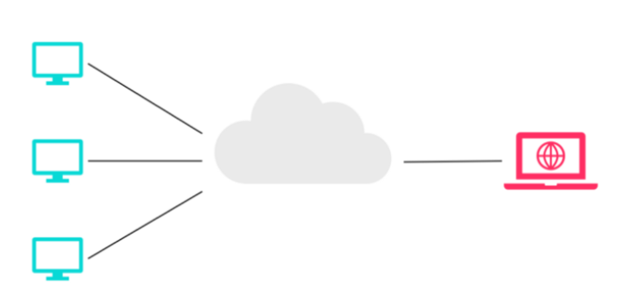

# 软件架构

## 什么是软件架构

**1.决策论**

架构就是一系列重要的决策，这些决策涉及**软件系统的组织**、**组成系统的结构化元素**及其**接口的选择**、**元素之间协作时特定的行为**、**结构化元素**和**行为元素形成更大子系统的组合方式**以及引导这一组织（也就是**这些元素及其接口**）、他们之间的协作以及组合（**架构风格**）。

**2.组成论**

软件架构是软件系统在其操作的某个阶段的运行时的元素的抽象。**一个系统可能由很多层抽象和很多个操作阶段组成,每个抽象和操作阶段都有自己的软件架构。**

**架构是特定约束下决策的结果，并且这是一个循环递进的过程。**

------

特定约束
任何行为、言语、结论都有一个context(上下文)为前提，某一个架构换一个场景可能并不适用。这个context就称为约束。但是必须是特定约束，不能是泛约束(约束必须具体，不能宽泛)。

决策
决策是一个过程，实际上就是选择。选择技术、结构、通信方式等内容，去符合特定约束。

结果
是决策的最终产物，可能是运行良好、满足需求的系统。也可能是一堆文档。如果这个结果是五视图(架构表现形式)、组件、接口、子系统、及其之间的关系，那么这个架构就是软件架构。

完善的需求（功能性、非功能性），实际就是架构的「特定约束」。而对上面这些问题的选择，就是「决策」。这些决策确定后，需要相关的设计图，这些图纸就是你决策的部分结果。最终交付给客户的才是你架构的最终成果。

------

**架构是顶层设计**

------

**从操作层面做决策**：用户从哪里进入、页面应该跳转到哪里、应该输入哪些信息.....这就是流程设计！**从代码层面决策**，代码该怎么写：模块如何组织、包如何组织、类如何组织、方法如何组织......这就是代码设计！
**从系统整体层面决策**：子系统如何组织、组件如何组织、接口如何设计......这就是架构设计！

------

**总结：软件架构是一系列相关的抽象模式，用于指导大型软件系统各个方面的设计，包括架构元件(构成系统的各种组件)、联结器(组件之间通信的路径和机制)、任务流(系统如何使用元件和联结器完成需求)。不仅注重对系统内部(功能因素)的考虑，同时注重对系统外部(非功能因素)的考虑**

## 目标

1.可靠性（Reliable）。软件系统对于用户的商业经营和管理来说极为重要，因此软件系统必须非常可靠。

2.安全性（Secure）。软件系统所承担的交易的商业价值极高，系统的安全性非常重要。

3.可扩展性（SCAlable）。软件必须能够在用户的使用率、用户的数目增加很快的情况下，保持合理的性能。只有这样，才能适应用户的市场扩展得可能性。

4.可定制化（CuSTomizable）。同样的一套软件，可以根据客户群的不同和市场需求的变化进行调整。

5.可扩展性（Extensible）。在新技术出现的时候，一个软件系统应当允许导入新技术，从而对现有系统进行功能和性能的扩展。

6.可维护性（MAIntainable）。软件系统的维护包括两方面，一是排除现有的错误，二是将新的软件需求反映到现有系统中去。一个易于维护系统可以有效地降低技术支持的花费。

7.客户体验（Customer Experience）。软件系统必须易于使用。

8.市场时机（Time to Market）。软件用户要面临同业竞争，软件提供商也要面临同业竞争。以最快的速度争夺市场先机非常重要。

## 一.架构的种类

根据关注的角度不同，可以将架构分成三种

- **逻辑架构：软件系统中元件之间的关系，比如用户界面，数据库，外部系统接口、商业逻辑元件等**

  

  从上面这张图中可以看出，此系统被划分成三个逻辑层次，即表象层次，商业层次和数据持久层次。每一个层次都含有多个逻辑元件

- **物理架构：软件元件是怎样放到硬件上的**
  比如下面这张物理架构图，图中所有的元件都是物理设备，包括网络分流器、代理服务器、WEB服务器、应用服务器、报表服务器、整合服务器、存储服务器、主机等等

  

- **系统架构：系统的非功能性特征，如可扩展性、强壮性、灵活性、可靠性、性能等**

首先，一个软件系统中的元件首先是逻辑元件。这些逻辑元件如何放到硬件上，以及这些元件如何为整个系统的可扩展性、可靠性、强壮性、灵活性、性能等做出贡献，是非常重要的信息。

其次，进行软件设计需要做出的决定中，必然会包括逻辑结构、物理结构，以及它们如何影响到系统的所有非功能性特征。这些决定中会有很多是一旦作出，就很难更改的。

## 二.需求背景

软件需求包括3个不同的层次――**业务需求、用户需求和功能需求。**

**业务需求 （Business requirement）**表示组织或客户高层次的目标。业务需求通常来自项目投资人、购买产品的客户、实际用户的管理者、市场营销部门或产品策划部门。**业务需求描述了组织为什么要开发一个系统**，即组织希望达到的目标。使用**前景和范围（vision and scope）文档**来记录业务需求，这份文档有时也被称作**项目轮廓图或市场需求（project charter 或 market requirement）文档。**

**用户需求 （user requirement）**描述的是用户的目标，或**用户要求系统必须能完成的任务**。用例、场景描述和事件――响应表都是表达用户需求的有效途径。也就是说用户需求描述了用户能使用系统来做些什么。

**功能需求 （functional requirement）**规定开发人员**必须在产品中实现的软件功能**，用户利用这些功能来完成任务，满足业务需求。功能需求**有时也被称作行为需求 （behavīoral requirement）**，因为习惯上总是用“应该”对其进行描述：“系统应该发送电子邮件来通知用户已接受其预定”。**功能需求描述是开发人员需要实现什么**。注意：用户需求不总是被转变成功能需求。产品特性，所谓特性（feature），是指一组逻辑上相关的功能需求，它们为用户提供某项功能，使业务目标 得以满足。对商业软件而言，特性则是一组能被客户识别，并帮助他决定是否购买的需求，也就是产品说明书中用着重号标明的部分。客户希望得到的产品特性和用户的任务相关的需求不完全是一回事。一项特性可以包括多个用例，每个用例又要求实现多项功能需求，以便用户能够执行某项任务。

**系统需求 （system requirement）用于描述包含有多个子系统的产品（即系统）的顶级需求。**系统可以只包含软件系统，也可以既包含软件又包含硬件子系统。人也可以是系统的一部分，因此某些系统功能可能要由人来承担。

**业务规则** 包括企业方针、政府条例、工业标准、会计准则和计算方法等。业务规划本身并非软件需求，因为它们不属于任何特定软件系统的范围。然而，业务规则**常常会限制谁 能够执行某些特定用例，或者规定系统为符合相关规则必须实现某些特定功能。**有时，功能中特定的质量属性（通过功能实现）也源于业务规则。所以，对某些功能需求进行追溯时，会发现其来源正是一条特定的业务规则。

**功能需求记录在软件需求规格说明（SRS）中**。SRS完整地描述了软件系统的预期特性。SRS我们一般把它当作文档，其实，SRS还可以是包含需求信息的数据库 或电子表格；或者是存储在商业需求管理工具中的信息；而对于小型项目，甚至可能是一叠索引卡片。开发、测试、质量保证、项目管理和其他 相关的项目功能都要用到 SRS。

除此之外，对于需求层次，我们还有其它的分法：组织级需求->业务需求->用户需求->功能需求（有时也叫行为需求）。在此不做一一介绍。

除了功能需求外，SRS中还包含**非功能需求，包括性能指标和对质量属性的描述。**

**质量属性 （quality attribute）**对产品的功能描述作了补充，它从不同方面描述了产品的各种特性。这些特性包括**可用性、可移植性、完整性、效率和健壮性**，它们对用户或开发人员都很重要。其他的非功能需求包括系统与外部世界的外部界面，以及对设计与实现的约束可用性（usability）的质量属性，它规定了业务需求中“有效”（efficiently）一词的含义。

约束 （constraint）限制了开发人员设计和构建系统时的选择范围。约束，在产品的架构设计中，是需要被首先考虑的问题。

如果说产品的功能代表了产品的能力，那么产品的质量属性代表了产品的品质，产品的约束代表了产品必须去满足的或者适应的条件！用人说“用户体验”是产品的灵魂，对于个人级的软件这么说或许很恰当，当对于企业级甚至是行业级的产品，其灵魂有两个：一个是产品带个用户的价值，另一个是产品的品质，简单的说，就是价值和品质。但其成为一个产品的前提应该是**满足约束**，否则就不应该设计、开发、进入市场而成为一个垃圾。

## 三、架构的表现形式----4+1视图

**架构视图是对从某一视角或某一点上看到的系统所做的简化描述，描述中涵盖了系统的某一特定方面，而省略了与此方面无关的实体。**

架构要涵盖的内容和决策太多，采用"**分而治之**"的办法从不同视角分别设计；同时，也为软件架构的理解、交流和归档提供方便。

为了最终处理大型的、富有挑战性的架构，该模型包含**五个主要的视图：**

- 逻辑视图（Logical View），设计的对象模型（使用面向对象的设计方法时）。**（系统提供给最终用户的服务，用户关注）**

- 过程视图（Process View），捕捉设计的并发和同步特征。**（并发和集成人员）**
- 物理视图（Physical View），描述了软件到硬件的映射，反映了分布式特性。**（软件到硬件，系统工程人员）**
- 开发视图（Development View），描述了在开发环境中软件的静态组织结构。**（程序员关注）**
- 场景视图（**四个视图有机的结合起来，用例图）**

### **3.1 逻辑视图**

 逻辑试图用来描述**系统的功能需求**，即在为用户提供服务方面系统所应该提供的功能。在逻辑视图中，系统分解成一系列的功能抽象、功能分解与功能分析，这些主要来自问题领域（ProblemDefinition)。在面向对象技术中，表现为对象或对象类的形式，采用抽象、封装和继承的原理。用对象模型来代表逻辑视图，可以用类图（Class Diagram）来描述逻辑视图。**借助于类图和类模板的手段** ，类图用来显示一个类的集合和它们的逻辑关系：**关联、使用、组合、继承**等。相似的类可以划分成**类集合**。类模板关注于单个类，它们强调主要的类操作，并且识别关键的对象特征。

**逻辑视图的表示法：**
　　构件(Components)：类、类服务、参数化类、类层次 
　　连接件(Connectors)：关联、包含聚集、使用、继承、实例化 　 

逻辑视图的风格采用面向对象的风格，其主要的**设计准则是试图在整个系统中保持单一的、一致的对象模型，避免就每个场合或过程产生草率的类和机制的技术说明。**

 

### 3.2   过程视图

过程视图（ProcessView），又称“进程视图”，又称“处理视图”。

过程架构考虑一些**非功能性的需求**，如性能和可用性。**它解决并发性、分布性、系统完整性、容错性的问题，以及逻辑视图的主要抽象如何与进程结构相配合在一起，即定义逻辑视图中的各个类的具体操作是在哪一个线程（Thread）中被执行**。过程视图侧重系统的**运行特性**。服务于系统集成人员，方便后续性能测试

Ø **构件**：进程、简化进程、循环进程

Ø **连接件**：消息、远程过程调用（RPC）、双向消息、事件广播 。

过程视图：关注**进程、线程、对象**等运行时概念，以及相关的**并发、同步和通信**等问题。

进程架构可以在几种层次的抽象上进行描述，**每个层次针对不同的问题**。在**最高的层次**上，进程架构可以视为一组独立执行的**通信程序（叫作"processes"）**的逻辑网络，它们分布在整个一组硬件资源上，**这些资源通过 LAN 或者 WAN 连接起来**。多个逻辑网络可能同时并存，共享相同的物理资源。

接着，我们可以区别**主要任务、次要任务**。主要任务是可以唯一处理的架构元素；次要任务是由于实施原因而引入的局部附加任务（周期性活动、缓冲、暂停等等）。**主要任务的通讯途径**是良好定义的交互任务通信机制：基于消息的同步或异步通信服务、远程过程调用、事件广播等。**次要任务则以会见或共享内存来通信**。在同一过程或处理节点上，主要任务不应对它们的分配做出任何假定。

### 3.3  物理视图

物理视图（PhysicalView）**主要描述硬件配置。服务于系统工程人员**，解决系统的拓扑结构、系统安装、通信等问题。**主要考虑如何把软件映射到硬件上**，也要考虑系统性能、规模、可靠性等。可以与进程视图一起映射。**物理架构主要关注系统非功能性的需求，如可用性、可靠性（容错性），性能（吞吐量）和可伸缩性。**

软件在计算机网络或处理节点上运行，被识别的各种元素（网络、过程、任务和对象），需要被映射至不同的节点；我们希望使用不同的物理配置：一些用于开发和测试，另外一些则用于不同地点和不同客户的部署。因此软件至节点的映射需要高度的灵活性及对源代码产生最小的影响。

**物理视图的表示法**

**Ø  构件：处理器、计算机、其它设备**

**Ø  连接件：通信协议等**

### 3.4开发视图

开发视图（DevelopmentView），描述了在开发环境中软件的静态组织结构，即关注软件开发环境下实际模块的组织，**服务于软件编程人员。**将软件打包成小的程序块（程序库或子系统），它们可以由一位或几位开发人员来开发。子系统可以组织成分层结构，每个层为上一层提供良好定义的接口。

**系统的开发架构用模块和子系统图来表达**，显示了"输出"和"输入"关系。完整的开发架构只有当所有软件元素被识别后才能加以描述。但是，**可以列出控制开发架构的规则：分块、分组和可见性**。

**开发视图的风格通常是层次结构，每个层为上一层提供良好定义的接口，层次越低，通用性越好。**

**开发视图的表示方法：**

**Ø  构件：模块、子系统、层**

**Ø  连接件：参照相关性、模块/过程调用**

大部分情况下，开发架构考虑的内部需求与以下几项因素有关：开发难度、软件管理、重用性和通用性及由工具集、编程语言所带来的限制。开发架构视图是各种活动的基础，如：**需求分配、团队工作的分配（或团队机构）、成本评估和计划、项目进度的监控、软件重用性、移植性和安全性。它是建立产品线的基础。**

### 3.5场景视图

场景视图，又称“用例视图”，它综合所有的视图。用于刻画构件之间的相互关系，将四个视图有机地联系起来。**可以描述一个特定的视图内的构件关系，也可以描述不同视图间的构件关系。**

四种视图的元素通过一组重要场景（更常见的是用例）进行无缝协同工作，我们为场景描述相应的脚本（对象之间和过程之间的交互序列）。在某种意义上场景是最重要的需求抽象，它们的设计使用对象场景图和对象交互图来表示。

场景视图是其他视图的冗余（因此"＋1"），但它起到了两个作用：

- 作为一项驱动因素来发现架构设计过程中的架构元素。

- 作为架构设计结束后的一项验证和说明功能，既以视图的角度来说明，又作为架构原型测试的出发点。

作为一项驱动因素，源于**迭代开发中有场景驱动（scenario-driven）方法。场景驱动方法认为系统大多数关键的功能以场景（或 use cases）的形式被捕获。**关键意味着：最重要的功能，系统存在的理由，或使用频率最高的功能，或体现了必须减轻的一些重要的技术风险。

关于驱动开发方法：

开始阶段:

- 基于风险和重要性为某次迭代选择一些场景。场景可能被归纳为对若干用户需求的抽象。

- 形成"稻草人式的架构"。然后对场景进行"描述"，以识别主要的抽象（类、机制、过程、子系统）。
- 所发现的架构元素被分布到 4 个蓝图中：逻辑蓝图、进程蓝图、开发蓝图和物理蓝图。
- 然后实施、测试、度量该架构，这项分析可能检测到一些缺点或潜在的增强要求。
- 捕获经验教训。

循环阶段:下一个迭代过程开始进行：

- 重新评估风险，

- 扩展考虑的场景选择板。
- 选择能减轻风险或提高结构覆盖的额外的少量场景。

然后:

- 试着在原先的架构中描述这些场景。

- 发现额外的架构元素，或有时还需要找出适应这些场景所需的重要架构变更。
- 更新4个主要视图：逻辑视图、进程视图、开发视图和物理视图。
- 根据变更修订现有的场景。
- 升级实现工具（架构原型）来支持新的、扩展了的场景集合。
- 测试。如果可能的话，在实际的目标环境和负载下进行测试。
- 然后评审这五个视图来检测简洁性、可重用性和通用性的潜在问题。
- 更新设计准则和基本原理。
- 捕获经验教训。

然后:

- 试着在原先的架构中描述这些场景。

- 发现额外的架构元素，或有时还需要找出适应这些场景所需的重要架构变更。
- 更新4个主要视图：逻辑视图、进程视图、开发视图和物理视图。
- 根据变更修订现有的场景。
- 升级实现工具（架构原型）来支持新的、扩展了的场景集合。
- 测试。如果可能的话，在实际的目标环境和负载下进行测试。
- 然后评审这五个视图来检测简洁性、可重用性和通用性的潜在问题。
- 更新设计准则和基本原理。
- 捕获经验教训。

终止循环

为了实际的系统，初始的架构原型需要进行演进 。较好的情况是在经过2 次或 3 次迭代之后，结构变得稳定：主要的抽象都已被找到。子系统和过程都已经完成，以及所有的接口都已经实现。接下来则是软件设计的范畴，这个阶段可能也会用到相似的方法和过程。

**场景视图的表示法：**

场景表示法与组件逻辑视图非常相似，但它使用过程视图的连接符来表示对象之间的交互，对象实例使用实线来表达。

## 四、UML中的图和各视图的对应关系

场景视图：用例图

 逻辑视图：类图和对象图

开发视图：类图和组件图

进程视图：顺序图、协作图、状态图、活动图、组件图

部署视图：部署图

## 五、架构的文档化

架构设计中产生的文档可以归结为两种：

- 软件架构文档，其结构遵循"4+1"视图（请对照下图3，一个典型的提纲）
- 软件设计准则，捕获了最重要的设计决策。这些决策必须被遵守，以保持系统架构的完整性。 

## 六、软件架构的作用

**1、开发新产品过程中软件架构所具备的作用分析**

所谓的软件架构则是属于在现实的世界与计算机领域所搭建起来的一座沟通的桥梁

第一点就是进行业务目标的上乘。从本质上来看，软件架构往往存在着出于将业务目标完成而必须开展相应的大局规划的责任

第二点所指的就是进行技术决策的下接。凭借着把面向业务的相关需求往面向技术方向转向的软件架构设计方案，这可以将行之有效的限制与指导提供给后续的技术开发工作

第三点就是有效的将新产品的质量提升；第四点所指的就是进相应的新产品开发过程的组织；第五点所指的就是借助于相应的迭代实施相应新产品开展与增量的交付；第六点则是说控制所具备的复杂性，立足于相应的分而治之的思想，

**2、 开发软件产品过程中系统架构所具备的作用分析**

第一就是将所具备的相应的核心知识予以固话；第二就是可以提供相应的可重用资产；第三就是将产品推出的周期进行有效的缩短；第四就是使得产品开发与维护的总成本得以最大限度的降低；第五就是将产品的质量有效的提升；第六就是为批量控制提供有效的支持。

**3、 软件产品线架构所具备的特点分析**

第一个作用就是应该将一系列的明确许可的变化进行考虑；第二个作用所指的就是必须做到文档化；第三个作用就是说应该可以存在着相应的产品创建者指南，将实例化架构的整个过程进行描述。

**4、维护软件过程中软件架构的作用分析**

从本质上来看，相应的软件维护工作主要的来源是Bug与需求变更。往往修复一个Bug与增加一个新的功能，那么通常都会涉及到架构环节的一条模块协作链，针对这样的情况，软件架构比有利于维护工作的开展；反之，如果对于架构并不能了解，相应的进行程序的盲目修改，这也就会存在着可能性对架构设计的思路造成未必，从而导致整个系统所存在的架构逐步显得比较混乱，这也就会存在着可能性导致出现不可思议的Bug与问题。

**5、软件升级过程中软件架构的作用分析**

相应的软件架构则是通过对软件系统实施持续性的修改，还应该必须做好重构，往往对其实施重构主要是两种状况：第一种状况就是特别混乱的架构，从而导致实施一个比较小的改动就会出现牵动全身；第二种状况所指的就是即将实施的升级软件存在着比较大的力度，之前的软件架构与新的需求根本就不能适应。相应的软件架构予以重构则是属于再工程的一种情况，往往必须实施的步骤为逆向工程、重新规划、正向工程这样的三个步骤

## 七.常见的软件架构风格

### 7.1数据流风格（批处理序列；管道/过滤器）

1.**批处理**

**强调数据作为一个整体（数据必须是完整的，以整体的方式传递）**

**典型应用**：经典数据处理；程序开发；window下的BAT程序。

2.**管道/过滤器**

**(构件–>过滤器;连接件–>管道) （数据流的形式）**

**优点**：a）使软件具有良好的隐蔽性和高内聚、低耦合的特点 b）支持软件重用 c）系统维护和增强系统性能简单 d）支持并发执行

**缺点**：a）通常导致进程成为批处理的结构 b）不适合处理交互的应用 c）由于每个过滤器都增加了解析和合成数据的工作，导致系统性能下降。

### 7.2调用/返回风格

- **主程序/子程序**

计算构件作为子程序协作工作,由一个主程序顺序地调用这些子程序,构件通过共享存储区交换数据. 曾经作为结构化开发方法的主要选择，具有结构清晰，维护方便的特点，缺点是主子程序划分缺乏标准，较难实现不同设计人员间设计的子程序复用。

**采用单线程控制，把问题划分为若干处理步骤，构件即为主程序和子程序。**

- **面向对象风格**

面向对象在类的层次实现高度内聚，整个系统通过不同类的组合调用实现不同功能，便于类的复用，只是面向对象是一个通用风格，类的划分不同设计人员设计结果有很大不同，对实际架构设计指导意义不大。

- **层次结构风格**

分层结构将整个系统按照抽象层次不同分为多层，每个层次的程序只需要负责与相邻的上下两层打交道，简化了系统中调用关系复杂度。允许每层用不同的方法实现，为软件重用提供了强大的支持。（二层C/S、三层C/S、MVC、MVP、MVVP、RIA富互联网应用）

### 二层及三层C/S架构风格

二层：S：服务器（后台）复制数据管理；C：客户机（前台）完成与用户的交互。

三层：**表示层**：应用的用户接口，担任用户与应用间的对话功能；**功能层**：应用实体，实现业务的处理逻辑；**数据层**：数据管理系统，负责对数据库数据的读写。

**表现层（Web层）**
负责接收客户端请求，向客户端响应结果，通常客户端使用http协议请求 web，web层需要接收 http请求，完成http响应。
表现层包括展示层和控制层：控制层负责接收请求，展示层负责结果的展示。
表现层依赖业务层，接收到客户端请求一般会调用业务层进行业务处理，并将处理结果响应给客户端。
表现层的设计一般都使用 MVC 模型。 MVC 是表现层的设计模型，和其他层没有关系。
**业务层 （Service层）**
它负责业务逻辑处理，和我们开发项目的需求息息相关。web层依赖业务层，但是业务层不依赖Web层。
业务层在业务处理时可能会依赖持久层，如果要对数据持久化需要保证事务一致性。 (事务应该放到业务层来控制）
**持久层 （dao 层）**
负责数据持久化，包括数据层即数据库和数据访问层，数据库是对数据进行持久化的载体，数据访问层是业务层和持久层交互的接口；业务层需要通过数据访问层将数据持久化到数据库中。
持久层就是和数据库交互，对数据库表进行增删改査的。

**优点:**

（1）允许合理地划分三层结构的功能，使之在逻辑上保持相对独立性，从而使整个系统的逻辑结构更为清晰，能提高系统和软件的可维护性和可扩展性。(逻辑独立清晰, 可维护性/可扩展性)

（2）允许更灵活有效地选用相应的平台和硬件系统，使之在处理负荷能力上与处理特性上分别适应于结构清晰的三层；并且这些平台和各个组成部分可以具有良好的可升级性和开放性。(可升级性/开放性)

（3）三层C/S架构中，应用的各层可以并行开发，各层也可以选择各自最适合的开发语言。使之能并行地而且是高效地进行开发，达到较高的性能价格比；对每一层的处理逻辑的开发和维护也会更容易些。(开发维护成本/速度/技术门槛)

（4）允许充分利用功能层有效地隔离开表示层与数据层，未授权的用户难以绕过功能层而利用数据库工具或黑客手段去非法地访问数据层，这就为严格的安全管理奠定了坚实的基础；整个系统的管理层次也更加合理和可控制。(安全)

### **三层B/S架构风格**

（浏览器/服务器）

用户在使用系统时，仅仅需要一个浏览器就可运行全部的模块，真正达到了“零客户端”的功能，很容易在运行时自动升级。(客户端)

基于B/S架构的软件，系统安装、修改和维护全在服务器端解决。(服务端)

B/S架构还提供了异种机、异种网、异种应用服务的联机、联网、统一服务的最现实的开放性基础。(开放性)

**缺点:**

B/S架构缺乏对动态页面的支持能力，**没有集成有效的数据库处理功能。**
B/S架构的**系统扩展能力差，安全性难以控制。**
采用B/S架构的应用系统，在数据查询等**响应速度**上，要远远地低于C/S架构。(性能)
B/S架构的数据提交一般以页面为单位，数据的动态交互性不强，不利于OLTP应用.

### MVC的架构风格

**模型(model)－视图(view)－控制器(controller)**

它是分层架构风格的一种。主要解决 将与 UI 相关的逻辑都定义在针对视图的相关元素的事件上 的问题。

**MVC 中各个部分的分工与协作：**

Model 是对应用状态和业务功能的封装，我们可以将它理解为同时包含**数据和行为的领域模型**。Model 接受 Controller 的请求并完成相应的业务处理，在状态改变的时候向 View 发出相应的通知。
View 实现可视化界面的呈现并捕捉最终用户的交互操作（例如鼠标和键盘的操作）。
View 捕获到用户交互操作后会直接转发给 Controller，后者完成相应的 UI 逻辑。如果需要涉及业务功能的调用，Controller 会直接调用 Model。在完成 UI 处理后，Controller 会根据需要控制原 View 或者创建新的 View 对用户交互操作予以响应。

### MVP的架构风格

MVP 是从经典的模式 MVC 演变而来，它们的基本思想有相通的地方：Controller/Presenter 负责逻辑的处理，Model 提供数据，View 负责显示。

当然 MVP 与 MVC 也有一些显著的区别，MVC 模式中元素之间“混乱”的交互主要体现在允许 View 和 Model 直接进行“交流”，这在 MVP 模式中是不允许的。**在 MVP 中 View 并不直接使用 Model，它们之间的通信是通过 Presenter （MVC 中的 Controller）来进行的**，所有的交互都发生在 Presenter 内部，而在 MVC 中 View 会直接从 Model 中读取数据而不是通过 Controller，从而避免了 View 和 Model 之间的耦合。

**避免了view与model之间的耦合，进一步降低了presenter对view的依赖。**

### 7.3独立构件风格

- **进程通讯**

构件是独立的过程（命名过程），连接件是消息传递（可以点对点、异步和同步方式及远程过程调用等）

- **事件系统子风格（隐式调用 ）**

构件不直接调用一个过程，而是触发或广播一个或多个事件。

### 7.4虚拟机风格

- **解释器**

**特点**：可以仿真硬件执行过程和一些关键应用。
**包含：**完成解释工作的解释引擎，一个包含将被解释的代码的存储区，一个记录解释引擎当前工作状态的数据结构，以及一个记录源代码被解释执行进度的数据结构。
**缺点**：执行效率低
典型应用：专家系统。

**基于规则的系统**
特点：包括规则集、规则解释器、规则/数据选择器及工作内存。

### 7.5仓库风格

**在仓库风格中，有两种不同的构件：中央数据结构说明当前状态，独立构件在中央数据存储上执行。**

- **数据库系统**

构件主要有两大类,一个是**中央共享数据源**,保存当前系统的数据状态,另一个是**多个独立处理元素**,处理元素对数据元素进行操作。中央数据库管理系统通过自身机制如数据排它锁，共享锁等，实现数据高速访问，数据一致性，数据完整性。同时各独立数据处理单元之间互相不受约束。 (如编译器，传统编译器采用批处理架构，现代编译器采用数据共享架构风格。分析树是共享数据。)

- **超文本系统**

主要应用于静态网页。

- **黑板风格**

由一个作为全局共享数据的黑板，**一个控制单元和多个知识源组成**，主要应用与专家问题解决系统。通过专家知识和反馈逐步得到正确结果. (如语音识别)

### 闭环控制架构

- **过程控制**

工业中的过程控制是指以温度、压力、流量、液位和成分等工艺参数作为被控变量的自动控制。过程控制也称实时控制，是计算机及时的采集检测数据，按最佳值迅速地对控制对象进行自动控制和自动调节，如数控机床和生产流水线的控制等。（比如空调制冷，温度大于设定温度制冷，小于等于时停止，一旦大于继续运作）

- **C2**

通过连接件绑定在一起按照一组规则运作的并行构件。

1. 构建和连接件都有一个顶部和一个底部
2. 构建的顶部都要连接连接件的底部，构建的底部都要连接连接件的顶部，构建 之间不允许直连。
3. 一个连接进行直接连接时，必须有其中一个的底部到另一个的顶部。

## 八.常见的软件架构

### 序言

架构模式是对给定上下文的软件架构中常见问题的一种通用的可复用的解决方案。一种模式就是特定上下文的问题的一种解决方案。
大体上，主要有下面这7种架构模式：

- 分层架构
- 多层架构
- 管道/过滤器架构
- 客户端/服务器架构
- 模型/视图/控制器架构
- 事件驱动架构
- 微服务架构

### 8.1分层架构

最常见的架构模式就是分层架构或者称为 n 层架构。

大部分软件架构师、设计师和开发者都对这个架构模式非常熟悉。尽管对于层的数量和类型没有具体限制，但大部分分层架构主要由四层组成：展现层、业务层、持久层和数据库层，如下图所示。

**上下文**
所有复杂的系统都会经历独立地发展和衍化系统各个部分的需要。出于这个原因，系统开发者需要对关注点进行清晰且条理分明的分离，以便系统的各个模块可以独立地开发和维护。

**问题**
软件需要以这样一种方式分割：各个模块可以独自开发和衍化，各自部分之间的交互非常少，支持可移植性、可修改性和复用性。

**方案**
为了实现关注点分离，分层模式将软件分割成各个单元（称为“层”）。每一层都是一组模块，提供了一组高内聚的服务。其使用必须是单向的。层将一组软件作为一个完整的分区，每个分区暴露一个公开接口。

- 第一个概念是，每一层都有特定的角色和职责。例如，展现层负责处理所有的用户界面。分层架构的这种关注点分离，让构建高效的角色和职责非常简单。
- 第二个概念是，分层架构模式是一个技术性的分区架构，而非一个领域性的分区架构。它们是由组件组成的，而不是领域。
- 最后一个概念是，分层架构中的每一层都被标记为封闭或者开放。封闭层意味着请求从一层移到另一层，它必须通过它正下面的这一层才能达到下面这一层的再下一层。请求不能跳过任何层。

**表现层（presentation）：用户界面，负责视觉和用户互动**

**业务层（business）：实现业务逻辑**

**持久层（persistence）：提供数据，SQL 语句就放在这一层**

**数据库（database） ：保存数据**

优点

- 结构简单，容易理解和开发

- 不同技能的程序员可以分工，负责不同的层，天然适合大多数软件公司的组织架构
- 每一层都可以独立测试，其他层的接口通过模拟解决

缺点

- 一旦环境变化，需要代码调整或增加功能时，通常比较麻烦和费时
- 部署比较麻烦，即使只修改一个小地方，往往需要整个软件重新部署，不容易做持续发布
- 软件升级时，可能需要整个服务暂停
- 扩展性差。用户请求大量增加时，必须依次扩展每一层，由于每一层内部是耦合的，扩展会很困难 

**用途**
**我们应该将这种方式应用于小型简单的应用程序或网站。对于预算和时间非常紧张的场景，这是一个不错的选择。**

### 8.2多层架构

**一个多层模式示例：消费者网站 J2EE**
许多系统的执行结构被组织成一系列逻辑组件分组。每个分组被称为一个层。

**上下文**
在一个**分布式部署**中，通常需要将系统的基础设施分到不同的子集中。

**问题**
我们如何将系统分割到多个计算上独立的执行结构：由一些通信媒介连接的软件和硬件组？

**弱点**
大量前期成本和复杂性。

**用途**
用在**分布式**系统中。

### 8.3管道/过滤器架构

软件架构中反复出现的一种模式是管道 - 过滤器（pipe-filter）模式。

**上下文**

许多系统需要转换从输入到输出的离散数据流。许多类型转换在实践中重复出现，因此将其创建成独立的可复用的部分，这是比较理想的。

**问题**

这些系统需要被分割成可复用的松耦合的组件，组件之间拥有简单通用的交互机制。这样它们就可以灵活地相互结合。这些通用松耦合的组件就很容易复用。那些独立的组件可以并行执行。

**方案**

这种架构中的管道构成了过滤器之间的通信通道。第一个概念是，由于性能原因，每个管道都是非定向的和点对点的，接受来自一个源的输入并经常直接输出到另外一个源。

**在这种模式中，有如下四种过滤器。**

- producer（source）：一个过程的起点。
- transformer (map)：对一些或所有数据进行转换。
- tester (reduce)：测试一个或多个条件。
- consumer (sink)：终点。

**弱点**

不太适合交互性的系统，因为它们的转换特性。

过多的解析和反解析会导致性能损失，也会增加编写过滤器本身的复杂性。

**用途**

管道 - 过滤器架构用于各种应用程序，特别是简化单项处理的任务，例如 EDI、ETL 工具。

编译器：连续的过滤器执行词法分析、语法分析、语义分析和代码生成。

### 8.4C/S架构

**上下文**

有许多共享资源和服务是大量分布式的客户端希望访问的，我们希望控制访问或服务质量。

**问题**

通过管理一组共享资源和服务，我们可以通过分解公共服务并在单个位置或少数位置进行修改来提高可修改性和复用性。我们想要通过在将资源本身分布在多个物理服务器上的同时集中控制这些资源和服务，来提高可伸缩性和可用性。

**方案**

在客户端 - 服务器模式中，组件和连接器具有特定的行为。

称为“客户端”的组件将请求发送到称为“服务器”的组件，然后等待回复。
服务器组件接收到客户端的请求并向其发送回复。

**弱点**

服务器会成为性能瓶颈和单点故障位置。

在系统建成后，关于功能位置（在客户端还是在服务器）的决策通常是复杂的而且变动成本很大。

**用途**

对于有许多组件（客户端）发送请求到另外一些提供服务的组件（服务器）的系统，我们可以使用客户端 - 服务器模式来建模这个系统的一部分：在线应用程序，例如电子邮件、共享文档或银行服务。

### 8.5MVC架构

如上 MVP MVC

### 8.6事件驱动架构

事件（event）是**状态发生变化时，软件发出的通知。**

事件驱动架构就是**通过事件进行通信的软件架构**。它分成四个部分。

- 事件队列（event queue）：接收事件的入口
- 分发器（event mediator）：将不同的事件分发到不同的业务逻辑单元
- 事件通道（event channel）：分发器与处理器之间的联系渠道
- 事件处理器（event processor）：实现业务逻辑，处理完成后会发出事件，触发下一步操作

对于简单的项目，事件队列、分发器和事件通道，可以合为一体，整个软件就分成事件代理和事件处理器两部分。

**优点**

- 分布式的异步架构，事件处理器之间高度解耦，软件的扩展性好

- 适用性广，各种类型的项目都可以用
- 性能较好，因为事件的异步本质，软件不易产生堵塞
- 事件处理器可以独立地加载和卸载，容易部署

**缺点**

- 涉及异步编程（要考虑远程通信、失去响应等情况），开发相对复杂
- 难以支持原子性操作，因为事件通过会涉及多个处理器，很难回滚
- 分布式和异步特性导致这个架构较难测试

### 8.7微服务架构

部署基于服务器的企业应用程序，支持各种浏览器和原生移动客户端。 应用程序通过执行业务逻辑、访问数据库、与其它系统交换信息并返回响应来处理客户端请求。**这个应用程序可能会暴露一个第三方 API**。

问题

一体化应用程序会变得过于庞大和复杂，无法得到有效支持和部署来实现最优的分布式资源利用，例如在云环境中。

将应用程序构建成服务套件。每个服务都是独立部署和可扩展的，拥有自己的 API 边界。**不同的服务可以用不同的编程语言编写，管理它们自己的数据库，由不同的团队开发。**这些单元都是分布式的，互相解耦，**通过远程通信协议（比如REST、SOAP）联系。**

**微服务架构分成三种实现模式。**

- RESTful API 模式：服务通过 API 提供，云服务就属于这一类
- RESTful 应用模式：服务通过传统的网络协议或者应用协议提供，背后通常是一个多功能的应用程序，常见于企业内部
- 集中消息模式：采用消息代理（message broker），可以实现消息队列、负载均衡、统一日志和异常处理，缺点是会出现单点失败，消息代理可能要做成集群

**优点**

- 扩展性好，各个服务之间低耦合

- 容易部署，软件从单一可部署单元，被拆成了多个服务，每个服务都是可部署单元
- 容易开发，每个组件都可以进行持续集成式的开发，可以做到实时部署，不间断地升级
- 易于测试，可以单独测试每一个服务

**缺点**

- 由于强调互相独立和低耦合，服务可能会拆分得很细。这导致系统依赖大量的微服务，变得很凌乱和笨重，性能也会不佳。
- 一旦服务之间需要通信（即一个服务要用到另一个服务），整个架构就会变得复杂。典型的例子就是一些通用的 Utility 类，一种解决方案是把它们拷贝到每一个服务中去，用冗余换取架构的简单性。
- 分布式的本质使得这种架构很难实现原子性操作，交易回滚会比较困难。

用途

许多使用场景都可以应用微服务架构，特别是那些涉及大量数据管道的场景。例如，一个微服务系统对关于一个公司的零售店销售的报表系统会比较理想。数据展现过程的每一步都会被一个微服务处理：数据收集、清理、规范化、浓缩、聚合、报告等。

### 8.8微核架构

微核架构又称为"插件架构"（plug-in architecture），指的是**软件的内核相对较小，主要功能和业务逻辑都通过插件实现**。

内核（core）通常只包含系统运行的最小功能。**插件则是互相独立的，插件之间的通信，应该减少到最低，避免出现互相依赖的问题。**

**优点**

- 良好的功能延伸性（extensibility），需要什么功能，开发一个插件即可
- 功能之间是隔离的，插件可以独立的加载和卸载，使得它比较容易部署，
- 可定制性高，适应不同的开发需要
- 可以渐进式地开发，逐步增加功能

**缺点**

- 扩展性（scalability）差，内核通常是一个独立单元，不容易做成分布式
- 开发难度相对较高，因为涉及到插件与内核的通信，以及内部的插件登记机制

### 8.9云架构

云结构**主要解决扩展性和并发的问题，是最容易扩展的架构。**

它的**高扩展性，主要原因**是**没使用中央数据库**，而是把**数据都复制到内存中，变成可复制的内存数据单元**。然后，业务处理能力封装成一个个处理单元（prcessing unit）。访问量增加，就新建处理单元；访问量减少，就关闭处理单元。由于没有中央数据库，所以扩展性的最大瓶颈消失了。由于每个处理单元的数据都在内存里，**最好要进行数据持久化**。

这个模式主要分成两部分：处理单元（processing unit）和虚拟中间件（virtualized middleware）。

- 处理单元：实现业务逻辑
- 虚拟中间件：负责通信、保持sessions、数据复制、分布式处理、处理单元的部署。

**虚拟中间件又包含四个组件。**

- 消息中间件（Messaging Grid）：管理用户请求和session，当一个请求进来以后，决定分配给哪一个处理单元。

- 数据中间件（Data Grid）：将数据复制到每一个处理单元，即数据同步。保证某个处理单元都得到同样的数据。
- 处理中间件（Processing Grid）：可选，如果一个请求涉及不同类型的处理单元，该中间件负责协调处理单元
- 部署中间件（Deployment Manager）：负责处理单元的启动和关闭，监控负载和响应时间，当负载增加，就新启动处理单元，负载减少，就关闭处理单元。

**优点**

- 高负载，高扩展性

- 动态部署

**缺点**

- 实现复杂，成本较高
- 主要适合网站类应用，**不合适大量数据吞吐的大型数据库应用**
- 较难测试

## 九.分布式

1.分布式系统一定是由多个节点组成的系统。其中，节点指的是计算机服务器，而且这些节点一般不是孤立的，而是互通的。

2.这些连通的节点上部署了我们的节点，并且相互的操作会有协同。

------

不同的业务模块部署在不同的服务器上或者同一个业务模块分拆多个子业务，部署在不同的服务器上，解决高并发的问题，提供可扩展性以及高可用性，业务中使用分布式的场景主要有分布式存储以及分布式计算。分布式存储中可以将数据分片到多个节点上，不仅可以提高性能（可扩展性），同时也可以使用多个节点对同一份数据进行备份。

------

#### **分布式环境的特点**

1. 分布性：服务部署空间具有多样性
2. 并发性：程序运行过程中，并发性操作是很常见的。比如同一个分布式系统中的多个节点，同时访问一个共享资源。数据库、分布式存储
3. 无序性：进程之间的消息通信，会出现顺序不一致问题

#### **分布式环境下面临的问题**

1. 网络通信：网络本身的不可靠性，因此会涉及到一些网络通信问题
2. 网络分区(脑裂)：当网络发生异常导致分布式系统中部分节点之间的网络延时不断增大，最终导致组成分布式架构的所有节点，只有部分节点能够正常通信
3. 三态：在分布式架构里面多了个状态：超时，所以有三态：成功、失败、超时
4. 分布式事务：ACID(原子性、一致性、隔离性、持久性)
5. 中心化和去中心化：冷备或者热备

分布式架构里面，很多的架构思想采用的是：当集群发生故障的时候，集群中的人群会自动“选举”出一个新的领导。

最典型的是：zookeeper / etcd

#### CAP/BASE

## 

## 扩展（MVVM  RIA)--相关内容（浅显）

3. **分布式架构**

客户机/服务器系统开发时可以采用不同的分布式计算架构：

分布式表示架构是将表示层和表示逻辑层迁移到客户机，应用逻辑层、数据处理层和数据层仍保留在服务器上（类似三层CS架构的两层应用）；
分布式数据架构是将数据层和数据处理层放置于服务器，应用逻辑层、表示逻辑层和表示层放置于客户机（类似两层CS架构）；
分布式数据和应用架构数据层和数据处理层放置在数据服务器上，应用逻辑层放置在应用服务器上，表示逻辑层和表示层放置在客户机（类似三层CS架构）。
4. ANSI

在ANSI/IEEE 1471-2000标准中，系统是为了达成利益相关人（Stakeholder）的某些使命（Mission），在特定环境（Enviroment）中构建的。每一个系统都有一个架构（Architecture）。架构（Architecture）是对所有利益相关人的关注点（Concern）的响应和回答，通过架构描述（Architecture Description）来说明。每一个利益相关人都有各自的关注点。这些关注点是指对其重要的，与系统的开发、运营或其他方面相关的利益。架构描述（Architecture Description）本质上是多视图的。每一个视图（View）是从一个特定的视角（Viewpoint）来表述架构的某一个独立的方面。试图用一个单一的视图来覆盖所有的关注点当然是最好的，但实际上这种表述方式将很难理解。视角（Viewpoint）的选择，基于要解决哪些利益相关人的哪些关注点。它决定了用来创建视图的语言、符号和模型等，以及任何与创建视图相关的建模方法或者分析技术。一个视图（View）包括一个或者多个架构模型（Model），一个模型也可能参与多个视图。模型较文本的表述的好处在于，可以更容易的可视化、检查、分析、管理和集成。

5. 需求和架构

需求和软件架构设计面临的是不同的对象：一个是问题空间；另一个是解空间。保持两者的可追踪性和转换，一直是软件工程领域追求的目标。

6. 架构风格和设计模式的区别

架构风格往往是从全局的角度来考虑问题，他是一种独立于实际问题的通用组织结构。例如，常用的B/S架构，在很多不同的系统中，都有应用。

而设计模式着眼于解决某一特定的局部问题，是一种局部解决方案的应用。例如，在很多的软件系统中，创建对象时，希望有统一的机制对这些对象的创建进行管理，所以出现了工厂模式，创建者模式等设计模式。比如java内存垃圾的回收机制也做成了一种设计模式。

7. 软件架构需求

软件架构需求是指用户对目标软件系统在功能、行为、性能和设计约束等方面的期望。需求过程主要是获取用户需求，标识系统中所要用到的构件，并进行架构需求评审。其中标识构件又详细分为生成类图、对类图进行分组和将类打包成构件三步。软件架构需求并不应该包括设计构件的过程。

8. 面向构件的编程（COP）

面向构件的编程（COP）关注于如何支持建立面向构件的解决方案。一个基于一般 OOP 风格的 COP 定义如下（Szyperski，1995）： “面向构件的编程需要下列基本的支持：

多态性（可替代性）；
模块封装性（高层次信息的隐藏）；
后期的绑定和装载（部署独立性）；
安全性（类型和模块安全性）。”
系统构件组装分为三个不同的层次：定制（ Customization）、集成（Integration）、扩展（Extension）。这三个层次对应于构件组装过程中的不同任务。

9. OMG接口定义语言IDL

IDL 是一种接口定义语言，具体的定义会涉及到接口以及相关部分。文件包含的主要元素有：接口描述、模块定义、类型定义、常量定义、异常、值类型。接口描述是IDL文件中最核心的内容。

由于IDL只是一种接口定义语言，最终还是要落地与语言对接的，所以IDL的数据类型要与实现语言进行映射。以Java为例，IDL接口映射为Java类，而该接口的操作映射为相应的成员函数。模块定义映射为Java 语言中的包 (Package)或C++的namespaces。

9. 扩展知识

一个软件的架构设计是随着技术的不断进步而不断变化的。以编译器为例，其主流架构经历了管道-过滤器到数据共享为中心的转变过程。早期的编译器采用管道-过滤器架构风格，以文本形式输入的代码被逐步转化为各种形式，最终生成可执行代码。早期的编译器采用管道-过滤器架构风格，并且大多数编译器在词法分析时创造独立的符号表，在其后的阶段会不断修改符号表，因此符号表并不是程序数据的一部分。现代的编译器采用以数据共享为中心的架构风格，主要关心编译过程中程序的中间表示。现代的编译器采用以数据共享为中心的架构风格，分析树是在语法分析阶段结束后才产生作为语义分析的输入，分析树是数据中心中重要的共享数据，为后续的语义分析提供了帮助。

